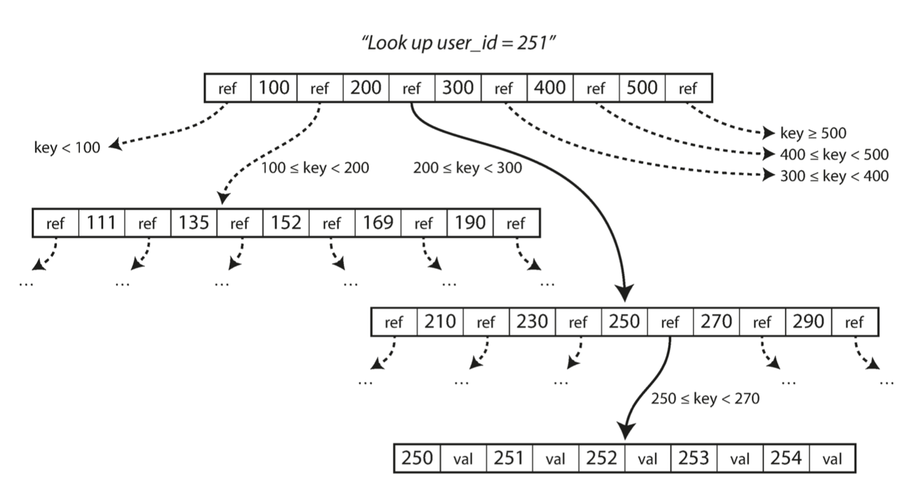

# 3. Storage and Retrieval
On the most basic level, a database needs to do two things: when you give it some data, it should store the data, and when you ask it again later, it should give the data back to you. In order to tune a storage engine to perform well on your kind of workload, you need to have a rough idea of what the storage engine is doing under the hood. There is a big difference between storage engines that are optimized for transactional workloads and those that are optimized for analytics.

Many databases internally use a log (an append-only file). An index is an additional structure that is derived from the primary data. Many databases allow you to add and remove indexes, which affects the query performance. Maintaining additional structures incurs overhead, especially on writes, because the index also needs to be updated every time data is written.

This is an important trade-off in storage systems: well-chosen indexes speed up read queries, but every index slows down writes. Therefore, databases don’t usually index everything by default, but require you — the app developer or database admin - choose indexes manually, using your knowledge of the application’s typical query patterns. You can then choose the indexes that give your application the greatest benefit, without introducing more overhead than necessary.

## Hash Indexes
Bitcask offers high-performance reads and writes, subject to the requirement that all the keys fit in the available RAM, since the hash map is kept completely in memory. A storage engine like Bitcask is well suited to situations where the value for each key is updated frequently. For example, the key might be a video URL, and the value might be the number of times it has been played. In this case, there are a lot of writes, but there are not too many distinct keys—you have a large number of writes per key, but it’s feasible to keep all keys in memory. Hash table does make range queries less efficient. 

If we only ever append to a file — how do we avoid running out of disk space? A good solution is to break the log into segments of a certain size, and perform compaction on them - throw away duplicate keys, and keep only the most recent update for each key. we can also merge several segments together during compaction. The merging and compaction of frozen segments can be done in the background, we so read and write requests are not affected.

CSV is not the best format for a log. It’s faster and simpler to use a binary format that first encodes the length of a string in bytes, followed by the raw string (without need for escaping).

## SSTables and LSM-Trees
If we require the sequence of key-value pairs to be sorted by key, we obtain Sorted String Table (SSTable). Its advantages over log segments with hash indexes is: 
- merging sorted segments is simple & efficient
- To find a particular key in the file, you no longer need to keep an index of all the keys in memory, you only need a subset of them in memory (one key for every few kbs of offset file).
- Allows for grouping and compression of blocks

Maintaining a sorted structure on disk is possible with B-Trees, and maintaining it in memory is easy with tree data structures such as red-black trees or AVL trees. With these data structures, you can insert keys in any order and read them back in sorted order.

We can now make our storage engine work as follows:
- For a new write, add it to an in-memory balanced tree data structure, aka, a memtable (e.g. red-black tree).
- When the memtable gets bigger than some MBs, write it out to disk as an SSTable file - it becomes the most recent segment of the database. While the SSTable is being written out to disk, writes can continue to a new memtable.
- In order to serve a read request, first try to find the key in the memtable, then in the most recent on-disk segment, then in the next-older segment, etc.
- Run a merging and compaction process in the background to combine segment files and to discard old values.
- If the database crashes, the most recent writes in the memtable are lost. To avoid this, keep a separate append only log on disk, whose only purpose is to restore the memtable after a crash. Every time the memtable is written out to an SSTable, the corresponding log can be discarded.

This indexing structure was first described as Log-Structured Merge-Tree (LSM-Tree). 

Examples: LevelDB, RocksDB, Cassandra, HBase, Lucene, Elasticsearch, Solr, ...

## B-Trees (Self-balancing search tree)
It is the most widely used indexing structure. They are the standard index implementation in almost all relational databases, and many nonrelational databases use them too.

B-trees break the database down into fixed-size blocks or pages, traditionally 4 KB in size, and read or write one page at a time. Each page can be identified using an address, which allows one page to refer to another (similar to a pointer, but on disk instead of in memory).

One page is designated as the root of the B-tree; it is where you start for each lookups. The page contains keys and their references to child pages. Each child is responsible for a continuous range of keys:

The number of references to child pages in one page of the B-tree is called the `branching factor`. In practice, typically it is several hundred. 

To update the value for an existing key in a B-tree, search for the leaf page containing that key, change the value in that page, and write the page back to disk (all references remain valid). 

To add a new key, find the page whose range encompasses the new key and add it to that page. If there isn’t enough space in the page to accommodate the new key, it is split into two half-full pages, and the parent page is updated to account for the new subdivision of key ranges. 

This algorithm ensures the tree remains `balanced`: a B-tree with n keys always has a depth of O(log n). Most databases can fit into a B-tree that is three or four levels deep, so you don’t need to follow many page references to find the page you are looking for.

To make the database resilient to crashes, it is common for B-tree implementations to include a write-ahead log (WAL). This is an append-only file to which every B-tree modification must be written before it can be applied to the pages of the tree itself.  

## Comparing B-Trees and LSM-Trees
`LSM-trees are typically faster for writes, whereas B-trees are faster for reads.` However, you need to test systems with your particular workload in order to make a valid comparison. There is no quick and easy rule for determining which type of storage engine is better for your use case, so it is worth testing empirically.

LSM-trees are typically able to sustain higher write throughput than B-trees, partly because they sometimes have lower write amplification (one write to the database resulting in multiple writes to the disk over the course of the database’s lifetime). LSM-trees can be compressed better, and thus often produce smaller files on disk than B-trees (who leave some disk space unused due to fragmentation). Lower write amplification and reduced fragmentation are also advantageous on SSDs: representing data more compactly allows more read and write requests within the available I/O bandwidth.

A downside of log-structured storage is that the compaction process can sometimes interfere with the performance of ongoing reads and writes (sometimes a request needs to wait while the disk finishes an expensive compaction operation, and the bigger the database, the more disk bandwidth is required for compaction). So sometimes the response time of queries to log-structured storage engines can be quite high, while B-trees can be more predictable. To prevent compaction cannot keep up with incoming writes, you need explicit monitoring for this. 

An advantage of B-trees is that each key exists in exactly one place in the index. This makes B-trees attractive in databases that want to offer strong transactional semantics: in many relational databases, transaction isolation is implemented using locks on ranges of keys, and in a B-tree index, those locks can be directly attached to the tree. 

Both B-trees and log-structured indexes can be used as secondary indexes.

## In-memory databases
Products such as VoltDB, MemSQL, and Oracle TimesTen are in-memory databases with a relational model. RAMCloud is an open source, in-memory key-value store with durability (using a log-structured approach for the data in memory as well as the data on disk). Redis and Couchbase provide weak durability by writing to disk asynchronously.

To support datasets larger than the available memory, anti-caching approach works by evicting the least recently used data from memory to disk when there is not enough memory, and loading it back into memory when it is accessed again in the future. This is similar to what operating systems do with virtual memory and swap files, but the database can manage memory more efficiently than the OS, as it can work at the granularity of individual records rather than entire memory pages.

## OLTP and OLAP
An application typically looks up a small number of records by some key, using an index. Records are inserted or updated based on the user’s input. Because these applications are interactive, the access pattern is known as online transaction processing (OLTP).

Usually an analytic query needs to scan over a huge number of records, only reading a few columns per record, and calculates aggregate statistics (such as count, sum, or average) rather than returning the raw data to the user. It is called online analytic processing (OLAP). 

## Data Warehousing
Around the 1990s, there was a trend for companies to stop using their OLTP systems for analytics purposes, and to run the analytics on a separate database instead. This separate database was called a data warehouse. OLTP systems are usually expected to be highly available and to process transactions with low latency. While a data warehouse is a separate database that analysts can query as they want, without affecting OLTP operations. The data warehouse contains a read-only copy of the data in all the various OLTP systems in the company. This process of getting data into the warehouse is known as Extract–Transform–Load (ETL). 

Data warehouses now exist in almost all large enterprises, but are uncommon in small companies, because they have less OLTP systems and small amount of data. Data warehouse can be optimized for analytic access patterns.

The data model of a data warehouse is most commonly relational, because SQL is generally a good fit for analytic queries.

On the surface, a data warehouse and a relational OLTP database look similar, because they both have a SQL query interface. However, the internals of the systems can look quite different, because they are optimized for very different query patterns. Many database vendors now focus on supporting either transaction processing or analytics workloads, but not both.

In analytics, there is much less diversity of data models than OLTP. Many data warehouses are used in a fairly formulaic style (star schema, aka dimensional modeling, with fact table and dimension tables). A variation of this star schema is the snowflake schema, where dimensions are further broken down into subdimensions. Snowflake schemas are more normalized than star schemas, but star schemas are often preferred because they are simpler for analysts to work with. 

If you have trillions of rows and PBs of data in your fact tables, storing and querying them efficiently becomes challenging. While dimension tables are usually much smaller (millions of rows). 

In most OLTP databases, storage is laid out in a row-oriented fashion. While for OLAP databases, it is columnar. LSM-trees is a good solution to write to columnar storage. 

For column compression of column-oriented data, tne technique that is particularly effective in data warehouses is bitmap encoding. 

To cache some of the counts or sums that queries use most often, we can use materialized view. The advantage of a materialized data cube is that certain queries become very fast because they have effectively been precomputed, but it doesn’t have the same flexibility as querying the raw data. Most data warehouses therefore try to keep as much raw data as possible, and use aggregates such as data cubes only as a performance boost for certain queries.

