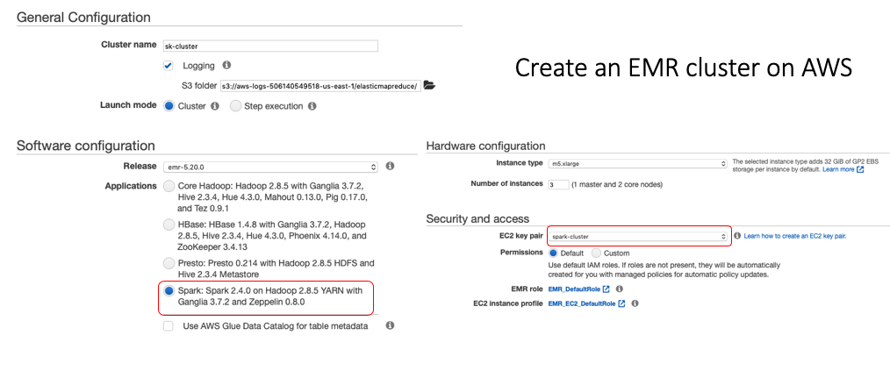
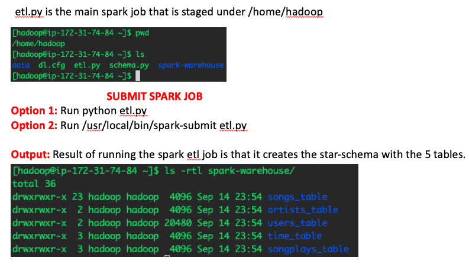

## Data Lake on AWS

There are several options when it comes to creating Data Lakes on AWS. Essentially it boils down to choosing what type of storage we want, the processing engine and whether we are using AWS-Managed solution or a Vendor managed solution.

The option we will be using for this project is: Spark for processing and AWS EMR as our managed solution, and S3 for retrieving and storing our data.

## Create a Data Lake with Spark and AWS EMR.
To create an Elastic Map Reduce data lake on AWS, use the following steps:

1. Create a ssh key-pair to securely connect to the EMR cluster that we are going to create. Go to your EC2 dashboard and click on the key-pairs. Create a new one, you will get a .pem file that you need to use to securely connect to the cluster.

2. Next, we will create an EMR cluster with the following configuration. Here EMR operates Spark in YARN cluster mode and comes with Hadoop Distributed file system. We will use a 4 cluster node with 1 master and 3 worker nodes.

3. We will be using the default security group and the default EMR role `EMR_DefaultRole` for our purposes. Ensure that default security group associated with Master node has SSH inbound rule open, otherwise you won't be able to ssh. 

## Submitting Spark Jobs to the cluster
1. Once the cluster is ready, we can ssh into the master node from your terminal session. This will connect you to the EMR cluster.

2. Now you can transfer your files to /home/hadoop and then run the `spark-submit` command to submit your spark jobs. 

> Note: Since the master node does not have some python libraries, you may have to **sudo pip install python-library**.
