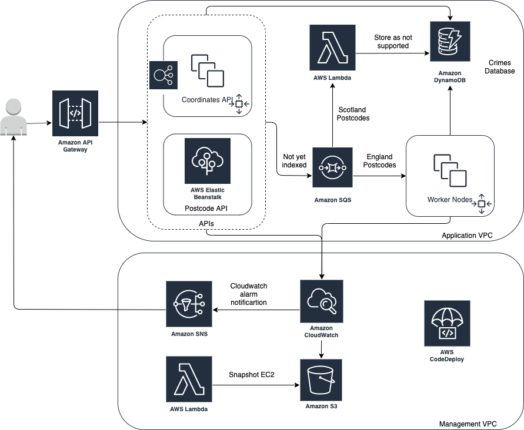

# AWS Certified DevOps Engineer - Professional

## Practical Exercise
Note: Both the use of infrastructure and software design here is poor, and not efficient. This project's purpose is to use all the tools and services you need to cover in the certification.

### Requirements
To sufficiently cover the syllabus of the certification and demonstrate a practical application of
the areas covered in the Linux Academy course, my solution needs to include the following:
* EC2 autoscaling group - lifecycle hooks, terminal policies, snapshots, Backend?
* Elastic Beanstalk - Frontend?
* ELB - requests scale frontend Beanstalk, health checks, metrics
* SQS - scales worker node ASG
* Scaling policy based on metrics
* Cloudwatch Alarms with SNS
* Lambda - takes snapshot of EC2, maybe consumes something from SQS?
* S3 with Lifecycle
* Cross-account deployment pipelines using AWS Developer Tools
* DynamoDB - Something to do with state and concurrency locking for the backend
* All managed using IAM roles
* AWS Secrets Manager - Not sure yet
* API Gateway - Not sure yet
### Topology
Initial solution will look something like this:




### Postcode API (Golang)
Takes a postcode, validates it, checks if results exist in the database, if not then sends it off to Amazon SQS instance. Returns 400 if postcode is invalid format.

Example Usage:
```shell script
curl -iva http://api-url/postcode/SW1A1AA
```

### Coordinates API (Rust)
Takes a pair of coordinates, validates it, checks if results exist in the database, if not then sends it off to Amazon SQS instance. Returns 400 if postcode is invalid format.

Example Usage:
```shell script
curl -iva http://api-url/coordinates?longitude=-0.141588&latitude=51.501009
```

### Crime Lookup Service (Golang)
Ingests valid postcode from Amazon SQS instance, fetches longitude and latitude of postcode and returns reported crimes in the past month within a mile radius.

Maybe if the police API returns 429 (exceeds 15 requests per second) we can somehow manage this or create a cloudwatch alarm?

### Invalid Postcode Lambda (Python)
Stores Scottish postcodes as currently not supported.

### Backup Snapshot Lambda (Python)
Creates a snapshot of an EBS volume, and deletes old ones.