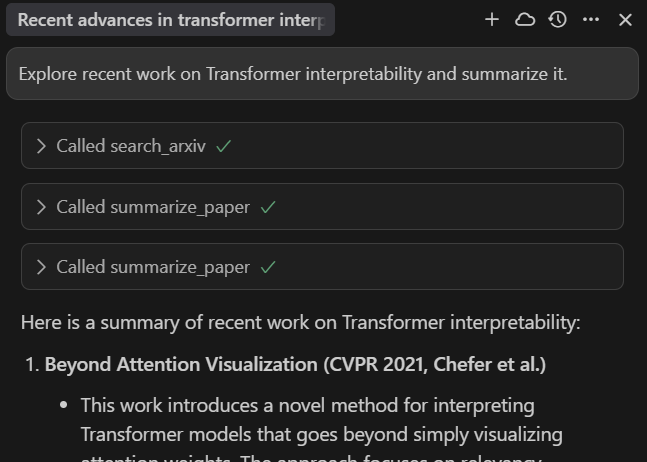

# FastMCP-Project: ArxivExplorer

A simple Model Context Protocol (MCP) server and client for exploring recent AI research on ArXiv. This project demonstrates how to build and test a custom MCP server and client for research tools, with a focus on searching, summarizing, and reporting on ArXiv papers.

## Features
- **ArxivExplorer MCP Server**: Provides:
  - A resource for suggested AI research topics
  - Tools for searching ArXiv and summarizing papers
  - A prompt template for exploring a topic via recent papers
- **MCP Client**: Connects to the server, lists available tools/resources/prompts, fetches topics, searches ArXiv, summarizes papers, and demonstrates prompt usage.


## Requirements
- Python 3.8+
- [FastMCP 2.0](https://gofastmcp.com/getting-started/welcome)
- [Tavily API key](https://app.tavily.com/)

Install dependencies:
```bash
pip install -r requirements.txt
```

---

## Setup

### 1. Set Tavily API Key
The server requires a Tavily API key. Set it as an environment variable:

**On Linux/macOS:**
```bash
export TAVILY_API_KEY=your_tavily_api_key
```
**On Windows (CMD):**
```cmd
set TAVILY_API_KEY=your_tavily_api_key
```
**On Windows (PowerShell):**
```powershell
$env:TAVILY_API_KEY="your_tavily_api_key"
```


## Running the Server

Start the ArxivExplorer MCP server (default: http://localhost:8000/mcp):
```bash
python server.py
```

You should see output like:
```
✅ ArxivExplorer server initialized.
✅ Resource 'resource://ai/arxiv_topics' registered.
✅ Tools 'Search Arxiv' and 'Summarize Paper' registered.
✅ Prompt 'explore_topic_prompt' registered.
🚀 Starting ArxivExplorer Server…
   (Server runs at http://localhost:8000/mcp)
```


## Running the Client

The client connects to the server, lists available tools/resources/prompts, fetches topics, searches ArXiv, summarizes a paper, and demonstrates prompt usage.

```bash
python client.py
```

You should see output similar to:
```
🚀 Connecting to FastMCP server at: http://localhost:8000/mcp

🔗 Testing server connectivity...
✅ Server is reachable!

🛠️  Available tools:
[ 'search_arxiv', 'summarize_paper' ]

📚 Available resources:
[ 'resource://ai/arxiv_topics' ]

💬 Available prompts:
[ 'explore_topic_prompt' ]

📖 Fetching resource: resource://ai/arxiv_topics
Today's AI topics:
  1. Transformer interpretability
  2. Efficient large-scale model training
  3. Federated learning privacy
  4. Neural network pruning

🔍 Testing tool: search_arxiv
  1. [Paper Title 1]
     [Paper URL 1]
  2. [Paper Title 2]
     [Paper URL 2]
  ...

📝 Testing tool: summarize_paper
Summary of first paper:
  [Summary text]

🚀 Testing prompt: explore_topic_prompt
Generated prompt:
SYSTEM: I want to explore recent work on 'Transformer interpretability'.
1. Call the 'Search Arxiv' tool to find the 5 most recent papers.
2. For each paper URL, call 'Summarize Paper' to extract its key contributions.
3. Combine all summaries into an overview report.
```


## Integrating with Cursor MCP (mcp.json Setup)

To use your local MCP server in Cursor, configure the MCP endpoint in your Cursor settings:

1. Open (or create) the file at `C:\Users\<your-username>\.cursor\mcp.json` (on Windows).
2. Add the following content:

```json
{
  "ArxivExplorer": {
    "url": "http://127.0.0.1:8000/mcp/"
  }
}
```

3. Save the file and restart Cursor if it was open.

Now, Cursor will route MCP requests to your local server. You can add more endpoints by adding more keys to the JSON if needed.




