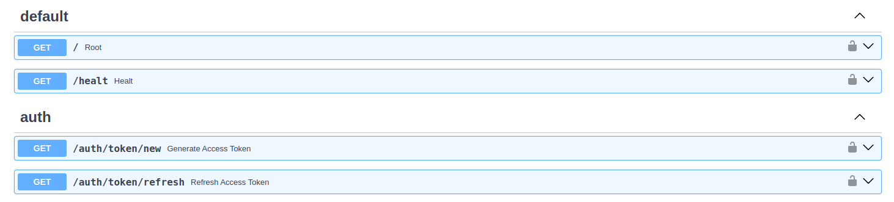

# API and WebSocket

[](https://github.com/rb58853/fastauth-api)

## Summary

- Provides two WebSocket routes for real-time chat:
  - User route (protected by an access token).
  - Admin route (protected by a master token).
- Communication is based on plain text messages and a JSON stream of steps; the stream ends with a final terminator.

## Endpoints and authentication

- Main routes:
  - `/chat/user` — requires an ACCESS token (in header).
  - `/chat/admin` — requires a MASTER token (in header).
- The server validates tokens on each connection; use secure tokens and a rotation policy.

## Connection (URL and parameters)

- Format:
  - `ws://<host>:<port>/chat/{user|admin}`
- Common query parameters:
  - `chat_id` — conversation id.
  - `model` — LLM model identifier.
  - `llm_provider` — provider (e.g., `openai`).
  - `len_context` — desired context length (`chat_history`).

## Recommended headers

- `ACCESS-TOKEN: <jwt-access-token>` (for `/chat/user`)
- `MASTER-TOKEN: <master-token>` (for `/chat/admin`)
- `aditional_servers: <JSON-string>` — list of auxiliary services ([see example servers](../README.md#additional-mcp-servers)).

## Message protocol (summary)

1. On connect, the server sends a JSON confirmation message.
2. The client sends the query as plain text over the socket.
3. The server emits a sequence of JSON messages, each representing a "step" or chunk of the response.
4. When finished, the server sends a literal terminator to indicate end of stream.
5. If the client closes, the server should clean up resources and close gracefully.

## Step structure (suggested)

- Each JSON message may contain:
  - `type` — message type.
  - `content` — partial text or data.
  - `first_chunk` — boolean indicating the first fragment.
  - `meta` — step metadata (timestamp, token_usage, etc.).
- Consumer: process messages until receiving the end-of-stream marker.

## Usage examples

- URIs:
  - `ws://localhost:8000/chat/user?chat_id=my-chat&model=my-model`
  - `ws://localhost:8000/chat/admin?chat_id=my-chat`
- Headers (example):
  - `ACCESS-TOKEN: eyJ...`
  - `MASTER-TOKEN: oBd-k41TmMq...`
  - `aditional_servers: '{"github":{"protocol":"httpstream","httpstream-url":"https://api.example.com/mcp"}}'`

## Operational flow (pseudocode)

### Client

```python
open websocket to ws://host:port/chat/user with headers and query
await initial_accept_message()
send_text("My question here")
for message in socket:
        if message == STREAM_END_MARKER: break
        handle_json_step(message)
close socket
```

[see example](../tests/api/websocket/chating.py)

### Server

```python
on_text_received(text):
        generator = chat_logic(text)
        for step in generator:
                send_json(step)
        send(STREAM_END_MARKER)
```

[see code](../src/fastchat/api/routes/chat.py)

## Configuration and environment

- Useful variables: `OPENAI_API_KEY`, `MASTER_TOKEN`, `CRYPTOGRAPHY_KEY`.
- Configuration defines auxiliary services and database connections; review the [fastauth-api](https://github.com/rb58853/fastauth-api) package for details.

## auth_middleware fill in config file

*Purpose:* Supply the external auth service used by the API to validate tokens for protected chat routes (`/chat/user`, `/chat/admin`).

```json
{
    "...": "...",
    
    "auth_middleware": {
        "database_api_path": "http://127.0.0.1:6789/mydb/data",
        "headers": {
            "header_key": "header_value",
            "other_header": "header_value",
            "...": "..."
        }
    }
}
```

### *Required fields*

- `database_api_path` (string): full URL to the authentication/validation endpoint (prefer HTTPS). This is where Fastauth will query/validate tokens.
- `headers` (object): key/value HTTP headers to include on requests to the auth endpoint (e.g. `Authorization`, API keys). Use environment values for secrets.
