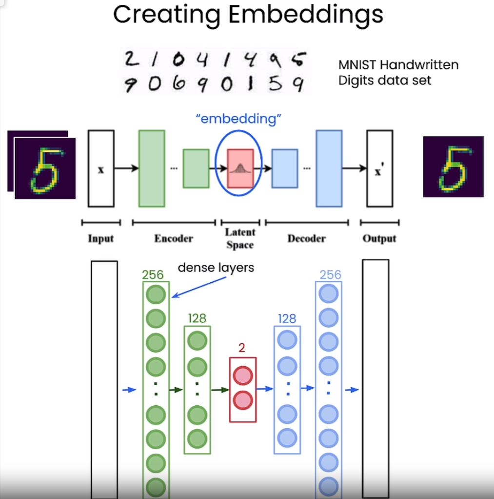
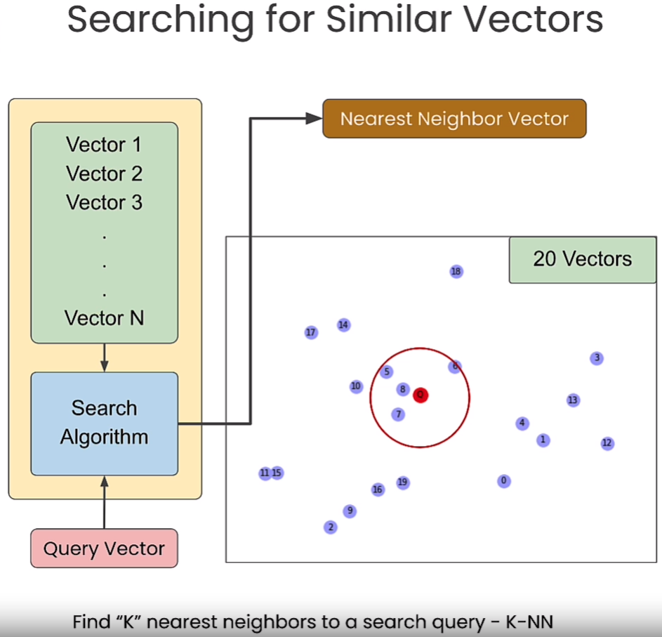
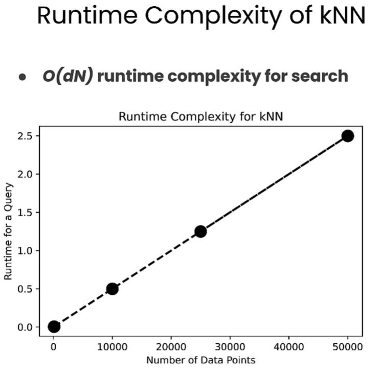
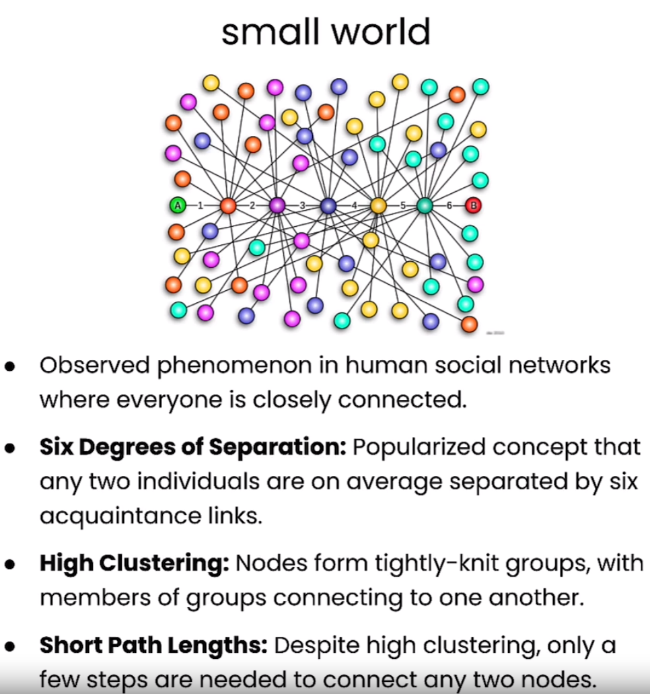

# 🚀 [Vector Databases: from Embeddings to Applications](https://www.deeplearning.ai/short-courses/vector-databases-embeddings-applications/)

💻 Welcome to the "Vector Databases: from Embeddings to Applications" course! This course, instructed by Sebastian Witalec, Head of Developer Relations at Weaviate, will equip you with essential skills to leverage vector databases for various applications.

## Course Summary
In this course, you will delve into the world of vector databases and their applications. Here's what you can expect to learn and experience:

1. 📚 **Understanding Vector Databases**: Explore the role of vector databases in natural language processing, image recognition, recommender systems, and semantic search. 

2. 🧠 **Embeddings and Similarity (L1)**: Learn how embeddings capture the meaning of data and how vector databases gauge the similarity between vectors.

 
 

3. :mag_right: **Demonstration of KNN (L2)**

 
 
 

4. :chart_with_upwards_trend: **Approximate nearest neighbours (L3)**

 
 
 

 
 
 

5. ⚙️ **Building RAG Applications (L6)**: Develop Retrieval Augmented Generation (RAG) applications using vector databases and LLMs.

 

## Key Points
- 🔑 Build practical applications, including hybrid and multilingual searches, for diverse industries.
- 🔍 Understand vector databases and their role in developing GenAI applications without the need to train or fine-tune an LLM yourself.
- 🤔 Learn to discern when it's best to apply a vector database to your application.

## About the Instructor
🌟 **Sebastian Witalec** is the Head of Developer Relations at Weaviate. With extensive knowledge in the field, Sebastian will guide you through the intricacies of vector databases.

🔗 To enroll in the course or for further information, visit [deeplearning.ai](https://www.deeplearning.ai/).
