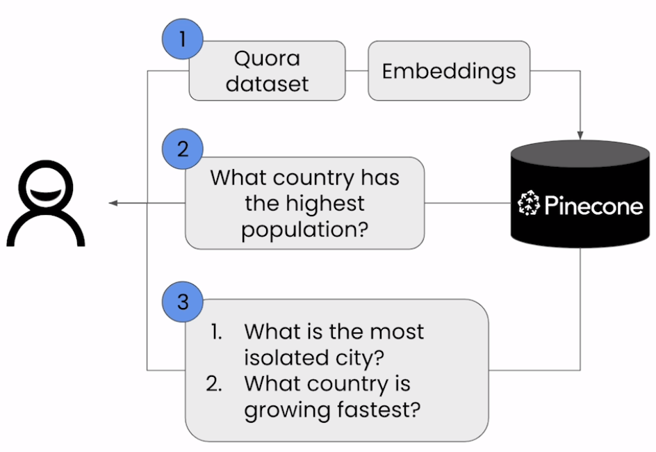
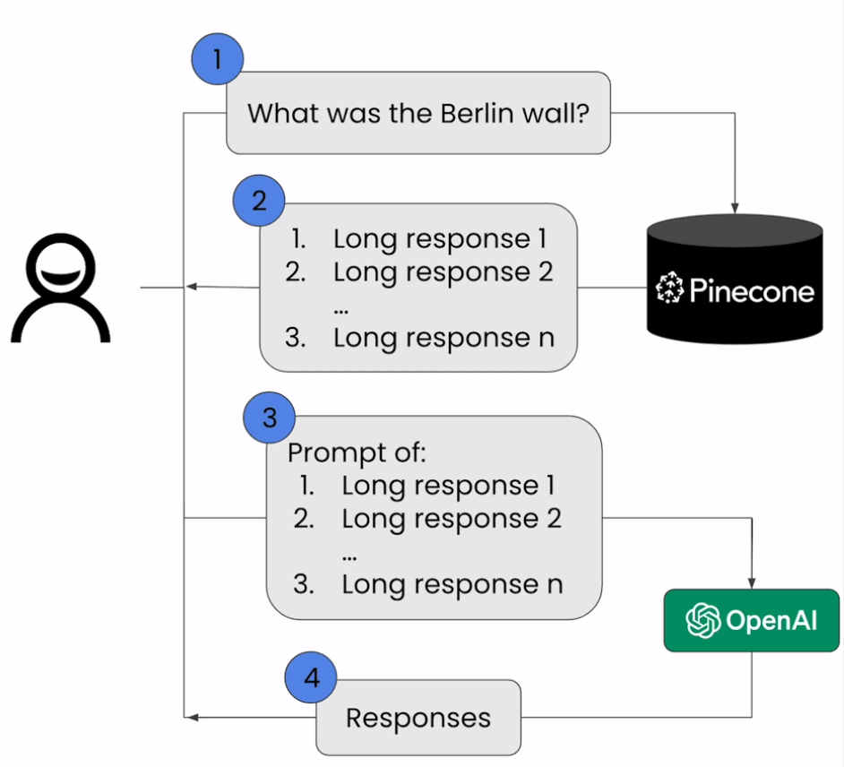
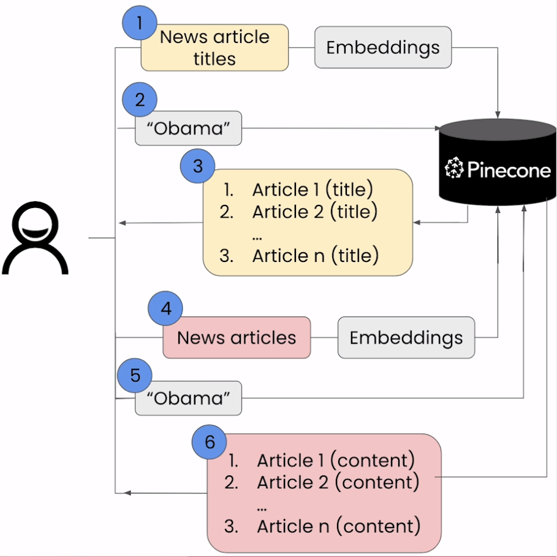
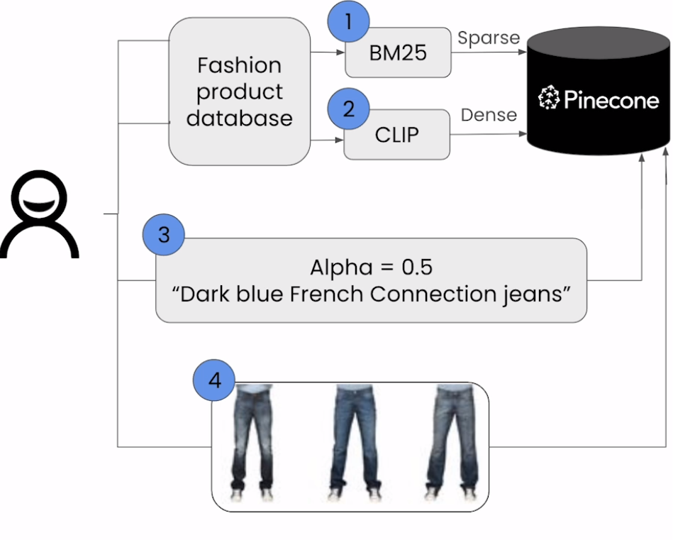
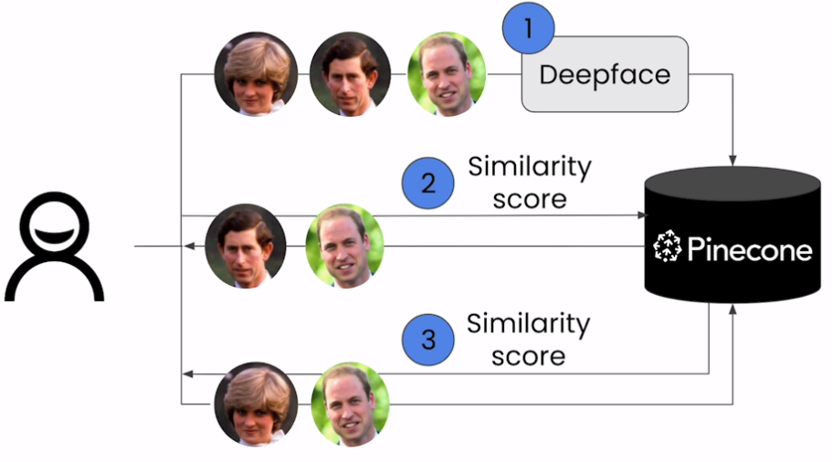
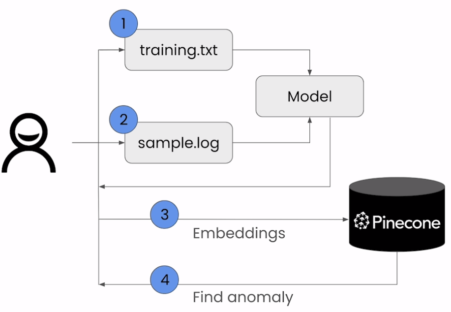

# 🚀 [Building Applications with Vector Databases](https://www.deeplearning.ai/short-courses/building-applications-vector-databases/)

💻 Welcome to the "Building Applications with Vector Databases" course! This course, instructed by Tim Tully, Board member at Pinecone, will teach you how to leverage vector databases to build a variety of applications quickly and efficiently.

**Course Website**: 📚[deeplearning.ai](https://www.deeplearning.ai/short-courses/building-applications-vector-databases/)

## Course Summary
In this course, you will explore the implementation of six applications using vector databases. Here's what you can expect to learn and experience:

1. 🔍 **Semantic Search**: Create a search tool that focuses on the meaning of content for efficient text-based searches on a user Q/A dataset.

 

2. ⚙️ **Retrieval Augmented Generation (RAG)**: Enhance your LLM applications by incorporating content from external sources like the Wikipedia dataset.

 

3. 🛒 **Recommender System**: Develop a system that combines semantic search and RAG to recommend topics, demonstrated with a news article dataset.

 

4. 🌐 **Hybrid Search**: Build an application for multimodal search using both images and descriptive text, demonstrated with an eCommerce dataset.

 

5. 😊 **Facial Similarity**: Create an app to compare facial features using a database of public figures to determine likeness.

 

6. 🚨 **Anomaly Detection**: Build an app to identify unusual patterns in network communication logs.

 

## Key Points
- 🛠 Learn to create six exciting applications of vector databases and implement them using Pinecone.
- 📸 Build a hybrid search app that combines both text and images for improved multimodal search results.
- 😃 Learn how to build an app that measures and ranks facial similarity.

## About the Instructor
🌟 **Tim Tully** is a board member at Pinecone and brings extensive expertise in vector databases to guide you through building various applications.

🔗 To enroll in the course or for further information, visit [deeplearning.ai](https://www.deeplearning.ai/short-courses/).
