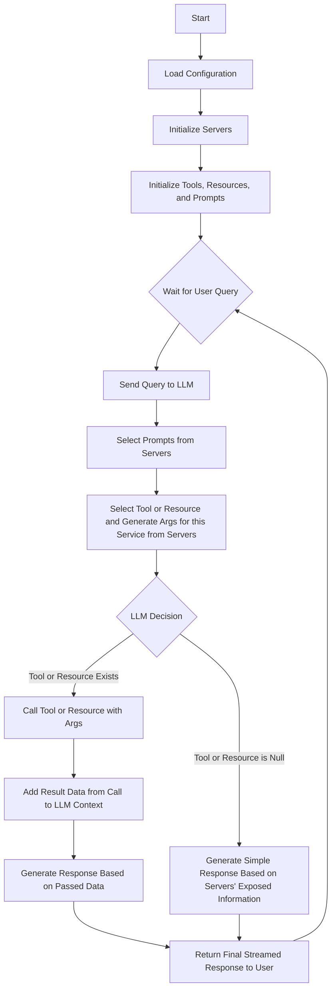

# Flow

```mermaid
flowchart TD
    A[Start] --> B[Load Configuration]
    B --> C[Initialize Servers]
    C --> D[Initialize Tools, Resources, and Prompts]
    D --> E{Wait for User Query}
    
    E --> F[Send Query to LLM]
    F --> H[Select Prompts from Servers]
    H --> I[Select Tool or Resource and Generate Args for this Service from Servers]
    I --> J{LLM Decision}
    J --> |Tool or Resource Exists| K[Call Tool or Resource with Args] 
    J --> |Tool or Resource is Null| L[Generate Simple Response Based on Servers' Exposed Information]
    
    K --> M[Add Result Data from Call to LLM Context]
    M --> N[Generate Response Based on Passed Data] 
    N --> O[Return Final Streamed Response to User]
    
    L --> O
    O --> E
```

<!-- ## Details

### 1. Initialization

### 2. Runtime Flow

### 3. Tool Integration -->
