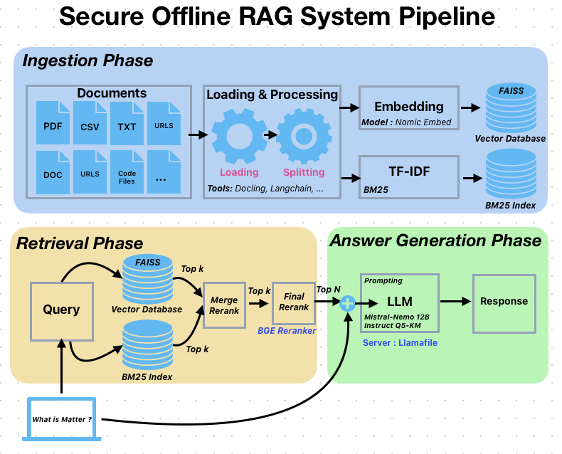

# RAG System 

A  Retrieval-Augmented Generation (RAG) system designed for efficient processing of diverse content types with minimal computational overhead.

# 🏆🥇 Competition Recognition (Please give the project a star 🌟 🙂)

This solution won 1st place in the Secure RAG Challenge by UnderstandTech! 

For more details:
- 🌟 [Official Competition Repository](https://github.com/Trustii-team/Secure-RAG-Challenge) - Contains solutions from all finalists
- 📢 [Official Results Announcement](https://www.linkedin.com/posts/trustii-io_github-trustii-teamsecure-rag-challenge-activity-7275167689055064064-D2fa?utm_source=share&utm_medium=member_desktop) - LinkedIn post with competition results and details

The challenge focused on building secure, offline RAG systems with emphasis on data privacy, security, and open-source technologies.

## Table of Contents
1. [Overview](#overview)
2. [System Requirements](#system-requirements)
3. [System Architecture Details](#system-architecture-details)
4. [Key Features](#key-features)
5. [Installation Guide](#installation-guide)
6. [Usage Guide](#usage-guide)
7. [Supported File Types](#supported-file-types)
8. [Configuration](#configuration)
9. [Performance Optimizations](#performance-optimizations)
10. [Project Structure](#project-structure)
11. [Dependencies and Licenses](#dependencies-and-licenses)
12. [License](#license)
13. [Authors](#authors)
## Overview

### Pipeline Architecture


The system implements a  RAG pipeline with the following key components :

1. **Preprocessing Stage**:
   - Several file types are processed using Langchain Loaders and Docling
   - **Specialy Office documents are first converted to PDF format**
   - **Docling** parses PDFs into Markdown format
     - *Key Advantage*: Superior quality text extraction and formatting preservation
   - Text is split into optimized chunks

2. **Dual Encoding System**:
   - **Dense Encoding**: Nomic Embed generates semantic embeddings
   - **Sparse Encoding**: BM25 with TF-IDF for keyword matching
   - The files content, their chunks after spliting and their embedddings are cached for effective re-use.
4. **Storage & Retrieval**:
   - FAISS vector database for dense embeddings
   - TF-IDF index for sparse representations

5. **Query Processing**:
   - Top K documents are returned after the combined retrieval between FAISS and BM25
   - BGE Reranker rerank the Top K chunks
   - The Top N documents (N < K) are sent to the LLM with the query

6. **Generation Stage**:
   - **Llamafile Integration**:
     - Simple deployment and usage
     - Excellent CPU/GPU performance
     - Flexible GPU layer control for resource optimization
     - Fast inference speeds

## System Requirements

Tested configuration:
- Ubuntu 22.04
- 32GB RAM
- 8GB VRAM (RTX 3070 Laptop)
- Intel Core i7 (16 CPU cores)
- CUDA Version: 12.4
- Driver Version: 550.120

## Key Features
- Multi-document processing (text, code, technical documentation)
- Hybrid retrieval combining BM25 and vector search
- Advanced caching system for optimized performance
- GPU-accelerated embeddings with automatic memory management
- Configurable processing pipeline
- Thread-safe LLM operations
- Progress tracking and comprehensive logging
- Web interface via Streamlit

## System Architecture Details

### 1. Data Ingestion & Processing
- Unified document loading interface
- Specialized handlers for different content types
- Efficient chunking and preprocessing
- Intelligent caching system

### 2. Retrieval System
- BM25 for keyword-based search
- FAISS vector store for semantic search
- Hybrid retrieval with configurable weights

### 3. Response Generation
- Context-aware response formulation
- Query expansion capabilities (**Implemented but not used due to low performances**)
- Thread-safe LLM handling
- Structured response formatting

### 4. Content Processing Capabilities

#### Text Documents
- Markdown with header-based splitting
- PDF with enhanced conversion
- CSV with custom column handling
- HTML with table extraction

#### Code Processing
Supported languages with specialized parsing:
- Python
- JavaScript/TypeScript
- Java
- C#
- C++
- Go
- Rust
- And more...

#### Technical Documentation
- Automatic TOC detection
- Header hierarchy preservation
- Source attribution
- Metadata enrichment

## Installation Guide

### 1. System Dependencies
```bash
# Update package list and install LibreOffice
sudo apt update
sudo apt install libreoffice

# Install Anaconda
wget https://repo.anaconda.com/archive/Anaconda3-2024.02-1-Linux-x86_64.sh
chmod +x Anaconda3-2024.02-1-Linux-x86_64.sh
./Anaconda3-2024.02-1-Linux-x86_64.sh # And follow the instructions

# Initialize conda
~/anaconda3/bin/conda init bash
source ~/.bashrc

# Create and activate conda environment
conda create -n rag_project python=3.10
conda activate rag_project

# Install requirements
cd Secure-Offline-RAG-System
pip install -r requirements_rag.txt
```
### 2. LLM Server Setup (In a seperate Terminal)
##### - (IMPORTANT : Start the LLM server only after step "2. System Initialization" of "Usage Guide" below to avoid CUDA OOM if you have only 8GB of VRAM or less)
- ```-ngl 12``` indicate the number of layers of the model to offload to the GPU. Increase it if you have more VRAM available for better performance or  decrease it otherwise. If you don't specify the parameter, the model will be loaded in the RAM instead of the GPU VRAM.
```bash
# Download and setup llamafile
wget https://huggingface.co/Mozilla/Mistral-Nemo-Instruct-2407-llamafile/resolve/main/Mistral-Nemo-Instruct-2407.Q5_K_M.llamafile
chmod +x Mistral-Nemo-Instruct-2407.Q5_K_M.llamafile

# Start the LLM server
./Mistral-Nemo-Instruct-2407.Q5_K_M.llamafile --server --nobrowser -ngl 12 --port 8081
```

## Usage Guide

### 1. Configuration Setup
Configure your data paths in `config/init_config.yml`:
In `document_paths` specify the paths to your `files` or `URLS`. Note that if you provide an `URL`, the system will automatically browse the `Table Of Content` of the web page and extract information from the web pages. In `test_data` you should provide the path to the `test.csv` file in order to generate the submission. You should also provide `test_output` to indicate where to save the submission file.

```yaml
files:
  document_paths:
    - "path/to/your/documents"
    - "path/to/more/documents"
  test_data: "path/to/test.csv"
  test_output: "data/processed/submission_test_final.csv"
```

### 2. System Initialization

```bash
python init_cache_data.py
```
This command will initialise the system. At the end of this step, the content of the documents, their splitted chunks and their embeddings will be stored in the folder specified in `config/init_config.yml` (Default : `cache/`). With this strategy we will not have to regenerate the system data for retrieval each time. You can provide a new `cache_dir` path if you need to seperate tasks, maybe one cache just for code and another one for text documents. 

```yaml
paths:
  cache_dir: "./cache"
```

### 3. Generate Submissions
```bash
python generate_submission_csv.py
```
This command will read the content of `test_output:` in `config/init_config.yml`, and if the file already exists will resume the answers generation. Otherwise will create a new submission file.  

### 4. Interactive Usage Options
1. **Streamlit Web Interface**
```bash
streamlit run streamlit_app.py
```
- Runing this command will allow the user to interact with the RAG system and can consult the context used by the model to generate the answer.
- **Note:** The output is not really well formatted yet. The  code for displaying the answer will need to be updated. 


2. **Jupyter Notebook**
- Open and run `inference_notebook.ipynb`

3. **Command Line Interface**
```bash
python process_single_query.py --query "Your query here"
```

## Supported File Types

### 1. Text Documents
- `.txt` (Plain text)
- `.md` (Markdown)
- `.pdf` (PDF documents)

### 2. Office Documents
- `.docx`, `.doc` (Word documents)
- `.ppt`, `.pptx` (PowerPoint presentations)
- `.xlsx`, `.xls` (Excel spreadsheets)
- `.odt` (OpenDocument text)

### 3. Data Files
- `.csv` (Comma-separated values)
- `.json` (JSON files)

### 4. Web Content
- `.html`, `.htm` (HTML files)

### 5. Email Files
- `.eml`
- `.msg`

### 6. Programming Files
- `.py` (Python)
- `.js`, `.jsx` (JavaScript)
- `.ts`, `.tsx` (TypeScript)
- `.java` (Java)
- `.cpp`, `.c` (C/C++)
- `.cs` (C#)
- `.go` (Go)
- `.rs` (Rust)

### 7. Jupyter Notebooks
- `.ipynb`

## Performance Optimizations

### Memory Management
1. **Efficient Caching**
   - Automatic caching
   - Selective caching based on content type
   - MD5 hashing for cache keys

2. **GPU Memory**
   - Automatic CUDA memory cleanup
   - Batch processing for embeddings
   - Device-aware operations

### CPU Optimization
1. **Parallel Processing**
   - Multi-process document loading
   - Threaded LLM operations
   - Configurable thread count

2. **Chunking Strategies**
   - Adaptive chunk sizes
   - Content-aware splitting
   - Overlap optimization

### Storage Optimization
1. **Vector Storage**
   - FAISS for efficient similarity search
   - Compressed embeddings storage

2. **Document Storage**
   - Disk-based storage 
   - Lazy loading when possible

## Project Structure
```
trustii_rag_project/
├── config/                 # Configuration files
├── data/                  # Data storage
│   ├── raw/              # Original datasets
│   └── processed/        # Processed outputs
├── cache/                # Docs, Chunks and Embeddings cache
├── logs/                 # Log files
├── src/                  # Source code
│   ├── cache/           # Caching system
│   ├── data/            # Data processing
│   ├── retrieval/       # Search systems
│   ├── models/          # Reranking model
│   ├── response/        # Response generation
│   └── utils/           # Utilities
├── init_cache_data.py    # Cache initialization
├── initialize_rag.py     # System initialization
├── generate_submission_csv.py  # Submission file generation
├── process_single_query.py    # Single query processing
├── streamlit_app.py      # Web interface
└── requirements-rag.txt      # Dependencies
```

## Dependencies and Licenses

| Package/Tool | License | Usage |
|----------|---------|--------|
| LangChain  | MIT | Core RAG functionality and embeddings |
| FAISS | MIT | Vector storage and similarity search |
| Docling | MIT | Document processing and conversion |
| Hugging Face Transformers | Apache 2.0 | Reranking models and embeddings |
| Beautiful Soup 4 | MIT | HTML parsing and web scraping |
| Pandas | BSD 3-Clause | Data manipulation and CSV handling |
| PyTorch  | -- | Deep learning operations |
| Streamlit | Apache 2.0 | Web interface |
| aiohttp | Apache 2.0 | Async web requests |
| LibreOffice  | MPL 2.0 | Document conversion |
| Mistral Nemo Instruct 12B | Apache 2.0 | LLM model |
| Llamafile | Apache 2.0 | LLM serving |
| nbformat  | BSD 3-Clause | Jupyter notebook processing |
| rank_bm25  | Apache 2.0 | BM25 scoring |
| PyYAML  | MIT | Configuration file handling |

# Configuration Guide for the  RAG System

## Configuration Files Overview

The system uses two main configuration files:
- `init_config.yml`: Controls system initialization and core parameters
- `process_config.yaml`: Controls query processing and retrieval settings

## 1. Initial Configuration (init_config.yml)

### Logging Settings
```yaml
logging:
  level: "INFO"
show_progress: true
hide_http_requests: true
file_logging: true
console_logging: true
```

| Parameter | Description | Suggested Values | Notes |
|-----------|-------------|------------------|--------|
| `level` | Logging verbosity | "DEBUG", "INFO", "WARNING", "ERROR" | Use "DEBUG" for development, "INFO" for production |
| `show_progress` | Display progress bars | true/false | Disable for headless environments |
| `hide_http_requests` | Suppress HTTP logs | true/false | Enable for cleaner logs |
| `file_logging` | Log to files | true/false | Keep enabled for production |
| `console_logging` | Log to console | true/false | Can disable for production |

### Model Configuration
```yaml
model:
  embedding_model_hf: "nomic-ai/nomic-embed-text-v1.5"
  rerank_model: "BAAI/bge-reranker-v2-m3"
  device_rerank: "cuda"
```

| Parameter | Description | Suggested Values | Tuning Notes |
|-----------|-------------|------------------|--------------|
| `embedding_model_hf` | Hugging Face embedding model | "nomic-ai/nomic-embed-text-v1.5", "BAAI/bge-base-en-v1.5" | Choose based on accuracy vs. speed needs |
| `rerank_model` | Model for reranking results | "BAAI/bge-reranker-v2-m3", "cross-encoder/ms-marco-MiniLM-L-4-v2" | Larger models are more accurate but slower |
| `device_rerank` | Computing device | "cuda", "cpu" | Use "cpu" if GPU unavailable |

### Ingestion Settings
```yaml
ingestion:
  ignore_columns: None  #["Query"]
```
Set `ignore_columns` to skip specific columns during data ingestion for `csv` files.

### Processing Configuration
```yaml
processing:
  TOC_text: "Table of Contents"
  headers_to_split_on:
    - ["##", "Header 2"]
    - ["###", "Header 3"]
    - ["####", "Header 4"]
    - ["Table of Contents", "Table of Contents"]
  headers_to_split_on_for_urls:
    - ["#", "Header 1"]
    - ["##", "Header 2"]
    - ["###", "Header 3"]
    - ["####", "Header 4"]
  headers_keys: {"Header 1":"# ", "Header 2":"## ", "Header 3":"### ", "Header 4":"#### "}
  OMP_NUM_THREADS: 15
  chunk_size: 2000
  chunk_overlap: 200
  batch_size_embeddings: 32
  batch_size_reranking: 8
  split_documents: true
```

| Parameter | Description | Default | Tuning Recommendations |
|-----------|-------------|---------|------------------------|
| `chunk_size` | Size of text chunks | 2000 | - Increase (3000-5000) for technical docs<br>- Decrease (600-1000) for QA-style content<br>- Balance between context and relevance |
| `chunk_overlap` | Overlap between chunks | 200 | - 20-25% of chunk_size is recommended<br>- Increase for complex documents<br>- Decrease for simple, structured content |
| `batch_size_embeddings` | Batch size for embedding generation | 32 | - Increase (64-128) with more GPU memory<br>- Decrease (8-16) for CPU processing |
| `batch_size_reranking` | Batch size for reranking | 8 | - Adjust based on GPU memory |
| `OMP_NUM_THREADS` | Thread count for parallel processing | 15 | - Set to (CPU cores - 1)<br>- Lower for shared systems |

### Paths Configuration
```yaml
paths:
  cache_dir: "./cache"
  data_dir: "./data"
  log_dir: "./logs"
files:
  train_data: "data/raw/train.csv"
  test_data: "data/raw/test.csv"
  train_output: "data/processed/submission_train_final.csv"
  test_output: "data/processed/submission_test_final.csv"
  document_paths:
    - "data/raw/742762880-Matter-1-3-Core-Specification.pdf"
    - "data/raw/data.txt"
```
For this challenge a combination of 4 sources of information have been tested :
- `data/raw/742762880-Matter-1-3-Core-Specification.pdf` : The version 1.3 of Matter specification.
- `data/raw/data.txt` : The rows of the column Response in the `train.csv`.
- `data/raw/matter_specification.pdf` : The version 1.0 of Matter specification.
- `https://project-chip.github.io/connectedhomeip-doc/`: The github documentation of the Matter specification.

Finally `data/raw/742762880-Matter-1-3-Core-Specification.pdf` and `data/raw/data.txt have been used for submission. 

## 2. Process Configuration (process_config.yaml)

```yaml
retrieval:
  llamafile_server_base_url: "http://localhost:8081"
  send_nb_chunks_to_llm: 3
  use_bm25: true
  bm25_weight: 0.2
  top_k: 100
  use_reranking: true
  use_query_expansion: false
```

| Parameter | Description | Default | Tuning Recommendations |
|-----------|-------------|---------|------------------------|
| `send_nb_chunks_to_llm` | Number of chunks sent to LLM | 2 | - Increase (7-10) for complex queries<br>- Decrease (3-4) for simple queries<br>- Balance between context and speed |
| `use_bm25` | Enable BM25 search | true | - Enable for keyword-heavy queries<br>- Disable for semantic queries |
| `bm25_weight` | Weight of BM25 vs vector search | 0.2 | - Increase (0.6-0.8) for technical content<br>- Decrease (0.2-0.4) for conversational content |
| `top_k` | Number of initial results | 100 | - Increase (150-200) for diverse content<br>- Decrease (50-75) for focused domains |
| `use_reranking` | Enable result reranking | true | - Enable for accuracy<br>- Disable for speed |
| `use_query_expansion` | Enable query expansion | false | - Enable for ambiguous queries<br>- Disable for specific queries |

## 3. LLM Prompting in  `src/response/response_generator.py`
- The output of the LLM is influenced by the prompt choosed.
- Here is the prompt used for this competition: 
```yaml
prompt = ChatPromptTemplate.from_template("""
        You are an efficient Q&A assistant that respond to user queries based on provided context.
        Based on the following information, please provide a clear, accurate, and comprehensive answer to the question.
        If the information is not sufficient to answer the question completely, acknowledge this and provide what you can.

        Question: {query}

        Relevant Information:
        {context}

        Please provide a response that:
        1. Directly addresses the question
        2. Is supported by the provided information
        3. Is clear and well-organized
        5. Is short as possible with relevant informations
        6. Don't mention the source of the information
        7. Do not repeat the question 
        8. Clearly state the lack of information in the provided context to answer the question if it's the case.

        Response:
        """)
```
- **Note** : The answers in `train.csv` are brief and typically lack references. In contrast, the `baseline` provided by the `Matter model` on `Understand.Tech` offers detailed responses with citations. This created a dilemma: should we generate concise answers to match the ground truth in the public leaderboard, or produce comprehensive responses like the Matter model? I ultimately chose a middle ground approach without references. To include `citations` in generated responses, users can simply replace the prompt instruction `6. Don't mention the source of the information` with `6. Mention the sources (sections, tables, figures, etc.) where possible.`
## Performance Tuning Guidelines

### Memory Optimization
1. **Limited RAM (16GB or less)**:
   - Reduce `chunk_size` to 500
   - Set `batch_size_embeddings` to 16
   - Set `batch_size_reranking` to 4
   - Disable `use_reranking` if necessary

2. **High RAM (32GB or more)**:
   - Increase `chunk_size` to 1000-1500
   - Set `batch_size_embeddings` to 64-128
   - Set `batch_size_reranking` to 16-32

### GPU Optimization
1. **Limited VRAM (4GB or less)**:
   - Use smaller models
   - Reduce batch sizes
   - Consider CPU-only operation

2. **High VRAM (8GB or more)**:
   - Use larger, more accurate models
   - Increase batch sizes
   - Enable all features

### Speed vs Accuracy Tradeoffs
1. **Speed Focus**:
   - Disable `use_reranking`
   - Reduce `top_k` to 50
   - Disable `use_query_expansion`
   - Reduce `send_nb_chunks_to_llm` to 1

2. **Accuracy Focus**:
   - Enable `use_reranking`
   - Increase `top_k` to 150-200
   - Enable `use_query_expansion`
   - Increase `send_nb_chunks_to_llm` to 5-10

### Domain-Specific Tuning

1. **Technical Documentation**:
   - Increase `chunk_size` to 1500-3000
   - Enable `use_bm25`
   - Set `bm25_weight` to 0.5

2. **Conversational Content**:
   - Reduce `chunk_size` to 400-700
   - Disable `use_bm25`
   - Increase `chunk_overlap`

3. **Mixed Content**:
   - Use default settings
   - Enable both BM25 and vector search
   - Set `bm25_weight` to 0.5


## License
MIT 

## Authors
Abdoulaye SAYOUTI SOULEYMANE

## Acknowledgments
---

