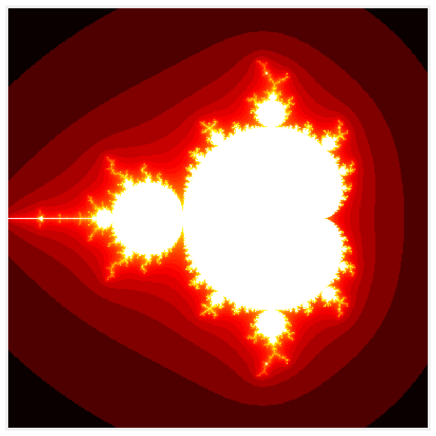

<a href="https://github.com/ipython-books/cookbook-2nd"></a> *This is one of the 100+ free recipes of the [IPython Cookbook, Second Edition](https://github.com/ipython-books/cookbook-2nd), by [Cyrille Rossant](http://cyrille.rossant.net), a guide to numerical computing and data science in the Jupyter Notebook. The ebook and printed book are available for purchase at [Packt Publishing](https://www.packtpub.com/big-data-and-business-intelligence/ipython-interactive-computing-and-visualization-cookbook-second-e).*

▶ *[Text on GitHub](https://github.com/ipython-books/cookbook-2nd) with a [CC-BY-NC-ND license](https://creativecommons.org/licenses/by-nc-nd/3.0/us/legalcode)*  
▶ *[Code on GitHub](https://github.com/ipython-books/cookbook-2nd-code) with a [MIT license](https://opensource.org/licenses/MIT)*

[*Chapter 5 : High-Performance Computing*](./)

# 5.4. Wrapping a C library in Python with ctypes

Wrapping a C library in Python allows us to leverage existing C code or to implement a critical part of the code in a fast language such as C.

It is relatively easy to use externally-compiled libraries with Python. The first possibility is to call a command-line executable with an `os.system()` command, but this method does not extend to compiled libraries.

A more powerful method consists of using a native Python module called **ctypes**. This module allows us to call functions defined in a compiled library (written in C) from Python. The ctypes module takes care of the data type conversions between C and Python. In addition, the `numpy.ctypeslib` module provides facilities to use NumPy arrays wherever data buffers are used in the external library.

In this example, we will rewrite the code of the Mandelbrot fractal in C, compile it in a shared library, and call it from Python.

## Getting ready

The code of this recipe is written for Unix systems and has been tested on Ubuntu. It can be adapted to other systems with minor changes.

A C compiler is required. You will find all compiler-related instructions in this chapter's introduction.

## How to do it...

First, we write and compile the Mandelbrot example in C. Then, we access it from Python using ctypes.

1. Let's write the code of the Mandelbrot fractal in C:

```python
%%writefile mandelbrot.c
#include "stdio.h"
#include "stdlib.h"

void mandelbrot(int size, int iterations, int *col)
{
    // Variable declarations.
    int i, j, n, index;
    double cx, cy;
    double z0, z1, z0_tmp, z0_2, z1_2;

    // Loop within the grid.
    for (i = 0; i < size; i++)
    {
        cy = -1.5 + (double)i / size * 3;
        for (j = 0; j < size; j++)
        {
            // We initialize the loop of the system.
            cx = -2.0 + (double)j / size * 3;
            index = i * size + j;
            // Let's run the system.
            z0 = 0.0;
            z1 = 0.0;
            for (n = 0; n < iterations; n++)
            {
                z0_2 = z0 * z0;
                z1_2 = z1 * z1;
                if (z0_2 + z1_2 <= 100)
                {
                    // Update the system.
                    z0_tmp = z0_2 - z1_2 + cx;
                    z1 = 2 * z0 * z1 + cy;
                    z0 = z0_tmp;
                    col[index] = n;
                }
                else
                {
                    break;
                }
            }
        }
    }
}
```

2. Now, let's compile this C source file with `gcc` into a `mandelbrot.so` dynamic library:

```python
!!gcc -shared -Wl,-soname,mandelbrot \
    -o mandelbrot.so \
    -fPIC mandelbrot.c
```

3. Let's access the library with ctypes:

```python
import ctypes
```

```python
lib = ctypes.CDLL('mandelbrot.so')
```

```python
mandelbrot = lib.mandelbrot
```

4. NumPy and ctypes allow us to wrap the C function defined in the library:

```python
from numpy.ctypeslib import ndpointer
```

```python
# Define the types of the output and arguments of
# this function.
mandelbrot.restype = None
mandelbrot.argtypes = [ctypes.c_int,
                       ctypes.c_int,
                       ndpointer(ctypes.c_int),
                       ]
```

5. To use this function, we first need to initialize an empty array and pass it as an argument to the `mandelbrot()` wrapper function:

```python
import numpy as np
# We initialize an empty array.
size = 400
iterations = 100
col = np.empty((size, size), dtype=np.int32)
# We execute the C function, which will update
# the array.
mandelbrot(size, iterations, col)
```

6. Let's show the result:

```python
import numpy as np
import matplotlib.pyplot as plt
%matplotlib inline
```

```python
fig, ax = plt.subplots(1, 1, figsize=(10, 10))
ax.imshow(np.log(col), cmap=plt.cm.hot)
ax.set_axis_off()
```



6. How fast is this function?

```python
%timeit mandelbrot(size, iterations, col)
```

```{output:stdout}
28.9 ms ± 73.1 µs per loop (mean ± std. dev. of 7 runs,
    10 loops each)
```

The wrapped C version is slightly faster than the Numba version in the first recipe of this chapter.

## How it works...

The `mandelbrot()` function accepts as arguments:

* The **size** of the `col` buffer (the `col` value is the last iteration where the corresponding point is within a disc around the origin)
* The number of **iterations**
* A **pointer** to the buffer of integers

The `mandelbrot()` C function does not return any value; rather, it updates the buffer that was passed by reference to the function (it is a pointer).

To wrap this function in Python, we need to declare the types of the input arguments. The ctypes module defines constants for the different data types. In addition, the `numpy.ctypeslib.ndpointer()` function lets us use a NumPy array wherever a pointer is expected in the C function. The data type given as argument to `ndpointer()` needs to correspond to the NumPy data type of the array passed to the function.

Once the function has been correctly wrapped, it can be called as if it was a standard Python function. Here, the initially-empty NumPy array is filled with the Mandelbrot fractal after the call to `mandelbrot()`.

## There's more...

An alternative to ctypes is cffi (http://cffi.readthedocs.org), which may be a bit faster and more convenient to use. You can also refer to http://eli.thegreenplace.net/2013/03/09/python-ffi-with-ctypes-and-cffi/.

## See also

* Accelerating pure Python code with Numba and just-in-time compilation
