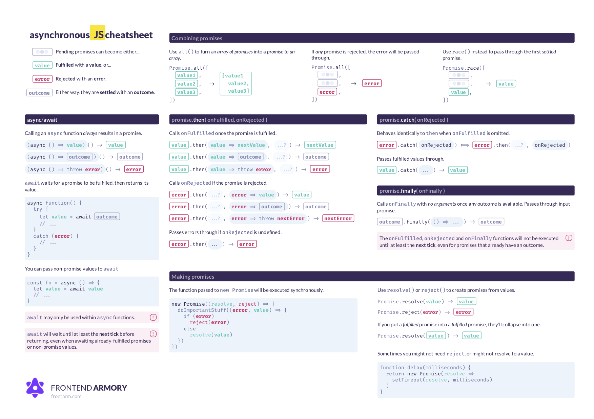

# Fetch API Examples

- [Further Resources](https://danlevy.net/you-may-not-need-axios/)

## Table of Contents

1. [Cheatsheet](#cheatsheet)

1. GET Requests 
    1. [Easy: Get JSON from a URL](#easy-get-json-from-a-url)
    1. [Intermediate: Custom headers](#intermediate-custom-headers)
    1. [Advanced: CORS example](#advanced-cors-example)
1. POST/PUT Requests
    1. [Easy: Posting JSON](#easy-posting-json)
    1. [Intermediate: Posting an HTML `<form>`](#intermediate-posting-an-html-form)
    1. [Intermediate: Form encoded data](#intermediate-form-encoded-data)
    1. [Advanced: Uploading Files](#advanced-uploading-files)
    1. [Advanced: Uploading Multiple Files](#advanced-uploading-multiple-files)

1. Bonus
    1. Dependant Fetch Requests
    1. Concurrent Downloads

1. Caveats
    1. [Handling HTTP error statuses](#handling-http-error-statuses)
    1. [Sending cookies](#sending-cookies)
    1. [Receiving cookies](#receiving-cookies)

## Cheatsheet



https://github.github.io/fetch/

## GET Requests

### Easy: Get JSON from a URL

```js
fetch('https://api.github.com/orgs/nodejs')
.then(response => response.json())
.then(data => {
  console.log(data) // Prints result from `response.json()` in getRequest
})
.catch(error => console.error(error))
```

### Intermediate: Custom headers

```js
fetch('https://api.github.com/orgs/nodejs', {
  headers: new Headers({
    'User-agent': 'Mozilla/4.0 Custom User Agent'
  })
})
.then(response => response.json())
.then(data => {
  console.log(data)
})
.catch(error => console.error(error))
```

### Advanced: CORS example

CORS is primarily checked at the server - so make sure your configuration is correct on the server-side.

The `credentials` option controls if your cookies are automatically included.

```js
fetch('https://api.github.com/orgs/nodejs', {
  credentials: 'include', // Useful for including session ID (and, IIRC, authorization headers)
})
.then(response => response.json())
.then(data => {
  console.log(data) // Prints result from `response.json()`
})
.catch(error => console.error(error))
```

## POST/PUT Requests

### Easy: Posting JSON

```js
postRequest('http://example.com/api/v1/users', {user: 'Dan'})
  .then(data => console.log(data)) // Result from the `response.json()` call
  .catch(error => console.error(error))

function postRequest(url, data) {
  return fetch(url, {
    credentials: 'same-origin', // 'include', default: 'omit'
    method: 'POST', // 'GET', 'PUT', 'DELETE', etc.
    body: JSON.stringify(data), // Coordinate the body type with 'Content-Type'
    headers: new Headers({
      'Content-Type': 'application/json'
    }),
  })
  .then(response => response.json())
}
```


### Intermediate: Posting an HTML `<form>`

```js
postForm('http://example.com/api/v1/users')
  .then(data => console.log(data))
  .catch(error => console.error(error))

function postForm(url) {
  const formData = new FormData(document.querySelector('form.edit-user'))

  return fetch(url, {
    method: 'POST', // or 'PUT'
    body: formData  // a FormData will automatically set the 'Content-Type'
  })
  .then(response => response.json())
}
```


### Intermediate: Form encoded data

To post data with a Content-Type of `application/x-www-form-urlencoded` we will use `URLSearchParams` to encode the data like a query string.

For example, `new URLSearchParams({a: 1, b: 2})` yields `a=1&b=2`.

```js
postFormData('http://example.com/api/v1/users', {user: 'Mary'})
  .then(data => console.log(data))
  .catch(error => console.error(error))

function postFormData(url, data) {
  return fetch(url, {
    method: 'POST', // 'GET', 'PUT', 'DELETE', etc.
    body: new URLSearchParams(data),
    headers: new Headers({
      'Content-type': 'application/x-www-form-urlencoded; charset=UTF-8'
    })
  })
  .then(response => response.json())
}
```

### Advanced: Uploading files


```js
postFile('http://example.com/api/v1/users', 'input[type="file"].avatar')
  .then(data => console.log(data))
  .catch(error => console.error(error))

function postFile(url, fileSelector) {
  const formData = new FormData()
  const fileField = document.querySelector(fileSelector)
  
  formData.append('username', 'abc123')
  formData.append('avatar', fileField.files[0])

  return fetch(url, {
    method: 'POST', // 'GET', 'PUT', 'DELETE', etc.
    body: formData  // Coordinate the body type with 'Content-Type'
  })
  .then(response => response.json())
}
```


### Advanced: Uploading multiple files

Setup a file upload element with the `multiple` attribute:

```html
<input type='file' multiple class='files' name='files' />
```

Then use with something like:

```js
postFile('http://example.com/api/v1/users', 'input[type="file"].files')
  .then(data => console.log(data))
  .catch(error => console.error(error))

function postFile(url, fileSelector) {
  const formData = new FormData()
  const fileFields = document.querySelectorAll(fileSelector)

  // Add all files to formData
  Array.prototype.forEach.call(fileFields.files, f => formData.append('files', f))
  // Alternatively for PHP peeps, use `files[]` for the name to support arrays
  // Array.prototype.forEach.call(fileFields.files, f => formData.append('files[]', f))
  
  return fetch(url, {
    method: 'POST', // 'GET', 'PUT', 'DELETE', etc.
    body: formData  // Coordinate the body type with 'Content-Type'
  })
  .then(response => response.json())
}
```

### Caveats

* The Promise returned from `fetch()` **won't reject on HTTP error status**
  even if the response is an HTTP 404 or 500. Instead, it will resolve normally,
  and it will only reject on network failure or if anything prevented the
  request from completing.

* For maximum browser compatibility when it comes to sending & receiving
  cookies, always supply the `credentials: 'same-origin'` option instead of
  relying on the default. See [Sending cookies](#sending-cookies).

#### Handling HTTP error statuses

To have `fetch` Promise reject on HTTP error statuses, i.e. on any non-2xx
status, define a custom response handler:

```javascript
function checkStatus(response) {
  if (response.status >= 200 && response.status < 300) {
    return response
  } else {
    var error = new Error(response.statusText)
    error.response = response
    throw error
  }
}

function parseJSON(response) {
  return response.json()
}

fetch('/users')
  .then(checkStatus)
  .then(parseJSON)
  .then(function(data) {
    console.log('request succeeded with JSON response', data)
  }).catch(function(error) {
    console.log('request failed', error)
  })
```

### Caveats

Bonus from https://raw.githubusercontent.com/github/fetch/

* The Promise returned from `fetch()` **won't reject on HTTP error status**
  even if the response is an HTTP 404 or 500. Instead, it will resolve normally,
  and it will only reject on network failure or if anything prevented the
  request from completing.

* For maximum browser compatibility when it comes to sending & receiving
  cookies, always supply the `credentials: 'same-origin'` option instead of
  relying on the default. See [Sending cookies](#sending-cookies).

#### Handling HTTP error statuses

To have `fetch` Promise reject on HTTP error statuses, i.e. on any non-2xx
status, define a custom response handler:

```javascript
function checkStatus(response) {
  if (response.status >= 200 && response.status < 300) {
    return response
  } else {
    var error = new Error(response.statusText)
    error.response = response
    throw error
  }
}

function parseJSON(response) {
  return response.json()
}

fetch('/users')
  .then(checkStatus)
  .then(parseJSON)
  .then(function(data) {
    console.log('request succeeded with JSON response', data)
  }).catch(function(error) {
    console.log('request failed', error)
  })
```

#### Sending cookies

For [CORS][] requests, use `credentials: 'include'` to allow sending credentials
to other domains:

```javascript
fetch('https://example.com:1234/users', {
  credentials: 'include'
})
```

To disable sending or receiving cookies for requests to any domain, including
the current one, use the "omit" value:

```javascript
fetch('/users', {
  credentials: 'omit'
})
```

The default value for `credentials` is "same-origin".

The default for `credentials` wasn't always the same, though. The following
versions of browsers implemented an older version of the fetch specification
where the default was "omit":

* Firefox 39-60
* Chrome 42-67
* Safari 10.1-11.1.2

If you target these browsers, it's advisable to always specify `credentials:
'same-origin'` explicitly with all fetch requests instead of relying on the
default:

```javascript
fetch('/users', {
  credentials: 'same-origin'
})
```

#### Receiving cookies

As with XMLHttpRequest, the `Set-Cookie` response header returned from the
server is a [forbidden header name][] and therefore can't be programmatically
read with `response.headers.get()`. Instead, it's the browser's responsibility
to handle new cookies being set (if applicable to the current URL). Unless they
are HTTP-only, new cookies will be available through `document.cookie`.

