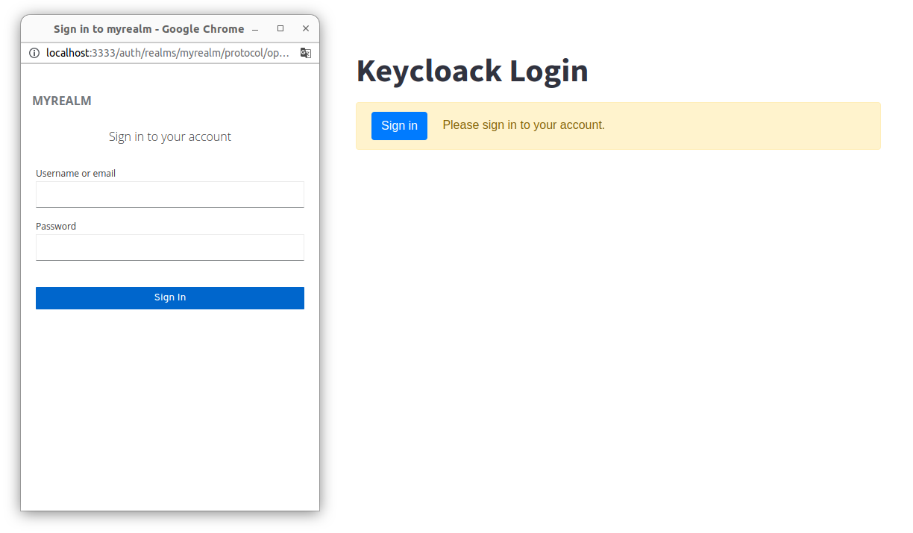
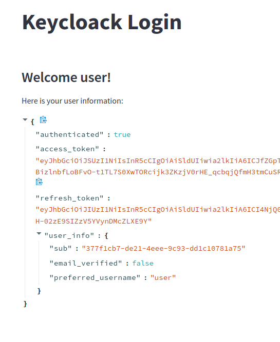

# Keycloack Streamlit tutorial
This is a sample repo to use streamlit with a logint through Keycloack.

|  Login | Logged  |
|---|---|
|  |  |

## How to run
* Run all
```
docker-compose up

# sreamlit at localhost:8000

# keycloack at localhost:3333
```
* configure KeyCloack
  * Login to admin console with admin, password
  * Add a Realm myrealm
  * Add a client myclient specifying streamlit url as http://localhost:8000
  * Add a user
  * Into User Credential set password (also with temporary check off)

## References
* python
* streamlit
* docker
* docker-compose
* KeyCloack