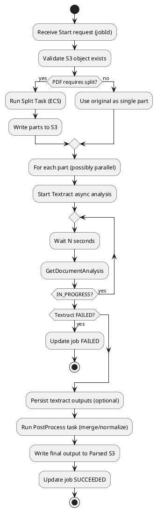

```plantuml
@startuml
start
:Receive Start request (jobId);
:Validate S3 object exists;

if (PDF requires split?) then (yes)
  :Run Split Task (ECS);
  :Write parts to S3;
else (no)
  :Use original as single part;
endif

:For each part (possibly parallel);
:Start Textract async analysis;
repeat
  :Wait N seconds;
  :GetDocumentAnalysis;
repeat while (IN_PROGRESS?) is (yes)

if (Textract FAILED?) then (yes)
  :Update job FAILED;
  stop
endif

:Persist textract outputs (optional);
:Run PostProcess task (merge/normalize);
:Write final output to Parsed S3;
:Update job SUCCEEDED;
stop
@enduml
```