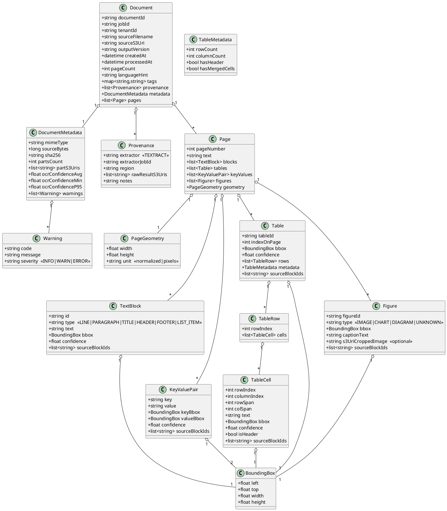

# Class Diagram

```plantuml
@startuml
skinparam classAttributeIconSize 0

class Document {
  +string documentId
  +string jobId
  +string tenantId
  +string sourceFilename
  +string sourceS3Uri
  +string outputVersion
  +datetime createdAt
  +datetime processedAt
  +int pageCount
  +string languageHint
  +map<string,string> tags
  +list<Provenance> provenance
  +DocumentMetadata metadata
  +list<Page> pages
}

class DocumentMetadata {
  +string mimeType
  +long sourceBytes
  +string sha256
  +int partsCount
  +list<string> partS3Uris
  +float ocrConfidenceAvg
  +float ocrConfidenceMin
  +float ocrConfidenceP95
  +list<Warning> warnings
}

class Warning {
  +string code
  +string message
  +string severity  <<INFO|WARN|ERROR>>
}

class Provenance {
  +string extractor  <<TEXTRACT>>
  +string extractorJobId
  +string region
  +list<string> rawResultS3Uris
  +string notes
}

class Page {
  +int pageNumber
  +string text
  +list<TextBlock> blocks
  +list<Table> tables
  +list<KeyValuePair> keyValues
  +list<Figure> figures
  +PageGeometry geometry
}

class PageGeometry {
  +float width
  +float height
  +string unit  <<normalized|pixels>>
}

class TextBlock {
  +string id
  +string type  <<LINE|PARAGRAPH|TITLE|HEADER|FOOTER|LIST_ITEM>>
  +string text
  +BoundingBox bbox
  +float confidence
  +list<string> sourceBlockIds
}

class KeyValuePair {
  +string key
  +string value
  +BoundingBox keyBbox
  +BoundingBox valueBbox
  +float confidence
  +list<string> sourceBlockIds
}

class Table {
  +string tableId
  +int indexOnPage
  +BoundingBox bbox
  +float confidence
  +list<TableRow> rows
  +TableMetadata metadata
  +list<string> sourceBlockIds
}

class TableMetadata {
  +int rowCount
  +int columnCount
  +bool hasHeader
  +bool hasMergedCells
}

class TableRow {
  +int rowIndex
  +list<TableCell> cells
}

class TableCell {
  +int rowIndex
  +int columnIndex
  +int rowSpan
  +int colSpan
  +string text
  +BoundingBox bbox
  +float confidence
  +bool isHeader
  +list<string> sourceBlockIds
}

class Figure {
  +string figureId
  +string type  <<IMAGE|CHART|DIAGRAM|UNKNOWN>>
  +BoundingBox bbox
  +string captionText
  +string s3UriCroppedImage  <<optional>>
  +list<string> sourceBlockIds
}

class BoundingBox {
  +float left
  +float top
  +float width
  +float height
}

Document "1" o-- "1" DocumentMetadata
Document "1" o-- "*" Page
Document "1" o-- "*" Provenance
DocumentMetadata "1" o-- "*" Warning

Page "1" o-- "1" PageGeometry
Page "1" o-- "*" TextBlock
Page "1" o-- "*" Table
Page "1" o-- "*" KeyValuePair
Page "1" o-- "*" Figure

Table "1" o-- "*" TableRow
TableRow "1" o-- "*" TableCell

TextBlock "1" o-- "1" BoundingBox
Table "1" o-- "1" BoundingBox
TableCell "1" o-- "1" BoundingBox
KeyValuePair "1" o-- "2" BoundingBox
Figure "1" o-- "1" BoundingBox
@enduml
```