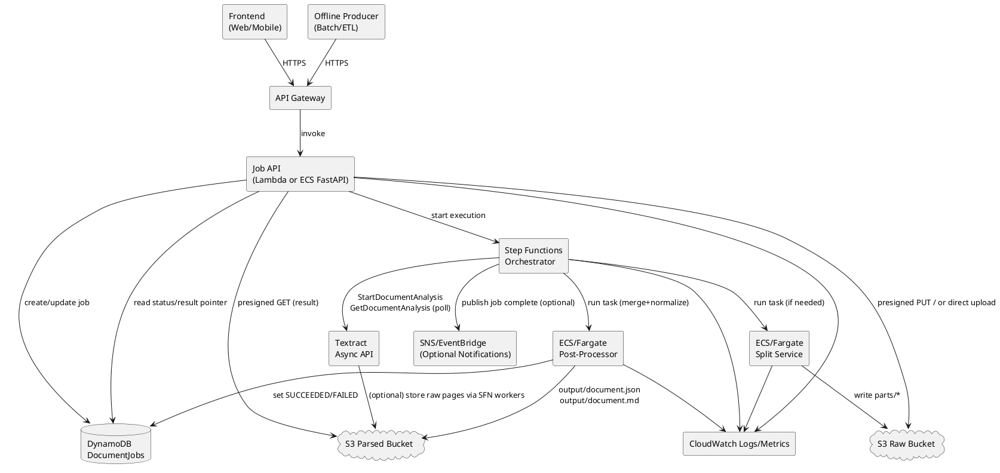

```plantuml
@startuml
skinparam componentStyle rectangle

component "Frontend\n(Web/Mobile)" as FE
component "Offline Producer\n(Batch/ETL)" as OP

component "API Gateway" as APIGW
component "Job API\n(Lambda or ECS FastAPI)" as JOBAPI
database "DynamoDB\nDocumentJobs" as DDB

cloud "S3 Raw Bucket" as S3RAW
cloud "S3 Parsed Bucket" as S3PARSED

component "Step Functions\nOrchestrator" as SFN
component "Textract\nAsync API" as TEXTRACT
component "ECS/Fargate\nSplit Service" as SPLIT
component "ECS/Fargate\nPost-Processor" as POST

component "CloudWatch Logs/Metrics" as CW
component "SNS/EventBridge\n(Optional Notifications)" as NOTIF

FE --> APIGW : HTTPS
OP --> APIGW : HTTPS

APIGW --> JOBAPI : invoke
JOBAPI --> DDB : create/update job
JOBAPI --> S3RAW : presigned PUT / or direct upload
JOBAPI --> SFN : start execution

SFN --> SPLIT : run task (if needed)
SPLIT --> S3RAW : write parts/*

SFN --> TEXTRACT : StartDocumentAnalysis\nGetDocumentAnalysis (poll)
TEXTRACT --> S3PARSED : (optional) store raw pages via SFN workers

SFN --> POST : run task (merge+normalize)
POST --> S3PARSED : output/document.json\noutput/document.md
POST --> DDB : set SUCCEEDED/FAILED

JOBAPI --> DDB : read status/result pointer
JOBAPI --> S3PARSED : presigned GET (result)

JOBAPI --> CW
SFN --> CW
SPLIT --> CW
POST --> CW

SFN --> NOTIF : publish job complete (optional)
@enduml
```