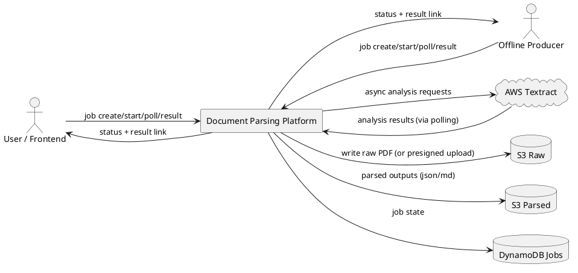

# Top Level Context

```plantuml
@startuml
left to right direction
actor "User / Frontend" as USER
actor "Offline Producer" as PROD

rectangle "Document Parsing Platform" as SYS

cloud "AWS Textract" as TEXTRACT
database "S3 Raw" as RAW
database "S3 Parsed" as PARSED
database "DynamoDB Jobs" as DDB

USER --> SYS : job create/start/poll/result
PROD --> SYS : job create/start/poll/result

SYS --> RAW : write raw PDF (or presigned upload)
SYS --> DDB : job state
SYS --> TEXTRACT : async analysis requests
TEXTRACT --> SYS : analysis results (via polling)
SYS --> PARSED : parsed outputs (json/md)
SYS --> USER : status + result link
SYS --> PROD : status + result link
@enduml
```