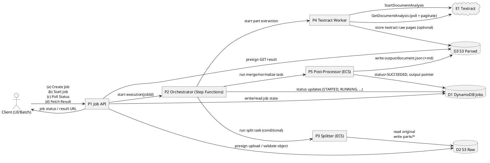

# Detailed Flows and Stores

```plantuml
@startuml
left to right direction

actor "Client (UI/Batch)" as CLIENT

rectangle "P1 Job API" as P1
rectangle "P2 Orchestrator (Step Functions)" as P2
rectangle "P3 Splitter (ECS)" as P3
rectangle "P4 Textract Worker" as P4
rectangle "P5 Post-Processor (ECS)" as P5

database "D1 DynamoDB Jobs" as D1
database "D2 S3 Raw" as D2
database "D3 S3 Parsed" as D3

cloud "E1 Textract" as E1

CLIENT --> P1 : (a) Create Job\n(b) Start Job\n(c) Poll Status\n(d) Fetch Result
P1 --> D1 : write/read job state
P1 --> D2 : presign upload / validate object
P1 --> P2 : start execution(jobId)

P2 --> D1 : status updates (STARTED, RUNNING, ...)
P2 --> P3 : run split task (conditional)
P3 --> D2 : read original\nwrite parts/*

P2 --> P4 : start part extraction
P4 --> E1 : StartDocumentAnalysis
P4 --> E1 : GetDocumentAnalysis (poll + paginate)
P4 --> D3 : store textract raw pages (optional)

P2 --> P5 : run merge/normalize task
P5 --> D3 : write output/document.json (+md)
P5 --> D1 : status=SUCCEEDED, output pointer

P1 --> D3 : presign GET result
P1 --> CLIENT : job status / result URL
@enduml
```