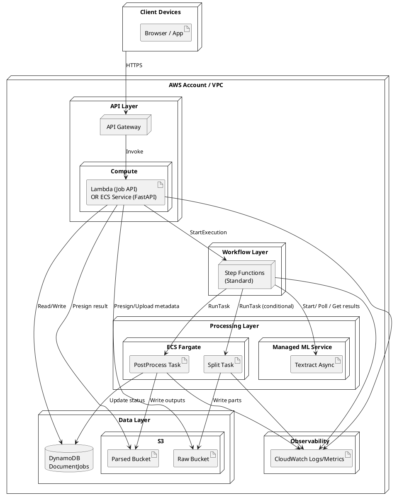

```plantuml

@startuml
node "Client Devices" as CLIENT {
  artifact "Browser / App" as APP
}

node "AWS Account / VPC" as AWS {
  node "API Layer" {
    node "API Gateway" as GW
    node "Compute" {
      artifact "Lambda (Job API)\nOR ECS Service (FastAPI)" as API
    }
  }

  node "Data Layer" {
    database "DynamoDB\nDocumentJobs" as DDB
    node "S3" {
      artifact "Raw Bucket" as RAW
      artifact "Parsed Bucket" as PARSED
    }
  }

  node "Workflow Layer" {
    node "Step Functions\n(Standard)" as SFN
  }

  node "Processing Layer" {
    node "ECS Fargate" {
      artifact "Split Task" as SPLIT
      artifact "PostProcess Task" as POST
    }
    node "Managed ML Service" {
      artifact "Textract Async" as TEXTRACT
    }
  }

  node "Observability" {
    artifact "CloudWatch Logs/Metrics" as CW
  }
}

CLIENT --> GW : HTTPS
GW --> API : Invoke
API --> DDB : Read/Write
API --> RAW : Presign/Upload metadata
API --> SFN : StartExecution

SFN --> SPLIT : RunTask (conditional)
SPLIT --> RAW : Write parts
SFN --> TEXTRACT : Start/ Poll / Get results
SFN --> POST : RunTask
POST --> PARSED : Write outputs
POST --> DDB : Update status
API --> PARSED : Presign result

API --> CW
SFN --> CW
SPLIT --> CW
POST --> CW
@enduml

```