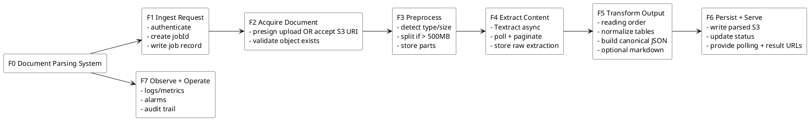

```plantuml
@startuml
left to right direction

' (optional) keep or remove this; some renderers also dislike the { } block form
skinparam rectangleBackgroundColor #FFFFFF

rectangle "F0 Document Parsing System" as F0

rectangle "F1 Ingest Request\n- authenticate\n- create jobId\n- write job record" as F1
rectangle "F2 Acquire Document\n- presign upload OR accept S3 URI\n- validate object exists" as F2
rectangle "F3 Preprocess\n- detect type/size\n- split if > 500MB\n- store parts" as F3
rectangle "F4 Extract Content\n- Textract async\n- poll + paginate\n- store raw extraction" as F4
rectangle "F5 Transform Output\n- reading order\n- normalize tables\n- build canonical JSON\n- optional markdown" as F5
rectangle "F6 Persist + Serve\n- write parsed S3\n- update status\n- provide polling + result URLs" as F6
rectangle "F7 Observe + Operate\n- logs/metrics\n- alarms\n- audit trail" as F7

F0 --> F1
F1 --> F2
F2 --> F3
F3 --> F4
F4 --> F5
F5 --> F6

F0 --> F7
@enduml
```