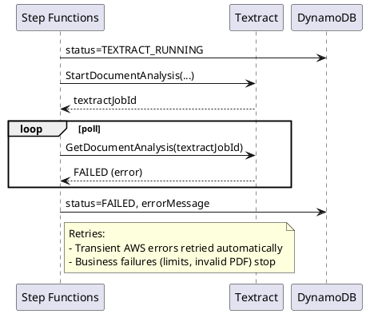

```plantuml
@startuml
participant "Step Functions" as SFN
participant "Textract" as TEXTRACT
participant "DynamoDB" as DDB

SFN -> DDB : status=TEXTRACT_RUNNING
SFN -> TEXTRACT : StartDocumentAnalysis(...)
TEXTRACT --> SFN : textractJobId

loop poll
  SFN -> TEXTRACT : GetDocumentAnalysis(textractJobId)
  TEXTRACT --> SFN : FAILED (error)
end

SFN -> DDB : status=FAILED, errorMessage

note right of SFN
Retries:
- Transient AWS errors retried automatically
- Business failures (limits, invalid PDF) stop
end note
@enduml
```