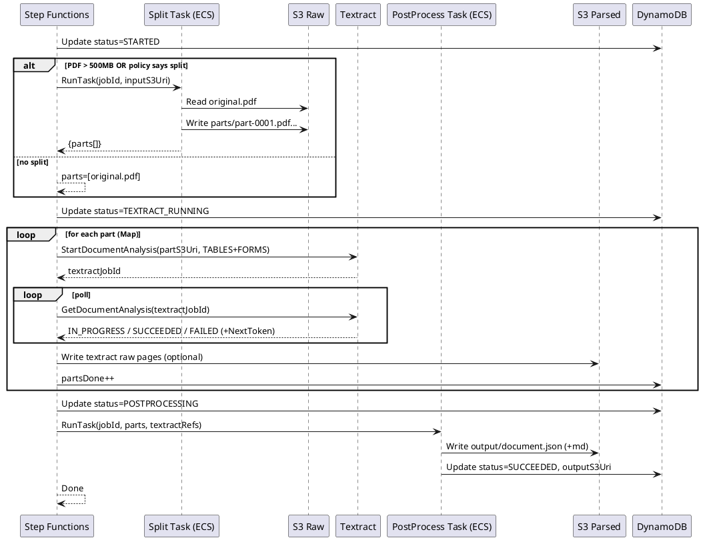

```plantuml
@startuml
participant "Step Functions" as SFN
participant "Split Task (ECS)" as SPLIT
participant "S3 Raw" as S3RAW
participant "Textract" as TEXTRACT
participant "PostProcess Task (ECS)" as POST
participant "S3 Parsed" as S3PARSED
participant "DynamoDB" as DDB

SFN -> DDB : Update status=STARTED

alt PDF > 500MB OR policy says split
  SFN -> SPLIT : RunTask(jobId, inputS3Uri)
  SPLIT -> S3RAW : Read original.pdf
  SPLIT -> S3RAW : Write parts/part-0001.pdf...
  SPLIT --> SFN : {parts[]}
else no split
  SFN --> SFN : parts=[original.pdf]
end

SFN -> DDB : Update status=TEXTRACT_RUNNING

loop for each part (Map)
  SFN -> TEXTRACT : StartDocumentAnalysis(partS3Uri, TABLES+FORMS)
  TEXTRACT --> SFN : textractJobId

  loop poll
    SFN -> TEXTRACT : GetDocumentAnalysis(textractJobId)
    TEXTRACT --> SFN : IN_PROGRESS / SUCCEEDED / FAILED (+NextToken)
  end

  SFN -> S3PARSED : Write textract raw pages (optional)
  SFN -> DDB : partsDone++
end

SFN -> DDB : Update status=POSTPROCESSING
SFN -> POST : RunTask(jobId, parts, textractRefs)
POST -> S3PARSED : Write output/document.json (+md)
POST -> DDB : Update status=SUCCEEDED, outputS3Uri

SFN --> SFN : Done
@enduml
```