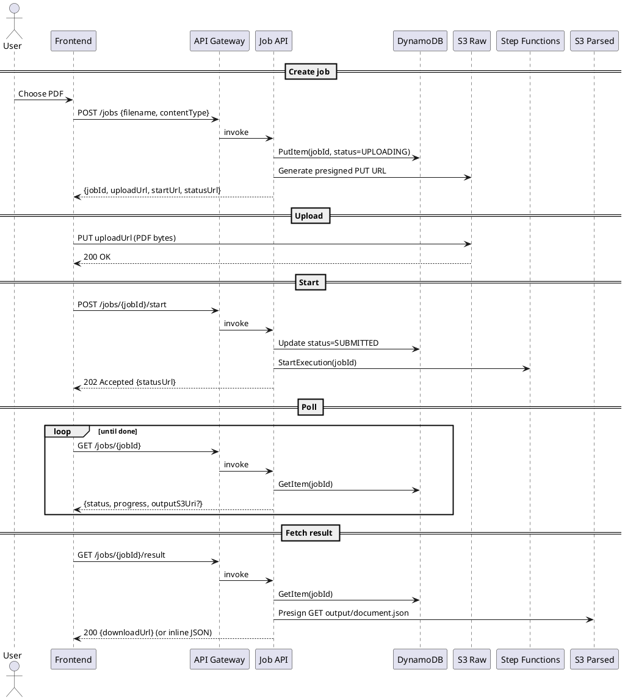

```plantuml

@startuml
actor User
participant "Frontend" as FE
participant "API Gateway" as GW
participant "Job API" as API
participant "DynamoDB" as DDB
participant "S3 Raw" as S3RAW
participant "Step Functions" as SFN
participant "S3 Parsed" as S3PARSED

== Create job ==
User -> FE : Choose PDF
FE -> GW : POST /jobs {filename, contentType}
GW -> API : invoke
API -> DDB : PutItem(jobId, status=UPLOADING)
API -> S3RAW : Generate presigned PUT URL
API --> FE : {jobId, uploadUrl, startUrl, statusUrl}

== Upload ==
FE -> S3RAW : PUT uploadUrl (PDF bytes)
S3RAW --> FE : 200 OK

== Start ==
FE -> GW : POST /jobs/{jobId}/start
GW -> API : invoke
API -> DDB : Update status=SUBMITTED
API -> SFN : StartExecution(jobId)
API --> FE : 202 Accepted {statusUrl}

== Poll ==
loop until done
  FE -> GW : GET /jobs/{jobId}
  GW -> API : invoke
  API -> DDB : GetItem(jobId)
  API --> FE : {status, progress, outputS3Uri?}
end

== Fetch result ==
FE -> GW : GET /jobs/{jobId}/result
GW -> API : invoke
API -> DDB : GetItem(jobId)
API -> S3PARSED : Presign GET output/document.json
API --> FE : 200 {downloadUrl} (or inline JSON)
@enduml

```