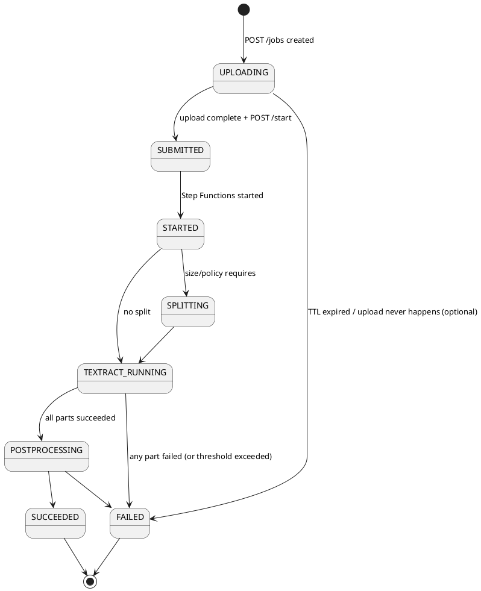

```plantuml
@startuml
[*] --> UPLOADING : POST /jobs created

UPLOADING --> SUBMITTED : upload complete + POST /start
UPLOADING --> FAILED : TTL expired / upload never happens (optional)

SUBMITTED --> STARTED : Step Functions started
STARTED --> SPLITTING : size/policy requires
SPLITTING --> TEXTRACT_RUNNING
STARTED --> TEXTRACT_RUNNING : no split

TEXTRACT_RUNNING --> POSTPROCESSING : all parts succeeded
TEXTRACT_RUNNING --> FAILED : any part failed (or threshold exceeded)

POSTPROCESSING --> SUCCEEDED
POSTPROCESSING --> FAILED

SUCCEEDED --> [*]
FAILED --> [*]
@enduml
```