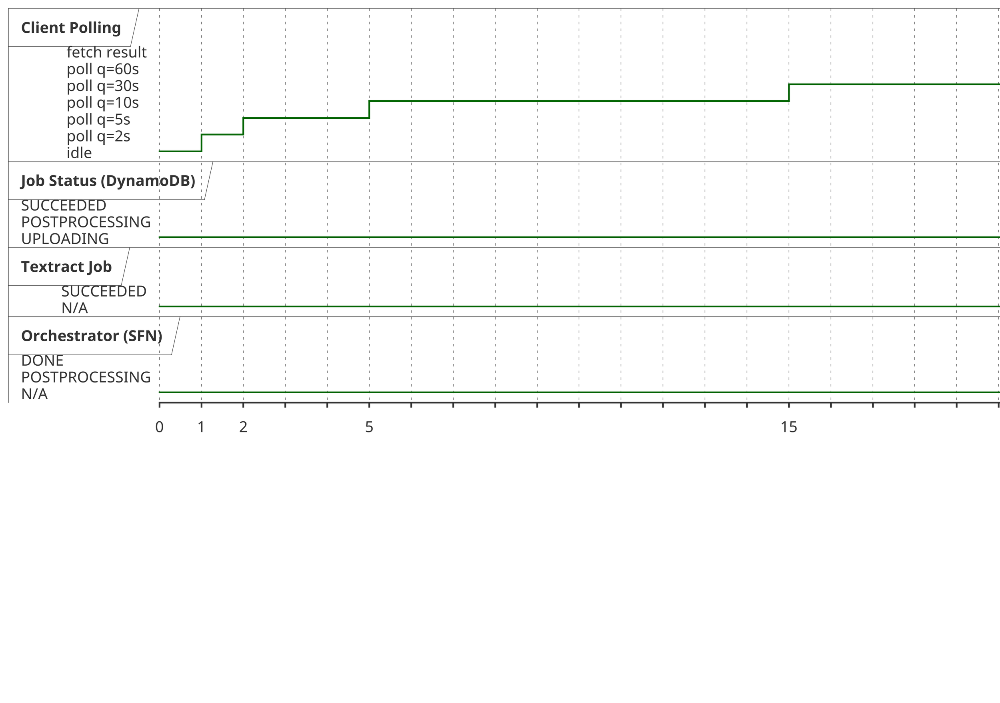

# Poll intervals, backoff, SLA

- client poll scheduling
- server job status transitions
- textract job status
- recommended backoff pattern

```plantuml
@startuml
' Optimized for viewability in common VSCode PlantUML renderers:
' - Use minute "ticks" instead of seconds to avoid a super-wide time axis
' - Increase font + DPI + scale for readability

scale 1.5
skinparam dpi 220
skinparam defaultFontSize 18
skinparam padding 10

robust "Client Polling" as CP
robust "Job Status (DynamoDB)" as JS
robust "Textract Job" as TJ
robust "Orchestrator (SFN)" as SF

' Time axis: MINUTES (tick = ~1 minute)
' Original seconds mapped roughly to minutes:
' 0s=0m, 10s~0m, 20s~0m, 60s=1m, 120s=2m, 300s=5m, 900s=15m, 1800s=30m, 2400s=40m, 2550s~43m

@0
CP is "idle"
JS is "UPLOADING"
TJ is "N/A"
SF is "N/A"

@0
JS is "SUBMITTED"
SF is "STARTED"

@0
SF is "TEXTRACT_RUNNING"
TJ is "IN_PROGRESS"
JS is "TEXTRACT_RUNNING"
CP is "poll q=2s"

@1
CP is "poll q=2s"

@2
CP is "poll q=5s"

@5
CP is "poll q=10s"

@15
CP is "poll q=30s"

@30
CP is "poll q=60s"

@40
TJ is "SUCCEEDED"
SF is "POSTPROCESSING"
JS is "POSTPROCESSING"

@43
JS is "SUCCEEDED"
SF is "DONE"
CP is "fetch result"

legend right
Time axis is minutes (compressed from seconds for readability).

Client polling backoff:
- 0–2 min: every 2s
- 2–5 min: every 5s
- 5–15 min: every 10s
- 15–30 min: every 30s
- 30+ min: every 60s

SLA example:
- P50: <= 10 min
- P95: <= 45 min
- Hard timeout: 6 hours per job
endlegend

@enduml
```