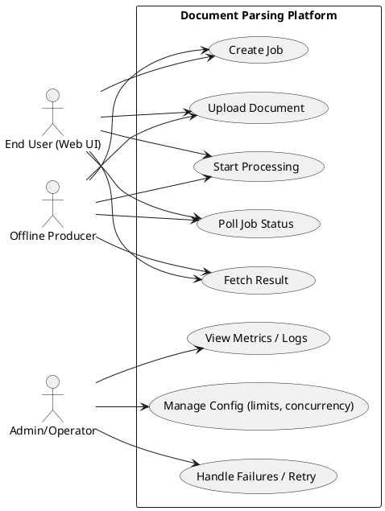

```plantuml
@startuml
left to right direction
actor "End User (Web UI)" as User
actor "Offline Producer" as Producer
actor "Admin/Operator" as Ops

rectangle "Document Parsing Platform" {
  usecase "Create Job" as UC1
  usecase "Upload Document" as UC2
  usecase "Start Processing" as UC3
  usecase "Poll Job Status" as UC4
  usecase "Fetch Result" as UC5
  usecase "Handle Failures / Retry" as UC6
  usecase "View Metrics / Logs" as UC7
  usecase "Manage Config (limits, concurrency)" as UC8
}

User --> UC1
User --> UC2
User --> UC3
User --> UC4
User --> UC5

Producer --> UC1
Producer --> UC2
Producer --> UC3
Producer --> UC4
Producer --> UC5

Ops --> UC6
Ops --> UC7
Ops --> UC8
@enduml
```