# Table of Contents

- [2. Legacy Migration and Boundary Protection Patterns](#2-legacy-migration-and-boundary-protection-patterns)
  - [5. Strangler Fig Pattern](#5-strangler-fig-pattern)
  - [6. Anti-Corruption Layer](#6-anti-corruption-layer)

---
## 2. Legacy Migration and Boundary Protection Patterns

These patterns help modernize legacy systems and integrate with external systems without polluting the new architecture.

### 5. Strangler Fig Pattern

#### What it is

The **Strangler Fig Pattern** is a legacy modernization pattern where a new system gradually grows around an old system until the old system can be safely retired.

The name comes from the strangler fig tree, which grows around an existing tree over time. In software, the new architecture slowly surrounds and replaces parts of the legacy system.

Instead of rewriting the whole system at once, you replace one capability, workflow, API, or route at a time.

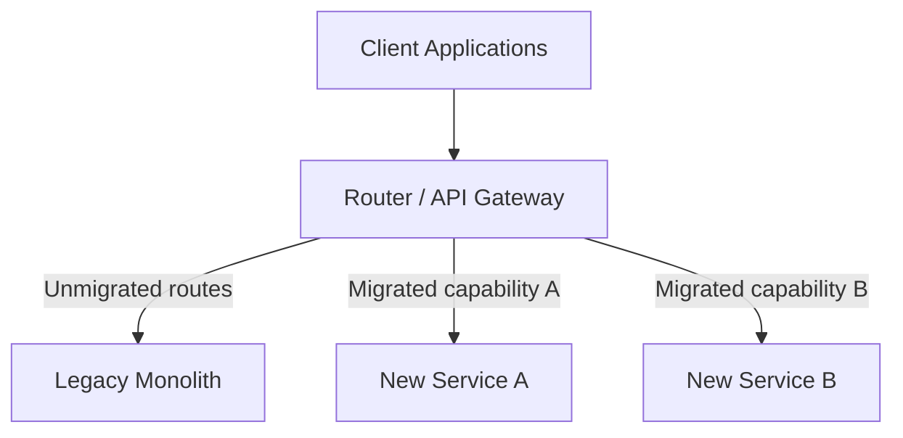

At the beginning, almost all traffic goes to the legacy system.

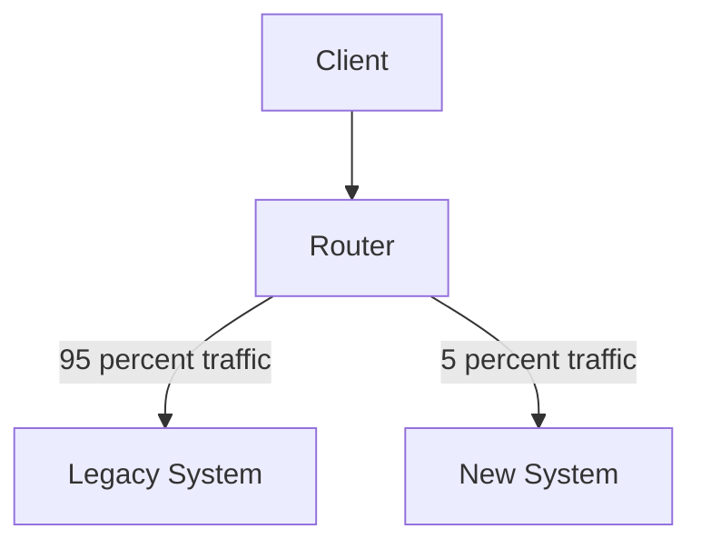

Over time, more functionality moves to the new system.

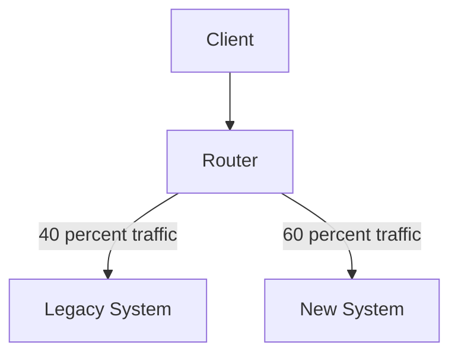

Eventually, the legacy system receives no traffic and can be retired.

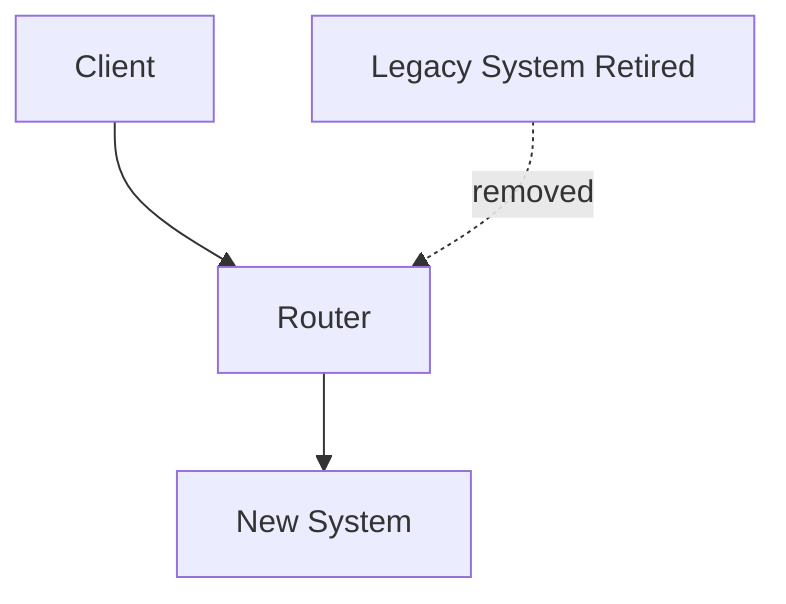

The central idea is:

> Replace the legacy system gradually by intercepting and redirecting specific functionality to the new system.

---

#### Why this pattern exists

Large rewrites are risky.

A big-bang rewrite usually tries to replace the entire legacy system in one major release:

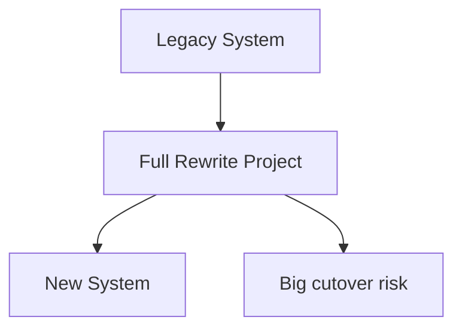

This often fails because:

* the legacy system contains years of hidden behavior,
* documentation is incomplete,
* business rules are embedded in old code,
* edge cases are discovered late,
* the new system takes too long to deliver value,
* teams underestimate data migration complexity,
* clients depend on undocumented behavior,
* the business cannot stop while engineering rewrites everything.

The Strangler Fig Pattern avoids this by making modernization incremental.

Instead of replacing everything at once, you choose one slice, build its replacement, route traffic to it, validate it, and repeat.

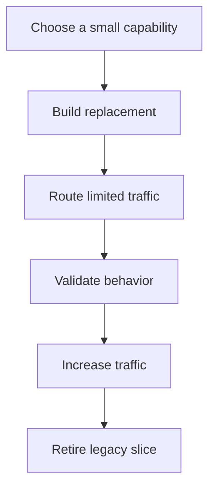

This lets teams learn from production behavior while reducing blast radius.

---

#### What it solves

The pattern solves the risk of **big-bang legacy replacement**.

A legacy monolith may contain many capabilities:

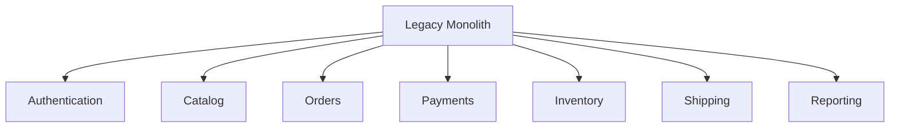

Trying to replace all of these at once is dangerous. The Strangler Fig Pattern replaces one area at a time.

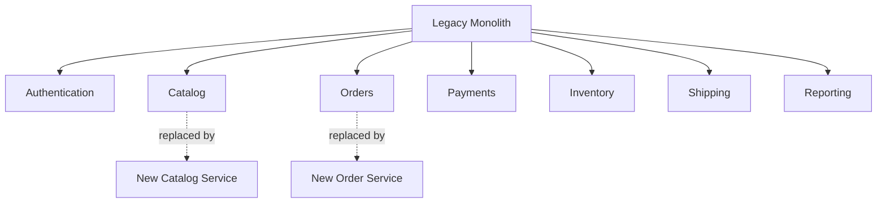

This creates a controlled migration path.

The old system keeps running while the new system gradually takes ownership of selected functionality.

---

#### Basic architecture

A Strangler Fig migration usually needs a routing layer in front of the legacy system.

That routing layer may be:

* an API gateway,
* a reverse proxy,
* a load balancer,
* a service mesh,
* an edge function,
* a facade service,
* an application-level routing module.

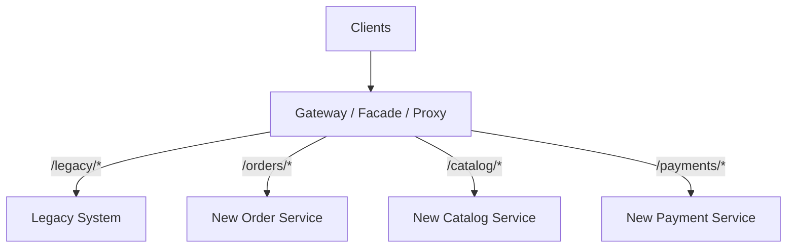

The gateway decides whether a request should go to the legacy system or to the new system.

For example:

| Route                      | Destination         |
| -------------------------- | ------------------- |
| `GET /products/{id}`       | New Catalog Service |
| `POST /orders`             | New Order Service   |
| `GET /customers/{id}`      | Legacy System       |
| `POST /payments/authorize` | New Payment Service |
| `GET /reports/daily-sales` | Legacy System       |

The route table changes gradually as functionality is migrated.

---

#### Example: route-based migration

Suppose the legacy system exposes these routes:

```http
GET /products/{productId}
GET /products/search
POST /orders
GET /orders/{orderId}
POST /payments/authorize
GET /customers/{customerId}
```

You might first migrate product reads to a new Catalog Service.

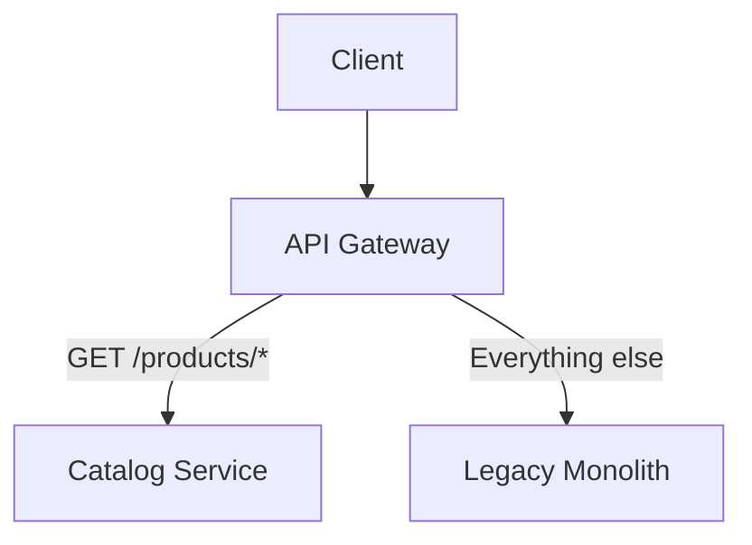

Example NGINX-style routing:

```nginx
location /products/ {
    proxy_pass http://catalog-service;
}

location / {
    proxy_pass http://legacy-monolith;
}
```

Later, you might migrate orders:

```nginx
location /products/ {
    proxy_pass http://catalog-service;
}

location /orders/ {
    proxy_pass http://order-service;
}

location / {
    proxy_pass http://legacy-monolith;
}
```

Then payments:

```nginx
location /products/ {
    proxy_pass http://catalog-service;
}

location /orders/ {
    proxy_pass http://order-service;
}

location /payments/ {
    proxy_pass http://payment-service;
}

location / {
    proxy_pass http://legacy-monolith;
}
```

This is the simplest form of strangling: route by endpoint.

---

#### Example: feature-based migration

Sometimes route-based migration is too coarse.

You may want only some users, tenants, regions, or feature flags to use the new system.

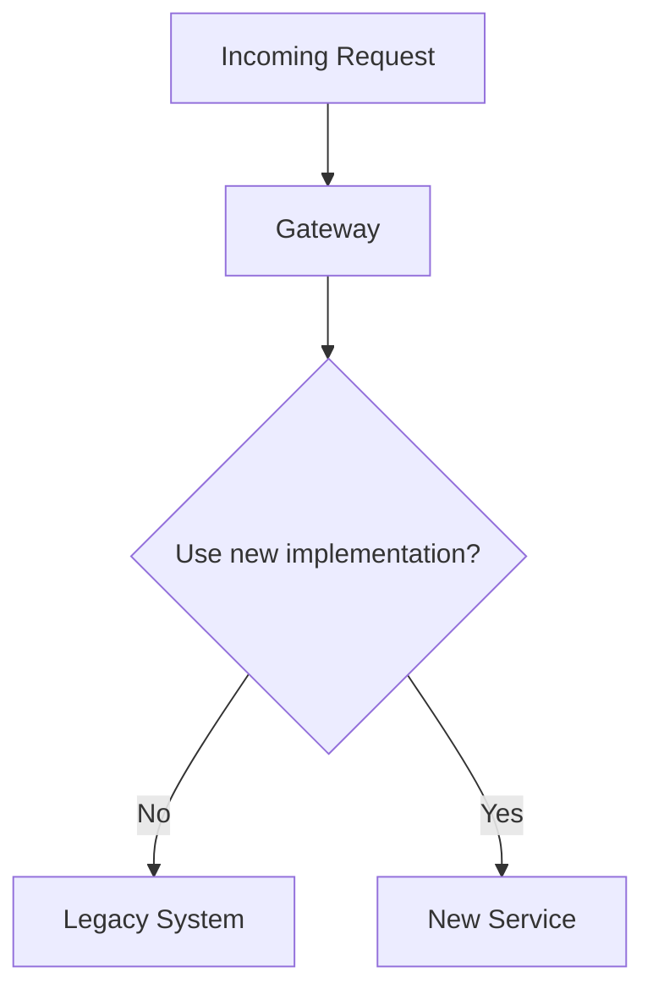

Routing decisions can be based on:

* user ID,
* tenant ID,
* region,
* product type,
* feature flag,
* request header,
* client version,
* percentage rollout,
* internal beta group.

Example pseudo-code:

```ts
function routeOrderRequest(req: Request): Target {
  const tenantId = req.header("X-Tenant-Id");
  const userId = req.header("X-User-Id");

  if (featureFlags.isEnabled("new-order-service", { tenantId, userId })) {
    return {
      service: "order-service",
      baseUrl: "http://orders-service"
    };
  }

  return {
    service: "legacy-monolith",
    baseUrl: "http://legacy-monolith"
  };
}
```

Feature-based migration is useful when you want a controlled rollout:

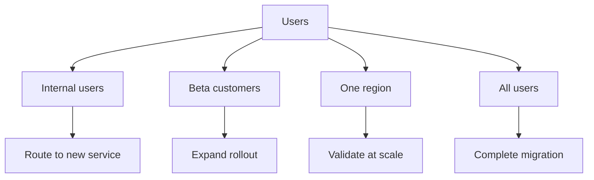

---

#### Example: API facade

Sometimes old clients must keep using the same API contract even while the backend changes.

In that case, add a facade.

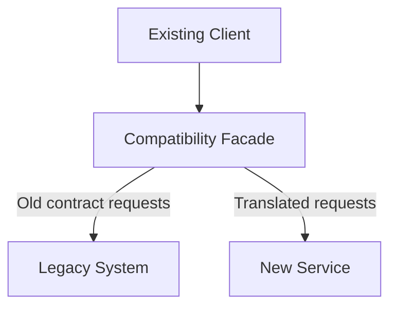

The facade preserves the old external API while translating selected operations to the new system.

Example:

```ts
app.get("/api/v1/products/:id", async (req, res) => {
  if (await shouldUseNewCatalog(req.params.id)) {
    const product = await catalogClient.getProduct(req.params.id);

    res.json({
      id: product.productId,
      name: product.title,
      description: product.description,
      price: product.currentPrice.amount
    });

    return;
  }

  const legacyProduct = await legacyClient.getProduct(req.params.id);
  res.json(legacyProduct);
});
```

This lets clients migrate later. The backend can evolve first.

The trade-off is that the facade can become complex if it accumulates too much translation logic.

---

#### Data migration strategies

The hardest part of strangling a legacy system is often not routing. It is data.

Legacy and new systems may need access to overlapping data during the migration.

There are several common strategies.

---

##### Strategy 1: New service reads legacy database temporarily

The new service may temporarily read from the legacy database.

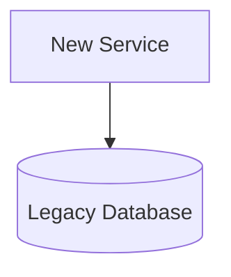

This can speed up migration, but it creates coupling.

Use this only as a temporary step. The new service is not truly independent while it depends on the legacy schema.

Risks:

* legacy schema changes can break the new service,
* new service inherits legacy data quality problems,
* business rules may be bypassed,
* database load increases,
* ownership remains unclear.

---

##### Strategy 2: New service owns new data only

The new service handles new records, while old records remain in the legacy system.

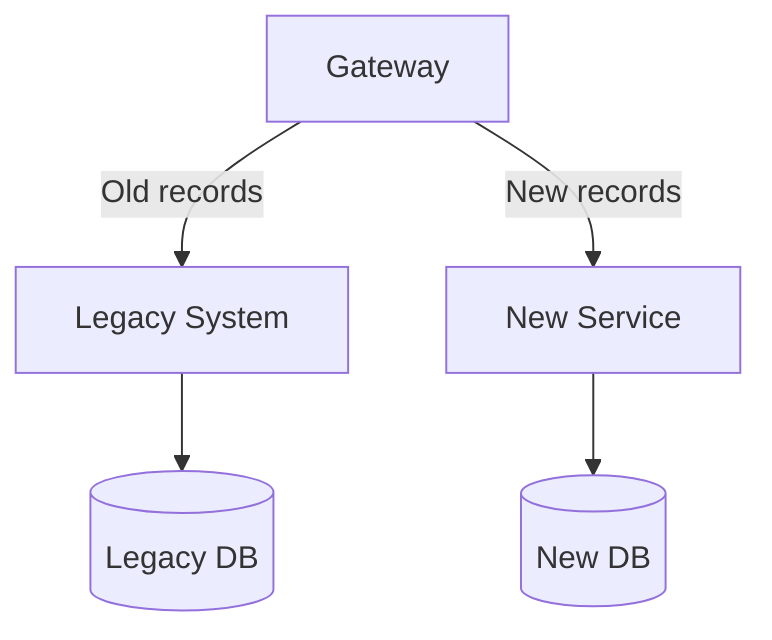

This works well when records have a natural cutover point.

Examples:

* new orders go to the new Order Service,
* old orders remain in the legacy system,
* new customers use the new onboarding system,
* existing customers remain in legacy until migrated.

Routing may depend on record creation date, ID format, tenant, or migration status.

---

##### Strategy 3: Replicate legacy data into the new system

The new service may maintain a copy of legacy data.

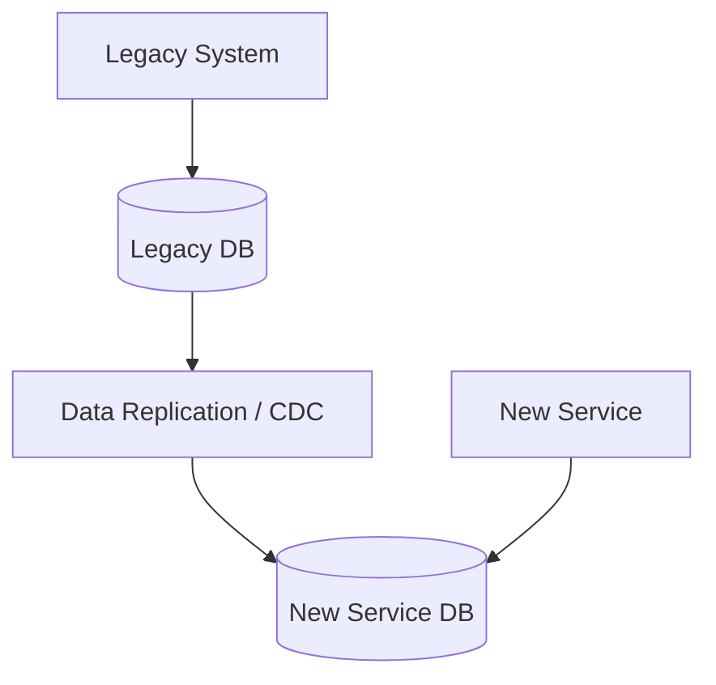

This can be done with:

* change data capture,
* database triggers,
* event streams,
* scheduled batch jobs,
* ETL pipelines,
* dual publishing from the legacy system.

This is useful when the new service needs fast reads without depending directly on the legacy database.

---

##### Strategy 4: Dual-write during transition

Both legacy and new systems may be written during migration.

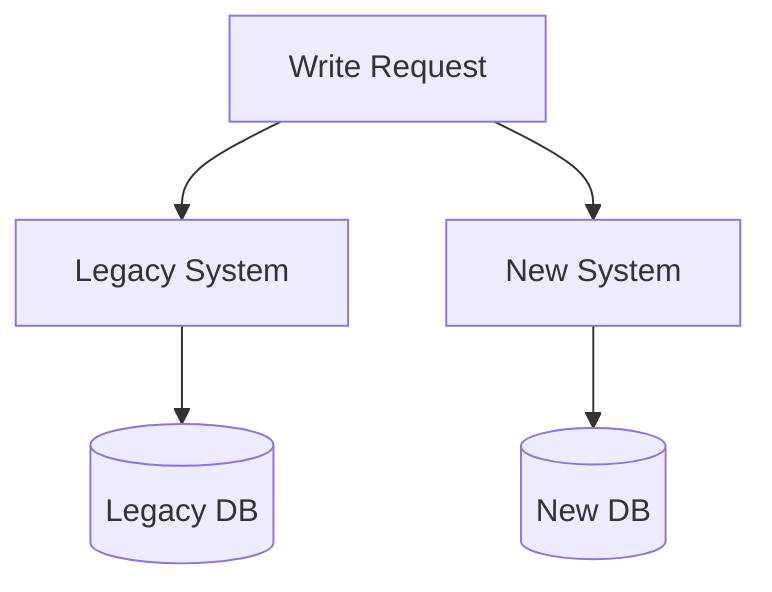

This is risky because one write may succeed and the other may fail.

If dual-write is unavoidable, use safeguards:

* idempotency keys,
* retry queues,
* reconciliation jobs,
* outbox pattern,
* clear source-of-truth rules,
* monitoring for divergence,
* manual repair tools.

A safer approach is usually to write to one source of truth and propagate changes asynchronously.

---

##### Strategy 5: New system becomes source of truth

At the end of migration, the new service owns the data.

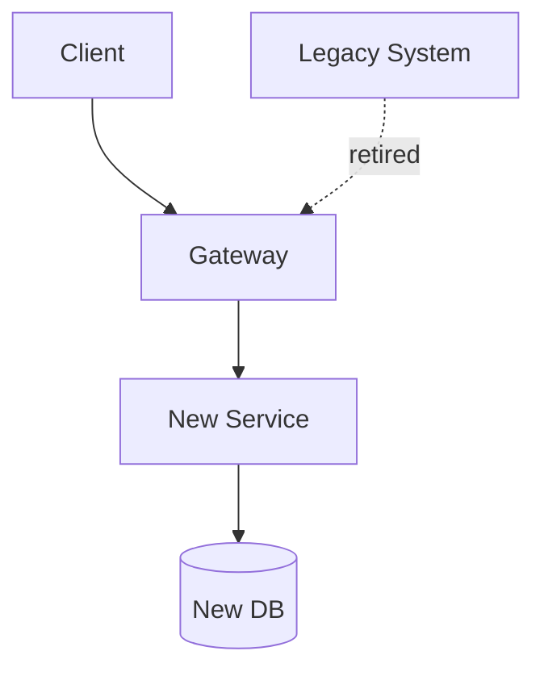

This is the target state. The legacy system no longer owns that capability or its data.

---

#### Source of truth during migration

A strangler migration must define source of truth clearly.

For every capability being migrated, ask:

| Question                                  | Example answer                                      |
| ----------------------------------------- | --------------------------------------------------- |
| Who owns reads today?                     | Legacy System                                       |
| Who owns writes today?                    | Legacy System                                       |
| Who owns reads during migration?          | New Service for migrated tenants, Legacy for others |
| Who owns writes during migration?         | New Service                                         |
| How is old data migrated?                 | CDC plus backfill                                   |
| When is legacy no longer source of truth? | After reconciliation passes for 30 days             |
| How is divergence detected?               | Daily comparison job                                |
| How is rollback handled?                  | Route traffic back to legacy for unmigrated records |

Without clear ownership, the system can end up with inconsistent data and unclear operational responsibility.

---

#### Anti-corruption layer

A new system should not blindly copy the legacy system’s model.

Legacy systems often contain old naming, outdated assumptions, overloaded fields, and technical constraints.

An **Anti-Corruption Layer** protects the new model by translating between legacy concepts and new concepts.

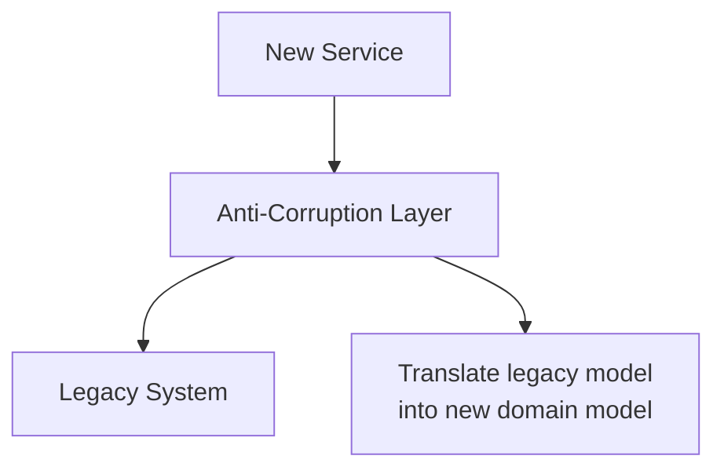

Example:

```ts
type LegacyCustomer = {
  cust_no: string;
  stat: "A" | "I" | "S";
  bill_addr_1: string;
  bill_addr_2?: string;
};

type Customer = {
  customerId: string;
  status: "ACTIVE" | "INACTIVE" | "SUSPENDED";
  billingAddress: {
    line1: string;
    line2?: string;
  };
};

function mapLegacyCustomer(legacy: LegacyCustomer): Customer {
  return {
    customerId: legacy.cust_no,
    status: mapStatus(legacy.stat),
    billingAddress: {
      line1: legacy.bill_addr_1,
      line2: legacy.bill_addr_2
    }
  };
}

function mapStatus(status: LegacyCustomer["stat"]): Customer["status"] {
  switch (status) {
    case "A":
      return "ACTIVE";
    case "I":
      return "INACTIVE";
    case "S":
      return "SUSPENDED";
  }
}
```

This translation prevents old concepts from leaking into the new service.

---

#### Migration phases

A typical Strangler Fig migration happens in phases.

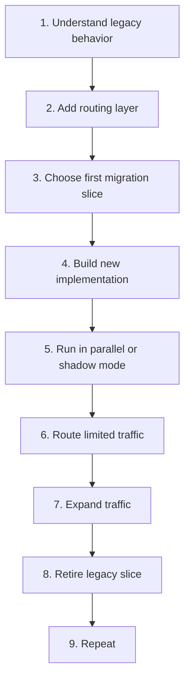

Each phase reduces risk.

---

##### Phase 1: Understand legacy behavior

Before replacing anything, observe the legacy system.

Useful activities:

* map routes and APIs,
* identify database tables,
* capture production traffic,
* document business rules,
* interview domain experts,
* identify high-risk workflows,
* inspect logs and reports,
* find undocumented client behavior,
* write characterization tests.

A **characterization test** captures how the old system behaves today, even if the behavior is strange.

Example:

```ts
describe("legacy discount behavior", () => {
  it("applies VIP discount before seasonal discount", async () => {
    const result = await legacyClient.calculatePrice({
      customerType: "VIP",
      productId: "prod_123",
      basePrice: 100,
      seasonalDiscount: 10
    });

    expect(result.finalPrice).toBe(80);
  });
});
```

The goal is not to prove the legacy system is elegant. The goal is to avoid accidentally breaking behavior the business relies on.

---

##### Phase 2: Add a routing layer

Introduce a routing layer that can send traffic to either the legacy or new system.

```mermaid
flowchart TD
    Client[Client]
    Gateway[Gateway]

    Legacy[Legacy System]
    New[New System]

    Client --> Gateway
    Gateway --> Legacy
    Gateway -. future route .-> New
```

At first, the gateway may route everything to legacy. This creates the control point needed for future migration.

---

##### Phase 3: Choose the first migration slice

Start with a slice that is valuable but not too risky.

Good first candidates:

* read-only endpoints,
* internal admin features,
* low-traffic routes,
* isolated workflows,
* one tenant,
* one region,
* one product category,
* non-critical background jobs.

Bad first candidates:

* payment settlement,
* mission-critical writes,
* workflows with many unknown dependencies,
* high-traffic endpoints without observability,
* areas with unclear business ownership.

---

##### Phase 4: Build the new implementation

Build the replacement with modern architecture, but avoid overbuilding.

The new slice should have:

* clear ownership,
* tests,
* monitoring,
* API compatibility or translation,
* data migration plan,
* rollback plan,
* source-of-truth decision,
* operational runbook.

---

##### Phase 5: Run in shadow mode

Before serving real responses, the new system can receive copied traffic.

```mermaid
flowchart TD
    Client[Client]
    Gateway[Gateway]

    Legacy[Legacy System]
    New[New System]

    Compare[Compare Results]

    Client --> Gateway
    Gateway -->|Primary response| Legacy
    Gateway -. shadow traffic .-> New

    Legacy --> Compare
    New --> Compare
```

The legacy system still serves users. The new system processes the same requests in the background. Differences are logged and analyzed.

This helps validate the new implementation with real production traffic.

---

##### Phase 6: Route limited traffic

Once shadow testing looks good, route a small amount of real traffic to the new system.

```mermaid
flowchart TD
    Requests[Requests]
    Router[Router]

    Legacy[Legacy System]
    New[New System]

    Requests --> Router

    Router -->|Most traffic| Legacy
    Router -->|Small rollout| New
```

Start with low-risk traffic:

* internal users,
* test tenants,
* beta customers,
* one region,
* one percent rollout.

---

##### Phase 7: Expand traffic

Increase traffic gradually while monitoring:

* error rates,
* latency,
* database load,
* user complaints,
* business metrics,
* data divergence,
* downstream failures,
* support tickets.

```mermaid
flowchart TD
    Internal[Internal users]
    OnePercent[1 percent]
    TenPercent[10 percent]
    FiftyPercent[50 percent]
    All[100 percent]

    Internal --> OnePercent
    OnePercent --> TenPercent
    TenPercent --> FiftyPercent
    FiftyPercent --> All
```

At each stage, compare the new system against expected behavior.

---

##### Phase 8: Retire the legacy slice

After the new system has fully taken over a capability, remove the old path.

Retirement should include:

* disabling old routes,
* removing old jobs,
* archiving or deleting old code,
* removing unused tables,
* updating documentation,
* removing temporary sync logic,
* shutting down unused infrastructure,
* updating operational ownership.

A migration is not complete until the old path is gone.

---

#### Example: migrating product catalog

Suppose a retail monolith owns product catalog, search, orders, and payments.

You decide to migrate catalog first.

Initial state:

```mermaid
flowchart TD
    Client[Client]
    Monolith[Retail Monolith]
    LegacyDB[(Legacy DB)]

    Client --> Monolith
    Monolith --> LegacyDB
```

Step 1: Add gateway.

```mermaid
flowchart TD
    Client[Client]
    Gateway[API Gateway]
    Monolith[Retail Monolith]
    LegacyDB[(Legacy DB)]

    Client --> Gateway
    Gateway --> Monolith
    Monolith --> LegacyDB
```

Step 2: Add Catalog Service with replicated product data.

```mermaid
flowchart TD
    Client[Client]
    Gateway[API Gateway]

    Monolith[Retail Monolith]
    LegacyDB[(Legacy DB)]

    CDC[Change Data Capture]
    CatalogDB[(Catalog DB)]
    Catalog[Catalog Service]

    Client --> Gateway

    Gateway --> Monolith

    Monolith --> LegacyDB
    LegacyDB --> CDC
    CDC --> CatalogDB
    Catalog --> CatalogDB
```

Step 3: Route product reads to the new service.

```mermaid
flowchart TD
    Client[Client]
    Gateway[API Gateway]

    Monolith[Retail Monolith]
    Catalog[Catalog Service]

    LegacyDB[(Legacy DB)]
    CatalogDB[(Catalog DB)]

    Client --> Gateway

    Gateway -->|Product reads| Catalog
    Gateway -->|Other routes| Monolith

    Monolith --> LegacyDB
    Catalog --> CatalogDB
```

Step 4: Move product writes to the new service.

```mermaid
flowchart TD
    Client[Client]
    Gateway[API Gateway]

    Monolith[Retail Monolith]
    Catalog[Catalog Service]

    LegacyDB[(Legacy DB)]
    CatalogDB[(Catalog DB)]

    Client --> Gateway

    Gateway -->|Catalog reads and writes| Catalog
    Gateway -->|Other routes| Monolith

    Catalog --> CatalogDB
    Monolith --> LegacyDB

    Catalog -. publish product events .-> Monolith
```

Step 5: Remove catalog code from the monolith.

```mermaid
flowchart TD
    Client[Client]
    Gateway[API Gateway]

    Monolith[Retail Monolith<br/>Catalog removed]
    Catalog[Catalog Service]
    CatalogDB[(Catalog DB)]

    Client --> Gateway

    Gateway --> Catalog
    Gateway --> Monolith

    Catalog --> CatalogDB
```

At this point, the Catalog capability has been strangled out of the legacy system.

---

#### Testing strategy

Testing is critical because the legacy system may contain hidden behavior.

Useful tests include:

| Test type                 | Purpose                                             |
| ------------------------- | --------------------------------------------------- |
| Characterization tests    | Capture current legacy behavior                     |
| Contract tests            | Ensure old clients still receive expected responses |
| Regression tests          | Confirm existing workflows still work               |
| Shadow comparisons        | Compare legacy and new responses under real traffic |
| Data reconciliation tests | Detect divergence between legacy and new stores     |
| Load tests                | Ensure new services can handle production traffic   |
| Rollback tests            | Confirm traffic can be routed back safely           |

Example response comparison:

```ts
async function compareProductResponse(productId: string) {
  const legacy = await legacyClient.getProduct(productId);
  const modern = await catalogClient.getProduct(productId);

  const normalizedLegacy = normalizeLegacyProduct(legacy);
  const normalizedModern = normalizeModernProduct(modern);

  if (!deepEqual(normalizedLegacy, normalizedModern)) {
    await comparisonLog.write({
      productId,
      legacy: normalizedLegacy,
      modern: normalizedModern,
      comparedAt: new Date().toISOString()
    });
  }
}
```

This is especially useful during shadow mode.

---

#### Rollback strategy

Every migration slice needs a rollback plan.

Rollback may mean:

* route traffic back to legacy,
* disable a feature flag,
* stop a data sync job,
* restore from backup,
* replay events,
* run a repair job,
* pause rollout.

```mermaid
flowchart TD
    Monitor[Monitor new system]
    Problem{Problem detected?}

    Continue[Continue rollout]
    Rollback[Route traffic back to legacy]
    Investigate[Investigate and repair]

    Monitor --> Problem

    Problem -->|No| Continue
    Problem -->|Yes| Rollback
    Rollback --> Investigate
```

Rollback is easier when the legacy system remains the source of truth. It becomes harder once writes move to the new system.

That is why source-of-truth decisions must be explicit.

---

#### Observability

During a strangler migration, you need visibility into both systems.

Track:

* traffic split,
* route destination,
* error rate by destination,
* latency by destination,
* data synchronization lag,
* response differences,
* business KPIs,
* dependency failures,
* fallback frequency,
* rollback events.

Example structured log:

```json
{
  "requestId": "req_123",
  "route": "/products/prod_456",
  "targetSystem": "catalog-service",
  "migrationSlice": "catalog-read-v2",
  "tenantId": "tenant_001",
  "statusCode": 200,
  "latencyMs": 42
}
```

This helps answer:

* Which traffic is still using legacy?
* Which traffic is using the new service?
* Are errors higher in the new path?
* Are users getting different results?
* Is data synchronization delayed?
* Is the migration safe to expand?

---

#### When to use it

Use the Strangler Fig Pattern when:

* replacing a large legacy system,
* migrating from monolith to microservices,
* modernizing old APIs,
* moving from on-premise to cloud,
* replacing a legacy database,
* decomposing a tightly coupled platform,
* migrating one tenant, region, or product line at a time,
* reducing risk is more important than speed,
* the business must keep running during modernization.

It is especially useful when the legacy system is too important to shut down and too large to rewrite safely.

---

#### When not to use it

Avoid or reconsider this pattern when:

* the system is small enough to replace safely,
* the legacy system is near end-of-life and barely used,
* the old and new systems cannot coexist,
* data synchronization would be too risky,
* the business can tolerate a clean cutover,
* the team cannot maintain two systems at once,
* the migration boundary cannot be isolated,
* there is no way to route traffic selectively.

For small systems, a direct rewrite may be simpler. For highly coupled data systems, a database-first migration or modular refactoring may be needed before strangling routes.

---

#### Benefits

**1. Reduces big-bang risk**

Functionality is replaced incrementally rather than all at once.

**2. Delivers value earlier**

Teams can ship the first migrated slice before the entire replacement is complete.

**3. Allows production validation**

New services can be tested with real traffic gradually.

**4. Supports rollback**

Traffic can often be routed back to legacy if something goes wrong.

**5. Enables learning**

Each migration slice teaches the team more about legacy behavior, data, clients, and operational needs.

**6. Preserves business continuity**

The legacy system keeps running while modernization happens.

**7. Helps prioritize**

Teams can migrate high-value or high-pain areas first.

---

#### Trade-offs

**1. Temporary complexity increases**

For a while, both legacy and new systems exist together.

**2. Routing becomes more complicated**

The gateway or facade must decide which system handles each request.

**3. Data synchronization is difficult**

Keeping old and new data consistent can be the hardest part.

**4. Duplicate logic may exist temporarily**

Some business rules may live in both systems during migration.

**5. Testing becomes more complex**

Both paths must be tested until the legacy slice is retired.

**6. Operational burden increases**

Teams must monitor, deploy, and support both old and new systems.

**7. Migrations can stall**

Without discipline, the organization may keep both systems forever.

---

#### Common mistakes

**Mistake 1: Not defining the source of truth**

If both systems can write the same data without clear ownership, divergence is likely.

**Mistake 2: Letting the facade become a new monolith**

A gateway or facade should route and translate, not accumulate all business logic.

**Mistake 3: Migrating the hardest part first**

Start with a slice that teaches you something but does not put the business at extreme risk.

**Mistake 4: Keeping dual-write logic forever**

Temporary migration logic should have an owner and a removal plan.

**Mistake 5: Ignoring legacy edge cases**

Old systems often contain undocumented behavior that users rely on.

**Mistake 6: Failing to retire old code**

A migration is incomplete until the legacy path is removed.

**Mistake 7: Not investing in observability**

Without route-level metrics and comparison logs, teams cannot safely expand traffic.

---

#### Practical design checklist

Before starting a strangler migration, answer:

* What capability or route is being migrated first?
* Why is this slice a good first candidate?
* How will traffic be routed?
* What is the rollback mechanism?
* Which system is source of truth for reads?
* Which system is source of truth for writes?
* Does the new system need legacy data?
* How will data be backfilled?
* How will ongoing data changes be synchronized?
* How will data divergence be detected?
* How will old and new responses be compared?
* What clients depend on the old behavior?
* What contracts must remain compatible?
* What metrics determine whether rollout can expand?
* Who owns the legacy path?
* Who owns the new path?
* When will the old code be removed?

---

#### Related patterns

| Pattern                          | Relationship                                                    |
| -------------------------------- | --------------------------------------------------------------- |
| Anti-Corruption Layer            | Protects the new model from legacy assumptions                  |
| API Gateway                      | Commonly used to route traffic between old and new systems      |
| Facade                           | Preserves old contracts while backend implementation changes    |
| Shadow Deployment                | Sends copied traffic to the new system before serving responses |
| Blue-Green Deployment            | Useful for switching traffic between versions                   |
| Database per Service             | Often the target state after migration                          |
| Change Data Capture              | Helps replicate legacy data into new services                   |
| Outbox Pattern                   | Helps publish reliable events during migration                  |
| Consumer-Driven Contracts        | Ensures clients are not broken during replacement               |
| Feature Flags                    | Enable controlled rollout and rollback                          |
| Decompose by Business Capability | Helps choose migration slices                                   |
| Decompose by Subdomain           | Helps avoid copying bad legacy boundaries                       |

---

#### Summary

The Strangler Fig Pattern replaces a legacy system gradually by building new functionality around it and routing traffic piece by piece.

The central idea is:

> Do not replace the whole legacy system in one risky cutover. Replace one slice at a time while the business keeps running.

A good strangler migration has:

* a clear routing layer,
* a carefully chosen first slice,
* explicit source-of-truth rules,
* data synchronization strategy,
* compatibility testing,
* observability,
* rollback,
* and a plan to remove old code.

The pattern reduces modernization risk, but it does not eliminate complexity. During the migration, the organization must operate both old and new systems. The migration only succeeds if each legacy slice is eventually retired, not just bypassed.

---

### 6. Anti-Corruption Layer

#### What it is

An **Anti-Corruption Layer**, often abbreviated as **ACL**, is a translation boundary between two systems that have different models, APIs, terminology, data formats, workflows, or assumptions.

Its purpose is to protect one system’s domain model from being polluted by another system’s model.

The most common use case is protecting a new service from a legacy system:

```mermaid
flowchart TD
    NewService[New Service]
    ACL[Anti-Corruption Layer]
    Legacy[Legacy System]

    NewService --> ACL
    ACL --> Legacy
```

The new service speaks its own clean domain language. The legacy system speaks its old language. The Anti-Corruption Layer translates between them.

The central idea is:

> Do not let another system’s model become your model by accident.

For example, suppose a legacy system represents customers like this:

```json
{
  "cust_no": "C12345",
  "stat": "A",
  "addr1": "100 Market Street",
  "addr2": "Suite 400",
  "acct_typ": "P",
  "vip_flg": "Y"
}
```

A new service should not blindly spread these fields throughout its codebase.

Instead, the Anti-Corruption Layer translates the legacy representation into the new service’s own model:

```json
{
  "customerId": "C12345",
  "status": "ACTIVE",
  "billingAddress": {
    "line1": "100 Market Street",
    "line2": "Suite 400"
  },
  "accountType": "PREMIUM",
  "isVip": true
}
```

The translation may look simple in this example, but in real systems it often includes business rules, workflow mapping, error handling, retries, identity mapping, and data normalization.

---

#### Why this pattern exists

Systems rarely agree on meaning.

A legacy monolith, a vendor API, an ERP, a CRM, and a new microservice may all use different names and assumptions for the same business concept.

For example, one system may use:

| Concept            | Legacy system     | New service                  |
| ------------------ | ----------------- | ---------------------------- |
| Customer ID        | `cust_no`         | `customerId`                 |
| Active customer    | `stat = A`        | `status = ACTIVE`            |
| Suspended customer | `stat = S`        | `status = SUSPENDED`         |
| Premium account    | `acct_typ = P`    | `accountType = PREMIUM`      |
| Deleted record     | `delete_flag = Y` | `lifecycleStatus = ARCHIVED` |

At first, it can seem faster to reuse the external model everywhere:

```mermaid
flowchart TD
    Legacy[Legacy System]
    NewService[New Service]
    Domain[New Domain Logic]
    DB[(New Service DB)]

    Legacy --> NewService
    NewService --> Domain
    Domain --> DB

    LegacyModel[Legacy fields leak everywhere]
    NewService --> LegacyModel
    Domain --> LegacyModel
    DB --> LegacyModel
```

This creates long-term coupling.

The new system begins to inherit legacy names, legacy status codes, legacy workflows, and legacy mistakes. Over time, the new system becomes difficult to evolve because its internal model is shaped by a system it was supposed to replace or integrate with.

An Anti-Corruption Layer prevents this by isolating translation logic:

```mermaid
flowchart TD
    Legacy[Legacy System]
    ACL[Anti-Corruption Layer]
    Domain[Clean Domain Model]
    NewService[New Service]

    Legacy --> ACL
    ACL --> Domain
    Domain --> NewService
```

The external model still exists, but it is contained.

---

#### What it solves

The Anti-Corruption Layer solves **model contamination**.

Model contamination happens when one system’s assumptions leak into another system.

Common signs include:

* legacy field names appear throughout new code,
* new services use old status codes directly,
* external API response shapes become internal domain objects,
* vendor-specific terminology appears in business logic,
* database column names shape service APIs,
* error handling depends on raw external error strings,
* new workflows are forced to match old workflows,
* teams cannot change the new model without changing legacy integration code.

For example, this is contaminated domain logic:

```ts id="vlj407"
function canPlaceOrder(customer: LegacyCustomer): boolean {
  return customer.stat === "A" && customer.del_flg !== "Y";
}
```

The business rule is about whether the customer can place an order, but the logic depends directly on legacy fields.

A cleaner version isolates legacy interpretation:

```ts id="o9med2"
function canPlaceOrder(customer: Customer): boolean {
  return customer.status === "ACTIVE" && customer.lifecycleStatus !== "ARCHIVED";
}
```

The mapping from `stat` and `del_flg` happens outside the domain logic.

---

#### Basic architecture

An Anti-Corruption Layer usually sits between the new service and the external system.

```mermaid
flowchart TD
    Client[Client]

    subgraph NewService[New Service]
        API[Service API]
        Domain[Domain Logic]
        Port[External System Port]
    end

    ACL[Anti-Corruption Layer]
    External[Legacy or External System]

    Client --> API
    API --> Domain
    Domain --> Port
    Port --> ACL
    ACL --> External
```

The new service talks to a local interface that makes sense in its own domain. The ACL implements that interface by calling the external system and translating results.

This keeps external details away from the core business logic.

---

#### Example: customer integration

Suppose a new Order Service needs customer status from a legacy CRM before allowing an order.

The Order Service wants to think in this model:

```ts id="ec1gra"
type Customer = {
  customerId: string;
  status: "ACTIVE" | "INACTIVE" | "SUSPENDED";
  lifecycleStatus: "CURRENT" | "ARCHIVED";
  accountType: "STANDARD" | "PREMIUM";
};
```

The legacy CRM returns this model:

```ts id="7aj5h5"
type LegacyCrmCustomer = {
  cust_no: string;
  stat: "A" | "I" | "S";
  del_flg: "Y" | "N";
  acct_typ: "S" | "P";
};
```

The Anti-Corruption Layer translates between them:

```ts id="38r9u9"
function mapLegacyCustomer(legacy: LegacyCrmCustomer): Customer {
  return {
    customerId: legacy.cust_no,
    status: mapStatus(legacy.stat),
    lifecycleStatus: legacy.del_flg === "Y" ? "ARCHIVED" : "CURRENT",
    accountType: legacy.acct_typ === "P" ? "PREMIUM" : "STANDARD"
  };
}

function mapStatus(status: LegacyCrmCustomer["stat"]): Customer["status"] {
  switch (status) {
    case "A":
      return "ACTIVE";
    case "I":
      return "INACTIVE";
    case "S":
      return "SUSPENDED";
  }
}
```

The domain logic uses only the clean model:

```ts id="tn7d22"
function validateCustomerCanOrder(customer: Customer): void {
  if (customer.lifecycleStatus === "ARCHIVED") {
    throw new Error("Archived customers cannot place orders");
  }

  if (customer.status !== "ACTIVE") {
    throw new Error("Customer is not active");
  }
}
```

The Order Service never needs to know that the CRM uses `stat = A` for active customers.

---

#### ACL as adapter

A common implementation is the **adapter pattern**.

The domain defines an interface it needs:

```ts id="318q2a"
type CustomerProfile = {
  customerId: string;
  status: "ACTIVE" | "INACTIVE" | "SUSPENDED";
  accountType: "STANDARD" | "PREMIUM";
};

interface CustomerDirectory {
  getCustomer(customerId: string): Promise<CustomerProfile>;
}
```

The Anti-Corruption Layer implements that interface using the legacy system:

```ts id="krkkn1"
class LegacyCrmCustomerDirectory implements CustomerDirectory {
  constructor(private readonly httpClient: HttpClient) {}

  async getCustomer(customerId: string): Promise<CustomerProfile> {
    const response = await this.httpClient.get<LegacyCrmCustomer>(
      `/legacy-crm/customers/${customerId}`
    );

    return mapLegacyCustomerToProfile(response.data);
  }
}

function mapLegacyCustomerToProfile(
  legacy: LegacyCrmCustomer
): CustomerProfile {
  return {
    customerId: legacy.cust_no,
    status: mapLegacyStatus(legacy.stat),
    accountType: legacy.acct_typ === "P" ? "PREMIUM" : "STANDARD"
  };
}
```

The domain service depends on the interface, not the legacy API:

```ts id="s9wwd6"
class OrderPlacementService {
  constructor(private readonly customerDirectory: CustomerDirectory) {}

  async placeOrder(command: PlaceOrderCommand): Promise<Order> {
    const customer = await this.customerDirectory.getCustomer(command.customerId);

    if (customer.status !== "ACTIVE") {
      throw new Error("Customer is not eligible to place orders");
    }

    return createOrder(command);
  }
}
```

This means the legacy CRM can later be replaced without changing order placement logic. Only the adapter changes.

---

#### ACL for outbound requests

Anti-Corruption Layers are not only for reading external data. They also translate outbound commands.

Suppose the new Payment Service uses this command:

```ts id="0x8cx7"
type AuthorizePaymentCommand = {
  paymentId: string;
  orderId: string;
  amount: {
    value: number;
    currency: "USD" | "EUR" | "GBP";
  };
  paymentMethodToken: string;
};
```

But the legacy payment gateway expects this request:

```json
{
  "txn_ref": "pay_123",
  "ord_ref": "ord_456",
  "amt_cents": 12999,
  "curr": "USD",
  "pm_token": "tok_abc"
}
```

The ACL maps the outbound command:

```ts id="92w64p"
function toLegacyPaymentRequest(
  command: AuthorizePaymentCommand
): LegacyPaymentRequest {
  return {
    txn_ref: command.paymentId,
    ord_ref: command.orderId,
    amt_cents: Math.round(command.amount.value * 100),
    curr: command.amount.currency,
    pm_token: command.paymentMethodToken
  };
}
```

It also maps the response:

```ts id="7vh8s2"
function fromLegacyPaymentResponse(
  response: LegacyPaymentResponse
): PaymentAuthorization {
  return {
    paymentId: response.txn_ref,
    authorizationId: response.auth_code,
    status: mapPaymentStatus(response.resp_cd),
    authorizedAt: new Date(response.ts)
  };
}
```

The rest of the Payment Service uses the clean domain model.

---

#### ACL for workflow translation

Sometimes translation is not just about fields. The systems may have different workflow semantics.

For example, a new Order Service may have a simple order lifecycle:

```mermaid
stateDiagram-v2
    [*] --> Pending
    Pending --> Confirmed
    Confirmed --> Shipped
    Confirmed --> Cancelled
    Shipped --> Delivered
```

But a legacy fulfillment system may use different states:

```mermaid
stateDiagram-v2
    [*] --> N
    N --> A
    A --> P
    P --> D
    A --> X
```

Where:

| Legacy state | Meaning           |
| ------------ | ----------------- |
| `N`          | New               |
| `A`          | Allocated         |
| `P`          | Picked and packed |
| `D`          | Dispatched        |
| `X`          | Cancelled         |

The ACL translates workflow state:

```ts id="0o039o"
type OrderStatus =
  | "PENDING"
  | "CONFIRMED"
  | "SHIPPED"
  | "CANCELLED"
  | "DELIVERED";

type LegacyFulfillmentStatus = "N" | "A" | "P" | "D" | "X";

function mapFulfillmentStatus(
  status: LegacyFulfillmentStatus
): OrderStatus {
  switch (status) {
    case "N":
      return "PENDING";
    case "A":
      return "CONFIRMED";
    case "P":
      return "CONFIRMED";
    case "D":
      return "SHIPPED";
    case "X":
      return "CANCELLED";
  }
}
```

This mapping is more than renaming. It compresses and interprets another system’s lifecycle.

That is why Anti-Corruption Layers can become complex. Real translation often involves business meaning.

---

#### ACL for error translation

External systems often return errors that do not match the new service’s error model.

Legacy error:

```json
{
  "err": "CUST_STAT_INVALID",
  "code": 8817,
  "msg": "Customer status is not valid for operation"
}
```

New service error:

```json
{
  "error": "CUSTOMER_NOT_ELIGIBLE",
  "message": "Customer is not eligible to place an order"
}
```

The ACL should translate errors too:

```ts id="l4wx7m"
class CustomerNotEligibleError extends Error {}
class ExternalSystemUnavailableError extends Error {}

function mapLegacyCrmError(error: LegacyCrmError): Error {
  switch (error.code) {
    case 8817:
      return new CustomerNotEligibleError(
        "Customer is not eligible to place an order"
      );

    case 9001:
    case 9002:
      return new ExternalSystemUnavailableError(
        "Customer system is temporarily unavailable"
      );

    default:
      return new Error("Unexpected customer system error");
  }
}
```

This prevents raw legacy errors from leaking into your API, logs, and business logic.

---

#### ACL for identity mapping

Different systems often use different identifiers for the same real-world thing.

For example:

| Entity   | New service ID | Legacy ID        |
| -------- | -------------- | ---------------- |
| Customer | `cus_123`      | `C0009981`       |
| Product  | `prod_456`     | `SKU-8841`       |
| Order    | `ord_789`      | `SO-2024-000331` |

The ACL may need an identity mapping table:

```mermaid
flowchart TD
    NewService[New Service]
    ACL[Anti-Corruption Layer]
    MappingDB[(ID Mapping Table)]
    Legacy[Legacy System]

    NewService --> ACL
    ACL --> MappingDB
    ACL --> Legacy
```

Example table:

| Local ID   | External system | External ID      |
| ---------- | --------------- | ---------------- |
| `cus_123`  | Legacy CRM      | `C0009981`       |
| `prod_456` | Legacy ERP      | `SKU-8841`       |
| `ord_789`  | Legacy OMS      | `SO-2024-000331` |

Example lookup:

```ts id="skltui"
async function getLegacyCustomerId(customerId: string): Promise<string> {
  const mapping = await idMappingRepository.find({
    localId: customerId,
    externalSystem: "LEGACY_CRM"
  });

  if (!mapping) {
    throw new Error(`No legacy customer mapping for ${customerId}`);
  }

  return mapping.externalId;
}
```

Identity mapping is often one of the most important parts of an ACL during legacy migration.

---

#### ACL placement options

An Anti-Corruption Layer can be implemented in several places.

##### Option 1: Inside the consuming service

```mermaid
flowchart TD
    Service[New Service]

    subgraph ServiceBox[Inside New Service]
        Domain[Domain Logic]
        Adapter[Legacy Adapter / ACL]
    end

    Legacy[Legacy System]

    Service --> ServiceBox
    Domain --> Adapter
    Adapter --> Legacy
```

This is common when only one service needs the translation.

Benefits:

* simple deployment,
* translation is close to the domain,
* easy to test with the service,
* no extra network hop.

Trade-off:

* translation may be duplicated if many services need it.

##### Option 2: Separate ACL service

```mermaid
flowchart TD
    ServiceA[Service A]
    ServiceB[Service B]
    ACLService[Shared ACL Service]
    Legacy[Legacy System]

    ServiceA --> ACLService
    ServiceB --> ACLService
    ACLService --> Legacy
```

This can be useful when many services need the same protected access to a legacy system.

Benefits:

* shared translation,
* centralized access control,
* one place to handle legacy quirks,
* easier legacy throttling and caching.

Trade-offs:

* extra deployment,
* extra network hop,
* risk of becoming a bottleneck,
* risk of becoming a new mini-monolith.

##### Option 3: At the edge or gateway

```mermaid
flowchart TD
    Client[Client]
    Gateway[Gateway with Translation]
    Legacy[Legacy System]
    NewService[New Service]

    Client --> Gateway
    Gateway --> Legacy
    Gateway --> NewService
```

This is useful for client compatibility, but should be used carefully. Gateways are usually better for routing, authentication, rate limiting, and protocol translation than deep domain translation.

If a gateway accumulates too much business mapping, it can become a new monolith.

---

#### Example: separate ACL service API

A dedicated ACL service may expose a clean API:

```http id="5x8rc5"
GET /customers/{customerId}/profile
```

Internally, it calls the legacy CRM:

```http id="nl410h"
GET /crm/v2/cust?cust_no=C0009981&include_flags=Y
```

The clean response:

```json
{
  "customerId": "cus_123",
  "status": "ACTIVE",
  "accountType": "PREMIUM",
  "billingAddress": {
    "line1": "100 Market Street",
    "line2": "Suite 400"
  }
}
```

The consuming services never see the legacy CRM response shape.

---

#### ACL and caching

Sometimes the Anti-Corruption Layer caches translated data.

```mermaid
flowchart TD
    Service[New Service]
    ACL[Anti-Corruption Layer]
    Cache[(Cache)]
    Legacy[Legacy System]

    Service --> ACL
    ACL --> Cache
    ACL --> Legacy
```

Caching can reduce load on slow or expensive legacy systems.

But be careful. Cached data may become stale.

Useful questions:

* How fresh does the data need to be?
* Is stale data acceptable?
* What is the cache TTL?
* How is the cache invalidated?
* What happens if the legacy system is unavailable?
* Can the ACL serve stale data during outages?
* Is the cached data sensitive?

Example:

```ts id="u6l5kz"
async function getCustomerProfile(customerId: string): Promise<CustomerProfile> {
  const cacheKey = `customer-profile:${customerId}`;

  const cached = await cache.get(cacheKey);
  if (cached) {
    return JSON.parse(cached);
  }

  const legacy = await legacyCrmClient.getCustomer(customerId);
  const profile = mapLegacyCustomerToProfile(legacy);

  await cache.set(cacheKey, JSON.stringify(profile), {
    ttlSeconds: 300
  });

  return profile;
}
```

Caching belongs in the ACL when the cache is part of protecting the domain from legacy latency, instability, or rate limits.

---

#### ACL and resilience

Legacy and external systems are often slow, unreliable, rate-limited, or hard to scale.

An Anti-Corruption Layer is a good place to add resilience logic:

* timeouts,
* retries,
* circuit breakers,
* rate limiting,
* fallback behavior,
* bulkheads,
* request normalization,
* response validation.

```mermaid
flowchart TD
    Service[New Service]
    ACL[Anti-Corruption Layer]

    Timeout[Timeouts]
    Retry[Retries]
    Circuit[Circuit Breaker]
    Mapping[Model Translation]

    Legacy[Legacy System]

    Service --> ACL

    ACL --> Timeout
    Timeout --> Retry
    Retry --> Circuit
    Circuit --> Mapping
    Mapping --> Legacy
```

Example:

```ts id="d5g4rr"
async function callLegacyWithTimeout<T>(
  operation: () => Promise<T>,
  timeoutMs: number
): Promise<T> {
  return Promise.race([
    operation(),
    new Promise<T>((_, reject) =>
      setTimeout(() => reject(new Error("Legacy call timed out")), timeoutMs)
    )
  ]);
}
```

The rest of the domain should not need to know about legacy timeout behavior. It should receive a meaningful domain error.

---

#### ACL and events

Anti-Corruption Layers can also translate events.

Suppose a legacy system emits this event:

```json
{
  "type": "CUST_UPD",
  "cust_no": "C0009981",
  "stat": "S",
  "upd_ts": "20260429120000"
}
```

The ACL can publish a clean domain event:

```json
{
  "eventType": "CustomerSuspended",
  "eventId": "evt_123",
  "occurredAt": "2026-04-29T12:00:00Z",
  "data": {
    "customerId": "cus_123",
    "reason": "STATUS_CHANGED"
  }
}
```

Architecture:

```mermaid
flowchart TD
    Legacy[Legacy Event Source]
    ACL[Event Translation ACL]
    Bus[(Event Bus)]
    Consumers[New Services]

    Legacy --> ACL
    ACL --> Bus
    Bus --> Consumers
```

This prevents all new services from having to understand legacy event codes.

---

#### ACL vs simple adapter

A simple adapter translates technical details such as protocol or field names.

An Anti-Corruption Layer does more: it protects the domain model.

| Concern                    | Simple adapter  | Anti-Corruption Layer |
| -------------------------- | --------------- | --------------------- |
| Protocol conversion        | Yes             | Yes                   |
| Field mapping              | Yes             | Yes                   |
| Domain meaning translation | Maybe           | Yes                   |
| Workflow translation       | Usually no      | Often yes             |
| Error translation          | Maybe           | Yes                   |
| Identity mapping           | Maybe           | Often yes             |
| Protecting local model     | Not necessarily | Core purpose          |

A simple adapter might be enough when systems mostly agree on meaning.

An ACL is needed when the external system’s model would distort your own model if used directly.

---

#### ACL vs facade

A **facade** provides a simplified interface to a subsystem.

An **Anti-Corruption Layer** protects a domain model from another model.

They can overlap, but the intent is different.

```mermaid
flowchart TD
    Client[Client]
    Facade[Facade]
    Subsystem[Complex Subsystem]

    Domain[Domain Service]
    ACL[Anti-Corruption Layer]
    External[External Model]

    Client --> Facade
    Facade --> Subsystem

    Domain --> ACL
    ACL --> External
```

A facade is mostly about simplifying access.
An ACL is about preserving model integrity.

---

#### When to use it

Use an Anti-Corruption Layer when integrating with:

* a legacy monolith,
* a vendor API,
* an ERP system,
* a CRM system,
* a payment gateway,
* an external database,
* another bounded context,
* a partner API,
* a mainframe,
* a system with different terminology,
* a system with incompatible workflow semantics,
* a system you do not control.

It is especially useful when:

* the external model is ugly, unstable, or outdated,
* the external system uses different language,
* the new domain model needs to stay clean,
* the legacy system will eventually be replaced,
* multiple systems disagree about business meaning,
* external errors need to be normalized,
* external IDs need to be mapped to internal IDs.

---

#### When not to use it

Do not add a heavy ACL when:

* the integration is simple,
* the external model is already aligned with your model,
* there is no meaningful domain translation,
* the data is used only in one small place,
* the extra layer would add complexity without protection,
* the external API is already the canonical domain contract.

For simple cases, a small adapter or client library may be enough.

Example:

```ts id="b11rb3"
const response = await exchangeRateClient.getLatestRates("USD");
```

If the external service provides a clean and stable exchange-rate model that matches your needs, a full ACL may be unnecessary.

---

#### Benefits

**1. Protects the domain model**

Legacy or vendor concepts do not leak into your business logic.

**2. Localizes translation logic**

Mapping, normalization, and error handling live in one place.

**3. Reduces coupling**

The new service depends on its own interface rather than the external system’s raw contract.

**4. Supports legacy migration**

New services can be built with clean models while still interoperating with old systems.

**5. Improves testability**

Translation logic can be unit tested separately from domain logic.

**6. Makes replacement easier**

If the external system changes or is replaced, fewer parts of the codebase need to change.

**7. Normalizes errors and behavior**

The service can expose consistent errors even when external systems behave inconsistently.

---

#### Trade-offs

**1. Adds another component or layer**

An ACL must be designed, implemented, tested, deployed, and maintained.

**2. Translation can become complex**

Mapping workflows, identities, errors, and lifecycle states can be difficult.

**3. Risk of becoming a dumping ground**

If not managed, the ACL can accumulate unrelated logic and become messy.

**4. Performance overhead**

Translation, network calls, and caching can add latency.

**5. Debugging can be harder**

Issues may require tracing through both the new model and external model.

**6. Data freshness can be tricky**

If the ACL caches or replicates data, it must manage staleness and invalidation.

**7. Ownership must be clear**

Teams must know who owns the ACL, especially if many services depend on it.

---

#### Common mistakes

**Mistake 1: Letting legacy fields leak through**

If `cust_no`, `acct_typ`, or `stat_cd` appear throughout the new domain logic, the ACL is not doing its job.

**Mistake 2: Treating field mapping as the whole problem**

The hardest translation is often business meaning, workflow state, identity, and error semantics.

**Mistake 3: Putting too much business logic in the ACL**

The ACL should translate and protect. It should not become the owner of core domain behavior unless that behavior is specifically integration-related.

**Mistake 4: Making the ACL a shared bottleneck**

A central ACL service can become a dependency for too many services.

**Mistake 5: Skipping tests for mappings**

Mapping bugs can create subtle business errors.

**Mistake 6: Ignoring unknown external values**

External systems may send new status codes, null fields, malformed dates, or unexpected errors. The ACL should handle them deliberately.

**Mistake 7: Forgetting observability**

Translation failures, legacy timeouts, and mapping errors should be logged and monitored.

---

#### Testing strategy

The ACL should have strong tests because it carries important translation logic.

Useful tests include:

| Test type               | Purpose                                               |
| ----------------------- | ----------------------------------------------------- |
| Mapping tests           | Verify field and status translation                   |
| Error translation tests | Verify external errors become domain errors           |
| Contract tests          | Verify assumptions about the external API             |
| Integration tests       | Verify real calls to sandbox or test external systems |
| Regression tests        | Preserve behavior for known legacy edge cases         |
| Resilience tests        | Verify timeout, retry, and fallback behavior          |
| Unknown-value tests     | Verify safe handling of unexpected external values    |

Example mapping test:

```ts id="sq5nm5"
describe("mapLegacyCustomer", () => {
  it("maps active premium customer", () => {
    const legacy: LegacyCrmCustomer = {
      cust_no: "C12345",
      stat: "A",
      del_flg: "N",
      acct_typ: "P"
    };

    expect(mapLegacyCustomer(legacy)).toEqual({
      customerId: "C12345",
      status: "ACTIVE",
      lifecycleStatus: "CURRENT",
      accountType: "PREMIUM"
    });
  });

  it("maps deleted customer as archived", () => {
    const legacy: LegacyCrmCustomer = {
      cust_no: "C12345",
      stat: "I",
      del_flg: "Y",
      acct_typ: "S"
    };

    expect(mapLegacyCustomer(legacy).lifecycleStatus).toBe("ARCHIVED");
  });
});
```

---

#### Practical design checklist

Use this checklist when designing an Anti-Corruption Layer.

A good ACL should answer:

* What external system is being isolated?
* What local domain model are we protecting?
* What terminology differs between the systems?
* What field mappings are needed?
* What status mappings are needed?
* What workflow mappings are needed?
* What identifiers need translation?
* What external errors need normalization?
* What external assumptions must not leak inward?
* Where should the ACL live?
* Who owns the ACL?
* Does the ACL need caching?
* Does the ACL need retry, timeout, or circuit breaker logic?
* How will translation failures be observed?
* How will the ACL handle unknown external values?
* How will the ACL be tested?
* What happens if the external system changes?

A proposed ACL is probably useful if:

* it prevents external terminology from spreading,
* it hides legacy or vendor-specific APIs,
* it translates business meaning, not just field names,
* it gives the local domain a clean interface,
* it can be tested independently,
* it has clear ownership.

A proposed ACL is probably unnecessary if:

* it only wraps a clean API with identical concepts,
* it adds no meaningful protection,
* it duplicates a stable internal contract,
* it makes the system harder to understand without reducing coupling.

---

#### Related patterns

| Pattern                   | Relationship                                                       |
| ------------------------- | ------------------------------------------------------------------ |
| Strangler Fig Pattern     | ACLs often protect new services during legacy migration            |
| Decompose by Subdomain    | ACLs protect bounded contexts from each other’s models             |
| Published Language        | A stable contract can reduce the amount of translation needed      |
| Open Host Service         | A well-designed API can make downstream ACLs simpler               |
| Adapter Pattern           | A technical implementation style often used inside ACLs            |
| Facade                    | Can simplify access to a legacy system, sometimes alongside an ACL |
| API Gateway               | May route to an ACL or perform light protocol translation          |
| Consumer-Driven Contracts | Helps verify the ACL satisfies consuming services                  |
| Circuit Breaker           | Protects services from unreliable external systems                 |
| Outbox Pattern            | Helps translate and publish reliable events across boundaries      |

---

#### Summary

An Anti-Corruption Layer is a protective translation boundary between systems with different models, terminology, APIs, or assumptions.

The central idea is:

> Let the external system be messy at the boundary, not inside your domain.

A good Anti-Corruption Layer:

* translates external models into local domain models,
* maps identifiers and statuses,
* normalizes errors,
* protects business logic from legacy or vendor concepts,
* contains integration-specific complexity,
* and makes future replacement easier.

It is especially valuable during legacy modernization, vendor integration, and communication between bounded contexts.

The trade-off is that the ACL itself becomes something you must design and maintain. It should be strong enough to protect the domain, but not so large that it becomes the new place where all business logic goes.


---
