# Table of Contents

- [3. Client Access, API Edge, and Composition Patterns](#3-client-access-api-edge-and-composition-patterns)
  - [7. API Gateway](#7-api-gateway)
  - [8. Gateway Routing](#8-gateway-routing)
  - [9. Gateway Aggregation / Aggregator Pattern](#9-gateway-aggregation-aggregator-pattern)
  - [10. Gateway Offloading](#10-gateway-offloading)
  - [11. Backends for Frontends](#11-backends-for-frontends)
  - [11. Backends for Frontends](#11-backends-for-frontends)
  - [13. Client-Side UI Composition / Micro Frontend Composition](#13-client-side-ui-composition-micro-frontend-composition)

---
## 3. Client Access, API Edge, and Composition Patterns

These patterns simplify how clients access distributed backend services.

### 7. API Gateway

#### What it is

An **API Gateway** is a single entry point that clients use to access backend services.

Instead of clients calling many services directly, they call the gateway. The gateway then routes each request to the correct backend service.

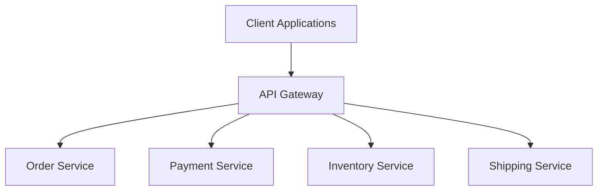

The API Gateway sits at the edge of the backend system. It hides the internal service topology from clients.

Without a gateway, a client may need to know about every backend service:

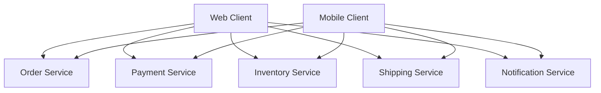

This creates tight coupling between clients and backend services.

With a gateway, clients only need to know one public API surface:

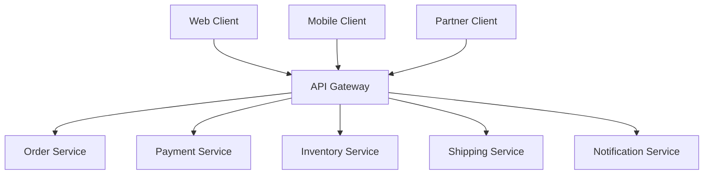

The central idea is:

> Clients should not need to understand the internal structure of the backend system.

The gateway provides a stable external boundary while backend services remain free to evolve internally.

---

#### Why this pattern exists

Microservices create many backend services. Each service may have its own:

* hostname,
* protocol,
* authentication requirements,
* version,
* deployment lifecycle,
* data model,
* scaling pattern,
* authorization rules,
* rate limits,
* error formats.

If clients directly depend on all of that, client development becomes difficult.

For example, a mobile app showing an order details screen may need:

* order data from Order Service,
* payment status from Payment Service,
* shipment tracking from Shipping Service,
* product images from Catalog Service,
* support eligibility from Customer Support Service.

Without a gateway, the mobile app might need to call all of them:

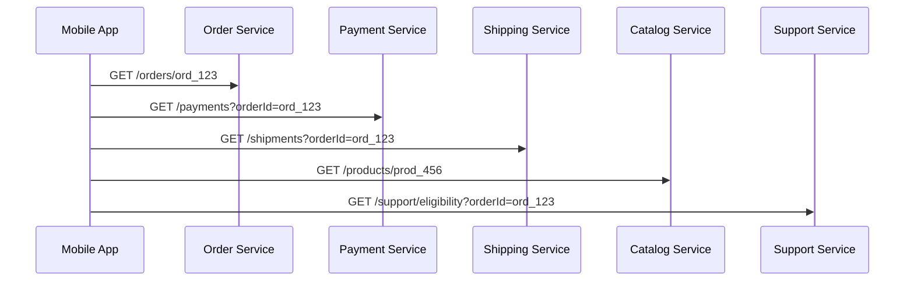

That design creates several problems:

* The client knows too much about backend internals.
* The client must handle many network calls.
* Backend service changes can break clients.
* Authentication and authorization logic may be duplicated.
* Mobile performance suffers from high latency.
* Each client may implement different error handling.
* Backend service topology becomes part of the client contract.

An API Gateway reduces this coupling.

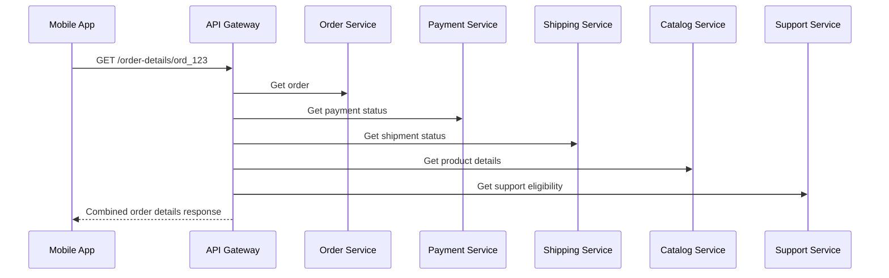

The client sees one API. The gateway manages the backend calls.

---

#### What it solves

The API Gateway solves **client-to-service coupling**.

Without a gateway, clients may depend directly on service locations and contracts:

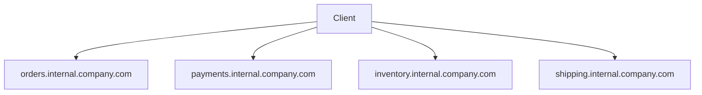

This is fragile. If the Payment Service moves, splits, changes protocol, or changes version, clients may need to change.

With a gateway:

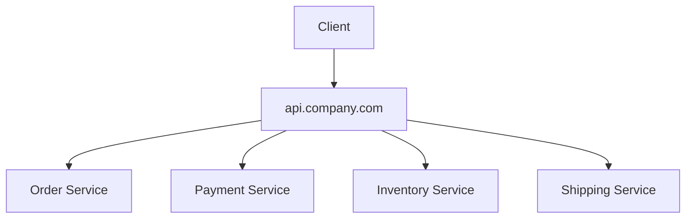

The gateway becomes the stable external API boundary.

It can also centralize edge concerns that should not be reimplemented in every service:

* TLS termination,
* authentication,
* authorization enforcement,
* rate limiting,
* request routing,
* request validation,
* API version routing,
* logging,
* tracing,
* metrics,
* request size limits,
* CORS,
* bot protection,
* IP allowlists,
* tenant routing,
* protocol translation.

---

#### Basic responsibilities

An API Gateway usually handles several categories of responsibility.

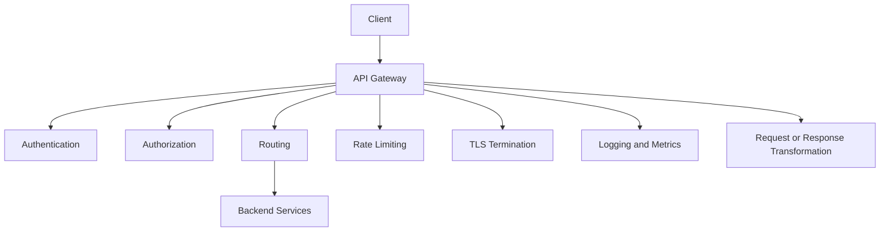

However, the gateway should be careful about what it owns.

A good gateway owns **edge concerns**.

A bad gateway starts owning **core business logic**.

| Good gateway responsibility        | Risky gateway responsibility             |
| ---------------------------------- | ---------------------------------------- |
| Authenticate requests              | Decide whether an order can be cancelled |
| Route `/orders/*` to Order Service | Calculate order totals                   |
| Enforce rate limits                | Apply pricing rules                      |
| Terminate TLS                      | Decide fraud risk                        |
| Add correlation IDs                | Manage inventory reservation logic       |
| Normalize simple errors            | Own payment state transitions            |
| Validate request size              | Implement business workflows             |

The gateway should help clients reach backend capabilities. It should not become the place where all business decisions live.

---

#### Request routing

The simplest API Gateway responsibility is routing.

The gateway receives a request and sends it to the correct backend service.

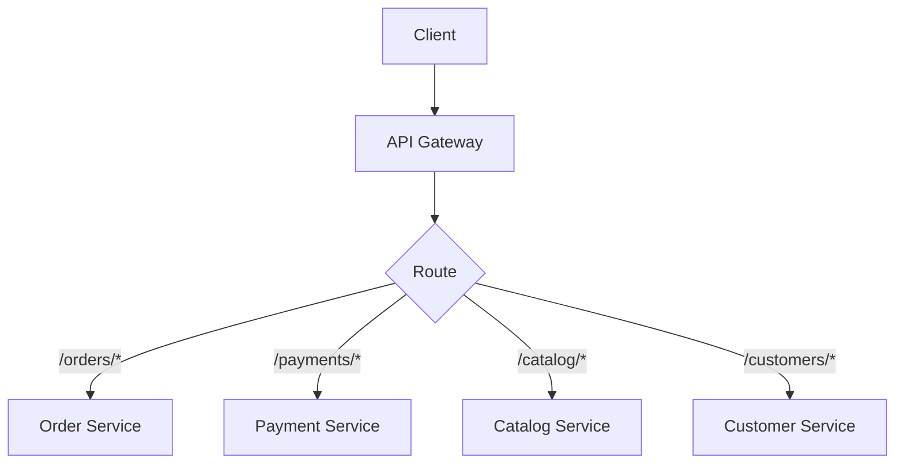

Example route table:

| Public route       | Backend service  |
| ------------------ | ---------------- |
| `/api/orders/*`    | Order Service    |
| `/api/payments/*`  | Payment Service  |
| `/api/catalog/*`   | Catalog Service  |
| `/api/customers/*` | Customer Service |

Example NGINX-style configuration:

```nginx
location /api/orders/ {
    proxy_pass http://order-service;
}

location /api/payments/ {
    proxy_pass http://payment-service;
}

location /api/catalog/ {
    proxy_pass http://catalog-service;
}

location /api/customers/ {
    proxy_pass http://customer-service;
}
```

Routing can be based on more than path.

It can also use:

* HTTP method,
* host name,
* headers,
* tenant ID,
* region,
* API version,
* client type,
* feature flag,
* percentage rollout.

For example:

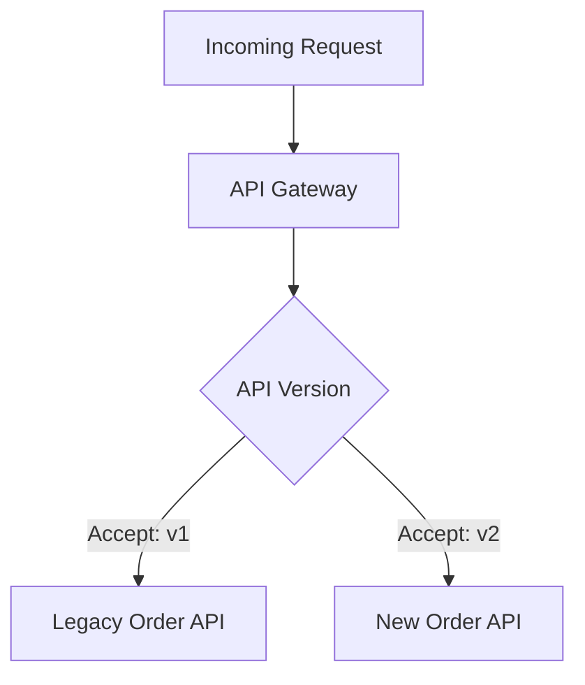

This is useful during migrations and API version transitions.

---

#### Authentication

Authentication verifies who the caller is.

The API Gateway is often a good place to authenticate requests before they reach internal services.

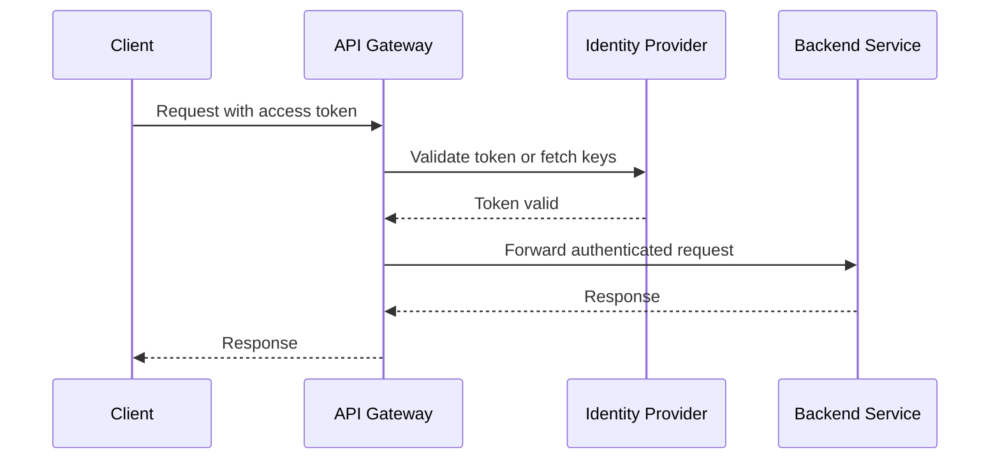

For JWT-based authentication, the gateway may verify the token signature and claims.

Example logic:

```ts
type AuthContext = {
  userId: string;
  roles: string[];
  tenantId?: string;
};

function authenticateRequest(req: Request): AuthContext {
  const authHeader = req.header("Authorization");

  if (!authHeader?.startsWith("Bearer ")) {
    throw new Error("Missing bearer token");
  }

  const token = authHeader.slice("Bearer ".length);
  const payload = verifyJwt(token);

  return {
    userId: payload.sub,
    roles: payload.roles ?? [],
    tenantId: payload.tenantId
  };
}
```

After authentication, the gateway can pass identity information downstream.

For example:

```http
X-User-Id: user_123
X-Tenant-Id: tenant_456
X-Request-Id: req_789
```

However, downstream services should not blindly trust headers from the public internet. The gateway must strip incoming spoofed identity headers and add its own trusted headers.

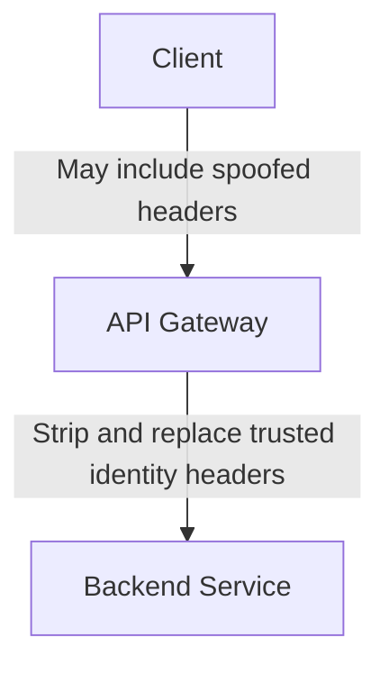

---

#### Authorization

Authorization decides what the caller is allowed to do.

The gateway can enforce coarse-grained authorization, such as:

* user must be authenticated,
* caller must have a required role,
* API key must belong to a valid partner,
* tenant must be allowed to access this API,
* client must have the required scope.

Example:

```ts
function requireScope(auth: AuthContext, requiredScope: string): void {
  if (!auth.scopes.includes(requiredScope)) {
    throw new Error("Forbidden");
  }
}
```

Route-level authorization might look like:

| Route                        | Required scope    |
| ---------------------------- | ----------------- |
| `GET /api/orders`            | `orders:read`     |
| `POST /api/orders`           | `orders:write`    |
| `POST /api/payments/refunds` | `payments:refund` |
| `GET /api/admin/users`       | `admin:read`      |

The gateway can reject unauthorized requests before they hit backend services.

But fine-grained business authorization should usually remain in the domain service.

For example:

| Decision                                          | Best owner      |
| ------------------------------------------------- | --------------- |
| Is the user authenticated?                        | Gateway         |
| Does the token have `orders:write` scope?         | Gateway         |
| Can this user cancel this specific order?         | Order Service   |
| Can this refund be approved under current policy? | Payment Service |
| Can this customer access this invoice?            | Billing Service |

The gateway may know who the user is. The backend service usually knows the business rules.

---

#### Rate limiting

An API Gateway is a natural place to enforce rate limits.

Rate limiting protects backend services from overload and protects public APIs from abuse.

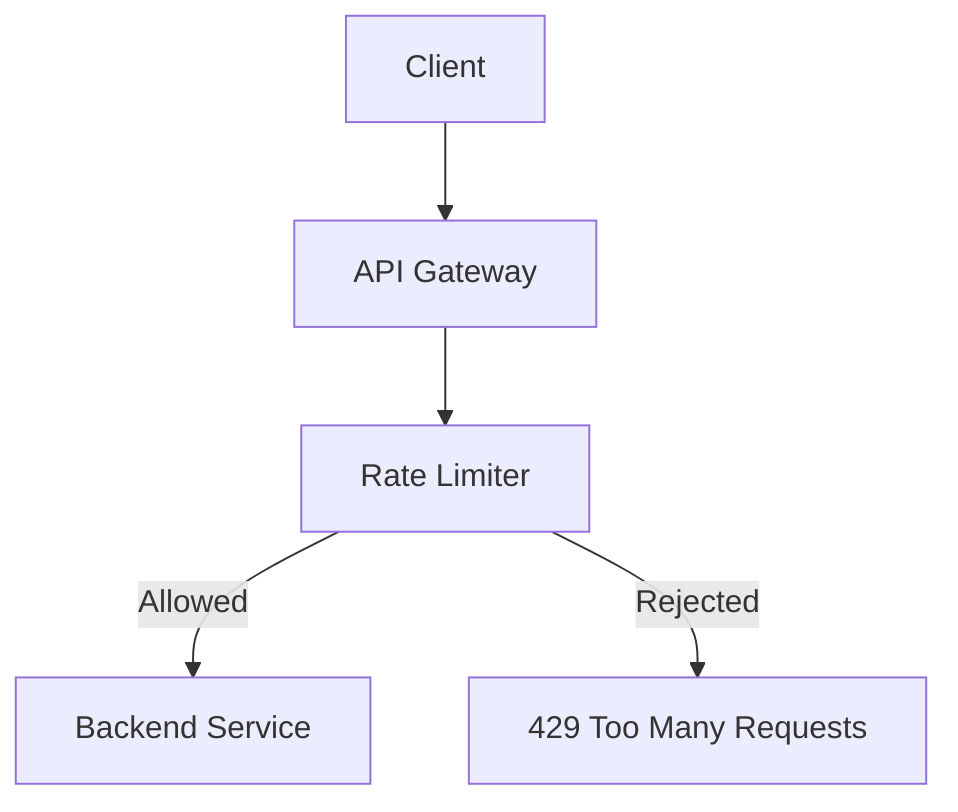

Common rate limit dimensions include:

* per IP address,
* per API key,
* per user,
* per tenant,
* per route,
* per client application,
* per partner,
* global system limit.

Example response:

```http
HTTP/1.1 429 Too Many Requests
Retry-After: 60
X-RateLimit-Limit: 1000
X-RateLimit-Remaining: 0
X-RateLimit-Reset: 1714412400
```

Example token bucket logic:

```ts
type RateLimitResult = {
  allowed: boolean;
  remaining: number;
  retryAfterSeconds?: number;
};

async function checkRateLimit(
  key: string,
  limit: number,
  windowSeconds: number
): Promise<RateLimitResult> {
  const current = await redis.incr(key);

  if (current === 1) {
    await redis.expire(key, windowSeconds);
  }

  if (current > limit) {
    return {
      allowed: false,
      remaining: 0,
      retryAfterSeconds: await redis.ttl(key)
    };
  }

  return {
    allowed: true,
    remaining: limit - current
  };
}
```

Rate limits should be designed carefully. Too strict, and legitimate clients fail. Too loose, and backend services may be overwhelmed.

---

#### TLS termination

The gateway often terminates TLS.

That means clients connect securely to the gateway over HTTPS, and the gateway handles certificates.

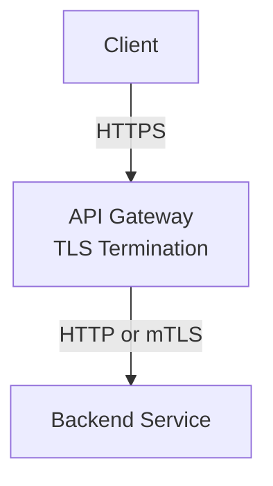

In production systems, backend communication should still be protected. Common options include:

* private network traffic,
* mutual TLS between services,
* service mesh encryption,
* encrypted load balancer connections.

The gateway is the public edge, but internal traffic still needs security.

---

#### Request and response transformation

A gateway may perform light request or response transformation.

Examples:

* add request IDs,
* add identity headers,
* remove sensitive headers,
* normalize error formats,
* rewrite paths,
* convert public routes to internal routes,
* compress responses,
* handle CORS headers.

Example path rewrite:

```text
Public route:
GET /api/v1/orders/ord_123

Internal route:
GET /orders/ord_123
```

Example:

```ts
function rewriteOrderPath(publicPath: string): string {
  return publicPath.replace("/api/v1/orders", "/orders");
}
```

Response normalization may be useful when exposing a consistent public API:

```json
{
  "error": {
    "code": "ORDER_NOT_FOUND",
    "message": "The requested order does not exist."
  }
}
```

But transformation should stay limited. If the gateway starts deeply reshaping domain objects or implementing business rules, it can become a hidden monolith.

---

#### Gateway aggregation

Sometimes the gateway combines data from multiple services into one response.

This is called **gateway aggregation**.

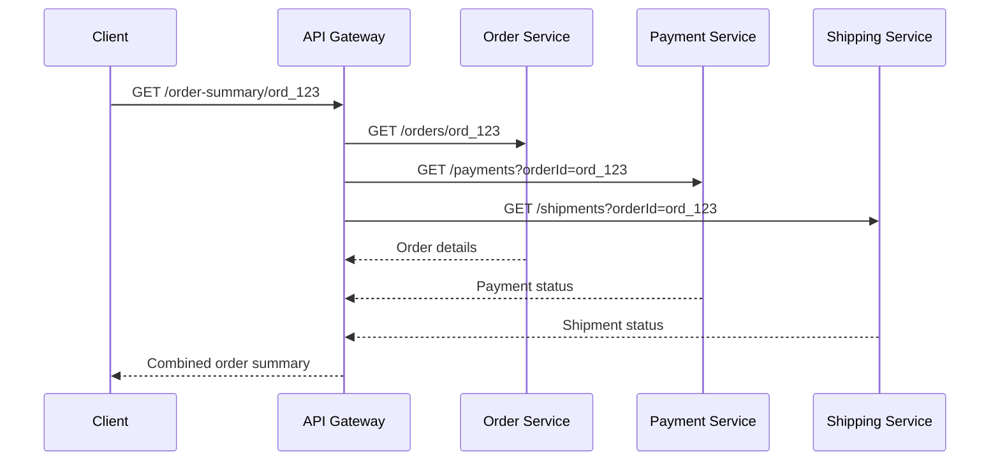

Example response:

```json
{
  "orderId": "ord_123",
  "status": "CONFIRMED",
  "payment": {
    "status": "AUTHORIZED"
  },
  "shipment": {
    "status": "PENDING"
  }
}
```

Gateway aggregation can improve client performance, especially for mobile apps, by reducing round trips.

However, aggregation should be used carefully.

Good uses:

* simple composition for client convenience,
* reducing mobile latency,
* combining read-only data,
* hiding backend topology.

Risky uses:

* implementing checkout workflow in the gateway,
* enforcing complex business rules,
* performing multi-service transactions,
* owning domain state.

If aggregation becomes complex, consider a dedicated **Backend for Frontend**, **query service**, or **composition service** instead.

---

#### Protocol translation

An API Gateway can translate between external and internal protocols.

For example:

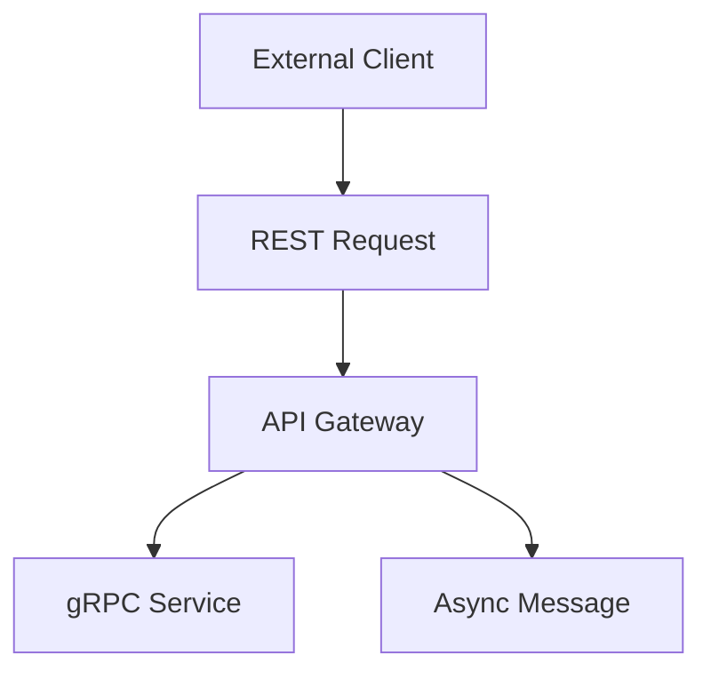

A public client may call HTTP/JSON:

```http
POST /api/payments/authorize
Content-Type: application/json
```

The gateway may call an internal gRPC service:

```proto
service PaymentService {
  rpc AuthorizePayment(AuthorizePaymentRequest)
      returns (AuthorizePaymentResponse);
}
```

Protocol translation is useful when you want external APIs to be simple and stable while internal services use protocols optimized for backend communication.

But protocol translation should not become deep domain translation. If business model translation is needed, that may belong in an Anti-Corruption Layer or a dedicated service.

---

#### API versioning

Gateways are often used to route API versions.

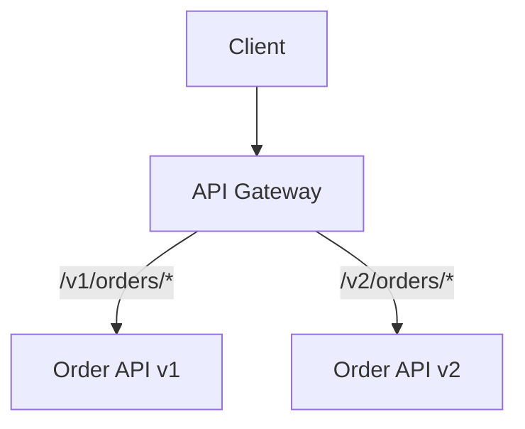

Versioning strategies include:

| Strategy            | Example                                          |
| ------------------- | ------------------------------------------------ |
| Path versioning     | `/v1/orders`                                     |
| Header versioning   | `Accept: application/vnd.company.orders.v2+json` |
| Query parameter     | `/orders?version=2`                              |
| Hostname versioning | `v2.api.company.com`                             |

The gateway can route older clients to v1 and newer clients to v2.

This is useful for gradual migration, but it does not eliminate the need for API governance. Old versions must eventually be deprecated or they will accumulate forever.

---

#### Gateway and service discovery

In dynamic environments, backend service locations change.

A gateway can integrate with service discovery.

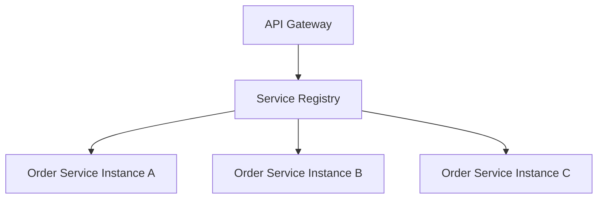

Instead of hardcoding a single backend address, the gateway discovers healthy service instances.

In Kubernetes, the gateway may route to Kubernetes Services:

```yaml
apiVersion: v1
kind: Service
metadata:
  name: orders-service
spec:
  selector:
    app: orders
  ports:
    - port: 80
      targetPort: 3000
```

The gateway routes to `orders-service`, and Kubernetes handles endpoint discovery.

---

#### Gateway and observability

Because the gateway sees all incoming traffic, it is a valuable observability point.

It should capture:

* request ID,
* client ID,
* user or tenant ID when appropriate,
* route,
* backend target,
* status code,
* latency,
* request size,
* response size,
* rate-limit decisions,
* authentication failures,
* authorization failures,
* upstream errors.

Example structured log:

```json
{
  "requestId": "req_123",
  "clientId": "mobile-ios",
  "tenantId": "tenant_456",
  "method": "GET",
  "path": "/api/orders/ord_789",
  "backendService": "order-service",
  "statusCode": 200,
  "latencyMs": 47
}
```

The gateway should also propagate tracing headers downstream.

Example:

```http
X-Request-Id: req_123
traceparent: 00-4bf92f3577b34da6a3ce929d0e0e4736-00f067aa0ba902b7-00
```

This lets teams trace a request from client through gateway to backend services.

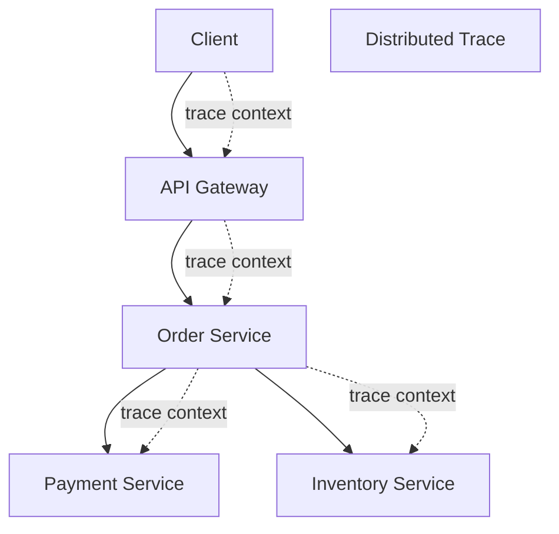

---

#### Gateway as a security boundary

The API Gateway is often part of the security boundary.

It can enforce:

* TLS,
* authentication,
* authorization scopes,
* rate limits,
* request size limits,
* IP allowlists,
* bot protection,
* API key validation,
* CORS,
* threat detection,
* input schema validation,
* header sanitization.

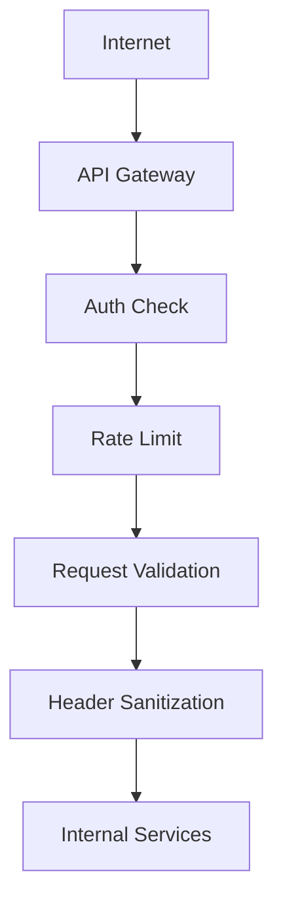

However, backend services should not assume the gateway is the only security layer.

Use defense in depth:

* backend services should verify trusted identity context,
* internal traffic should be restricted,
* service-to-service calls should use authentication when appropriate,
* sensitive operations should enforce authorization in the domain service,
* logs should avoid leaking sensitive data.

The gateway protects the edge. It should not be the only place security exists.

---

#### Public API Gateway vs internal gateway

Some organizations use different gateways for different audiences.

```mermaid
flowchart TD
    PublicClients[Public Clients]
    InternalTools[Internal Tools]

    PublicGateway[Public API Gateway]
    InternalGateway[Internal API Gateway]

    Services[Backend Services]

    PublicClients --> PublicGateway
    InternalTools --> InternalGateway

    PublicGateway --> Services
    InternalGateway --> Services
```

A public gateway may prioritize:

* API keys,
* OAuth scopes,
* quotas,
* developer portal integration,
* public documentation,
* strict backward compatibility.

An internal gateway may prioritize:

* service discovery,
* internal identity,
* team-level access controls,
* faster iteration,
* observability,
* lower latency.

Separating public and internal gateways can reduce risk because public APIs usually require stronger governance and compatibility guarantees.

---

#### Gateway vs Backend for Frontend

An API Gateway is a general entry point.

A **Backend for Frontend**, or **BFF**, is a backend tailored to a specific client experience, such as web, iOS, Android, or admin console.

```mermaid
flowchart TD
    Web[Web App]
    Mobile[Mobile App]
    Admin[Admin Console]

    WebBFF[Web BFF]
    MobileBFF[Mobile BFF]
    AdminBFF[Admin BFF]

    Gateway[Shared Gateway]

    Services[Backend Services]

    Web --> WebBFF
    Mobile --> MobileBFF
    Admin --> AdminBFF

    WebBFF --> Gateway
    MobileBFF --> Gateway
    AdminBFF --> Gateway

    Gateway --> Services
```

Use an API Gateway for common edge concerns.

Use a BFF when each client needs different API shapes, aggregation, or presentation-specific behavior.

For example:

| Need                               | Better fit  |
| ---------------------------------- | ----------- |
| TLS termination                    | API Gateway |
| API key validation                 | API Gateway |
| Global rate limiting               | API Gateway |
| iOS-specific order screen response | Mobile BFF  |
| Admin dashboard aggregation        | Admin BFF   |
| Web-specific view model            | Web BFF     |

A common architecture combines both:

```mermaid
flowchart TD
    Client[Client]
    Gateway[API Gateway]
    BFF[Backend for Frontend]
    Services[Domain Services]

    Client --> Gateway
    Gateway --> BFF
    BFF --> Services
```

The gateway handles edge concerns. The BFF handles client-specific composition.

---

#### Gateway vs service mesh

An API Gateway and a service mesh solve different problems.

```mermaid
flowchart TD
    ExternalClient[External Client]
    Gateway[API Gateway]

    ServiceA[Service A]
    ServiceB[Service B]
    ServiceC[Service C]

    Mesh[Service Mesh]

    ExternalClient --> Gateway
    Gateway --> ServiceA

    ServiceA --> Mesh
    Mesh --> ServiceB
    Mesh --> ServiceC
```

The gateway usually handles **north-south traffic**, meaning traffic entering the system from clients.

The service mesh usually handles **east-west traffic**, meaning service-to-service communication inside the system.

| Concern                               | API Gateway | Service Mesh |
| ------------------------------------- | ----------- | ------------ |
| External client entry point           | Yes         | No           |
| Public API routing                    | Yes         | Usually no   |
| Service-to-service mTLS               | Sometimes   | Yes          |
| Internal traffic policies             | Limited     | Yes          |
| Public rate limiting                  | Yes         | Usually no   |
| Request authentication at edge        | Yes         | Sometimes    |
| Internal retries and circuit breaking | Sometimes   | Yes          |
| Developer API management              | Yes         | No           |

They are complementary, not replacements for each other.

---

#### Example implementation: simple Node gateway

Here is a simplified API Gateway in Node.js using Express and `http-proxy-middleware`.

```ts
import express from "express";
import { createProxyMiddleware } from "http-proxy-middleware";

const app = express();

function requireAuth(req: express.Request, res: express.Response, next: express.NextFunction) {
  const authorization = req.header("Authorization");

  if (!authorization?.startsWith("Bearer ")) {
    res.status(401).json({
      error: "UNAUTHORIZED",
      message: "Missing or invalid access token"
    });
    return;
  }

  // In a real gateway, verify the JWT or call an identity provider.
  next();
}

app.use((req, _res, next) => {
  req.headers["x-request-id"] =
    req.header("X-Request-Id") ?? crypto.randomUUID();
  next();
});

app.use("/api/orders", requireAuth, createProxyMiddleware({
  target: "http://orders-service:3000",
  changeOrigin: true,
  pathRewrite: {
    "^/api/orders": "/orders"
  }
}));

app.use("/api/payments", requireAuth, createProxyMiddleware({
  target: "http://payments-service:3000",
  changeOrigin: true,
  pathRewrite: {
    "^/api/payments": "/payments"
  }
}));

app.use("/api/catalog", createProxyMiddleware({
  target: "http://catalog-service:3000",
  changeOrigin: true,
  pathRewrite: {
    "^/api/catalog": "/catalog"
  }
}));

app.listen(8080, () => {
  console.log("API Gateway listening on port 8080");
});
```

This example shows the basic idea:

* receive public requests,
* apply edge concerns,
* route to backend services,
* rewrite paths.

A production gateway would need more:

* real JWT validation,
* rate limiting,
* structured logging,
* tracing,
* request timeouts,
* circuit breakers,
* retries where safe,
* service discovery,
* secure header handling,
* configuration management,
* metrics,
* deployment automation.

---

#### Example: gateway aggregation endpoint

A gateway may expose a convenience endpoint that aggregates read-only data.

```ts
app.get("/api/order-summary/:orderId", requireAuth, async (req, res) => {
  const { orderId } = req.params;

  const [order, payment, shipment] = await Promise.all([
    ordersClient.getOrder(orderId),
    paymentsClient.getPaymentByOrderId(orderId),
    shippingClient.getShipmentByOrderId(orderId)
  ]);

  res.json({
    orderId: order.id,
    orderStatus: order.status,
    totalAmount: order.totalAmount,
    paymentStatus: payment.status,
    shipmentStatus: shipment.status
  });
});
```

This can be useful, but watch the boundary carefully.

This endpoint is probably acceptable because it composes read data.

This would be risky inside the gateway:

```ts
app.post("/api/checkout", async (req, res) => {
  const order = await ordersClient.createOrder(req.body);
  const payment = await paymentsClient.authorize(order);
  const reservation = await inventoryClient.reserve(order);
  await ordersClient.confirm(order.id);

  res.json({ order, payment, reservation });
});
```

That is no longer just routing or simple composition. It is a business workflow. It likely belongs in a Checkout Service, Saga orchestrator, or domain workflow service.

---

#### Deployment models

An API Gateway can be deployed in different ways.

##### Managed gateway

Examples include cloud-managed API gateways.

```mermaid
flowchart TD
    Client[Client]
    ManagedGateway[Managed API Gateway]
    Services[Backend Services]

    Client --> ManagedGateway
    ManagedGateway --> Services
```

Benefits:

* less infrastructure to manage,
* built-in auth integrations,
* rate limiting,
* monitoring,
* scaling,
* developer portal support.

Trade-offs:

* cloud provider dependency,
* configuration complexity,
* pricing,
* limits on customization.

##### Self-hosted gateway

Examples include NGINX, Envoy, Kong, Traefik, or custom gateway services.

```mermaid
flowchart TD
    Client[Client]
    SelfHosted[Self-Hosted Gateway]
    Services[Backend Services]

    Client --> SelfHosted
    SelfHosted --> Services
```

Benefits:

* more control,
* can run anywhere,
* customizable plugins,
* good for hybrid environments.

Trade-offs:

* team owns operations,
* scaling and patching are your responsibility,
* plugin quality varies.

##### Application-level gateway

A team may build a custom gateway in application code.

```mermaid
flowchart TD
    Client[Client]
    CustomGateway[Custom Gateway App]
    Services[Backend Services]

    Client --> CustomGateway
    CustomGateway --> Services
```

Benefits:

* maximum flexibility,
* easy custom aggregation,
* application-specific behavior.

Trade-offs:

* high risk of becoming a monolith,
* must build operational features yourself,
* may duplicate features available in gateway products.

---

#### When to use it

Use an API Gateway when:

* clients need access to multiple backend services,
* you want one stable public entry point,
* backend services should not be exposed directly,
* clients should not know internal service locations,
* you need centralized authentication,
* you need API-level rate limiting,
* you need request routing by path, version, tenant, or region,
* you need TLS termination at the edge,
* you need public API governance,
* you are exposing APIs to mobile apps, web apps, partners, or external developers.

It is especially useful in microservice systems where client applications would otherwise depend directly on many services.

---

#### When not to use it

An API Gateway may be unnecessary or overkill when:

* the system has only one backend service,
* there are no external clients,
* clients already communicate through a single backend,
* the gateway would only forward traffic without adding value,
* ultra-low latency is more important than centralized edge control,
* the team cannot operate or configure the gateway safely.

Also avoid using a gateway as a substitute for proper service design. A gateway can hide backend complexity from clients, but it cannot fix poor service boundaries by itself.

---

#### Benefits

**1. Hides internal service topology**

Clients do not need to know where every backend service lives.

**2. Centralizes edge concerns**

Authentication, TLS, CORS, rate limiting, and routing can be handled consistently.

**3. Improves client simplicity**

Clients call one API surface instead of many backend services.

**4. Supports API versioning and migration**

The gateway can route old and new versions during transitions.

**5. Improves security**

Backend services do not need to be directly exposed to the internet.

**6. Enables controlled rollout**

Traffic can be routed by version, tenant, region, feature flag, or percentage.

**7. Improves observability at the edge**

The gateway can measure traffic, latency, errors, and client behavior.

---

#### Trade-offs

**1. Can become a bottleneck**

All traffic flows through the gateway, so it must be highly available and scalable.

**2. Can become a hidden monolith**

If business logic accumulates in the gateway, teams lose service autonomy.

**3. Adds operational complexity**

The gateway must be deployed, configured, monitored, secured, and upgraded.

**4. Adds latency**

Every request has at least one extra hop.

**5. Can obscure service ownership**

If too much behavior sits in the gateway, it becomes unclear which team owns what.

**6. Configuration can become complex**

Many routes, versions, tenants, and policies can be hard to manage.

**7. Failure affects many clients**

A gateway outage can impact the entire system.

---

#### Common mistakes

**Mistake 1: Putting business logic in the gateway**

The gateway should not decide how payments work, how inventory is reserved, or whether an order can be cancelled.

**Mistake 2: Building a custom gateway too early**

Many gateway needs can be handled by existing tools. Custom gateways can become expensive to maintain.

**Mistake 3: Exposing internal service contracts directly**

The public API should be stable and intentional, not just a mirror of internal service APIs.

**Mistake 4: Forgetting backend authorization**

The gateway can enforce coarse authorization, but services should still protect sensitive business operations.

**Mistake 5: No timeout strategy**

If backend services hang, gateway requests can pile up and cause cascading failure.

**Mistake 6: No observability**

A gateway without logs, metrics, and traces becomes a blind spot.

**Mistake 7: Making one gateway serve every possible client need**

If web, mobile, admin, and partners need very different APIs, use BFFs or separate gateway configurations.

**Mistake 8: Not stripping untrusted headers**

Clients should not be allowed to spoof identity, tenant, or internal routing headers.

---

#### Practical design checklist

When designing an API Gateway, answer:

* Who are the clients?
* Is this a public, partner, internal, or private gateway?
* What routes should the gateway expose?
* Which backend service owns each route?
* What authentication mechanism is used?
* What authorization checks belong at the gateway?
* What authorization checks remain in backend services?
* What rate limits are needed?
* How are routes versioned?
* How are clients migrated between versions?
* What headers are allowed, removed, or added?
* What request size limits are needed?
* What timeouts should apply to each route?
* Are retries safe for this route?
* How are errors normalized?
* How are request IDs and tracing headers propagated?
* How is the gateway configured and deployed?
* How is gateway configuration tested?
* What happens if a backend service is unavailable?
* What happens if the gateway itself fails?
* Who owns the gateway?

A gateway design is probably healthy if:

* it handles edge concerns consistently,
* it keeps business logic in domain services,
* it exposes a stable public API,
* it hides internal topology,
* it has clear route ownership,
* it has strong observability,
* it can scale horizontally,
* it has a safe configuration process.

A gateway design is probably unhealthy if:

* every team adds business rules to it,
* it contains complex workflows,
* it directly accesses service databases,
* it becomes the only place authorization exists,
* it has unclear ownership,
* it is hard to test changes,
* it is a single point of failure,
* it mirrors every internal service API without design.

---

#### Related patterns

| Pattern                   | Relationship                                                         |
| ------------------------- | -------------------------------------------------------------------- |
| Gateway Routing           | The gateway routes requests to backend services                      |
| Gateway Aggregation       | The gateway combines responses from multiple services                |
| Gateway Offloading        | The gateway handles edge concerns such as TLS, auth, and rate limits |
| Backends for Frontends    | Often used behind or alongside a gateway for client-specific APIs    |
| Service Discovery         | Lets the gateway find backend service instances                      |
| Circuit Breaker           | Protects the gateway from failing backend services                   |
| Retry                     | Can be applied carefully for safe idempotent requests                |
| Rate Limiting             | Common gateway responsibility                                        |
| Strangler Fig Pattern     | Gateway can route traffic between legacy and new systems             |
| Anti-Corruption Layer     | May sit behind a gateway to translate legacy models                  |
| Consumer-Driven Contracts | Helps ensure gateway-facing APIs meet client expectations            |
| Blue-Green Deployment     | Gateway can switch traffic between environments                      |
| Shadow Deployment         | Gateway can duplicate traffic to new services for validation         |

---

#### Summary

An API Gateway is a single entry point that lets clients access backend services without knowing the internal service topology.

The central idea is:

> Clients talk to one stable API boundary; the gateway routes and protects traffic to backend services.

A good API Gateway handles edge concerns such as:

* routing,
* authentication,
* coarse authorization,
* TLS termination,
* rate limiting,
* request validation,
* API versioning,
* observability,
* and controlled traffic management.

The gateway should not become the owner of business logic. Business rules belong in the services that own the domain.

Used well, an API Gateway simplifies clients, improves security, and gives teams a controlled boundary for operating microservice APIs. Used poorly, it becomes a bottleneck, a single point of failure, or a hidden monolith.


---

### 8. Gateway Routing

#### What it is

**Gateway Routing** is the API Gateway pattern where incoming requests are directed to backend services based on request attributes.

The gateway receives the request, evaluates routing rules, and forwards the request to the correct backend service.

Common routing attributes include:

* request path,
* HTTP method,
* host name,
* headers,
* query parameters,
* API version,
* tenant ID,
* region,
* user segment,
* feature flag,
* percentage rollout,
* service health,
* deployment environment.

At its simplest, gateway routing looks like this:

```mermaid
flowchart TD
    Client[Client]
    Gateway[API Gateway]

    Orders[Order Service]
    Payments[Payment Service]
    Catalog[Catalog Service]
    Customers[Customer Service]

    Client --> Gateway

    Gateway -->|/orders/*| Orders
    Gateway -->|/payments/*| Payments
    Gateway -->|/catalog/*| Catalog
    Gateway -->|/customers/*| Customers
```

The client sees one stable API surface, such as:

```text
https://api.example.com
```

Internally, the gateway may route to many independently deployed services.

The central idea is:

> The client should know the public API contract, not the internal service topology.

---

#### Why this pattern exists

In a microservice architecture, backend services are split by capability, subdomain, workflow, or ownership.

For example:

```mermaid
flowchart TD
    Backend[Backend System]

    Backend --> Orders[Order Service]
    Backend --> Payments[Payment Service]
    Backend --> Inventory[Inventory Service]
    Backend --> Catalog[Catalog Service]
    Backend --> Shipping[Shipping Service]
    Backend --> Support[Support Service]
```

Without gateway routing, clients may need to know every service address:

```mermaid
flowchart TD
    Client[Client]

    Client --> OrdersURL[orders.internal.example.com]
    Client --> PaymentsURL[payments.internal.example.com]
    Client --> InventoryURL[inventory.internal.example.com]
    Client --> CatalogURL[catalog.internal.example.com]
    Client --> ShippingURL[shipping.internal.example.com]
```

That creates direct coupling between clients and backend topology.

If the Order Service is renamed, moved, split, merged, or versioned, every client that calls it directly may need to change.

Gateway routing avoids this by creating a stable external entry point:

```mermaid
flowchart TD
    Client[Client]
    PublicAPI[api.example.com]
    Gateway[Gateway Routing Layer]

    Orders[Order Service]
    Payments[Payment Service]
    Inventory[Inventory Service]
    Catalog[Catalog Service]
    Shipping[Shipping Service]

    Client --> PublicAPI
    PublicAPI --> Gateway

    Gateway --> Orders
    Gateway --> Payments
    Gateway --> Inventory
    Gateway --> Catalog
    Gateway --> Shipping
```

The gateway becomes the controlled boundary between the public API and internal services.

---

#### What it solves

Gateway Routing solves the problem of exposing many internal services through one stable external interface.

It helps with:

* hiding internal service names,
* hiding internal network locations,
* routing old and new API versions,
* routing tenants to different backends,
* routing users to regional deployments,
* routing traffic during migrations,
* routing traffic during canary or blue-green releases,
* moving capabilities between services without changing clients,
* centralizing routing policy.

For example, the client may call:

```http
GET /api/orders/ord_123
```

The gateway may route that to:

```text
http://orders-service.internal/orders/ord_123
```

Later, the backend may change to:

```text
http://orders-v2-service.internal/orders/ord_123
```

The client does not need to know. Only the gateway route changes.

---

#### Basic path-based routing

The most common form is **path-based routing**.

```mermaid
flowchart TD
    Request[Incoming Request]
    Gateway[API Gateway]

    Route{Path Match}

    Orders[Order Service]
    Payments[Payment Service]
    Catalog[Catalog Service]
    Legacy[Legacy System]

    Request --> Gateway
    Gateway --> Route

    Route -->|/api/orders/*| Orders
    Route -->|/api/payments/*| Payments
    Route -->|/api/catalog/*| Catalog
    Route -->|default| Legacy
```

Example route table:

| Public path        | Backend          |
| ------------------ | ---------------- |
| `/api/orders/*`    | Order Service    |
| `/api/payments/*`  | Payment Service  |
| `/api/catalog/*`   | Catalog Service  |
| `/api/customers/*` | Customer Service |
| `/api/reports/*`   | Legacy System    |

Example NGINX-style configuration:

```nginx
location /api/orders/ {
    proxy_pass http://orders-service;
}

location /api/payments/ {
    proxy_pass http://payments-service;
}

location /api/catalog/ {
    proxy_pass http://catalog-service;
}

location /api/customers/ {
    proxy_pass http://customers-service;
}

location / {
    proxy_pass http://legacy-system;
}
```

This is simple, predictable, and easy to understand.

Path-based routing works well when the public API structure maps cleanly to backend service ownership.

---

#### Method-based routing

Sometimes the same path should route differently depending on the HTTP method.

For example:

| Request                    | Backend                    |
| -------------------------- | -------------------------- |
| `GET /api/products/{id}`   | Catalog Query Service      |
| `POST /api/products`       | Catalog Management Service |
| `PATCH /api/products/{id}` | Catalog Management Service |
| `GET /api/products/search` | Search Service             |

Diagram:

```mermaid
flowchart TD
    Request[Incoming Product Request]
    Gateway[API Gateway]

    Method{HTTP Method}

    Query[Catalog Query Service]
    Management[Catalog Management Service]
    Search[Search Service]

    Request --> Gateway
    Gateway --> Method

    Method -->|GET /products/search| Search
    Method -->|GET /products/id| Query
    Method -->|POST or PATCH| Management
```

Example route logic:

```ts
type RouteTarget = {
  serviceName: string;
  baseUrl: string;
};

function routeProductRequest(req: Request): RouteTarget {
  if (req.method === "GET" && req.path === "/api/products/search") {
    return {
      serviceName: "search-service",
      baseUrl: "http://search-service"
    };
  }

  if (req.method === "GET" && req.path.startsWith("/api/products/")) {
    return {
      serviceName: "catalog-query-service",
      baseUrl: "http://catalog-query-service"
    };
  }

  if (
    ["POST", "PUT", "PATCH", "DELETE"].includes(req.method) &&
    req.path.startsWith("/api/products")
  ) {
    return {
      serviceName: "catalog-management-service",
      baseUrl: "http://catalog-management-service"
    };
  }

  throw new Error("No route found");
}
```

This can be useful when read and write workloads are separated.

It is also common in systems using CQRS, where reads and writes are handled by different services or models.

---

#### Host-based routing

With **host-based routing**, the gateway routes based on the domain name.

```mermaid
flowchart TD
    Request[Incoming Request]
    Gateway[API Gateway]

    Host{Host Header}

    PublicAPI[Public API Services]
    PartnerAPI[Partner API Services]
    AdminAPI[Admin Services]

    Request --> Gateway
    Gateway --> Host

    Host -->|api.example.com| PublicAPI
    Host -->|partners.example.com| PartnerAPI
    Host -->|admin.example.com| AdminAPI
```

Example:

| Host                   | Backend                   |
| ---------------------- | ------------------------- |
| `api.example.com`      | Public API Gateway routes |
| `partners.example.com` | Partner API services      |
| `admin.example.com`    | Admin backend services    |
| `internal.example.com` | Internal tools            |

This is useful when different audiences need different API surfaces.

For example:

* public users use `api.example.com`,
* partners use `partners.example.com`,
* employees use `admin.example.com`,
* internal services use `internal.example.com`.

Host-based routing often pairs well with separate authentication policies, rate limits, and monitoring dashboards.

---

#### Header-based routing

With **header-based routing**, the gateway routes based on request headers.

This is useful for API versions, experiments, client types, regions, or internal testing.

```mermaid
flowchart TD
    Request[Incoming Request]
    Gateway[API Gateway]

    Header{Header Value}

    V1[Service v1]
    V2[Service v2]
    Beta[Beta Service]

    Request --> Gateway
    Gateway --> Header

    Header -->|X-API-Version: 1| V1
    Header -->|X-API-Version: 2| V2
    Header -->|X-Beta: true| Beta
```

Example:

```http
GET /api/orders/ord_123
X-API-Version: 2
```

Route result:

```text
orders-service-v2
```

Example route logic:

```ts
function routeByVersion(req: Request): RouteTarget {
  const version = req.header("X-API-Version") ?? "1";

  if (version === "2") {
    return {
      serviceName: "orders-v2",
      baseUrl: "http://orders-v2-service"
    };
  }

  return {
    serviceName: "orders-v1",
    baseUrl: "http://orders-v1-service"
  };
}
```

Header-based routing is powerful, but it can become hard to debug if routing decisions are not logged clearly.

Always log the selected route and the header values that influenced routing.

---

#### API version routing

API version routing directs requests to different service versions.

```mermaid
flowchart TD
    Client[Client]
    Gateway[API Gateway]

    Version{API Version}

    OrdersV1[Order API v1]
    OrdersV2[Order API v2]

    Client --> Gateway
    Gateway --> Version

    Version -->|/v1/orders/*| OrdersV1
    Version -->|/v2/orders/*| OrdersV2
```

Common versioning strategies include:

| Versioning style    | Example                                          |
| ------------------- | ------------------------------------------------ |
| Path versioning     | `/v1/orders`                                     |
| Header versioning   | `X-API-Version: 2`                               |
| Accept header       | `Accept: application/vnd.company.orders.v2+json` |
| Hostname versioning | `v2.api.example.com`                             |

Path versioning is easy to see:

```http
GET /v1/orders/ord_123
GET /v2/orders/ord_123
```

Header versioning keeps URLs cleaner but is less visible:

```http
GET /orders/ord_123
X-API-Version: 2
```

Gateway version routing helps old and new clients coexist:

```mermaid
flowchart TD
    OldClient[Old Mobile App]
    NewClient[New Web App]
    Gateway[API Gateway]

    OrdersV1[Order Service v1]
    OrdersV2[Order Service v2]

    OldClient --> Gateway
    NewClient --> Gateway

    Gateway -->|v1 route| OrdersV1
    Gateway -->|v2 route| OrdersV2
```

This is useful during gradual API migration.

However, version routing should have lifecycle management. Old versions should have owners, monitoring, and deprecation plans.

---

#### Tenant-based routing

In multi-tenant systems, the gateway may route requests based on tenant.

```mermaid
flowchart TD
    Request[Incoming Request]
    Gateway[API Gateway]

    Tenant{Tenant}

    Shared[Shared Services]
    Enterprise[Enterprise Tenant Cluster]
    Regulated[Regulated Tenant Environment]

    Request --> Gateway
    Gateway --> Tenant

    Tenant -->|standard tenants| Shared
    Tenant -->|enterprise tenant| Enterprise
    Tenant -->|regulated tenant| Regulated
```

Tenant ID may come from:

* subdomain,
* JWT claim,
* request header,
* API key,
* path segment,
* mTLS certificate,
* session context.

Examples:

```http
GET /api/orders
X-Tenant-Id: tenant_123
```

or:

```text
https://tenant-123.api.example.com/orders
```

or JWT claim:

```json
{
  "sub": "user_123",
  "tenantId": "tenant_123",
  "scope": "orders:read"
}
```

Example route logic:

```ts
function routeByTenant(req: Request, auth: AuthContext): RouteTarget {
  const tenantId = auth.tenantId;

  if (tenantId === "enterprise_acme") {
    return {
      serviceName: "orders-acme-dedicated",
      baseUrl: "http://orders-acme-dedicated"
    };
  }

  if (auth.complianceTier === "regulated") {
    return {
      serviceName: "orders-regulated",
      baseUrl: "http://orders-regulated"
    };
  }

  return {
    serviceName: "orders-shared",
    baseUrl: "http://orders-shared"
  };
}
```

Tenant routing is useful when some customers need:

* dedicated infrastructure,
* special compliance controls,
* data residency,
* custom scaling,
* isolated deployments,
* premium reliability.

Be careful not to trust tenant headers directly from clients. Tenant identity should usually come from authenticated context, not from an arbitrary user-provided header.

---

#### Region-based routing

Region-based routing directs users to services in the correct geographic region.

```mermaid
flowchart TD
    Client[Client]
    Gateway[Global Gateway]

    Region{Region}

    US[US Services]
    EU[EU Services]
    APAC[APAC Services]

    Client --> Gateway
    Gateway --> Region

    Region -->|United States| US
    Region -->|European Union| EU
    Region -->|Asia-Pacific| APAC
```

Routing may be based on:

* user profile,
* tenant configuration,
* data residency rules,
* DNS geolocation,
* IP geolocation,
* request header from an upstream edge,
* region encoded in the API key.

Example:

| Tenant            | Required region | Backend       |
| ----------------- | --------------- | ------------- |
| `tenant_us_001`   | US              | `orders-us`   |
| `tenant_eu_001`   | EU              | `orders-eu`   |
| `tenant_apac_001` | APAC            | `orders-apac` |

Region routing is especially important for:

* latency,
* data residency,
* disaster recovery,
* regulatory compliance,
* regional failover.

Example:

```ts
function routeByRegion(tenant: Tenant): RouteTarget {
  switch (tenant.dataRegion) {
    case "US":
      return {
        serviceName: "orders-us",
        baseUrl: "https://orders.us.internal"
      };

    case "EU":
      return {
        serviceName: "orders-eu",
        baseUrl: "https://orders.eu.internal"
      };

    case "APAC":
      return {
        serviceName: "orders-apac",
        baseUrl: "https://orders.apac.internal"
      };
  }
}
```

Region routing must be designed carefully. Accidentally routing EU customer data to a non-EU service may create legal and compliance problems.

---

#### Canary routing

Gateway Routing is commonly used for canary releases.

A **canary release** sends a small percentage of traffic to a new version before rolling it out broadly.

```mermaid
flowchart TD
    Requests[Incoming Requests]
    Gateway[API Gateway]

    Decision{Traffic Split}

    Stable[Orders v1 Stable]
    Canary[Orders v2 Canary]

    Requests --> Gateway
    Gateway --> Decision

    Decision -->|95 percent| Stable
    Decision -->|5 percent| Canary
```

Example traffic split:

| Version   | Traffic |
| --------- | ------: |
| Orders v1 |     95% |
| Orders v2 |      5% |

If metrics look good, increase traffic gradually:

```mermaid
flowchart TD
    Start[Start]
    P1[1 percent]
    P5[5 percent]
    P25[25 percent]
    P50[50 percent]
    P100[100 percent]

    Start --> P1
    P1 --> P5
    P5 --> P25
    P25 --> P50
    P50 --> P100
```

Example pseudo-code:

```ts
function routeCanary(req: Request): RouteTarget {
  const rolloutPercentage = 5;
  const userId = req.header("X-User-Id") ?? "anonymous";

  const bucket = stableHash(userId) % 100;

  if (bucket < rolloutPercentage) {
    return {
      serviceName: "orders-v2",
      baseUrl: "http://orders-v2"
    };
  }

  return {
    serviceName: "orders-v1",
    baseUrl: "http://orders-v1"
  };
}
```

Using a stable hash keeps the same user on the same version during the rollout, which avoids inconsistent behavior across requests.

---

#### Blue-green routing

Gateway Routing can also support blue-green deployments.

In blue-green deployment, two environments exist:

* **Blue**: current production environment,
* **Green**: new candidate environment.

```mermaid
flowchart TD
    Client[Client]
    Gateway[API Gateway]

    Blue[Blue Environment]
    Green[Green Environment]

    Client --> Gateway

    Gateway -->|Current production traffic| Blue
    Gateway -. standby .-> Green
```

After validation, the gateway switches traffic:

```mermaid
flowchart TD
    Client[Client]
    Gateway[API Gateway]

    Blue[Blue Environment]
    Green[Green Environment]

    Client --> Gateway

    Gateway -. standby .-> Blue
    Gateway -->|Production traffic| Green
```

Benefits:

* fast rollback,
* clear environment separation,
* safer release validation,
* minimal downtime.

Rollback is just a routing change back to Blue.

```mermaid
flowchart TD
    Problem[Problem detected]
    Gateway[API Gateway]
    Green[Green Environment]
    Blue[Blue Environment]

    Problem --> Gateway
    Gateway -. stop traffic .-> Green
    Gateway -->|rollback| Blue
```

Blue-green routing is simpler when services are stateless and database migrations are backward compatible.

---

#### Migration routing

Gateway Routing is often used during legacy migration, especially with the Strangler Fig Pattern.

```mermaid
flowchart TD
    Client[Client]
    Gateway[API Gateway]

    Legacy[Legacy Monolith]
    NewOrders[New Order Service]
    NewCatalog[New Catalog Service]

    Client --> Gateway

    Gateway -->|/orders/*| NewOrders
    Gateway -->|/catalog/*| NewCatalog
    Gateway -->|unmigrated routes| Legacy
```

As each capability is migrated, the route changes.

Example migration route table:

| Route             | Before migration | After migration |
| ----------------- | ---------------- | --------------- |
| `/api/products/*` | Legacy Monolith  | Catalog Service |
| `/api/orders/*`   | Legacy Monolith  | Order Service   |
| `/api/payments/*` | Legacy Monolith  | Payment Service |
| `/api/reports/*`  | Legacy Monolith  | Legacy Monolith |

Gateway routing lets the migration happen slice by slice.

This is safer than replacing the whole system at once.

---

#### Fallback routing

Sometimes the gateway can route to a fallback service when the primary service is unavailable.

```mermaid
flowchart TD
    Request[Request]
    Gateway[API Gateway]

    Health{Primary Healthy?}

    Primary[Primary Service]
    Fallback[Fallback Service or Cached Response]

    Request --> Gateway
    Gateway --> Health

    Health -->|Yes| Primary
    Health -->|No| Fallback
```

Examples:

* route product search to a cached search index if search is degraded,
* return cached catalog data when the catalog service is unavailable,
* route to an older service version if a canary fails,
* send traffic to another region during regional outage.

Fallbacks must be used carefully. They are usually safer for read operations than write operations.

A fallback for `GET /products/{id}` may be acceptable.

A fallback for `POST /payments/authorize` is much riskier.

---

#### Route matching order

Routing rules must have a clear priority order.

For example:

```text
/api/orders/search
/api/orders/{orderId}
/api/orders/*
/api/*
```

If broad routes are evaluated before specific routes, requests may go to the wrong service.

Bad order:

```text
/api/orders/*
/api/orders/search
```

The broader route may catch `/api/orders/search` before the search route gets a chance.

Better order:

```text
/api/orders/search
/api/orders/{orderId}
/api/orders/*
```

Diagram:

```mermaid
flowchart TD
    Request[GET /api/orders/search]
    Rule1{Match /api/orders/search?}
    Rule2{Match /api/orders/id?}
    Rule3{Match /api/orders/*?}

    Search[Search Service]
    Orders[Order Service]
    NotFound[404 Not Found]

    Request --> Rule1

    Rule1 -->|Yes| Search
    Rule1 -->|No| Rule2

    Rule2 -->|Yes| Orders
    Rule2 -->|No| Rule3

    Rule3 -->|Yes| Orders
    Rule3 -->|No| NotFound
```

Route ordering should be documented and tested.

---

#### Route configuration as code

As routing grows, configuration should be versioned, reviewed, and tested.

Route rules should not be changed casually through manual console edits unless there is a strong operational reason.

Example YAML route configuration:

```yaml
routes:
  - name: orders-v1
    match:
      pathPrefix: /api/v1/orders
    target:
      service: orders-v1
      url: http://orders-v1
    policies:
      authRequired: true
      rateLimit:
        requestsPerMinute: 600

  - name: orders-v2
    match:
      pathPrefix: /api/v2/orders
    target:
      service: orders-v2
      url: http://orders-v2
    policies:
      authRequired: true
      rateLimit:
        requestsPerMinute: 600

  - name: catalog
    match:
      pathPrefix: /api/catalog
    target:
      service: catalog
      url: http://catalog-service
    policies:
      authRequired: false
      cache:
        ttlSeconds: 60
```

Configuration as code gives you:

* pull request review,
* version history,
* automated tests,
* rollback,
* ownership metadata,
* auditability,
* environment consistency.

---

#### Testing routing rules

Gateway routing should be tested like application logic.

A simple routing test might look like this:

```ts
describe("gateway routing", () => {
  it("routes order API to the order service", () => {
    const target = routeRequest({
      method: "GET",
      path: "/api/orders/ord_123",
      headers: {}
    });

    expect(target.serviceName).toBe("orders-service");
  });

  it("routes catalog search to the search service", () => {
    const target = routeRequest({
      method: "GET",
      path: "/api/catalog/search",
      headers: {}
    });

    expect(target.serviceName).toBe("search-service");
  });

  it("routes v2 requests to orders-v2", () => {
    const target = routeRequest({
      method: "GET",
      path: "/api/orders/ord_123",
      headers: {
        "X-API-Version": "2"
      }
    });

    expect(target.serviceName).toBe("orders-v2");
  });
});
```

Useful routing tests include:

| Test type         | Purpose                                         |
| ----------------- | ----------------------------------------------- |
| Path match tests  | Verify routes go to the expected backend        |
| Priority tests    | Verify specific routes win over broad routes    |
| Version tests     | Verify API versions route correctly             |
| Tenant tests      | Verify tenants route to the correct environment |
| Region tests      | Verify data residency routing                   |
| Canary tests      | Verify traffic split logic                      |
| Auth policy tests | Verify protected routes require authentication  |
| Fallback tests    | Verify degraded routes behave safely            |
| Negative tests    | Verify unknown routes return 404                |

Routing bugs can be severe because they may send traffic to the wrong service, wrong version, wrong tenant environment, or wrong region.

---

#### Observability for gateway routing

Every routed request should produce useful telemetry.

At minimum, log:

* request ID,
* route name,
* matched rule,
* target service,
* target version,
* tenant ID when appropriate,
* region when appropriate,
* status code,
* latency,
* retry count,
* fallback used or not,
* canary bucket if applicable.

Example structured log:

```json
{
  "requestId": "req_123",
  "method": "GET",
  "path": "/api/orders/ord_456",
  "matchedRoute": "orders-v2",
  "targetService": "orders-service-v2",
  "tenantId": "tenant_789",
  "region": "US",
  "statusCode": 200,
  "latencyMs": 42,
  "canary": false
}
```

This helps answer:

* Which route handled this request?
* Which backend received it?
* Did the request go to the expected version?
* Did a tenant route to the correct environment?
* Are canary users seeing more errors?
* Is one route slower than others?
* Are fallback routes being used too often?

Without this observability, routing problems are difficult to debug.

---

#### Security considerations

Gateway routing is security-sensitive.

Bad routing can expose internal services or send users to the wrong tenant’s data.

Important security rules:

* Do not trust client-provided internal routing headers.
* Strip headers such as `X-User-Id`, `X-Tenant-Id`, and `X-Internal-Role` from external requests.
* Recreate trusted identity headers only after authentication.
* Validate tenant access before tenant routing.
* Keep admin routes separate from public routes.
* Restrict direct access to backend services.
* Use allowlists for sensitive routes.
* Ensure route changes are reviewed.
* Log route decisions for auditability.

Example dangerous request:

```http
GET /api/orders
X-Tenant-Id: enterprise_customer
X-Internal-Role: admin
```

The gateway should not trust those headers from an external client.

A safer flow:

```mermaid
flowchart TD
    Client[Client Request]
    Gateway[API Gateway]

    Strip[Strip untrusted internal headers]
    Auth[Authenticate token]
    Context[Build trusted routing context]
    Route[Route request]

    Backend[Backend Service]

    Client --> Gateway
    Gateway --> Strip
    Strip --> Auth
    Auth --> Context
    Context --> Route
    Route --> Backend
```

The trusted tenant ID should come from a verified token, API key, or identity provider.

---

#### Timeout and retry policy by route

Different routes need different timeout and retry behavior.

For example:

| Route                            | Timeout | Retry?                          | Reason                      |
| -------------------------------- | ------: | ------------------------------- | --------------------------- |
| `GET /api/catalog/products/{id}` |  500 ms | Yes                             | Read-only and safe to retry |
| `GET /api/orders/{id}`           |     1 s | Yes                             | Read-only                   |
| `POST /api/orders`               |     2 s | Only with idempotency key       | Creates state               |
| `POST /api/payments/authorize`   |     3 s | Carefully, with idempotency key | External side effect        |
| `POST /api/refunds`              |     5 s | Carefully, with idempotency key | Financial side effect       |

The gateway should not apply the same retry policy to every route.

Unsafe retries can create duplicate orders, duplicate payments, or duplicate messages.

Example policy:

```yaml
routes:
  - name: catalog-read
    match:
      pathPrefix: /api/catalog
      methods: [GET]
    timeoutMs: 500
    retry:
      attempts: 2

  - name: create-order
    match:
      path: /api/orders
      methods: [POST]
    timeoutMs: 2000
    retry:
      attempts: 0
    requireHeaders:
      - Idempotency-Key
```

Retries are safer for idempotent reads than for state-changing writes.

---

#### Route ownership

As systems grow, every route should have an owner.

A route owner is responsible for:

* backend service health,
* API contract,
* route configuration,
* deprecation,
* monitoring,
* incident response,
* documentation.

Example route ownership table:

| Route                | Backend         | Owner               |
| -------------------- | --------------- | ------------------- |
| `/api/orders/*`      | Order Service   | Orders Team         |
| `/api/payments/*`    | Payment Service | Payments Team       |
| `/api/catalog/*`     | Catalog Service | Catalog Team        |
| `/api/admin/users/*` | Admin Service   | Internal Tools Team |

Without ownership, route configuration becomes a shared dumping ground.

This is one reason gateway routing rules become difficult to manage over time.

---

#### When to use it

Use Gateway Routing when:

* clients need one stable API surface,
* backend services are independently deployed,
* clients should not know internal service locations,
* routes need to be split by path, version, tenant, or region,
* you are migrating from a monolith to services,
* you need canary or blue-green traffic shifting,
* you need public and internal APIs on different hosts,
* you want routing rules to be managed centrally,
* you need to hide backend topology from external clients.

It is especially useful when multiple clients consume many backend services.

---

#### When not to use it

Gateway Routing may be unnecessary when:

* there is only one backend service,
* clients are internal and already use service discovery safely,
* the gateway would only forward traffic without adding value,
* route rules would be more complex than the service topology,
* ultra-low latency is more important than centralized routing,
* backend services are not ready to be independently exposed through contracts.

Also avoid using routing to compensate for unclear service boundaries. If every request needs complex conditional routing, the backend architecture may need review.

---

#### Benefits

**1. Unified client access**

Clients call one API surface instead of many backend services.

**2. Hidden backend topology**

Services can move, split, merge, or change infrastructure without forcing client changes.

**3. Independent deployment**

Backend services remain independently deployable while the gateway provides stable routing.

**4. Controlled migration**

Traffic can be shifted from legacy systems to new services route by route.

**5. Safer releases**

Canary and blue-green routing allow controlled rollout and rollback.

**6. Multi-tenant flexibility**

Tenants can be routed to shared, dedicated, regional, or regulated environments.

**7. API version coexistence**

Old and new API versions can run side by side while clients migrate.

---

#### Trade-offs

**1. Routing rules can become complex**

Path, header, tenant, version, region, and rollout rules can interact in surprising ways.

**2. Configuration becomes critical infrastructure**

A bad route change can cause outages or data exposure.

**3. Debugging can be harder**

When routing is dynamic, teams need strong logs and tracing to understand where a request went.

**4. Gateway can become a bottleneck**

All traffic passes through the gateway, so it must be reliable and scalable.

**5. Route ownership can become unclear**

If many teams modify gateway rules, ownership and review processes are essential.

**6. Security risk increases**

Incorrect routing can expose admin APIs, internal services, or cross-tenant data.

**7. Version sprawl can accumulate**

Gateway routing can make it easy to keep old versions alive forever.

---

#### Common mistakes

**Mistake 1: Using broad routes before specific routes**

A route like `/api/orders/*` may accidentally capture `/api/orders/search` unless rule priority is clear.

**Mistake 2: Trusting client-provided routing headers**

External clients should not be allowed to choose tenant, region, or internal role by sending arbitrary headers.

**Mistake 3: No route ownership**

Every route should have a responsible team.

**Mistake 4: No route tests**

Routing rules should be tested before deployment.

**Mistake 5: Manual route changes without review**

Gateway configuration should usually be versioned and reviewed.

**Mistake 6: Routing all versions forever**

Old routes need deprecation plans.

**Mistake 7: Applying the same timeout and retry policy everywhere**

Read routes and write routes need different behavior.

**Mistake 8: Hiding business logic in routing rules**

Routing should select a backend. It should not become the place where business decisions are made.

---

#### Practical design checklist

When designing gateway routing, answer:

* What public routes does the gateway expose?
* Which backend service owns each route?
* What is the matching rule for each route?
* Are specific routes evaluated before broad routes?
* Are routes based on path, host, header, tenant, region, or version?
* Which headers are trusted?
* Which headers must be stripped?
* How is tenant identity verified?
* How is region selected?
* Are route changes versioned?
* Are route changes reviewed?
* Are routing rules tested automatically?
* What timeout applies to each route?
* Are retries safe for each route?
* What happens if the target service is unavailable?
* Is fallback allowed?
* How are route decisions logged?
* Who owns each route?
* What routes are deprecated?
* How are old routes removed?

A gateway routing design is probably healthy if:

* route rules are clear,
* route ownership is documented,
* route configuration is version-controlled,
* route decisions are observable,
* security-sensitive routing uses trusted identity,
* tests cover important routes,
* old versions have deprecation plans,
* routing stays separate from business logic.

A gateway routing design is probably unhealthy if:

* nobody knows why a route exists,
* rules are edited manually without review,
* broad routes accidentally capture specific routes,
* clients can spoof routing headers,
* old API versions never go away,
* route behavior cannot be reproduced in tests,
* gateway configuration is the only place business behavior is defined.

---

#### Related patterns

| Pattern                | Relationship                                                                        |
| ---------------------- | ----------------------------------------------------------------------------------- |
| API Gateway            | Gateway Routing is one of the core gateway responsibilities                         |
| Gateway Aggregation    | Routing sends requests to services; aggregation combines multiple service responses |
| Gateway Offloading     | Routing is often combined with auth, TLS, rate limiting, and observability          |
| Backends for Frontends | Routing may send different clients to different BFFs                                |
| Strangler Fig Pattern  | Routing gradually shifts traffic from legacy systems to new services                |
| Blue-Green Deployment  | Routing switches traffic between two environments                                   |
| Canary Release         | Routing sends a small percentage of traffic to a new version                        |
| Service Discovery      | Gateway uses discovery to locate backend service instances                          |
| API Versioning         | Gateway can route old and new API versions                                          |
| Circuit Breaker        | Gateway can stop routing to unhealthy backends                                      |
| Rate Limiting          | Route-specific limits protect backend services                                      |
| Anti-Corruption Layer  | Gateway may route to an ACL when integrating with legacy systems                    |

---

#### Summary

Gateway Routing directs requests from a gateway to backend services based on path, host, headers, version, tenant, region, rollout rules, or other request attributes.

The central idea is:

> Clients use one stable API surface while the gateway decides which backend service should handle each request.

Gateway Routing is useful for:

* exposing many services through one API,
* hiding internal topology,
* supporting API versions,
* routing tenants and regions,
* enabling canary and blue-green releases,
* migrating from legacy systems,
* and keeping backend services independently deployable.

The main risk is that routing rules become complex, unsafe, or poorly owned. To use this pattern well, route configuration should be explicit, tested, observable, secure, and version-controlled.


---

### 9. Gateway Aggregation / Aggregator Pattern

#### What it is

**Gateway Aggregation**, also called the **Aggregator Pattern**, combines data from multiple backend services into a single response for a client.

Instead of forcing the client to call several services and assemble the result itself, an aggregator does that work on the server side.

Without aggregation, a client may need to make many calls:

```mermaid
sequenceDiagram
    participant Client
    participant Orders as Order Service
    participant Payments as Payment Service
    participant Shipping as Shipping Service
    participant Catalog as Catalog Service
    participant Support as Support Service

    Client->>Orders: GET /orders/ord_123
    Client->>Payments: GET /payments?orderId=ord_123
    Client->>Shipping: GET /shipments?orderId=ord_123
    Client->>Catalog: GET /products/prod_456
    Client->>Support: GET /support/eligibility?orderId=ord_123
```

With aggregation, the client makes one request:

```mermaid
sequenceDiagram
    participant Client
    participant Aggregator as Gateway Aggregator
    participant Orders as Order Service
    participant Payments as Payment Service
    participant Shipping as Shipping Service
    participant Catalog as Catalog Service
    participant Support as Support Service

    Client->>Aggregator: GET /order-summary/ord_123

    Aggregator->>Orders: Get order
    Aggregator->>Payments: Get payment status
    Aggregator->>Shipping: Get shipment status
    Aggregator->>Catalog: Get product details
    Aggregator->>Support: Get support eligibility

    Orders-->>Aggregator: Order
    Payments-->>Aggregator: Payment status
    Shipping-->>Aggregator: Shipment status
    Catalog-->>Aggregator: Product details
    Support-->>Aggregator: Support eligibility

    Aggregator-->>Client: Combined order summary
```

The central idea is:

> The client asks for the view it needs; the aggregator collects and shapes the backend data required for that view.

This pattern is especially useful for read-heavy screens that need data from several services.

---

#### Why this pattern exists

Microservices often split data by ownership. That is good for service autonomy, but it creates a challenge for clients.

For example, an order detail screen may need data from several services:

| Data needed by screen       | Owning service   |
| --------------------------- | ---------------- |
| Order status and line items | Order Service    |
| Payment status              | Payment Service  |
| Shipment tracking           | Shipping Service |
| Product names and images    | Catalog Service  |
| Return eligibility          | Returns Service  |
| Support options             | Support Service  |

A frontend could call each service directly, but that creates problems:

* many network round trips,
* slower mobile performance,
* duplicated composition logic across clients,
* clients become coupled to internal service boundaries,
* backend service changes can break clients,
* error handling becomes inconsistent,
* authentication and authorization become harder to coordinate,
* clients may need to understand too much domain topology.

Gateway Aggregation moves that composition logic to a backend layer.

```mermaid
flowchart TD
    Client[Client]

    Aggregator[Aggregator]

    Orders[Order Service]
    Payments[Payment Service]
    Shipping[Shipping Service]
    Catalog[Catalog Service]
    Returns[Returns Service]

    Client --> Aggregator

    Aggregator --> Orders
    Aggregator --> Payments
    Aggregator --> Shipping
    Aggregator --> Catalog
    Aggregator --> Returns
```

The client gets a purpose-built response, while backend services continue to own their own data.

---

#### What it solves

Gateway Aggregation solves **client-side composition complexity**.

Without an aggregator, each client may implement the same composition logic:

```mermaid
flowchart TD
    Web[Web App]
    IOS[iOS App]
    Android[Android App]

    Orders[Order Service]
    Payments[Payment Service]
    Shipping[Shipping Service]
    Catalog[Catalog Service]

    Web --> Orders
    Web --> Payments
    Web --> Shipping
    Web --> Catalog

    IOS --> Orders
    IOS --> Payments
    IOS --> Shipping
    IOS --> Catalog

    Android --> Orders
    Android --> Payments
    Android --> Shipping
    Android --> Catalog
```

This duplicates logic across clients.

For example, each client might need to know:

* which services to call,
* in what order to call them,
* which failures are acceptable,
* how to merge the responses,
* how to handle missing data,
* how to transform service-specific fields into screen-specific fields.

With aggregation, that logic moves to one backend composition point:

```mermaid
flowchart TD
    Web[Web App]
    IOS[iOS App]
    Android[Android App]

    Aggregator[Order Summary Aggregator]

    Orders[Order Service]
    Payments[Payment Service]
    Shipping[Shipping Service]
    Catalog[Catalog Service]

    Web --> Aggregator
    IOS --> Aggregator
    Android --> Aggregator

    Aggregator --> Orders
    Aggregator --> Payments
    Aggregator --> Shipping
    Aggregator --> Catalog
```

The clients can remain simpler.

---

#### Basic aggregation flow

A typical aggregation flow has four steps:

```mermaid
flowchart TD
    Step1[1. Receive client request]
    Step2[2. Call backend services]
    Step3[3. Combine and transform data]
    Step4[4. Return client-shaped response]

    Step1 --> Step2
    Step2 --> Step3
    Step3 --> Step4
```

For example:

```http
GET /api/order-summary/ord_123
```

The aggregator may call:

```http
GET /orders/ord_123
GET /payments/by-order/ord_123
GET /shipments/by-order/ord_123
GET /products/prod_456
```

Then it returns:

```json
{
  "orderId": "ord_123",
  "status": "CONFIRMED",
  "totalAmount": 129.99,
  "currency": "USD",
  "payment": {
    "status": "AUTHORIZED"
  },
  "shipment": {
    "status": "PENDING",
    "estimatedDeliveryDate": "2026-05-02"
  },
  "items": [
    {
      "productId": "prod_456",
      "name": "Trail Running Shoe",
      "imageUrl": "https://cdn.example.com/products/prod_456.jpg",
      "quantity": 1,
      "unitPrice": 129.99
    }
  ]
}
```

The response is designed around what the client needs, not around how backend services are split.

---

#### Aggregation location

Aggregation can live in different places.

##### Option 1: API Gateway aggregation

The API Gateway itself performs the aggregation.

```mermaid
flowchart TD
    Client[Client]
    Gateway[API Gateway with Aggregation]

    Orders[Order Service]
    Payments[Payment Service]
    Shipping[Shipping Service]

    Client --> Gateway

    Gateway --> Orders
    Gateway --> Payments
    Gateway --> Shipping
```

This can be useful for simple read-only aggregation.

However, be careful. If the gateway accumulates many complex aggregations, it can become a hidden monolith.

Use gateway-level aggregation when:

* the aggregation is simple,
* the result is read-only,
* the logic is mostly composition,
* the response shape is broadly useful,
* the gateway team can own the operational risk.

Avoid putting deep business workflows or domain rules in the gateway.

---

##### Option 2: Dedicated aggregator service

A separate service owns the aggregation endpoint.

```mermaid
flowchart TD
    Client[Client]
    Gateway[API Gateway]
    Aggregator[Order Summary Aggregator]

    Orders[Order Service]
    Payments[Payment Service]
    Shipping[Shipping Service]
    Catalog[Catalog Service]

    Client --> Gateway
    Gateway --> Aggregator

    Aggregator --> Orders
    Aggregator --> Payments
    Aggregator --> Shipping
    Aggregator --> Catalog
```

This is often cleaner when the aggregation is complex or owned by a specific product team.

Benefits:

* clearer ownership,
* easier testing,
* gateway stays simple,
* aggregation can evolve independently,
* domain-specific composition is not mixed with edge infrastructure.

This is often a better choice than putting everything directly inside the API Gateway.

---

##### Option 3: Backend for Frontend

A **Backend for Frontend**, or **BFF**, aggregates data for one specific client experience.

```mermaid
flowchart TD
    Web[Web App]
    Mobile[Mobile App]

    WebBFF[Web BFF]
    MobileBFF[Mobile BFF]

    Orders[Order Service]
    Payments[Payment Service]
    Catalog[Catalog Service]
    Shipping[Shipping Service]

    Web --> WebBFF
    Mobile --> MobileBFF

    WebBFF --> Orders
    WebBFF --> Payments
    WebBFF --> Catalog

    MobileBFF --> Orders
    MobileBFF --> Payments
    MobileBFF --> Shipping
```

Use a BFF when different clients need different response shapes.

For example:

| Client        | Needs                                                 |
| ------------- | ----------------------------------------------------- |
| Web app       | Rich product details, recommendations, reviews        |
| Mobile app    | Compact payload, fewer fields, image thumbnails       |
| Admin console | Internal metadata, audit status, operational controls |
| Partner API   | Stable contract, fewer internal details               |

Gateway Aggregation and BFF often overlap. The difference is intent:

| Pattern             | Main purpose                                                   |
| ------------------- | -------------------------------------------------------------- |
| Gateway Aggregation | Combine backend service data behind one gateway endpoint       |
| BFF                 | Provide client-specific APIs tailored to a particular frontend |

---

#### Example: product detail page

A product detail page may need data from many services:

```mermaid
flowchart TD
    ProductPage[Product Detail Page]

    Aggregator[Product Detail Aggregator]

    Catalog[Catalog Service]
    Pricing[Pricing Service]
    Inventory[Inventory Service]
    Reviews[Review Service]
    Recommendations[Recommendation Service]
    Shipping[Shipping Service]

    ProductPage --> Aggregator

    Aggregator --> Catalog
    Aggregator --> Pricing
    Aggregator --> Inventory
    Aggregator --> Reviews
    Aggregator --> Recommendations
    Aggregator --> Shipping
```

The backend ownership might look like this:

| Data                          | Source                 |
| ----------------------------- | ---------------------- |
| Product title and description | Catalog Service        |
| Current price                 | Pricing Service        |
| Stock availability            | Inventory Service      |
| Customer reviews              | Review Service         |
| Related products              | Recommendation Service |
| Delivery estimate             | Shipping Service       |

The aggregator returns a view model:

```json
{
  "productId": "prod_123",
  "title": "Trail Running Shoe",
  "description": "Lightweight running shoe for mixed terrain.",
  "price": {
    "amount": 129.99,
    "currency": "USD",
    "discounted": false
  },
  "availability": {
    "status": "IN_STOCK",
    "remainingQuantity": 12
  },
  "rating": {
    "average": 4.6,
    "count": 381
  },
  "delivery": {
    "estimatedDate": "2026-05-03"
  },
  "recommendations": [
    {
      "productId": "prod_999",
      "title": "Running Socks"
    }
  ]
}
```

The client gets one response optimized for the screen.

---

#### Example implementation

Here is a simplified TypeScript example using Express.

```ts
import express, { Request, Response } from "express";

const app = express();

type Order = {
  id: string;
  customerId: string;
  status: string;
  totalAmount: number;
  currency: string;
  items: Array<{
    productId: string;
    quantity: number;
    unitPrice: number;
  }>;
};

type Payment = {
  orderId: string;
  status: string;
};

type Shipment = {
  orderId: string;
  status: string;
  estimatedDeliveryDate?: string;
};

type Product = {
  productId: string;
  title: string;
  imageUrl: string;
};

async function getOrder(orderId: string): Promise<Order> {
  const response = await fetch(`http://orders-service/orders/${orderId}`);
  if (!response.ok) {
    throw new Error("Failed to fetch order");
  }
  return response.json() as Promise<Order>;
}

async function getPayment(orderId: string): Promise<Payment> {
  const response = await fetch(`http://payments-service/payments/by-order/${orderId}`);
  if (!response.ok) {
    throw new Error("Failed to fetch payment");
  }
  return response.json() as Promise<Payment>;
}

async function getShipment(orderId: string): Promise<Shipment> {
  const response = await fetch(`http://shipping-service/shipments/by-order/${orderId}`);
  if (!response.ok) {
    throw new Error("Failed to fetch shipment");
  }
  return response.json() as Promise<Shipment>;
}

async function getProduct(productId: string): Promise<Product> {
  const response = await fetch(`http://catalog-service/products/${productId}`);
  if (!response.ok) {
    throw new Error("Failed to fetch product");
  }
  return response.json() as Promise<Product>;
}

app.get("/api/order-summary/:orderId", async (req: Request, res: Response) => {
  try {
    const order = await getOrder(req.params.orderId);

    const [payment, shipment, products] = await Promise.all([
      getPayment(order.id),
      getShipment(order.id),
      Promise.all(order.items.map((item) => getProduct(item.productId)))
    ]);

    const productsById = new Map(
      products.map((product) => [product.productId, product])
    );

    res.json({
      orderId: order.id,
      status: order.status,
      totalAmount: order.totalAmount,
      currency: order.currency,
      payment: {
        status: payment.status
      },
      shipment: {
        status: shipment.status,
        estimatedDeliveryDate: shipment.estimatedDeliveryDate
      },
      items: order.items.map((item) => {
        const product = productsById.get(item.productId);

        return {
          productId: item.productId,
          name: product?.title ?? "Unknown product",
          imageUrl: product?.imageUrl,
          quantity: item.quantity,
          unitPrice: item.unitPrice
        };
      })
    });
  } catch (error) {
    res.status(500).json({
      error: "ORDER_SUMMARY_FAILED",
      message: "Could not build order summary"
    });
  }
});

app.listen(3000, () => {
  console.log("Aggregator listening on port 3000");
});
```

This example shows the basic flow:

1. Fetch the primary resource.
2. Use data from the primary resource to call supporting services.
3. Combine the results.
4. Return a client-friendly response.

In production, this would also need timeouts, retries, partial failure handling, tracing, caching, and authorization.

---

#### Sequential vs parallel aggregation

Some aggregation calls can run in parallel. Others must run sequentially.

Sequential aggregation:

```mermaid
sequenceDiagram
    participant Aggregator
    participant Orders as Order Service
    participant Catalog as Catalog Service

    Aggregator->>Orders: Get order
    Orders-->>Aggregator: Order with product IDs
    Aggregator->>Catalog: Get products by IDs
    Catalog-->>Aggregator: Product details
```

Parallel aggregation:

```mermaid
sequenceDiagram
    participant Aggregator
    participant Orders as Order Service
    participant Payments as Payment Service
    participant Shipping as Shipping Service

    Aggregator->>Orders: Get order
    Aggregator->>Payments: Get payment
    Aggregator->>Shipping: Get shipment

    Orders-->>Aggregator: Order
    Payments-->>Aggregator: Payment
    Shipping-->>Aggregator: Shipment
```

In practice, many aggregations are mixed.

Example:

```mermaid
flowchart TD
    Start[Request order summary]

    Order[Fetch order]

    Parallel[Fetch related data in parallel]

    Payment[Fetch payment]
    Shipment[Fetch shipment]
    Products[Fetch product details]

    Combine[Combine response]

    Start --> Order
    Order --> Parallel

    Parallel --> Payment
    Parallel --> Shipment
    Parallel --> Products

    Payment --> Combine
    Shipment --> Combine
    Products --> Combine
```

The aggregator should call independent services in parallel when possible to reduce latency.

---

#### Timeout handling

Aggregators depend on multiple services. If one backend is slow, the whole response can become slow.

```mermaid
flowchart TD
    Client[Client]
    Aggregator[Aggregator]

    Fast1[Order Service<br/>40 ms]
    Fast2[Payment Service<br/>50 ms]
    Slow[Shipping Service<br/>3000 ms]

    Client --> Aggregator

    Aggregator --> Fast1
    Aggregator --> Fast2
    Aggregator --> Slow
```

The aggregator should set timeouts for each backend call.

Example helper:

```ts
async function fetchWithTimeout<T>(
  url: string,
  timeoutMs: number
): Promise<T> {
  const controller = new AbortController();

  const timeout = setTimeout(() => {
    controller.abort();
  }, timeoutMs);

  try {
    const response = await fetch(url, {
      signal: controller.signal
    });

    if (!response.ok) {
      throw new Error(`Request failed with status ${response.status}`);
    }

    return response.json() as Promise<T>;
  } finally {
    clearTimeout(timeout);
  }
}
```

Example use:

```ts
const shipment = await fetchWithTimeout<Shipment>(
  `http://shipping-service/shipments/by-order/${orderId}`,
  500
);
```

Timeouts should be chosen by route and dependency. A product image or recommendation call may tolerate a short timeout. A payment status lookup may need a different policy.

---

#### Partial failure handling

Not all backend failures should cause the entire aggregated response to fail.

For example, if the Recommendation Service is unavailable, the product page can still load without recommendations.

```mermaid
flowchart TD
    Aggregator[Product Page Aggregator]

    Catalog[Catalog Service]
    Pricing[Pricing Service]
    Inventory[Inventory Service]
    Reviews[Review Service]
    Recommendations[Recommendation Service<br/>Unavailable]

    Response[Partial response]

    Aggregator --> Catalog
    Aggregator --> Pricing
    Aggregator --> Inventory
    Aggregator --> Reviews
    Aggregator -. failed .-> Recommendations

    Catalog --> Response
    Pricing --> Response
    Inventory --> Response
    Reviews --> Response
```

But if the Catalog Service fails, the product page may not be meaningful at all.

A useful distinction:

| Data type                   | Example                     | Failure behavior        |
| --------------------------- | --------------------------- | ----------------------- |
| Required data               | Order, product, account     | Fail the request        |
| Important but optional data | Shipment estimate, reviews  | Return partial response |
| Nice-to-have data           | Recommendations, promotions | Omit or fallback        |
| Sensitive data              | Payment status, permissions | Fail closed             |

Example partial failure response:

```json
{
  "productId": "prod_123",
  "title": "Trail Running Shoe",
  "price": {
    "amount": 129.99,
    "currency": "USD"
  },
  "availability": {
    "status": "IN_STOCK"
  },
  "recommendations": [],
  "warnings": [
    {
      "code": "RECOMMENDATIONS_UNAVAILABLE",
      "message": "Recommendations are temporarily unavailable."
    }
  ]
}
```

Example implementation using `Promise.allSettled`:

```ts
const [reviewsResult, recommendationsResult] = await Promise.allSettled([
  reviewsClient.getReviews(productId),
  recommendationsClient.getRecommendations(productId)
]);

const reviews =
  reviewsResult.status === "fulfilled" ? reviewsResult.value : [];

const recommendations =
  recommendationsResult.status === "fulfilled"
    ? recommendationsResult.value
    : [];
```

Partial responses should be designed intentionally. The client should understand whether data is missing because it does not exist or because a dependency failed.

---

#### Fallbacks

A fallback is an alternative response when a backend dependency fails.

Common fallbacks include:

* cached data,
* stale data,
* default values,
* empty lists,
* degraded UI sections,
* backup service,
* precomputed read model.

```mermaid
flowchart TD
    Aggregator[Aggregator]
    Dependency[Backend Dependency]
    Cache[(Cache)]
    Response[Response]

    Aggregator --> Dependency
    Dependency -->|success| Response
    Dependency -. failure .-> Cache
    Cache -->|fallback data| Response
```

Example:

```ts
async function getProductRecommendations(productId: string): Promise<Recommendation[]> {
  try {
    return await recommendationsClient.getRecommendations(productId);
  } catch {
    const cached = await cache.get(`recommendations:${productId}`);

    if (cached) {
      return JSON.parse(cached) as Recommendation[];
    }

    return [];
  }
}
```

Fallbacks are most appropriate for non-critical read data.

Be careful with fallback behavior for sensitive or state-changing operations. For example, falling back incorrectly on payment status or authorization checks can create security and financial risk.

---

#### Caching

Aggregators often benefit from caching because they repeatedly assemble similar views.

Caching options include:

| Cache level          | Example                                    |
| -------------------- | ------------------------------------------ |
| CDN cache            | Public product page data                   |
| Gateway cache        | Frequently requested API responses         |
| Aggregator cache     | Product detail view model                  |
| Service-level cache  | Catalog or pricing data                    |
| Per-dependency cache | Cached calls to reviews or recommendations |

```mermaid
flowchart TD
    Client[Client]
    CDN[CDN or Edge Cache]
    Aggregator[Aggregator]
    Cache[(Aggregator Cache)]

    Services[Backend Services]

    Client --> CDN
    CDN --> Aggregator

    Aggregator --> Cache
    Aggregator --> Services
```

Example cache lookup:

```ts
app.get("/api/product-detail/:productId", async (req, res) => {
  const cacheKey = `product-detail:${req.params.productId}`;

  const cached = await cache.get(cacheKey);
  if (cached) {
    res.json(JSON.parse(cached));
    return;
  }

  const response = await buildProductDetail(req.params.productId);

  await cache.set(cacheKey, JSON.stringify(response), {
    ttlSeconds: 60
  });

  res.json(response);
});
```

Caching requires careful thinking:

* How fresh must the data be?
* Can stale data be shown?
* What is the TTL?
* How is cache invalidated?
* Is the response user-specific?
* Does it contain sensitive information?
* Does the cache key include tenant, region, user, language, and currency?
* Can different users accidentally receive each other’s data?

For example, this cache key may be unsafe:

```text
product-detail:prod_123
```

If the price depends on tenant, region, currency, or customer segment, the key should include those dimensions:

```text
product-detail:prod_123:tenant_abc:US:USD:premium
```

---

#### Avoiding the N+1 problem

Aggregators can accidentally create too many backend calls.

For example, this is risky:

```ts
const order = await ordersClient.getOrder(orderId);

const products = [];

for (const item of order.items) {
  const product = await catalogClient.getProduct(item.productId);
  products.push(product);
}
```

If an order has 50 items, this makes 50 calls to Catalog Service.

Better:

```ts
const productIds = order.items.map((item) => item.productId);

const products = await catalogClient.getProductsBatch(productIds);
```

Backend services should provide batch endpoints when aggregators need many related resources.

Example batch API:

```http
POST /products/batch
Content-Type: application/json

{
  "productIds": ["prod_1", "prod_2", "prod_3"]
}
```

Diagram:

```mermaid
flowchart TD
    Aggregator[Aggregator]
    Loop[N individual product calls]
    Batch[One batch product call]
    Catalog[Catalog Service]

    Aggregator --> Loop
    Aggregator --> Batch

    Loop --> Catalog
    Batch --> Catalog
```

Batching reduces latency, network overhead, and backend load.

---

#### Response shaping

An aggregator often returns a response shaped for a specific use case.

Backend service response:

```json
{
  "id": "prod_123",
  "title": "Trail Running Shoe",
  "description": "Lightweight running shoe.",
  "categoryId": "cat_88",
  "createdAt": "2026-01-01T12:00:00Z",
  "updatedAt": "2026-04-20T09:00:00Z",
  "internalStatus": "ACTIVE",
  "merchandisingFlags": ["featured"],
  "taxCategory": "FOOTWEAR"
}
```

Client-specific aggregated response:

```json
{
  "productId": "prod_123",
  "title": "Trail Running Shoe",
  "description": "Lightweight running shoe.",
  "isFeatured": true
}
```

The aggregator should expose what the client needs, not necessarily everything the backend service knows.

This improves:

* payload size,
* client simplicity,
* API stability,
* separation between internal and external models.

But response shaping should not become domain ownership. The Catalog Service should still own what a product means. The aggregator should shape the view.

---

#### Authorization in aggregation

Aggregators often call multiple services on behalf of a user.

They must preserve security context.

```mermaid
flowchart TD
    Client[Client]
    Aggregator[Aggregator]

    Orders[Order Service]
    Billing[Billing Service]
    Support[Support Service]

    Client -->|Authenticated request| Aggregator

    Aggregator -->|User context| Orders
    Aggregator -->|User context| Billing
    Aggregator -->|User context| Support
```

Important questions:

* Who is the user?
* What tenant do they belong to?
* What scopes or roles do they have?
* Should downstream services enforce their own authorization?
* Can the aggregator request data the user should not see?
* Are internal service credentials overprivileged?

A dangerous aggregator uses a powerful service token to fetch everything and then tries to filter later.

A safer design passes user or tenant context downstream so each domain service can enforce its own rules.

Example headers:

```http
X-Request-Id: req_123
X-User-Id: user_456
X-Tenant-Id: tenant_789
X-Scopes: orders:read payments:read
```

These headers should only be created by trusted infrastructure after authentication. External clients should not be allowed to spoof them.

---

#### Aggregation and consistency

Aggregated responses may combine data that changes independently.

For example:

* Order Service says the order is `CONFIRMED`.
* Payment Service says payment is `PENDING`.
* Shipping Service says no shipment exists yet.

That may be valid during an eventually consistent workflow.

```mermaid
flowchart TD
    Aggregator[Order Summary Aggregator]

    Orders[Order Service<br/>Order CONFIRMED]
    Payments[Payment Service<br/>Payment PENDING]
    Shipping[Shipping Service<br/>No shipment yet]

    Response[Combined Response]

    Aggregator --> Orders
    Aggregator --> Payments
    Aggregator --> Shipping

    Orders --> Response
    Payments --> Response
    Shipping --> Response
```

The aggregator should not hide all inconsistency. Sometimes the correct response is to show an in-progress state.

Example:

```json
{
  "orderId": "ord_123",
  "orderStatus": "CONFIRMED",
  "paymentStatus": "PENDING",
  "shipmentStatus": "NOT_CREATED",
  "overallStatus": "PROCESSING"
}
```

A common mistake is making the aggregator invent a business state it does not own.

For example, if “overall order status” is a real domain concept, the Order Service or workflow service should own it. The aggregator may display it, but should not be the source of truth for it.

---

#### Aggregation vs read model

Gateway Aggregation builds a response by calling services at request time.

A **read model** precomputes and stores a query-optimized view.

Request-time aggregation:

```mermaid
flowchart TD
    Client[Client]
    Aggregator[Aggregator]

    Orders[Order Service]
    Payments[Payment Service]
    Shipping[Shipping Service]

    Client --> Aggregator

    Aggregator --> Orders
    Aggregator --> Payments
    Aggregator --> Shipping
```

Precomputed read model:

```mermaid
flowchart TD
    Orders[Order Service]
    Payments[Payment Service]
    Shipping[Shipping Service]

    Bus[(Event Bus)]
    Projector[Read Model Projector]
    ReadDB[(Order Summary Read DB)]

    Client[Client]
    QueryAPI[Query API]

    Orders --> Bus
    Payments --> Bus
    Shipping --> Bus

    Bus --> Projector
    Projector --> ReadDB

    Client --> QueryAPI
    QueryAPI --> ReadDB
```

Comparison:

| Approach            | Best for                                                                  |
| ------------------- | ------------------------------------------------------------------------- |
| Gateway Aggregation | Low to moderate traffic, fresh data, simple composition                   |
| Read model          | High traffic, complex joins, dashboards, analytics, expensive composition |
| Hybrid              | Aggregator uses read model plus a few live calls                          |

If an aggregator becomes slow because it calls too many services, a read model may be a better design.

---

#### Aggregation vs orchestration

Aggregation is for reads. Orchestration is for workflows.

| Pattern       | Purpose                               |
| ------------- | ------------------------------------- |
| Aggregation   | Combine data for a response           |
| Orchestration | Coordinate commands and state changes |

Good aggregation:

```http
GET /api/order-summary/ord_123
```

Risky aggregation misuse:

```http
POST /api/checkout
```

A checkout endpoint that creates an order, authorizes payment, reserves inventory, and confirms the order is not just aggregation. It is workflow orchestration.

That belongs in a Checkout Service, Saga orchestrator, or workflow service.

```mermaid
flowchart TD
    ReadAggregation[Read Aggregation]
    WorkflowOrchestration[Workflow Orchestration]

    ReadAggregation --> Safe[Combines service data]
    ReadAggregation --> Example1[GET order summary]

    WorkflowOrchestration --> Commands[Changes system state]
    WorkflowOrchestration --> Example2[POST checkout]
```

Keeping this distinction clear prevents the gateway or aggregator from becoming a business-process monolith.

---

#### Error handling

Aggregators should return clear errors.

If the primary resource is missing:

```http
HTTP/1.1 404 Not Found
Content-Type: application/json

{
  "error": "ORDER_NOT_FOUND",
  "message": "The requested order does not exist."
}
```

If a required dependency fails:

```http
HTTP/1.1 503 Service Unavailable
Content-Type: application/json

{
  "error": "ORDER_SUMMARY_UNAVAILABLE",
  "message": "Order summary is temporarily unavailable."
}
```

If optional data fails:

```http
HTTP/1.1 200 OK
Content-Type: application/json

{
  "orderId": "ord_123",
  "status": "CONFIRMED",
  "shipment": null,
  "warnings": [
    {
      "code": "SHIPMENT_STATUS_UNAVAILABLE",
      "message": "Shipment status is temporarily unavailable."
    }
  ]
}
```

Avoid leaking raw downstream errors to clients.

Bad:

```json
{
  "error": "java.net.SocketTimeoutException: Read timed out at shipping-service"
}
```

Better:

```json
{
  "error": "SHIPMENT_STATUS_UNAVAILABLE",
  "message": "Shipment status is temporarily unavailable."
}
```

Downstream details should be logged internally with request IDs and trace IDs.

---

#### Observability

Aggregation can hide many backend calls behind one client request. Strong observability is essential.

Track:

* aggregator endpoint latency,
* per-dependency latency,
* per-dependency error rate,
* timeout count,
* fallback count,
* partial response count,
* cache hit rate,
* cache staleness,
* downstream status codes,
* response size,
* fan-out count,
* request trace ID.

Example structured log:

```json
{
  "requestId": "req_123",
  "route": "/api/order-summary/ord_456",
  "statusCode": 200,
  "latencyMs": 142,
  "dependencies": {
    "orders": {
      "status": 200,
      "latencyMs": 38
    },
    "payments": {
      "status": 200,
      "latencyMs": 41
    },
    "shipping": {
      "status": "timeout",
      "latencyMs": 500,
      "fallbackUsed": true
    }
  },
  "partialResponse": true
}
```

Distributed tracing is especially useful:

```mermaid
flowchart TD
    Client[Client]
    Aggregator[Aggregator]

    Orders[Order Service]
    Payments[Payment Service]
    Shipping[Shipping Service]
    Catalog[Catalog Service]

    Trace[One Distributed Trace]

    Client --> Aggregator

    Aggregator --> Orders
    Aggregator --> Payments
    Aggregator --> Shipping
    Aggregator --> Catalog

    Trace -. includes .-> Aggregator
    Trace -. includes .-> Orders
    Trace -. includes .-> Payments
    Trace -. includes .-> Shipping
    Trace -. includes .-> Catalog
```

Without tracing, a slow aggregated response can be hard to diagnose.

---

#### Performance considerations

Aggregation can improve perceived client performance, but it can also overload backend services if poorly designed.

Key concerns:

**Fan-out**

One client request may create many backend requests.

```mermaid
flowchart TD
    OneRequest[1 client request]
    Aggregator[Aggregator]

    Call1[Backend call 1]
    Call2[Backend call 2]
    Call3[Backend call 3]
    Call4[Backend call 4]
    Call5[Backend call 5]
    Call6[Backend call 6]

    OneRequest --> Aggregator

    Aggregator --> Call1
    Aggregator --> Call2
    Aggregator --> Call3
    Aggregator --> Call4
    Aggregator --> Call5
    Aggregator --> Call6
```

If the endpoint receives 1,000 requests per second and each request fans out to 6 services, the backend sees up to 6,000 requests per second.

**Tail latency**

The aggregate response is often limited by the slowest required dependency.

```text
Total latency ≈ slowest required backend call + aggregation overhead
```

**Payload size**

Aggregators can accidentally return too much data. Shape responses carefully.

**Concurrency limits**

Aggregators should limit concurrency to avoid overwhelming dependencies.

Example concurrency limit concept:

```ts
import pLimit from "p-limit";

const limit = pLimit(10);

const products = await Promise.all(
  productIds.map((productId) =>
    limit(() => catalogClient.getProduct(productId))
  )
);
```

Batch APIs are often better than many limited concurrent calls.

---

#### When to use it

Use Gateway Aggregation when:

* a screen needs data from multiple services,
* clients are making too many round trips,
* mobile latency matters,
* several clients duplicate composition logic,
* backend topology should be hidden from clients,
* the endpoint is read-heavy,
* data can be combined safely,
* partial failure behavior can be defined,
* the aggregation is not a complex business transaction.

Common use cases include:

* account summaries,
* order detail pages,
* product detail pages,
* checkout review pages,
* customer dashboards,
* admin dashboards,
* mobile home screens,
* notification centers,
* billing summaries,
* support case views,
* search result enrichment.

---

#### When not to use it

Avoid or reconsider Gateway Aggregation when:

* the operation changes state across multiple services,
* the aggregator would own business workflow logic,
* the response requires complex business decisions,
* the fan-out is too large,
* latency requirements are very strict,
* backend dependencies are unreliable,
* a precomputed read model would be more efficient,
* the aggregation is specific to one frontend and belongs in a BFF,
* the gateway would become a dumping ground for presentation logic.

For expensive, high-traffic, multi-service reads, consider CQRS or a materialized read model instead.

---

#### Benefits

**1. Reduces client round trips**

The client makes one request instead of many.

**2. Simplifies clients**

Clients do not need to know which services own which data.

**3. Hides backend topology**

Backend services can change without exposing every change to clients.

**4. Improves perceived performance**

Parallel backend calls from the server side are often faster than multiple client-side calls, especially on mobile networks.

**5. Centralizes composition logic**

Transformation and response shaping happen in one place instead of being duplicated across clients.

**6. Supports client-friendly APIs**

The response can match a screen or use case rather than internal service boundaries.

**7. Enables partial degradation**

Optional sections can fail independently if the aggregator is designed for partial responses.

---

#### Trade-offs

**1. Coupling to many backend APIs**

The aggregator depends on every service it calls.

**2. More failure modes**

Any dependency can be slow, unavailable, inconsistent, or return unexpected data.

**3. Tail latency risk**

The total response time may be dominated by the slowest required dependency.

**4. Fan-out amplification**

One client request can create many backend requests.

**5. Caching becomes harder**

Aggregated responses may include data with different freshness requirements.

**6. Authorization becomes more complex**

The aggregator must preserve user and tenant context across downstream calls.

**7. Risk of becoming a hidden monolith**

If too much business logic is added, the aggregator becomes a centralized business layer.

---

#### Common mistakes

**Mistake 1: Putting workflows in the aggregator**

Aggregation should compose reads. It should not coordinate complex state-changing business processes.

**Mistake 2: Treating all dependencies as required**

Some data can be optional. Define partial failure behavior intentionally.

**Mistake 3: No timeouts**

One slow service can make the whole endpoint slow.

**Mistake 4: No fan-out control**

A single endpoint can overload many backend services.

**Mistake 5: Creating N+1 backend calls**

Use batch endpoints or read models when fetching many related resources.

**Mistake 6: Leaking downstream errors**

Clients should receive stable, client-appropriate errors.

**Mistake 7: Unsafe caching**

Aggregated responses may depend on tenant, user, region, language, currency, permissions, or feature flags.

**Mistake 8: Weak observability**

Without per-dependency metrics and traces, aggregation failures are hard to debug.

---

#### Practical design checklist

Before adding an aggregation endpoint, answer:

* What client or use case needs this aggregated response?
* Which backend services are required?
* Which backend services are optional?
* What is the primary resource?
* Can backend calls run in parallel?
* Are any calls sequentially dependent?
* What is the timeout for each dependency?
* What happens if each dependency fails?
* Which data can be omitted?
* Which failures should fail the entire request?
* Is fallback data available?
* Should the response be cached?
* What is the cache key?
* Does the cache key include tenant, user, region, language, currency, and permissions?
* Are downstream calls authorized with the correct user context?
* Is there a risk of N+1 calls?
* Do backend services need batch APIs?
* What is the expected fan-out?
* What is the expected traffic volume?
* Would a read model be better?
* Who owns this aggregation endpoint?
* How will latency and dependency failures be observed?

A good aggregation design is likely if:

* it is read-focused,
* it has clear ownership,
* it reduces real client complexity,
* it defines required and optional data,
* it has timeouts,
* it handles partial failures,
* it avoids excessive fan-out,
* it preserves authorization context,
* it has strong observability.

A weak aggregation design is likely if:

* it coordinates writes,
* it contains core business rules,
* it calls too many services per request,
* it has no timeout policy,
* it fails completely when optional data is unavailable,
* it has unsafe caching,
* it hides backend failures without logging,
* no team clearly owns it.

---

#### Related patterns

| Pattern                          | Relationship                                                                           |
| -------------------------------- | -------------------------------------------------------------------------------------- |
| API Gateway                      | Gateway Aggregation is often implemented at or behind the gateway                      |
| Gateway Routing                  | Routing sends requests to services; aggregation combines multiple service responses    |
| Gateway Offloading               | Aggregation is often combined with edge concerns, but should not absorb too much logic |
| Backends for Frontends           | BFFs often perform client-specific aggregation                                         |
| CQRS                             | A read model may replace expensive request-time aggregation                            |
| Event-Driven Architecture        | Events can feed materialized views used by aggregators                                 |
| Circuit Breaker                  | Protects aggregators from failing dependencies                                         |
| Retry                            | Useful for safe, idempotent backend calls                                              |
| Cache-Aside                      | Common caching approach for aggregated responses                                       |
| Consumer-Driven Contracts        | Helps ensure backend APIs satisfy aggregator needs                                     |
| Decompose by Business Capability | Aggregators compose data from capability services without owning their data            |

---

#### Summary

Gateway Aggregation combines data from multiple backend services into one client-friendly response.

The central idea is:

> Let backend services own their data, but give clients a response shaped around the screen or use case they need.

This pattern is useful for dashboards, mobile screens, product detail pages, account summaries, order summaries, and other read-heavy views.

A good aggregator:

* reduces client round trips,
* hides backend topology,
* composes read data,
* handles timeouts,
* supports partial failure,
* uses caching carefully,
* preserves authorization context,
* avoids excessive fan-out,
* and remains observable.

The main risk is that the aggregator becomes coupled to many backend APIs or turns into a hidden business-logic layer. Keep aggregation focused on read composition. Put core domain rules and state-changing workflows in the services that own those responsibilities.


---

### 10. Gateway Offloading

#### What it is

**Gateway Offloading** means moving common technical responsibilities out of individual backend services and into the API Gateway.

Instead of every service implementing the same edge concerns, the gateway handles them once at the system boundary.

Common responsibilities that can be offloaded include:

* TLS termination,
* authentication,
* API key validation,
* coarse authorization,
* rate limiting,
* CORS,
* request-size limits,
* request logging,
* tracing headers,
* request IDs,
* IP allowlists,
* bot protection,
* simple schema validation,
* compression,
* response caching,
* protocol translation.

Without gateway offloading, every service may need to repeat the same infrastructure code:

```mermaid
flowchart TD
    Client[Client]

    Orders[Order Service<br/>Auth<br/>TLS<br/>Rate Limit<br/>CORS<br/>Logging]
    Payments[Payment Service<br/>Auth<br/>TLS<br/>Rate Limit<br/>CORS<br/>Logging]
    Catalog[Catalog Service<br/>Auth<br/>TLS<br/>Rate Limit<br/>CORS<br/>Logging]

    Client --> Orders
    Client --> Payments
    Client --> Catalog
```

With gateway offloading, those shared concerns move to the gateway:

```mermaid
flowchart TD
    Client[Client]
    Gateway[API Gateway<br/>Auth<br/>TLS<br/>Rate Limit<br/>CORS<br/>Logging]

    Orders[Order Service]
    Payments[Payment Service]
    Catalog[Catalog Service]

    Client --> Gateway

    Gateway --> Orders
    Gateway --> Payments
    Gateway --> Catalog
```

The central idea is:

> Put common edge responsibilities in one controlled place so backend services can focus on domain behavior.

The gateway handles the repeated technical work. Services handle business capabilities.

---

#### Why this pattern exists

In a microservice system, many services need the same edge behavior.

For example, every public service may need to:

* reject unauthenticated requests,
* verify API keys,
* enforce rate limits,
* block oversized payloads,
* attach request IDs,
* emit access logs,
* expose consistent error responses,
* handle CORS preflight requests,
* terminate HTTPS connections.

If every service implements these concerns independently, the system becomes inconsistent.

```mermaid
flowchart TD
    Orders[Order Service]
    Payments[Payment Service]
    Catalog[Catalog Service]

    Orders --> OrdersAuth[Custom auth logic]
    Payments --> PaymentsAuth[Different auth logic]
    Catalog --> CatalogAuth[Old auth logic]

    Orders --> OrdersRate[Rate limit v1]
    Payments --> PaymentsRate[No rate limit]
    Catalog --> CatalogRate[Rate limit v2]
```

This creates problems:

* duplicated code,
* inconsistent behavior,
* uneven security,
* harder audits,
* more bugs,
* more maintenance,
* slower service development,
* inconsistent logging and tracing.

Gateway Offloading centralizes these concerns.

```mermaid
flowchart TD
    Client[Client]
    Gateway[API Gateway]

    TLS[TLS Termination]
    Auth[Authentication]
    RateLimit[Rate Limiting]
    CORS[CORS]
    Logging[Access Logging]
    Limits[Request Size Limits]

    Services[Backend Services]

    Client --> Gateway

    Gateway --> TLS
    TLS --> Auth
    Auth --> RateLimit
    RateLimit --> CORS
    CORS --> Logging
    Logging --> Limits
    Limits --> Services
```

This makes edge behavior easier to standardize, test, monitor, and change.

---

#### What it solves

Gateway Offloading solves **duplicated infrastructure logic**.

Without offloading, backend services often contain repeated middleware:

```ts
app.use(tlsMiddleware);
app.use(authMiddleware);
app.use(apiKeyMiddleware);
app.use(rateLimitMiddleware);
app.use(corsMiddleware);
app.use(loggingMiddleware);
app.use(requestSizeLimitMiddleware);
```

If every service has its own version, small differences appear over time.

For example:

| Concern         | Order Service | Payment Service | Catalog Service |
| --------------- | ------------- | --------------- | --------------- |
| JWT validation  | New library   | Old library     | Custom code     |
| Rate limit      | 100/min       | None            | 500/min         |
| CORS            | Strict        | Too broad       | Missing         |
| Request logging | JSON          | Text logs       | Partial         |
| Max payload     | 1 MB          | 10 MB           | Unlimited       |

This is risky. The Payment Service may accidentally allow unlimited traffic. The Catalog Service may accept oversized requests. One service may validate tokens differently from another.

With offloading, the gateway applies consistent policy before requests reach backend services.

```mermaid
flowchart TD
    Request[Incoming Request]
    Gateway[Gateway Policy Layer]

    Auth{Authenticated?}
    Rate{Within Rate Limit?}
    Size{Request Size OK?}

    Backend[Backend Service]
    Reject[Reject Request]

    Request --> Gateway
    Gateway --> Auth

    Auth -->|No| Reject
    Auth -->|Yes| Rate

    Rate -->|No| Reject
    Rate -->|Yes| Size

    Size -->|No| Reject
    Size -->|Yes| Backend
```

The service receives only requests that passed the shared edge checks.

---

#### What belongs in the gateway

Gateway Offloading works best for **technical edge concerns**.

These are concerns that are common across many APIs and do not require deep domain knowledge.

Good candidates:

| Concern                  | Why it fits the gateway                |
| ------------------------ | -------------------------------------- |
| TLS termination          | Common edge security concern           |
| API key validation       | Public API access control              |
| JWT verification         | Common authentication step             |
| Coarse authorization     | Route-level policy can be centralized  |
| Rate limiting            | Protects services from abusive traffic |
| CORS                     | Browser edge concern                   |
| Request-size limits      | Protects infrastructure                |
| Access logs              | Gateway sees all incoming requests     |
| Request IDs              | Useful for tracing across services     |
| IP allowlists            | Edge security policy                   |
| Bot protection           | Edge concern                           |
| Simple schema validation | Rejects malformed requests early       |
| Compression              | Common transport optimization          |
| Response caching         | Useful for public read-heavy responses |

These responsibilities are usually independent of domain rules.

For example, the gateway can decide:

> Does this request have a valid access token?

But the Order Service should decide:

> Can this specific user cancel this specific order?

That distinction matters.

---

#### What should not be offloaded

The gateway should not own core business decisions.

Bad candidates for gateway offloading:

| Responsibility                          | Better owner                 |
| --------------------------------------- | ---------------------------- |
| Whether an order can be cancelled       | Order Service                |
| Whether inventory can be reserved       | Inventory Service            |
| Whether a payment can be refunded       | Payment Service              |
| Whether a claim should be approved      | Claims Service               |
| Whether a user qualifies for a discount | Pricing or Promotion Service |
| Whether a shipment can be rerouted      | Shipping Service             |
| Whether an account should be suspended  | Account Service              |
| How checkout should be orchestrated     | Checkout or Workflow Service |

A gateway should not become a business rules engine.

```mermaid
flowchart TD
    Gateway[API Gateway]

    Good[Good Offloading]
    Bad[Bad Offloading]

    Good --> Auth[Verify token]
    Good --> RateLimit[Apply rate limit]
    Good --> CORS[Handle CORS]
    Good --> Logging[Emit access logs]

    Bad --> Pricing[Calculate discounts]
    Bad --> Orders[Decide order cancellation]
    Bad --> Payments[Decide refund eligibility]
    Bad --> Inventory[Reserve inventory]
```

The gateway should protect and route traffic. Domain services should own business meaning.

---

#### TLS termination

TLS termination is one of the most common gateway offloading responsibilities.

The client connects to the gateway over HTTPS. The gateway handles certificates and decrypts the request.

```mermaid
flowchart TD
    Client[Client]
    Gateway[API Gateway<br/>TLS Termination]
    Service[Backend Service]

    Client -->|HTTPS| Gateway
    Gateway -->|HTTP or mTLS| Service
```

Benefits:

* certificates are managed in one place,
* backend services do not each need public certificates,
* certificate rotation is simpler,
* public HTTPS policy is consistent,
* the gateway can enforce modern TLS settings.

However, internal traffic should still be protected. In many systems, gateway-to-service traffic uses:

* private networking,
* mutual TLS,
* service mesh encryption,
* encrypted load balancer connections.

A safer production design:

```mermaid
flowchart TD
    Client[Client]
    Gateway[API Gateway]
    Service[Backend Service]

    Client -->|HTTPS| Gateway
    Gateway -->|mTLS or private encrypted traffic| Service
```

Offloading TLS at the gateway does not mean internal traffic should be ignored.

---

#### Authentication offloading

The gateway can authenticate requests before forwarding them.

For example, the gateway can validate:

* JWT access tokens,
* OAuth2 tokens,
* API keys,
* signed requests,
* mTLS client certificates,
* session cookies.

```mermaid
sequenceDiagram
    participant Client
    participant Gateway as API Gateway
    participant IdP as Identity Provider
    participant Service as Backend Service

    Client->>Gateway: Request with token
    Gateway->>IdP: Validate token or fetch signing keys
    IdP-->>Gateway: Token valid
    Gateway->>Service: Forward request with trusted identity context
    Service-->>Gateway: Response
    Gateway-->>Client: Response
```

The gateway may add trusted headers after authentication:

```http
X-Request-Id: req_123
X-Authenticated-User-Id: user_456
X-Tenant-Id: tenant_789
X-Scopes: orders:read orders:write
```

Backend services can use this identity context, but they should only trust it if it comes from the gateway over a trusted internal path.

The gateway must remove any spoofed headers sent by the client.

```mermaid
flowchart TD
    Client[Client Request]
    Gateway[API Gateway]

    Strip[Strip untrusted identity headers]
    Verify[Verify token]
    Add[Add trusted identity headers]

    Service[Backend Service]

    Client --> Gateway
    Gateway --> Strip
    Strip --> Verify
    Verify --> Add
    Add --> Service
```

This prevents a client from sending fake internal headers such as:

```http
X-Authenticated-User-Id: admin
X-Tenant-Id: another_customer
```

---

#### API key validation

For partner APIs or external developer APIs, the gateway can validate API keys.

```mermaid
flowchart TD
    Partner[Partner Client]
    Gateway[API Gateway]
    KeyStore[(API Key Store)]
    Service[Backend Service]

    Partner -->|API key| Gateway
    Gateway --> KeyStore
    KeyStore --> Gateway
    Gateway --> Service
```

Example request:

```http
GET /api/v1/orders
X-API-Key: key_live_abc123
```

The gateway can check:

* whether the key exists,
* whether the key is active,
* which partner owns it,
* what plan or quota applies,
* which routes it can access,
* whether it is expired or revoked.

Example response for invalid key:

```http
HTTP/1.1 401 Unauthorized
Content-Type: application/json

{
  "error": "INVALID_API_KEY",
  "message": "The provided API key is invalid or inactive."
}
```

This prevents every backend service from implementing its own API key validation logic.

---

#### Coarse authorization offloading

The gateway can enforce coarse-grained authorization.

Examples:

| Request                      | Gateway check                    |
| ---------------------------- | -------------------------------- |
| `GET /api/orders`            | Requires `orders:read` scope     |
| `POST /api/orders`           | Requires `orders:write` scope    |
| `GET /api/admin/users`       | Requires `admin:read` scope      |
| `POST /api/payments/refunds` | Requires `payments:refund` scope |

Gateway policy example:

```yaml
routes:
  - path: /api/orders
    methods: [GET]
    requiredScopes:
      - orders:read

  - path: /api/orders
    methods: [POST]
    requiredScopes:
      - orders:write

  - path: /api/admin/users
    methods: [GET]
    requiredScopes:
      - admin:read
```

But fine-grained business authorization should stay in the service.

For example:

| Authorization question                               | Owner           |
| ---------------------------------------------------- | --------------- |
| Does the token have `orders:read`?                   | Gateway         |
| Can user `user_123` view order `ord_456`?            | Order Service   |
| Does this refund exceed the customer’s policy limit? | Payment Service |
| Can this support agent access this tenant?           | Support Service |

The gateway can reject obviously unauthorized traffic early. Services still need to protect business-specific access.

---

#### Rate limiting offloading

Rate limiting is a strong fit for gateway offloading.

The gateway can limit requests by:

* IP address,
* user ID,
* tenant ID,
* API key,
* route,
* partner,
* region,
* plan tier.

```mermaid
flowchart TD
    Request[Incoming Request]
    Gateway[API Gateway]
    RateLimiter[Rate Limiter]
    Backend[Backend Service]
    Rejected[429 Too Many Requests]

    Request --> Gateway
    Gateway --> RateLimiter

    RateLimiter -->|Allowed| Backend
    RateLimiter -->|Limit exceeded| Rejected
```

Example policy:

```yaml
rateLimits:
  - name: free-plan
    match:
      plan: free
    limit:
      requestsPerMinute: 60

  - name: enterprise-plan
    match:
      plan: enterprise
    limit:
      requestsPerMinute: 10000
```

Example response:

```http
HTTP/1.1 429 Too Many Requests
Retry-After: 60
X-RateLimit-Limit: 60
X-RateLimit-Remaining: 0
X-RateLimit-Reset: 1714412400
```

Rate limiting at the gateway helps protect all backend services consistently.

Backend services may still have their own internal limits for expensive operations, but the gateway handles the first line of defense.

---

#### CORS offloading

CORS, or Cross-Origin Resource Sharing, is a browser security mechanism.

If browser-based clients call your API, CORS headers are often required.

Instead of each service implementing CORS differently, the gateway can handle it consistently.

```mermaid
flowchart TD
    Browser[Browser Client]
    Gateway[API Gateway<br/>CORS Handling]
    Service[Backend Service]

    Browser -->|OPTIONS preflight| Gateway
    Gateway -->|CORS response| Browser

    Browser -->|Actual request| Gateway
    Gateway --> Service
```

Example CORS response:

```http
Access-Control-Allow-Origin: https://app.example.com
Access-Control-Allow-Methods: GET, POST, PATCH, DELETE
Access-Control-Allow-Headers: Authorization, Content-Type, Idempotency-Key
Access-Control-Allow-Credentials: true
```

Gateway-managed CORS helps prevent mistakes such as:

```http
Access-Control-Allow-Origin: *
Access-Control-Allow-Credentials: true
```

That combination can be dangerous for authenticated browser APIs.

---

#### Request-size limits

The gateway can reject requests that are too large before they reach backend services.

```mermaid
flowchart TD
    Request[Incoming Request]
    Gateway[API Gateway]

    SizeCheck{Payload size OK?}

    Backend[Backend Service]
    Reject[413 Payload Too Large]

    Request --> Gateway
    Gateway --> SizeCheck

    SizeCheck -->|Yes| Backend
    SizeCheck -->|No| Reject
```

Example:

```http
HTTP/1.1 413 Payload Too Large
Content-Type: application/json

{
  "error": "PAYLOAD_TOO_LARGE",
  "message": "Request body exceeds the maximum allowed size."
}
```

Different routes may have different limits.

| Route                          | Max body size |
| ------------------------------ | ------------: |
| `POST /api/orders`             |        256 KB |
| `POST /api/profile/avatar`     |          5 MB |
| `POST /api/documents/upload`   |         25 MB |
| `POST /api/payments/authorize` |         64 KB |

Request-size limits protect services from accidental or malicious large payloads.

---

#### Request logging and request IDs

The gateway is a natural place to create a request ID.

```mermaid
flowchart TD
    Client[Client]
    Gateway[API Gateway]
    ServiceA[Order Service]
    ServiceB[Payment Service]

    Client --> Gateway
    Gateway -->|X-Request-Id| ServiceA
    ServiceA -->|X-Request-Id| ServiceB
```

Example headers:

```http
X-Request-Id: req_7f3a9c
traceparent: 00-4bf92f3577b34da6a3ce929d0e0e4736-00f067aa0ba902b7-00
```

Example access log:

```json
{
  "requestId": "req_7f3a9c",
  "method": "GET",
  "path": "/api/orders/ord_123",
  "clientIp": "203.0.113.10",
  "userId": "user_456",
  "tenantId": "tenant_789",
  "targetService": "order-service",
  "statusCode": 200,
  "latencyMs": 42
}
```

This gives operators a consistent entry point for tracing requests.

The gateway should avoid logging sensitive data such as:

* passwords,
* access tokens,
* credit card numbers,
* session cookies,
* personal health information,
* full request bodies for sensitive endpoints.

---

#### Protocol translation

The gateway can offload protocol translation.

For example, external clients may use HTTP/JSON, while internal services use gRPC.

```mermaid
flowchart TD
    Client[External Client]
    Gateway[API Gateway]

    Json[HTTP JSON]
    Grpc[gRPC]

    Service[gRPC Backend Service]

    Client --> Json
    Json --> Gateway
    Gateway --> Grpc
    Grpc --> Service
```

Example external request:

```http
POST /api/payments/authorize
Content-Type: application/json

{
  "orderId": "ord_123",
  "amount": 129.99,
  "currency": "USD"
}
```

Internal gRPC request:

```proto
message AuthorizePaymentRequest {
  string order_id = 1;
  int64 amount_cents = 2;
  string currency = 3;
}
```

Protocol translation is useful when internal services use efficient protocols but public APIs need to remain simple and broadly compatible.

However, be careful. Protocol translation is an edge concern. Deep domain translation may belong in an Anti-Corruption Layer, not the gateway.

---

#### Response compression

The gateway can compress responses to reduce bandwidth.

Common compression formats include:

* gzip,
* Brotli,
* deflate.

```mermaid
flowchart TD
    Client[Client]
    Gateway[API Gateway<br/>Compression]
    Service[Backend Service]

    Client --> Gateway
    Gateway --> Service
    Service --> Gateway
    Gateway -->|Compressed response| Client
```

This is especially useful for:

* large JSON responses,
* public APIs,
* mobile clients,
* slow networks,
* text-heavy responses.

The gateway can decide compression based on:

```http
Accept-Encoding: gzip, br
```

Backend services do not each need to implement response compression.

---

#### Response caching

The gateway can cache responses for safe, read-heavy endpoints.

```mermaid
flowchart TD
    Client[Client]
    Gateway[API Gateway]
    Cache[(Gateway Cache)]
    Service[Backend Service]

    Client --> Gateway
    Gateway --> Cache

    Cache -->|Cache hit| Gateway
    Cache -->|Cache miss| Service
    Service --> Gateway
```

Good candidates:

* public catalog data,
* static reference data,
* feature flags for anonymous clients,
* help center content,
* configuration metadata.

Risky candidates:

* user-specific account data,
* payment data,
* private tenant data,
* authorization-dependent responses,
* rapidly changing inventory data.

Cache keys must include any dimension that affects the response.

For example, this may be unsafe:

```text
GET:/api/products/prod_123
```

If response depends on region, language, tenant, or currency, use a richer key:

```text
GET:/api/products/prod_123:tenant_abc:US:en-US:USD
```

Gateway caching is powerful, but incorrect caching can leak data or show stale information.

---

#### Request validation

The gateway can perform simple validation before forwarding requests.

Examples:

* required headers,
* valid content type,
* maximum body size,
* JSON schema shape,
* required query parameters,
* allowed HTTP methods.

```mermaid
flowchart TD
    Request[Incoming Request]
    Gateway[API Gateway]

    Validate{Valid request shape?}

    Backend[Backend Service]
    Reject[400 Bad Request]

    Request --> Gateway
    Gateway --> Validate

    Validate -->|Yes| Backend
    Validate -->|No| Reject
```

Example JSON schema:

```json
{
  "type": "object",
  "required": ["customerId", "items"],
  "properties": {
    "customerId": {
      "type": "string"
    },
    "items": {
      "type": "array",
      "minItems": 1
    }
  }
}
```

This can reduce unnecessary backend traffic.

But domain validation should stay in the service.

For example:

| Validation                           | Owner              |
| ------------------------------------ | ------------------ |
| Is `customerId` present?             | Gateway or service |
| Is request JSON valid?               | Gateway            |
| Does the customer exist?             | Customer Service   |
| Can the customer place this order?   | Order Service      |
| Are the requested products sellable? | Catalog Service    |
| Is the payment method allowed?       | Payment Service    |

The gateway can reject malformed requests. The domain service should reject invalid business requests.

---

#### Example gateway policy configuration

A gateway policy configuration might look like this:

```yaml
routes:
  - name: public-catalog
    match:
      pathPrefix: /api/catalog
      methods: [GET]
    target:
      service: catalog-service
    policies:
      authRequired: false
      cors:
        allowedOrigins:
          - https://app.example.com
      rateLimit:
        requestsPerMinute: 1000
      cache:
        ttlSeconds: 60
      maxRequestBodyBytes: 16384

  - name: create-order
    match:
      path: /api/orders
      methods: [POST]
    target:
      service: order-service
    policies:
      authRequired: true
      requiredScopes:
        - orders:write
      rateLimit:
        requestsPerMinute: 100
      requireHeaders:
        - Idempotency-Key
      maxRequestBodyBytes: 262144

  - name: payment-refund
    match:
      path: /api/payments/refunds
      methods: [POST]
    target:
      service: payment-service
    policies:
      authRequired: true
      requiredScopes:
        - payments:refund
      rateLimit:
        requestsPerMinute: 20
      maxRequestBodyBytes: 65536
```

This makes offloaded behavior explicit and reviewable.

---

#### Example service simplification

Without offloading, a service may need lots of infrastructure middleware:

```ts
app.use(parseTlsClientCertificate);
app.use(validateApiKey);
app.use(validateJwt);
app.use(rateLimit);
app.use(cors);
app.use(createRequestId);
app.use(accessLogger);
app.use(enforceRequestSize);
app.use(compressResponses);
```

With gateway offloading, the service can focus more on domain behavior:

```ts
app.post("/orders", async (req, res) => {
  const user = req.authenticatedUser;
  const command = req.body;

  const order = await orderService.createOrder({
    customerId: user.customerId,
    items: command.items,
    idempotencyKey: req.header("Idempotency-Key")
  });

  res.status(201).json(order);
});
```

The service may still verify trusted identity context and enforce domain rules, but it does not need to reimplement every edge concern.

---

#### Defense in depth

Gateway Offloading does not mean backend services should trust everything blindly.

A common mistake is assuming:

> The gateway checked security, so backend services do not need to.

That is dangerous.

A better mindset is:

> The gateway performs shared edge checks. Backend services still protect their own domain.

```mermaid
flowchart TD
    Gateway[API Gateway]

    EdgeChecks[Edge Checks<br/>Auth token<br/>Rate limit<br/>CORS<br/>Payload size]

    Service[Backend Service]

    DomainChecks[Domain Checks<br/>Resource ownership<br/>Business authorization<br/>State transitions]

    Gateway --> EdgeChecks
    EdgeChecks --> Service
    Service --> DomainChecks
```

Examples:

* The gateway verifies that a token is valid.
* The Order Service verifies that the user can access the requested order.
* The Payment Service verifies that a refund is allowed.
* The Inventory Service verifies that stock can be reserved.

This keeps security layered.

---

#### Gateway offloading and zero trust

In stronger security environments, backend services may still authenticate requests from the gateway or from other services.

This can involve:

* mTLS,
* signed internal headers,
* service identity,
* short-lived internal tokens,
* workload identity,
* service mesh policy.

```mermaid
flowchart TD
    Client[Client]
    Gateway[API Gateway]
    Service[Backend Service]

    Client -->|Public token| Gateway
    Gateway -->|mTLS + trusted identity context| Service
```

The gateway authenticates the external caller. The backend service verifies that the request came through trusted infrastructure.

This prevents attackers from bypassing the gateway and calling backend services directly.

---

#### Offloading in Kubernetes

In Kubernetes, gateway offloading may be implemented through:

* Ingress controllers,
* API gateways,
* service mesh ingress gateways,
* sidecars,
* load balancers,
* external gateway products.

Example Ingress-style routing with TLS:

```yaml
apiVersion: networking.k8s.io/v1
kind: Ingress
metadata:
  name: public-api
  annotations:
    nginx.ingress.kubernetes.io/proxy-body-size: "1m"
    nginx.ingress.kubernetes.io/enable-cors: "true"
spec:
  tls:
    - hosts:
        - api.example.com
      secretName: api-tls-cert
  rules:
    - host: api.example.com
      http:
        paths:
          - path: /api/orders
            pathType: Prefix
            backend:
              service:
                name: order-service
                port:
                  number: 80
          - path: /api/catalog
            pathType: Prefix
            backend:
              service:
                name: catalog-service
                port:
                  number: 80
```

This offloads TLS, request body limits, CORS, and route selection into the ingress layer.

More advanced API gateways can also handle API keys, OAuth, quotas, transformations, and analytics.

---

#### Operational concerns

The gateway becomes critical infrastructure when it offloads shared responsibilities.

You need to operate it carefully.

Important concerns:

| Concern               | Why it matters                                     |
| --------------------- | -------------------------------------------------- |
| High availability     | Gateway failure can affect all clients             |
| Horizontal scaling    | Gateway must handle peak traffic                   |
| Configuration testing | Bad policies can break many services               |
| Observability         | Gateway is the first place to debug edge issues    |
| Safe rollout          | Policy changes should be staged and reversible     |
| Ownership             | Teams need to know who manages gateway policies    |
| Security review       | Gateway controls public access                     |
| Performance           | Offloaded checks add latency if poorly implemented |

A gateway outage or bad gateway configuration can become a system-wide incident.

---

#### Observability

Gateway Offloading should produce detailed telemetry.

Track:

* total requests,
* requests by route,
* authentication failures,
* authorization failures,
* API key failures,
* rate-limit rejections,
* request-size rejections,
* CORS preflight volume,
* upstream latency,
* gateway latency,
* target service,
* status codes,
* cache hit rate,
* TLS handshake errors,
* policy evaluation failures.

Example log:

```json
{
  "requestId": "req_123",
  "route": "create-order",
  "targetService": "order-service",
  "authenticated": true,
  "userId": "user_456",
  "tenantId": "tenant_789",
  "rateLimited": false,
  "requestBodyBytes": 1824,
  "statusCode": 201,
  "gatewayLatencyMs": 8,
  "upstreamLatencyMs": 63
}
```

Gateway logs should be structured and searchable.

They are often the fastest way to answer:

* Did the request reach the service?
* Was it rejected by authentication?
* Was it rate-limited?
* Was the payload too large?
* Which backend service received it?
* Did the gateway or backend cause the latency?

---

#### When to use it

Use Gateway Offloading when:

* many services need the same edge behavior,
* external clients access multiple backend services,
* you need consistent authentication,
* you need consistent rate limiting,
* services should not each manage TLS certificates,
* browser clients require CORS,
* public APIs need API key validation,
* you need centralized access logs,
* request-size limits should be enforced consistently,
* you want backend services to focus on domain logic.

It is especially useful in systems with many APIs exposed through a common gateway.

---

#### When not to use it

Avoid or limit Gateway Offloading when:

* the concern is domain-specific,
* the logic requires deep business knowledge,
* the gateway would become a workflow engine,
* the offloaded behavior differs significantly per service,
* services are not exposed through a common edge,
* the gateway team cannot safely operate the policy,
* the gateway becomes a single point of organizational bottleneck.

For example, do not put refund eligibility rules in the gateway. That belongs in the Payment Service.

Do not put order cancellation rules in the gateway. That belongs in the Order Service.

Do not put pricing rules in the gateway. That belongs in Pricing or Promotions.

---

#### Benefits

**1. Reduces duplicated code**

Common infrastructure logic does not need to be implemented in every service.

**2. Improves consistency**

Authentication, rate limiting, CORS, logging, and request limits behave the same across services.

**3. Simplifies services**

Backend services can focus more on domain logic.

**4. Improves security at the edge**

The gateway can reject invalid or abusive requests before they reach services.

**5. Centralizes policy management**

Shared policies can be reviewed, versioned, and audited.

**6. Improves observability**

The gateway sees incoming traffic across the system.

**7. Makes operational changes easier**

Changing a rate limit or CORS policy may not require redeploying every service.

---

#### Trade-offs

**1. Gateway becomes critical infrastructure**

If it fails, many services may become unreachable.

**2. Gateway configuration becomes risky**

A bad policy can break many routes at once.

**3. Can become a hidden monolith**

If teams add business logic to the gateway, it becomes tightly coupled to many domains.

**4. Adds latency**

Every offloaded check adds some processing overhead.

**5. Services may over-trust the gateway**

Backend services still need domain authorization and defense in depth.

**6. Policy ownership can become unclear**

If many teams share one gateway, governance matters.

**7. Some concerns still need service-level handling**

Fine-grained authorization, domain validation, and business rules remain in services.

---

#### Common mistakes

**Mistake 1: Offloading business logic**

The gateway should not decide order state transitions, payment refund eligibility, inventory reservation rules, or pricing.

**Mistake 2: Trusting client-supplied internal headers**

The gateway must strip spoofable headers and create trusted context itself.

**Mistake 3: Assuming gateway auth is enough**

Services should still enforce domain-specific authorization.

**Mistake 4: No route-specific policies**

Different routes need different rate limits, payload sizes, timeouts, and auth requirements.

**Mistake 5: Manual policy changes without review**

Gateway policies should usually be version-controlled and reviewed.

**Mistake 6: Logging sensitive data**

Gateway logs can accidentally capture tokens, passwords, or personal information.

**Mistake 7: Making the gateway the only observability point**

Gateway telemetry is important, but backend services still need logs, metrics, and traces.

**Mistake 8: No fallback plan**

A gateway configuration error should be quickly reversible.

---

#### Practical design checklist

When deciding what to offload to the gateway, ask:

* Is this concern common across many services?
* Is it an edge concern or a domain concern?
* Can it be enforced without deep business knowledge?
* Does it need route-specific configuration?
* Who owns the policy?
* How is the policy tested?
* How is the policy deployed?
* How is the policy rolled back?
* What happens if the gateway rejects the request?
* What telemetry will be produced?
* Are sensitive headers stripped?
* Are trusted headers created only after authentication?
* Do backend services still enforce domain authorization?
* Are rate limits different for different plans or tenants?
* Are request-size limits route-specific?
* Are CORS origins explicit?
* Are gateway logs safe and useful?
* Can the gateway scale with peak traffic?

A good offloading design is likely if:

* the gateway handles common technical concerns,
* services retain business ownership,
* policies are explicit and version-controlled,
* route-specific differences are documented,
* requests are observable,
* security-sensitive headers are handled safely,
* backend services still enforce domain rules.

A poor offloading design is likely if:

* domain logic lives in the gateway,
* gateway policies are edited manually without review,
* clients can spoof identity or tenant headers,
* all routes use one generic policy,
* backend services blindly trust all gateway decisions,
* the gateway becomes hard to change because every team depends on it.

---

#### Related patterns

| Pattern                   | Relationship                                                                 |
| ------------------------- | ---------------------------------------------------------------------------- |
| API Gateway               | Gateway Offloading is one of the main reasons to use an API Gateway          |
| Gateway Routing           | Offloaded policies are often applied per route                               |
| Gateway Aggregation       | Aggregation may share gateway infrastructure but should avoid business logic |
| Backends for Frontends    | BFFs may sit behind a gateway that offloads common edge concerns             |
| Rate Limiting             | Commonly offloaded to the gateway                                            |
| Health Check              | Gateway may use health checks to avoid unhealthy services                    |
| Circuit Breaker           | Gateway may stop forwarding requests to failing services                     |
| Service Discovery         | Gateway may discover backend instances dynamically                           |
| External Configuration    | Gateway policies should be externalized and versioned                        |
| Zero Trust / mTLS         | Backend services may still verify trusted gateway-to-service communication   |
| Consumer-Driven Contracts | Helps ensure gateway-facing contracts remain safe for clients                |

---

#### Summary

Gateway Offloading moves common technical responsibilities from backend services into the API Gateway.

The central idea is:

> Offload shared edge concerns, not business decisions.

Good candidates include:

* TLS termination,
* authentication,
* API key validation,
* coarse authorization,
* rate limiting,
* CORS,
* request-size limits,
* logging,
* tracing,
* compression,
* simple validation,
* and response caching.

This improves consistency, reduces duplicated service code, and gives teams one place to manage edge behavior.

The main risk is putting too much into the gateway. A healthy gateway protects, routes, and observes traffic. It does not become the owner of pricing rules, order workflows, payment rules, inventory decisions, or other core domain behavior.


---

### 11. Backends for Frontends

**What it is**

Backends for Frontends creates separate backend services tailored to specific client experiences such as web, mobile, admin, partner, or smart TV.

**What it solves**

It avoids forcing every client to use the same generic backend API.

**Use cases**

Use it when clients need different payload sizes, response shapes, workflows, caching behavior, or release cadences.

**Benefits**

It improves client experience and lets client teams evolve independently.

**Trade-offs**

It increases the number of backend components and can duplicate logic if domain rules are placed in BFFs instead of domain services.

---

### 11. Backends for Frontends

#### What it is

**Backends for Frontends**, often abbreviated as **BFF**, is a pattern where each client experience gets its own backend service tailored to its needs.

Instead of forcing every client to use the same generic backend API, you create client-specific backend layers.

For example:

```mermaid
flowchart TD
    Web[Web App]
    Mobile[Mobile App]
    Admin[Admin Console]
    Partner[Partner API Client]

    WebBFF[Web BFF]
    MobileBFF[Mobile BFF]
    AdminBFF[Admin BFF]
    PartnerBFF[Partner BFF]

    Services[Domain Services]

    Web --> WebBFF
    Mobile --> MobileBFF
    Admin --> AdminBFF
    Partner --> PartnerBFF

    WebBFF --> Services
    MobileBFF --> Services
    AdminBFF --> Services
    PartnerBFF --> Services
```

Each BFF is optimized for a specific type of client:

| Client        | BFF responsibility                                                   |
| ------------- | -------------------------------------------------------------------- |
| Web app       | Rich page-oriented responses, browser-friendly caching, full UI data |
| Mobile app    | Small payloads, fewer round trips, offline-friendly responses        |
| Admin console | Operational views, internal metadata, audit information              |
| Partner API   | Stable external contracts, strict quotas, partner-specific schemas   |
| Smart TV app  | Minimal interaction model, large-screen optimized data               |
| Wearable app  | Very small payloads, quick summary data                              |

The central idea is:

> Different clients often need different APIs, even when they use the same underlying domain services.

A BFF lets the backend API match the client experience instead of forcing all clients into one generic contract.

---

#### Why this pattern exists

A single generic API often starts simple.

```mermaid
flowchart TD
    Web[Web App]
    Mobile[Mobile App]
    Admin[Admin Console]

    GenericAPI[Generic Backend API]

    Orders[Order Service]
    Catalog[Catalog Service]
    Payments[Payment Service]
    Customers[Customer Service]

    Web --> GenericAPI
    Mobile --> GenericAPI
    Admin --> GenericAPI

    GenericAPI --> Orders
    GenericAPI --> Catalog
    GenericAPI --> Payments
    GenericAPI --> Customers
```

At first, this may work well. But over time, clients begin to need different things.

The web app may want a large response with everything needed to render a page.

The mobile app may want a compact response because mobile networks are slower and data usage matters.

The admin console may need internal fields that should never be exposed to regular customers.

The partner API may need a stable contract that changes slowly, even if internal services change quickly.

If one generic API tries to satisfy all of these needs, it often becomes awkward:

```json
{
  "orderId": "ord_123",
  "status": "CONFIRMED",
  "items": [],
  "payment": {},
  "shipment": {},
  "adminMetadata": {},
  "mobileSummary": {},
  "webDisplayHints": {},
  "partnerFields": {},
  "internalDebugInfo": {}
}
```

The API becomes too broad, too coupled to many clients, and hard to evolve.

A BFF avoids this by giving each client a backend API designed for its own needs.

---

#### What it solves

Backends for Frontends solve the problem of **one-size-fits-all APIs**.

Without BFFs, client teams often face these problems:

* mobile clients receive payloads that are too large,
* web clients make too many calls to assemble one page,
* admin clients need internal fields that public clients should not see,
* partner APIs become coupled to internal service changes,
* each client duplicates aggregation logic,
* clients depend directly on microservice topology,
* API changes become slow because every client might break.

With BFFs, each client gets a tailored backend contract.

```mermaid
flowchart TD
    DomainServices[Domain Services]

    WebBFF[Web BFF]
    MobileBFF[Mobile BFF]
    AdminBFF[Admin BFF]

    WebResponse[Web page view model]
    MobileResponse[Compact mobile response]
    AdminResponse[Operational admin response]

    DomainServices --> WebBFF
    DomainServices --> MobileBFF
    DomainServices --> AdminBFF

    WebBFF --> WebResponse
    MobileBFF --> MobileResponse
    AdminBFF --> AdminResponse
```

The domain services still own the business capabilities. The BFFs adapt those capabilities to client-specific use cases.

---

#### BFF vs API Gateway

BFFs and API Gateways are related, but they solve different problems.

An **API Gateway** is usually a general entry point for routing, authentication, rate limiting, TLS termination, and other edge concerns.

A **BFF** is a client-specific backend that shapes responses and workflows for a particular frontend.

```mermaid
flowchart TD
    Client[Client]
    Gateway[API Gateway]
    BFF[Backend for Frontend]
    Services[Domain Services]

    Client --> Gateway
    Gateway --> BFF
    BFF --> Services
```

A common architecture uses both:

| Responsibility                   | API Gateway   | BFF                                 |
| -------------------------------- | ------------- | ----------------------------------- |
| TLS termination                  | Yes           | Usually no                          |
| Authentication                   | Yes           | Sometimes consumes identity context |
| Rate limiting                    | Yes           | Sometimes client-specific limits    |
| Routing                          | Yes           | Usually behind gateway              |
| Client-specific response shaping | No or limited | Yes                                 |
| Screen-specific aggregation      | Limited       | Yes                                 |
| Domain rules                     | No            | No, should stay in domain services  |
| Client release support           | Limited       | Yes                                 |

The gateway protects and routes traffic. The BFF adapts backend capabilities to a specific client experience.

---

#### BFF vs Gateway Aggregation

Gateway Aggregation and BFFs overlap, but the intent differs.

**Gateway Aggregation** combines data from multiple services into one response.

**BFF** creates a backend tailored to a specific frontend or client type.

A gateway aggregation endpoint may be broadly useful:

```http
GET /api/order-summary/{orderId}
```

A mobile BFF endpoint may be specifically designed for a mobile screen:

```http
GET /mobile/home
```

A web BFF endpoint may return a richer page model:

```http
GET /web/order-detail/{orderId}
```

Comparison:

| Question                                              | Gateway Aggregation | BFF                                                          |
| ----------------------------------------------------- | ------------------- | ------------------------------------------------------------ |
| Is it client-specific?                                | Sometimes           | Yes                                                          |
| Is it usually read-focused?                           | Yes                 | Often, but can also coordinate client-specific command flows |
| Does it belong in shared gateway?                     | Sometimes           | Usually separate from gateway                                |
| Does it shape UI-specific responses?                  | Sometimes           | Yes                                                          |
| Can there be multiple versions for different clients? | Less commonly       | Yes                                                          |

BFFs are especially useful when clients differ significantly.

---

#### Example: web and mobile need different responses

Suppose both the web app and mobile app show order details.

The web app may want a rich response:

```json
{
  "orderId": "ord_123",
  "status": "CONFIRMED",
  "createdAt": "2026-04-29T12:00:00Z",
  "items": [
    {
      "productId": "prod_456",
      "title": "Trail Running Shoe",
      "description": "Lightweight running shoe for mixed terrain.",
      "imageUrl": "https://cdn.example.com/full/prod_456.jpg",
      "quantity": 1,
      "unitPrice": 129.99,
      "returnEligible": true,
      "supportArticles": [
        {
          "title": "How to clean trail running shoes",
          "url": "https://help.example.com/articles/cleaning"
        }
      ]
    }
  ],
  "payment": {
    "status": "AUTHORIZED",
    "methodLabel": "Visa ending in 4242"
  },
  "shipment": {
    "status": "PENDING",
    "estimatedDeliveryDate": "2026-05-03",
    "trackingUrl": null
  }
}
```

The mobile app may want a smaller response:

```json
{
  "orderId": "ord_123",
  "status": "CONFIRMED",
  "summary": "1 item · $129.99",
  "thumbnailUrl": "https://cdn.example.com/thumb/prod_456.jpg",
  "deliveryText": "Estimated delivery May 3"
}
```

Both responses may use the same underlying services:

```mermaid
flowchart TD
    Web[Web App]
    Mobile[Mobile App]

    WebBFF[Web BFF]
    MobileBFF[Mobile BFF]

    Orders[Order Service]
    Catalog[Catalog Service]
    Payments[Payment Service]
    Shipping[Shipping Service]
    Support[Support Service]

    Web --> WebBFF
    Mobile --> MobileBFF

    WebBFF --> Orders
    WebBFF --> Catalog
    WebBFF --> Payments
    WebBFF --> Shipping
    WebBFF --> Support

    MobileBFF --> Orders
    MobileBFF --> Catalog
    MobileBFF --> Shipping
```

The web BFF can return a rich view model. The mobile BFF can return a compact view model.

Neither client needs to know how backend services are split.

---

#### Example: admin client needs different data

An admin console often needs operational fields that regular users should not see.

Customer-facing response:

```json
{
  "orderId": "ord_123",
  "status": "CONFIRMED",
  "totalAmount": 129.99
}
```

Admin response:

```json
{
  "orderId": "ord_123",
  "status": "CONFIRMED",
  "totalAmount": 129.99,
  "riskScore": 0.17,
  "paymentAuthorizationId": "auth_789",
  "warehouseId": "wh_002",
  "internalNotes": [
    "Manual review not required"
  ],
  "audit": {
    "createdBy": "checkout-service",
    "lastUpdatedAt": "2026-04-29T12:15:00Z"
  }
}
```

A separate Admin BFF can enforce stronger authentication, different authorization, internal-only routing, and admin-specific response shapes.

```mermaid
flowchart TD
    Customer[Customer App]
    Admin[Admin Console]

    CustomerBFF[Customer BFF]
    AdminBFF[Admin BFF]

    Orders[Order Service]
    Risk[Risk Service]
    Warehouse[Warehouse Service]
    Audit[Audit Service]

    Customer --> CustomerBFF
    Admin --> AdminBFF

    CustomerBFF --> Orders

    AdminBFF --> Orders
    AdminBFF --> Risk
    AdminBFF --> Warehouse
    AdminBFF --> Audit
```

This avoids exposing admin-only concerns through the public customer API.

---

#### Basic architecture

A BFF usually sits between the API Gateway and domain services.

```mermaid
flowchart TD
    Client[Client]
    Gateway[API Gateway]

    BFF[Client-Specific BFF]

    Orders[Order Service]
    Catalog[Catalog Service]
    Payments[Payment Service]
    Shipping[Shipping Service]

    Client --> Gateway
    Gateway --> BFF

    BFF --> Orders
    BFF --> Catalog
    BFF --> Payments
    BFF --> Shipping
```

The BFF may handle:

* client-specific endpoints,
* response shaping,
* aggregation,
* lightweight request transformation,
* client-specific caching,
* client-specific error formatting,
* coordinating simple client flows,
* adapting backend APIs to frontend needs.

The BFF should not own:

* core business rules,
* durable business state,
* payment decisions,
* inventory decisions,
* order lifecycle rules,
* pricing logic,
* authorization rules that require domain knowledge.

Those belong in domain services.

---

#### BFF responsibilities

A healthy BFF usually owns **experience composition**, not core domain behavior.

Good BFF responsibilities:

| Responsibility          | Example                                                 |
| ----------------------- | ------------------------------------------------------- |
| Response shaping        | Return compact mobile payloads                          |
| Aggregation             | Combine order, payment, and shipment data               |
| Client-specific caching | Cache mobile home screen summary for 30 seconds         |
| Protocol adaptation     | Convert frontend HTTP request to internal service calls |
| Error adaptation        | Convert backend errors into client-friendly errors      |
| Release compatibility   | Keep old mobile app versions working                    |
| View model construction | Build screen-specific response models                   |
| Feature flag adaptation | Hide or show fields depending on client capability      |

Risky BFF responsibilities:

| Responsibility                   | Why it is risky                                   |
| -------------------------------- | ------------------------------------------------- |
| Calculating order total          | Pricing or Order Service should own this          |
| Deciding refund eligibility      | Payment or Returns Service should own this        |
| Reserving inventory              | Inventory Service should own this                 |
| Managing order state transitions | Order Service should own this                     |
| Applying discount rules          | Pricing or Promotion Service should own this      |
| Storing source-of-truth data     | Domain services should own durable business state |

A useful rule:

> BFFs should compose and adapt; domain services should decide and persist.

---

#### Example implementation: Mobile BFF

Here is a simplified Mobile BFF endpoint in TypeScript using Express.

```ts
import express, { Request, Response } from "express";

const app = express();

type Order = {
  id: string;
  status: string;
  totalAmount: number;
  currency: string;
  items: Array<{
    productId: string;
    quantity: number;
  }>;
};

type Product = {
  productId: string;
  title: string;
  thumbnailUrl: string;
};

type Shipment = {
  orderId: string;
  status: string;
  estimatedDeliveryDate?: string;
};

async function getOrder(orderId: string): Promise<Order> {
  const response = await fetch(`http://orders-service/orders/${orderId}`);
  if (!response.ok) {
    throw new Error("Failed to fetch order");
  }

  return response.json() as Promise<Order>;
}

async function getProducts(productIds: string[]): Promise<Product[]> {
  const response = await fetch("http://catalog-service/products/batch", {
    method: "POST",
    headers: {
      "Content-Type": "application/json"
    },
    body: JSON.stringify({ productIds })
  });

  if (!response.ok) {
    throw new Error("Failed to fetch products");
  }

  return response.json() as Promise<Product[]>;
}

async function getShipment(orderId: string): Promise<Shipment | null> {
  const response = await fetch(`http://shipping-service/shipments/by-order/${orderId}`);

  if (response.status === 404) {
    return null;
  }

  if (!response.ok) {
    throw new Error("Failed to fetch shipment");
  }

  return response.json() as Promise<Shipment>;
}

app.get("/mobile/orders/:orderId/summary", async (req: Request, res: Response) => {
  try {
    const order = await getOrder(req.params.orderId);

    const productIds = order.items.map((item) => item.productId);

    const [products, shipment] = await Promise.all([
      getProducts(productIds),
      getShipment(order.id)
    ]);

    const firstProduct = products[0];

    res.json({
      orderId: order.id,
      status: order.status,
      summary: `${order.items.length} item(s) · ${order.currency} ${order.totalAmount}`,
      thumbnailUrl: firstProduct?.thumbnailUrl,
      deliveryText: shipment?.estimatedDeliveryDate
        ? `Estimated delivery ${shipment.estimatedDeliveryDate}`
        : "Delivery date pending"
    });
  } catch {
    res.status(500).json({
      error: "MOBILE_ORDER_SUMMARY_FAILED",
      message: "Could not load order summary"
    });
  }
});

app.listen(3000, () => {
  console.log("Mobile BFF listening on port 3000");
});
```

This BFF endpoint returns exactly what the mobile screen needs. It does not expose every field from every backend service.

---

#### Example implementation: Web BFF

A Web BFF might return a richer page model.

```ts
app.get("/web/orders/:orderId/detail", async (req: Request, res: Response) => {
  try {
    const order = await ordersClient.getOrder(req.params.orderId);

    const [payment, shipment, products, support] = await Promise.all([
      paymentsClient.getPaymentByOrderId(order.id),
      shippingClient.getShipmentByOrderId(order.id),
      catalogClient.getProductsBatch(order.items.map((item) => item.productId)),
      supportClient.getSupportOptions(order.id)
    ]);

    const productsById = new Map(
      products.map((product) => [product.productId, product])
    );

    res.json({
      orderId: order.id,
      status: order.status,
      createdAt: order.createdAt,
      totalAmount: order.totalAmount,
      currency: order.currency,
      items: order.items.map((item) => {
        const product = productsById.get(item.productId);

        return {
          productId: item.productId,
          title: product?.title,
          imageUrl: product?.imageUrl,
          quantity: item.quantity,
          unitPrice: item.unitPrice
        };
      }),
      payment: {
        status: payment.status,
        methodLabel: payment.methodLabel
      },
      shipment: {
        status: shipment.status,
        trackingUrl: shipment.trackingUrl,
        estimatedDeliveryDate: shipment.estimatedDeliveryDate
      },
      support
    });
  } catch {
    res.status(500).json({
      error: "WEB_ORDER_DETAIL_FAILED",
      message: "Could not load order detail"
    });
  }
});
```

The Web BFF and Mobile BFF may call some of the same services, but they return different response shapes.

---

#### BFF and client release cadence

Different clients are released at different speeds.

| Client       | Release behavior                                           |
| ------------ | ---------------------------------------------------------- |
| Web app      | Can often be deployed many times per day                   |
| iOS app      | Requires App Store review and user updates                 |
| Android app  | May roll out gradually across devices                      |
| Smart TV app | Often slow and fragmented by device platform               |
| Partner API  | Requires long-term contract stability                      |
| Admin app    | Can usually change quickly but may need operational safety |

This matters because backend API changes affect clients differently.

A web app can be updated quickly if an API changes. A mobile app version may remain in use for months or years.

A Mobile BFF can support older app versions while allowing the backend domain services to evolve.

```mermaid
flowchart TD
    MobileV1[Mobile App v1]
    MobileV2[Mobile App v2]

    MobileBFF[Mobile BFF]

    V1Endpoint[/mobile/v1/order-summary]
    V2Endpoint[/mobile/v2/order-summary]

    Services[Domain Services]

    MobileV1 --> V1Endpoint
    MobileV2 --> V2Endpoint

    V1Endpoint --> MobileBFF
    V2Endpoint --> MobileBFF

    MobileBFF --> Services
```

The BFF can maintain compatibility with older clients while exposing improved responses to newer clients.

---

#### BFF and payload optimization

Mobile clients often need smaller payloads than web clients.

Large payloads are costly because they increase:

* network transfer time,
* battery usage,
* memory usage,
* parsing time,
* user-perceived latency.

A generic API might return too much:

```json
{
  "orderId": "ord_123",
  "status": "CONFIRMED",
  "createdAt": "2026-04-29T12:00:00Z",
  "updatedAt": "2026-04-29T12:15:00Z",
  "items": [
    {
      "productId": "prod_456",
      "title": "Trail Running Shoe",
      "description": "Long description...",
      "imageUrl": "https://cdn.example.com/full/prod_456.jpg",
      "thumbnailUrl": "https://cdn.example.com/thumb/prod_456.jpg",
      "category": "Footwear",
      "brand": "SummitRun",
      "attributes": {
        "color": "Black",
        "size": "10",
        "weight": "250g"
      }
    }
  ],
  "payment": {
    "status": "AUTHORIZED",
    "methodType": "CARD",
    "methodLabel": "Visa ending in 4242",
    "authorizationId": "auth_789"
  },
  "shipment": {
    "status": "PENDING",
    "carrier": "UPS",
    "trackingUrl": null,
    "estimatedDeliveryDate": "2026-05-03"
  }
}
```

A mobile BFF can return only what the mobile screen needs:

```json
{
  "orderId": "ord_123",
  "status": "Confirmed",
  "imageUrl": "https://cdn.example.com/thumb/prod_456.jpg",
  "summary": "1 item · Delivery May 3"
}
```

This makes the mobile experience faster and more reliable.

---

#### BFF and caching

Different clients may need different caching strategies.

For example:

| Client       | Caching need                                     |
| ------------ | ------------------------------------------------ |
| Web app      | Cache page data briefly, rely on browser refresh |
| Mobile app   | Cache aggressively for poor networks             |
| Admin app    | Avoid stale operational data                     |
| Partner API  | Cache reference data, not transactional data     |
| Smart TV app | Cache home screen content for fast startup       |

A Mobile BFF might cache a home screen response:

```mermaid
flowchart TD
    Mobile[Mobile App]
    MobileBFF[Mobile BFF]
    Cache[(Mobile BFF Cache)]
    Services[Domain Services]

    Mobile --> MobileBFF
    MobileBFF --> Cache

    Cache -->|hit| MobileBFF
    Cache -->|miss| Services
```

Example:

```ts
app.get("/mobile/home", async (req, res) => {
  const userId = req.authenticatedUser.id;
  const cacheKey = `mobile-home:${userId}`;

  const cached = await cache.get(cacheKey);
  if (cached) {
    res.json(JSON.parse(cached));
    return;
  }

  const home = await buildMobileHome(userId);

  await cache.set(cacheKey, JSON.stringify(home), {
    ttlSeconds: 30
  });

  res.json(home);
});
```

Caching in a BFF must be careful. The cache key should include dimensions that affect the response:

* user,
* tenant,
* region,
* language,
* currency,
* client version,
* permissions,
* feature flags.

A bad cache key can leak user-specific data.

---

#### BFF and feature flags

BFFs are useful places to adapt responses based on client capabilities.

For example, a newer mobile app version may support a new shipment tracking card, while older versions do not.

```mermaid
flowchart TD
    Request[Mobile Request]
    MobileBFF[Mobile BFF]

    Version{Client Version}

    OldResponse[Old Response Shape]
    NewResponse[New Response Shape]

    Request --> MobileBFF
    MobileBFF --> Version

    Version -->|v1| OldResponse
    Version -->|v2| NewResponse
```

Example:

```ts
function supportsTrackingCard(clientVersion: string): boolean {
  return compareVersions(clientVersion, "2.5.0") >= 0;
}

app.get("/mobile/orders/:orderId", async (req, res) => {
  const clientVersion = req.header("X-Client-Version") ?? "1.0.0";

  const order = await ordersClient.getOrder(req.params.orderId);
  const shipment = await shippingClient.getShipmentByOrderId(order.id);

  const response: Record<string, unknown> = {
    orderId: order.id,
    status: order.status
  };

  if (supportsTrackingCard(clientVersion)) {
    response.trackingCard = {
      status: shipment.status,
      estimatedDeliveryDate: shipment.estimatedDeliveryDate
    };
  }

  res.json(response);
});
```

This lets the client and backend evolve safely together.

---

#### BFF and GraphQL

GraphQL is sometimes used as a BFF technology.

A GraphQL BFF lets clients request exactly the fields they need.

```mermaid
flowchart TD
    Web[Web App]
    Mobile[Mobile App]

    GraphQLBFF[GraphQL BFF]

    Orders[Order Service]
    Catalog[Catalog Service]
    Payments[Payment Service]
    Shipping[Shipping Service]

    Web --> GraphQLBFF
    Mobile --> GraphQLBFF

    GraphQLBFF --> Orders
    GraphQLBFF --> Catalog
    GraphQLBFF --> Payments
    GraphQLBFF --> Shipping
```

Example query:

```graphql
query OrderSummary($orderId: ID!) {
  order(id: $orderId) {
    id
    status
    totalAmount
    shipment {
      status
      estimatedDeliveryDate
    }
  }
}
```

GraphQL can reduce over-fetching and under-fetching, but it does not remove the need for good boundaries.

GraphQL resolvers can still create problems:

* N+1 backend calls,
* weak authorization,
* hidden coupling to many services,
* complex caching,
* expensive queries,
* unclear ownership.

A GraphQL BFF should still be treated as a BFF: a client-facing composition layer, not the owner of core domain rules.

---

#### BFF and authorization

A BFF often receives authenticated user context from an API Gateway or identity provider.

It may enforce client-specific access checks, but domain-specific authorization should remain in the domain services.

```mermaid
flowchart TD
    Client[Client]
    Gateway[API Gateway]
    BFF[BFF]
    Service[Domain Service]

    Client --> Gateway
    Gateway -->|Authenticated identity| BFF
    BFF -->|User context| Service
```

Example:

* Gateway validates the token.
* BFF checks that the user is allowed to use the mobile API.
* Order Service checks whether the user can access order `ord_123`.

The BFF should not bypass service-level authorization by using an overpowered service account and returning whatever it fetches.

Bad approach:

```mermaid
flowchart TD
    BFF[BFF with broad service token]
    Orders[Order Service]
    Client[Client]

    Client --> BFF
    BFF -->|Can read all orders| Orders
```

Better approach:

```mermaid
flowchart TD
    Client[Client]
    BFF[BFF]
    Orders[Order Service]

    Client --> BFF
    BFF -->|User context included| Orders
    Orders -->|Checks access to specific order| BFF
```

The domain service should protect its own data.

---

#### BFF and error handling

BFFs can translate backend errors into client-friendly errors.

For example, an Order Service may return:

```json
{
  "error": "ORDER_STATE_TRANSITION_REJECTED",
  "details": {
    "currentState": "SHIPPED",
    "requestedTransition": "CANCELLED"
  }
}
```

A mobile BFF may return:

```json
{
  "error": "ORDER_CANNOT_BE_CANCELLED",
  "message": "This order has already shipped and can no longer be cancelled."
}
```

An admin BFF may return more operational detail:

```json
{
  "error": "ORDER_CANNOT_BE_CANCELLED",
  "message": "Order cannot be cancelled because it is already in SHIPPED state.",
  "currentState": "SHIPPED",
  "allowedActions": ["CREATE_RETURN", "CONTACT_SUPPORT"]
}
```

Different clients may need different error formats.

But the BFF should not hide important domain semantics. It should adapt errors for the client while preserving enough meaning for correct behavior.

---

#### BFF and partial failures

BFFs often aggregate data from multiple services. Some failures may be acceptable.

For example, a mobile home screen may still load even if recommendations are unavailable.

```mermaid
flowchart TD
    MobileBFF[Mobile BFF]

    Profile[Profile Service]
    Orders[Order Service]
    Recommendations[Recommendation Service Unavailable]

    Response[Partial Home Response]

    MobileBFF --> Profile
    MobileBFF --> Orders
    MobileBFF -. failed .-> Recommendations

    Profile --> Response
    Orders --> Response
```

Example response:

```json
{
  "user": {
    "displayName": "Alex"
  },
  "recentOrders": [
    {
      "orderId": "ord_123",
      "status": "Delivered"
    }
  ],
  "recommendations": [],
  "warnings": [
    {
      "code": "RECOMMENDATIONS_UNAVAILABLE",
      "message": "Recommendations are temporarily unavailable."
    }
  ]
}
```

However, some failures should fail the request.

For example:

| Missing data                      | Should response continue? |
| --------------------------------- | ------------------------- |
| User profile on account page      | Usually no                |
| Order itself on order detail page | No                        |
| Recommendations                   | Usually yes               |
| Reviews                           | Often yes                 |
| Authorization decision            | No                        |
| Payment status on payment screen  | Usually no                |

The BFF should define required and optional dependencies clearly.

---

#### BFF and avoiding duplication

The biggest risk with BFFs is duplicate logic.

If Web BFF, Mobile BFF, and Admin BFF all implement the same domain rule, the system becomes inconsistent.

Bad:

```mermaid
flowchart TD
    WebBFF[Web BFF<br/>refund rule]
    MobileBFF[Mobile BFF<br/>refund rule]
    AdminBFF[Admin BFF<br/>refund rule]

    Payments[Payment Service]
```

Better:

```mermaid
flowchart TD
    WebBFF[Web BFF]
    MobileBFF[Mobile BFF]
    AdminBFF[Admin BFF]

    Payments[Payment Service<br/>owns refund rule]

    WebBFF --> Payments
    MobileBFF --> Payments
    AdminBFF --> Payments
```

The BFFs may present refund eligibility differently, but the Payment or Returns Service should decide whether the refund is allowed.

Example:

```ts
// Good BFF behavior:
const eligibility = await returnsClient.getReturnEligibility(orderId);

res.json({
  canReturn: eligibility.allowed,
  message: eligibility.allowed
    ? "This item can be returned."
    : eligibility.reasonMessage
});
```

The BFF displays the decision. It does not own the rule.

---

#### BFF and team ownership

BFFs work best when they align with client teams.

```mermaid
flowchart TD
    WebTeam[Web Team]
    MobileTeam[Mobile Team]
    AdminTeam[Admin Team]

    WebBFF[Web BFF]
    MobileBFF[Mobile BFF]
    AdminBFF[Admin BFF]

    WebTeam --> WebBFF
    MobileTeam --> MobileBFF
    AdminTeam --> AdminBFF
```

This allows the team building the client experience to evolve its backend contract.

For example:

* The Mobile Team can optimize payloads without waiting for the Web Team.
* The Admin Team can add operational fields without exposing them to customers.
* The Partner API Team can maintain long-term compatibility for external clients.

BFF ownership should be clear. A BFF with no owner becomes a dumping ground.

---

#### BFF and deployment

BFFs may deploy independently from both clients and domain services.

```mermaid
flowchart TD
    ClientRelease[Client Release]
    BFFRelease[BFF Release]
    ServiceRelease[Domain Service Release]

    ClientRelease --> BFFRelease
    BFFRelease --> ServiceRelease
```

This independent deployment can be valuable.

For example:

* A Web BFF can be deployed with a web app release.
* A Mobile BFF can support multiple app versions at once.
* An Admin BFF can ship internal features quickly.
* A Partner BFF can change slowly and preserve public contracts.

However, each BFF adds another deployable component.

That means more:

* CI/CD pipelines,
* monitoring,
* logs,
* alerts,
* security reviews,
* dependencies,
* operational ownership.

Do not create BFFs casually. Use them when client differences justify the extra component.

---

#### BFF and versioning

Mobile and partner clients often need explicit versioning.

Example route structure:

```http
GET /mobile/v1/orders/{orderId}
GET /mobile/v2/orders/{orderId}
```

Or version headers:

```http
GET /mobile/orders/{orderId}
X-Mobile-API-Version: 2
```

A BFF can support older versions while internally calling newer domain services.

```mermaid
flowchart TD
    MobileV1[Mobile App v1]
    MobileV2[Mobile App v2]

    MobileBFF[Mobile BFF]

    AdapterV1[v1 Response Adapter]
    AdapterV2[v2 Response Adapter]

    Services[Domain Services]

    MobileV1 --> MobileBFF
    MobileV2 --> MobileBFF

    MobileBFF --> AdapterV1
    MobileBFF --> AdapterV2

    AdapterV1 --> Services
    AdapterV2 --> Services
```

This is useful because users may not update mobile apps immediately.

A versioning strategy should include:

* supported versions,
* deprecation timelines,
* telemetry by client version,
* compatibility tests,
* app minimum-version policies,
* sunset communication.

---

#### BFF and observability

BFFs should be observable because they sit close to user experience.

Track:

* endpoint latency,
* client version,
* platform,
* user or tenant ID when appropriate,
* downstream service latency,
* downstream errors,
* partial response count,
* cache hit rate,
* response size,
* feature flag decisions,
* dependency timeout count,
* client-specific error rates.

Example structured log:

```json
{
  "requestId": "req_123",
  "bff": "mobile-bff",
  "clientPlatform": "ios",
  "clientVersion": "2.7.1",
  "route": "/mobile/orders/ord_123/summary",
  "statusCode": 200,
  "latencyMs": 84,
  "dependencies": {
    "orders": {
      "status": 200,
      "latencyMs": 31
    },
    "catalog": {
      "status": 200,
      "latencyMs": 27
    },
    "shipping": {
      "status": 200,
      "latencyMs": 40
    }
  },
  "responseBytes": 512
}
```

This helps answer:

* Is the mobile app slow because of the BFF or a downstream service?
* Which client versions are still calling old endpoints?
* Are partial responses increasing?
* Are response payloads too large?
* Which dependency is causing user-visible latency?

Distributed tracing is also important.

```mermaid
flowchart TD
    Client[Client]
    BFF[BFF]

    Orders[Order Service]
    Catalog[Catalog Service]
    Shipping[Shipping Service]

    Trace[Distributed Trace]

    Client --> BFF
    BFF --> Orders
    BFF --> Catalog
    BFF --> Shipping

    Trace -. includes .-> BFF
    Trace -. includes .-> Orders
    Trace -. includes .-> Catalog
    Trace -. includes .-> Shipping
```

---

#### BFF and testing

BFFs need tests because they translate between client expectations and backend service contracts.

Useful tests include:

| Test type             | Purpose                                    |
| --------------------- | ------------------------------------------ |
| Unit tests            | Verify response shaping and mapping logic  |
| Contract tests        | Ensure BFF satisfies frontend expectations |
| Integration tests     | Verify calls to backend services           |
| Snapshot tests        | Detect unexpected response shape changes   |
| Compatibility tests   | Ensure older client versions still work    |
| Authorization tests   | Verify users cannot access forbidden data  |
| Partial failure tests | Verify degraded responses work             |
| Performance tests     | Check latency and payload size             |

Example mapping test:

```ts
describe("buildMobileOrderSummary", () => {
  it("returns compact order summary for mobile", () => {
    const result = buildMobileOrderSummary({
      order: {
        id: "ord_123",
        status: "CONFIRMED",
        totalAmount: 129.99,
        currency: "USD",
        items: [{ productId: "prod_456", quantity: 1 }]
      },
      firstProduct: {
        productId: "prod_456",
        title: "Trail Running Shoe",
        thumbnailUrl: "https://cdn.example.com/thumb/prod_456.jpg"
      },
      shipment: {
        orderId: "ord_123",
        status: "PENDING",
        estimatedDeliveryDate: "2026-05-03"
      }
    });

    expect(result).toEqual({
      orderId: "ord_123",
      status: "CONFIRMED",
      summary: "1 item · USD 129.99",
      thumbnailUrl: "https://cdn.example.com/thumb/prod_456.jpg",
      deliveryText: "Estimated delivery 2026-05-03"
    });
  });
});
```

The BFF contract should be tested from the client’s perspective.

---

#### When to use it

Use Backends for Frontends when:

* different clients need different response shapes,
* mobile needs smaller payloads than web,
* clients have different release cadences,
* clients need different caching behavior,
* clients need different authentication or authorization flows,
* clients duplicate aggregation logic,
* a generic API is becoming bloated,
* admin users need internal fields,
* partner APIs require stable external contracts,
* client teams need more autonomy,
* frontend performance suffers from too many backend calls.

Common examples:

* Web BFF,
* Mobile BFF,
* Admin BFF,
* Partner BFF,
* Smart TV BFF,
* Public API BFF,
* Internal tools BFF.

---

#### When not to use it

Avoid BFFs when:

* there is only one client,
* all clients need the same API shape,
* the generic API is simple and stable,
* the team cannot operate additional backend services,
* the BFF would only pass requests through,
* the main problem is poor domain service design,
* client-specific needs can be solved with query parameters or field selection,
* the organization is likely to duplicate domain logic across BFFs.

For a small system, a single backend API may be better.

For simple differences, you may not need separate BFFs. For example, optional fields or sparse fieldsets may be enough:

```http
GET /orders/ord_123?fields=id,status,totalAmount
```

Do not create extra deployable services unless the client-specific benefits justify the cost.

---

#### Benefits

**1. Better client experience**

Each client gets an API designed for its own screens, workflows, and constraints.

**2. Smaller payloads**

Mobile and constrained clients can receive only the data they need.

**3. Fewer client round trips**

The BFF can aggregate data from multiple backend services.

**4. Client team autonomy**

Frontend teams can evolve their backend contract without waiting for every other client team.

**5. Better compatibility management**

A Mobile BFF can support older app versions while domain services evolve.

**6. Improved security separation**

Admin, partner, public, and customer APIs can have different policies and response shapes.

**7. Cleaner domain services**

Domain services do not need to include presentation-specific response formats for every client.

---

#### Trade-offs

**1. More backend components**

Each BFF needs deployment, monitoring, testing, and ownership.

**2. Risk of duplicated logic**

If domain rules are implemented in multiple BFFs, behavior becomes inconsistent.

**3. More integration points**

BFFs depend on multiple backend services and must handle failures carefully.

**4. Potential for inconsistent client behavior**

Different BFFs may expose different interpretations unless domain services remain authoritative.

**5. Operational overhead**

More services mean more pipelines, logs, alerts, dashboards, and on-call responsibility.

**6. Versioning complexity**

Mobile and partner BFFs may need to support old versions for a long time.

**7. Risk of becoming mini-monoliths**

A BFF can become too large if it absorbs workflows, domain rules, and persistence.

---

#### Common mistakes

**Mistake 1: Putting domain rules in the BFF**

The BFF should not decide refund eligibility, pricing, inventory availability, or order state transitions.

**Mistake 2: Creating a BFF for every screen**

A BFF should usually serve a client experience, not necessarily one service per page.

**Mistake 3: Building pass-through BFFs**

If a BFF only forwards requests without adapting anything, it may not be worth the extra component.

**Mistake 4: Duplicating logic across BFFs**

Shared business decisions should live in domain services.

**Mistake 5: Ignoring old client versions**

Mobile and partner clients may continue using older contracts longer than expected.

**Mistake 6: Weak authorization**

BFFs must not fetch broad data with powerful credentials and filter casually.

**Mistake 7: Poor observability**

BFFs are close to user experience. They need strong latency, error, and dependency telemetry.

**Mistake 8: Letting BFFs own durable business state**

BFFs may cache or store presentation state, but domain services should own source-of-truth business data.

---

#### Practical design checklist

Before creating a BFF, answer:

* Which client is this BFF for?
* What problems does the current generic API create?
* Does this client need a different response shape?
* Does this client need smaller payloads?
* Does this client need different caching behavior?
* Does this client have a different release cadence?
* Which domain services will the BFF call?
* Which data is required?
* Which data is optional?
* What happens when each dependency fails?
* What authorization context will be passed downstream?
* What domain rules must remain in domain services?
* Does this BFF need versioning?
* How long must old client versions be supported?
* Who owns the BFF?
* How will response contracts be tested?
* How will latency and payload size be monitored?
* Is a BFF truly needed, or would query parameters, field selection, or gateway aggregation be enough?

A BFF design is probably healthy if:

* it is clearly tied to a client experience,
* it reduces client complexity,
* it shapes responses without owning domain rules,
* it has clear ownership,
* it preserves user and tenant authorization context,
* it supports client versioning where needed,
* it has strong observability,
* it avoids duplicating business logic.

A BFF design is probably unhealthy if:

* it only passes requests through,
* it owns core business decisions,
* it stores source-of-truth business data,
* every client-specific request creates another service,
* no team owns it,
* it calls too many services without timeouts,
* it hides backend failures without logging,
* it duplicates logic from other BFFs.

---

#### Related patterns

| Pattern                   | Relationship                                                                |
| ------------------------- | --------------------------------------------------------------------------- |
| API Gateway               | BFFs often sit behind a gateway that handles edge concerns                  |
| Gateway Routing           | Gateway may route web, mobile, admin, and partner traffic to different BFFs |
| Gateway Aggregation       | BFFs often perform aggregation tailored to a client                         |
| Gateway Offloading        | Gateway handles shared technical concerns before requests reach BFFs        |
| CQRS                      | BFFs may query read models optimized for client screens                     |
| Consumer-Driven Contracts | Useful for testing BFF contracts against frontend expectations              |
| Anti-Corruption Layer     | BFFs may use ACLs when adapting legacy systems                              |
| Service Discovery         | BFFs need to locate backend services                                        |
| Circuit Breaker           | Protects BFFs from failing downstream dependencies                          |
| Cache-Aside               | BFFs often cache client-specific read models                                |
| API Versioning            | Especially important for mobile and partner BFFs                            |

---

#### Summary

Backends for Frontends create separate backend services tailored to specific client experiences such as web, mobile, admin, partner, smart TV, or wearable clients.

The central idea is:

> Different clients should not be forced to use the same generic backend API when their needs are meaningfully different.

A good BFF:

* returns client-specific response shapes,
* reduces client round trips,
* optimizes payload size,
* supports client release cadence,
* adapts errors for the client,
* handles partial failures carefully,
* preserves authorization context,
* and keeps domain rules in domain services.

The main risk is duplication. If BFFs start owning pricing rules, order rules, refund rules, or inventory decisions, the system becomes inconsistent. BFFs should compose and adapt; domain services should decide and persist.


---

### 13. Client-Side UI Composition / Micro Frontend Composition

#### What it is

**Client-Side UI Composition** is a pattern where the user interface is assembled in the client by combining independently owned UI modules, data sources, or frontend fragments.

In a microservice architecture, backend ownership is often split across services. Micro frontend composition applies a similar idea to the frontend: different teams can own different parts of the user experience.

For example, a product detail page may be composed from several independently owned areas:

```mermaid
flowchart TD
    ProductPage[Product Detail Page]

    Gallery[Product Gallery Module]
    Details[Product Details Module]
    Pricing[Pricing Module]
    Inventory[Availability Module]
    Reviews[Reviews Module]
    Recommendations[Recommendations Module]
    Promotions[Promotions Module]

    ProductPage --> Gallery
    ProductPage --> Details
    ProductPage --> Pricing
    ProductPage --> Inventory
    ProductPage --> Reviews
    ProductPage --> Recommendations
    ProductPage --> Promotions
```

Each module may be owned by a different team:

| UI area                            | Owning team             |
| ---------------------------------- | ----------------------- |
| Product title, description, images | Catalog Team            |
| Price and discounts                | Pricing Team            |
| Inventory availability             | Inventory Team          |
| Reviews                            | Reviews Team            |
| Recommendations                    | Personalization Team    |
| Promotions                         | Marketing Platform Team |

The central idea is:

> The frontend can be composed from independently owned pieces instead of being one large application controlled by one team.

This pattern can be implemented in several ways:

* independent frontend modules inside one shell application,
* micro frontends loaded at runtime,
* client-side calls to different APIs,
* web components,
* module federation,
* iframes,
* independently deployed frontend packages,
* server-provided UI fragments rendered by the client.

---

#### Why this pattern exists

As applications grow, the frontend can become a monolith even if the backend is made of microservices.

```mermaid
flowchart TD
    Frontend[Frontend Monolith]

    CatalogUI[Catalog UI]
    PricingUI[Pricing UI]
    ReviewsUI[Reviews UI]
    CheckoutUI[Checkout UI]
    AccountUI[Account UI]
    AdminUI[Admin UI]

    Frontend --> CatalogUI
    Frontend --> PricingUI
    Frontend --> ReviewsUI
    Frontend --> CheckoutUI
    Frontend --> AccountUI
    Frontend --> AdminUI
```

This can create problems:

* many teams must change the same codebase,
* releases require coordination,
* one broken area can delay the whole frontend release,
* teams cannot choose suitable implementation details,
* ownership boundaries are unclear,
* a small UI change may require a large regression test cycle,
* the frontend becomes a bottleneck even though backend services are independent.

Micro frontend composition tries to make UI ownership match product or domain ownership.

```mermaid
flowchart TD
    Shell[Application Shell]

    CatalogMF[Catalog Micro Frontend]
    PricingMF[Pricing Micro Frontend]
    ReviewsMF[Reviews Micro Frontend]
    CheckoutMF[Checkout Micro Frontend]
    AccountMF[Account Micro Frontend]

    Shell --> CatalogMF
    Shell --> PricingMF
    Shell --> ReviewsMF
    Shell --> CheckoutMF
    Shell --> AccountMF
```

Each area can be built, tested, released, and operated by the team that owns that part of the user experience.

---

#### What it solves

Client-Side UI Composition solves **frontend ownership bottlenecks**.

Without it, several backend-aligned teams may need to work through one frontend team or one frontend release process.

```mermaid
flowchart TD
    CatalogTeam[Catalog Team]
    PricingTeam[Pricing Team]
    ReviewsTeam[Reviews Team]
    RecommendationsTeam[Recommendations Team]

    FrontendTeam[Central Frontend Team]
    FrontendApp[Single Frontend Application]

    CatalogTeam --> FrontendTeam
    PricingTeam --> FrontendTeam
    ReviewsTeam --> FrontendTeam
    RecommendationsTeam --> FrontendTeam

    FrontendTeam --> FrontendApp
```

This can slow down delivery. The central frontend team becomes a queue.

With micro frontend composition, ownership can be distributed:

```mermaid
flowchart TD
    CatalogTeam[Catalog Team]
    PricingTeam[Pricing Team]
    ReviewsTeam[Reviews Team]
    RecommendationsTeam[Recommendations Team]

    CatalogUI[Catalog UI Module]
    PricingUI[Pricing UI Module]
    ReviewsUI[Reviews UI Module]
    RecommendationsUI[Recommendations UI Module]

    Shell[Application Shell]

    CatalogTeam --> CatalogUI
    PricingTeam --> PricingUI
    ReviewsTeam --> ReviewsUI
    RecommendationsTeam --> RecommendationsUI

    Shell --> CatalogUI
    Shell --> PricingUI
    Shell --> ReviewsUI
    Shell --> RecommendationsUI
```

Teams can move independently while still contributing to one user experience.

---

#### Client-side composition vs server-side composition

There are two broad ways to compose a user experience:

1. **Server-side composition**
2. **Client-side composition**

In server-side composition, a backend or server-rendering layer assembles the page or response before sending it to the browser.

```mermaid
flowchart TD
    Browser[Browser]
    CompositionServer[Composition Server]

    Catalog[Catalog Service]
    Pricing[Pricing Service]
    Reviews[Reviews Service]

    Browser --> CompositionServer

    CompositionServer --> Catalog
    CompositionServer --> Pricing
    CompositionServer --> Reviews

    CompositionServer --> Browser
```

In client-side composition, the browser or client app assembles the page by loading modules and data.

```mermaid
flowchart TD
    Browser[Browser]

    Shell[Application Shell]

    CatalogModule[Catalog Module]
    PricingModule[Pricing Module]
    ReviewsModule[Reviews Module]

    CatalogAPI[Catalog API]
    PricingAPI[Pricing API]
    ReviewsAPI[Reviews API]

    Browser --> Shell

    Shell --> CatalogModule
    Shell --> PricingModule
    Shell --> ReviewsModule

    CatalogModule --> CatalogAPI
    PricingModule --> PricingAPI
    ReviewsModule --> ReviewsAPI
```

Comparison:

| Approach                | Strengths                                                | Trade-offs                                         |
| ----------------------- | -------------------------------------------------------- | -------------------------------------------------- |
| Server-side composition | Better first load, centralized rendering, easier SEO     | Composition layer can become bottleneck            |
| Client-side composition | Independent UI ownership, dynamic loading, team autonomy | More frontend complexity and runtime failure modes |
| Hybrid                  | Balanced performance and ownership                       | More architectural complexity                      |

Many real systems use a hybrid approach. For example, the server may render the shell and critical content, while client-side modules load less critical areas such as reviews or recommendations.

---

#### Basic architecture

A typical micro frontend architecture has an **application shell**.

The shell owns common page infrastructure:

* routing,
* layout,
* authentication context,
* navigation,
* design system,
* global error boundaries,
* shared telemetry,
* feature flag context,
* module loading.

Feature teams own individual UI modules.

```mermaid
flowchart TD
    AppShell[Application Shell]

    Routing[Routing]
    Layout[Layout]
    Auth[Auth Context]
    DesignSystem[Design System]
    Telemetry[Telemetry]
    ModuleLoader[Module Loader]

    ProductMF[Product Micro Frontend]
    ReviewsMF[Reviews Micro Frontend]
    RecommendationsMF[Recommendations Micro Frontend]

    AppShell --> Routing
    AppShell --> Layout
    AppShell --> Auth
    AppShell --> DesignSystem
    AppShell --> Telemetry
    AppShell --> ModuleLoader

    ModuleLoader --> ProductMF
    ModuleLoader --> ReviewsMF
    ModuleLoader --> RecommendationsMF
```

The shell should provide shared infrastructure, but it should not become the place where all product logic lives.

---

#### Example: product detail page

A product detail page is a common example.

```mermaid
flowchart TD
    ProductPage[Product Detail Page]

    ProductInfo[Product Info Module]
    PriceBox[Price Box Module]
    Availability[Availability Module]
    Reviews[Reviews Module]
    Recommendations[Recommendations Module]

    ProductAPI[Catalog API]
    PricingAPI[Pricing API]
    InventoryAPI[Inventory API]
    ReviewsAPI[Reviews API]
    RecAPI[Recommendation API]

    ProductPage --> ProductInfo
    ProductPage --> PriceBox
    ProductPage --> Availability
    ProductPage --> Reviews
    ProductPage --> Recommendations

    ProductInfo --> ProductAPI
    PriceBox --> PricingAPI
    Availability --> InventoryAPI
    Reviews --> ReviewsAPI
    Recommendations --> RecAPI
```

Each module can load its own data.

For example:

* Product Info loads product title, images, and description.
* Price Box loads current price, discounts, and tax information.
* Availability loads stock status and delivery estimate.
* Reviews loads ratings and review snippets.
* Recommendations loads related products.

This gives teams independence, but it also creates client-side complexity. The page now has multiple loading states and multiple possible failure modes.

---

#### Example React composition

Here is a simplified React example where a product page composes independently owned modules.

```tsx
import React from "react";

type ProductPageProps = {
  productId: string;
};

export function ProductPage({ productId }: ProductPageProps) {
  return (
    <main>
      <section>
        <ProductInfo productId={productId} />
      </section>

      <aside>
        <PriceBox productId={productId} />
        <Availability productId={productId} />
      </aside>

      <section>
        <Reviews productId={productId} />
      </section>

      <section>
        <Recommendations productId={productId} />
      </section>
    </main>
  );
}
```

Each module owns its own data fetching:

```tsx
import React, { useEffect, useState } from "react";

type Price = {
  amount: number;
  currency: string;
  discounted: boolean;
};

export function PriceBox({ productId }: { productId: string }) {
  const [price, setPrice] = useState<Price | null>(null);
  const [error, setError] = useState(false);

  useEffect(() => {
    let cancelled = false;

    async function loadPrice() {
      try {
        const response = await fetch(`/api/pricing/products/${productId}`);

        if (!response.ok) {
          throw new Error("Failed to fetch price");
        }

        const data = (await response.json()) as Price;

        if (!cancelled) {
          setPrice(data);
        }
      } catch {
        if (!cancelled) {
          setError(true);
        }
      }
    }

    loadPrice();

    return () => {
      cancelled = true;
    };
  }, [productId]);

  if (error) {
    return <div>Price temporarily unavailable</div>;
  }

  if (!price) {
    return <div>Loading price...</div>;
  }

  return (
    <div>
      <strong>
        {price.currency} {price.amount}
      </strong>
      {price.discounted && <span> Sale</span>}
    </div>
  );
}
```

This module can be developed and released by the Pricing Team, while the Reviews module can be owned by another team.

---

#### Runtime module loading

Some micro frontend systems load modules at runtime.

```mermaid
flowchart TD
    Browser[Browser]
    Shell[Application Shell]

    Manifest[Module Manifest]

    CatalogBundle[Catalog UI Bundle]
    ReviewsBundle[Reviews UI Bundle]
    PricingBundle[Pricing UI Bundle]

    Browser --> Shell
    Shell --> Manifest

    Manifest --> CatalogBundle
    Manifest --> ReviewsBundle
    Manifest --> PricingBundle

    Shell --> CatalogBundle
    Shell --> ReviewsBundle
    Shell --> PricingBundle
```

A manifest might describe which module bundle to load:

```json
{
  "modules": {
    "productInfo": {
      "url": "https://cdn.example.com/catalog-ui/1.8.2/product-info.js",
      "team": "catalog"
    },
    "priceBox": {
      "url": "https://cdn.example.com/pricing-ui/2.3.0/price-box.js",
      "team": "pricing"
    },
    "reviews": {
      "url": "https://cdn.example.com/reviews-ui/1.4.1/reviews.js",
      "team": "reviews"
    }
  }
}
```

Runtime loading allows independent deployments. The Pricing Team can release a new price box without redeploying the whole application shell.

The trade-off is that runtime failures become more likely:

* module bundle fails to load,
* module version is incompatible with shell,
* CDN issue breaks part of page,
* dependency conflict occurs,
* module is slow to initialize.

Because of this, runtime-loaded modules need clear contracts and safe fallbacks.

---

#### Module Federation example

In JavaScript ecosystems, Webpack Module Federation is a common way to load micro frontends.

A shell app may declare remote modules:

```js
module.exports = {
  plugins: [
    new ModuleFederationPlugin({
      name: "shell",
      remotes: {
        catalog: "catalog@https://cdn.example.com/catalog/remoteEntry.js",
        pricing: "pricing@https://cdn.example.com/pricing/remoteEntry.js",
        reviews: "reviews@https://cdn.example.com/reviews/remoteEntry.js"
      },
      shared: {
        react: {
          singleton: true,
          requiredVersion: "^18.0.0"
        },
        "react-dom": {
          singleton: true,
          requiredVersion: "^18.0.0"
        }
      }
    })
  ]
};
```

Then the shell can import remote components:

```tsx
import React, { Suspense } from "react";

const ProductInfo = React.lazy(() => import("catalog/ProductInfo"));
const PriceBox = React.lazy(() => import("pricing/PriceBox"));
const Reviews = React.lazy(() => import("reviews/Reviews"));

export function ProductPage({ productId }: { productId: string }) {
  return (
    <main>
      <Suspense fallback={<div>Loading product...</div>}>
        <ProductInfo productId={productId} />
      </Suspense>

      <Suspense fallback={<div>Loading price...</div>}>
        <PriceBox productId={productId} />
      </Suspense>

      <Suspense fallback={<div>Loading reviews...</div>}>
        <Reviews productId={productId} />
      </Suspense>
    </main>
  );
}
```

This allows separate teams to deploy independently. But it also requires careful version management, shared dependency control, and runtime error handling.

---

#### Error boundaries

In micro frontend composition, one module should not crash the entire page.

React error boundaries are commonly used to isolate failures.

```tsx
import React from "react";

type ErrorBoundaryState = {
  hasError: boolean;
};

export class ErrorBoundary extends React.Component<
  { fallback: React.ReactNode; children: React.ReactNode },
  ErrorBoundaryState
> {
  state: ErrorBoundaryState = {
    hasError: false
  };

  static getDerivedStateFromError(): ErrorBoundaryState {
    return {
      hasError: true
    };
  }

  componentDidCatch(error: Error) {
    console.error("Micro frontend failed", error);
  }

  render() {
    if (this.state.hasError) {
      return this.props.fallback;
    }

    return this.props.children;
  }
}
```

Usage:

```tsx
export function ProductPage({ productId }: { productId: string }) {
  return (
    <main>
      <ErrorBoundary fallback={<div>Product information unavailable</div>}>
        <ProductInfo productId={productId} />
      </ErrorBoundary>

      <ErrorBoundary fallback={<div>Price unavailable</div>}>
        <PriceBox productId={productId} />
      </ErrorBoundary>

      <ErrorBoundary fallback={<div>Reviews unavailable</div>}>
        <Reviews productId={productId} />
      </ErrorBoundary>
    </main>
  );
}
```

This is important because independent modules fail independently. The page should degrade gracefully.

---

#### Loading states

Client-side composition creates multiple loading states.

```mermaid
flowchart TD
    Page[Page Load]

    Product[Product module loading]
    Price[Price module loading]
    Reviews[Reviews module loading]
    Recommendations[Recommendations module loading]

    ProductDone[Product loaded]
    PriceDone[Price loaded]
    ReviewsDone[Reviews loaded]
    RecDone[Recommendations loaded]

    Page --> Product
    Page --> Price
    Page --> Reviews
    Page --> Recommendations

    Product --> ProductDone
    Price --> PriceDone
    Reviews --> ReviewsDone
    Recommendations --> RecDone
```

If unmanaged, this can create a poor user experience where the page jumps around as modules load.

Good practices include:

* skeleton loading states,
* reserved layout space,
* progressive rendering,
* priority loading for critical content,
* lazy loading for below-the-fold modules,
* clear fallback states,
* avoiding layout shift,
* sharing loading indicators where appropriate.

Example:

```tsx
function ProductPageSkeleton() {
  return (
    <main>
      <div className="skeleton product-title" />
      <div className="skeleton product-image" />
      <div className="skeleton price-box" />
      <div className="skeleton reviews" />
    </main>
  );
}
```

Not every module has equal priority. Product title and price may be critical. Recommendations may be deferred.

---

#### Performance considerations

Client-side UI composition can improve team independence but hurt performance if poorly designed.

Important performance risks:

**Too many network calls**

Each module may call its own API.

```mermaid
flowchart TD
    Browser[Browser]

    ProductModule[Product Module]
    PriceModule[Price Module]
    ReviewsModule[Reviews Module]
    RecModule[Recommendations Module]

    ProductAPI[Product API]
    PricingAPI[Pricing API]
    ReviewsAPI[Reviews API]
    RecAPI[Recommendation API]

    Browser --> ProductModule
    Browser --> PriceModule
    Browser --> ReviewsModule
    Browser --> RecModule

    ProductModule --> ProductAPI
    PriceModule --> PricingAPI
    ReviewsModule --> ReviewsAPI
    RecModule --> RecAPI
```

This can be acceptable for some pages, but it can also create a waterfall or too much frontend fan-out.

**Too much JavaScript**

Each micro frontend may bring its own dependencies. If teams do not coordinate, the page can load duplicate libraries.

**Slow module initialization**

Runtime-loaded modules can delay rendering.

**Layout shift**

Modules loading at different times can cause the page to move.

**Inconsistent caching**

Each module may cache data differently.

Mitigations:

* use shared dependencies,
* set bundle size budgets,
* lazy-load noncritical modules,
* use server-side rendering for critical content,
* use BFFs or aggregators for data-heavy views,
* batch API calls when possible,
* preload important modules,
* monitor Core Web Vitals,
* enforce design system consistency.

---

#### Data fetching strategies

There are several ways micro frontends can get data.

##### Strategy 1: Each module fetches its own data

```mermaid
flowchart TD
    ModuleA[Product Module]
    ModuleB[Price Module]
    ModuleC[Reviews Module]

    ProductAPI[Product API]
    PricingAPI[Pricing API]
    ReviewsAPI[Reviews API]

    ModuleA --> ProductAPI
    ModuleB --> PricingAPI
    ModuleC --> ReviewsAPI
```

Benefits:

* strong module independence,
* each team owns its data needs,
* modules can evolve separately.

Trade-offs:

* many network calls,
* inconsistent loading states,
* harder global caching,
* more authorization complexity.

##### Strategy 2: Shell fetches shared page data

```mermaid
flowchart TD
    Shell[Application Shell]

    PageAPI[Page API or BFF]

    ProductModule[Product Module]
    PriceModule[Price Module]
    ReviewsModule[Reviews Module]

    Shell --> PageAPI

    Shell --> ProductModule
    Shell --> PriceModule
    Shell --> ReviewsModule
```

Benefits:

* fewer network calls,
* better initial performance,
* consistent page-level loading.

Trade-offs:

* shell or BFF becomes more coupled to modules,
* changes require coordination,
* less module autonomy.

##### Strategy 3: Hybrid data fetching

```mermaid
flowchart TD
    Shell[Application Shell]
    BFF[Page BFF]

    CriticalData[Critical Page Data]

    ProductModule[Product Module]
    PriceModule[Price Module]
    ReviewsModule[Reviews Module]
    RecommendationsModule[Recommendations Module]

    ReviewsAPI[Reviews API]
    RecAPI[Recommendations API]

    Shell --> BFF
    BFF --> CriticalData

    CriticalData --> ProductModule
    CriticalData --> PriceModule

    ReviewsModule --> ReviewsAPI
    RecommendationsModule --> RecAPI
```

This is often the most practical approach.

The shell or BFF loads critical data needed for the initial render. Less critical modules fetch their own data later.

---

#### Shared design system

Micro frontends need a shared design system to avoid a fragmented user experience.

Without shared UI standards, each team may create inconsistent components:

```mermaid
flowchart TD
    ProductUI[Product UI<br/>Button style A]
    ReviewsUI[Reviews UI<br/>Button style B]
    PricingUI[Pricing UI<br/>Button style C]

    Page[Same Page]

    Page --> ProductUI
    Page --> ReviewsUI
    Page --> PricingUI
```

A shared design system provides:

* typography,
* colors,
* spacing,
* buttons,
* form controls,
* layout primitives,
* accessibility rules,
* icons,
* error states,
* loading states,
* responsive behavior.

```mermaid
flowchart TD
    DesignSystem[Shared Design System]

    ProductMF[Product Micro Frontend]
    PricingMF[Pricing Micro Frontend]
    ReviewsMF[Reviews Micro Frontend]

    DesignSystem --> ProductMF
    DesignSystem --> PricingMF
    DesignSystem --> ReviewsMF
```

The design system should be versioned carefully. Breaking changes can affect many micro frontends.

---

#### Communication between micro frontends

Micro frontends sometimes need to communicate.

For example:

* selecting a product variant changes price and availability,
* adding an item to cart updates the header cart count,
* applying a promotion updates the checkout summary,
* changing location updates delivery estimates.

Avoid tight coupling between modules.

Bad:

```tsx
priceBox.setInventoryModuleState(...);
```

Better approaches include:

* shared application state for small global concerns,
* custom events,
* URL state,
* shell-provided context,
* event bus with strict contracts.

Example using browser custom events:

```ts
type ProductVariantSelectedEvent = CustomEvent<{
  productId: string;
  variantId: string;
}>;

function publishVariantSelected(productId: string, variantId: string) {
  window.dispatchEvent(
    new CustomEvent("product-variant-selected", {
      detail: {
        productId,
        variantId
      }
    })
  );
}
```

Listener:

```ts
window.addEventListener("product-variant-selected", (event) => {
  const typedEvent = event as ProductVariantSelectedEvent;

  reloadPrice({
    productId: typedEvent.detail.productId,
    variantId: typedEvent.detail.variantId
  });
});
```

Communication contracts should be documented. Otherwise, modules become coupled through hidden events.

---

#### Authorization and security

Client-side composition creates security challenges.

Important rule:

> The client can improve user experience, but the server must enforce security.

A micro frontend can hide a button, but it cannot be the only access control.

Bad security model:

```mermaid
flowchart TD
    UI[Micro Frontend]
    HideButton[Hide admin button]
    API[Backend API]

    UI --> HideButton
    HideButton --> API
```

If the backend API does not enforce authorization, a user can still call the API directly.

Better:

```mermaid
flowchart TD
    UI[Micro Frontend]
    API[Backend API]
    Authz[Server-side Authorization]

    UI --> API
    API --> Authz
```

Other security concerns:

* do not expose secrets in frontend modules,
* do not trust client-provided tenant IDs,
* validate authorization on backend APIs,
* avoid loading untrusted remote modules,
* use content security policy,
* use subresource integrity where applicable,
* protect against cross-site scripting,
* validate module manifests,
* restrict who can publish frontend bundles.

Runtime-loaded micro frontends are executable code. Treat module loading as a supply-chain security concern.

---

#### Versioning and compatibility

Micro frontends need compatibility between:

* shell version,
* module version,
* shared design system version,
* shared runtime libraries,
* API versions,
* event contracts.

A shell may load modules through a manifest:

```json
{
  "shellVersion": "4.2.0",
  "modules": {
    "pricing": {
      "version": "2.3.1",
      "url": "https://cdn.example.com/pricing/2.3.1/remoteEntry.js",
      "compatibleShell": ">=4.0.0 <5.0.0"
    },
    "reviews": {
      "version": "1.9.0",
      "url": "https://cdn.example.com/reviews/1.9.0/remoteEntry.js",
      "compatibleShell": ">=4.1.0 <5.0.0"
    }
  }
}
```

Compatibility failures should be handled gracefully.

For example:

```tsx
function MicroFrontendUnavailable({ name }: { name: string }) {
  return (
    <section>
      <p>{name} is temporarily unavailable.</p>
    </section>
  );
}
```

Never assume every remote module will load correctly.

---

#### Deployment models

Micro frontends can be deployed in several ways.

##### Build-time integration

Modules are packaged into the application at build time.

```mermaid
flowchart TD
    ProductPackage[Product UI Package]
    ReviewsPackage[Reviews UI Package]
    PricingPackage[Pricing UI Package]

    Build[Application Build]

    App[Single Deployed Frontend]

    ProductPackage --> Build
    ReviewsPackage --> Build
    PricingPackage --> Build

    Build --> App
```

Benefits:

* simpler runtime,
* fewer loading failures,
* easier performance optimization.

Trade-offs:

* less independent deployment,
* shell must be rebuilt to pick up module changes.

##### Runtime integration

Modules are loaded dynamically at runtime.

```mermaid
flowchart TD
    Shell[Application Shell]
    CDN[CDN]

    ProductBundle[Product Bundle]
    ReviewsBundle[Reviews Bundle]
    PricingBundle[Pricing Bundle]

    Shell --> CDN

    CDN --> ProductBundle
    CDN --> ReviewsBundle
    CDN --> PricingBundle
```

Benefits:

* stronger independent deployment,
* teams can release modules separately.

Trade-offs:

* more runtime complexity,
* version compatibility issues,
* module loading failures,
* harder performance tuning.

##### Route-level integration

Each large section of the app is its own frontend.

```mermaid
flowchart TD
    Router[Frontend Router]

    ProductApp[Product App]
    CheckoutApp[Checkout App]
    AccountApp[Account App]
    AdminApp[Admin App]

    Router -->|/products/*| ProductApp
    Router -->|/checkout/*| CheckoutApp
    Router -->|/account/*| AccountApp
    Router -->|/admin/*| AdminApp
```

This is simpler than composing many modules on one page. It works well when ownership boundaries align with routes.

##### Page-fragment integration

Multiple independently owned fragments appear on the same page.

```mermaid
flowchart TD
    Page[Product Page]

    ProductInfo[Product Info Fragment]
    Price[Price Fragment]
    Reviews[Reviews Fragment]
    Recommendations[Recommendations Fragment]

    Page --> ProductInfo
    Page --> Price
    Page --> Reviews
    Page --> Recommendations
```

This gives fine-grained ownership but adds more coordination complexity.

---

#### Observability

Micro frontends need frontend observability.

Track:

* module load time,
* module render time,
* module load failures,
* JavaScript errors by module,
* API failures by module,
* user interactions,
* client version,
* shell version,
* module version,
* bundle size,
* layout shifts,
* slow renders,
* fallback usage.

Example client-side telemetry event:

```json
{
  "eventType": "MicroFrontendLoadFailed",
  "page": "ProductDetail",
  "module": "Reviews",
  "moduleVersion": "1.9.0",
  "shellVersion": "4.2.0",
  "error": "RemoteEntryLoadFailed",
  "url": "https://cdn.example.com/reviews/1.9.0/remoteEntry.js",
  "occurredAt": "2026-04-29T12:00:00Z"
}
```

Frontend telemetry should include ownership information. When a module fails, the owning team should be able to identify and fix it.

---

#### Testing strategy

Micro frontend testing should happen at several levels.

| Test type               | Purpose                                           |
| ----------------------- | ------------------------------------------------- |
| Unit tests              | Test module behavior in isolation                 |
| Contract tests          | Verify module inputs, outputs, and events         |
| Integration tests       | Verify module works inside shell                  |
| Visual regression tests | Catch layout and design regressions               |
| Accessibility tests     | Ensure consistent accessibility                   |
| End-to-end tests        | Verify critical user journeys                     |
| Performance tests       | Track bundle size, load time, and render time     |
| Compatibility tests     | Verify module works with supported shell versions |

Example contract for a module:

```ts
type PriceBoxProps = {
  productId: string;
  selectedVariantId?: string;
  currency: string;
  onPriceLoaded?: (price: {
    amount: number;
    currency: string;
  }) => void;
};
```

This contract should be stable and documented. If the shell depends on it, changing it should require versioning or coordination.

---

#### When to use it

Use Client-Side UI Composition or Micro Frontend Composition when:

* multiple teams own different parts of the UI,
* the frontend has become a monolith,
* teams need independent release cycles,
* different page areas map to different domain ownership,
* route-level ownership is clear,
* client-side performance can be managed,
* the organization has strong frontend platform practices,
* teams can follow shared design system and observability standards.

Common examples include:

* e-commerce product pages,
* marketplace seller and buyer experiences,
* admin platforms with many domain areas,
* SaaS platforms with independently owned modules,
* financial dashboards,
* content platforms,
* customer portals,
* super-apps with many product teams.

---

#### When not to use it

Avoid or delay this pattern when:

* the frontend is small,
* one team owns the whole user experience,
* independent deployment is not needed,
* the organization lacks frontend platform maturity,
* performance is already difficult to manage,
* shared design standards are weak,
* teams are likely to duplicate logic,
* client-side security and observability are immature,
* a simpler modular frontend would solve the problem.

A modular frontend inside one codebase may be enough:

```mermaid
flowchart TD
    FrontendApp[Frontend Application]

    ProductModule[Product Module]
    CheckoutModule[Checkout Module]
    AccountModule[Account Module]

    FrontendApp --> ProductModule
    FrontendApp --> CheckoutModule
    FrontendApp --> AccountModule
```

You do not need independently deployed micro frontends unless the organizational and release benefits justify the complexity.

---

#### Benefits

**1. Independent UI ownership**

Teams can own the frontend parts that correspond to their domain or product area.

**2. Independent release cycles**

A reviews module can ship without redeploying the entire frontend.

**3. Reduced central frontend bottleneck**

Teams do not need to route every UI change through one central frontend team.

**4. Better alignment with domain teams**

The team that owns Pricing can own the pricing UI. The team that owns Reviews can own the reviews UI.

**5. Technology flexibility**

Some teams may use different tools, though this should be governed carefully.

**6. Incremental migration**

A frontend monolith can be gradually split by route or page section.

**7. Fault isolation**

With error boundaries, one module can fail without taking down the whole page.

---

#### Trade-offs

**1. More frontend complexity**

Runtime loading, shared dependencies, versioning, and cross-module communication are difficult.

**2. Performance risk**

Multiple bundles and API calls can hurt load time and user experience.

**3. Inconsistent user experience**

Without a strong design system, modules may look and behave differently.

**4. More failure modes**

A page can partially fail if one module fails to load or one API is slow.

**5. Harder testing**

End-to-end behavior depends on multiple independently deployed pieces.

**6. Dependency duplication**

Different modules may ship duplicate libraries, increasing bundle size.

**7. Security risk**

Loading independently deployed frontend code increases supply-chain and runtime trust concerns.

**8. Coordination does not disappear**

Teams still need shared contracts, design standards, observability, and release compatibility.

---

#### Common mistakes

**Mistake 1: Using micro frontends because microservices exist**

Backend microservices do not automatically require frontend microservices.

**Mistake 2: Splitting too finely**

A separate micro frontend for every small widget creates unnecessary complexity.

**Mistake 3: No shared design system**

The UI becomes inconsistent and unprofessional.

**Mistake 4: No error boundaries**

One broken module can crash the whole page.

**Mistake 5: Too many client-side API calls**

Each module fetching independently can create poor performance.

**Mistake 6: Duplicating domain logic in UI modules**

Business rules should remain in backend domain services.

**Mistake 7: Weak version management**

Shell and module incompatibility can break production.

**Mistake 8: No ownership metadata**

When a module fails, teams must know who owns it.

**Mistake 9: Treating the client as a security boundary**

Authorization must be enforced on the server.

---

#### Practical design checklist

Before adopting micro frontend composition, answer:

* What problem are we solving: ownership, release independence, migration, or performance?
* Which teams own which UI areas?
* Are boundaries route-level or page-fragment-level?
* Does each module have a clear owner?
* Will modules be integrated at build time or runtime?
* How are module versions managed?
* How are shared dependencies managed?
* Is there a shared design system?
* How are accessibility standards enforced?
* How are module failures isolated?
* What loading states are required?
* What fallbacks exist for failed modules?
* How many API calls will the page make?
* Are critical data calls aggregated through a BFF?
* How is authentication context shared?
* How is authorization enforced on backend APIs?
* How do modules communicate?
* Are event contracts documented?
* How are module load times measured?
* How are JavaScript errors attributed to teams?
* What is the rollback plan for a broken module?

A good micro frontend design is likely if:

* ownership boundaries are clear,
* modules are not too small,
* the shell remains thin,
* shared design standards are strong,
* failures are isolated,
* performance is measured,
* contracts are versioned,
* domain rules stay out of UI modules,
* backend APIs enforce authorization.

A weak design is likely if:

* modules are split only by technical preference,
* every widget becomes independently deployed,
* teams duplicate business rules,
* the page makes excessive API calls,
* modules cannot fail safely,
* users see inconsistent design,
* shell and module versions frequently break each other,
* nobody owns frontend platform standards.

---

#### Related patterns

| Pattern                          | Relationship                                                       |
| -------------------------------- | ------------------------------------------------------------------ |
| Backends for Frontends           | Often used to provide client-specific APIs for micro frontends     |
| Gateway Aggregation              | Can reduce frontend fan-out by composing backend data              |
| API Gateway                      | Provides the shared edge for frontend APIs                         |
| Decompose by Business Capability | UI ownership often follows business capability ownership           |
| Decompose by Subdomain           | Frontend modules may align with bounded contexts                   |
| Consumer-Driven Contracts        | Useful for module and API contracts                                |
| Strangler Fig Pattern            | Can be used to gradually migrate a frontend monolith               |
| Anti-Corruption Layer            | May protect new UI modules from legacy frontend or backend models  |
| CQRS                             | Read models can support complex composed UI screens                |
| Event-Driven Architecture        | Can update UI views through event-fed read models or subscriptions |
| Observability Patterns           | Critical for tracking module load failures and frontend errors     |

---

#### Summary

Client-Side UI Composition builds a user interface by combining independently owned frontend modules, UI fragments, or data-driven components in the client.

The central idea is:

> Let different teams own and release different parts of the user experience without forcing everything through one frontend monolith.

This pattern works well when large applications have clear UI ownership boundaries and teams need independent release cycles.

A good implementation has:

* a thin application shell,
* clear module ownership,
* shared design system,
* stable module contracts,
* error boundaries,
* loading and fallback states,
* frontend observability,
* careful performance management,
* server-side authorization,
* and strong version compatibility.

The main risk is complexity. Micro frontends can improve autonomy, but they also introduce runtime loading issues, inconsistent UX, duplicated dependencies, and harder testing. Use them when the organizational benefits are strong enough to justify the frontend complexity.


---
