# Table of Contents

- [4. Service Communication and Workflow Patterns](#4-service-communication-and-workflow-patterns)
  - [14. Smart Endpoints, Dumb Pipes](#14-smart-endpoints-dumb-pipes)
  - [15. Chained Microservice Pattern](#15-chained-microservice-pattern)
  - [16. Branch Pattern](#16-branch-pattern)
  - [17. Async Messaging](#17-async-messaging)
  - [18. Choreography](#18-choreography)
  - [19. Saga Pattern](#19-saga-pattern)
  - [20. Consumer-Driven Contracts](#20-consumer-driven-contracts)

---
## 4. Service Communication and Workflow Patterns

These patterns define how services coordinate synchronous, asynchronous, and long-running work.

### 14. Smart Endpoints, Dumb Pipes

#### What it is

**Smart Endpoints, Dumb Pipes** is a microservice design principle that says business logic should live inside services, while the communication infrastructure between services should stay as simple and generic as possible.

In this phrase:

* **Smart endpoints** are the services. They own business rules, decisions, workflows, validation, state transitions, and domain behavior.
* **Dumb pipes** are the communication mechanisms. They move requests, responses, commands, or events between services without becoming the place where business logic lives.

The principle can be summarized as:

> Services should make business decisions. Infrastructure should move messages.

For example, this is the desired direction:

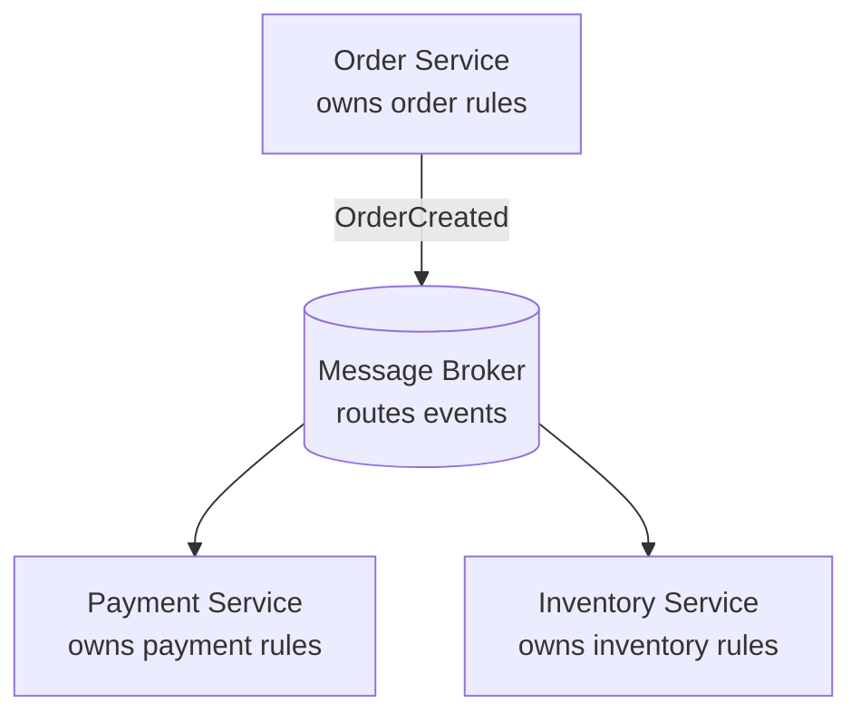

The broker moves events. It does not decide whether an order is valid, whether payment should be authorized, or whether inventory can be reserved.

A problematic design puts business logic in the infrastructure layer:

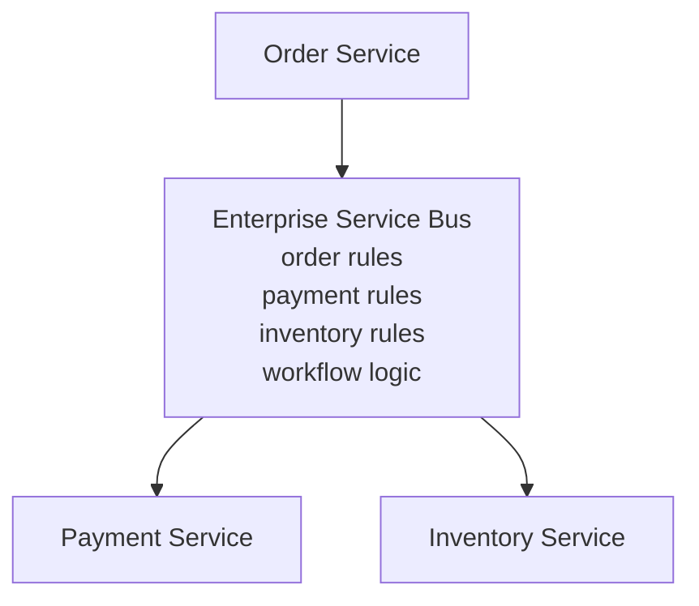

In that design, the service bus becomes a hidden monolith. The system may look distributed, but important business behavior is centralized in the middleware.

---

#### Why this pattern exists

Many older service-oriented architectures used powerful middleware such as Enterprise Service Buses, centralized workflow engines, complex integration platforms, or heavy gateway layers.

These tools often started with good intentions:

* route messages,
* transform formats,
* connect systems,
* coordinate workflows,
* apply policies,
* reduce duplicated integration code.

But over time, they sometimes accumulated business logic.

For example, a service bus might start by routing order events:

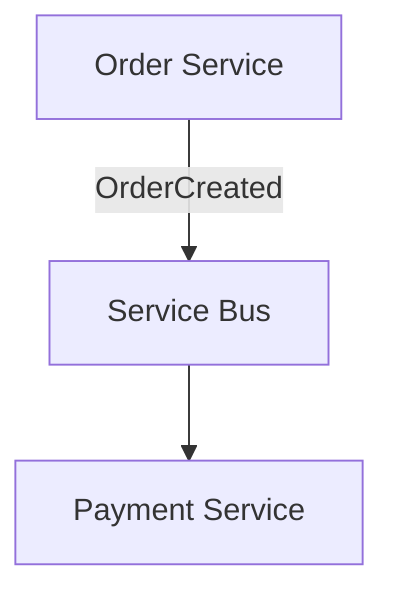

Then teams add a simple transformation:

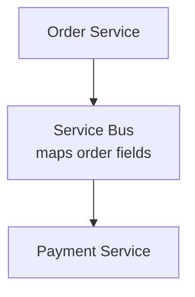

Then they add a business rule:

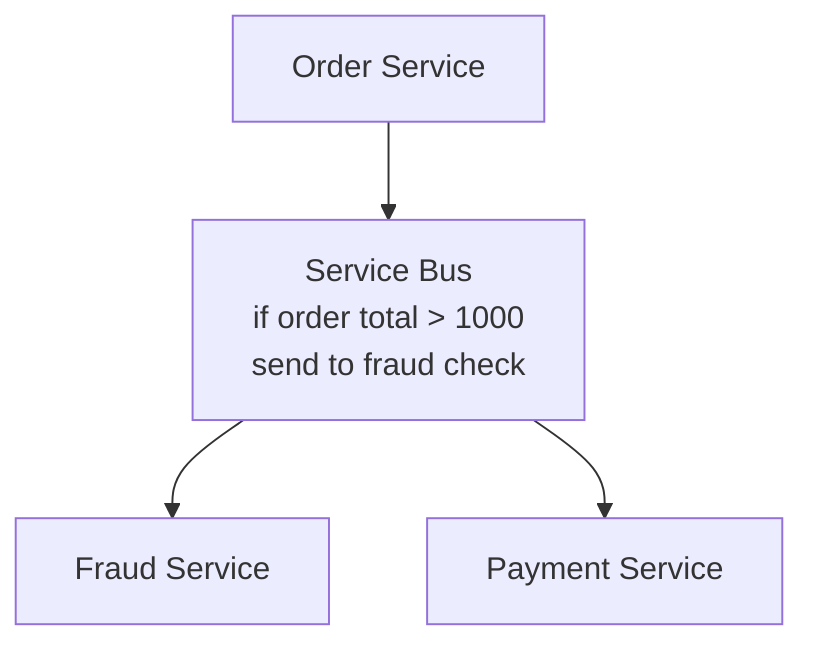

Then they add more workflow logic:

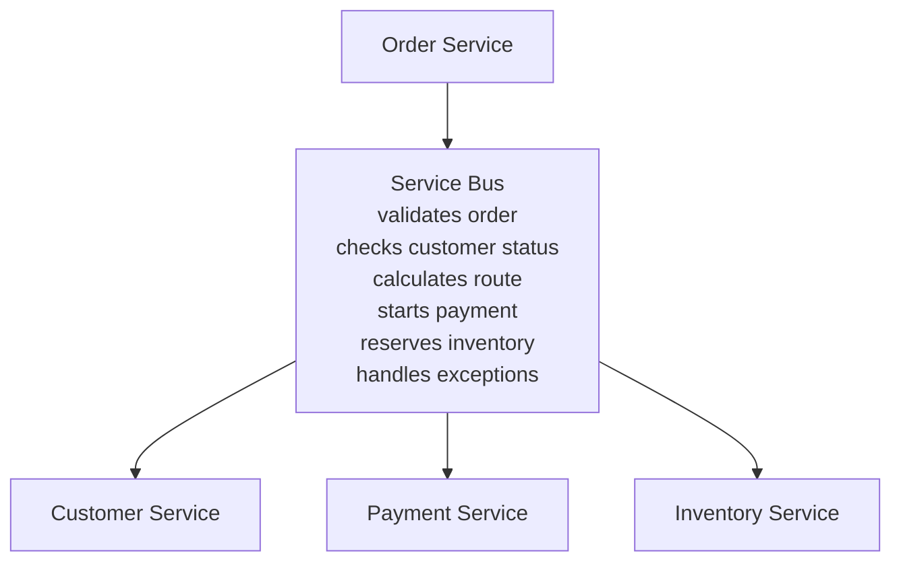

At that point, the bus is no longer just infrastructure. It has become a central business application.

This creates many problems:

* business rules are hard to find,
* services no longer own their domain behavior,
* changes require central middleware coordination,
* teams become dependent on a shared integration team,
* testing becomes difficult,
* deployment becomes risky,
* the middleware becomes a bottleneck,
* the architecture becomes a distributed monolith.

Smart Endpoints, Dumb Pipes exists to prevent this.

---

#### What it solves

This principle solves the problem of **business logic migrating into infrastructure**.

In a healthy microservice architecture, business ownership should be clear:

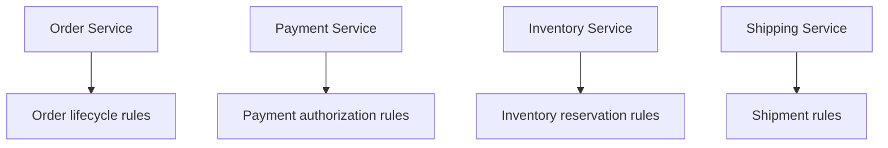

Each service owns its own decisions.

The communication layer should help services talk to each other:

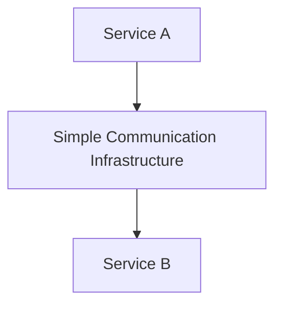

The pipe may provide useful technical features:

* message delivery,
* routing,
* retries,
* buffering,
* backpressure,
* authentication,
* encryption,
* observability,
* dead-letter queues,
* schema validation,
* service discovery.

But it should avoid owning domain rules such as:

* whether an order can be cancelled,
* whether a payment should be refunded,
* whether a customer qualifies for a discount,
* whether inventory should be reserved,
* whether a claim should be approved.

Those decisions belong in the services that own the domain.

---

#### Smart endpoints

A **smart endpoint** is a service that owns meaningful business behavior.

For example, an Order Service should own order-specific rules:

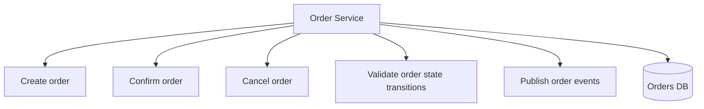

The Order Service should decide whether an order can be cancelled.

Example:

```ts
type OrderStatus =
  | "PENDING_PAYMENT"
  | "CONFIRMED"
  | "SHIPPED"
  | "CANCELLED";

type Order = {
  id: string;
  status: OrderStatus;
};

function cancelOrder(order: Order): Order {
  if (order.status === "SHIPPED") {
    throw new Error("Cannot cancel an order that has already shipped");
  }

  if (order.status === "CANCELLED") {
    return order;
  }

  return {
    ...order,
    status: "CANCELLED"
  };
}
```

This rule belongs in the Order Service because it is part of the order domain.

It should not be hidden in:

* an API gateway,
* a message broker,
* a service mesh,
* an enterprise service bus,
* a shared integration script,
* a database trigger owned by another team.

---

#### Dumb pipes

A **dumb pipe** is communication infrastructure that moves messages without owning domain meaning.

Examples include:

* HTTP,
* REST,
* gRPC,
* message brokers,
* event buses,
* queues,
* pub/sub systems,
* API gateways,
* service meshes,
* reverse proxies,
* load balancers.

“Dumb” does not mean primitive or unreliable. A good pipe can still provide important technical capabilities.

For example, a message broker can provide:

* durable message storage,
* topic routing,
* consumer groups,
* retries,
* dead-letter queues,
* ordering guarantees,
* delivery acknowledgments,
* access control,
* metrics.

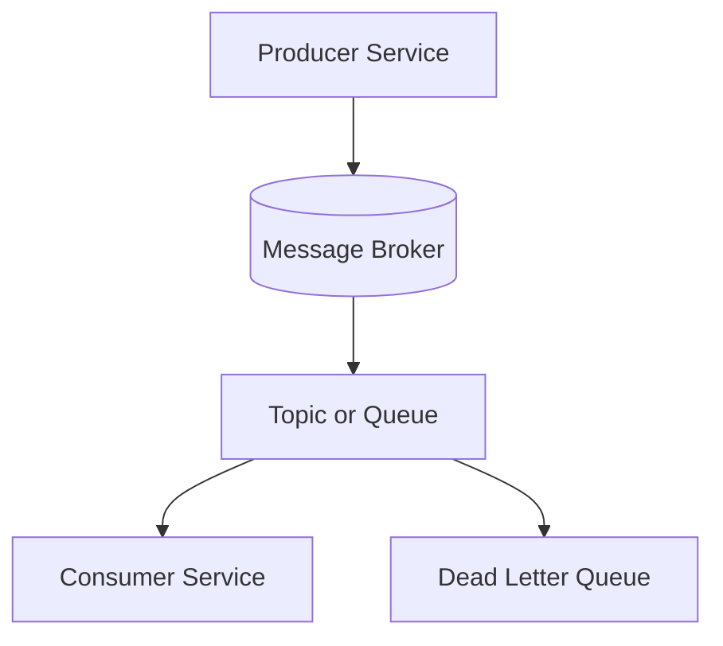

That is still a dumb pipe if it is not making business decisions.

The broker can decide:

> Which subscribers should receive this event?

But it should not decide:

> Is this customer eligible for a premium discount?

That business decision belongs in a service.

---

#### Example: good event-driven design

Suppose an Order Service publishes an event when an order is created.

```json
{
  "eventType": "OrderCreated",
  "eventId": "evt_123",
  "occurredAt": "2026-04-29T12:00:00Z",
  "data": {
    "orderId": "ord_456",
    "customerId": "cus_789",
    "totalAmount": 129.99,
    "currency": "USD"
  }
}
```

The event broker routes the event to interested services:

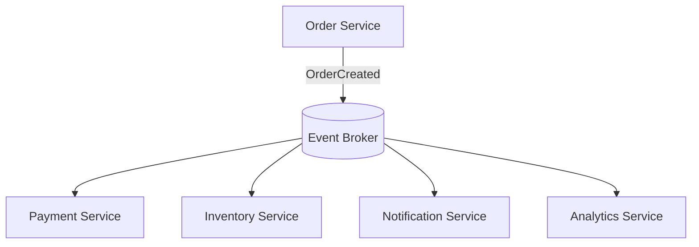

Each service owns its reaction.

Payment Service decides whether and how to authorize payment:

```ts
async function handleOrderCreated(event: OrderCreatedEvent): Promise<void> {
  const paymentDecision = await paymentPolicy.evaluate({
    customerId: event.data.customerId,
    orderId: event.data.orderId,
    amount: event.data.totalAmount,
    currency: event.data.currency
  });

  if (paymentDecision.requiresManualReview) {
    await paymentRepository.createPendingReview(event.data.orderId);
    return;
  }

  await paymentGateway.authorize({
    orderId: event.data.orderId,
    amount: event.data.totalAmount,
    currency: event.data.currency
  });
}
```

Inventory Service decides whether inventory can be reserved:

```ts
async function handleOrderCreated(event: OrderCreatedEvent): Promise<void> {
  const reservation = await inventoryService.reserveItems({
    orderId: event.data.orderId,
    items: event.data.items
  });

  await eventBus.publish("InventoryReserved", {
    orderId: event.data.orderId,
    reservationId: reservation.id
  });
}
```

The broker does not know payment policy or inventory policy. It only delivers the event.

---

#### Example: bad event-driven design

A bad design puts business rules inside the broker or integration layer.

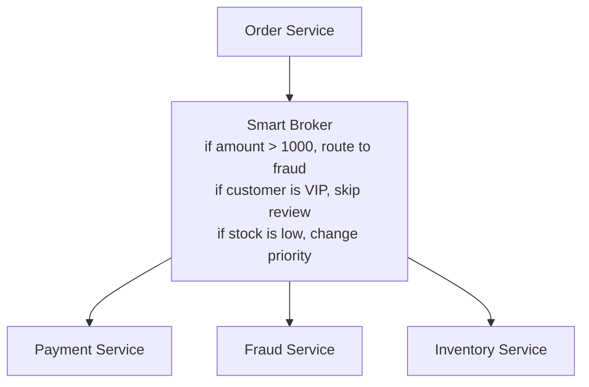

This is risky because the broker now owns business meaning.

The routing rules may look harmless at first:

```yaml
routes:
  - when: order.totalAmount > 1000
    sendTo: fraud-service

  - when: customer.tier == "VIP"
    sendTo: priority-fulfillment

  - when: inventory.stockLevel < 10
    sendTo: replenishment-service
```

But these are not just routing rules. They are business rules.

Questions become difficult to answer:

* Who owns the VIP fulfillment rule?
* Who tests it?
* Who deploys changes to it?
* Does the business know the rule lives in gateway or broker config?
* Does the Order Service know this affects the order lifecycle?
* Does the Fraud Team own the fraud routing criteria?
* What happens when the rule conflicts with service logic?

This is how integration infrastructure becomes a hidden monolith.

---

#### API gateway example

An API Gateway is a common place where this principle matters.

A good gateway handles edge concerns:

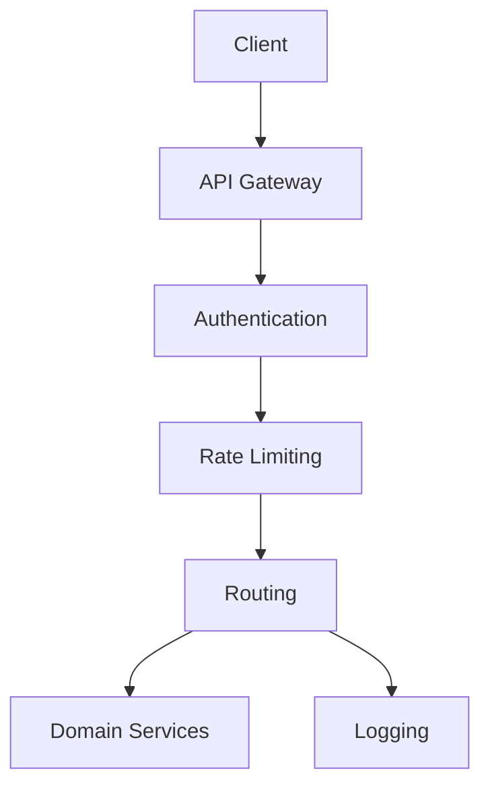

Good gateway responsibilities:

* verify token,
* apply rate limits,
* terminate TLS,
* route requests,
* add request IDs,
* enforce request-size limits,
* handle CORS,
* collect access logs.

Bad gateway responsibilities:

* calculate order total,
* decide refund eligibility,
* approve loan applications,
* determine shipment rerouting rules,
* manage inventory reservations,
* orchestrate complex business workflows,
* apply pricing rules.

For example, this is good:

```ts
function routeRequest(req: Request): RouteTarget {
  if (req.path.startsWith("/api/orders")) {
    return {
      service: "order-service"
    };
  }

  if (req.path.startsWith("/api/payments")) {
    return {
      service: "payment-service"
    };
  }

  throw new Error("No route found");
}
```

This is risky:

```ts
function canCancelOrder(req: Request): boolean {
  return (
    req.body.orderStatus !== "SHIPPED" &&
    req.body.customerTier === "PREMIUM" &&
    req.body.refundAmount < 500
  );
}
```

That cancellation decision belongs in the Order Service or a domain service, not the gateway.

---

#### Message broker example

A message broker should deliver messages and provide infrastructure-level guarantees.

Good broker responsibilities:

* persist messages,
* deliver to subscribers,
* manage consumer groups,
* retry failed delivery,
* send poison messages to a dead-letter queue,
* enforce topic permissions,
* expose lag metrics.

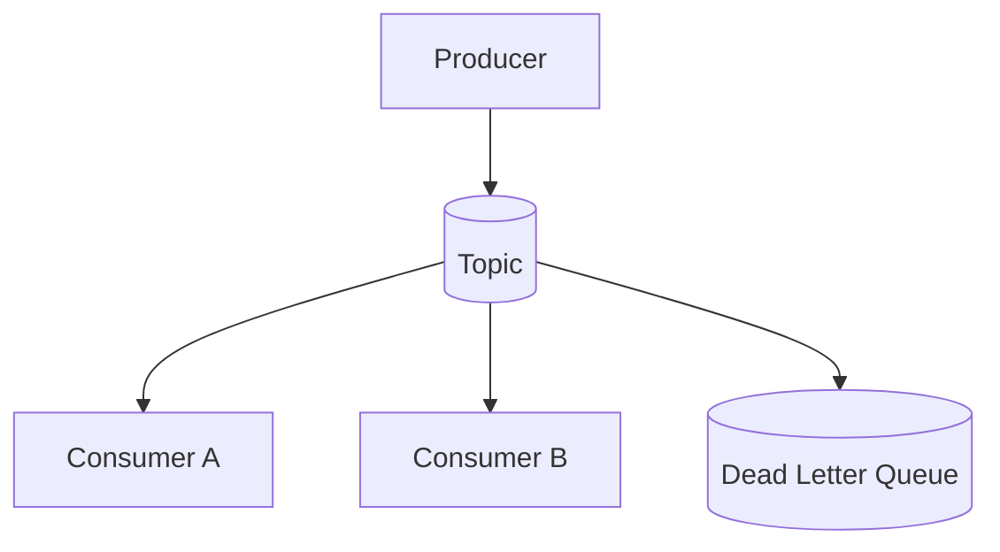

Risky broker responsibilities:

* deciding customer eligibility,
* modifying order state,
* enriching events with domain data,
* applying pricing rules,
* filtering business events based on domain-specific policies,
* coordinating multi-step business processes.

A broker may filter by topic or event type:

```text
OrderCreated -> order-events topic
PaymentAuthorized -> payment-events topic
```

But be cautious with domain-specific filters:

```text
Only route OrderCreated to Fulfillment if customer is VIP and order margin > 20%
```

That likely belongs in a fulfillment, pricing, or order workflow service.

---

#### Service mesh example

A service mesh can provide powerful infrastructure behavior for service-to-service communication.

Good service mesh responsibilities:

* mTLS,
* traffic routing,
* retries,
* timeouts,
* circuit breaking,
* observability,
* service identity,
* policy enforcement.

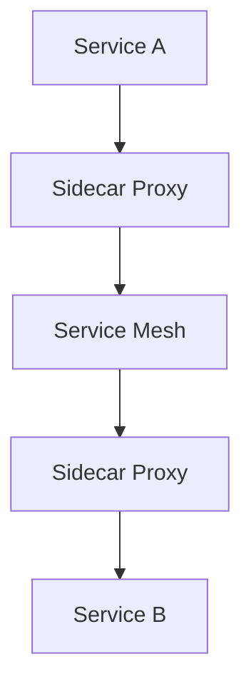

Bad service mesh responsibilities:

* deciding order workflows,
* applying customer segmentation rules,
* calculating discounts,
* selecting payment strategies based on business policy,
* enforcing domain state transitions.

A service mesh can decide:

> Route 5% of traffic to version 2.

It should not decide:

> Premium customers should bypass fraud checks unless the order contains restricted items.

The first is traffic management. The second is business logic.

---

#### Integration layer example

An integration layer is sometimes needed to connect systems.

For example, it may connect an e-commerce platform to an ERP.

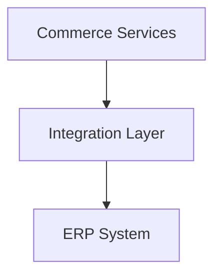

The integration layer may translate protocols and formats:

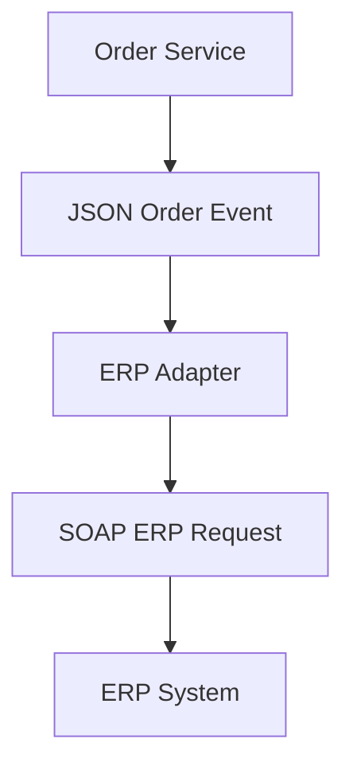

That is acceptable.

But if the integration layer starts owning core order, pricing, fulfillment, or accounting decisions, it becomes too smart.

A healthy integration layer translates:

```ts
function toErpSalesOrder(order: OrderConfirmedEvent): ErpSalesOrderRequest {
  return {
    salesOrderNumber: order.orderId,
    customerNumber: order.customerId,
    orderDate: order.confirmedAt,
    lines: order.items.map((item) => ({
      sku: item.sku,
      quantity: item.quantity,
      unitPrice: item.unitPrice
    }))
  };
}
```

A risky integration layer decides business policy:

```ts
function shouldSendToErp(order: Order): boolean {
  return order.margin > 0.2 && order.customerTier !== "TRIAL";
}
```

That rule may belong in Order Service, Billing, Finance, or a dedicated fulfillment policy service.

---

#### Smart endpoints and domain ownership

Smart endpoints work because each service owns a bounded business responsibility.

For example:

| Service           | Owns                                                    |
| ----------------- | ------------------------------------------------------- |
| Order Service     | Order lifecycle, order state transitions, order history |
| Payment Service   | Authorization, capture, refunds, payment state          |
| Inventory Service | Stock levels, reservations, availability                |
| Shipping Service  | Shipment creation, carrier integration, tracking        |
| Pricing Service   | Price calculation, discounts, promotions                |
| Customer Service  | Customer profile and preferences                        |

Each service should expose APIs or events that reflect its ownership.

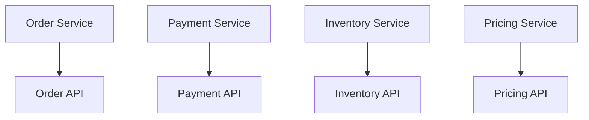

When another service needs a decision, it should ask the service that owns that decision.

For example, the Checkout Service should not calculate price if Pricing Service owns pricing. It should ask Pricing Service.

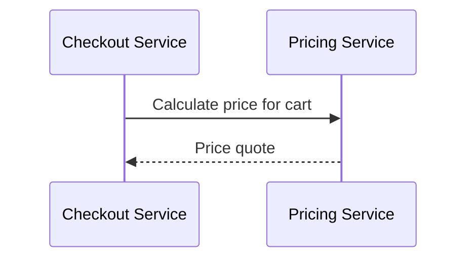

The pipe between them should not calculate the price.

---

#### Dumb pipes can still be reliable

“Dumb pipes” does not mean the infrastructure should be weak.

A dumb pipe can still be highly engineered.

For example, a message broker may provide:

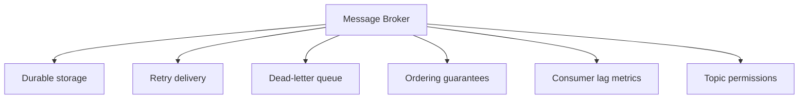

These are infrastructure responsibilities.

The distinction is not about sophistication. It is about ownership of business meaning.

Infrastructure should know how to deliver messages. It should not need to understand what those messages mean in business terms.

---

#### Choreography and dumb pipes

This principle fits naturally with event choreography.

In choreography, services publish events and react to events.

```mermaid
flowchart TD
    Orders[Order Service]
    Bus[(Event Bus)]

    Payments[Payment Service]
    Inventory[Inventory Service]
    Notifications[Notification Service]

    Orders -->|OrderCreated| Bus

    Bus --> Payments
    Bus --> Inventory
    Bus --> Notifications
```

The event bus does not coordinate the business process. Each service decides how to react.

Payment Service reacts to `OrderCreated` by starting payment authorization.

Inventory Service reacts by reserving stock.

Notification Service reacts by sending confirmation messages.

This keeps business logic distributed to the owning services.

However, choreography can become hard to understand if the workflow is not documented. Smart endpoints do not remove the need for observability and process visibility.

---

#### Orchestration and smart endpoints

Smart Endpoints, Dumb Pipes does not forbid orchestration.

Some workflows need an orchestrator.

For example, checkout may be coordinated by a Checkout Service:

```mermaid
flowchart TD
    Checkout[Checkout Service<br/>workflow coordination]

    Orders[Order Service]
    Payments[Payment Service]
    Inventory[Inventory Service]
    Shipping[Shipping Service]

    Checkout --> Orders
    Checkout --> Payments
    Checkout --> Inventory
    Checkout --> Shipping
```

This can still follow the principle if the orchestrator is a service with clear business ownership, not generic middleware.

A good orchestrator coordinates:

```ts
async function checkout(command: CheckoutCommand): Promise<void> {
  const order = await orders.createPendingOrder(command);
  const payment = await payments.authorize(order.paymentRequest);
  const reservation = await inventory.reserve(order.items);

  await orders.confirm(order.id, {
    paymentId: payment.id,
    reservationId: reservation.id
  });
}
```

But the orchestrator should not steal domain rules from other services.

For example:

* Payment Service decides whether authorization succeeds.
* Inventory Service decides whether stock can be reserved.
* Order Service decides whether the order can be confirmed.

The Checkout Service coordinates the workflow. It does not own every domain rule.

---

#### Business logic vs technical policy

A common difficulty is deciding whether something is business logic or technical policy.

Use this distinction:

| Concern                                               | Usually belongs in                 |
| ----------------------------------------------------- | ---------------------------------- |
| Is the token valid?                                   | Gateway or identity infrastructure |
| Can this user cancel this order?                      | Order Service                      |
| Is request size under 1 MB?                           | Gateway                            |
| Is this payment refundable?                           | Payment Service                    |
| Should this route use canary version?                 | Gateway or service mesh            |
| Is this customer eligible for a discount?             | Pricing or Promotion Service       |
| Should this failed message go to a dead-letter queue? | Broker                             |
| Should this order be sent for manual fraud review?    | Fraud or Risk Service              |
| Should this API key be rate-limited?                  | Gateway                            |
| Can this inventory reservation be created?            | Inventory Service                  |

A useful test:

> Would a product manager, domain expert, or business policy owner care about this rule?

If yes, it probably belongs in a service, not generic infrastructure.

---

#### Example: fraud review

Consider this rule:

> Orders over $1,000 from new customers should be reviewed for fraud.

Bad placement:

```mermaid
flowchart TD
    OrderService[Order Service]
    Broker[Message Broker<br/>if amount > 1000 and customer age < 30 days<br/>route to fraud review]

    Fraud[Fraud Service]
    Payments[Payment Service]

    OrderService --> Broker
    Broker --> Fraud
    Broker --> Payments
```

The broker now owns fraud policy.

Better placement:

```mermaid
flowchart TD
    OrderService[Order Service]
    Broker[(Event Broker)]

    Fraud[Fraud Service<br/>owns fraud policy]
    Payments[Payment Service]

    OrderService -->|OrderCreated| Broker

    Broker --> Fraud
    Broker --> Payments
```

Fraud Service evaluates the rule:

```ts
function requiresFraudReview(order: OrderRiskInput): boolean {
  return order.totalAmount > 1000 && order.customerAgeDays < 30;
}
```

Now fraud policy is owned by the Fraud Service.

If the rule changes, the Fraud Team changes its service. The broker remains generic.

---

#### Example: routing vs business decision

Gateway routing can be technical or business-specific.

Technical routing:

```yaml
routes:
  - pathPrefix: /api/orders
    target: order-service

  - pathPrefix: /api/payments
    target: payment-service
```

This is fine. It maps API routes to services.

Canary routing:

```yaml
routes:
  - pathPrefix: /api/orders
    target:
      stable: order-service-v1
      canary: order-service-v2
      canaryPercent: 5
```

This is also fine. It is deployment policy.

Business routing:

```yaml
routes:
  - when: customer.lifetimeValue > 10000
    target: premium-fulfillment-service

  - when: order.profitMargin < 0.05
    target: low-margin-review-service
```

This is suspicious. These rules use business meaning and likely belong in domain services.

---

#### Example: transformation vs corruption

Some transformation in pipes is acceptable.

For example, a gateway may rewrite a public path to an internal path:

```text
Public:
GET /api/v1/orders/ord_123

Internal:
GET /orders/ord_123
```

That is technical transformation.

An event broker may wrap messages with metadata:

```json
{
  "messageId": "msg_123",
  "topic": "order-events",
  "payload": {
    "eventType": "OrderCreated",
    "orderId": "ord_456"
  }
}
```

That is technical envelope handling.

But this is domain transformation:

```json
{
  "eventType": "PriorityOrderCreated",
  "priority": "HIGH",
  "reason": "Customer is VIP and order total is above threshold"
}
```

If the pipe decides that priority, it is no longer dumb. A domain service should assign business priority.

A useful boundary:

| Transformation type             | Usually okay in pipe? |
| ------------------------------- | --------------------- |
| Path rewrite                    | Yes                   |
| Protocol conversion             | Usually               |
| Header normalization            | Yes                   |
| Message envelope                | Yes                   |
| Schema validation               | Usually               |
| Status code normalization       | Sometimes             |
| Mapping legacy business meaning | Usually better in ACL |
| Calculating business priority   | No                    |
| Applying pricing logic          | No                    |
| Deciding workflow path          | Usually no            |

---

#### Implementation guidance

A good implementation keeps infrastructure configuration declarative and technical.

Example gateway configuration:

```yaml
routes:
  - name: orders
    pathPrefix: /api/orders
    target: order-service
    policies:
      authRequired: true
      rateLimit:
        requestsPerMinute: 500
      timeoutMs: 2000

  - name: catalog
    pathPrefix: /api/catalog
    target: catalog-service
    policies:
      authRequired: false
      cache:
        ttlSeconds: 60
      timeoutMs: 1000
```

This is mostly technical policy.

Example message broker configuration:

```yaml
topics:
  - name: order-events
    retentionDays: 7
    partitions: 12
    allowedProducers:
      - order-service
    allowedConsumers:
      - payment-service
      - inventory-service
      - analytics-service

  - name: payment-events
    retentionDays: 30
    partitions: 8
    allowedProducers:
      - payment-service
    allowedConsumers:
      - order-service
      - accounting-service
```

This is infrastructure ownership.

Business rules remain in service code:

```ts
class PaymentService {
  async authorizePayment(command: AuthorizePaymentCommand): Promise<PaymentAuthorization> {
    const risk = await this.riskPolicy.evaluate(command);

    if (risk.decision === "REJECT") {
      return this.rejectPayment(command, risk.reason);
    }

    if (risk.decision === "REVIEW") {
      return this.markPaymentForReview(command, risk.reason);
    }

    return this.paymentGateway.authorize(command);
  }
}
```

The service owns the decision.

---

#### Shared rules without smart pipes

One trade-off of this principle is that some rules may seem shared across services.

For example:

* tenant access rules,
* data classification rules,
* customer eligibility rules,
* currency formatting,
* validation logic,
* compliance policies.

The wrong solution is to put all shared rules into the gateway, broker, or service bus.

Better options include:

1. **Create a domain service that owns the shared decision**

For example, an Entitlements Service:

```mermaid
flowchart TD
    ServiceA[Service A]
    ServiceB[Service B]
    Entitlements[Entitlements Service<br/>owns entitlement decisions]

    ServiceA --> Entitlements
    ServiceB --> Entitlements
```

2. **Use a shared library only for stable technical utilities**

For example, date parsing, trace propagation, or standard error types.

3. **Use a policy service for cross-cutting authorization**

For example, a centralized authorization service may evaluate access policies, while domain services still enforce resource-specific checks.

4. **Use contracts and schemas**

Keep message formats consistent without putting business behavior in the pipe.

5. **Use platform middleware for technical concerns**

Authentication, rate limiting, and observability can be centralized without moving domain rules.

The goal is not to duplicate everything. The goal is to avoid hiding business behavior in infrastructure.

---

#### When to use it

Use Smart Endpoints, Dumb Pipes when designing:

* microservice communication,
* event-driven systems,
* message brokers,
* API gateways,
* service meshes,
* integration platforms,
* workflow systems,
* legacy migration layers,
* internal platform infrastructure.

It is especially important when multiple teams share the same infrastructure layer. Without this principle, the shared layer can become a bottleneck where every business change must be coordinated.

Use this principle when you want:

* clear domain ownership,
* independently deployable services,
* simple infrastructure contracts,
* decentralized business logic,
* less middleware coupling,
* fewer hidden dependencies.

---

#### When not to apply it blindly

This principle should not be interpreted as:

> Infrastructure must be useless.

A pipe can and should provide strong technical capabilities.

It is reasonable for infrastructure to handle:

* delivery guarantees,
* retries,
* timeouts,
* circuit breaking,
* authentication,
* encryption,
* schema validation,
* observability,
* routing,
* rate limiting,
* dead-letter queues.

It may also be appropriate to use a workflow engine for long-running business processes, as long as the workflow ownership is explicit and domain rules are not hidden in generic middleware.

For example, a dedicated Claims Workflow Service using a workflow engine can still be valid:

```mermaid
flowchart TD
    ClaimsWorkflow[Claims Workflow Service]
    WorkflowEngine[Workflow Engine]

    Policy[Policy Service]
    Fraud[Fraud Service]
    Payments[Payment Service]

    ClaimsWorkflow --> WorkflowEngine
    ClaimsWorkflow --> Policy
    ClaimsWorkflow --> Fraud
    ClaimsWorkflow --> Payments
```

The key is ownership. If the Claims team owns the workflow service and the workflow represents claims domain behavior, that can be acceptable.

The danger is a generic enterprise workflow layer that quietly absorbs business logic from every domain.

---

#### Benefits

**1. Keeps business ownership inside services**

The service responsible for a domain owns that domain’s rules.

**2. Avoids hidden monoliths**

Gateways, brokers, service buses, and meshes do not become centralized business applications.

**3. Improves service autonomy**

Teams can change business behavior in their own services without changing shared middleware.

**4. Makes behavior easier to find**

Order rules live in Order Service. Payment rules live in Payment Service. Inventory rules live in Inventory Service.

**5. Simplifies infrastructure**

Communication layers are easier to operate when they do not contain domain-specific rules.

**6. Improves testability**

Business behavior can be tested in the owning service instead of requiring complex middleware integration tests.

**7. Reduces organizational bottlenecks**

Teams do not need a central integration team for every business rule change.

---

#### Trade-offs

**1. Services become more responsible**

Smart endpoints require teams to own more logic, testing, and operational behavior.

**2. Some rules may be duplicated if ownership is unclear**

Teams must avoid copying the same business rule into multiple services.

**3. Coordination still exists**

Services still need contracts, schemas, observability, and integration testing.

**4. Workflows can be harder to see**

If services react independently to events, the overall process may be less obvious.

**5. Shared policy decisions need careful ownership**

Cross-cutting policies may need dedicated services or libraries.

**6. Infrastructure cannot hide poor service boundaries**

If services are poorly decomposed, simple pipes will not fix the architecture.

---

#### Common mistakes

**Mistake 1: Putting business rules in the gateway**

The gateway should not calculate prices, approve refunds, or decide order transitions.

**Mistake 2: Making the message broker a rules engine**

A broker should route and deliver messages, not own domain decisions.

**Mistake 3: Treating “dumb pipes” as unreliable pipes**

Infrastructure should still be robust, observable, secure, and scalable.

**Mistake 4: Duplicating shared business rules everywhere**

If many services need the same business decision, create a clear owner for that decision.

**Mistake 5: Hiding workflows in event subscriptions**

Event choreography needs documentation, tracing, and operational visibility.

**Mistake 6: Letting an integration layer become the real system**

If most business behavior is in the integration layer, services are no longer autonomous.

**Mistake 7: Confusing technical routing with business routing**

Routing by path or version is technical. Routing by customer value, margin, eligibility, or risk is usually business logic.

---

#### Practical design checklist

When designing communication infrastructure, ask:

* Is this rule technical or business-specific?
* Which service owns the business concept involved?
* Would a domain expert care about this rule?
* Is the gateway only routing and enforcing edge policy?
* Is the broker only delivering messages and managing infrastructure concerns?
* Is the service mesh only managing traffic and security?
* Are business decisions testable inside the owning service?
* Are event contracts clear?
* Are workflows observable?
* Is routing configuration free of hidden business rules?
* Is transformation limited to protocol, envelope, or compatibility concerns?
* Does any shared middleware need frequent business-driven changes?
* If middleware disappeared, would the service still own its domain behavior?
* Is there a clear owner for shared decisions?
* Are teams using infrastructure to avoid fixing service boundaries?

A design is probably healthy if:

* services own business decisions,
* infrastructure owns technical delivery concerns,
* gateway rules are mostly edge policies,
* broker rules are mostly delivery policies,
* domain behavior is easy to find,
* shared business decisions have explicit service ownership,
* communication contracts are simple and documented.

A design is probably unhealthy if:

* business rules live in gateway configuration,
* the broker has domain-specific routing rules,
* service bus changes are required for most product changes,
* no one knows where a business decision is implemented,
* infrastructure teams become blockers for domain changes,
* services mostly forward messages while middleware does the real work.

---

#### Related patterns

| Pattern                          | Relationship                                                        |
| -------------------------------- | ------------------------------------------------------------------- |
| API Gateway                      | Gateway should handle edge concerns, not domain logic               |
| Gateway Routing                  | Routing should remain technical, not become business policy         |
| Gateway Offloading               | Offload technical concerns, not business decisions                  |
| Event-Driven Architecture        | Events should be delivered by pipes and interpreted by services     |
| Choreography                     | Services react to events; the broker stays simple                   |
| Saga                             | Workflow coordination may live in a service, not generic middleware |
| Decompose by Business Capability | Helps decide which endpoint owns which business rules               |
| Decompose by Subdomain           | Bounded contexts should own their own models and decisions          |
| Anti-Corruption Layer            | Translation belongs at boundaries, not hidden inside generic pipes  |
| Service Mesh                     | Mesh handles traffic policy, not domain behavior                    |
| Consumer-Driven Contracts        | Keeps service communication explicit and testable                   |

---

#### Summary

Smart Endpoints, Dumb Pipes means that business logic belongs in services, while communication infrastructure should remain simple, generic, and technical.

The central idea is:

> Let services make business decisions. Let pipes move messages.

A healthy implementation keeps:

* order rules in Order Service,
* payment rules in Payment Service,
* inventory rules in Inventory Service,
* pricing rules in Pricing Service,
* routing, delivery, retries, TLS, rate limits, and observability in infrastructure.

This prevents gateways, brokers, service buses, service meshes, and integration layers from becoming hidden monoliths.

The trade-off is that services must be genuinely capable. They need clear ownership, good contracts, strong tests, and reliable operations. But that is the point of microservices: business capabilities should be owned by services, not by the pipes between them.


---

### 15. Chained Microservice Pattern

#### What it is

The **Chained Microservice Pattern** is a communication pattern where a request flows synchronously through a sequence of services.

One service receives a request, calls another service, that service calls another service, and so on until the workflow completes.

```mermaid
flowchart TD
    Client[Client]
    ServiceA[Service A]
    ServiceB[Service B]
    ServiceC[Service C]
    ServiceD[Service D]

    Client --> ServiceA
    ServiceA --> ServiceB
    ServiceB --> ServiceC
    ServiceC --> ServiceD
```

A simple example:

```mermaid
sequenceDiagram
    participant Client
    participant Checkout as Checkout Service
    participant Orders as Order Service
    participant Payments as Payment Service
    participant Inventory as Inventory Service

    Client->>Checkout: Submit checkout
    Checkout->>Orders: Create order
    Orders->>Payments: Authorize payment
    Payments->>Inventory: Reserve inventory
    Inventory-->>Payments: Inventory reserved
    Payments-->>Orders: Payment authorized
    Orders-->>Checkout: Order created
    Checkout-->>Client: Checkout complete
```

The defining feature is that each step waits for the next step to finish before returning.

The central idea is:

> A request is handled by a synchronous chain of service calls, where each service depends on the next service’s response.

This pattern is easy to understand, but it becomes risky when the chain grows long or includes unreliable dependencies.

---

#### Why this pattern exists

Not every workflow needs messaging, sagas, event sourcing, or orchestration.

Some workflows are naturally short and sequential.

For example:

1. API Service receives a request.
2. Customer Service validates the customer.
3. Pricing Service calculates the price.
4. Order Service creates the order.
5. API Service returns the result.

```mermaid
flowchart TD
    Start[Request received]
    Validate[Validate customer]
    Price[Calculate price]
    Create[Create order]
    Return[Return response]

    Start --> Validate
    Validate --> Price
    Price --> Create
    Create --> Return
```

If the workflow is short, low-risk, and requires immediate response, synchronous chaining can be reasonable.

The pattern exists because direct calls are simple:

* the control flow is easy to follow,
* the client receives a response immediately,
* failures are easy to return as errors,
* no message broker is required,
* no eventual consistency model is needed for simple cases.

But that simplicity has limits.

---

#### What it solves

The Chained Microservice Pattern solves the need for **simple sequential coordination**.

It is useful when one step really does need the result of the previous step.

For example:

```mermaid
flowchart TD
    Request[Create order request]

    Customer[Customer Service<br/>validate customer]
    Pricing[Pricing Service<br/>calculate price]
    Orders[Order Service<br/>create order]

    Request --> Customer
    Customer --> Pricing
    Pricing --> Orders
```

The Order Service may need the customer validation result and pricing result before it can create the order.

In this kind of workflow, chaining can be easier than introducing asynchronous messaging.

However, the important limitation is that every service in the chain becomes part of the request’s critical path.

If one service is slow, the whole request is slow.

If one service fails, the whole request may fail.

---

#### Basic structure

A chained request usually has this structure:

```mermaid
sequenceDiagram
    participant Client
    participant A as Service A
    participant B as Service B
    participant C as Service C

    Client->>A: Request
    A->>B: Request
    B->>C: Request
    C-->>B: Response
    B-->>A: Response
    A-->>Client: Response
```

Service A cannot respond to the client until Service B responds.

Service B cannot respond to Service A until Service C responds.

This means total latency accumulates.

If each service takes 100 ms, a three-service chain may take roughly 300 ms, plus network overhead.

```text
Total latency ≈ Service A work + Service B call + Service C call + network overhead
```

For short chains, this can be acceptable. For long chains, it becomes a performance and reliability problem.

---

#### Example: customer lookup and order creation

Suppose an API endpoint creates an order.

The request must:

1. Validate that the customer exists.
2. Calculate the current price.
3. Create the order.

```mermaid
sequenceDiagram
    participant Client
    participant API as API Service
    participant Customers as Customer Service
    participant Pricing as Pricing Service
    participant Orders as Order Service

    Client->>API: POST /orders
    API->>Customers: GET /customers/cus_123
    Customers-->>API: Customer is active

    API->>Pricing: POST /price-quotes
    Pricing-->>API: Price quote

    API->>Orders: POST /orders
    Orders-->>API: Order created

    API-->>Client: 201 Created
```

This is a reasonable use of synchronous calls if:

* the services are reliable,
* the workflow is short,
* the client needs an immediate result,
* all dependencies are low-latency,
* failures can be returned directly to the client.

Example implementation:

```ts
import express, { Request, Response } from "express";

const app = express();
app.use(express.json());

type CreateOrderRequest = {
  customerId: string;
  items: Array<{
    productId: string;
    quantity: number;
  }>;
};

async function getCustomer(customerId: string) {
  const response = await fetch(`http://customer-service/customers/${customerId}`);

  if (response.status === 404) {
    throw new Error("CUSTOMER_NOT_FOUND");
  }

  if (!response.ok) {
    throw new Error("CUSTOMER_SERVICE_UNAVAILABLE");
  }

  return response.json();
}

async function createPriceQuote(request: CreateOrderRequest) {
  const response = await fetch("http://pricing-service/price-quotes", {
    method: "POST",
    headers: {
      "Content-Type": "application/json"
    },
    body: JSON.stringify({
      customerId: request.customerId,
      items: request.items
    })
  });

  if (!response.ok) {
    throw new Error("PRICING_FAILED");
  }

  return response.json();
}

async function createOrder(request: CreateOrderRequest, priceQuoteId: string) {
  const response = await fetch("http://order-service/orders", {
    method: "POST",
    headers: {
      "Content-Type": "application/json"
    },
    body: JSON.stringify({
      customerId: request.customerId,
      items: request.items,
      priceQuoteId
    })
  });

  if (!response.ok) {
    throw new Error("ORDER_CREATION_FAILED");
  }

  return response.json();
}

app.post("/orders", async (req: Request, res: Response) => {
  try {
    const command = req.body as CreateOrderRequest;

    const customer = await getCustomer(command.customerId);

    if (customer.status !== "ACTIVE") {
      res.status(400).json({
        error: "CUSTOMER_NOT_ACTIVE"
      });
      return;
    }

    const quote = await createPriceQuote(command);
    const order = await createOrder(command, quote.priceQuoteId);

    res.status(201).json(order);
  } catch (error) {
    res.status(500).json({
      error: error instanceof Error ? error.message : "UNKNOWN_ERROR"
    });
  }
});

app.listen(3000);
```

This implementation is simple, but it has an important weakness: every downstream service must respond successfully for the endpoint to succeed.

---

#### Latency accumulation

Latency compounds in a chain.

Suppose a request goes through four services:

```mermaid
flowchart TD
    Client[Client]
    A[Service A<br/>80 ms]
    B[Service B<br/>120 ms]
    C[Service C<br/>150 ms]
    D[Service D<br/>100 ms]

    Client --> A
    A --> B
    B --> C
    C --> D
```

The total latency may be approximately:

```text
80 ms + 120 ms + 150 ms + 100 ms = 450 ms
```

That does not include network overhead, serialization, load balancers, retries, TLS, gateway processing, or queueing.

The longer the chain, the worse tail latency becomes.

For example, even if each service is usually fast, one slow service can slow down the entire request.

```mermaid
flowchart TD
    Request[Request]
    A[Service A<br/>50 ms]
    B[Service B<br/>60 ms]
    C[Service C<br/>2000 ms slow]
    D[Service D<br/>50 ms]
    Response[Slow response]

    Request --> A
    A --> B
    B --> C
    C --> D
    D --> Response
```

A chain is only as fast as its accumulated path.

---

#### Failure accumulation

Failure risk also compounds.

If each service has a 99.9% success rate, a chain of five services has a lower end-to-end success rate than any individual service.

```text
0.999 × 0.999 × 0.999 × 0.999 × 0.999 ≈ 0.995
```

That means a five-service chain with individually reliable services may still have only about 99.5% success end to end.

```mermaid
flowchart TD
    Client[Client]
    A[Service A<br/>99.9 percent]
    B[Service B<br/>99.9 percent]
    C[Service C<br/>99.9 percent]
    D[Service D<br/>99.9 percent]
    E[Service E<br/>99.9 percent]

    Client --> A
    A --> B
    B --> C
    C --> D
    D --> E

    Risk[End-to-end reliability is lower than each individual service]
    E --> Risk
```

The chain fails if any required dependency fails.

This is why long synchronous chains are fragile.

---

#### When chaining is reasonable

A chained design can be reasonable when the chain is short and the dependencies are reliable.

Good conditions:

* only two or three services are involved,
* all calls are low latency,
* all dependencies are within the same trust boundary,
* the workflow needs an immediate response,
* failures can be reported directly to the caller,
* no long-running business process is involved,
* no irreversible side effects happen halfway through,
* there is a clear timeout policy,
* each dependency has strong observability.

Example of a reasonable chain:

```mermaid
sequenceDiagram
    participant API as API Service
    participant Profile as Profile Service
    participant Preferences as Preferences Service

    API->>Profile: Get user profile
    Profile-->>API: Profile
    API->>Preferences: Get user preferences
    Preferences-->>API: Preferences
```

This may be acceptable for a read operation where failure can simply return an error or partial response.

---

#### When chaining becomes dangerous

Chaining becomes dangerous when the workflow is long, state-changing, or business-critical.

Warning signs:

* more than three or four synchronous service calls,
* services call services that call more services,
* the chain crosses many teams,
* the chain includes slow external dependencies,
* the chain performs irreversible side effects,
* timeout behavior is unclear,
* retries can duplicate work,
* partial completion causes inconsistent state,
* no service clearly owns the workflow,
* debugging requires following many nested calls.

A risky chain:

```mermaid
flowchart TD
    Client[Client]
    A[API Service]
    B[Order Service]
    C[Payment Service]
    D[Fraud Service]
    E[Inventory Service]
    F[Warehouse Service]
    G[Shipping Service]
    H[Notification Service]
    I[Analytics Service]

    Client --> A
    A --> B
    B --> C
    C --> D
    D --> E
    E --> F
    F --> G
    G --> H
    H --> I
```

This kind of chain has high latency, high failure risk, and poor debuggability.

It may be better as a saga, orchestrated workflow, or event-driven process.

---

#### Chained reads vs chained writes

Chained calls are safer for reads than for writes.

A read chain:

```mermaid
sequenceDiagram
    participant API
    participant Orders
    participant Payments
    participant Shipping

    API->>Orders: Get order
    API->>Payments: Get payment status
    API->>Shipping: Get shipment status
```

If a read dependency fails, the system can often return:

* an error,
* a partial response,
* cached data,
* a fallback,
* a degraded response.

A write chain is riskier:

```mermaid
sequenceDiagram
    participant API
    participant Orders
    participant Payments
    participant Inventory
    participant Shipping

    API->>Orders: Create order
    API->>Payments: Authorize payment
    API->>Inventory: Reserve stock
    API->>Shipping: Create shipment
```

If the chain fails after payment authorization but before inventory reservation, the system is partially complete.

That requires compensation.

```mermaid
flowchart TD
    CreateOrder[Order created]
    Payment[Payment authorized]
    InventoryFail[Inventory reservation failed]

    VoidPayment[Void payment authorization]
    CancelOrder[Cancel order]

    CreateOrder --> Payment
    Payment --> InventoryFail
    InventoryFail --> VoidPayment
    VoidPayment --> CancelOrder
```

At that point, the design is no longer just a simple chain. It is a distributed workflow and likely needs Saga-style handling.

---

#### Hidden chains

One of the most dangerous forms of this pattern is the **hidden chain**.

A service may appear to call only one dependency, but that dependency calls another dependency, which calls another dependency.

```mermaid
flowchart TD
    API[API Service]
    Orders[Order Service]
    Customers[Customer Service]
    Identity[Identity Service]
    Risk[Risk Service]
    Audit[Audit Service]

    API --> Orders
    Orders --> Customers
    Customers --> Identity
    Identity --> Risk
    Risk --> Audit
```

The API Service may only know about Order Service, but the real request path is much longer.

Hidden chains are dangerous because:

* latency surprises callers,
* failures are harder to trace,
* teams do not know their true dependencies,
* capacity planning becomes difficult,
* circular dependencies can appear,
* incident response becomes slower.

To avoid hidden chains, services should document downstream dependencies and expose telemetry showing call graphs.

---

#### Circular chains

A particularly bad failure mode is circular service dependency.

```mermaid
flowchart TD
    Orders[Order Service]
    Payments[Payment Service]
    Customers[Customer Service]

    Orders --> Payments
    Payments --> Customers
    Customers --> Orders
```

This creates tight coupling.

Problems include:

* difficult deployment ordering,
* risk of infinite call loops,
* hard-to-understand ownership,
* fragile startup behavior,
* cascading failures,
* poor testability.

Circular dependencies are usually a sign that service boundaries or workflow ownership need to be revisited.

---

#### Timeouts

Every synchronous call in a chain needs a timeout.

Without timeouts, one slow dependency can consume threads, connections, and memory until the caller also becomes unhealthy.

```mermaid
flowchart TD
    API[API Service]
    Orders[Order Service]
    Slow[Slow Dependency]

    API --> Orders
    Orders --> Slow

    Slow -->|No timeout| Hanging[Request hangs]
```

Example timeout helper:

```ts
async function fetchWithTimeout<T>(
  url: string,
  timeoutMs: number
): Promise<T> {
  const controller = new AbortController();

  const timeout = setTimeout(() => {
    controller.abort();
  }, timeoutMs);

  try {
    const response = await fetch(url, {
      signal: controller.signal
    });

    if (!response.ok) {
      throw new Error(`Request failed with status ${response.status}`);
    }

    return response.json() as Promise<T>;
  } finally {
    clearTimeout(timeout);
  }
}
```

Timeouts should be shorter as calls go deeper into the chain.

For example:

| Layer                             |   Timeout |
| --------------------------------- | --------: |
| Client to API Gateway             | 5 seconds |
| Gateway to API Service            | 4 seconds |
| API Service to downstream service | 2 seconds |
| Downstream service to dependency  |  1 second |

This prevents inner calls from outliving the original request.

---

#### Retries

Retries can help with transient failures, but they are dangerous in chains.

If every service retries three times, the number of attempts can multiply.

```mermaid
flowchart TD
    A[Service A<br/>3 retries]
    B[Service B<br/>3 retries]
    C[Service C<br/>3 retries]

    A --> B
    B --> C

    Risk[Retry amplification]
    C --> Risk
```

A single client request may create many downstream attempts.

Retry only when:

* the operation is idempotent,
* the failure is likely transient,
* there is a timeout,
* there is a retry budget,
* backoff and jitter are used,
* the retry does not overload the dependency.

Example:

```ts
async function retry<T>(
  operation: () => Promise<T>,
  attempts: number
): Promise<T> {
  let lastError: unknown;

  for (let attempt = 1; attempt <= attempts; attempt += 1) {
    try {
      return await operation();
    } catch (error) {
      lastError = error;

      if (attempt === attempts) {
        break;
      }

      const delayMs = Math.min(1000, 100 * attempt);
      await new Promise((resolve) => setTimeout(resolve, delayMs));
    }
  }

  throw lastError;
}
```

Avoid retries for non-idempotent write operations unless an idempotency key is used.

---

#### Idempotency

If a chained workflow performs writes, idempotency is essential.

For example, this request may be retried:

```http
POST /orders
Idempotency-Key: create-order-req-123
```

The receiving service should store the result for that key:

```ts
async function createOrderWithIdempotency(
  command: CreateOrderCommand,
  idempotencyKey: string
): Promise<Order> {
  const existing = await idempotencyStore.find(idempotencyKey);

  if (existing) {
    return existing.response as Order;
  }

  const order = await orderRepository.create(command);

  await idempotencyStore.save({
    key: idempotencyKey,
    response: order
  });

  return order;
}
```

This prevents duplicate orders if a caller retries after a timeout.

In a chain, every state-changing service should consider idempotency.

Examples:

| Operation         | Idempotency need                          |
| ----------------- | ----------------------------------------- |
| Create order      | Prevent duplicate orders                  |
| Authorize payment | Prevent duplicate authorizations          |
| Reserve inventory | Prevent duplicate reservations            |
| Create shipment   | Prevent duplicate shipments               |
| Send notification | Prevent duplicate messages when necessary |

---

#### Circuit breakers

A circuit breaker prevents repeated calls to a failing dependency.

```mermaid
stateDiagram-v2
    [*] --> Closed
    Closed --> Open: Too many failures
    Open --> HalfOpen: After cooldown
    HalfOpen --> Closed: Test call succeeds
    HalfOpen --> Open: Test call fails
```

In a chain, circuit breakers help prevent cascading failure.

```mermaid
flowchart TD
    API[API Service]
    Orders[Order Service]
    Payments[Payment Service<br/>failing]

    Circuit[Circuit Breaker]

    API --> Orders
    Orders --> Circuit
    Circuit --> Payments

    Circuit -->|open| FastFail[Fail fast]
```

Instead of waiting for every request to time out, the caller can fail fast or use a fallback.

Example behavior:

* Payment Service starts timing out.
* Order Service circuit breaker opens.
* Order Service stops calling Payment Service temporarily.
* Requests fail quickly or return a pending state.
* Payment Service gets time to recover.

---

#### Bulkheads

Bulkheads isolate resources so one dependency does not consume everything.

For example, if calls to Inventory Service are slow, they should not exhaust all threads or connections used by other dependencies.

```mermaid
flowchart TD
    API[API Service]

    PoolA[Connection Pool<br/>Orders]
    PoolB[Connection Pool<br/>Payments]
    PoolC[Connection Pool<br/>Inventory]

    Orders[Order Service]
    Payments[Payment Service]
    Inventory[Inventory Service]

    API --> PoolA
    API --> PoolB
    API --> PoolC

    PoolA --> Orders
    PoolB --> Payments
    PoolC --> Inventory
```

Bulkheads are important in chains because one slow dependency can otherwise cause broad failure.

---

#### Observability

Chained calls require distributed tracing.

Without tracing, it is hard to see where time was spent or where the failure occurred.

```mermaid
flowchart TD
    Client[Client]
    Gateway[API Gateway]
    A[Service A]
    B[Service B]
    C[Service C]

    Trace[Distributed Trace]

    Client --> Gateway
    Gateway --> A
    A --> B
    B --> C

    Trace -. includes .-> Gateway
    Trace -. includes .-> A
    Trace -. includes .-> B
    Trace -. includes .-> C
```

Every service should propagate trace context.

Example headers:

```http
X-Request-Id: req_123
traceparent: 00-4bf92f3577b34da6a3ce929d0e0e4736-00f067aa0ba902b7-00
```

Each service should log:

```json
{
  "requestId": "req_123",
  "service": "order-service",
  "operation": "createOrder",
  "downstreamService": "payment-service",
  "downstreamLatencyMs": 87,
  "status": "success"
}
```

Important metrics:

* request latency by service,
* downstream latency,
* timeout count,
* retry count,
* circuit breaker state,
* dependency error rate,
* request fan-out,
* chain depth,
* saturation of connection pools,
* tail latency such as p95 and p99.

---

#### Error handling

In a chain, errors should be translated at service boundaries.

A downstream service may return a technical error:

```json
{
  "error": "PSQL_CONNECTION_TIMEOUT"
}
```

The caller should translate this into an appropriate service-level error:

```json
{
  "error": "ORDER_CREATION_TEMPORARILY_UNAVAILABLE",
  "message": "Order creation is temporarily unavailable. Please try again."
}
```

Do not leak internal dependency errors directly to clients.

Bad response:

```json
{
  "error": "java.net.SocketTimeoutException from inventory-service:8080"
}
```

Better response:

```json
{
  "error": "INVENTORY_UNAVAILABLE",
  "message": "Inventory availability could not be confirmed."
}
```

Internally, logs should preserve detailed failure information with request IDs and trace IDs.

---

#### Chaining and ownership

A common problem with chained workflows is unclear ownership.

For example:

```mermaid
flowchart TD
    Checkout[Checkout Service]
    Orders[Order Service]
    Payments[Payment Service]
    Inventory[Inventory Service]

    Checkout --> Orders
    Orders --> Payments
    Payments --> Inventory
```

Who owns the checkout workflow?

* Checkout Service?
* Order Service?
* Payment Service?
* Inventory Service?

If ownership is unclear, failures become hard to resolve.

A better design makes workflow ownership explicit.

```mermaid
flowchart TD
    Checkout[Checkout Service<br/>owns checkout coordination]

    Orders[Order Service<br/>owns order rules]
    Payments[Payment Service<br/>owns payment rules]
    Inventory[Inventory Service<br/>owns inventory rules]

    Checkout --> Orders
    Checkout --> Payments
    Checkout --> Inventory
```

The Checkout Service coordinates the workflow. Each domain service owns its own decision.

This is often better than deep nested chaining.

---

#### Chain vs orchestration

A deep chain hides the workflow inside nested service calls.

```mermaid
flowchart TD
    A[Service A]
    B[Service B]
    C[Service C]
    D[Service D]

    A --> B
    B --> C
    C --> D
```

An orchestrator makes the workflow explicit.

```mermaid
flowchart TD
    Orchestrator[Workflow Orchestrator]

    A[Service A]
    B[Service B]
    C[Service C]
    D[Service D]

    Orchestrator --> A
    Orchestrator --> B
    Orchestrator --> C
    Orchestrator --> D
```

Comparison:

| Concern             | Chained calls                        | Orchestration                     |
| ------------------- | ------------------------------------ | --------------------------------- |
| Workflow visibility | Hidden across services               | Visible in orchestrator           |
| Service coupling    | Each service depends on next service | Orchestrator depends on services  |
| Failure handling    | Spread across chain                  | Centralized in workflow           |
| Best for            | Short simple sequences               | Longer business workflows         |
| Risk                | Deep dependency chain                | Orchestrator becomes too powerful |

For anything beyond a simple chain, orchestration is often clearer.

---

#### Chain vs event-driven flow

A chain is synchronous. Each service waits.

```mermaid
flowchart TD
    A[Service A]
    B[Service B]
    C[Service C]

    A --> B
    B --> C
```

An event-driven flow is asynchronous. Services publish and react.

```mermaid
flowchart TD
    A[Service A]
    Bus[(Event Bus)]

    B[Service B]
    C[Service C]

    A -->|Event| Bus
    Bus --> B
    Bus --> C
```

Comparison:

| Concern          | Chained microservices            | Event-driven flow                  |
| ---------------- | -------------------------------- | ---------------------------------- |
| Response style   | Immediate response               | Eventually consistent              |
| Coupling         | Direct service dependencies      | Event contract dependencies        |
| Latency          | Accumulates through chain        | Caller may return earlier          |
| Failure handling | Synchronous errors               | Retries, DLQs, compensations       |
| Best for         | Short request/response workflows | Long-running or reactive workflows |

If the client does not need all work completed immediately, async messaging may be better.

---

#### Example: replacing a long chain

Suppose order placement currently does this:

```mermaid
sequenceDiagram
    participant Client
    participant Orders as Order Service
    participant Payments as Payment Service
    participant Inventory as Inventory Service
    participant Shipping as Shipping Service
    participant Email as Email Service

    Client->>Orders: Create order
    Orders->>Payments: Authorize payment
    Payments->>Inventory: Reserve inventory
    Inventory->>Shipping: Create shipment
    Shipping->>Email: Send confirmation
    Email-->>Shipping: Sent
    Shipping-->>Inventory: Shipment created
    Inventory-->>Payments: Inventory reserved
    Payments-->>Orders: Payment authorized
    Orders-->>Client: Order created
```

This makes email sending part of the critical path, which is unnecessary.

A better design:

```mermaid
sequenceDiagram
    participant Client
    participant Orders as Order Service
    participant Payments as Payment Service
    participant Inventory as Inventory Service
    participant Bus as Event Bus
    participant Shipping as Shipping Service
    participant Email as Email Service

    Client->>Orders: Create order
    Orders->>Payments: Authorize payment
    Payments-->>Orders: Payment authorized

    Orders->>Inventory: Reserve inventory
    Inventory-->>Orders: Inventory reserved

    Orders-->>Client: Order accepted

    Orders->>Bus: OrderConfirmed event
    Bus-->>Shipping: OrderConfirmed
    Bus-->>Email: OrderConfirmed
```

The critical synchronous path is shorter. Shipping and email can happen asynchronously.

---

#### When to use it

Use the Chained Microservice Pattern when:

* the workflow is short,
* each step depends on the previous step,
* the client needs an immediate result,
* dependencies are reliable and low-latency,
* the number of services is small,
* failure can be handled by returning an error,
* there are no complex compensating actions,
* the chain is easy to observe and test.

Good examples:

* API service calls Customer Service to validate a customer,
* Order Service calls Pricing Service to get a price quote,
* Profile Service calls Preferences Service for display settings,
* Search Service calls Ranking Service for a short synchronous ranking step,
* BFF calls two or three services to build a response.

---

#### When not to use it

Avoid or reconsider this pattern when:

* the chain is long,
* the workflow is business-critical,
* the workflow includes many writes,
* the workflow has irreversible side effects,
* services are owned by many teams,
* dependencies are slow or unreliable,
* external third-party services are in the critical path,
* failure requires compensation,
* the client does not need immediate completion,
* tail latency is important,
* the chain is hard to trace.

In these cases, consider:

* orchestration,
* Saga,
* asynchronous messaging,
* event choreography,
* CQRS read models,
* gateway aggregation for reads,
* background jobs.

---

#### Benefits

**1. Simple to understand**

The flow is direct and sequential.

**2. Easy to implement initially**

Synchronous HTTP or gRPC calls are familiar to most teams.

**3. Immediate response**

The client can receive success or failure in the same request.

**4. Natural for dependent steps**

If step two truly needs step one’s result, chaining can be straightforward.

**5. No broker required**

Simple chains do not require message infrastructure.

**6. Easier local reasoning for small flows**

For short workflows, the code path can be easy to follow.

---

#### Trade-offs

**1. Latency accumulates**

Each service call adds time to the total response.

**2. Failure risk compounds**

The request can fail if any required service fails.

**3. Cascading failures are more likely**

A slow or failing downstream service can affect all upstream callers.

**4. Hidden dependencies can grow**

A service may not know the full downstream chain it triggers.

**5. Harder to scale independently**

Upstream traffic can amplify downstream load.

**6. Retries can multiply**

Retries at each layer can overload dependencies.

**7. Long chains are hard to debug**

Without distributed tracing, finding the failure point is difficult.

**8. Partial writes are dangerous**

State-changing chains can leave the system partially complete.

---

#### Common mistakes

**Mistake 1: Making chains too long**

A long chain is fragile and slow.

**Mistake 2: No timeouts**

Every synchronous dependency needs a timeout.

**Mistake 3: Retrying everything**

Retries without idempotency and budgets can cause duplicate work and overload.

**Mistake 4: Putting third-party calls deep in the chain**

External services are often slower and less reliable than internal services.

**Mistake 5: Hiding business workflows in nested calls**

Important workflows should be explicit and observable.

**Mistake 6: No distributed tracing**

You cannot operate chained services safely without tracing.

**Mistake 7: Mixing many writes without compensation**

If step four fails after steps one through three committed, you need a recovery plan.

**Mistake 8: Creating circular dependencies**

Circular chains are a strong sign that boundaries need redesign.

---

#### Practical design checklist

Before using a chained service flow, ask:

* How many services are in the chain?
* Does each step truly need the previous step’s result?
* What is the expected latency of each step?
* What is the total expected latency?
* What is the p95 and p99 latency?
* What happens if each dependency fails?
* Are all calls required, or can some be optional?
* Are timeouts defined for every call?
* Are retries safe?
* Are writes idempotent?
* Is there an idempotency key?
* Are compensating actions needed?
* Is the workflow owner clear?
* Are downstream dependencies visible?
* Is distributed tracing enabled?
* Are circuit breakers needed?
* Are bulkheads needed?
* Could some steps be asynchronous?
* Would orchestration make the workflow clearer?
* Would a read model or aggregator reduce the chain?

A chained design is probably healthy if:

* it is short,
* it has clear ownership,
* every dependency is low-latency,
* every call has a timeout,
* failure behavior is simple,
* writes are idempotent,
* tracing is in place,
* no service is surprised by hidden downstream calls.

A chained design is probably unhealthy if:

* it spans many services,
* no one owns the whole flow,
* the chain includes slow external dependencies,
* failures require manual cleanup,
* retries are uncontrolled,
* tail latency is poor,
* services form circular dependencies,
* the chain is only understood by reading logs in production.

---

#### Related patterns

| Pattern                   | Relationship                                                                |
| ------------------------- | --------------------------------------------------------------------------- |
| API Gateway               | Often starts the chain by routing to the first service                      |
| Gateway Aggregation       | A read-focused alternative where one layer calls multiple services directly |
| Orchestration             | Makes multi-step workflows explicit instead of hiding them in nested calls  |
| Saga                      | Handles long-running workflows with local transactions and compensation     |
| Async Messaging           | Avoids blocking the caller for work that can happen later                   |
| Event-Driven Architecture | Lets services react asynchronously instead of chaining synchronously        |
| Circuit Breaker           | Prevents repeated calls to failing dependencies                             |
| Retry                     | Useful for transient failures, but risky without idempotency                |
| Bulkhead                  | Isolates resources for different downstream dependencies                    |
| Distributed Tracing       | Essential for understanding chained calls                                   |
| Idempotency Key           | Makes retried writes safer                                                  |

---

#### Summary

The Chained Microservice Pattern is a synchronous sequence of service calls where one service calls another, which calls another, and so on.

The central idea is:

> A short synchronous chain can be a simple way to execute dependent steps, but long chains become fragile.

This pattern works best for short, low-latency workflows with reliable dependencies and simple failure behavior.

A healthy chain has:

* few services,
* clear ownership,
* explicit timeouts,
* safe retries,
* idempotency for writes,
* distributed tracing,
* and simple failure handling.

The main risks are compounded latency, compounded failure probability, hidden dependencies, cascading failures, and partial completion. Once a chain becomes long, state-changing, or business-critical, consider orchestration, sagas, asynchronous messaging, or event-driven design instead.


---

### 16. Branch Pattern

#### What it is

The **Branch Pattern** is a microservice communication pattern where a request splits into multiple paths.

Those paths can be:

1. **Parallel branches**
   The service calls several independent services at the same time.

2. **Conditional branches**
   The service chooses one path based on request type, tenant, region, feature flag, customer segment, or business condition.

3. **Hybrid branches**
   The service chooses a path and then performs several calls in parallel within that path.

The simplest parallel branch looks like this:

```mermaid
flowchart TD
    Client[Client]
    API[API or Aggregator Service]

    Orders[Order Service]
    Payments[Payment Service]
    Shipping[Shipping Service]

    Client --> API

    API --> Orders
    API --> Payments
    API --> Shipping

    Orders --> API
    Payments --> API
    Shipping --> API

    API --> Client
```

A conditional branch looks like this:

```mermaid
flowchart TD
    Request[Incoming Request]
    Router[Routing or Workflow Service]

    Decision{Request Type?}

    Standard[Standard Processing]
    Enterprise[Enterprise Processing]
    Regulated[Regulated Processing]

    Request --> Router
    Router --> Decision

    Decision -->|Standard| Standard
    Decision -->|Enterprise| Enterprise
    Decision -->|Regulated| Regulated
```

The central idea is:

> A request does not always follow one straight line. It may fan out to multiple services or follow different paths depending on context.

---

#### Why this pattern exists

The Chained Microservice Pattern handles sequential workflows, where each step depends on the previous step.

But many workflows are not purely sequential.

Sometimes several calls are independent and can run at the same time.

For example, an account dashboard may need:

* profile data,
* recent orders,
* open support tickets,
* billing status,
* product recommendations.

These calls do not necessarily depend on one another.

A sequential design would be slow:

```mermaid
sequenceDiagram
    participant Client
    participant Dashboard as Dashboard Service
    participant Profile as Profile Service
    participant Orders as Order Service
    participant Billing as Billing Service
    participant Support as Support Service

    Client->>Dashboard: GET /dashboard

    Dashboard->>Profile: Get profile
    Profile-->>Dashboard: Profile

    Dashboard->>Orders: Get recent orders
    Orders-->>Dashboard: Orders

    Dashboard->>Billing: Get billing status
    Billing-->>Dashboard: Billing

    Dashboard->>Support: Get open tickets
    Support-->>Dashboard: Tickets

    Dashboard-->>Client: Dashboard response
```

A branched design can be faster because independent calls run in parallel:

```mermaid
sequenceDiagram
    participant Client
    participant Dashboard as Dashboard Service
    participant Profile as Profile Service
    participant Orders as Order Service
    participant Billing as Billing Service
    participant Support as Support Service

    Client->>Dashboard: GET /dashboard

    par Fetch profile
        Dashboard->>Profile: Get profile
        Profile-->>Dashboard: Profile
    and Fetch orders
        Dashboard->>Orders: Get recent orders
        Orders-->>Dashboard: Orders
    and Fetch billing
        Dashboard->>Billing: Get billing status
        Billing-->>Dashboard: Billing
    and Fetch support
        Dashboard->>Support: Get open tickets
        Support-->>Dashboard: Tickets
    end

    Dashboard-->>Client: Dashboard response
```

The Branch Pattern exists because not every workflow should be modeled as a long chain. When work is independent, branching can reduce latency and make the flow clearer.

---

#### What it solves

The Branch Pattern solves two related problems.

First, it solves **unnecessary sequential latency**.

If three service calls are independent, making them one after another wastes time.

```mermaid
flowchart TD
    Start[Start Request]

    A[Call Service A<br/>100 ms]
    B[Call Service B<br/>150 ms]
    C[Call Service C<br/>120 ms]

    Done[Return Response<br/>Total about 370 ms]

    Start --> A
    A --> B
    B --> C
    C --> Done
```

Parallel branching can reduce total time:

```mermaid
flowchart TD
    Start[Start Request]

    A[Call Service A<br/>100 ms]
    B[Call Service B<br/>150 ms]
    C[Call Service C<br/>120 ms]

    Join[Join Results]
    Done[Return Response<br/>Total about 150 ms plus overhead]

    Start --> A
    Start --> B
    Start --> C

    A --> Join
    B --> Join
    C --> Join

    Join --> Done
```

Second, it solves **conditional workflow variation**.

Different requests may need different processing paths.

For example:

```mermaid
flowchart TD
    Request[Checkout Request]
    Decision{Customer Type}

    Standard[Standard Checkout]
    Premium[Premium Checkout]
    Regulated[Regulated Checkout]

    Request --> Decision

    Decision -->|Standard| Standard
    Decision -->|Premium| Premium
    Decision -->|Regulated| Regulated
```

This is useful when different tenants, products, regions, or customer types need different behavior.

---

#### Branching vs chaining

A chain is linear.

```mermaid
flowchart TD
    A[Service A]
    B[Service B]
    C[Service C]
    D[Service D]

    A --> B
    B --> C
    C --> D
```

A branch splits.

```mermaid
flowchart TD
    A[Service A]

    B[Service B]
    C[Service C]
    D[Service D]

    Join[Join Results]

    A --> B
    A --> C
    A --> D

    B --> Join
    C --> Join
    D --> Join
```

Use a chain when each step depends on the previous step.

Use a branch when multiple steps can happen independently or when a decision determines which path should run.

| Question                       | Chain                                   | Branch                                         |
| ------------------------------ | --------------------------------------- | ---------------------------------------------- |
| Do steps depend on each other? | Yes                                     | Not necessarily                                |
| Can work run in parallel?      | Usually no                              | Often yes                                      |
| Is there conditional routing?  | Sometimes                               | Common                                         |
| Main risk                      | Latency and failure accumulate linearly | Partial failures and join logic become complex |
| Best for                       | Short dependent workflows               | Parallel enrichment or conditional processing  |

---

#### Parallel branching

Parallel branching is common in read-heavy workflows.

Example: a dashboard endpoint.

```mermaid
flowchart TD
    Client[Client]
    Dashboard[Dashboard Service]

    Profile[Profile Service]
    Orders[Order Service]
    Billing[Billing Service]
    Notifications[Notification Service]

    Response[Combined Dashboard Response]

    Client --> Dashboard

    Dashboard --> Profile
    Dashboard --> Orders
    Dashboard --> Billing
    Dashboard --> Notifications

    Profile --> Response
    Orders --> Response
    Billing --> Response
    Notifications --> Response

    Response --> Client
```

The dashboard service calls multiple services at once, then combines the results.

Example response:

```json
{
  "user": {
    "displayName": "Alex"
  },
  "recentOrders": [
    {
      "orderId": "ord_123",
      "status": "Delivered"
    }
  ],
  "billing": {
    "status": "Current"
  },
  "notifications": {
    "unreadCount": 3
  }
}
```

This is similar to Gateway Aggregation, but the Branch Pattern is broader. It describes the branching communication shape, whether it happens in a gateway, BFF, workflow service, aggregator, or domain service.

---

#### Parallel branch implementation

Here is a simplified TypeScript example.

```ts
import express, { Request, Response } from "express";

const app = express();

async function getProfile(userId: string) {
  const response = await fetch(`http://profile-service/profiles/${userId}`);
  if (!response.ok) {
    throw new Error("PROFILE_UNAVAILABLE");
  }
  return response.json();
}

async function getRecentOrders(userId: string) {
  const response = await fetch(`http://order-service/users/${userId}/orders/recent`);
  if (!response.ok) {
    throw new Error("ORDERS_UNAVAILABLE");
  }
  return response.json();
}

async function getBillingStatus(userId: string) {
  const response = await fetch(`http://billing-service/users/${userId}/status`);
  if (!response.ok) {
    throw new Error("BILLING_UNAVAILABLE");
  }
  return response.json();
}

async function getNotifications(userId: string) {
  const response = await fetch(`http://notification-service/users/${userId}/summary`);
  if (!response.ok) {
    throw new Error("NOTIFICATIONS_UNAVAILABLE");
  }
  return response.json();
}

app.get("/dashboard", async (req: Request, res: Response) => {
  const userId = req.header("X-User-Id");

  if (!userId) {
    res.status(401).json({
      error: "UNAUTHENTICATED"
    });
    return;
  }

  try {
    const [profile, orders, billing, notifications] = await Promise.all([
      getProfile(userId),
      getRecentOrders(userId),
      getBillingStatus(userId),
      getNotifications(userId)
    ]);

    res.json({
      profile,
      recentOrders: orders,
      billing,
      notifications
    });
  } catch {
    res.status(503).json({
      error: "DASHBOARD_UNAVAILABLE",
      message: "Could not load dashboard."
    });
  }
});

app.listen(3000);
```

This version fails the whole request if any branch fails.

That may be acceptable if all data is required. But in many UI scenarios, some branches are optional.

---

#### Handling partial failures

Branches may succeed or fail independently.

For example, a product page may still be useful if recommendations fail.

```mermaid
flowchart TD
    ProductPage[Product Page Request]

    Product[Product Service]
    Pricing[Pricing Service]
    Inventory[Inventory Service]
    Reviews[Reviews Service]
    Recommendations[Recommendations Service]

    Response[Product Page Response]

    ProductPage --> Product
    ProductPage --> Pricing
    ProductPage --> Inventory
    ProductPage --> Reviews
    ProductPage -. failed .-> Recommendations

    Product --> Response
    Pricing --> Response
    Inventory --> Response
    Reviews --> Response
```

The response can include partial data and warnings:

```json
{
  "productId": "prod_123",
  "title": "Trail Running Shoe",
  "price": {
    "amount": 129.99,
    "currency": "USD"
  },
  "availability": {
    "status": "IN_STOCK"
  },
  "reviews": {
    "averageRating": 4.6,
    "count": 381
  },
  "recommendations": [],
  "warnings": [
    {
      "code": "RECOMMENDATIONS_UNAVAILABLE",
      "message": "Recommendations are temporarily unavailable."
    }
  ]
}
```

In TypeScript, use `Promise.allSettled` when branches can fail independently.

```ts
const [
  productResult,
  priceResult,
  inventoryResult,
  reviewsResult,
  recommendationsResult
] = await Promise.allSettled([
  productClient.getProduct(productId),
  pricingClient.getPrice(productId),
  inventoryClient.getAvailability(productId),
  reviewsClient.getSummary(productId),
  recommendationsClient.getRecommendations(productId)
]);

if (productResult.status === "rejected") {
  throw new Error("PRODUCT_REQUIRED");
}

if (priceResult.status === "rejected") {
  throw new Error("PRICE_REQUIRED");
}

const warnings: Array<{ code: string; message: string }> = [];

const reviews =
  reviewsResult.status === "fulfilled"
    ? reviewsResult.value
    : null;

if (reviewsResult.status === "rejected") {
  warnings.push({
    code: "REVIEWS_UNAVAILABLE",
    message: "Reviews are temporarily unavailable."
  });
}

const recommendations =
  recommendationsResult.status === "fulfilled"
    ? recommendationsResult.value
    : [];

if (recommendationsResult.status === "rejected") {
  warnings.push({
    code: "RECOMMENDATIONS_UNAVAILABLE",
    message: "Recommendations are temporarily unavailable."
  });
}
```

A key design decision is deciding which branches are required and which are optional.

---

#### Required vs optional branches

Not all branches are equal.

For a product page:

| Branch          | Required?                                  | Failure behavior                               |
| --------------- | ------------------------------------------ | ---------------------------------------------- |
| Product details | Required                                   | Fail the page                                  |
| Price           | Usually required                           | Fail or show unavailable depending on business |
| Inventory       | Usually required for purchase              | Disable purchase if unavailable                |
| Reviews         | Optional                                   | Hide reviews or show fallback                  |
| Recommendations | Optional                                   | Hide section                                   |
| Promotions      | Optional or required depending on business | Varies                                         |

For an account dashboard:

| Branch           | Required?                  | Failure behavior                     |
| ---------------- | -------------------------- | ------------------------------------ |
| Identity/profile | Required                   | Fail dashboard                       |
| Billing status   | Important                  | Show warning or fail billing section |
| Recent orders    | Optional                   | Show empty or unavailable state      |
| Notifications    | Optional                   | Show unavailable count               |
| Security alerts  | Required for security page | Fail closed                          |

The orchestrating service should define this explicitly.

A useful model:

```ts
type BranchRequirement = "REQUIRED" | "OPTIONAL";

type BranchResult<T> = {
  name: string;
  requirement: BranchRequirement;
  value?: T;
  error?: {
    code: string;
    message: string;
  };
};
```

This prevents accidental all-or-nothing behavior.

---

#### Conditional branching

Conditional branching chooses a path based on context.

For example, a payment service may route payments to different providers.

```mermaid
flowchart TD
    PaymentRequest[Payment Request]
    PaymentService[Payment Service]

    Decision{Payment Method}

    Card[Card Processor]
    Bank[Bank Transfer Provider]
    Wallet[Digital Wallet Provider]

    PaymentRequest --> PaymentService
    PaymentService --> Decision

    Decision -->|Card| Card
    Decision -->|Bank transfer| Bank
    Decision -->|Wallet| Wallet
```

Example implementation:

```ts
type PaymentMethodType = "CARD" | "BANK_TRANSFER" | "WALLET";

type PaymentCommand = {
  paymentId: string;
  amount: number;
  currency: string;
  methodType: PaymentMethodType;
  paymentMethodToken: string;
};

interface PaymentProvider {
  authorize(command: PaymentCommand): Promise<PaymentAuthorization>;
}

class PaymentService {
  constructor(
    private readonly cardProvider: PaymentProvider,
    private readonly bankProvider: PaymentProvider,
    private readonly walletProvider: PaymentProvider
  ) {}

  async authorize(command: PaymentCommand): Promise<PaymentAuthorization> {
    switch (command.methodType) {
      case "CARD":
        return this.cardProvider.authorize(command);

      case "BANK_TRANSFER":
        return this.bankProvider.authorize(command);

      case "WALLET":
        return this.walletProvider.authorize(command);
    }
  }
}
```

This is conditional branching inside a domain service. The Payment Service owns the decision because payment provider selection is part of the payment domain.

---

#### Tenant-specific branching

Multi-tenant systems often need tenant-specific paths.

```mermaid
flowchart TD
    Request[Incoming Request]
    TenantResolver[Tenant Resolver]

    Decision{Tenant Type}

    Shared[Shared Service Cluster]
    Dedicated[Dedicated Enterprise Cluster]
    Regulated[Regulated Environment]

    Request --> TenantResolver
    TenantResolver --> Decision

    Decision -->|Standard tenant| Shared
    Decision -->|Enterprise tenant| Dedicated
    Decision -->|Regulated tenant| Regulated
```

Examples:

* standard tenants use shared infrastructure,
* enterprise tenants use dedicated infrastructure,
* regulated tenants use a special compliant environment,
* one tenant has a custom integration.

Example:

```ts
function selectOrderBackend(tenant: Tenant): RouteTarget {
  if (tenant.complianceTier === "REGULATED") {
    return {
      serviceName: "orders-regulated",
      baseUrl: "https://orders.regulated.internal"
    };
  }

  if (tenant.dedicatedClusterUrl) {
    return {
      serviceName: "orders-dedicated",
      baseUrl: tenant.dedicatedClusterUrl
    };
  }

  return {
    serviceName: "orders-shared",
    baseUrl: "https://orders.shared.internal"
  };
}
```

Tenant-specific branching must be secure. Do not trust tenant values supplied directly by the client unless they are verified through authentication or API key context.

---

#### Region-specific branching

Region-specific branching routes requests based on geography, data residency, or latency.

```mermaid
flowchart TD
    Request[Request]
    RegionPolicy[Region Policy]

    Decision{Data Region}

    US[US Services]
    EU[EU Services]
    APAC[APAC Services]

    Request --> RegionPolicy
    RegionPolicy --> Decision

    Decision -->|US| US
    Decision -->|EU| EU
    Decision -->|APAC| APAC
```

Region branching is useful for:

* data residency,
* latency optimization,
* disaster recovery,
* legal compliance,
* regional feature availability.

Example:

```ts
function selectRegionalEndpoint(user: UserContext): string {
  switch (user.dataRegion) {
    case "US":
      return "https://api.us.internal";

    case "EU":
      return "https://api.eu.internal";

    case "APAC":
      return "https://api.apac.internal";
  }
}
```

Region routing must be carefully audited. Incorrect routing can violate data residency requirements.

---

#### Multi-provider branching

The Branch Pattern is common when integrating with multiple providers.

For example, a shipping service may choose among carriers.

```mermaid
flowchart TD
    ShipmentRequest[Shipment Request]
    ShippingService[Shipping Service]

    Decision{Carrier Selection}

    UPS[UPS Adapter]
    FedEx[FedEx Adapter]
    DHL[DHL Adapter]
    Local[Local Courier Adapter]

    ShipmentRequest --> ShippingService
    ShippingService --> Decision

    Decision -->|Domestic standard| UPS
    Decision -->|Domestic express| FedEx
    Decision -->|International| DHL
    Decision -->|Same-day local| Local
```

The decision can be based on:

* destination,
* package size,
* package weight,
* delivery speed,
* carrier cost,
* carrier availability,
* customer preference,
* business rules.

Example:

```ts
function selectCarrier(request: ShipmentRequest): Carrier {
  if (request.destination.country !== "US") {
    return "DHL";
  }

  if (request.deliverySpeed === "EXPRESS") {
    return "FEDEX";
  }

  if (request.deliverySpeed === "SAME_DAY") {
    return "LOCAL_COURIER";
  }

  return "UPS";
}
```

This is business logic and should live in the Shipping Service or a dedicated carrier selection service, not in a generic gateway.

---

#### Data enrichment branching

Data enrichment is a common parallel-branch use case.

For example, a search service may enrich search results with price, availability, and ratings.

```mermaid
flowchart TD
    SearchRequest[Search Request]
    SearchService[Search Service]

    CatalogSearch[Catalog Search Index]
    Pricing[Pricing Service]
    Inventory[Inventory Service]
    Reviews[Reviews Service]

    SearchResponse[Enriched Search Results]

    SearchRequest --> SearchService

    SearchService --> CatalogSearch
    CatalogSearch --> SearchService

    SearchService --> Pricing
    SearchService --> Inventory
    SearchService --> Reviews

    Pricing --> SearchResponse
    Inventory --> SearchResponse
    Reviews --> SearchResponse
```

This is useful, but it can create high fan-out.

If a search result page contains 50 products, calling Pricing, Inventory, and Reviews once per product can create 150 downstream calls.

Better design uses batch APIs:

```mermaid
flowchart TD
    SearchService[Search Service]

    ProductIds[50 Product IDs]

    PricingBatch[Pricing Batch API]
    InventoryBatch[Inventory Batch API]
    ReviewsBatch[Reviews Batch API]

    SearchService --> ProductIds

    ProductIds --> PricingBatch
    ProductIds --> InventoryBatch
    ProductIds --> ReviewsBatch
```

Example:

```http
POST /prices/batch
Content-Type: application/json

{
  "productIds": ["prod_1", "prod_2", "prod_3"],
  "currency": "USD"
}
```

Batching prevents the branch pattern from turning into a fan-out explosion.

---

#### Branch join

A branch usually needs a **join point**.

The join point combines results, handles failures, and decides what to return or do next.

```mermaid
flowchart TD
    Start[Start]

    BranchA[Branch A]
    BranchB[Branch B]
    BranchC[Branch C]

    Join[Join Point]

    Success[Return success]
    Partial[Return partial response]
    Failure[Return failure]

    Start --> BranchA
    Start --> BranchB
    Start --> BranchC

    BranchA --> Join
    BranchB --> Join
    BranchC --> Join

    Join --> Success
    Join --> Partial
    Join --> Failure
```

The join point must answer:

* Which branches are required?
* Which branches are optional?
* How long should we wait?
* What if one branch times out?
* What if a branch returns stale data?
* Should partial results be returned?
* Should failed branches be retried?
* Should failed branches trigger fallback data?
* Should the whole operation fail?

This is where branch pattern complexity usually appears.

---

#### Timeouts

Each branch needs a timeout.

Without branch-specific timeouts, one slow branch can delay the whole response.

```mermaid
flowchart TD
    Request[Request]
    Aggregator[Aggregator]

    FastA[Service A<br/>50 ms]
    FastB[Service B<br/>70 ms]
    SlowC[Service C<br/>3000 ms]

    Response[Response delayed]

    Request --> Aggregator

    Aggregator --> FastA
    Aggregator --> FastB
    Aggregator --> SlowC

    SlowC --> Response
```

Example helper:

```ts
async function withTimeout<T>(
  promise: Promise<T>,
  timeoutMs: number,
  timeoutError: Error
): Promise<T> {
  return Promise.race([
    promise,
    new Promise<T>((_, reject) =>
      setTimeout(() => reject(timeoutError), timeoutMs)
    )
  ]);
}
```

Example branch call:

```ts
const recommendationsPromise = withTimeout(
  recommendationsClient.getRecommendations(userId),
  300,
  new Error("RECOMMENDATIONS_TIMEOUT")
);
```

Timeouts should reflect importance.

| Branch                     | Example timeout |
| -------------------------- | --------------: |
| Required account data      |         1000 ms |
| Required price data        |          500 ms |
| Optional reviews           |          300 ms |
| Optional recommendations   |          200 ms |
| Optional ads or promotions |          150 ms |

Optional branches should not hold the entire response hostage.

---

#### Fallbacks

A fallback provides alternate data when a branch fails.

```mermaid
flowchart TD
    Branch[Branch Call]
    Dependency[Dependency]
    Cache[(Cache)]
    Default[Default Value]

    Branch --> Dependency

    Dependency -->|success| Result[Use result]
    Dependency -. failure .-> Cache
    Cache -->|hit| Cached[Use cached result]
    Cache -. miss .-> Default
```

Examples:

| Branch                | Fallback                        |
| --------------------- | ------------------------------- |
| Recommendations       | Empty list                      |
| Reviews               | Cached review summary           |
| Product image service | Placeholder image               |
| Promotions            | No promotion shown              |
| Inventory estimate    | “Check availability”            |
| Shipping estimate     | “Delivery estimate unavailable” |

Example:

```ts
async function getRecommendationsOrFallback(userId: string) {
  try {
    return await withTimeout(
      recommendationsClient.getRecommendations(userId),
      250,
      new Error("RECOMMENDATIONS_TIMEOUT")
    );
  } catch {
    return [];
  }
}
```

Fallbacks should be explicit. Hidden fallback behavior can confuse users and operators.

---

#### Branching writes

Parallel branching is safer for reads than writes.

A read branch can usually tolerate partial failure.

A write branch can create inconsistent state if some branches succeed and others fail.

Example risky write branch:

```mermaid
flowchart TD
    Request[Create customer request]

    CRM[Create customer in CRM]
    Billing[Create billing account]
    Marketing[Create marketing profile]
    Support[Create support profile]

    Join[Join]

    Request --> CRM
    Request --> Billing
    Request --> Marketing
    Request --> Support

    CRM --> Join
    Billing --> Join
    Marketing --> Join
    Support --> Join
```

If CRM and Billing succeed but Support fails, what is the state of the customer?

For branching writes, you need a clear recovery strategy:

* retries,
* idempotency,
* compensation,
* eventual consistency,
* workflow state,
* dead-letter queues,
* manual repair tools.

Often, asynchronous messaging is safer:

```mermaid
flowchart TD
    Customer[Customer Service]
    Bus[(Event Bus)]

    Billing[Billing Service]
    Marketing[Marketing Service]
    Support[Support Service]

    Customer -->|CustomerCreated| Bus

    Bus --> Billing
    Bus --> Marketing
    Bus --> Support
```

The Customer Service commits the customer. Other services react independently.

---

#### Idempotency in branches

If branch operations can be retried, they should be idempotent.

For example:

```http
POST /billing/accounts
Idempotency-Key: customer_123_create_billing_account
```

This prevents duplicate accounts if the branch call times out and is retried.

Example:

```ts
async function createBillingAccount(customerId: string) {
  return fetch("http://billing-service/accounts", {
    method: "POST",
    headers: {
      "Content-Type": "application/json",
      "Idempotency-Key": `customer_${customerId}_billing_account`
    },
    body: JSON.stringify({ customerId })
  });
}
```

For parallel writes, idempotency is not optional. It is a core safety mechanism.

---

#### Concurrency limits

Parallel branching can overload dependencies.

If one request fans out to 10 services, and traffic is 1,000 requests per second, the system may create up to 10,000 downstream requests per second.

```mermaid
flowchart TD
    Incoming[1000 requests per second]
    Brancher[Branching Service]

    Fanout[10 branches per request]
    Downstream[10000 downstream calls per second]

    Incoming --> Brancher
    Brancher --> Fanout
    Fanout --> Downstream
```

Use concurrency limits to protect downstream systems.

Example:

```ts
import pLimit from "p-limit";

const limit = pLimit(10);

const results = await Promise.all(
  productIds.map((productId) =>
    limit(() => inventoryClient.getAvailability(productId))
  )
);
```

Better yet, provide batch APIs when possible.

Concurrency control prevents a branching service from becoming a traffic amplifier.

---

#### Branch explosion

Branch explosion happens when a service accumulates too many conditional paths.

```mermaid
flowchart TD
    Request[Request]

    Tenant{Tenant}
    Region{Region}
    Product{Product Type}
    FeatureFlag{Feature Flag}
    CustomerTier{Customer Tier}

    Path1[Path 1]
    Path2[Path 2]
    Path3[Path 3]
    Path4[Path 4]
    Path5[Path 5]
    Path6[Path 6]

    Request --> Tenant
    Tenant --> Region
    Region --> Product
    Product --> FeatureFlag
    FeatureFlag --> CustomerTier

    CustomerTier --> Path1
    CustomerTier --> Path2
    CustomerTier --> Path3
    CustomerTier --> Path4
    CustomerTier --> Path5
    CustomerTier --> Path6
```

Too many branches make behavior difficult to reason about.

Symptoms:

* nobody can explain which path a request takes,
* tests cover only common paths,
* feature flags interact unpredictably,
* tenant-specific rules pile up,
* debugging requires reconstructing routing decisions,
* small changes break obscure paths.

Mitigation:

* keep branch rules explicit,
* log branch decisions,
* remove old feature flags,
* avoid tenant-specific code when possible,
* extract domain policies into owned services,
* test important path combinations,
* document decision tables.

---

#### Decision tables

For conditional branching, decision tables are often clearer than nested `if` statements.

Example:

| Customer type | Region            | Order amount | Path                   |
| ------------- | ----------------- | -----------: | ---------------------- |
| Standard      | US                |          Any | Standard Checkout      |
| Premium       | US                |    Under 500 | Premium Checkout       |
| Premium       | US                |  500 or more | Premium Review         |
| Any           | EU                |          Any | EU Compliance Checkout |
| Any           | Restricted region |          Any | Blocked                |

Code can then mirror the decision table:

```ts
function selectCheckoutPath(input: CheckoutInput): CheckoutPath {
  if (input.region === "RESTRICTED") {
    return "BLOCKED";
  }

  if (input.region === "EU") {
    return "EU_COMPLIANCE_CHECKOUT";
  }

  if (input.customerType === "PREMIUM" && input.orderAmount >= 500) {
    return "PREMIUM_REVIEW";
  }

  if (input.customerType === "PREMIUM") {
    return "PREMIUM_CHECKOUT";
  }

  return "STANDARD_CHECKOUT";
}
```

Decision tables make branching easier to review with product managers, compliance experts, and domain experts.

---

#### Observability

Branching requires strong observability because different requests may take different paths.

Track:

* branch names,
* selected conditional path,
* branch start time,
* branch latency,
* branch result,
* branch timeout,
* branch fallback usage,
* required vs optional branches,
* partial response count,
* downstream status codes,
* fan-out count,
* decision inputs used for routing.

Example log:

```json
{
  "requestId": "req_123",
  "operation": "BuildProductPage",
  "selectedPath": "STANDARD_PRODUCT_PAGE",
  "branches": {
    "product": {
      "required": true,
      "status": "success",
      "latencyMs": 42
    },
    "pricing": {
      "required": true,
      "status": "success",
      "latencyMs": 58
    },
    "reviews": {
      "required": false,
      "status": "timeout",
      "latencyMs": 300,
      "fallbackUsed": true
    },
    "recommendations": {
      "required": false,
      "status": "success",
      "latencyMs": 91
    }
  },
  "partialResponse": true
}
```

This helps answer:

* Which branches ran?
* Which branch failed?
* Was the failed branch required?
* Did the response use fallback data?
* Why did this request take a different path?
* Are optional branches frequently timing out?
* Is fan-out too high?

Distributed tracing is also important:

```mermaid
flowchart TD
    Request[Request]
    BranchingService[Branching Service]

    A[Service A]
    B[Service B]
    C[Service C]

    Trace[Distributed Trace]

    Request --> BranchingService

    BranchingService --> A
    BranchingService --> B
    BranchingService --> C

    Trace -. includes .-> BranchingService
    Trace -. includes .-> A
    Trace -. includes .-> B
    Trace -. includes .-> C
```

---

#### Testing strategy

Branches increase the number of paths to test.

Useful tests include:

| Test type                     | Purpose                                                 |
| ----------------------------- | ------------------------------------------------------- |
| Branch selection tests        | Verify conditional routing chooses the correct path     |
| Required branch failure tests | Verify required dependency failures fail the request    |
| Optional branch failure tests | Verify partial responses work                           |
| Timeout tests                 | Verify slow branches do not block forever               |
| Fallback tests                | Verify fallback data is used correctly                  |
| Fan-out tests                 | Verify branch count stays within limits                 |
| Authorization tests           | Verify each branch uses correct user and tenant context |
| Load tests                    | Verify parallel branches do not overload dependencies   |
| Decision table tests          | Verify all important path combinations                  |

Example branch selection test:

```ts
describe("selectCheckoutPath", () => {
  it("uses EU compliance checkout for EU region", () => {
    expect(
      selectCheckoutPath({
        customerType: "STANDARD",
        region: "EU",
        orderAmount: 100
      })
    ).toBe("EU_COMPLIANCE_CHECKOUT");
  });

  it("blocks restricted regions", () => {
    expect(
      selectCheckoutPath({
        customerType: "PREMIUM",
        region: "RESTRICTED",
        orderAmount: 1000
      })
    ).toBe("BLOCKED");
  });

  it("uses premium review for high-value premium orders", () => {
    expect(
      selectCheckoutPath({
        customerType: "PREMIUM",
        region: "US",
        orderAmount: 800
      })
    ).toBe("PREMIUM_REVIEW");
  });
});
```

Example partial failure test:

```ts
it("returns product page with warning when recommendations fail", async () => {
  recommendationsClient.getRecommendations.mockRejectedValue(
    new Error("timeout")
  );

  const response = await buildProductPage("prod_123");

  expect(response.productId).toBe("prod_123");
  expect(response.recommendations).toEqual([]);
  expect(response.warnings).toContainEqual({
    code: "RECOMMENDATIONS_UNAVAILABLE",
    message: "Recommendations are temporarily unavailable."
  });
});
```

---

#### Branch Pattern vs Gateway Aggregation

The Branch Pattern and Gateway Aggregation often appear together, but they are not identical.

Gateway Aggregation is a specific read composition pattern.

Branch Pattern is a broader communication shape.

| Concern             | Branch Pattern                          | Gateway Aggregation                         |
| ------------------- | --------------------------------------- | ------------------------------------------- |
| Main idea           | Split request into multiple paths       | Combine service responses into one response |
| Can be conditional? | Yes                                     | Sometimes                                   |
| Can be parallel?    | Yes                                     | Usually                                     |
| Can involve writes? | Yes, but risky                          | Usually read-focused                        |
| Common location     | Services, gateways, BFFs, orchestrators | Gateway, BFF, aggregator service            |
| Main risk           | Partial failure and branch explosion    | Coupling and fan-out                        |

A dashboard aggregator uses the Branch Pattern internally.

A payment provider selector uses conditional branching but is not gateway aggregation.

---

#### Branch Pattern vs Saga

The Branch Pattern describes fan-out or conditional paths.

Saga describes a distributed transaction made of local transactions and compensating actions.

If branches are read-only, you probably do not need a saga.

If branches perform writes and partial success must be repaired, you may need Saga behavior.

```mermaid
flowchart TD
    WriteBranch[Parallel write branches]

    A[Create billing account]
    B[Create marketing profile]
    C[Create support profile]

    Failure[One branch fails]

    Saga[Need retry or compensation]

    WriteBranch --> A
    WriteBranch --> B
    WriteBranch --> C

    C --> Failure
    Failure --> Saga
```

For branching writes, always ask:

> What happens if only some branches commit?

If the answer is complicated, this is probably a Saga or workflow problem.

---

#### When to use it

Use the Branch Pattern when:

* multiple independent service calls are needed,
* parallel calls can reduce latency,
* a request needs enrichment from several services,
* different request types need different paths,
* tenants or regions require different processing,
* provider selection is needed,
* optional data can be loaded independently,
* the workflow needs clear conditional routing,
* the join behavior is well understood.

Common examples:

* dashboard data assembly,
* product page enrichment,
* account summary endpoints,
* search result enrichment,
* payment provider selection,
* shipping carrier selection,
* tenant-specific routing,
* regional service selection,
* feature-flagged workflows,
* multi-provider fallback logic.

---

#### When not to use it

Avoid or reconsider this pattern when:

* branches are not actually independent,
* branch results must be strongly consistent,
* branch failures cannot be tolerated,
* many branches perform writes,
* compensation is required but not designed,
* fan-out would overload dependencies,
* conditional paths are too complex to test,
* the branching service would own too much business logic,
* the client or caller does not need all branch results immediately.

For complex write workflows, consider Saga, orchestration, or asynchronous messaging.

For expensive read branching, consider a CQRS read model or precomputed materialized view.

---

#### Benefits

**1. Reduces latency through parallelism**

Independent calls can run at the same time.

**2. Supports conditional processing**

Different request types, tenants, regions, or providers can follow different paths.

**3. Improves modularity**

Each branch can call the service that owns that piece of data or behavior.

**4. Supports graceful degradation**

Optional branches can fail without failing the whole request.

**5. Works well for enrichment**

Product pages, dashboards, and search results often need data from multiple sources.

**6. Makes variation explicit**

Conditional paths can be documented and tested as decision rules.

---

#### Trade-offs

**1. Error handling becomes more complex**

Each branch can succeed, fail, timeout, or return partial data.

**2. Join logic can become complicated**

The caller must decide how to combine results and handle missing data.

**3. Fan-out can overload services**

One request can generate many downstream calls.

**4. Branch explosion can occur**

Too many conditions create hard-to-understand behavior.

**5. Observability is required**

Without tracing and branch-level logs, debugging is difficult.

**6. Writes are risky**

Parallel writes can leave the system partially complete.

**7. Authorization context must be preserved**

Each branch must call downstream services with the correct identity and tenant context.

---

#### Common mistakes

**Mistake 1: Treating all branches as required**

Optional branches should not fail the whole request unless the business requires it.

**Mistake 2: No timeout per branch**

One slow branch can delay the entire response.

**Mistake 3: No fallback strategy**

Optional data should often have a fallback or degraded response.

**Mistake 4: Fan-out explosion**

Avoid one branch per item when batch APIs or read models would be better.

**Mistake 5: Putting too much business routing in a gateway**

Business-specific branch decisions should live in the owning domain service.

**Mistake 6: Parallel writes without compensation**

If some write branches succeed and others fail, the system needs recovery.

**Mistake 7: No branch observability**

Logs should show which branches ran, which path was selected, and what failed.

**Mistake 8: Leaving old conditional branches forever**

Feature flags, temporary tenant paths, and migration branches should be cleaned up.

---

#### Practical design checklist

Before using the Branch Pattern, ask:

* Is this parallel branching, conditional branching, or both?
* Which branches are required?
* Which branches are optional?
* Can branches run independently?
* Does any branch depend on another branch’s result?
* What is the timeout for each branch?
* What happens if each branch fails?
* What fallback is available for each optional branch?
* Are any branches performing writes?
* If writes are involved, are they idempotent?
* If writes are involved, what compensation is required?
* How many downstream calls can one request create?
* Are batch APIs needed?
* Is fan-out limited?
* Is the branch decision technical or business-specific?
* Which service owns the branch decision?
* Is authorization context passed correctly to every branch?
* How are branch decisions logged?
* How are branch latencies measured?
* Are branch combinations covered by tests?
* How will temporary branches be removed?

A branch design is probably healthy if:

* branches are genuinely independent,
* required and optional branches are explicit,
* timeouts are defined,
* fallbacks are intentional,
* fan-out is controlled,
* branch decisions have clear ownership,
* writes are idempotent or avoided,
* branch behavior is observable and tested.

A branch design is probably unhealthy if:

* every branch is required by accident,
* one slow optional branch delays the whole response,
* a single request creates excessive downstream calls,
* business routing is hidden in gateway rules,
* parallel writes can partially succeed without recovery,
* no one can explain which path a request takes,
* feature flags and temporary paths accumulate permanently.

---

#### Related patterns

| Pattern                      | Relationship                                                                |
| ---------------------------- | --------------------------------------------------------------------------- |
| Gateway Aggregation          | Often uses parallel branching to fetch data from multiple services          |
| Backends for Frontends       | BFFs frequently use branching to build client-specific responses            |
| API Gateway                  | May perform simple technical branching by route, version, tenant, or region |
| Gateway Routing              | Conditional routing is a form of branching                                  |
| Chained Microservice Pattern | Chain is sequential; branch is parallel or conditional                      |
| Saga                         | Needed when branching writes require compensation                           |
| Async Messaging              | Alternative when branches do not need to complete before returning          |
| CQRS                         | Read models can replace expensive runtime branching                         |
| Circuit Breaker              | Protects branches from failing dependencies                                 |
| Bulkhead                     | Isolates resources so one slow branch does not affect others                |
| Retry                        | Can be used carefully for transient branch failures                         |
| Distributed Tracing          | Essential for debugging branched request flows                              |

---

#### Summary

The Branch Pattern sends a request down multiple paths, either in parallel or conditionally.

The central idea is:

> When work is independent, branch it. When request types differ, choose the right path explicitly.

This pattern is useful for dashboards, product pages, enrichment, tenant-specific behavior, regional routing, provider selection, and conditional workflows.

A good branch design clearly defines:

* which branches run,
* which branches are required,
* which branches are optional,
* how results are joined,
* what happens when a branch fails,
* how timeouts and fallbacks work,
* how fan-out is controlled,
* and who owns each branch decision.

The main risks are partial failure, branch explosion, uncontrolled fan-out, and unsafe parallel writes. Use branching for independent work, but switch to orchestration, Saga, async messaging, or read models when the workflow becomes too stateful or complex.


---

### 17. Async Messaging

#### What it is

**Async Messaging** is a communication pattern where services exchange information through queues, topics, event streams, or message brokers instead of waiting for direct, immediate responses from each other.

In synchronous communication, one service calls another and waits:

```mermaid
sequenceDiagram
    participant Orders as Order Service
    participant Payments as Payment Service

    Orders->>Payments: Authorize payment
    Payments-->>Orders: Payment authorized
```

In asynchronous communication, one service sends a message and continues. Another service processes the message later.

```mermaid
sequenceDiagram
    participant Orders as Order Service
    participant Broker as Message Broker
    participant Payments as Payment Service

    Orders->>Broker: Publish OrderCreated event
    Broker-->>Payments: Deliver OrderCreated event
    Payments->>Payments: Process payment authorization
```

The central idea is:

> Services do not need to be online, fast, or immediately available at the same time in order to communicate.

A producer sends a message. A broker stores or routes it. A consumer receives and processes it independently.

```mermaid
flowchart TD
    Producer[Producer Service]
    Broker[(Message Broker)]
    ConsumerA[Consumer Service A]
    ConsumerB[Consumer Service B]
    ConsumerC[Consumer Service C]

    Producer --> Broker

    Broker --> ConsumerA
    Broker --> ConsumerB
    Broker --> ConsumerC
```

Async Messaging is common in microservice systems because it reduces direct runtime dependency between services.

---

#### Why this pattern exists

In synchronous systems, services are **temporally coupled**.

That means both services must be available at the same time for communication to succeed.

```mermaid
flowchart TD
    OrderService[Order Service]
    PaymentService[Payment Service]

    OrderService -->|must be online now| PaymentService
```

If Payment Service is down, Order Service may fail immediately.

In async messaging, Order Service can publish a message even if Payment Service is temporarily unavailable, as long as the broker is available.

```mermaid
flowchart TD
    OrderService[Order Service]
    Broker[(Message Broker)]
    PaymentService[Payment Service<br/>temporarily unavailable]

    OrderService -->|publish event| Broker
    Broker -. deliver later .-> PaymentService
```

Payment Service can process the message when it recovers.

This is useful because distributed systems are full of temporary failures:

* services restart,
* deployments happen,
* networks fail,
* dependencies slow down,
* traffic spikes,
* databases become briefly unavailable,
* third-party APIs time out.

Async Messaging allows systems to absorb these disruptions more gracefully.

---

#### What it solves

Async Messaging primarily solves **temporal coupling**.

With synchronous communication, the caller waits for the callee:

```mermaid
sequenceDiagram
    participant A as Service A
    participant B as Service B

    A->>B: Request
    B-->>A: Response
```

If B is slow, A is slow.
If B is unavailable, A may fail.
If many callers depend on B, B can become a bottleneck.

With asynchronous communication, the caller publishes work or facts to a broker:

```mermaid
sequenceDiagram
    participant A as Service A
    participant Broker as Broker
    participant B as Service B

    A->>Broker: Message
    Broker-->>A: Accepted
    Broker-->>B: Deliver message later
```

This lets Service A continue without waiting for Service B to complete its work.

Async Messaging helps with:

* long-running work,
* background processing,
* retryable tasks,
* event-driven workflows,
* data replication,
* audit pipelines,
* notifications,
* integration with slow systems,
* smoothing traffic spikes,
* decoupling producers from consumers.

---

#### Queue vs topic vs event stream

Async Messaging has several common forms.

##### Queue

A **queue** delivers each message to one consumer.

```mermaid
flowchart TD
    Producer[Producer]
    Queue[(Queue)]

    WorkerA[Worker A]
    WorkerB[Worker B]
    WorkerC[Worker C]

    Producer --> Queue

    Queue --> WorkerA
    Queue --> WorkerB
    Queue --> WorkerC
```

If there are multiple workers, they share the work. Each message is processed by one worker.

Use queues for:

* background jobs,
* task processing,
* email sending,
* image processing,
* report generation,
* payment retries,
* one-time commands.

Example message:

```json
{
  "messageType": "SendEmail",
  "messageId": "msg_123",
  "data": {
    "to": "customer@example.com",
    "template": "order-confirmation",
    "orderId": "ord_456"
  }
}
```

---

##### Topic / publish-subscribe

A **topic** broadcasts messages to multiple subscribers.

```mermaid
flowchart TD
    Publisher[Publisher]
    Topic[(Topic)]

    Billing[Billing Service]
    Analytics[Analytics Service]
    Notifications[Notification Service]
    Search[Search Indexer]

    Publisher --> Topic

    Topic --> Billing
    Topic --> Analytics
    Topic --> Notifications
    Topic --> Search
```

Each subscriber receives its own copy.

Use topics for:

* domain events,
* event-driven workflows,
* audit events,
* notifications,
* data replication,
* analytics pipelines,
* cache invalidation.

Example event:

```json
{
  "eventType": "OrderCreated",
  "eventId": "evt_123",
  "occurredAt": "2026-04-29T12:00:00Z",
  "data": {
    "orderId": "ord_456",
    "customerId": "cus_789",
    "totalAmount": 129.99,
    "currency": "USD"
  }
}
```

---

##### Event stream

An **event stream** stores an ordered log of events that consumers can read from.

```mermaid
flowchart TD
    Producer[Producer]
    Stream[(Event Stream)]

    ConsumerA[Consumer A]
    ConsumerB[Consumer B]

    OffsetA[Consumer A Offset]
    OffsetB[Consumer B Offset]

    Producer --> Stream

    Stream --> ConsumerA
    Stream --> ConsumerB

    ConsumerA --> OffsetA
    ConsumerB --> OffsetB
```

Consumers track their own position, often called an offset.

Use event streams for:

* high-volume event processing,
* event replay,
* analytics,
* data pipelines,
* change data capture,
* materialized views,
* audit trails.

Unlike a simple queue, a stream often keeps messages for a retention period, allowing consumers to replay historical events.

---

#### Commands vs events

Async messages usually fall into two major categories:

1. **Commands**
2. **Events**

A **command** asks another service to do something.

```json
{
  "messageType": "AuthorizePayment",
  "messageId": "msg_123",
  "data": {
    "orderId": "ord_456",
    "amount": 129.99,
    "currency": "USD"
  }
}
```

A command is imperative:

> Please authorize this payment.

An **event** says something already happened.

```json
{
  "eventType": "PaymentAuthorized",
  "eventId": "evt_789",
  "occurredAt": "2026-04-29T12:01:00Z",
  "data": {
    "orderId": "ord_456",
    "paymentId": "pay_123"
  }
}
```

An event is factual:

> Payment was authorized.

The difference matters.

| Message type | Meaning          | Typical recipient           |
| ------------ | ---------------- | --------------------------- |
| Command      | “Please do this” | One logical handler         |
| Event        | “This happened”  | Many interested subscribers |

Commands often go through queues. Events often go through topics or streams.

---

#### Example: async order workflow

Suppose an Order Service creates an order.

Instead of directly calling Payment Service, Inventory Service, Notification Service, and Analytics Service synchronously, it publishes an event.

```mermaid
flowchart TD
    Orders[Order Service]
    Broker[(Event Broker)]

    Payments[Payment Service]
    Inventory[Inventory Service]
    Notifications[Notification Service]
    Analytics[Analytics Service]

    Orders -->|OrderCreated| Broker

    Broker --> Payments
    Broker --> Inventory
    Broker --> Notifications
    Broker --> Analytics
```

Each service reacts independently.

Payment Service may authorize payment.

Inventory Service may reserve stock.

Notification Service may send an email.

Analytics Service may update dashboards.

The Order Service does not need to wait for all of them before responding to the user.

---

#### Example sequence

```mermaid
sequenceDiagram
    participant Client
    participant Orders as Order Service
    participant Broker as Event Broker
    participant Payments as Payment Service
    participant Inventory as Inventory Service
    participant Notifications as Notification Service

    Client->>Orders: POST /orders
    Orders->>Orders: Create pending order
    Orders->>Broker: Publish OrderCreated
    Orders-->>Client: 202 Accepted

    Broker-->>Payments: OrderCreated
    Payments->>Payments: Authorize payment
    Payments->>Broker: Publish PaymentAuthorized

    Broker-->>Inventory: OrderCreated
    Inventory->>Inventory: Reserve stock
    Inventory->>Broker: Publish InventoryReserved

    Broker-->>Notifications: OrderCreated
    Notifications->>Notifications: Send confirmation email
```

The client receives an accepted response quickly. The rest of the workflow continues asynchronously.

This improves responsiveness, but it also means the workflow is eventually consistent. The order may not be fully confirmed immediately.

---

#### Immediate response vs eventual completion

Async systems often return a response before all processing is complete.

Example:

```http
HTTP/1.1 202 Accepted
Content-Type: application/json

{
  "orderId": "ord_456",
  "status": "PENDING_PROCESSING"
}
```

The user can later check status:

```http
GET /orders/ord_456
```

Response:

```json
{
  "orderId": "ord_456",
  "status": "CONFIRMED",
  "paymentStatus": "AUTHORIZED",
  "inventoryStatus": "RESERVED"
}
```

This is different from synchronous systems, where the caller usually expects all work to complete before the response returns.

Async Messaging works best when the business can tolerate intermediate states such as:

* pending,
* processing,
* awaiting payment,
* awaiting inventory,
* queued,
* retrying,
* failed,
* completed.

---

#### Example implementation: publishing a message

Here is a simplified TypeScript example that creates an order and publishes an event.

```ts
import crypto from "crypto";

type CreateOrderCommand = {
  customerId: string;
  items: Array<{
    productId: string;
    quantity: number;
    unitPrice: number;
  }>;
};

type Order = {
  id: string;
  customerId: string;
  status: "PENDING_PROCESSING" | "CONFIRMED" | "FAILED";
  totalAmount: number;
};

type EventBus = {
  publish(topic: string, event: unknown): Promise<void>;
};

type OrderRepository = {
  create(order: Order): Promise<Order>;
};

function calculateTotal(items: CreateOrderCommand["items"]): number {
  return items.reduce(
    (sum, item) => sum + item.quantity * item.unitPrice,
    0
  );
}

async function createOrder(
  command: CreateOrderCommand,
  orderRepository: OrderRepository,
  eventBus: EventBus
): Promise<Order> {
  const order: Order = {
    id: `ord_${crypto.randomUUID()}`,
    customerId: command.customerId,
    status: "PENDING_PROCESSING",
    totalAmount: calculateTotal(command.items)
  };

  const savedOrder = await orderRepository.create(order);

  await eventBus.publish("order-events", {
    eventType: "OrderCreated",
    eventId: `evt_${crypto.randomUUID()}`,
    occurredAt: new Date().toISOString(),
    data: {
      orderId: savedOrder.id,
      customerId: savedOrder.customerId,
      totalAmount: savedOrder.totalAmount,
      items: command.items
    }
  });

  return savedOrder;
}
```

This is simple, but there is a hidden problem: the database write and event publish are not atomic. If the order is saved but event publishing fails, the system may lose the event.

That is why async systems often need the Outbox Pattern.

---

#### Outbox Pattern

The **Outbox Pattern** solves the problem of updating local state and publishing a message reliably.

Bad version:

```ts
await orderRepository.create(order);
await eventBus.publish("order-events", event);
```

If the database write succeeds but event publishing fails, the event is lost.

Better version:

```mermaid
flowchart TD
    Service[Order Service]
    DB[(Orders DB)]
    Outbox[(Outbox Table)]
    Publisher[Outbox Publisher]
    Broker[(Message Broker)]

    Service -->|same DB transaction| DB
    Service -->|same DB transaction| Outbox

    Publisher --> Outbox
    Publisher --> Broker
```

The service writes both the order and the event record in the same database transaction.

```ts
async function createOrderWithOutbox(
  command: CreateOrderCommand,
  db: Database
): Promise<Order> {
  return db.transaction(async (tx) => {
    const order = await tx.orders.insert({
      id: `ord_${crypto.randomUUID()}`,
      customerId: command.customerId,
      status: "PENDING_PROCESSING",
      totalAmount: calculateTotal(command.items)
    });

    await tx.outbox.insert({
      eventId: `evt_${crypto.randomUUID()}`,
      topic: "order-events",
      eventType: "OrderCreated",
      payload: JSON.stringify({
        orderId: order.id,
        customerId: order.customerId,
        totalAmount: order.totalAmount,
        items: command.items
      }),
      published: false,
      createdAt: new Date()
    });

    return order;
  });
}
```

A separate publisher process reads unpublished outbox records and sends them to the broker.

```ts
async function publishOutboxEvents(db: Database, eventBus: EventBus) {
  const events = await db.outbox.findUnpublished({
    limit: 100
  });

  for (const event of events) {
    await eventBus.publish(event.topic, JSON.parse(event.payload));

    await db.outbox.markPublished(event.eventId, {
      publishedAt: new Date()
    });
  }
}
```

The Outbox Pattern is one of the most important reliability patterns for Async Messaging.

---

#### Example implementation: consuming a message

A consumer receives a message and processes it.

```ts
type OrderCreatedEvent = {
  eventType: "OrderCreated";
  eventId: string;
  occurredAt: string;
  data: {
    orderId: string;
    customerId: string;
    totalAmount: number;
    items: Array<{
      productId: string;
      quantity: number;
    }>;
  };
};

async function handleOrderCreated(event: OrderCreatedEvent) {
  await paymentService.authorizePayment({
    orderId: event.data.orderId,
    customerId: event.data.customerId,
    amount: event.data.totalAmount
  });
}
```

This looks simple, but real consumers need idempotency.

The same message may be delivered more than once.

---

#### Duplicate messages

Most messaging systems provide **at-least-once delivery**.

That means the broker will try hard to deliver the message, but consumers may receive the same message multiple times.

Duplicates can happen when:

* a consumer processes a message but crashes before acknowledging it,
* the broker retries delivery,
* network issues hide a successful acknowledgment,
* a publisher sends the same event twice,
* a consumer restarts during processing.

```mermaid
sequenceDiagram
    participant Broker
    participant Consumer

    Broker->>Consumer: Deliver message
    Consumer->>Consumer: Process message successfully
    Consumer--xBroker: Ack lost due to crash/network issue
    Broker->>Consumer: Redeliver same message
```

Therefore, consumers must be idempotent.

---

#### Idempotent consumers

An idempotent consumer can process the same message more than once without causing duplicate side effects.

Bad consumer:

```ts
async function handlePaymentAuthorized(event: PaymentAuthorizedEvent) {
  await orderRepository.markAsPaid(event.data.orderId);
  await emailClient.sendPaymentConfirmation(event.data.orderId);
}
```

If the message is processed twice, the email may be sent twice.

Better consumer:

```ts
async function handlePaymentAuthorized(event: PaymentAuthorizedEvent) {
  const alreadyProcessed = await processedEventRepository.exists(event.eventId);

  if (alreadyProcessed) {
    return;
  }

  await db.transaction(async (tx) => {
    await tx.orders.markAsPaid(event.data.orderId);

    await tx.processedEvents.insert({
      eventId: event.eventId,
      processedAt: new Date()
    });
  });
}
```

The consumer records that it processed the event.

For side effects like email, use a durable record:

```ts
async function sendPaymentConfirmationOnce(event: PaymentAuthorizedEvent) {
  const notificationId = `payment-confirmation:${event.data.orderId}`;

  const created = await notificationRepository.createIfNotExists({
    notificationId,
    type: "PAYMENT_CONFIRMATION",
    orderId: event.data.orderId,
    status: "PENDING"
  });

  if (!created) {
    return;
  }

  await emailClient.sendPaymentConfirmation(event.data.orderId);

  await notificationRepository.markSent(notificationId);
}
```

Idempotency is not optional in async systems. It is a basic correctness requirement.

---

#### Retry policies

Async Messaging often uses retries for transient failures.

Example:

```mermaid
flowchart TD
    Message[Message]
    Consumer[Consumer]

    Success[Processed Successfully]
    Retry[Retry Later]
    DLQ[Dead Letter Queue]

    Message --> Consumer

    Consumer -->|success| Success
    Consumer -->|temporary failure| Retry
    Consumer -->|too many failures| DLQ
```

A retry policy should define:

* which errors are retryable,
* how many attempts are allowed,
* delay between attempts,
* whether exponential backoff is used,
* whether jitter is used,
* when to move to a dead-letter queue.

Example retry configuration:

```yaml
consumer:
  topic: order-events
  maxAttempts: 5
  backoff:
    type: exponential
    initialDelayMs: 1000
    maxDelayMs: 60000
    jitter: true
  deadLetterQueue: order-events-dlq
```

Not every error should be retried.

| Error type                      | Retry?      |
| ------------------------------- | ----------- |
| Temporary database timeout      | Usually yes |
| Network timeout                 | Usually yes |
| Third-party service unavailable | Usually yes |
| Invalid message schema          | No          |
| Missing required field          | No          |
| Unknown event type              | Usually no  |
| Business rule rejection         | Usually no  |

Retrying invalid messages wastes capacity and can block good messages.

---

#### Dead-letter queues

A **dead-letter queue**, often abbreviated as **DLQ**, stores messages that could not be processed successfully.

```mermaid
flowchart TD
    MainQueue[(Main Queue)]
    Consumer[Consumer]

    Processed[Processed]
    DLQ[(Dead Letter Queue)]

    MainQueue --> Consumer

    Consumer -->|success| Processed
    Consumer -->|permanent failure or max retries exceeded| DLQ
```

A DLQ is not a trash can. It is an operational tool.

Teams should monitor DLQs and investigate messages there.

A DLQ message should include enough context to debug:

```json
{
  "originalTopic": "order-events",
  "eventId": "evt_123",
  "eventType": "OrderCreated",
  "failedAt": "2026-04-29T12:05:00Z",
  "attempts": 5,
  "failureReason": "Missing required field: customerId",
  "payload": {
    "orderId": "ord_456"
  }
}
```

Operational questions:

* Who owns the DLQ?
* What alert fires when messages enter it?
* Can messages be replayed?
* Can messages be repaired?
* How long are DLQ messages retained?
* What data is safe to store in DLQ payloads?

A DLQ with no owner becomes a graveyard of broken workflows.

---

#### Ordering

Async systems must be explicit about ordering.

Some workflows need messages processed in order.

For example, these order events should be processed in sequence:

```text
OrderCreated
PaymentAuthorized
OrderConfirmed
OrderShipped
OrderDelivered
```

If consumers see them out of order, they may produce incorrect state.

```mermaid
flowchart TD
    Event1[OrderCreated]
    Event2[OrderConfirmed]
    Event3[OrderCancelled]

    Consumer[Consumer]

    Event2 --> Consumer
    Event1 --> Consumer
    Event3 --> Consumer

    Problem[Consumer receives events out of order]
    Consumer --> Problem
```

Not all messaging systems guarantee global ordering. Some provide ordering only within a partition or message group.

A common approach is to partition by entity ID.

```mermaid
flowchart TD
    Events[Order Events]

    Partition1[Partition 1<br/>orderId ord_1]
    Partition2[Partition 2<br/>orderId ord_2]
    Partition3[Partition 3<br/>orderId ord_3]

    Events --> Partition1
    Events --> Partition2
    Events --> Partition3
```

For order events, use `orderId` as the partition key so events for the same order are processed in order.

Example:

```ts
await eventBus.publish("order-events", event, {
  partitionKey: event.data.orderId
});
```

Ordering design questions:

* Do messages need global ordering?
* Or only per entity, such as per order or customer?
* What is the partition key?
* What happens when a message is delayed?
* Can the consumer handle out-of-order events?
* Does the consumer store event version numbers?

For many systems, per-entity ordering is enough. Global ordering is expensive and often unnecessary.

---

#### Event versioning and schema governance

Async messages are contracts.

Once multiple consumers depend on an event, changing it can break them.

Bad event evolution:

```json
{
  "eventType": "OrderCreated",
  "data": {
    "id": "ord_123"
  }
}
```

Old consumers expected `orderId`, but the publisher renamed it to `id`. They may fail.

Better approach: evolve additively.

Version 1:

```json
{
  "eventType": "OrderCreated",
  "schemaVersion": 1,
  "data": {
    "orderId": "ord_123",
    "customerId": "cus_456"
  }
}
```

Version 2 adds a field without removing old fields:

```json
{
  "eventType": "OrderCreated",
  "schemaVersion": 2,
  "data": {
    "orderId": "ord_123",
    "customerId": "cus_456",
    "currency": "USD"
  }
}
```

Safe changes usually include:

* adding optional fields,
* adding new event types,
* adding metadata,
* widening enum handling carefully.

Risky changes include:

* removing fields,
* renaming fields,
* changing field types,
* changing meaning,
* changing event timing,
* changing ordering guarantees.

Use schema governance tools or practices:

* schema registry,
* event contract tests,
* consumer-driven contracts,
* compatibility checks,
* event documentation,
* ownership metadata,
* deprecation policies.

---

#### Event envelope

A consistent event envelope helps consumers process messages reliably.

Example:

```json
{
  "eventId": "evt_123",
  "eventType": "OrderCreated",
  "schemaVersion": 1,
  "source": "order-service",
  "occurredAt": "2026-04-29T12:00:00Z",
  "correlationId": "corr_456",
  "causationId": "cmd_789",
  "data": {
    "orderId": "ord_123",
    "customerId": "cus_456"
  }
}
```

Common envelope fields:

| Field           | Purpose                                   |
| --------------- | ----------------------------------------- |
| `eventId`       | Unique identifier for idempotency         |
| `eventType`     | Describes what happened                   |
| `schemaVersion` | Supports evolution                        |
| `source`        | Publisher service                         |
| `occurredAt`    | Business event time                       |
| `publishedAt`   | Time event was published                  |
| `correlationId` | Connects related messages in one workflow |
| `causationId`   | Identifies what caused this event         |
| `data`          | Event-specific payload                    |

A consistent envelope improves observability, debugging, replay, and schema management.

---

#### Correlation and causation IDs

Async workflows can be hard to trace because work happens over time and across services.

Correlation IDs connect related messages.

```mermaid
flowchart TD
    Command[Create Order Command<br/>correlationId corr_123]
    Event1[OrderCreated<br/>correlationId corr_123]
    Event2[PaymentAuthorized<br/>correlationId corr_123]
    Event3[InventoryReserved<br/>correlationId corr_123]
    Event4[OrderConfirmed<br/>correlationId corr_123]

    Command --> Event1
    Event1 --> Event2
    Event1 --> Event3
    Event2 --> Event4
    Event3 --> Event4
```

Causation IDs show which message caused another message.

Example:

```json
{
  "eventId": "evt_payment_authorized",
  "eventType": "PaymentAuthorized",
  "correlationId": "corr_checkout_123",
  "causationId": "evt_order_created",
  "data": {
    "orderId": "ord_456",
    "paymentId": "pay_789"
  }
}
```

This helps answer:

* Which user action started this workflow?
* Which message caused this event?
* What messages belong to the same business process?
* Where did the workflow get stuck?

---

#### Backpressure

Async Messaging can absorb traffic spikes, but queues can grow.

```mermaid
flowchart TD
    Producers[Producers]
    Queue[(Queue)]
    Consumers[Consumers]

    Producers -->|high rate| Queue
    Queue -->|lower rate| Consumers

    Queue --> Backlog[Backlog grows]
```

Backpressure means the system responds when producers are faster than consumers.

Possible responses:

* scale consumers,
* slow producers,
* reject new work,
* prioritize messages,
* shed low-priority work,
* increase broker capacity,
* alert operators,
* move old messages to DLQ if appropriate.

Important metrics:

* queue depth,
* consumer lag,
* oldest message age,
* processing rate,
* failure rate,
* retry count,
* DLQ count.

A growing queue is not automatically bad. It may be normal during a spike. But an unbounded or aging backlog means consumers cannot keep up.

---

#### Consumer scaling

Consumers can usually scale horizontally.

```mermaid
flowchart TD
    Queue[(Queue)]

    Worker1[Worker 1]
    Worker2[Worker 2]
    Worker3[Worker 3]
    Worker4[Worker 4]

    Queue --> Worker1
    Queue --> Worker2
    Queue --> Worker3
    Queue --> Worker4
```

Adding more workers can increase throughput.

But scaling consumers has limits:

* database capacity,
* external API rate limits,
* partition count,
* ordering constraints,
* lock contention,
* downstream service capacity.

For example, if messages must be processed in order per customer, you cannot process all messages for the same customer in parallel without care.

Consumer scaling should consider both broker capacity and downstream dependency capacity.

---

#### Async request-reply

Sometimes a caller sends a message asynchronously but still expects a later response.

This is called async request-reply.

```mermaid
sequenceDiagram
    participant Client
    participant API as API Service
    participant Broker as Broker
    participant Worker as Worker Service

    Client->>API: Start report generation
    API->>Broker: GenerateReport command
    API-->>Client: 202 Accepted with jobId

    Broker-->>Worker: GenerateReport
    Worker->>Worker: Generate report
    Worker->>Broker: ReportGenerated event

    Client->>API: GET /jobs/job_123
    API-->>Client: Completed with report URL
```

This is useful for:

* report generation,
* video processing,
* document conversion,
* machine learning jobs,
* large exports,
* fraud review,
* onboarding workflows.

The API should expose job status:

```json
{
  "jobId": "job_123",
  "status": "PROCESSING"
}
```

Later:

```json
{
  "jobId": "job_123",
  "status": "COMPLETED",
  "resultUrl": "https://storage.example.com/reports/job_123.pdf"
}
```

This avoids blocking an HTTP request for a long-running process.

---

#### Async Messaging and Saga

Async Messaging is often used with the Saga pattern.

A saga coordinates a multi-step workflow through local transactions and events.

```mermaid
flowchart TD
    Orders[Order Service]
    Broker[(Event Broker)]

    Payments[Payment Service]
    Inventory[Inventory Service]
    Shipping[Shipping Service]

    Orders -->|OrderCreated| Broker

    Broker --> Payments
    Payments -->|PaymentAuthorized| Broker

    Broker --> Inventory
    Inventory -->|InventoryReserved| Broker

    Broker --> Orders
    Orders -->|OrderConfirmed| Broker

    Broker --> Shipping
```

If a step fails, another event can trigger compensation.

```mermaid
flowchart TD
    Inventory[Inventory Service]
    Broker[(Event Broker)]
    Payments[Payment Service]
    Orders[Order Service]

    Inventory -->|InventoryReservationFailed| Broker

    Broker --> Payments
    Payments -->|VoidPaymentAuthorization| Payments

    Broker --> Orders
    Orders -->|CancelOrder| Orders
```

Async Messaging provides the communication style. Saga provides the workflow consistency pattern.

---

#### Async Messaging and CQRS

Async Messaging is also common with CQRS.

A write service publishes events. A read model consumes those events and builds query-optimized views.

```mermaid
flowchart TD
    OrderService[Order Service]
    Broker[(Event Broker)]

    Projector[Order Summary Projector]
    ReadDB[(Order Summary Read DB)]

    QueryAPI[Query API]
    Client[Client]

    OrderService -->|OrderCreated<br/>OrderConfirmed<br/>OrderShipped| Broker

    Broker --> Projector
    Projector --> ReadDB

    Client --> QueryAPI
    QueryAPI --> ReadDB
```

This is useful when clients need fast reads across data owned by multiple services.

The trade-off is eventual consistency. The read model may lag behind the write model.

---

#### Async Messaging and notifications

Notifications are a classic async use case.

Order Service should not block order creation while waiting for an email provider.

```mermaid
flowchart TD
    Orders[Order Service]
    Broker[(Event Broker)]
    Notifications[Notification Service]
    EmailProvider[Email Provider]

    Orders -->|OrderCreated| Broker
    Broker --> Notifications
    Notifications --> EmailProvider
```

If the email provider is slow or down, the order can still be created.

Notification Service can retry later.

This decouples business-critical order creation from non-critical notification delivery.

---

#### Async Messaging and audit pipelines

Audit logging is another common use case.

```mermaid
flowchart TD
    Services[Business Services]
    Broker[(Audit Event Stream)]
    AuditProcessor[Audit Processor]
    AuditStore[(Audit Store)]

    Services --> Broker
    Broker --> AuditProcessor
    AuditProcessor --> AuditStore
```

Services publish audit events such as:

```json
{
  "eventType": "UserPermissionChanged",
  "eventId": "evt_999",
  "occurredAt": "2026-04-29T12:00:00Z",
  "data": {
    "actorUserId": "user_admin",
    "targetUserId": "user_123",
    "permission": "billing:read",
    "action": "GRANTED"
  }
}
```

The audit pipeline can process, store, index, and export audit records independently from the main business request path.

---

#### Observability

Async systems need strong observability because work is no longer contained in one request-response call.

Track:

* messages published,
* messages consumed,
* queue depth,
* consumer lag,
* processing latency,
* end-to-end latency,
* retry count,
* DLQ count,
* message age,
* failure rate by consumer,
* schema validation failures,
* duplicate detection count,
* poison message count,
* consumer restart count.

Example structured log:

```json
{
  "service": "payment-service",
  "eventId": "evt_123",
  "eventType": "OrderCreated",
  "correlationId": "corr_456",
  "consumer": "payment-authorization-consumer",
  "status": "processed",
  "processingLatencyMs": 83,
  "attempt": 1
}
```

Important dashboards:

* broker health,
* queue depth by queue,
* consumer lag by consumer group,
* DLQ messages by topic,
* processing errors by event type,
* oldest unprocessed message age,
* event publish rate,
* event consume rate.

Async failures may not be visible to users immediately. That makes monitoring essential.

---

#### Replay

Some event streaming systems allow consumers to replay old messages.

Replay is useful for:

* rebuilding read models,
* fixing projection bugs,
* backfilling new consumers,
* recovering from data loss,
* testing new consumers,
* auditing historical changes.

```mermaid
flowchart TD
    Stream[(Event Stream)]
    OldConsumer[Existing Consumer]
    NewConsumer[New Consumer]

    Stream --> OldConsumer
    Stream -->|replay from beginning or offset| NewConsumer
```

Replay is powerful but dangerous.

Consumers must be idempotent. Otherwise replay can duplicate side effects such as emails, payments, or shipments.

Good replay candidates:

* updating a read model,
* rebuilding a search index,
* recalculating analytics,
* generating reports.

Risky replay candidates:

* sending emails,
* charging cards,
* creating shipments,
* calling external systems with side effects.

For side-effecting consumers, store processing records and design replay carefully.

---

#### Poison messages

A **poison message** is a message that repeatedly fails processing.

Example:

```json
{
  "eventType": "OrderCreated",
  "data": {
    "orderId": null
  }
}
```

If a consumer requires `orderId`, this message will fail every time.

Poison messages can block queues if not handled properly.

```mermaid
flowchart TD
    Queue[(Queue)]
    Poison[Poison Message]
    Consumer[Consumer]
    DLQ[(Dead Letter Queue)]

    Queue --> Poison
    Poison --> Consumer
    Consumer -->|fails repeatedly| Poison
    Poison -->|after max attempts| DLQ
```

Use DLQs, schema validation, and max retry limits to prevent poison messages from blocking progress.

---

#### Message size

Messages should usually be small.

Avoid putting large files or huge payloads directly into messages.

Bad:

```json
{
  "eventType": "DocumentUploaded",
  "data": {
    "fileBytesBase64": "very-large-base64-string..."
  }
}
```

Better:

```json
{
  "eventType": "DocumentUploaded",
  "data": {
    "documentId": "doc_123",
    "storageUrl": "s3://documents/doc_123.pdf",
    "contentType": "application/pdf",
    "sizeBytes": 10485760
  }
}
```

Use object storage for large payloads and send references in messages.

Large messages can hurt broker performance, increase latency, and complicate retries.

---

#### Security

Async Messaging needs security controls.

Important concerns:

* producer authorization,
* consumer authorization,
* topic or queue permissions,
* encryption in transit,
* encryption at rest,
* sensitive data in messages,
* retention period,
* PII handling,
* auditability,
* tenant isolation,
* replay permissions.

Example topic permissions:

```yaml
topics:
  order-events:
    producers:
      - order-service
    consumers:
      - payment-service
      - inventory-service
      - analytics-service

  payment-events:
    producers:
      - payment-service
    consumers:
      - order-service
      - accounting-service
```

Avoid putting unnecessary sensitive data in messages.

For example, do not include full payment card details in an event. Publish a payment token or payment ID instead.

---

#### When to use it

Use Async Messaging when:

* the caller does not need an immediate result,
* work can happen in the background,
* services should be loosely coupled,
* temporary failures should be absorbed,
* a process is long-running,
* multiple services need to react to the same event,
* traffic spikes should be smoothed,
* data needs to be replicated between services,
* read models need to be updated,
* audit or analytics pipelines need event data,
* external integrations are slow or unreliable.

Common use cases include:

* notifications,
* order processing,
* payment retries,
* inventory updates,
* search indexing,
* analytics pipelines,
* audit logging,
* data synchronization,
* report generation,
* image or video processing,
* machine learning jobs,
* onboarding workflows,
* background cleanup tasks.

---

#### When not to use it

Avoid Async Messaging when:

* the caller needs an immediate answer,
* the operation is simple and local,
* strong immediate consistency is required,
* users cannot tolerate intermediate states,
* the team cannot operate message infrastructure,
* message ordering and idempotency are not understood,
* debugging and observability are immature,
* the process would be simpler as a direct call.

For example, checking whether a password is valid during login usually needs a synchronous response.

Calculating a quick price quote may also be better as a synchronous call if the user is waiting for it.

Async Messaging is powerful, but it adds complexity. Do not use it just because it seems more “microservice-like.”

---

#### Benefits

**1. Reduces temporal coupling**

Producers and consumers do not need to be available at the same time.

**2. Improves resilience**

Temporary consumer failures can be absorbed by queues or streams.

**3. Smooths traffic spikes**

Queues buffer work when producers are faster than consumers.

**4. Supports loose coupling**

Publishers do not need to know every consumer.

**5. Enables background processing**

Long-running work can happen outside the request path.

**6. Supports fan-out**

Many consumers can react to the same event.

**7. Improves scalability**

Consumers can often scale horizontally.

**8. Supports event-driven architecture**

Services can publish facts and react independently.

---

#### Trade-offs

**1. Eventual consistency**

State changes may not be visible everywhere immediately.

**2. More operational complexity**

Brokers, queues, topics, consumers, retries, and DLQs must be operated.

**3. Duplicate handling is required**

Messages may be delivered more than once.

**4. Ordering is not automatic**

Ordering guarantees must be understood and designed.

**5. Debugging is harder**

Work happens across time and services.

**6. Schema governance is required**

Message changes can break consumers.

**7. Failures may be delayed**

A user may see success while downstream processing later fails.

**8. Backlogs can build**

Consumers may fall behind producers.

**9. Poison messages can block processing**

Invalid messages need safe handling.

---

#### Common mistakes

**Mistake 1: Assuming exactly-once processing**

Most systems require consumers to handle duplicates.

**Mistake 2: No idempotency**

Duplicate messages can create duplicate payments, emails, shipments, or records.

**Mistake 3: No DLQ**

Bad messages retry forever and block progress.

**Mistake 4: No schema governance**

Publishers change messages and break consumers.

**Mistake 5: No observability**

Teams cannot see queue depth, lag, retries, or failed messages.

**Mistake 6: Treating events as commands**

An event says something happened. A command asks someone to do something.

**Mistake 7: Publishing events outside the database transaction**

The system can save state but lose the event.

**Mistake 8: Putting too much data in messages**

Large or sensitive payloads create performance and security problems.

**Mistake 9: Ignoring ordering**

Consumers may process events in the wrong order.

**Mistake 10: Retrying permanent failures**

Invalid messages should go to a DLQ, not retry forever.

---

#### Practical design checklist

Before using Async Messaging, answer:

* Is this a command or an event?
* Who owns the message schema?
* Which service publishes the message?
* Which services consume it?
* Does the producer need to know the consumers?
* Does the caller need an immediate response?
* What is the expected delivery guarantee?
* Can messages be delivered more than once?
* Are consumers idempotent?
* Is ordering required?
* If ordering is required, what is the partition key?
* What is the retry policy?
* What errors are retryable?
* What errors are permanent?
* Is there a dead-letter queue?
* Who owns the DLQ?
* Can messages be replayed?
* Is replay safe for this consumer?
* How are schemas versioned?
* Are breaking changes prevented?
* How are correlation IDs propagated?
* How is message processing observed?
* What alerts are needed for lag and DLQ growth?
* How long are messages retained?
* Does the message contain sensitive data?
* How is access to topics and queues controlled?
* Is the Outbox Pattern needed?

A good async design is likely if:

* producers and consumers are loosely coupled,
* messages have clear ownership,
* consumers are idempotent,
* retries and DLQs are defined,
* schemas are versioned,
* queue lag is monitored,
* ordering assumptions are explicit,
* message payloads are small and safe,
* correlation IDs connect workflows,
* operators can replay or repair messages when needed.

A poor async design is likely if:

* messages are undocumented,
* consumers assume no duplicates,
* retries happen forever,
* no one monitors the DLQ,
* event schemas break without warning,
* business workflows get stuck invisibly,
* messages contain sensitive data unnecessarily,
* ordering is assumed but not guaranteed,
* publishing can fail after local state commits.

---

#### Related patterns

| Pattern                      | Relationship                                                                 |
| ---------------------------- | ---------------------------------------------------------------------------- |
| Event-Driven Architecture    | Async Messaging is the communication foundation for event-driven systems     |
| Choreography                 | Services react to events without a central coordinator                       |
| Saga                         | Uses async messages to coordinate distributed transactions and compensations |
| Outbox Pattern               | Publishes messages reliably with local database changes                      |
| CQRS                         | Uses events to update read models                                            |
| Event Sourcing               | Stores state changes as events                                               |
| Branch Pattern               | Async fan-out can replace synchronous branches                               |
| Chained Microservice Pattern | Async messaging can reduce long synchronous chains                           |
| Circuit Breaker              | Protects consumers or producers from failing dependencies                    |
| Retry                        | Handles transient processing failures                                        |
| Dead Letter Queue            | Captures messages that cannot be processed                                   |
| Consumer-Driven Contracts    | Helps protect consumers from breaking schema changes                         |
| Distributed Tracing          | Correlates async workflows across services                                   |

---

#### Summary

Async Messaging lets services communicate through queues, topics, event streams, or brokers without requiring immediate responses.

The central idea is:

> Producers publish messages now; consumers process them independently, possibly later.

This reduces temporal coupling, improves resilience, supports background work, and enables event-driven workflows.

A good async system has:

* clear command and event semantics,
* reliable publishing,
* idempotent consumers,
* retry policies,
* dead-letter queues,
* ordering rules,
* schema governance,
* correlation IDs,
* observability,
* and operational ownership.

The trade-off is complexity. Async systems are not automatically simpler than synchronous systems. They shift complexity from request handling into message delivery, retries, duplicate handling, ordering, monitoring, and eventual consistency. Done well, they make microservice systems more resilient and scalable. Done poorly, they create invisible failures and hard-to-debug workflows.


---

### 18. Choreography

#### What it is

**Choreography** is a workflow style where services collaborate by publishing and reacting to events, without a central service explicitly telling every participant what to do.

Each service listens for events it cares about. When it receives an event, it decides what action to take based on its own rules.

```mermaid
flowchart TD
    Orders[Order Service]
    Bus[(Event Bus)]

    Payments[Payment Service]
    Inventory[Inventory Service]
    Notifications[Notification Service]
    Analytics[Analytics Service]

    Orders -->|OrderCreated| Bus

    Bus --> Payments
    Bus --> Inventory
    Bus --> Notifications
    Bus --> Analytics
```

The central idea is:

> Services publish facts about what happened, and other services independently decide how to react.

For example, when an order is created:

* Payment Service may authorize payment.
* Inventory Service may reserve stock.
* Notification Service may send a confirmation email.
* Analytics Service may record the order for reporting.
* Fraud Service may evaluate risk.

The Order Service does not need to know every downstream reaction. It publishes `OrderCreated`, and interested services respond.

---

#### Why this pattern exists

In distributed systems, business workflows often involve many services.

A traditional approach is to use a central orchestrator:

```mermaid
flowchart TD
    Orchestrator[Workflow Orchestrator]

    Orders[Order Service]
    Payments[Payment Service]
    Inventory[Inventory Service]
    Shipping[Shipping Service]
    Notifications[Notification Service]

    Orchestrator --> Orders
    Orchestrator --> Payments
    Orchestrator --> Inventory
    Orchestrator --> Shipping
    Orchestrator --> Notifications
```

This can be useful when the workflow needs strict central control. But it can also create coupling. Every time a new service needs to participate, the orchestrator may need to change.

Choreography avoids that by letting services subscribe to events.

```mermaid
flowchart TD
    Orders[Order Service]
    Bus[(Event Bus)]

    Payments[Payment Service]
    Inventory[Inventory Service]
    Shipping[Shipping Service]
    Notifications[Notification Service]
    Fraud[Fraud Service]

    Orders -->|OrderCreated| Bus

    Bus --> Payments
    Bus --> Inventory
    Bus --> Fraud

    Payments -->|PaymentAuthorized| Bus
    Inventory -->|InventoryReserved| Bus
    Fraud -->|FraudCheckPassed| Bus

    Bus --> Shipping
    Bus --> Notifications
```

New behavior can often be added by subscribing a new service to an existing event. The publisher does not necessarily need to change.

For example, if the business wants to add loyalty points after every completed order, the Loyalty Service can subscribe to `OrderConfirmed`:

```mermaid
flowchart TD
    Orders[Order Service]
    Bus[(Event Bus)]
    Loyalty[Loyalty Service]

    Orders -->|OrderConfirmed| Bus
    Bus --> Loyalty
```

The Order Service does not need to call Loyalty Service directly.

---

#### What it solves

Choreography solves the problem of **central workflow coupling**.

In an orchestrated workflow, one central component may know every step:

```mermaid
flowchart TD
    Checkout[Checkout Orchestrator]

    Checkout --> CreateOrder[Create Order]
    Checkout --> AuthorizePayment[Authorize Payment]
    Checkout --> ReserveInventory[Reserve Inventory]
    Checkout --> SendEmail[Send Email]
    Checkout --> UpdateAnalytics[Update Analytics]
    Checkout --> AwardLoyalty[Award Loyalty Points]
```

As the workflow grows, the orchestrator may become responsible for too much.

Choreography distributes the reactions:

```mermaid
flowchart TD
    Bus[(Event Bus)]

    Orders[Order Service]
    Payments[Payment Service]
    Inventory[Inventory Service]
    Notifications[Notification Service]
    Analytics[Analytics Service]
    Loyalty[Loyalty Service]

    Orders -->|OrderCreated| Bus
    Orders -->|OrderConfirmed| Bus

    Bus --> Payments
    Bus --> Inventory
    Bus --> Notifications
    Bus --> Analytics
    Bus --> Loyalty
```

Each service owns its own behavior:

| Service              | Event it reacts to               | Responsibility       |
| -------------------- | -------------------------------- | -------------------- |
| Payment Service      | `OrderCreated`                   | Authorize payment    |
| Inventory Service    | `OrderCreated`                   | Reserve stock        |
| Notification Service | `OrderConfirmed`                 | Send confirmation    |
| Analytics Service    | `OrderCreated`, `OrderConfirmed` | Update reporting     |
| Loyalty Service      | `OrderConfirmed`                 | Award loyalty points |

This reduces direct coupling between the original publisher and every downstream service.

---

#### Choreography vs orchestration

Choreography and orchestration are two different ways to coordinate distributed workflows.

**Orchestration** uses a central coordinator.

```mermaid
flowchart TD
    Orchestrator[Orchestrator]

    A[Service A]
    B[Service B]
    C[Service C]

    Orchestrator --> A
    Orchestrator --> B
    Orchestrator --> C
```

**Choreography** uses events and local reactions.

```mermaid
flowchart TD
    A[Service A]
    Bus[(Event Bus)]

    B[Service B]
    C[Service C]

    A -->|EventPublished| Bus
    Bus --> B
    Bus --> C
```

Comparison:

| Question                   | Choreography                               | Orchestration                        |
| -------------------------- | ------------------------------------------ | ------------------------------------ |
| Who controls the workflow? | Participating services react independently | A central coordinator directs steps  |
| Coupling style             | Event contracts                            | Command/API contracts                |
| Workflow visibility        | Distributed across services                | Centralized in orchestrator          |
| Adding new reactions       | Often easy: add a subscriber               | Usually requires orchestrator change |
| Failure handling           | Distributed                                | Centralized                          |
| Best for                   | Independent reactions to events            | Strict sequential business processes |
| Main risk                  | Workflow becomes hard to understand        | Orchestrator becomes too powerful    |

Neither is always better. Choreography works best when reactions are naturally independent. Orchestration works better when the business process needs clear central control.

---

#### Basic choreography flow

A choreographed workflow usually follows this pattern:

```mermaid
flowchart TD
    Step1[Service changes local state]
    Step2[Service publishes event]
    Step3[Other services receive event]
    Step4[Each service decides what to do]
    Step5[Some services publish new events]

    Step1 --> Step2
    Step2 --> Step3
    Step3 --> Step4
    Step4 --> Step5
```

Example:

```mermaid
sequenceDiagram
    participant Orders as Order Service
    participant Bus as Event Bus
    participant Payments as Payment Service
    participant Inventory as Inventory Service
    participant Shipping as Shipping Service

    Orders->>Orders: Create order
    Orders->>Bus: Publish OrderCreated

    Bus-->>Payments: OrderCreated
    Payments->>Payments: Authorize payment
    Payments->>Bus: Publish PaymentAuthorized

    Bus-->>Inventory: OrderCreated
    Inventory->>Inventory: Reserve stock
    Inventory->>Bus: Publish InventoryReserved

    Bus-->>Orders: PaymentAuthorized
    Bus-->>Orders: InventoryReserved

    Orders->>Orders: Confirm order
    Orders->>Bus: Publish OrderConfirmed

    Bus-->>Shipping: OrderConfirmed
    Shipping->>Shipping: Create shipment
```

No central orchestrator calls each participant. Services react to events and publish new events.

---

#### Example: order processing choreography

Consider a simplified e-commerce order workflow.

```mermaid
flowchart TD
    Orders[Order Service]
    Bus[(Event Bus)]

    Payments[Payment Service]
    Inventory[Inventory Service]
    Shipping[Shipping Service]
    Notifications[Notification Service]

    Orders -->|OrderCreated| Bus

    Bus --> Payments
    Bus --> Inventory

    Payments -->|PaymentAuthorized| Bus
    Inventory -->|InventoryReserved| Bus

    Bus --> Orders

    Orders -->|OrderConfirmed| Bus

    Bus --> Shipping
    Bus --> Notifications
```

The behavior might be:

1. Order Service creates an order with status `PENDING`.
2. Order Service publishes `OrderCreated`.
3. Payment Service receives `OrderCreated` and authorizes payment.
4. Payment Service publishes `PaymentAuthorized`.
5. Inventory Service receives `OrderCreated` and reserves inventory.
6. Inventory Service publishes `InventoryReserved`.
7. Order Service receives both `PaymentAuthorized` and `InventoryReserved`.
8. Order Service confirms the order and publishes `OrderConfirmed`.
9. Shipping Service receives `OrderConfirmed` and creates a shipment.
10. Notification Service receives `OrderConfirmed` and sends a confirmation message.

Each service owns its local transaction and its own rules.

---

#### Event design

Choreography depends on well-designed events.

An event should represent something that happened in the business.

Good event names:

* `OrderCreated`
* `PaymentAuthorized`
* `PaymentAuthorizationFailed`
* `InventoryReserved`
* `InventoryReservationFailed`
* `OrderConfirmed`
* `ShipmentCreated`
* `RefundIssued`
* `CustomerSuspended`

Poor event names:

* `DoPayment`
* `CallInventory`
* `ProcessNextStep`
* `UpdateDatabase`
* `HandleOrderStuff`

Events should be facts, not instructions.

Good:

```json
{
  "eventType": "OrderCreated",
  "eventId": "evt_123",
  "occurredAt": "2026-04-29T12:00:00Z",
  "data": {
    "orderId": "ord_456",
    "customerId": "cus_789",
    "totalAmount": 129.99,
    "currency": "USD"
  }
}
```

Less ideal:

```json
{
  "eventType": "AuthorizePaymentNow",
  "data": {
    "orderId": "ord_456"
  }
}
```

The first event says what happened. The second looks like a command.

Choreography is usually event-driven. Events should describe facts. Consumers decide what to do with those facts.

---

#### Event envelope

A consistent event envelope makes choreographed workflows easier to trace and operate.

```json
{
  "eventId": "evt_123",
  "eventType": "OrderCreated",
  "schemaVersion": 1,
  "source": "order-service",
  "occurredAt": "2026-04-29T12:00:00Z",
  "correlationId": "corr_checkout_001",
  "causationId": "cmd_create_order_001",
  "data": {
    "orderId": "ord_456",
    "customerId": "cus_789",
    "totalAmount": 129.99,
    "currency": "USD"
  }
}
```

Important fields:

| Field           | Purpose                            |
| --------------- | ---------------------------------- |
| `eventId`       | Unique ID for idempotency          |
| `eventType`     | The business fact that occurred    |
| `schemaVersion` | Supports event evolution           |
| `source`        | Service that published the event   |
| `occurredAt`    | When the business event happened   |
| `correlationId` | Groups events in the same workflow |
| `causationId`   | Identifies what caused this event  |
| `data`          | Event-specific payload             |

Without correlation and causation IDs, choreographed workflows are much harder to debug.

---

#### Local state and event publishing

In choreography, services often update local state and then publish an event.

For example, Order Service creates an order and publishes `OrderCreated`.

Bad version:

```ts
await orderRepository.create(order);
await eventBus.publish("order-events", orderCreatedEvent);
```

If the database write succeeds but publishing fails, the order exists but other services never receive `OrderCreated`.

A safer approach is the Outbox Pattern:

```mermaid
flowchart TD
    Service[Order Service]
    DB[(Orders DB)]
    Outbox[(Outbox Table)]
    Publisher[Outbox Publisher]
    Bus[(Event Bus)]

    Service -->|same transaction| DB
    Service -->|same transaction| Outbox

    Publisher --> Outbox
    Publisher --> Bus
```

Example:

```ts
async function createOrder(command: CreateOrderCommand, db: Database) {
  return db.transaction(async (tx) => {
    const order = await tx.orders.insert({
      customerId: command.customerId,
      status: "PENDING",
      totalAmount: command.totalAmount
    });

    await tx.outbox.insert({
      eventId: crypto.randomUUID(),
      eventType: "OrderCreated",
      topic: "order-events",
      payload: JSON.stringify({
        orderId: order.id,
        customerId: order.customerId,
        totalAmount: order.totalAmount
      }),
      published: false,
      createdAt: new Date()
    });

    return order;
  });
}
```

A background publisher sends outbox events to the broker.

This is critical for reliable choreography.

---

#### Example implementation: event handler

Payment Service may handle `OrderCreated`.

```ts
type OrderCreatedEvent = {
  eventId: string;
  eventType: "OrderCreated";
  occurredAt: string;
  correlationId: string;
  data: {
    orderId: string;
    customerId: string;
    totalAmount: number;
    currency: string;
  };
};

async function handleOrderCreated(event: OrderCreatedEvent) {
  const alreadyProcessed = await processedEventRepository.exists(event.eventId);

  if (alreadyProcessed) {
    return;
  }

  await db.transaction(async (tx) => {
    const authorization = await paymentGateway.authorize({
      orderId: event.data.orderId,
      customerId: event.data.customerId,
      amount: event.data.totalAmount,
      currency: event.data.currency
    });

    await tx.payments.insert({
      paymentId: authorization.paymentId,
      orderId: event.data.orderId,
      status: "AUTHORIZED",
      amount: event.data.totalAmount,
      currency: event.data.currency
    });

    await tx.outbox.insert({
      eventId: crypto.randomUUID(),
      eventType: "PaymentAuthorized",
      topic: "payment-events",
      correlationId: event.correlationId,
      causationId: event.eventId,
      payload: JSON.stringify({
        orderId: event.data.orderId,
        paymentId: authorization.paymentId
      }),
      published: false,
      createdAt: new Date()
    });

    await tx.processedEvents.insert({
      eventId: event.eventId,
      processedAt: new Date()
    });
  });
}
```

This handler does several important things:

* checks idempotency,
* performs a local transaction,
* records state,
* writes a new event to the outbox,
* records that the incoming event was processed.

That is the level of care choreographed systems need.

---

#### Idempotency

Choreographed systems must assume duplicate events can happen.

A consumer may receive the same event more than once because most brokers provide at-least-once delivery.

```mermaid
sequenceDiagram
    participant Broker
    participant Consumer

    Broker->>Consumer: OrderCreated evt_123
    Consumer->>Consumer: Processes successfully
    Consumer--xBroker: Ack lost
    Broker->>Consumer: OrderCreated evt_123 again
```

If the consumer is not idempotent, it may duplicate side effects.

Bad:

```ts
async function handleOrderConfirmed(event: OrderConfirmedEvent) {
  await emailClient.sendOrderConfirmation(event.data.orderId);
}
```

If the event is delivered twice, the customer may receive two emails.

Better:

```ts
async function handleOrderConfirmed(event: OrderConfirmedEvent) {
  const notificationId = `order-confirmation:${event.data.orderId}`;

  const created = await notificationRepository.createIfNotExists({
    notificationId,
    orderId: event.data.orderId,
    type: "ORDER_CONFIRMATION",
    status: "PENDING"
  });

  if (!created) {
    return;
  }

  await emailClient.sendOrderConfirmation(event.data.orderId);

  await notificationRepository.markSent(notificationId);
}
```

Every event handler should be safe to run more than once.

---

#### Ordering

Choreography often requires careful ordering.

For example:

```text
OrderCreated
PaymentAuthorized
InventoryReserved
OrderConfirmed
OrderCancelled
```

If a consumer receives `OrderConfirmed` before `OrderCreated`, it may fail.

Ordering can be handled in several ways:

1. **Partition by entity ID**

For order events, use `orderId` as the partition key.

```ts
await eventBus.publish("order-events", event, {
  partitionKey: event.data.orderId
});
```

This keeps events for the same order in the same ordered partition, assuming the broker supports partition ordering.

2. **Use version numbers**

```json
{
  "eventType": "OrderConfirmed",
  "aggregateId": "ord_123",
  "aggregateVersion": 3
}
```

Consumers can detect missing or out-of-order versions.

3. **Make consumers tolerant**

A consumer can store unknown future events temporarily, or fetch current state from the owning service when needed.

4. **Avoid unnecessary ordering assumptions**

Not every consumer needs strict ordering. Analytics may tolerate out-of-order events. Order state projection may not.

Ordering should be explicit. Do not assume global ordering unless the messaging system actually provides it.

---

#### Failure handling

In choreography, failures are handled locally by the service that encounters the failure.

For example, Payment Service may fail to authorize payment:

```mermaid
flowchart TD
    Orders[Order Service]
    Bus[(Event Bus)]
    Payments[Payment Service]

    Orders -->|OrderCreated| Bus
    Bus --> Payments

    Payments -->|PaymentAuthorizationFailed| Bus
```

Order Service can react to `PaymentAuthorizationFailed`:

```mermaid
flowchart TD
    Bus[(Event Bus)]
    Orders[Order Service]
    Notifications[Notification Service]

    Bus -->|PaymentAuthorizationFailed| Orders
    Orders -->|OrderCancelled| Bus
    Bus --> Notifications
```

Example handler:

```ts
async function handlePaymentAuthorizationFailed(
  event: PaymentAuthorizationFailedEvent
) {
  await db.transaction(async (tx) => {
    const order = await tx.orders.findById(event.data.orderId);

    if (!order || order.status === "CANCELLED") {
      return;
    }

    await tx.orders.update(order.id, {
      status: "CANCELLED",
      cancellationReason: "PAYMENT_FAILED"
    });

    await tx.outbox.insert({
      eventId: crypto.randomUUID(),
      eventType: "OrderCancelled",
      topic: "order-events",
      correlationId: event.correlationId,
      causationId: event.eventId,
      payload: JSON.stringify({
        orderId: order.id,
        reason: "PAYMENT_FAILED"
      }),
      published: false,
      createdAt: new Date()
    });
  });
}
```

No central orchestrator tells Order Service what to do. Order Service reacts to a failure event and applies its own rules.

---

#### Compensation

Choreographed workflows often need compensating actions.

Suppose payment is authorized, but inventory reservation fails.

```mermaid
sequenceDiagram
    participant Orders as Order Service
    participant Bus as Event Bus
    participant Payments as Payment Service
    participant Inventory as Inventory Service

    Orders->>Bus: OrderCreated
    Bus-->>Payments: OrderCreated
    Payments->>Bus: PaymentAuthorized

    Bus-->>Inventory: OrderCreated
    Inventory->>Bus: InventoryReservationFailed

    Bus-->>Payments: InventoryReservationFailed
    Payments->>Bus: PaymentAuthorizationVoided

    Bus-->>Orders: InventoryReservationFailed
    Orders->>Bus: OrderCancelled
```

Payment Service may react to `InventoryReservationFailed` by voiding payment authorization.

This is a choreographed saga: each service reacts to events and performs local transactions or compensation.

The challenge is visibility. The workflow is distributed across event handlers.

---

#### Avoiding event loops

Choreography can accidentally create event loops.

```mermaid
flowchart TD
    ServiceA[Service A]
    Bus[(Event Bus)]
    ServiceB[Service B]

    ServiceA -->|EventA| Bus
    Bus --> ServiceB
    ServiceB -->|EventB| Bus
    Bus --> ServiceA
```

This is not automatically wrong, but it can be dangerous if each event triggers another indefinitely.

Example bad loop:

1. Customer Service publishes `CustomerUpdated`.
2. Marketing Service reacts and updates customer segment.
3. Customer Service reacts to segment update and publishes `CustomerUpdated`.
4. Marketing Service reacts again.

To avoid loops:

* use causation IDs,
* make handlers idempotent,
* avoid publishing events when nothing changed,
* distinguish command intent from state-change events,
* define ownership clearly,
* monitor event rates,
* detect repeated causation chains.

Example guard:

```ts
async function updateCustomerProfile(command: UpdateCustomerCommand) {
  const existing = await customerRepository.findById(command.customerId);

  const updated = applyUpdate(existing, command);

  if (deepEqual(existing, updated)) {
    return;
  }

  await customerRepository.save(updated);
  await publishCustomerUpdated(updated);
}
```

Do not publish an event if no meaningful state changed.

---

#### Workflow visibility

The biggest challenge with choreography is that the workflow is not in one place.

The “order workflow” may be spread across:

* Order Service event handlers,
* Payment Service event handlers,
* Inventory Service event handlers,
* Shipping Service event handlers,
* Notification Service event handlers,
* retry policies,
* DLQs,
* monitoring dashboards.

```mermaid
flowchart TD
    Workflow[Order Workflow]

    Orders[Order Service Handlers]
    Payments[Payment Service Handlers]
    Inventory[Inventory Service Handlers]
    Shipping[Shipping Service Handlers]
    Notifications[Notification Service Handlers]

    Workflow --> Orders
    Workflow --> Payments
    Workflow --> Inventory
    Workflow --> Shipping
    Workflow --> Notifications
```

This makes documentation and observability essential.

Useful artifacts include:

* event catalog,
* workflow diagrams,
* event ownership table,
* consumer ownership table,
* correlation ID tracing,
* dashboards by workflow,
* DLQ dashboards,
* message replay procedures,
* runbooks for stuck workflows.

Without these, choreography becomes “event soup.”

---

#### Event catalog

An event catalog documents events and their consumers.

Example:

| Event                        | Published by      | Consumed by                      | Meaning                         |
| ---------------------------- | ----------------- | -------------------------------- | ------------------------------- |
| `OrderCreated`               | Order Service     | Payment, Inventory, Analytics    | A new order was created         |
| `PaymentAuthorized`          | Payment Service   | Order Service, Accounting        | Payment authorization succeeded |
| `PaymentAuthorizationFailed` | Payment Service   | Order Service, Notifications     | Payment authorization failed    |
| `InventoryReserved`          | Inventory Service | Order Service                    | Stock was reserved              |
| `InventoryReservationFailed` | Inventory Service | Order Service, Payment Service   | Stock could not be reserved     |
| `OrderConfirmed`             | Order Service     | Shipping, Notifications, Loyalty | Order is ready for fulfillment  |

This should be treated as part of the architecture, not an afterthought.

---

#### Choreography and eventual consistency

Choreographed systems are usually eventually consistent.

For example, immediately after `OrderCreated`, the system may look like this:

```json
{
  "orderStatus": "PENDING",
  "paymentStatus": "UNKNOWN",
  "inventoryStatus": "UNKNOWN"
}
```

Later:

```json
{
  "orderStatus": "CONFIRMED",
  "paymentStatus": "AUTHORIZED",
  "inventoryStatus": "RESERVED"
}
```

The user experience must account for intermediate states.

Common states:

* `PENDING_PAYMENT`
* `PENDING_INVENTORY`
* `PROCESSING`
* `CONFIRMED`
* `FAILED`
* `CANCELLED`
* `RETRYING`

Do not pretend async workflows are instantly complete. Make progress visible.

---

#### Choreography and read models

Because choreography spreads state across services, clients often need a read model to see workflow status.

```mermaid
flowchart TD
    OrderEvents[Order Events]
    PaymentEvents[Payment Events]
    InventoryEvents[Inventory Events]

    Bus[(Event Bus)]

    Projector[Order Status Projector]
    ReadDB[(Order Status Read Model)]

    Client[Client]
    API[Query API]

    OrderEvents --> Bus
    PaymentEvents --> Bus
    InventoryEvents --> Bus

    Bus --> Projector
    Projector --> ReadDB

    Client --> API
    API --> ReadDB
```

The read model can show:

```json
{
  "orderId": "ord_456",
  "overallStatus": "CONFIRMED",
  "steps": {
    "orderCreated": "COMPLETED",
    "paymentAuthorized": "COMPLETED",
    "inventoryReserved": "COMPLETED",
    "shipmentCreated": "PENDING"
  }
}
```

This helps users and operators understand where the workflow stands.

---

#### Observability

Choreography needs stronger observability than simple synchronous flows.

Track:

* event publish rate,
* event consume rate,
* consumer lag,
* retry counts,
* DLQ counts,
* event processing latency,
* end-to-end workflow duration,
* stuck workflow count,
* event schema failures,
* duplicate detection count,
* out-of-order event count,
* compensation count,
* correlation ID traces.

Example log:

```json
{
  "service": "inventory-service",
  "handler": "handleOrderCreated",
  "eventId": "evt_123",
  "eventType": "OrderCreated",
  "correlationId": "corr_checkout_001",
  "orderId": "ord_456",
  "status": "processed",
  "latencyMs": 73
}
```

A good distributed trace should connect the original request to later async events.

```mermaid
flowchart TD
    Client[Client Request]
    Orders[Order Service]
    Bus[(Event Bus)]
    Payments[Payment Service]
    Inventory[Inventory Service]
    Shipping[Shipping Service]

    Client --> Orders
    Orders -->|OrderCreated corr_001| Bus
    Bus --> Payments
    Bus --> Inventory
    Payments -->|PaymentAuthorized corr_001| Bus
    Inventory -->|InventoryReserved corr_001| Bus
    Bus --> Shipping
```

Correlation IDs are essential.

---

#### Testing choreography

Testing choreographed workflows is harder than testing a single function call.

Useful test types include:

| Test type                 | Purpose                                             |
| ------------------------- | --------------------------------------------------- |
| Unit tests                | Test each event handler’s local behavior            |
| Contract tests            | Verify event schemas remain compatible              |
| Integration tests         | Verify services publish and consume expected events |
| End-to-end workflow tests | Verify full business process across services        |
| Idempotency tests         | Verify duplicate events are safe                    |
| Out-of-order tests        | Verify consumers handle unexpected order            |
| Failure tests             | Verify compensation events are produced             |
| DLQ tests                 | Verify poison messages are handled                  |
| Replay tests              | Verify event replay is safe where needed            |

Example event handler test:

```ts
describe("handlePaymentAuthorized", () => {
  it("marks order as payment authorized and emits event", async () => {
    const event = {
      eventId: "evt_payment_123",
      eventType: "PaymentAuthorized",
      correlationId: "corr_001",
      data: {
        orderId: "ord_456",
        paymentId: "pay_789"
      }
    };

    await handlePaymentAuthorized(event);

    const order = await orderRepository.findById("ord_456");

    expect(order.paymentStatus).toBe("AUTHORIZED");

    expect(outboxRepository).toContainEvent("OrderPaymentRecorded");
  });

  it("ignores duplicate events", async () => {
    const event = makePaymentAuthorizedEvent();

    await handlePaymentAuthorized(event);
    await handlePaymentAuthorized(event);

    const processed = await processedEventRepository.count(event.eventId);

    expect(processed).toBe(1);
  });
});
```

Test duplicate handling explicitly.

---

#### When to use it

Use choreography when:

* multiple services need to react to the same business event,
* reactions are mostly independent,
* the publisher should not know all consumers,
* new consumers may be added over time,
* loose coupling is more important than central workflow visibility,
* eventual consistency is acceptable,
* each service can own its own local reaction,
* event contracts are well governed,
* observability is mature.

Common examples:

* notifications after business events,
* analytics pipelines,
* search indexing,
* loyalty points after purchases,
* audit logging,
* cache invalidation,
* inventory updates after orders,
* payment and inventory reactions to order creation,
* data synchronization across bounded contexts.

---

#### When not to use it

Avoid choreography when:

* the workflow requires strict central control,
* the business process must be easy to see in one place,
* the steps are strongly sequential,
* failure handling is complex,
* compensation must be carefully coordinated,
* event ownership is unclear,
* the team lacks observability and DLQ practices,
* consumers are likely to depend on undocumented event behavior,
* eventual consistency is unacceptable.

For example, a complex loan approval workflow with many conditional steps, manual review, deadlines, and strict audit requirements may be better with orchestration or a workflow engine.

Choreography works best for independent reactions. It becomes difficult when used for highly stateful, tightly controlled processes.

---

#### Benefits

**1. Loose coupling**

Publishers do not need to know every consumer.

**2. Service autonomy**

Each service owns its own reaction to events.

**3. Easy to add new consumers**

New services can subscribe to existing events without changing the publisher.

**4. Scalable fan-out**

Many consumers can react to one event.

**5. Good for side effects**

Notifications, analytics, search indexing, and audit logging work well.

**6. Supports event-driven architecture**

Services communicate through business facts rather than direct commands.

**7. Reduces central bottlenecks**

There is no single orchestrator that must be changed for every reaction.

---

#### Trade-offs

**1. Workflow visibility is weaker**

The business process is distributed across many event handlers.

**2. Debugging is harder**

Failures may happen later and in different services.

**3. Eventual consistency is normal**

The system may pass through intermediate states.

**4. Event contracts require governance**

Publishers must not break consumers.

**5. Idempotency is required**

Consumers must handle duplicate events.

**6. Ordering can be difficult**

Consumers must understand ordering guarantees and limitations.

**7. Failure handling is distributed**

Retries, DLQs, and compensations may be spread across services.

**8. Event loops are possible**

Services can accidentally trigger each other repeatedly.

---

#### Common mistakes

**Mistake 1: No event catalog**

If no one knows which events exist or who consumes them, the system becomes event soup.

**Mistake 2: Treating events like commands**

Events should describe facts. Commands tell a service to do something.

**Mistake 3: No idempotency**

Duplicate events will eventually happen.

**Mistake 4: No correlation IDs**

Without correlation IDs, workflows are hard to trace.

**Mistake 5: Assuming ordering without guarantees**

Ordering must be designed, usually by partition key or aggregate version.

**Mistake 6: No DLQ ownership**

Dead-letter queues need owners, alerts, and replay or repair procedures.

**Mistake 7: Hiding critical workflows in event handlers**

Highly controlled workflows may need orchestration instead.

**Mistake 8: Publishing events unreliably**

Use the Outbox Pattern or equivalent reliability mechanism.

**Mistake 9: Letting temporary consumers become permanent dependencies**

Consumers should be documented and owned.

---

#### Practical design checklist

Before using choreography, ask:

* What business event starts the workflow?
* Which service owns and publishes that event?
* Which services consume the event?
* Are the consumers independent?
* Does the publisher need to know the consumers?
* Is eventual consistency acceptable?
* What events are produced by each reaction?
* Are events facts rather than commands?
* Is there an event catalog?
* Who owns each event schema?
* How are schema changes governed?
* Are consumers idempotent?
* Can events be delivered out of order?
* What ordering guarantees are needed?
* What is the partition key?
* What happens when a consumer fails?
* What is the retry policy?
* What is the DLQ policy?
* Who owns DLQ monitoring?
* How are correlation IDs propagated?
* How will operators see workflow progress?
* Are compensating actions needed?
* Would orchestration be clearer?

A choreography design is probably healthy if:

* events represent real business facts,
* publishers do not know all consumers,
* each consumer owns its local reaction,
* event contracts are documented,
* consumers are idempotent,
* retries and DLQs are defined,
* workflow progress is observable,
* eventual consistency is acceptable,
* no central middleware owns business logic.

A choreography design is probably unhealthy if:

* no one can explain the full workflow,
* events are named like commands,
* duplicate events cause duplicate side effects,
* DLQs are ignored,
* event schemas change without review,
* critical business processes are hidden in many handlers,
* consumers depend on undocumented event timing,
* event loops occur,
* operators cannot tell where a workflow is stuck.

---

#### Related patterns

| Pattern                     | Relationship                                                            |
| --------------------------- | ----------------------------------------------------------------------- |
| Async Messaging             | Choreography usually relies on async messages, topics, or event streams |
| Event-Driven Architecture   | Choreography is one major event-driven workflow style                   |
| Saga                        | A saga can be implemented through choreography and compensating events  |
| Outbox Pattern              | Ensures events are published reliably after local state changes         |
| CQRS                        | Choreographed events often feed read models                             |
| Event Sourcing              | Event-sourced systems naturally publish domain events                   |
| Smart Endpoints, Dumb Pipes | Services react intelligently; broker stays simple                       |
| Orchestration               | Alternative workflow style with central coordination                    |
| Dead Letter Queue           | Captures events that consumers cannot process                           |
| Consumer-Driven Contracts   | Helps protect event consumers from breaking schema changes              |
| Distributed Tracing         | Critical for understanding event-driven workflows                       |

---

#### Summary

Choreography is a workflow style where services react to events and independently decide what to do next.

The central idea is:

> No central coordinator controls the whole workflow. Services publish facts, and other services react.

Choreography is useful when multiple services need to respond independently to business events, especially for notifications, analytics, search indexing, audit logging, loyalty, and loosely coupled workflow steps.

A good choreographed system has:

* well-named business events,
* clear event ownership,
* idempotent consumers,
* reliable publishing,
* schema governance,
* retries and DLQs,
* correlation IDs,
* workflow observability,
* and documented event flows.

The main risk is that the workflow becomes hard to understand because logic is distributed across services. Choreography gives autonomy, but it requires discipline. Without event catalogs, tracing, and ownership, it can turn into an invisible network of side effects.

---

### 19. Saga Pattern

#### What it is

The **Saga Pattern** coordinates a distributed business transaction across multiple services by breaking the transaction into a sequence of **local transactions**.

Each service performs its own local transaction against its own database. If a later step fails, the saga executes **compensating actions** to undo, reverse, or neutralize the earlier successful steps.

The central idea is:

> Instead of one global transaction across many services, use a sequence of local transactions plus compensation.

For example, placing an order may involve several services:

```mermaid
flowchart TD
    Start[Start Order Placement]

    Order[Create Order]
    Payment[Authorize Payment]
    Inventory[Reserve Inventory]
    Shipping[Create Shipment Request]

    Done[Order Confirmed]

    Start --> Order
    Order --> Payment
    Payment --> Inventory
    Inventory --> Shipping
    Shipping --> Done
```

Each step is owned by a different service:

| Step              | Owning service    | Local transaction                  |
| ----------------- | ----------------- | ---------------------------------- |
| Create order      | Order Service     | Insert order with status `PENDING` |
| Authorize payment | Payment Service   | Create payment authorization       |
| Reserve inventory | Inventory Service | Create inventory reservation       |
| Create shipment   | Shipping Service  | Create shipment request            |
| Confirm order     | Order Service     | Update order status to `CONFIRMED` |

If everything succeeds, the saga completes.

If something fails, the saga runs compensation:

```mermaid
flowchart TD
    Start[Start Order Placement]

    Order[Create Order]
    Payment[Authorize Payment]
    Inventory[Reserve Inventory]
    InventoryFail[Inventory Reservation Failed]

    VoidPayment[Void Payment Authorization]
    CancelOrder[Cancel Order]

    Start --> Order
    Order --> Payment
    Payment --> Inventory
    Inventory --> InventoryFail

    InventoryFail --> VoidPayment
    VoidPayment --> CancelOrder
```

The system does not roll back one global database transaction. Instead, it performs business-level recovery actions.

---

#### Why this pattern exists

In a monolith, a business operation can often use one database transaction.

For example:

```sql
BEGIN;

INSERT INTO orders (...);
INSERT INTO payment_authorizations (...);
UPDATE inventory SET available_quantity = available_quantity - 1;
INSERT INTO shipment_requests (...);

COMMIT;
```

If anything fails, the database can roll back all changes.

That works when all data is in one database.

In microservices, each service usually owns its own database:

```mermaid
flowchart TD
    OrderService[Order Service]
    PaymentService[Payment Service]
    InventoryService[Inventory Service]
    ShippingService[Shipping Service]

    OrderDB[(Order DB)]
    PaymentDB[(Payment DB)]
    InventoryDB[(Inventory DB)]
    ShippingDB[(Shipping DB)]

    OrderService --> OrderDB
    PaymentService --> PaymentDB
    InventoryService --> InventoryDB
    ShippingService --> ShippingDB
```

There is no simple single transaction that safely commits across all databases.

A global distributed transaction, such as a two-phase commit, can be used in some systems, but it is often avoided in microservice architectures because it can:

* tightly couple services,
* reduce availability,
* require all participants to coordinate at the same time,
* hold locks across service boundaries,
* make failure recovery difficult,
* limit independent deployment,
* make scaling harder.

The Saga Pattern exists because business workflows still need consistency, even when data is distributed.

It gives you a way to say:

> Each service commits its own local state. If the overall workflow cannot complete, execute compensating actions to bring the business process to an acceptable final state.

---

#### What it solves

The Saga Pattern solves the problem of **distributed business consistency without distributed database transactions**.

Suppose order placement requires:

1. Creating an order.
2. Authorizing payment.
3. Reserving inventory.
4. Creating a shipment.
5. Confirming the order.

If step 3 fails after step 2 succeeds, the system cannot simply roll back the Payment Service’s database from the Order Service.

The Payment Service already committed its local transaction.

So the system needs a compensating action:

```mermaid
flowchart TD
    PaymentAuthorized[Payment Authorized]
    InventoryFailed[Inventory Reservation Failed]

    Compensation[Void Payment Authorization]

    PaymentAuthorized --> InventoryFailed
    InventoryFailed --> Compensation
```

A saga makes this explicit.

It defines:

* the forward steps,
* the local transaction for each step,
* the failure conditions,
* the compensating action for each completed step,
* the final success state,
* the final failure state.

A saga is not about pretending distributed systems are atomic. It is about designing the recovery path clearly.

---

#### Local transactions

A **local transaction** is a normal transaction inside one service boundary.

For example, Inventory Service may reserve stock using a local database transaction:

```ts
type InventoryReservation = {
  reservationId: string;
  orderId: string;
  productId: string;
  quantity: number;
  status: "ACTIVE" | "RELEASED" | "COMMITTED";
};

async function reserveInventory(
  db: Database,
  command: {
    orderId: string;
    productId: string;
    quantity: number;
  }
): Promise<InventoryReservation> {
  return db.transaction(async (tx) => {
    const item = await tx.inventory.findByProductIdForUpdate(
      command.productId
    );

    if (!item) {
      throw new Error("INVENTORY_ITEM_NOT_FOUND");
    }

    if (item.availableQuantity < command.quantity) {
      throw new Error("INSUFFICIENT_INVENTORY");
    }

    await tx.inventory.update(command.productId, {
      availableQuantity: item.availableQuantity - command.quantity
    });

    const reservation = await tx.reservations.insert({
      reservationId: crypto.randomUUID(),
      orderId: command.orderId,
      productId: command.productId,
      quantity: command.quantity,
      status: "ACTIVE"
    });

    return reservation;
  });
}
```

This transaction is local to Inventory Service. It does not update the Order database, Payment database, or Shipping database.

That is the point.

Each service owns its own data and commits its own changes.

---

#### Compensating actions

A **compensating action** is a business operation that reverses, offsets, or neutralizes a previous local transaction.

For example:

| Completed action        | Compensation                      |
| ----------------------- | --------------------------------- |
| Create pending order    | Cancel order                      |
| Authorize payment       | Void authorization                |
| Capture payment         | Refund payment                    |
| Reserve inventory       | Release inventory reservation     |
| Create shipment request | Cancel shipment request           |
| Activate subscription   | Deactivate subscription           |
| Book hotel room         | Cancel hotel booking              |
| Book flight             | Cancel flight booking, if allowed |

Compensation is not always a perfect undo.

For example, refunding a captured payment is not the same as the payment never happening. It may create fees, delays, audit records, or customer-visible activity.

That is why saga design is a business design problem, not just a technical pattern.

```mermaid
flowchart TD
    Forward[Forward Transaction]
    Compensation[Compensating Action]

    Forward -->|does work| BusinessState[Business State Changed]
    Compensation -->|attempts to reverse or offset| RecoveredState[Acceptable Recovery State]
```

The goal is not always to return the world to exactly the previous state. The goal is to reach a valid business state.

---

#### Example: order placement saga

A typical order placement saga may look like this:

```mermaid
flowchart TD
    Start[Start Saga]

    CreateOrder[Create Pending Order]
    AuthorizePayment[Authorize Payment]
    ReserveInventory[Reserve Inventory]
    ConfirmOrder[Confirm Order]

    Success[Order Confirmed]

    CreateOrderFail[Order Creation Failed]
    PaymentFail[Payment Authorization Failed]
    InventoryFail[Inventory Reservation Failed]

    CancelOrder[Cancel Order]
    VoidPayment[Void Payment]

    Start --> CreateOrder
    CreateOrder --> AuthorizePayment
    AuthorizePayment --> ReserveInventory
    ReserveInventory --> ConfirmOrder
    ConfirmOrder --> Success

    CreateOrder -->|fails| CreateOrderFail

    AuthorizePayment -->|fails| PaymentFail
    PaymentFail --> CancelOrder

    ReserveInventory -->|fails| InventoryFail
    InventoryFail --> VoidPayment
    VoidPayment --> CancelOrder
```

The forward flow is:

1. Create pending order.
2. Authorize payment.
3. Reserve inventory.
4. Confirm order.

The compensation flow is:

* If payment authorization fails, cancel the pending order.
* If inventory reservation fails after payment succeeds, void the payment authorization and cancel the order.
* If confirmation fails, decide whether to retry, cancel, or escalate.

This flow should be explicit and documented.

---

#### Saga state

A saga should usually store its own state.

For example:

```ts
type OrderSagaStatus =
  | "STARTED"
  | "ORDER_CREATED"
  | "PAYMENT_AUTHORIZED"
  | "INVENTORY_RESERVED"
  | "ORDER_CONFIRMED"
  | "COMPENSATING"
  | "COMPENSATED"
  | "FAILED";

type OrderSaga = {
  sagaId: string;
  orderId?: string;
  paymentId?: string;
  reservationId?: string;
  status: OrderSagaStatus;
  failureReason?: string;
  createdAt: string;
  updatedAt: string;
};
```

Saga state helps answer:

* What step is the workflow on?
* Which steps have completed?
* Which compensations are needed?
* Has compensation already started?
* Is the saga stuck?
* Can the saga be retried?
* Does an operator need to intervene?

A saga without state is difficult to debug and recover.

```mermaid
stateDiagram-v2
    [*] --> STARTED
    STARTED --> ORDER_CREATED
    ORDER_CREATED --> PAYMENT_AUTHORIZED
    PAYMENT_AUTHORIZED --> INVENTORY_RESERVED
    INVENTORY_RESERVED --> ORDER_CONFIRMED
    ORDER_CONFIRMED --> [*]

    ORDER_CREATED --> COMPENSATING
    PAYMENT_AUTHORIZED --> COMPENSATING
    INVENTORY_RESERVED --> COMPENSATING

    COMPENSATING --> COMPENSATED
    COMPENSATING --> FAILED
```

---

#### Orchestrated saga

In an **orchestrated saga**, a central saga orchestrator tells each participant what to do.

```mermaid
flowchart TD
    Orchestrator[Order Saga Orchestrator]

    Orders[Order Service]
    Payments[Payment Service]
    Inventory[Inventory Service]
    Shipping[Shipping Service]

    SagaState[(Saga State)]

    Orchestrator --> Orders
    Orchestrator --> Payments
    Orchestrator --> Inventory
    Orchestrator --> Shipping

    Orchestrator --> SagaState
```

The orchestrator owns the workflow sequence.

It sends commands such as:

* `CreateOrder`
* `AuthorizePayment`
* `ReserveInventory`
* `ConfirmOrder`
* `CancelOrder`
* `VoidPayment`
* `ReleaseInventory`

Example sequence:

```mermaid
sequenceDiagram
    participant Client
    participant Saga as Order Saga Orchestrator
    participant Orders as Order Service
    participant Payments as Payment Service
    participant Inventory as Inventory Service

    Client->>Saga: Place order

    Saga->>Orders: Create pending order
    Orders-->>Saga: Order created

    Saga->>Payments: Authorize payment
    Payments-->>Saga: Payment authorized

    Saga->>Inventory: Reserve inventory
    Inventory-->>Saga: Inventory reserved

    Saga->>Orders: Confirm order
    Orders-->>Saga: Order confirmed

    Saga-->>Client: Order confirmed
```

If inventory fails:

```mermaid
sequenceDiagram
    participant Saga as Order Saga Orchestrator
    participant Orders as Order Service
    participant Payments as Payment Service
    participant Inventory as Inventory Service

    Saga->>Orders: Create pending order
    Orders-->>Saga: Order created

    Saga->>Payments: Authorize payment
    Payments-->>Saga: Payment authorized

    Saga->>Inventory: Reserve inventory
    Inventory-->>Saga: Inventory unavailable

    Saga->>Payments: Void payment authorization
    Payments-->>Saga: Payment voided

    Saga->>Orders: Cancel order
    Orders-->>Saga: Order cancelled
```

Orchestrated sagas are easier to understand because the workflow is visible in one place.

The main risk is that the orchestrator can become too powerful if it starts owning business rules that belong inside domain services.

---

#### Orchestrated saga implementation

A simplified orchestrated saga might look like this:

```ts
class OrderSagaOrchestrator {
  constructor(
    private readonly sagaStore: SagaStore,
    private readonly orderClient: OrderClient,
    private readonly paymentClient: PaymentClient,
    private readonly inventoryClient: InventoryClient
  ) {}

  async placeOrder(command: PlaceOrderCommand): Promise<void> {
    const saga = await this.sagaStore.create({
      sagaId: crypto.randomUUID(),
      status: "STARTED"
    });

    try {
      const order = await this.orderClient.createPendingOrder({
        customerId: command.customerId,
        items: command.items
      });

      await this.sagaStore.update(saga.sagaId, {
        orderId: order.orderId,
        status: "ORDER_CREATED"
      });

      const payment = await this.paymentClient.authorizePayment({
        orderId: order.orderId,
        amount: order.totalAmount,
        paymentMethodId: command.paymentMethodId
      });

      await this.sagaStore.update(saga.sagaId, {
        paymentId: payment.paymentId,
        status: "PAYMENT_AUTHORIZED"
      });

      const reservation = await this.inventoryClient.reserveInventory({
        orderId: order.orderId,
        items: command.items
      });

      await this.sagaStore.update(saga.sagaId, {
        reservationId: reservation.reservationId,
        status: "INVENTORY_RESERVED"
      });

      await this.orderClient.confirmOrder(order.orderId);

      await this.sagaStore.update(saga.sagaId, {
        status: "ORDER_CONFIRMED"
      });
    } catch (error) {
      await this.compensate(saga.sagaId, error);
      throw error;
    }
  }

  private async compensate(sagaId: string, error: unknown): Promise<void> {
    const saga = await this.sagaStore.findById(sagaId);

    await this.sagaStore.update(sagaId, {
      status: "COMPENSATING",
      failureReason: error instanceof Error ? error.message : "UNKNOWN"
    });

    if (saga.paymentId) {
      await this.paymentClient.voidAuthorization(saga.paymentId);
    }

    if (saga.orderId) {
      await this.orderClient.cancelOrder(saga.orderId);
    }

    await this.sagaStore.update(sagaId, {
      status: "COMPENSATED"
    });
  }
}
```

This example is intentionally simplified.

A production saga needs:

* idempotency,
* retries,
* timeouts,
* compensation retries,
* observability,
* safe persistence,
* recovery after orchestrator crash,
* manual intervention for stuck states.

---

#### Choreographed saga

In a **choreographed saga**, there is no central orchestrator. Services publish events and react to events.

```mermaid
flowchart TD
    Orders[Order Service]
    Bus[(Event Bus)]

    Payments[Payment Service]
    Inventory[Inventory Service]
    Shipping[Shipping Service]

    Orders -->|OrderCreated| Bus

    Bus --> Payments
    Payments -->|PaymentAuthorized| Bus

    Bus --> Inventory
    Inventory -->|InventoryReserved| Bus

    Bus --> Orders
    Orders -->|OrderConfirmed| Bus

    Bus --> Shipping
```

Each service owns its local transaction and publishes events when something happens.

Example:

1. Order Service creates order and publishes `OrderCreated`.
2. Payment Service reacts and publishes `PaymentAuthorized` or `PaymentFailed`.
3. Inventory Service reacts and publishes `InventoryReserved` or `InventoryReservationFailed`.
4. Order Service reacts to the outcomes and confirms or cancels the order.

Failure flow:

```mermaid
flowchart TD
    Orders[Order Service]
    Bus[(Event Bus)]

    Payments[Payment Service]
    Inventory[Inventory Service]

    Orders -->|OrderCreated| Bus
    Bus --> Payments
    Payments -->|PaymentAuthorized| Bus

    Bus --> Inventory
    Inventory -->|InventoryReservationFailed| Bus

    Bus --> Payments
    Payments -->|PaymentAuthorizationVoided| Bus

    Bus --> Orders
    Orders -->|OrderCancelled| Bus
```

Choreographed sagas support loose coupling, but the workflow is distributed across services. That makes visibility and debugging harder.

---

#### Orchestration vs choreography for sagas

| Question                 | Orchestrated saga                  | Choreographed saga                         |
| ------------------------ | ---------------------------------- | ------------------------------------------ |
| Where is workflow logic? | In an orchestrator                 | Spread across event handlers               |
| Easier to understand?    | Usually yes                        | Often harder                               |
| Coupling style           | Orchestrator depends on services   | Services depend on events                  |
| Adding side effects      | May require orchestrator change    | Add new event subscriber                   |
| Failure handling         | Centralized                        | Distributed                                |
| Risk                     | Orchestrator becomes a god service | Workflow becomes invisible                 |
| Best for                 | Complex, sequential workflows      | Independent reactions and looser workflows |

Use orchestration when the business process needs clear control and visibility.

Use choreography when services can react independently to events and the workflow does not require one central decision-maker.

Many systems use both.

For example:

* Checkout may use an orchestrated saga.
* Notifications, analytics, loyalty, and search indexing may use choreography after the order is confirmed.

---

#### Saga participants

A saga participant is a service that performs a local transaction as part of the saga.

A participant should expose operations that are:

* well-defined,
* idempotent,
* locally transactional,
* compensatable when needed,
* observable,
* owned by that service.

For example, Payment Service may expose:

```http
POST /payment-authorizations
POST /payment-authorizations/{paymentId}/void
```

Inventory Service may expose:

```http
POST /inventory-reservations
POST /inventory-reservations/{reservationId}/release
POST /inventory-reservations/{reservationId}/commit
```

Order Service may expose:

```http
POST /orders
POST /orders/{orderId}/confirm
POST /orders/{orderId}/cancel
```

Each service owns its own business rules.

The saga coordinates the workflow, but the participant decides whether its local operation is valid.

---

#### Idempotency

Sagas must be idempotent because steps may be retried.

For example, the orchestrator may send `AuthorizePayment`, but the response times out. The payment may have succeeded, but the orchestrator does not know.

If the orchestrator retries, Payment Service must not create duplicate authorizations.

Use idempotency keys:

```http
POST /payment-authorizations
Idempotency-Key: saga_123_authorize_payment
Content-Type: application/json

{
  "orderId": "ord_456",
  "amount": 129.99,
  "currency": "USD"
}
```

Payment Service should return the original result if the same idempotency key is seen again.

```ts
async function authorizePayment(
  command: AuthorizePaymentCommand,
  idempotencyKey: string
): Promise<PaymentAuthorization> {
  const existing = await idempotencyStore.find(idempotencyKey);

  if (existing) {
    return existing.response as PaymentAuthorization;
  }

  const authorization = await paymentGateway.authorize(command);

  await idempotencyStore.save({
    key: idempotencyKey,
    response: authorization,
    createdAt: new Date()
  });

  return authorization;
}
```

Every saga command that changes state should be designed for safe retries.

---

#### Compensation must also be idempotent

Compensating actions can also be retried.

For example, if `VoidPaymentAuthorization` times out, the saga may send it again.

That must be safe.

```ts
async function voidAuthorization(paymentId: string): Promise<void> {
  const payment = await paymentRepository.findById(paymentId);

  if (!payment) {
    throw new Error("PAYMENT_NOT_FOUND");
  }

  if (payment.status === "VOIDED") {
    return;
  }

  if (payment.status !== "AUTHORIZED") {
    throw new Error("PAYMENT_CANNOT_BE_VOIDED");
  }

  await paymentGateway.voidAuthorization(payment.gatewayAuthorizationId);

  await paymentRepository.update(paymentId, {
    status: "VOIDED"
  });
}
```

The compensation checks current state before acting.

That makes repeated compensation safe.

---

#### Timeouts

Sagas need timeouts because some steps may never respond.

Examples:

* payment authorization request times out,
* inventory reservation event is delayed,
* shipping provider is unavailable,
* external verification takes too long,
* a consumer crashes before publishing the next event.

A saga timeout policy defines what happens if the workflow gets stuck.

```mermaid
flowchart TD
    SagaStep[Waiting for PaymentAuthorized]
    Timer[Timeout Timer]

    Received[Event Received]
    Timeout[Timeout Expired]

    Continue[Continue Saga]
    Compensate[Start Compensation]

    SagaStep --> Timer

    Timer --> Received
    Timer --> Timeout

    Received --> Continue
    Timeout --> Compensate
```

Example timeout states:

```ts
type SagaTimeoutPolicy = {
  step: "PAYMENT_AUTHORIZATION";
  timeoutMs: number;
  onTimeout: "RETRY" | "COMPENSATE" | "ESCALATE";
};
```

Timeouts should be business-aware.

For example:

* Payment authorization might time out after seconds.
* Manual identity verification might time out after days.
* Loan approval might have a multi-day review period.
* Hotel booking might need immediate compensation if another booking fails.

---

#### Retries

Sagas need retries for transient failures.

Retryable failures:

* network timeout,
* temporary database error,
* broker unavailable,
* external provider temporarily down,
* rate limit that can be retried later.

Non-retryable failures:

* invalid request,
* insufficient inventory,
* card declined,
* customer not eligible,
* schema validation failure,
* forbidden operation.

A retry policy might look like this:

```yaml
saga:
  steps:
    authorizePayment:
      maxAttempts: 3
      backoff:
        type: exponential
        initialDelayMs: 500
        maxDelayMs: 5000

    reserveInventory:
      maxAttempts: 2
      backoff:
        type: fixed
        delayMs: 1000
```

Retries should have limits. Infinite retries can create stuck workflows and overload dependencies.

If retries are exhausted, the saga should compensate or escalate.

---

#### Compensation ordering

Compensation usually happens in reverse order.

Forward flow:

```mermaid
flowchart LR
    A[Create Order] --> B[Authorize Payment] --> C[Reserve Inventory] --> D[Create Shipment]
```

Compensation flow:

```mermaid
flowchart LR
    D2[Cancel Shipment] --> C2[Release Inventory] --> B2[Void Payment] --> A2[Cancel Order]
```

Why reverse order?

Because later steps often depend on earlier steps.

If shipment was created after inventory was reserved, cancel shipment before releasing inventory. If inventory was reserved after payment authorization, release inventory before voiding payment may or may not be correct depending on the business. The key is to define the right recovery sequence.

Example table:

| Forward step      | Compensation        | Compensation order               |
| ----------------- | ------------------- | -------------------------------- |
| Create order      | Cancel order        | Last                             |
| Authorize payment | Void authorization  | After inventory/shipping cleanup |
| Reserve inventory | Release reservation | Before cancelling order          |
| Create shipment   | Cancel shipment     | First                            |

Compensation order is a business decision.

---

#### Compensation is not always possible

Some actions cannot be perfectly undone.

Examples:

| Action                  | Why compensation is hard                |
| ----------------------- | --------------------------------------- |
| Send email              | Customer may have already read it       |
| Capture payment         | Refund may take days and fees may apply |
| Book flight             | Cancellation may have penalties         |
| Ship package            | Package may already be in transit       |
| Issue gift card         | Customer may have used it               |
| Create legal document   | Audit and compliance records remain     |
| Notify external partner | Partner may have acted on it            |

For these cases, compensation may mean:

* issue refund,
* create correction event,
* notify customer,
* open manual review,
* reverse accounting entry,
* mark record as cancelled,
* create audit trail,
* perform operational repair.

A saga must model the real business world, not just database state.

---

#### Pivot transaction

Some saga designs identify a **pivot transaction**.

A pivot transaction is the point after which the saga should usually move forward rather than compensate backward.

For example:

```mermaid
flowchart TD
    Start[Start]
    Reserve[Reserve Inventory]
    Authorize[Authorize Payment]
    Capture[Capture Payment]
    Ship[Ship Order]

    Start --> Reserve
    Reserve --> Authorize
    Authorize --> Capture
    Capture --> Ship

    Capture --> Pivot[Pivot Point]
```

Before capturing payment, compensation might be easy:

* release inventory,
* void authorization,
* cancel order.

After capturing payment or shipping, compensation may become more expensive:

* refund payment,
* process return,
* contact customer,
* reconcile accounting.

Identifying the pivot helps design recovery rules.

---

#### Saga state machine

A saga can be modeled as a state machine.

```mermaid
stateDiagram-v2
    [*] --> Pending

    Pending --> PaymentAuthorized
    Pending --> Failed: payment failed

    PaymentAuthorized --> InventoryReserved
    PaymentAuthorized --> Compensating: inventory failed

    InventoryReserved --> Confirmed
    InventoryReserved --> Compensating: confirmation failed

    Confirmed --> [*]

    Compensating --> Compensated
    Compensating --> CompensationFailed

    Compensated --> [*]
    CompensationFailed --> ManualReview
```

State machines are useful because they make allowed transitions explicit.

Example:

```ts
type SagaStatus =
  | "PENDING"
  | "PAYMENT_AUTHORIZED"
  | "INVENTORY_RESERVED"
  | "CONFIRMED"
  | "COMPENSATING"
  | "COMPENSATED"
  | "COMPENSATION_FAILED"
  | "MANUAL_REVIEW";

function transition(
  current: SagaStatus,
  event: SagaEvent
): SagaStatus {
  switch (current) {
    case "PENDING":
      if (event.type === "PAYMENT_AUTHORIZED") {
        return "PAYMENT_AUTHORIZED";
      }
      if (event.type === "PAYMENT_FAILED") {
        return "COMPENSATED";
      }
      break;

    case "PAYMENT_AUTHORIZED":
      if (event.type === "INVENTORY_RESERVED") {
        return "INVENTORY_RESERVED";
      }
      if (event.type === "INVENTORY_FAILED") {
        return "COMPENSATING";
      }
      break;

    case "INVENTORY_RESERVED":
      if (event.type === "ORDER_CONFIRMED") {
        return "CONFIRMED";
      }
      if (event.type === "CONFIRMATION_FAILED") {
        return "COMPENSATING";
      }
      break;
  }

  throw new Error(`Invalid transition from ${current} on ${event.type}`);
}
```

A state machine prevents impossible workflow states.

---

#### Saga with async messaging

Sagas often use async messaging.

```mermaid
flowchart TD
    Saga[Order Saga]
    Broker[(Message Broker)]

    Orders[Order Service]
    Payments[Payment Service]
    Inventory[Inventory Service]

    Saga -->|CreateOrder command| Broker
    Broker --> Orders

    Orders -->|OrderCreated event| Broker
    Broker --> Saga

    Saga -->|AuthorizePayment command| Broker
    Broker --> Payments

    Payments -->|PaymentAuthorized event| Broker
    Broker --> Saga

    Saga -->|ReserveInventory command| Broker
    Broker --> Inventory

    Inventory -->|InventoryReserved event| Broker
    Broker --> Saga
```

This makes the saga resilient to temporary service outages, but it also adds complexity:

* duplicate messages,
* out-of-order messages,
* retries,
* DLQs,
* idempotency,
* message schema evolution,
* stuck workflow detection.

Async sagas need strong observability and durable saga state.

---

#### Saga with synchronous calls

A saga can also use synchronous calls.

```mermaid
sequenceDiagram
    participant Saga as Saga Orchestrator
    participant Orders as Order Service
    participant Payments as Payment Service
    participant Inventory as Inventory Service

    Saga->>Orders: Create order
    Orders-->>Saga: Created

    Saga->>Payments: Authorize payment
    Payments-->>Saga: Authorized

    Saga->>Inventory: Reserve inventory
    Inventory-->>Saga: Reserved

    Saga->>Orders: Confirm order
    Orders-->>Saga: Confirmed
```

This is simpler to implement, but the saga is more sensitive to runtime availability and latency.

If Inventory Service is down, the saga fails immediately or waits for retries.

A synchronous saga works best when:

* steps are short,
* dependencies are reliable,
* response time matters,
* there are few participants,
* failure behavior is simple.

An async saga works better for longer-running workflows.

---

#### Example: travel booking saga

Travel booking is a classic saga example.

A trip booking may require:

1. Reserve flight.
2. Reserve hotel.
3. Reserve rental car.
4. Charge customer.
5. Confirm booking.

```mermaid
flowchart TD
    Start[Start Trip Booking]

    Flight[Reserve Flight]
    Hotel[Reserve Hotel]
    Car[Reserve Rental Car]
    Payment[Charge Customer]
    Confirm[Confirm Trip]

    Success[Trip Booked]

    Start --> Flight
    Flight --> Hotel
    Hotel --> Car
    Car --> Payment
    Payment --> Confirm
    Confirm --> Success
```

If hotel reservation fails after flight reservation succeeds:

```mermaid
flowchart TD
    Flight[Flight Reserved]
    HotelFail[Hotel Reservation Failed]

    CancelFlight[Cancel Flight Reservation]
    CancelTrip[Cancel Trip Booking]

    Flight --> HotelFail
    HotelFail --> CancelFlight
    CancelFlight --> CancelTrip
```

If payment fails after flight, hotel, and car are reserved:

```mermaid
flowchart TD
    Flight[Flight Reserved]
    Hotel[Hotel Reserved]
    Car[Car Reserved]
    PaymentFail[Payment Failed]

    CancelCar[Cancel Car]
    CancelHotel[Cancel Hotel]
    CancelFlight[Cancel Flight]

    Flight --> Hotel
    Hotel --> Car
    Car --> PaymentFail

    PaymentFail --> CancelCar
    CancelCar --> CancelHotel
    CancelHotel --> CancelFlight
```

This example shows why compensation order matters.

It also shows why compensation may not be perfect. Airlines, hotels, and rental car providers may have different cancellation policies.

---

#### Example: subscription activation saga

A subscription activation workflow may involve:

1. Create subscription.
2. Charge payment.
3. Provision account.
4. Enable entitlements.
5. Send welcome email.

```mermaid
flowchart TD
    Start[Start Activation]

    Subscription[Create Subscription]
    Payment[Charge Payment]
    Provision[Provision Account]
    Entitlements[Enable Entitlements]
    Email[Send Welcome Email]

    Active[Subscription Active]

    Start --> Subscription
    Subscription --> Payment
    Payment --> Provision
    Provision --> Entitlements
    Entitlements --> Email
    Email --> Active
```

Failure cases:

| Failure                      | Compensation                                        |
| ---------------------------- | --------------------------------------------------- |
| Payment fails                | Cancel subscription                                 |
| Provisioning fails           | Refund or void payment, cancel subscription         |
| Entitlement activation fails | Disable provisioned account, refund or escalate     |
| Email fails                  | Retry email, do not necessarily cancel subscription |

Notice that not every failure requires cancelling everything.

If welcome email fails, the subscription may still be active. The correct action may be to retry email later.

A good saga distinguishes critical steps from non-critical side effects.

---

#### Critical vs non-critical steps

Not every step belongs inside the saga’s consistency boundary.

For example, in order placement:

Critical:

* create order,
* authorize payment,
* reserve inventory,
* confirm order.

Non-critical:

* send confirmation email,
* update analytics,
* award loyalty points,
* index order for search.

Non-critical side effects can often happen after the saga completes through events.

```mermaid
flowchart TD
    Saga[Order Placement Saga]
    Confirmed[Order Confirmed]
    Bus[(Event Bus)]

    Email[Notification Service]
    Analytics[Analytics Service]
    Loyalty[Loyalty Service]

    Saga --> Confirmed
    Confirmed -->|OrderConfirmed event| Bus

    Bus --> Email
    Bus --> Analytics
    Bus --> Loyalty
```

This keeps the saga focused.

Do not make the saga fail just because analytics or email failed, unless the business truly requires it.

---

#### Observability

Sagas need strong observability because workflows can span many services and time periods.

Track:

* saga ID,
* current saga state,
* completed steps,
* failed steps,
* compensation status,
* retry count,
* timeout count,
* participant latency,
* stuck saga count,
* compensation failure count,
* manual intervention count,
* business outcome.

Example saga log:

```json
{
  "sagaId": "saga_123",
  "sagaType": "OrderPlacement",
  "orderId": "ord_456",
  "status": "PAYMENT_AUTHORIZED",
  "step": "ReserveInventory",
  "attempt": 1,
  "correlationId": "corr_789",
  "timestamp": "2026-04-29T12:00:00Z"
}
```

Example compensation log:

```json
{
  "sagaId": "saga_123",
  "sagaType": "OrderPlacement",
  "status": "COMPENSATING",
  "compensationStep": "VoidPaymentAuthorization",
  "paymentId": "pay_456",
  "attempt": 2,
  "result": "SUCCESS"
}
```

Operators should be able to answer:

* Which sagas are currently running?
* Which sagas are stuck?
* Which step failed?
* Which compensations have run?
* Which compensations failed?
* Which sagas require manual intervention?

---

#### Manual intervention

Some saga failures cannot be fully automated.

Examples:

* payment was captured but refund failed,
* shipment was created but carrier cancellation failed,
* hotel booking cannot be cancelled automatically,
* external partner accepted a request but returned no confirmation,
* compensation repeatedly fails,
* data inconsistency is detected after completion.

For these cases, design a manual review state.

```mermaid
stateDiagram-v2
    [*] --> Running
    Running --> Compensating
    Compensating --> Compensated
    Compensating --> ManualReview: compensation failed repeatedly
    ManualReview --> Resolved
    Resolved --> [*]
```

Manual review should include:

* complete saga history,
* completed steps,
* failed steps,
* attempted compensations,
* external reference IDs,
* recommended operator actions,
* audit trail.

A saga is not production-ready if there is no plan for stuck or partially compensated workflows.

---

#### Testing sagas

Saga testing must cover both success and failure paths.

Useful tests include:

| Test type                  | Purpose                                          |
| -------------------------- | ------------------------------------------------ |
| Happy path tests           | Verify all steps complete                        |
| Step failure tests         | Verify compensation starts                       |
| Compensation tests         | Verify completed steps are compensated correctly |
| Compensation failure tests | Verify manual review or retry behavior           |
| Timeout tests              | Verify stuck steps are handled                   |
| Idempotency tests          | Verify duplicate commands/events are safe        |
| Retry tests                | Verify transient failures are retried            |
| State transition tests     | Verify invalid transitions are rejected          |
| Recovery tests             | Verify saga can resume after orchestrator crash  |

Example test:

```ts
describe("OrderPlacementSaga", () => {
  it("voids payment and cancels order when inventory reservation fails", async () => {
    orderClient.createPendingOrder.mockResolvedValue({
      orderId: "ord_123",
      totalAmount: 129.99
    });

    paymentClient.authorizePayment.mockResolvedValue({
      paymentId: "pay_123"
    });

    inventoryClient.reserveInventory.mockRejectedValue(
      new Error("INSUFFICIENT_INVENTORY")
    );

    await expect(
      saga.placeOrder(makePlaceOrderCommand())
    ).rejects.toThrow("INSUFFICIENT_INVENTORY");

    expect(paymentClient.voidAuthorization).toHaveBeenCalledWith("pay_123");
    expect(orderClient.cancelOrder).toHaveBeenCalledWith("ord_123");
  });
});
```

Do not test only the happy path. Most saga complexity is in failure handling.

---

#### When to use it

Use the Saga Pattern when:

* a business workflow spans multiple services,
* each service owns its own database,
* a global distributed transaction is undesirable,
* each step can be committed locally,
* failure requires business-level recovery,
* compensation is possible or at least manageable,
* eventual consistency is acceptable,
* workflow progress needs to be tracked,
* services need to remain autonomous.

Common use cases:

* order placement,
* payment authorization,
* inventory reservation,
* shipment creation,
* travel booking,
* subscription activation,
* customer onboarding,
* loan approval,
* insurance claims,
* refund processing,
* identity verification,
* account provisioning.

---

#### When not to use it

Avoid or reconsider sagas when:

* the operation is simple and local to one service,
* one service can own the whole transaction safely,
* immediate strong consistency is required,
* compensation is impossible and failure cannot be tolerated,
* the team cannot operate distributed workflows,
* the business does not accept intermediate states,
* a modular monolith would be simpler,
* the workflow is mostly read-only,
* the process does not need coordinated recovery.

For example, updating a user’s display name probably does not need a saga.

It should be a local transaction inside the service that owns user profile data.

---

#### Benefits

**1. Avoids global distributed transactions**

Each service commits its own local transaction.

**2. Preserves service autonomy**

Services keep ownership of their data and business rules.

**3. Supports distributed workflows**

Business processes can span multiple services without sharing databases.

**4. Enables failure recovery**

Compensating actions provide a structured recovery path.

**5. Improves workflow visibility**

Saga state can show where a business process is in progress.

**6. Works with async messaging**

Sagas fit naturally with event-driven systems and queues.

**7. Models real business processes**

Many real-world workflows are not perfectly atomic. Sagas make that explicit.

---

#### Trade-offs

**1. Eventual consistency**

The system may pass through intermediate states before reaching a final state.

**2. Compensation is hard**

Some actions cannot be perfectly undone.

**3. More complex error handling**

Every step needs failure and compensation behavior.

**4. More operational complexity**

Sagas need monitoring, retries, timeouts, and manual recovery.

**5. More state to manage**

The saga itself usually needs durable state.

**6. Business logic can become scattered**

In choreographed sagas, logic may be spread across many event handlers.

**7. Testing is harder**

You must test success, failure, retry, timeout, and compensation paths.

**8. User experience is more complex**

Users may see pending or processing states.

---

#### Common mistakes

**Mistake 1: Treating a saga like an ACID transaction**

A saga is not atomic in the database sense. It is eventually consistent.

**Mistake 2: Ignoring compensation**

Every completed step needs a recovery plan if later steps fail.

**Mistake 3: Assuming compensation is perfect**

Refunding a payment or cancelling a shipment may not fully undo the action.

**Mistake 4: No saga state**

Without durable saga state, debugging and recovery become difficult.

**Mistake 5: No idempotency**

Retries and duplicate messages can create duplicate side effects.

**Mistake 6: No timeout policy**

A saga can wait forever for a response that will never come.

**Mistake 7: No manual recovery path**

Some failures need human intervention.

**Mistake 8: Putting non-critical side effects inside the saga**

Email, analytics, and search indexing often do not belong in the core saga.

**Mistake 9: Letting the orchestrator own domain rules**

The orchestrator coordinates. Domain services should still own their own decisions.

---

#### Practical design checklist

Before designing a saga, answer:

* What business process does the saga represent?
* What is the final success state?
* What are the possible failure states?
* Which services participate?
* What local transaction does each service perform?
* What compensating action exists for each completed step?
* Are compensations idempotent?
* Are forward steps idempotent?
* What is the pivot point, if any?
* Which steps are critical?
* Which side effects can happen after the saga completes?
* Is the saga orchestrated or choreographed?
* Where is saga state stored?
* What events or commands connect the steps?
* What timeout applies to each step?
* What retry policy applies?
* What happens when retries are exhausted?
* What happens if compensation fails?
* What manual intervention process exists?
* How will operators see saga progress?
* How will stuck sagas be detected?
* How will duplicate messages be handled?
* How will event schemas be versioned?
* What should the user see while the saga is pending?

A saga design is probably healthy if:

* every step has a clear owner,
* every local transaction is well defined,
* every failure path has a response,
* compensations are explicit,
* idempotency is designed,
* saga state is durable,
* timeouts and retries are defined,
* observability is strong,
* manual recovery is possible,
* eventual consistency is acceptable.

A saga design is probably unhealthy if:

* compensation is hand-waved,
* no one owns the full workflow,
* services share databases to avoid coordination,
* the user expects instant consistency,
* duplicate messages cause duplicate side effects,
* failures leave workflows stuck forever,
* the orchestrator contains all domain rules,
* operators cannot tell what step failed.

---

#### Related patterns

| Pattern              | Relationship                                                                   |
| -------------------- | ------------------------------------------------------------------------------ |
| Async Messaging      | Often used to carry saga commands and events                                   |
| Choreography         | A saga can be implemented through event choreography                           |
| Orchestration        | A saga can be implemented with a central orchestrator                          |
| Outbox Pattern       | Helps publish saga events reliably after local transactions                    |
| Idempotency Key      | Makes saga commands safe to retry                                              |
| Dead Letter Queue    | Captures saga messages that cannot be processed                                |
| CQRS                 | Read models can expose saga progress to users                                  |
| Event Sourcing       | Can record saga state transitions as events                                    |
| Circuit Breaker      | Protects saga steps from failing dependencies                                  |
| Retry                | Handles transient failures in saga steps                                       |
| Transactional Outbox | Prevents local state changes from being committed without corresponding events |
| Process Manager      | Another name often used for a component that manages long-running workflows    |

---

#### Summary

The Saga Pattern coordinates a distributed business transaction through a sequence of local transactions and compensating actions.

The central idea is:

> Each service commits its own work. If the overall workflow cannot complete, the system performs business-level compensation.

Sagas are useful when a workflow spans multiple services that each own their own data, such as order placement, travel booking, subscription activation, onboarding, payment processing, and inventory reservation.

A good saga has:

* clear workflow ownership,
* durable saga state,
* local transactions,
* explicit compensation,
* idempotent steps,
* retries,
* timeouts,
* observability,
* manual recovery,
* and a user experience that accepts pending states.

The trade-off is eventual consistency. A saga does not make distributed work magically atomic. It makes distributed failure and recovery explicit.


---

### 20. Consumer-Driven Contracts

#### What it is

**Consumer-Driven Contracts**, often abbreviated as **CDC**, are agreements between a service provider and its consumers that describe the behavior the consumers depend on.

A **consumer** is any application, service, frontend, job, or integration that uses an API, event, or message.

A **provider** is the service that exposes that API, event, or message.

The key idea is:

> Consumers define the behavior they require, and providers continuously verify that they still satisfy those expectations.

For example, suppose a Mobile BFF calls the Order Service.

```mermaid
flowchart TD
    Consumer[Mobile BFF<br/>Consumer]
    Provider[Order Service<br/>Provider]

    Consumer -->|GET /orders/{orderId}| Provider
```

The Mobile BFF may depend on the Order Service returning:

```json
{
  "orderId": "ord_123",
  "status": "CONFIRMED",
  "totalAmount": 129.99,
  "currency": "USD"
}
```

A consumer-driven contract captures that expectation.

The provider then runs tests to prove it still satisfies that contract.

```mermaid
flowchart TD
    Consumer[Consumer]
    Contract[Consumer Contract]
    Provider[Provider]

    Consumer -->|publishes expectations| Contract
    Provider -->|verifies behavior| Contract
```

This prevents the provider from accidentally making a breaking change, such as renaming `orderId` to `id` or removing `currency`.

---

#### Why this pattern exists

In microservice systems, teams deploy independently.

That independence is valuable, but it creates risk.

A provider team may change an API without realizing that a consumer depends on a specific field, status code, error format, enum value, or message shape.

For example, the Order Service team might change this response:

```json
{
  "orderId": "ord_123",
  "status": "CONFIRMED",
  "totalAmount": 129.99,
  "currency": "USD"
}
```

to this:

```json
{
  "id": "ord_123",
  "state": "CONFIRMED",
  "amount": 129.99
}
```

From the provider team’s perspective, this may look like a cleanup.

From the consumer’s perspective, it is a breaking change.

```mermaid
flowchart TD
    ProviderChange[Provider changes API]
    Consumer[Consumer expects old response]
    Failure[Consumer breaks in production]

    ProviderChange --> Consumer
    Consumer --> Failure
```

Consumer-Driven Contracts prevent this by making consumer expectations executable and testable before deployment.

---

#### What it solves

Consumer-Driven Contracts solve the problem of **accidental contract breakage**.

Without contracts, teams often rely on:

* documentation,
* manual testing,
* integration environments,
* informal Slack messages,
* hope that consumers will not break.

That is fragile.

```mermaid
flowchart TD
    Provider[Provider Team]
    Change[API Change]
    Deploy[Deploy]
    Consumer[Consumer Breaks]
    Incident[Production Incident]

    Provider --> Change
    Change --> Deploy
    Deploy --> Consumer
    Consumer --> Incident
```

With consumer-driven contracts, provider changes are checked against known consumer expectations before release.

```mermaid
flowchart TD
    Provider[Provider Team]
    Change[API Change]
    ContractTests[Run Contract Tests]
    Result{Contracts Pass?}

    Deploy[Deploy]
    Fix[Fix Breaking Change]

    Provider --> Change
    Change --> ContractTests
    ContractTests --> Result

    Result -->|Yes| Deploy
    Result -->|No| Fix
```

The provider can deploy with more confidence because it knows it still satisfies its consumers.

---

#### Provider contract vs consumer-driven contract

A traditional provider-driven API contract says:

> Here is what the provider offers.

For example, an OpenAPI document may define the full Order API.

A consumer-driven contract says:

> Here is what this specific consumer actually needs from the provider.

Both are useful, but they serve different purposes.

| Contract type            | Defined by                | Focus                                    |
| ------------------------ | ------------------------- | ---------------------------------------- |
| Provider contract        | Provider team             | Complete public API surface              |
| Consumer-driven contract | Consumer team             | Behavior required by a specific consumer |
| Shared schema            | Platform or provider team | Common message or data format            |
| Consumer test            | Consumer team             | “This is what I need to keep working”    |

A provider contract may say the API supports many fields:

```json
{
  "orderId": "ord_123",
  "status": "CONFIRMED",
  "totalAmount": 129.99,
  "currency": "USD",
  "createdAt": "2026-04-29T12:00:00Z",
  "updatedAt": "2026-04-29T12:15:00Z",
  "customerId": "cus_456",
  "internalRiskScore": 0.13
}
```

A mobile consumer contract may only care about:

```json
{
  "orderId": "ord_123",
  "status": "CONFIRMED",
  "totalAmount": 129.99,
  "currency": "USD"
}
```

Consumer-driven contracts help providers understand what is truly depended on.

---

#### Basic workflow

A typical Consumer-Driven Contract workflow looks like this:

```mermaid
flowchart TD
    Step1[Consumer defines expected interaction]
    Step2[Consumer tests against mock provider]
    Step3[Contract is published]
    Step4[Provider verifies contract]
    Step5[Provider deploys only if contracts pass]

    Step1 --> Step2
    Step2 --> Step3
    Step3 --> Step4
    Step4 --> Step5
```

In more detail:

1. The consumer writes a contract describing the request it will make and the response it requires.
2. The consumer uses the contract to test its own code against a mock provider.
3. The contract is published to a shared location, often called a contract broker.
4. The provider pulls the contract and runs it against the real provider implementation.
5. If the provider passes all relevant consumer contracts, it can deploy with more confidence.

```mermaid
flowchart TD
    ConsumerTests[Consumer Tests]
    Contract[Generated Contract]
    Broker[Contract Broker]
    ProviderVerification[Provider Verification Tests]
    Provider[Provider Service]

    ConsumerTests --> Contract
    Contract --> Broker
    Broker --> ProviderVerification
    ProviderVerification --> Provider
```

---

#### Example: REST API contract

Suppose a Web BFF calls the Order Service:

```http
GET /orders/ord_123
```

The BFF expects:

```http
HTTP/1.1 200 OK
Content-Type: application/json
```

```json
{
  "orderId": "ord_123",
  "status": "CONFIRMED",
  "totalAmount": 129.99,
  "currency": "USD"
}
```

A contract describes that interaction:

```ts
const orderSummaryContract = {
  consumer: "web-bff",
  provider: "order-service",
  interaction: {
    description: "get confirmed order summary",
    request: {
      method: "GET",
      path: "/orders/ord_123"
    },
    response: {
      status: 200,
      body: {
        orderId: "ord_123",
        status: "CONFIRMED",
        totalAmount: 129.99,
        currency: "USD"
      }
    }
  }
};
```

The important part is not the exact syntax. Different tools use different formats.

The important part is the contract captures a real consumer expectation.

---

#### Example: consumer test

A consumer test verifies that the consumer can work with the expected provider response.

For example:

```ts
type OrderSummary = {
  orderId: string;
  status: "PENDING" | "CONFIRMED" | "CANCELLED";
  totalAmount: number;
  currency: string;
};

async function getOrderSummary(orderId: string): Promise<OrderSummary> {
  const response = await fetch(`http://order-service/orders/${orderId}`);

  if (!response.ok) {
    throw new Error("Failed to fetch order");
  }

  return response.json() as Promise<OrderSummary>;
}
```

Consumer-side test:

```ts
describe("Order Service contract", () => {
  it("returns order summary needed by Web BFF", async () => {
    mockProvider.given("order ord_123 exists and is confirmed")
      .uponReceiving("a request for order summary")
      .withRequest({
        method: "GET",
        path: "/orders/ord_123"
      })
      .willRespondWith({
        status: 200,
        headers: {
          "Content-Type": "application/json"
        },
        body: {
          orderId: "ord_123",
          status: "CONFIRMED",
          totalAmount: 129.99,
          currency: "USD"
        }
      });

    const order = await getOrderSummary("ord_123");

    expect(order).toEqual({
      orderId: "ord_123",
      status: "CONFIRMED",
      totalAmount: 129.99,
      currency: "USD"
    });
  });
});
```

This test proves the consumer can handle the expected response.

It also produces a contract that the provider can later verify.

---

#### Example: provider verification

The provider runs the consumer contract against the real provider implementation.

```mermaid
flowchart TD
    Contract[Consumer Contract]
    ProviderTest[Provider Verification Test]
    Provider[Real Provider API]
    Result[Pass or Fail]

    Contract --> ProviderTest
    ProviderTest --> Provider
    Provider --> Result
```

Provider verification checks:

* Does the provider accept the expected request?
* Does it return the expected status code?
* Does it include required fields?
* Are field types compatible?
* Are expected headers present?
* Are error responses compatible?
* Does provider state setup support the scenario?

Example provider verification setup:

```ts
describe("Order Service provider verification", () => {
  beforeEach(async () => {
    await testDatabase.orders.insert({
      orderId: "ord_123",
      status: "CONFIRMED",
      totalAmount: 129.99,
      currency: "USD"
    });
  });

  it("satisfies Web BFF order summary contract", async () => {
    const response = await request(orderServiceApp)
      .get("/orders/ord_123")
      .expect(200);

    expect(response.body).toMatchObject({
      orderId: "ord_123",
      status: "CONFIRMED",
      totalAmount: 129.99,
      currency: "USD"
    });
  });
});
```

If the provider removes `currency`, the provider verification fails before deployment.

---

#### Provider states

Consumer contracts often need provider states.

A provider state describes the setup required before verifying an interaction.

Examples:

| Provider state                     | Meaning                                      |
| ---------------------------------- | -------------------------------------------- |
| `order ord_123 exists`             | Provider should create test order `ord_123`  |
| `order ord_123 is cancelled`       | Provider should prepare a cancelled order    |
| `customer cus_123 has no invoices` | Provider should prepare empty invoice state  |
| `payment pay_123 failed`           | Provider should prepare failed payment state |

Example:

```ts
mockProvider.given("order ord_123 exists and is confirmed")
  .uponReceiving("a request for order summary")
  .withRequest({
    method: "GET",
    path: "/orders/ord_123"
  })
  .willRespondWith({
    status: 200,
    body: {
      orderId: "ord_123",
      status: "CONFIRMED",
      totalAmount: 129.99,
      currency: "USD"
    }
  });
```

The provider verification test must know how to create that state.

```ts
const providerStates = {
  "order ord_123 exists and is confirmed": async () => {
    await testDatabase.orders.insert({
      orderId: "ord_123",
      status: "CONFIRMED",
      totalAmount: 129.99,
      currency: "USD"
    });
  }
};
```

Provider states make contracts executable instead of relying on fragile shared test environments.

---

#### Contracts for error responses

Contracts should cover important error cases, not only happy paths.

For example, a consumer may depend on this error when an order is missing:

```http
HTTP/1.1 404 Not Found
Content-Type: application/json
```

```json
{
  "error": "ORDER_NOT_FOUND",
  "message": "The requested order does not exist."
}
```

Contract:

```ts
const orderNotFoundContract = {
  consumer: "mobile-bff",
  provider: "order-service",
  interaction: {
    description: "get missing order",
    request: {
      method: "GET",
      path: "/orders/missing_order"
    },
    response: {
      status: 404,
      body: {
        error: "ORDER_NOT_FOUND",
        message: "The requested order does not exist."
      }
    }
  }
};
```

This prevents providers from accidentally changing error behavior.

For example, changing the response to this may break the consumer:

```json
{
  "code": "NOT_FOUND"
}
```

If the mobile app expects `error: "ORDER_NOT_FOUND"`, that is a breaking change.

---

#### Contracts for events

Consumer-Driven Contracts are not only for REST APIs.

They are also useful for events and messages.

Suppose the Order Service publishes `OrderCreated`.

The Inventory Service consumes the event and requires:

```json
{
  "eventType": "OrderCreated",
  "eventId": "evt_123",
  "schemaVersion": 1,
  "data": {
    "orderId": "ord_456",
    "items": [
      {
        "productId": "prod_123",
        "quantity": 2
      }
    ]
  }
}
```

The Inventory Service does not care about payment method, marketing campaign, or UI source. It cares about order ID and item quantities.

A consumer-driven event contract captures that requirement.

```ts
const inventoryOrderCreatedContract = {
  consumer: "inventory-service",
  provider: "order-service",
  message: {
    description: "OrderCreated event contains inventory reservation data",
    eventType: "OrderCreated",
    body: {
      eventId: "evt_123",
      eventType: "OrderCreated",
      schemaVersion: 1,
      data: {
        orderId: "ord_456",
        items: [
          {
            productId: "prod_123",
            quantity: 2
          }
        ]
      }
    }
  }
};
```

The Order Service provider test verifies that when an order is created, it publishes an event compatible with this contract.

---

#### Event contract testing

Event provider verification checks the event emitted by the provider.

```mermaid
flowchart TD
    Provider[Order Service]
    Action[Create Order]
    PublishedEvent[Published OrderCreated Event]
    Contract[Inventory Service Contract]
    Verification[Verify Event Shape]

    Provider --> Action
    Action --> PublishedEvent
    PublishedEvent --> Verification
    Contract --> Verification
```

Example:

```ts
it("publishes OrderCreated event required by Inventory Service", async () => {
  await orderService.createOrder({
    orderId: "ord_456",
    items: [
      {
        productId: "prod_123",
        quantity: 2
      }
    ]
  });

  const publishedEvent = await testEventBus.findEvent("OrderCreated");

  expect(publishedEvent).toMatchObject({
    eventType: "OrderCreated",
    schemaVersion: 1,
    data: {
      orderId: "ord_456",
      items: [
        {
          productId: "prod_123",
          quantity: 2
        }
      ]
    }
  });
});
```

This catches breaking event schema changes before they reach consumers.

---

#### Contracts for gRPC APIs

Consumer-Driven Contracts can also apply to gRPC.

A provider may expose:

```proto
service OrderService {
  rpc GetOrder(GetOrderRequest) returns (GetOrderResponse);
}

message GetOrderRequest {
  string order_id = 1;
}

message GetOrderResponse {
  string order_id = 1;
  string status = 2;
  double total_amount = 3;
  string currency = 4;
}
```

A consumer contract may say:

> When I call `GetOrder` with `order_id = "ord_123"`, I require `order_id`, `status`, `total_amount`, and `currency`.

Even though protobuf gives you schema compatibility rules, consumer-driven contracts still help verify actual provider behavior.

They test examples, states, errors, and real consumer expectations.

---

#### Contract broker

In larger systems, contracts are usually stored in a shared contract broker.

```mermaid
flowchart TD
    ConsumerA[Web BFF]
    ConsumerB[Mobile BFF]
    ConsumerC[Inventory Service]

    Broker[Contract Broker]

    Provider[Order Service]

    ConsumerA --> Broker
    ConsumerB --> Broker
    ConsumerC --> Broker

    Provider --> Broker
```

The contract broker stores:

* contracts,
* provider verification results,
* consumer versions,
* provider versions,
* compatibility status,
* deployment safety information.

A contract broker helps answer:

* Which consumers depend on this provider?
* Which contracts must this provider satisfy?
* Has provider version `2.4.1` passed all contracts?
* Is it safe to deploy this provider to production?
* Which consumers still rely on an old field?
* Which contracts are stale?

This is especially useful in multi-team environments.

---

#### Deployment safety

Consumer-driven contracts support independent deployment.

Before deploying a provider, check whether it satisfies all relevant consumer contracts.

```mermaid
flowchart TD
    ProviderBuild[Provider Build]
    ContractTests[Verify Consumer Contracts]
    Decision{Safe to Deploy?}

    Deploy[Deploy Provider]
    Block[Block Deployment]

    ProviderBuild --> ContractTests
    ContractTests --> Decision

    Decision -->|Yes| Deploy
    Decision -->|No| Block
```

Before deploying a consumer, check whether the provider version in the target environment supports the consumer’s contract.

```mermaid
flowchart TD
    ConsumerBuild[Consumer Build]
    ContractPublished[Publish Consumer Contract]
    ProviderStatus[Check Provider Verification]
    Decision{Compatible?}

    Deploy[Deploy Consumer]
    Wait[Wait for Provider Support]

    ConsumerBuild --> ContractPublished
    ContractPublished --> ProviderStatus
    ProviderStatus --> Decision

    Decision -->|Yes| Deploy
    Decision -->|No| Wait
```

This prevents deploying a consumer that expects behavior the provider does not yet support.

---

#### Backward-compatible changes

Consumer-driven contracts help teams understand which changes are safe.

Usually safe:

* adding optional response fields,
* adding new endpoints,
* adding new event types,
* adding optional event fields,
* supporting additional enum values if consumers handle unknowns,
* making validation less restrictive,
* adding headers consumers do not depend on.

Usually breaking:

* removing fields,
* renaming fields,
* changing field types,
* changing status codes consumers depend on,
* removing enum values,
* changing error response shape,
* changing event meaning,
* changing required request fields,
* changing ordering or timing semantics,
* removing an endpoint.

Example safe change:

```json
{
  "orderId": "ord_123",
  "status": "CONFIRMED",
  "totalAmount": 129.99,
  "currency": "USD",
  "estimatedDeliveryDate": "2026-05-03"
}
```

If consumers ignore unknown fields, adding `estimatedDeliveryDate` is usually safe.

Example breaking change:

```json
{
  "id": "ord_123",
  "state": "CONFIRMED",
  "amount": 129.99
}
```

If consumers expect `orderId`, `status`, and `totalAmount`, this breaks them.

---

#### Consumer contracts should capture real needs

A good consumer contract captures what the consumer actually depends on.

It should not capture every implementation detail.

Bad contract:

```json
{
  "orderId": "ord_123",
  "status": "CONFIRMED",
  "totalAmount": 129.99,
  "currency": "USD",
  "createdAt": "2026-04-29T12:00:00.000Z",
  "updatedAt": "2026-04-29T12:15:00.000Z",
  "internalVersion": 17,
  "databaseShard": "shard-3",
  "debugTrace": "abc123"
}
```

If the consumer only displays the order total and status, this contract is too strict.

Better:

```json
{
  "orderId": "ord_123",
  "status": "CONFIRMED",
  "totalAmount": 129.99,
  "currency": "USD"
}
```

Contracts that are too strict create false failures and slow down provider evolution.

The contract should represent meaningful consumer requirements, not a snapshot of the entire response.

---

#### Flexible matching

Contract tests should often use flexible matchers rather than exact values.

For example, this is too rigid:

```ts
expect(response.body).toEqual({
  orderId: "ord_123",
  status: "CONFIRMED",
  totalAmount: 129.99,
  currency: "USD",
  createdAt: "2026-04-29T12:00:00Z"
});
```

If the consumer only needs `createdAt` to be a valid ISO timestamp, use a type or pattern matcher:

```ts
expect(response.body).toMatchObject({
  orderId: expect.any(String),
  status: expect.stringMatching(/PENDING|CONFIRMED|CANCELLED/),
  totalAmount: expect.any(Number),
  currency: expect.stringMatching(/USD|EUR|GBP/),
  createdAt: expect.stringMatching(
    /^\d{4}-\d{2}-\d{2}T\d{2}:\d{2}:\d{2}/
  )
});
```

This makes the contract stable while still protecting real consumer needs.

---

#### Contracts and schema validation

Consumer-driven contracts are related to schema validation, but they are not the same thing.

A schema might define the full event shape:

```json
{
  "type": "object",
  "required": ["eventId", "eventType", "data"],
  "properties": {
    "eventId": {
      "type": "string"
    },
    "eventType": {
      "type": "string"
    },
    "data": {
      "type": "object"
    }
  }
}
```

A consumer contract defines a specific interaction or expectation:

```json
{
  "eventType": "OrderCreated",
  "data": {
    "orderId": "ord_456",
    "items": [
      {
        "productId": "prod_123",
        "quantity": 2
      }
    ]
  }
}
```

Schema validation answers:

> Is this message structurally valid?

Consumer-driven contracts answer:

> Does this provider still satisfy what this consumer actually needs?

Both are useful.

---

#### Contracts and integration tests

Consumer-driven contracts do not replace all integration tests.

They reduce the need for expensive end-to-end testing by catching many compatibility problems earlier.

Comparison:

| Test type               | Purpose                                                |
| ----------------------- | ------------------------------------------------------ |
| Unit tests              | Test internal logic                                    |
| Consumer contract tests | Verify consumer expectations against provider behavior |
| Provider contract tests | Verify provider satisfies consumer contracts           |
| Integration tests       | Test real components working together                  |
| End-to-end tests        | Test full user journey                                 |

Consumer-driven contracts are especially useful because they are faster and more targeted than full end-to-end tests.

They answer a narrow but important question:

> Will this provider change break known consumers?

---

#### Contracts for frontend clients

Frontend clients can also use consumer-driven contracts.

For example:

```mermaid
flowchart TD
    WebApp[Web App]
    MobileApp[Mobile App]
    BFF[Backend for Frontend]

    WebApp --> BFF
    MobileApp --> BFF
```

The web app may require:

```json
{
  "displayName": "Alex",
  "cartItemCount": 3,
  "notifications": {
    "unreadCount": 2
  }
}
```

The mobile app may require:

```json
{
  "displayName": "Alex",
  "cartItemCount": 3
}
```

Separate contracts let the BFF evolve safely.

This is especially useful for mobile apps because old app versions may remain in use for a long time.

---

#### Contracts for shared internal APIs

Consumer-driven contracts are valuable for shared internal platforms.

Examples:

* Identity Service,
* Entitlements Service,
* Pricing Service,
* Customer Service,
* Notification Service,
* Payment Service,
* Search Service.

These providers often have many consumers.

```mermaid
flowchart TD
    Identity[Identity Service]

    WebBFF[Web BFF]
    MobileBFF[Mobile BFF]
    Admin[Admin Console]
    Billing[Billing Service]
    Support[Support Service]

    WebBFF --> Identity
    MobileBFF --> Identity
    Admin --> Identity
    Billing --> Identity
    Support --> Identity
```

Without contracts, the provider team may not know which consumers rely on which behavior.

Contracts make dependencies visible.

---

#### Contract ownership

Consumer-driven contracts require clear ownership.

The consumer owns the contract because it describes the consumer’s needs.

The provider owns satisfying the contract or negotiating a change.

```mermaid
flowchart TD
    ConsumerTeam[Consumer Team]
    Contract[Consumer Contract]
    ProviderTeam[Provider Team]

    ConsumerTeam -->|defines need| Contract
    ProviderTeam -->|verifies support| Contract
```

If a provider wants to remove a field, it should check which contracts depend on that field.

If a consumer no longer needs a field, it should remove that expectation from its contract.

Contracts should not live forever without ownership.

---

#### Contract lifecycle

Contracts have a lifecycle.

```mermaid
flowchart TD
    Create[Create Contract]
    Publish[Publish Contract]
    Verify[Provider Verifies]
    Use[Used in Deployment Checks]
    Update[Update as Consumer Changes]
    Deprecate[Deprecate when Consumer No Longer Needs It]
    Remove[Remove Stale Contract]

    Create --> Publish
    Publish --> Verify
    Verify --> Use
    Use --> Update
    Update --> Deprecate
    Deprecate --> Remove
```

A stale contract can block useful provider changes.

For example, a contract from an old service that no longer exists should not prevent provider deployment.

Good contract hygiene includes:

* owner metadata,
* last verified date,
* consumer version,
* provider version,
* production usage signal,
* deprecation process,
* removal of unused contracts.

---

#### Example contract metadata

A contract should include enough metadata to understand who owns it.

```json
{
  "consumer": "mobile-bff",
  "consumerTeam": "Mobile Platform Team",
  "provider": "order-service",
  "providerTeam": "Orders Team",
  "description": "Mobile order summary contract",
  "lastUpdated": "2026-04-29",
  "contact": "#team-mobile-platform",
  "interactions": []
}
```

This helps during breaking-change review.

If a provider change fails a contract, the provider team knows whom to contact.

---

#### Versioning contracts

Contracts should be version-aware.

For example, Mobile App v1 and Mobile App v2 may have different expectations.

```mermaid
flowchart TD
    MobileV1[Mobile App v1]
    MobileV2[Mobile App v2]

    ContractV1[Mobile v1 Contract]
    ContractV2[Mobile v2 Contract]

    Provider[Order Service]

    MobileV1 --> ContractV1
    MobileV2 --> ContractV2

    Provider --> ContractV1
    Provider --> ContractV2
```

This matters when old clients remain in production.

Example:

| Consumer version | Required fields                                                         |
| ---------------- | ----------------------------------------------------------------------- |
| Mobile v1        | `orderId`, `status`, `totalAmount`                                      |
| Mobile v2        | `orderId`, `status`, `totalAmount`, `currency`, `estimatedDeliveryDate` |

The provider must satisfy all active consumer versions.

---

#### Contract testing in CI/CD

Consumer-driven contracts are most valuable when integrated into CI/CD.

Consumer pipeline:

```mermaid
flowchart TD
    ConsumerCode[Consumer Code Change]
    ConsumerTests[Run Consumer Contract Tests]
    PublishContract[Publish Contract]
    Build[Build Consumer Artifact]

    ConsumerCode --> ConsumerTests
    ConsumerTests --> PublishContract
    PublishContract --> Build
```

Provider pipeline:

```mermaid
flowchart TD
    ProviderCode[Provider Code Change]
    UnitTests[Run Unit Tests]
    ContractTests[Verify Consumer Contracts]
    Decision{All Pass?}

    Deploy[Deploy]
    Block[Block Release]

    ProviderCode --> UnitTests
    UnitTests --> ContractTests
    ContractTests --> Decision

    Decision -->|Yes| Deploy
    Decision -->|No| Block
```

This shifts compatibility testing earlier.

Instead of discovering breakage in a shared staging environment or production, teams discover it during provider build verification.

---

#### Example breaking change caught by contract

Suppose Mobile BFF has a contract requiring:

```json
{
  "orderId": "ord_123",
  "status": "CONFIRMED",
  "currency": "USD"
}
```

The Order Service team changes its response to:

```json
{
  "orderId": "ord_123",
  "status": "CONFIRMED"
}
```

Provider verification fails:

```text
Contract verification failed:
Expected field $.currency to be present
Consumer: mobile-bff
Provider: order-service
Interaction: get confirmed order summary
```

This tells the provider exactly what broke and who depends on it.

The provider team can then choose to:

* keep `currency`,
* add a new version,
* coordinate migration with Mobile BFF,
* deprecate the field later after consumers stop using it.

---

#### Consumer-driven contracts and provider evolution

Consumer-driven contracts do not mean providers can never change.

They make change safer.

A provider can still evolve by:

* adding fields,
* adding endpoints,
* adding new event types,
* creating a new API version,
* deprecating old behavior with migration plans,
* coordinating breaking changes with affected consumers,
* removing stale contracts after consumers migrate.

The contracts reveal impact.

Without contracts, a provider team may not know who will break.

With contracts, the provider can see the consumers that depend on the old behavior.

---

#### Contract granularity

Contracts should be specific enough to be useful but not so detailed that they become brittle.

Too broad:

```text
The Order Service must behave exactly as it does today.
```

This is impossible to verify meaningfully.

Too narrow:

```text
The response timestamp must always equal 2026-04-29T12:00:00Z.
```

This is too brittle.

Good:

```text
When an existing confirmed order is requested, the provider returns 200 with orderId, status, totalAmount, and currency.
```

Good contracts describe meaningful interactions.

---

#### What to include in a contract

For REST APIs, contracts commonly include:

* HTTP method,
* path,
* query parameters,
* required headers,
* request body,
* response status,
* response headers,
* response body fields,
* error responses,
* provider state.

For gRPC APIs:

* service method,
* request message,
* response message,
* error status,
* metadata,
* provider state.

For events:

* event type,
* schema version,
* required fields,
* field types,
* example payload,
* event metadata,
* publishing scenario.

For message queues:

* message type,
* command or event semantics,
* required payload fields,
* headers,
* routing key,
* expected acknowledgement behavior when relevant.

---

#### What not to include in a contract

Avoid including details the consumer does not truly depend on.

Usually avoid:

* database IDs not exposed to consumer behavior,
* internal debug fields,
* exact timestamps unless needed,
* full response snapshots,
* field order in JSON,
* incidental headers,
* provider implementation details,
* fields the consumer ignores,
* overly specific generated values,
* every optional field.

A contract should protect useful compatibility, not freeze the provider implementation.

---

#### Handling multiple consumers

A provider may have many consumers.

```mermaid
flowchart TD
    Provider[Order Service]

    Web[Web BFF Contract]
    Mobile[Mobile BFF Contract]
    Admin[Admin Contract]
    Analytics[Analytics Consumer Contract]
    Inventory[Inventory Event Contract]

    Provider --> Web
    Provider --> Mobile
    Provider --> Admin
    Provider --> Analytics
    Provider --> Inventory
```

The provider must satisfy all active contracts.

This can reveal conflicting expectations.

For example:

| Consumer   | Expectation                                          |
| ---------- | ---------------------------------------------------- |
| Web BFF    | `status` values include `CONFIRMED`                  |
| Admin Tool | `status` values include `CONFIRMED`, `MANUAL_REVIEW` |
| Mobile App | Unknown statuses should be mapped to `PROCESSING`    |

If consumers have incompatible needs, the provider may need:

* versioned APIs,
* different endpoints,
* BFF-specific shaping,
* additive schema evolution,
* better enum handling,
* deprecation plan.

Contracts make these issues visible before production.

---

#### Consumer-driven contracts and event evolution

Event contracts are especially important because events often have many consumers.

```mermaid
flowchart TD
    OrderService[Order Service]
    OrderCreated[OrderCreated Event]

    Inventory[Inventory Service]
    Analytics[Analytics Service]
    Notifications[Notification Service]
    Search[Search Indexer]

    OrderService --> OrderCreated

    OrderCreated --> Inventory
    OrderCreated --> Analytics
    OrderCreated --> Notifications
    OrderCreated --> Search
```

A change to `OrderCreated` can break many consumers.

Safe event evolution usually means:

* add optional fields,
* keep existing fields,
* avoid changing field meaning,
* support old schema versions during migration,
* publish new event types when meaning changes significantly,
* give consumers time to migrate.

Bad event change:

```json
{
  "eventType": "OrderCreated",
  "data": {
    "id": "ord_123"
  }
}
```

If consumers expect `data.orderId`, this breaks them.

Better:

```json
{
  "eventType": "OrderCreated",
  "data": {
    "orderId": "ord_123",
    "id": "ord_123"
  }
}
```

Then deprecate `orderId` only after consumers stop using it.

Even better, avoid renaming stable event fields unless there is a strong reason.

---

#### Consumer-driven contracts vs shared test environments

Many organizations rely on shared staging environments for integration testing.

Shared environments are useful, but they have problems:

* slow feedback,
* environment instability,
* test data conflicts,
* unclear ownership,
* late discovery of breakage,
* hard-to-reproduce failures,
* many services must be deployed together.

Consumer-driven contracts catch many compatibility issues earlier.

```mermaid
flowchart TD
    CodeChange[Code Change]
    ContractTest[Fast Contract Test]
    SharedStaging[Shared Staging Test]
    Production[Production]

    CodeChange --> ContractTest
    ContractTest --> SharedStaging
    SharedStaging --> Production
```

Contracts do not eliminate staging, but they reduce reliance on it for basic compatibility.

---

#### Consumer-driven contracts and independent deployment

Independent deployment is one of the major benefits.

Without contracts, teams may coordinate deployments manually:

```mermaid
flowchart TD
    ProviderChange[Provider Change]
    Meeting[Coordinate with Consumers]
    DeployTogether[Deploy Together]
    Risk[Still Risky]

    ProviderChange --> Meeting
    Meeting --> DeployTogether
    DeployTogether --> Risk
```

With contracts, a provider can test against active consumer expectations.

```mermaid
flowchart TD
    ProviderChange[Provider Change]
    Verify[Verify Consumer Contracts]
    Deploy[Deploy Independently]

    ProviderChange --> Verify
    Verify --> Deploy
```

This does not remove communication. It makes communication evidence-based.

Instead of asking, “Will this break anyone?” teams can see which contracts pass or fail.

---

#### When to use it

Use Consumer-Driven Contracts when:

* multiple teams own consumers and providers,
* services deploy independently,
* APIs change frequently,
* event schemas are shared across services,
* provider changes have broken consumers before,
* shared staging tests are too slow or unreliable,
* mobile or partner clients need compatibility guarantees,
* internal platform services have many consumers,
* async messages have multiple subscribers,
* teams need confidence before deploying.

Common targets:

* REST APIs,
* gRPC APIs,
* GraphQL APIs,
* event schemas,
* Kafka topics,
* queues,
* webhooks,
* BFF APIs,
* internal platform APIs,
* partner APIs.

---

#### When not to use it

Consumer-driven contracts may be unnecessary or too heavy when:

* there is only one consumer and one provider owned by the same team,
* the API is very stable and rarely changes,
* the integration is trivial,
* consumers and providers are deployed together as one unit,
* simple schema validation is enough,
* the organization will not maintain contracts,
* contracts would duplicate better existing tests without adding value.

For small systems, a provider-owned OpenAPI spec and a few integration tests may be enough.

Consumer-driven contracts are most valuable when independent teams and independent deployments create compatibility risk.

---

#### Benefits

**1. Prevents accidental breaking changes**

Provider changes are tested against real consumer expectations.

**2. Supports independent deployment**

Teams can deploy with more confidence without coordinating every release manually.

**3. Makes dependencies visible**

Providers can see which consumers depend on which behavior.

**4. Reduces reliance on slow end-to-end tests**

Contract tests catch compatibility issues earlier and faster.

**5. Improves collaboration**

Consumers express their needs explicitly.

**6. Helps API evolution**

Providers can identify who is affected by breaking changes.

**7. Works for APIs and messages**

The pattern applies to REST, gRPC, events, queues, and schemas.

---

#### Trade-offs

**1. Requires discipline**

Contracts must be written, published, verified, and maintained.

**2. Can become too brittle**

Overly specific contracts can block harmless provider changes.

**3. Can become stale**

Contracts from retired consumers may continue blocking provider evolution.

**4. Does not test everything**

Contracts verify compatibility, not full business correctness or performance.

**5. Requires ownership**

Consumer and provider teams must agree on lifecycle and responsibility.

**6. Adds CI/CD complexity**

Provider pipelines need contract verification steps.

**7. May create false confidence**

Passing contracts does not guarantee the whole system works, only that known expectations are satisfied.

---

#### Common mistakes

**Mistake 1: Capturing entire responses**

Consumers should contract only on fields they actually need.

**Mistake 2: Ignoring error cases**

Important error responses should be covered.

**Mistake 3: Treating contracts as provider-owned only**

The consumer should define what it requires.

**Mistake 4: Letting contracts go stale**

Remove or deprecate contracts for consumers that no longer exist.

**Mistake 5: Making contracts too strict**

Exact timestamps, generated IDs, and ignored fields create brittle tests.

**Mistake 6: Not running provider verification in CI**

Contracts are only useful if they block unsafe changes before deployment.

**Mistake 7: Using contracts instead of communication**

Breaking changes still require coordination and migration planning.

**Mistake 8: Assuming contracts replace all tests**

You still need unit, integration, and end-to-end tests where appropriate.

**Mistake 9: Ignoring event contracts**

Async message schemas are just as important as synchronous APIs.

---

#### Practical design checklist

Before adopting Consumer-Driven Contracts, ask:

* Who are the consumers?
* Who owns each consumer?
* Who owns the provider?
* Which APIs or messages are risky to change?
* What behavior does each consumer actually require?
* Are contracts capturing real needs or full implementation snapshots?
* Are important error cases covered?
* Are event schemas covered?
* How are contracts published?
* Where are contracts stored?
* Does the provider verify contracts in CI?
* Are contract verification results visible?
* How are provider states created for tests?
* How are old contracts deprecated?
* How are consumer versions tracked?
* How are breaking changes coordinated?
* How are schema versions handled?
* Are flexible matchers used where appropriate?
* Are contracts blocking deployment only when they represent active consumers?

A contract strategy is probably healthy if:

* consumers define real expectations,
* providers verify contracts automatically,
* contracts are versioned,
* stale contracts are removed,
* contracts cover important success and error cases,
* event schemas are included,
* CI/CD uses contract verification,
* contract failures identify the affected consumer,
* teams still communicate about intentional breaking changes.

A contract strategy is probably unhealthy if:

* contracts are just full response snapshots,
* nobody owns them,
* provider verification is optional,
* stale contracts block changes,
* consumers do not update contracts when their needs change,
* event schemas change without contract checks,
* teams treat contract passing as proof that all business behavior works.

---

#### Related patterns

| Pattern                   | Relationship                                                 |
| ------------------------- | ------------------------------------------------------------ |
| API Gateway               | Gateway-facing APIs can be protected with consumer contracts |
| Backends for Frontends    | Frontend clients can define contracts against BFF APIs       |
| Async Messaging           | Events and messages need contracts just like APIs            |
| Choreography              | Event-driven workflows rely on stable event contracts        |
| Saga                      | Saga participants depend on command and event contracts      |
| CQRS                      | Read model consumers may define contracts for query APIs     |
| Anti-Corruption Layer     | Contracts clarify the boundary between systems               |
| Versioned APIs            | Contracts help manage API evolution across versions          |
| Schema Registry           | Complements CDC for event and message schema governance      |
| Strangler Fig Pattern     | Contracts reduce risk while replacing legacy APIs            |
| Consumer-Provider Testing | The testing practice behind this pattern                     |

---

#### Summary

Consumer-Driven Contracts are agreements where consumers define the API or message behavior they require, and providers verify that they still satisfy those expectations.

The central idea is:

> Consumers describe what they depend on. Providers test against those expectations before deploying changes.

This pattern is useful for REST APIs, gRPC APIs, event schemas, queues, shared internal APIs, BFFs, partner APIs, and multi-team platforms.

A good contract strategy:

* captures real consumer needs,
* avoids unnecessary implementation details,
* covers important success and error cases,
* supports events and messages,
* runs provider verification in CI/CD,
* tracks active consumer versions,
* removes stale contracts,
* and makes breaking changes visible before production.

The main trade-off is maintenance. Contracts require discipline. If they are too strict, stale, or poorly owned, they become friction. If they are focused and actively maintained, they allow teams to deploy independently with much greater confidence.


---
