# Table of Contents

- [5. Data Ownership, Persistence, and Consistency Patterns](#5-data-ownership-persistence-and-consistency-patterns)
  - [21. Database per Service](#21-database-per-service)
  - [22. Shared Database](#22-shared-database)
  - [23. CQRS](#23-cqrs)
  - [24. Event Sourcing](#24-event-sourcing)
  - [25. Polyglot Persistence](#25-polyglot-persistence)
  - [26. Data Sharding](#26-data-sharding)

---
## 5. Data Ownership, Persistence, and Consistency Patterns

These patterns define how services store, own, query, synchronize, and protect data in a distributed system.

In a monolithic application, many features often share one database. In a microservice architecture, that usually becomes dangerous because services can become coupled through tables instead of through well-defined APIs and events.

Data patterns answer questions such as:

* Which service owns this data?
* Can another service read this table directly?
* How do services query data across boundaries?
* How do services keep data consistent without one global transaction?
* How are changes published to other services?
* How do we handle duplicates, stale reads, retries, and eventual consistency?

The most important principle in this group is:

> A service should own the data it is responsible for, and other services should interact with that data through contracts, not direct database access.

---

### 21. Database per Service

#### What it is

**Database per Service** is a microservice data ownership pattern where each service owns its own database, schema, or set of tables.

Other services do not directly read or write that database. They access the owning service’s data through:

* APIs,
* events,
* commands,
* messages,
* replicated read models,
* published data products.

The basic structure looks like this:

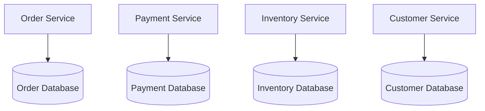

Each service owns its own persistence model.

For example:

| Service           | Owns                                        |
| ----------------- | ------------------------------------------- |
| Order Service     | Orders, order status, order history         |
| Payment Service   | Payments, authorizations, captures, refunds |
| Inventory Service | Stock levels, reservations, availability    |
| Customer Service  | Customer profiles, customer preferences     |
| Shipping Service  | Shipments, tracking, carrier references     |

The central idea is:

> A service owns its data. Other services must not bypass the service and directly manipulate its database.

This is one of the most important foundations of microservice autonomy.

---

#### Why this pattern exists

A common early mistake in microservices is to split the application code into services while keeping one shared database.

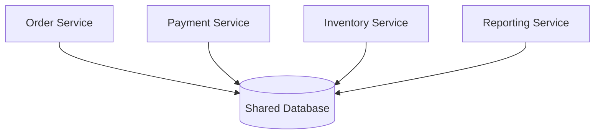

This may look convenient because all services can query the same data. But it creates hidden coupling.

For example, suppose the Payment Service directly reads the `orders` table:

```sql
SELECT id, status, total_amount
FROM orders
WHERE id = 'ord_123';
```

Now the Payment Service depends on the Order Service’s table structure.

If the Order Service team wants to rename `total_amount` to `amount_cents`, split the table, change status values, or move storage technologies, the Payment Service may break.

The database has become a shared contract, even if nobody intended it to be.

Database per Service avoids this by making ownership explicit.

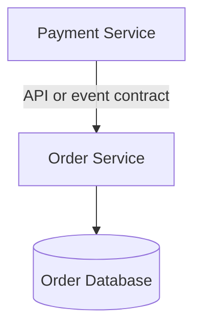

The Payment Service depends on the Order Service’s API or events, not its internal tables.

---

#### What it solves

Database per Service solves **database-level coupling**.

Database-level coupling happens when multiple services depend directly on the same database structures.

Symptoms include:

* one service queries another service’s tables,
* several services write to the same table,
* database migrations require many teams to coordinate,
* table schemas become shared public contracts,
* one service cannot change its schema without breaking others,
* business rules are enforced inconsistently across services,
* ownership of tables is unclear,
* services are independently deployed in name only.

For example, this is database-level coupling:

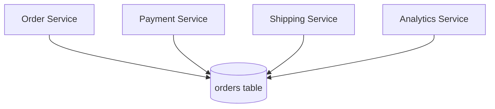

Every service depends on the `orders` table.

A safer design:

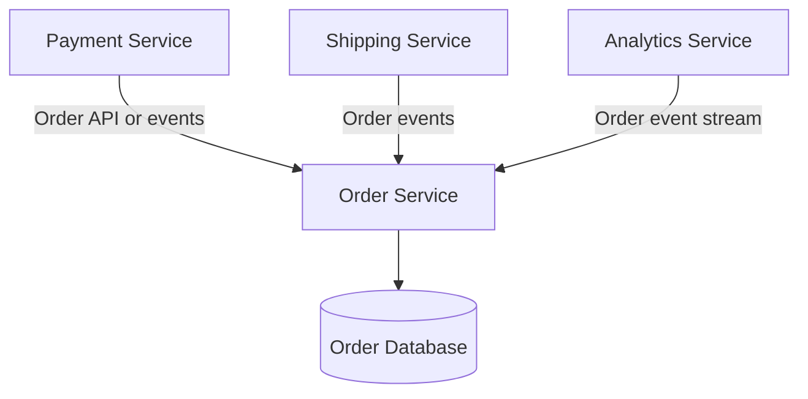

Now the Order Service owns the database. Other services depend on contracts.

---

#### Service ownership and data ownership

Database per Service is not just a storage pattern. It is an ownership pattern.

A service owns:

* the schema,
* the data model,
* the database migrations,
* the constraints,
* the storage technology,
* the read and write access rules,
* the lifecycle of the data,
* the business rules around that data.

For example, the Inventory Service owns inventory reservations.

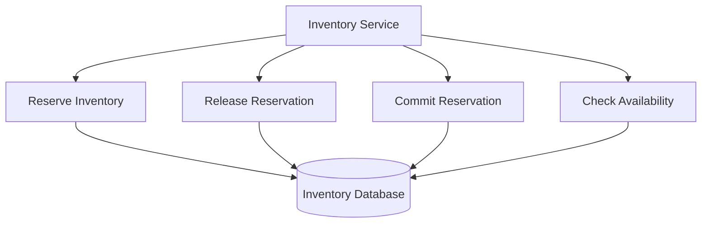

Other services should not directly update inventory tables.

Bad:

```sql
UPDATE inventory
SET available_quantity = available_quantity - 1
WHERE product_id = 'prod_123';
```

If the Order Service runs this SQL directly, it bypasses the Inventory Service’s rules.

Better:

```http
POST /inventory-reservations
Content-Type: application/json

{
  "orderId": "ord_123",
  "items": [
    {
      "productId": "prod_123",
      "quantity": 1
    }
  ]
}
```

The Inventory Service can then enforce its own rules:

* is the product tracked?
* is inventory available?
* is the warehouse active?
* is the item sellable?
* is the reservation duplicate?
* should inventory be reserved from one location or many?

Data ownership keeps those rules in the right place.

---

#### Database per Service does not always mean one physical database server

The phrase “database per service” can be misunderstood.

It does not always mean every service must have its own physical database server.

It means each service has exclusive ownership over its persistence boundary.

Possible implementations include:

##### Separate physical databases

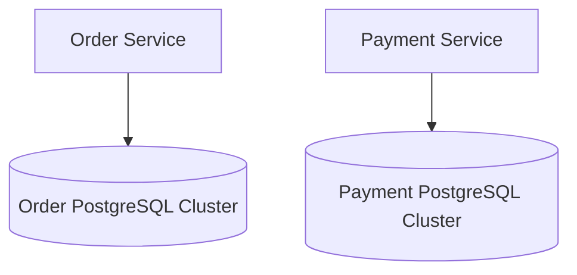

This gives strong isolation.

##### Separate schemas in the same database server

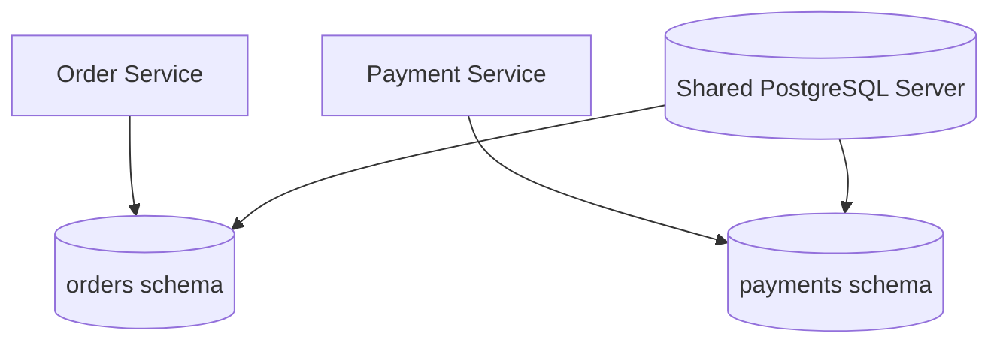

This can be acceptable if access controls prevent cross-service access.

##### Separate tables with strict ownership

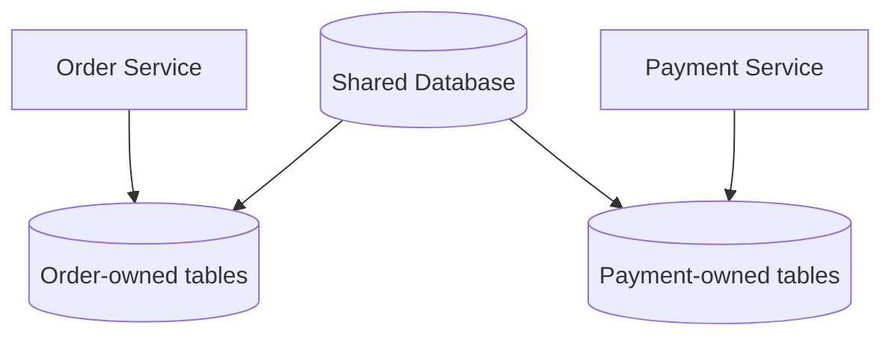

This is weaker isolation, but it can be a transitional step.

The key rule is:

> Ownership matters more than physical deployment. A service’s data should not be directly accessed by other services.

In mature microservice systems, physical separation is often preferred because it enforces ownership more strongly.

---

#### Basic architecture

A service exposes behavior through APIs or messages. The database remains private.

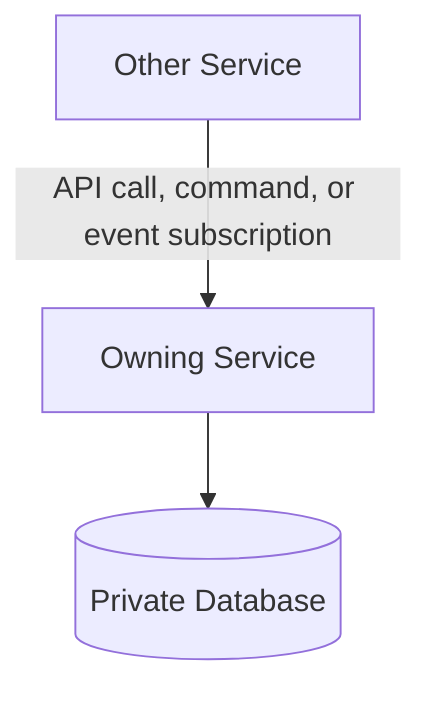

For example:

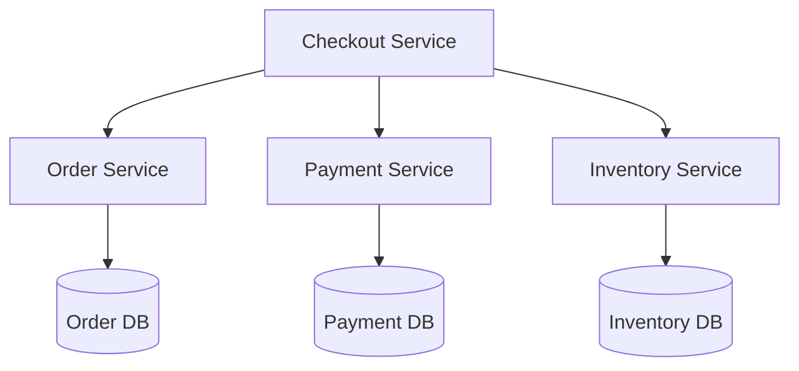

Checkout Service coordinates the workflow, but it does not directly write to the Order, Payment, or Inventory databases.

Each service protects its own data.

---

#### Example: Order Service owns orders

The Order Service might own this internal table:

```sql
CREATE TABLE orders (
    order_id TEXT PRIMARY KEY,
    customer_id TEXT NOT NULL,
    status TEXT NOT NULL,
    total_amount_cents INTEGER NOT NULL,
    currency TEXT NOT NULL,
    created_at TIMESTAMP NOT NULL,
    updated_at TIMESTAMP NOT NULL
);
```

It exposes an API:

```http
GET /orders/ord_123
```

Response:

```json
{
  "orderId": "ord_123",
  "customerId": "cus_456",
  "status": "CONFIRMED",
  "totalAmount": {
    "amount": 129.99,
    "currency": "USD"
  }
}
```

Notice that the API response does not have to match the database schema exactly.

Internally, the database stores `total_amount_cents`.

Externally, the API exposes:

```json
{
  "amount": 129.99,
  "currency": "USD"
}
```

This is good. The service can change its database schema without forcing consumers to change.

---

#### Example: service repository layer

Inside a service, the database is accessed through local persistence code.

```ts
type OrderStatus =
  | "PENDING"
  | "CONFIRMED"
  | "CANCELLED"
  | "SHIPPED";

type Order = {
  orderId: string;
  customerId: string;
  status: OrderStatus;
  totalAmountCents: number;
  currency: string;
};

class OrderRepository {
  constructor(private readonly db: Database) {}

  async findById(orderId: string): Promise<Order | null> {
    const row = await this.db.queryOne(
      `
      SELECT order_id, customer_id, status, total_amount_cents, currency
      FROM orders
      WHERE order_id = $1
      `,
      [orderId]
    );

    if (!row) {
      return null;
    }

    return {
      orderId: row.order_id,
      customerId: row.customer_id,
      status: row.status,
      totalAmountCents: row.total_amount_cents,
      currency: row.currency
    };
  }

  async save(order: Order): Promise<void> {
    await this.db.execute(
      `
      INSERT INTO orders (
        order_id,
        customer_id,
        status,
        total_amount_cents,
        currency
      )
      VALUES ($1, $2, $3, $4, $5)
      ON CONFLICT (order_id)
      DO UPDATE SET
        status = EXCLUDED.status,
        total_amount_cents = EXCLUDED.total_amount_cents
      `,
      [
        order.orderId,
        order.customerId,
        order.status,
        order.totalAmountCents,
        order.currency
      ]
    );
  }
}
```

Only the Order Service uses this repository.

No other service imports it, queries the table, or depends on the table shape.

---

#### Example: API instead of direct database access

Suppose Payment Service needs to know whether an order exists before authorizing payment.

Bad design:

```ts
async function authorizePayment(orderId: string) {
  const order = await sharedDatabase.queryOne(
    "SELECT * FROM orders WHERE order_id = $1",
    [orderId]
  );

  if (!order) {
    throw new Error("Order not found");
  }

  return paymentGateway.authorize(order.total_amount_cents);
}
```

Payment Service is now coupled to the Order database.

Better design:

```ts
async function authorizePayment(orderId: string) {
  const order = await orderClient.getOrder(orderId);

  if (order.status === "CANCELLED") {
    throw new Error("Cannot authorize payment for cancelled order");
  }

  return paymentGateway.authorize({
    orderId: order.orderId,
    amount: order.totalAmount.amount,
    currency: order.totalAmount.currency
  });
}
```

The Payment Service depends on the Order API contract, not the Order database schema.

---

#### Data access rules

A healthy Database per Service design has clear access rules.

| Action                                       | Allowed?    | Why                                   |
| -------------------------------------------- | ----------- | ------------------------------------- |
| Service reads its own tables                 | Yes         | It owns them                          |
| Service writes its own tables                | Yes         | It owns them                          |
| Other service reads owner’s tables directly  | No          | Creates schema coupling               |
| Other service writes owner’s tables directly | Strong no   | Bypasses business rules               |
| Reporting system reads replicated data       | Usually yes | If replicated intentionally           |
| DBA runs emergency query                     | Sometimes   | Operational exception, not app design |
| Data platform ingests change events          | Yes         | If governed as published data         |

The most dangerous violation is cross-service writes.

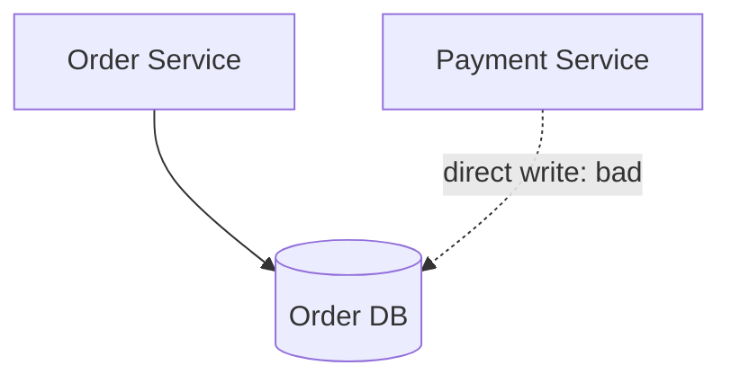

A direct write bypasses invariants and can corrupt business state.

---

#### Polyglot persistence

Database per Service allows each service to choose the storage technology that fits its needs.

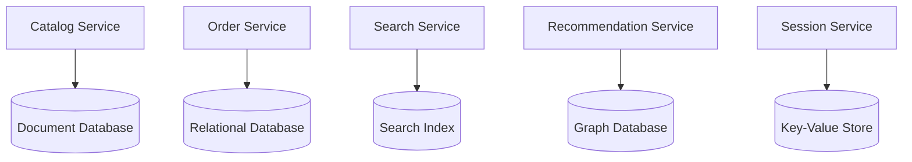

Examples:

| Service                | Possible storage                                  |
| ---------------------- | ------------------------------------------------- |
| Order Service          | Relational database for transactions              |
| Catalog Service        | Document database for flexible product attributes |
| Search Service         | Search index for full-text search                 |
| Recommendation Service | Graph or vector database                          |
| Session Service        | Key-value store                                   |
| Audit Service          | Append-only event store                           |
| Analytics Service      | Columnar warehouse                                |

This is called **polyglot persistence**.

The benefit is that each service can use the right tool.

The trade-off is operational complexity. More database technologies mean more skills, monitoring, backups, security, and failure modes.

---

#### Schema evolution

One major benefit of Database per Service is independent schema evolution.

The Order Service can change its internal schema without requiring every other service to migrate at the same time.

For example, it might split one table:

Before:

```sql
CREATE TABLE orders (
    order_id TEXT PRIMARY KEY,
    customer_id TEXT,
    shipping_address TEXT,
    billing_address TEXT,
    status TEXT
);
```

After:

```sql
CREATE TABLE orders (
    order_id TEXT PRIMARY KEY,
    customer_id TEXT,
    status TEXT
);

CREATE TABLE order_addresses (
    order_id TEXT,
    address_type TEXT,
    address_json JSONB
);
```

If no other service directly queries these tables, the change is internal to the Order Service.

The public API can remain stable:

```json
{
  "orderId": "ord_123",
  "customerId": "cus_456",
  "status": "CONFIRMED",
  "shippingAddress": {
    "line1": "100 Market Street",
    "city": "San Francisco"
  }
}
```

This is exactly the kind of autonomy microservices are supposed to provide.

---

#### Cross-service queries

The biggest challenge with Database per Service is that cross-service queries become harder.

In a shared database, this is easy:

```sql
SELECT
    o.order_id,
    o.status,
    p.status AS payment_status,
    s.status AS shipment_status
FROM orders o
JOIN payments p ON p.order_id = o.order_id
JOIN shipments s ON s.order_id = o.order_id
WHERE o.customer_id = 'cus_123';
```

In Database per Service, those tables live behind different services.

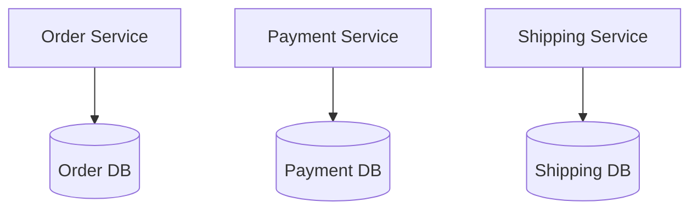

You should not perform a direct database join across service databases.

Instead, use one of these patterns:

1. API composition
2. Gateway aggregation
3. BFF aggregation
4. CQRS read model
5. Event-fed materialized view
6. Data warehouse or analytics platform

---

#### Option 1: API composition

A service or aggregator calls multiple services and combines results.

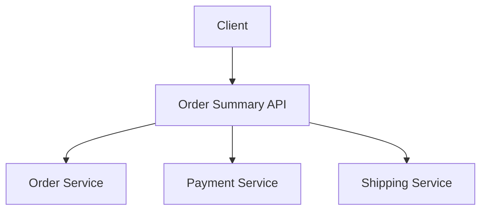

Example:

```ts
async function getOrderSummary(orderId: string): Promise<OrderSummary> {
  const [order, payment, shipment] = await Promise.all([
    orderClient.getOrder(orderId),
    paymentClient.getPaymentByOrderId(orderId),
    shippingClient.getShipmentByOrderId(orderId)
  ]);

  return {
    orderId: order.orderId,
    orderStatus: order.status,
    paymentStatus: payment.status,
    shipmentStatus: shipment.status
  };
}
```

This works well for simple, low-volume reads.

But it can become slow or expensive if the query needs many services or many records.

---

#### Option 2: CQRS read model

For high-volume or complex queries, build a read model.

Services publish events. A projector consumes them and updates a query-optimized database.

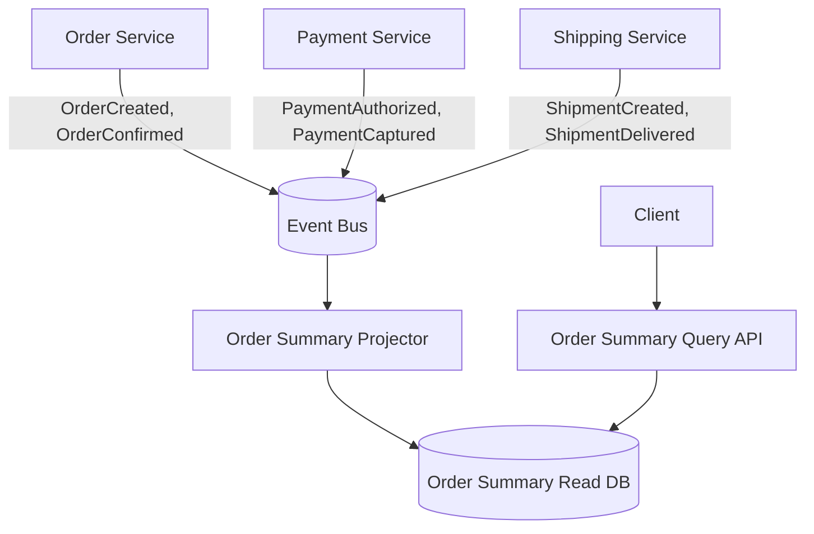

The read model might store:

```json
{
  "orderId": "ord_123",
  "customerId": "cus_456",
  "orderStatus": "CONFIRMED",
  "paymentStatus": "AUTHORIZED",
  "shipmentStatus": "PENDING",
  "totalAmount": 129.99,
  "currency": "USD"
}
```

This avoids runtime joins across service databases.

The trade-off is eventual consistency. The read model may lag behind the source services.

---

#### Cross-service transactions

Database per Service also makes cross-service transactions harder.

For example, placing an order may require:

* create order,
* authorize payment,
* reserve inventory.

In a shared database, you might use one transaction.

In microservices, each service commits locally.

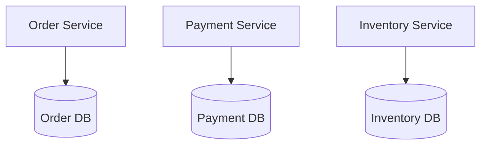

You cannot safely wrap all of these in one ordinary database transaction.

Instead, use patterns such as:

* Saga,
* Async Messaging,
* Outbox Pattern,
* Try-confirm-cancel,
* idempotent commands,
* compensating actions.

Example saga:

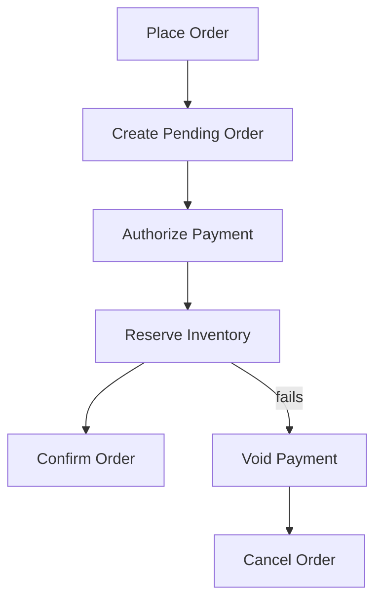

The price of service autonomy is that consistency must be designed explicitly.

---

#### Eventual consistency

Database per Service often leads to eventual consistency.

For example:

1. Order Service creates an order.
2. It publishes `OrderCreated`.
3. Payment Service later authorizes payment.
4. Inventory Service later reserves stock.
5. Order status eventually becomes `CONFIRMED`.

During the workflow, the system may temporarily show:

```json
{
  "orderId": "ord_123",
  "status": "PENDING_PAYMENT"
}
```

Then later:

```json
{
  "orderId": "ord_123",
  "status": "CONFIRMED"
}
```

This is not a bug if the business process is designed for it.

User interfaces and APIs should expose meaningful intermediate states:

* `PENDING`
* `PROCESSING`
* `PENDING_PAYMENT`
* `PENDING_INVENTORY`
* `CONFIRMED`
* `FAILED`
* `CANCELLED`

Do not promise immediate consistency if the architecture cannot provide it.

---

#### Data duplication

Database per Service often requires controlled data duplication.

For example, the Order Service may store a snapshot of customer information at the time of order:

```json
{
  "orderId": "ord_123",
  "customerId": "cus_456",
  "customerSnapshot": {
    "displayName": "Alex Morgan",
    "email": "alex@example.com"
  }
}
```

This is not necessarily bad.

It may be required because an order needs to preserve historical facts.

If the customer later changes their email address, the old order may still need to show the email used at purchase time.

Types of acceptable duplication:

| Duplication type    | Example                       | Why useful                   |
| ------------------- | ----------------------------- | ---------------------------- |
| Historical snapshot | Customer name on order        | Preserves past business fact |
| Read model copy     | Order summary view            | Supports efficient queries   |
| Search index        | Product data in search engine | Supports full-text search    |
| Cache               | Recently viewed product       | Improves performance         |
| Analytics copy      | Event data in warehouse       | Supports reporting           |

The key is to know which copy is authoritative.

---

#### Source of truth

With duplicated data, every field should have a clear source of truth.

For example:

| Data                     | Source of truth                                  |
| ------------------------ | ------------------------------------------------ |
| Current customer profile | Customer Service                                 |
| Order status             | Order Service                                    |
| Payment status           | Payment Service                                  |
| Inventory availability   | Inventory Service                                |
| Shipment tracking        | Shipping Service                                 |
| Product search index     | Derived from Catalog Service                     |
| Order summary read model | Derived from Order, Payment, and Shipping events |

A read model is not usually the source of truth. It is a derived projection.

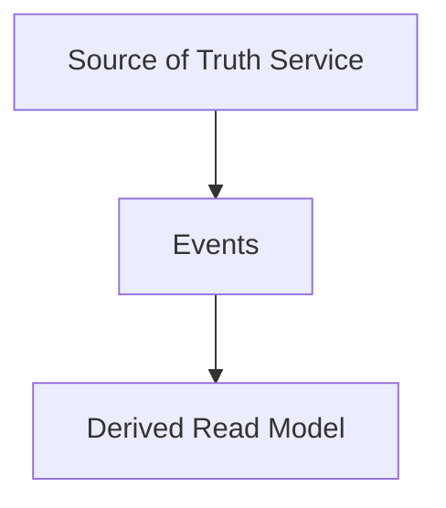

If the projection is wrong, rebuild it from source events or source services.

Do not let derived copies become accidental sources of truth.

---

#### Reporting and analytics

Reporting is a common reason teams violate Database per Service.

A reporting tool may want to query every service database directly.

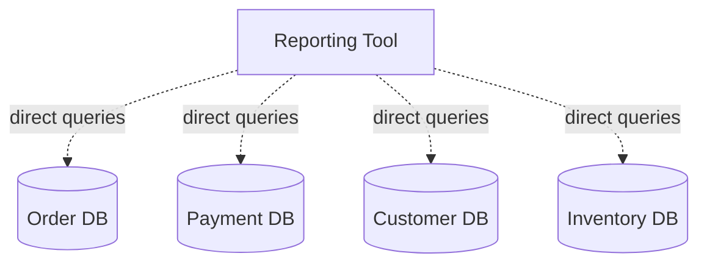

This is tempting, but dangerous.

Problems:

* reporting queries can overload operational databases,
* schema changes break reports,
* sensitive data may leak,
* ownership becomes unclear,
* operational databases become integration points.

A better design publishes data into an analytics platform.

```mermaid
flowchart TD
    OrderService[Order Service]
    PaymentService[Payment Service]
    CustomerService[Customer Service]

    Events[(Event Stream)]
    ETL[ETL or Stream Processor]
    Warehouse[(Data Warehouse)]
    BI[BI and Reporting]

    OrderService --> Events
    PaymentService --> Events
    CustomerService --> Events

    Events --> ETL
    ETL --> Warehouse
    Warehouse --> BI
```

Reporting can then query the warehouse instead of service databases.

---

#### Access control

Database per Service should be enforced with access control.

Each service should have database credentials only for its own database or schema.

Bad:

```text
All services use the same database username and password.
```

Better:

```text
order-service can access order_db only.
payment-service can access payment_db only.
inventory-service can access inventory_db only.
```

```mermaid
flowchart TD
    OrderService[Order Service]
    PaymentService[Payment Service]

    OrderDB[(Order DB)]
    PaymentDB[(Payment DB)]

    OrderService -->|order_db credentials| OrderDB
    PaymentService -->|payment_db credentials| PaymentDB

    OrderService -. no access .-> PaymentDB
    PaymentService -. no access .-> OrderDB
```

If teams can bypass the service boundary easily, they eventually will.

Technical enforcement matters.

---

#### Database migrations

Each service should own its own migrations.

For example, Order Service owns:

```text
order-service/migrations
```

Payment Service owns:

```text
payment-service/migrations
```

A service deployment may include database migration steps.

```mermaid
flowchart TD
    CodeChange[Service Code Change]
    Migration[Database Migration]
    Deploy[Deploy Service]

    CodeChange --> Migration
    Migration --> Deploy
```

Migration safety is important because services are deployed independently.

Use backward-compatible migration practices:

1. Add new nullable column.
2. Deploy code that writes both old and new fields.
3. Backfill data.
4. Deploy code that reads new field.
5. Remove old field later.

Example:

```sql
ALTER TABLE orders ADD COLUMN total_amount_cents INTEGER;
```

Do not immediately remove old fields if old code versions might still be running.

Database per Service reduces cross-team migration coupling, but it does not eliminate migration discipline.

---

#### Shared reference data

Some data is shared across many services, such as:

* country codes,
* currency codes,
* tax categories,
* product categories,
* compliance classifications,
* tenant metadata,
* feature flags.

There are several ways to handle this.

##### Option 1: Dedicated reference data service

```mermaid
flowchart TD
    ReferenceService[Reference Data Service]
    Services[Other Services]

    Services --> ReferenceService
```

Good when the data changes and needs governance.

##### Option 2: Replicated reference data

```mermaid
flowchart TD
    ReferenceService[Reference Data Service]
    Bus[(Event Bus)]

    OrderService[Order Service]
    PaymentService[Payment Service]
    CatalogService[Catalog Service]

    ReferenceService -->|ReferenceDataChanged| Bus

    Bus --> OrderService
    Bus --> PaymentService
    Bus --> CatalogService
```

Good when services need local fast reads.

##### Option 3: Shared library or static config

Good for stable standards, such as ISO currency codes.

Be careful with shared libraries. They should not become a way to distribute frequently changing business rules into every service.

---

#### Shared database as a migration step

Sometimes teams cannot immediately move from a shared database to fully isolated databases.

A transitional architecture may look like this:

```mermaid
flowchart TD
    LegacyDB[(Legacy Shared Database)]

    OrderService[Order Service]
    PaymentService[Payment Service]
    InventoryService[Inventory Service]

    OrderTables[(Order-owned tables)]
    PaymentTables[(Payment-owned tables)]
    InventoryTables[(Inventory-owned tables)]

    LegacyDB --> OrderTables
    LegacyDB --> PaymentTables
    LegacyDB --> InventoryTables

    OrderService --> OrderTables
    PaymentService --> PaymentTables
    InventoryService --> InventoryTables
```

This is not ideal, but it may be a practical intermediate stage.

Rules for a transitional shared database:

* define table ownership,
* prevent cross-service writes,
* restrict credentials by schema or table,
* publish APIs for owned data,
* gradually remove direct reads,
* build read models for reporting,
* migrate high-change services first,
* track violations.

The goal should be movement toward clear ownership, not permanent shared-database coupling.

---

#### Anti-pattern: shared database integration

The worst version is when services integrate through database tables.

```mermaid
flowchart TD
    ServiceA[Service A]
    SharedDB[(Shared Database)]
    ServiceB[Service B]

    ServiceA -->|writes table| SharedDB
    ServiceB -->|polls or reads table| SharedDB
```

This is sometimes called database integration.

Problems:

* no clear API contract,
* schema changes break consumers,
* consumers may read partial or invalid state,
* business rules are bypassed,
* ownership is unclear,
* database becomes the integration layer,
* services are not truly independent.

If services need to communicate, use APIs, events, or messages.

---

#### Anti-pattern: one service updates another service’s tables

This is even worse than direct reads.

```mermaid
flowchart TD
    OrderService[Order Service]
    PaymentDB[(Payment DB)]

    OrderService -. direct update: bad .-> PaymentDB
```

Example:

```sql
UPDATE payments
SET status = 'VOIDED'
WHERE order_id = 'ord_123';
```

This bypasses Payment Service.

Payment Service may need to:

* call a payment gateway,
* create audit records,
* enforce valid state transitions,
* publish `PaymentVoided`,
* update reconciliation records,
* prevent duplicate voids.

A direct database update skips all of that.

Correct approach:

```http
POST /payment-authorizations/pay_123/void
```

Let the Payment Service own payment behavior.

---

#### Handling joins inside a service

Database per Service does not mean a service cannot use joins internally.

Inside one service boundary, joins are fine.

For example, Order Service can join its own order tables:

```sql
SELECT
    o.order_id,
    o.status,
    oi.product_id,
    oi.quantity
FROM orders o
JOIN order_items oi ON oi.order_id = o.order_id
WHERE o.order_id = 'ord_123';
```

That is internal to the Order Service.

The rule is:

> Join freely within your service’s data boundary. Do not join across service ownership boundaries.

---

#### Data consistency models

Database per Service requires choosing the right consistency model.

Common models:

| Model                    | Description                          | Example                                       |
| ------------------------ | ------------------------------------ | --------------------------------------------- |
| Strong local consistency | Within one service database          | Order state transition                        |
| Eventual consistency     | Across services                      | Payment status appears after event processing |
| Read-your-writes         | User sees their own submitted update | Profile update confirmation                   |
| Snapshot consistency     | Read model shows a known version     | Dashboard projection                          |
| Best-effort consistency  | Non-critical derived data            | Recommendations                               |

Not all data needs the same consistency.

For example:

* Payment capture should be strongly controlled by Payment Service.
* Search index can be eventually consistent.
* Analytics can lag by minutes.
* Inventory availability may need near-real-time consistency.
* Recommendations can tolerate stale data.

Design consistency based on business needs, not technical preference.

---

#### Example: eventual consistency with events

Suppose Catalog Service owns product data and Search Service owns a search index.

```mermaid
flowchart TD
    CatalogService[Catalog Service]
    CatalogDB[(Catalog DB)]

    Bus[(Event Bus)]

    SearchIndexer[Search Indexer]
    SearchIndex[(Search Index)]

    CatalogService --> CatalogDB
    CatalogService -->|ProductUpdated| Bus

    Bus --> SearchIndexer
    SearchIndexer --> SearchIndex
```

When a product is updated:

1. Catalog Service updates Catalog DB.
2. Catalog Service publishes `ProductUpdated`.
3. Search Indexer consumes the event.
4. Search Index is updated.

For a short time, search results may show old data.

That is eventual consistency.

This is usually acceptable for search.

It may not be acceptable for payment authorization.

---

#### Handling stale reads

Because derived data can be stale, APIs should sometimes expose freshness metadata.

Example:

```json
{
  "orderId": "ord_123",
  "orderStatus": "CONFIRMED",
  "paymentStatus": "AUTHORIZED",
  "shipmentStatus": "PENDING",
  "lastUpdatedAt": "2026-04-29T12:00:00Z",
  "projectionLagMs": 450
}
```

For operational dashboards, freshness matters.

For user-facing screens, you might show:

```text
Updated a few seconds ago
```

or:

```text
Your order is still processing. Check back shortly.
```

A good user experience acknowledges eventual consistency instead of hiding it.

---

#### Data ownership and APIs

When another service needs data, ask:

> Does it need current data, historical data, or a local copy?

Different answers imply different designs.

| Need                       | Better approach                  |
| -------------------------- | -------------------------------- |
| Current authoritative data | Call owning service API          |
| Historical fact            | Store snapshot when event occurs |
| High-volume read           | Build read model                 |
| Search                     | Maintain search index            |
| Analytics                  | Publish to warehouse             |
| Workflow reaction          | Subscribe to event               |
| Local validation           | Replicate small reference data   |

Do not default to direct database reads.

---

#### Example decision: should Payment Service store order amount?

Payment Service needs to authorize a payment for an order amount.

Should it query the Order database every time?

No.

Better options:

1. Order Service sends amount in a payment command.
2. Payment Service stores payment amount locally.
3. Payment Service treats that amount as the payment transaction’s own record.

```json
{
  "commandType": "AuthorizePayment",
  "data": {
    "orderId": "ord_123",
    "amount": 129.99,
    "currency": "USD"
  }
}
```

Payment Service can store:

```sql
CREATE TABLE payment_authorizations (
    payment_id TEXT PRIMARY KEY,
    order_id TEXT NOT NULL,
    amount_cents INTEGER NOT NULL,
    currency TEXT NOT NULL,
    status TEXT NOT NULL
);
```

This is not bad duplication. It is Payment Service recording the amount it was asked to authorize.

---

#### Data privacy and compliance

Database per Service can improve privacy boundaries.

For example, Payment Service may own sensitive payment data.

```mermaid
flowchart TD
    PaymentService[Payment Service]
    PaymentDB[(Payment DB with Sensitive Data)]

    OrderService[Order Service]
    AnalyticsService[Analytics Service]

    PaymentService --> PaymentDB

    OrderService -->|Payment status only| PaymentService
    AnalyticsService -->|Aggregated events only| PaymentService
```

Other services should not directly query payment tables.

This helps enforce:

* least privilege,
* data minimization,
* auditability,
* access control,
* compliance boundaries.

A service can expose only what others need.

For example, Order Service may need:

```json
{
  "paymentStatus": "AUTHORIZED"
}
```

It does not need card tokens, gateway references, fraud details, or bank response payloads.

---

#### Operational implications

Database per Service creates operational responsibilities.

Each service team may need to own:

* database migrations,
* backups,
* restore testing,
* monitoring,
* indexes,
* query performance,
* capacity planning,
* security permissions,
* encryption settings,
* retention policies,
* data deletion workflows,
* schema documentation.

This is a trade-off.

In a monolith, a central database team may handle much of this.

In microservices, teams need enough database ownership maturity to operate their own persistence safely.

---

#### Backup and restore

Each service database needs backup and restore planning.

Questions:

* How often are backups taken?
* How long are backups retained?
* Can the service restore independently?
* What is the recovery point objective?
* What is the recovery time objective?
* Are events needed to rebuild derived data?
* Are read models rebuildable?
* Is sensitive data encrypted in backups?

A derived read model may not need the same backup strategy as a source-of-truth database if it can be rebuilt from events.

```mermaid
flowchart TD
    Events[(Event Stream)]
    Projector[Projector]
    ReadModel[(Read Model)]

    Events --> Projector
    Projector --> ReadModel

    Rebuild[Rebuild if lost]
    Events --> Rebuild
    Rebuild --> ReadModel
```

Source-of-truth databases need stronger backup and recovery guarantees.

---

#### When to use it

Use Database per Service when:

* services need independent deployment,
* services need independent schema evolution,
* teams own different business capabilities,
* services have different scaling needs,
* data ownership boundaries are clear,
* direct database sharing is slowing change,
* services require different storage technologies,
* security or compliance requires data isolation,
* you want to avoid hidden coupling through tables.

It is especially important when services are owned by different teams and expected to evolve independently.

---

#### When not to use it

Avoid or delay Database per Service when:

* the system is small and one team owns everything,
* service boundaries are unclear,
* most operations require strong consistency across all data,
* the team cannot handle distributed consistency,
* reporting depends heavily on ad hoc joins and no data platform exists,
* operational maturity is low,
* a modular monolith would provide enough separation,
* splitting the database would add complexity without real autonomy.

For many systems, a modular monolith with clear module boundaries is a better first step than prematurely splitting databases.

```mermaid
flowchart TD
    ModularMonolith[Modular Monolith]

    OrderModule[Order Module]
    PaymentModule[Payment Module]
    InventoryModule[Inventory Module]

    SharedDB[(Single Database with Module-Owned Tables)]

    ModularMonolith --> OrderModule
    ModularMonolith --> PaymentModule
    ModularMonolith --> InventoryModule

    OrderModule --> SharedDB
    PaymentModule --> SharedDB
    InventoryModule --> SharedDB
```

The important thing is clear ownership. Physical separation can come later if needed.

---

#### Benefits

**1. Service autonomy**

Each service can evolve its schema without coordinating with every other service.

**2. Clear ownership**

Teams know which service owns which data.

**3. Independent deployment**

Database migrations are scoped to the owning service.

**4. Better encapsulation**

Internal tables are not public contracts.

**5. Polyglot persistence**

Services can choose storage technologies that fit their needs.

**6. Improved fault isolation**

A database issue in one service may be contained better than in a shared database.

**7. Stronger security boundaries**

Sensitive data can be isolated behind the owning service.

**8. Reduced accidental coupling**

Services communicate through APIs and events instead of shared tables.

---

#### Trade-offs

**1. Cross-service queries are harder**

You cannot simply join tables across services.

**2. Distributed transactions are harder**

Workflows across services need sagas, compensation, or eventual consistency.

**3. More operational overhead**

More databases mean more migrations, backups, monitoring, and security policies.

**4. Data duplication increases**

Read models, caches, indexes, and snapshots often duplicate data intentionally.

**5. Eventual consistency becomes common**

Derived data may lag behind source-of-truth data.

**6. Reporting requires new architecture**

Analytics usually needs event pipelines, ETL, or a warehouse.

**7. Debugging can be harder**

A business entity may be represented across multiple services.

**8. Boundary mistakes are expensive**

If services are split poorly, data ownership becomes awkward and chatty.

---

#### Common mistakes

**Mistake 1: Splitting services but keeping a shared database**

This creates distributed code with monolithic data coupling.

**Mistake 2: Allowing cross-service writes**

Other services should not update tables they do not own.

**Mistake 3: Treating database tables as integration contracts**

Use APIs, events, or published data products instead.

**Mistake 4: Ignoring cross-service query needs**

Plan read models, aggregation, or analytics pipelines.

**Mistake 5: Expecting ACID transactions across services**

Use Saga or other consistency patterns when workflows span services.

**Mistake 6: Duplicating data without defining source of truth**

Every duplicated field needs an owner.

**Mistake 7: Choosing too many database technologies too early**

Polyglot persistence is useful, but operational complexity grows quickly.

**Mistake 8: No access control enforcement**

If every service can still connect to every database, the boundary is only theoretical.

**Mistake 9: Reporting directly from operational databases**

Use replicated data, events, or a warehouse for reporting.

---

#### Practical design checklist

Before applying Database per Service, ask:

* Which service owns this data?
* Who owns the schema?
* Who owns migrations?
* Which service is allowed to write this data?
* Which service is allowed to read this data directly?
* What API exposes this data?
* What events publish changes to this data?
* Which consumers need a copy?
* Is that copy authoritative or derived?
* How will cross-service queries be handled?
* Is a read model needed?
* Is a search index needed?
* Is an analytics pipeline needed?
* What consistency does the business require?
* Is eventual consistency acceptable?
* What happens if a downstream projection lags?
* Are cross-service transactions needed?
* Should a saga be used?
* Are database credentials scoped correctly?
* How are backups handled?
* How are data retention and deletion handled?
* Does this split improve autonomy enough to justify the complexity?

A Database per Service design is probably healthy if:

* ownership is clear,
* direct cross-service database access is blocked,
* APIs and events are well defined,
* duplicated data has clear source of truth,
* cross-service queries are handled deliberately,
* consistency expectations are explicit,
* service teams can operate their databases,
* schema changes can happen independently.

A design is probably unhealthy if:

* services share tables freely,
* multiple services write the same records,
* reporting depends on direct operational joins,
* no one knows which service owns a field,
* cross-service workflows expect one global transaction,
* data is duplicated without ownership,
* every query requires many synchronous service calls,
* database permissions do not enforce boundaries.

---

#### Related patterns

| Pattern                   | Relationship                                                      |
| ------------------------- | ----------------------------------------------------------------- |
| Saga Pattern              | Coordinates workflows across services with separate databases     |
| Async Messaging           | Publishes changes between services without direct database access |
| Outbox Pattern            | Reliably publishes events after local database transactions       |
| CQRS                      | Builds read models for cross-service queries                      |
| Event Sourcing            | Stores state as events owned by a service                         |
| API Composition           | Combines data from multiple services at request time              |
| Gateway Aggregation       | Client-facing form of API composition                             |
| Choreography              | Services react to events from other services                      |
| Consumer-Driven Contracts | Protects APIs and event schemas between services                  |
| Anti-Corruption Layer     | Protects a service model from external data models                |
| Strangler Fig Pattern     | Helps migrate from shared legacy databases to service-owned data  |

---

#### Summary

Database per Service means each service owns its own database, schema, or persistence boundary. Other services access that data through APIs, events, messages, or derived read models rather than direct database queries.

The central idea is:

> Services should not be coupled through tables. They should communicate through explicit contracts.

This pattern enables service autonomy, independent schema evolution, clearer ownership, better encapsulation, and polyglot persistence.

The trade-off is that cross-service queries and transactions become harder. You need patterns such as API composition, CQRS, read models, Saga, Async Messaging, and Outbox to handle distributed data correctly.

Used well, Database per Service is one of the core patterns that makes microservices truly independent. Used poorly, it can create scattered data, inconsistent copies, and difficult reporting. The difference is disciplined ownership, explicit contracts, and intentional consistency design.


---

### 22. Shared Database

#### What it is

**Shared Database** is a persistence pattern where multiple services use the same physical database, database instance, or database cluster.

In the simplest form, several services connect to one database:

```mermaid
flowchart TD
    OrderService[Order Service]
    PaymentService[Payment Service]
    InventoryService[Inventory Service]
    ReportingService[Reporting Service]

    SharedDB[(Shared Database)]

    OrderService --> SharedDB
    PaymentService --> SharedDB
    InventoryService --> SharedDB
    ReportingService --> SharedDB
```

This is different from **Database per Service**, where every service owns a private persistence boundary.

A shared database can appear in several forms:

| Form                                      | Description                                                                  |
| ----------------------------------------- | ---------------------------------------------------------------------------- |
| Same database, same tables                | Multiple services read and write the same tables                             |
| Same database, separate schemas           | Services share the same database instance but own different schemas          |
| Same database cluster, separate databases | Services use the same database server or cluster but have separate databases |
| Shared legacy database                    | New services connect to a database originally created for a monolith         |
| Shared reporting database                 | Multiple services publish or replicate data into one shared read store       |

The most dangerous version is when multiple services freely read and write the same tables.

```mermaid
flowchart TD
    OrderService[Order Service]
    PaymentService[Payment Service]
    ShippingService[Shipping Service]

    OrdersTable[(orders table)]

    OrderService --> OrdersTable
    PaymentService --> OrdersTable
    ShippingService --> OrdersTable
```

The safer version is when services share infrastructure but ownership is still separated.

```mermaid
flowchart TD
    SharedDatabaseInstance[(Shared Database Instance)]

    OrderSchema[(order_service schema)]
    PaymentSchema[(payment_service schema)]
    InventorySchema[(inventory_service schema)]

    OrderService[Order Service]
    PaymentService[Payment Service]
    InventoryService[Inventory Service]

    SharedDatabaseInstance --> OrderSchema
    SharedDatabaseInstance --> PaymentSchema
    SharedDatabaseInstance --> InventorySchema

    OrderService --> OrderSchema
    PaymentService --> PaymentSchema
    InventoryService --> InventorySchema
```

The central idea is:

> Sharing database infrastructure can be useful, but sharing data ownership is dangerous.

A shared database is sometimes a practical compromise. It should be used deliberately, with clear ownership rules.

---

#### Why this pattern exists

Shared Database exists because real systems often cannot move directly from a monolith to perfect service-owned databases.

A legacy monolith may already have one large database:

```mermaid
flowchart TD
    Monolith[Legacy Monolith]
    LegacyDB[(Legacy Database)]

    Monolith --> LegacyDB
```

During migration, teams may start extracting services while the old database still contains the business data.

```mermaid
flowchart TD
    Monolith[Legacy Monolith]
    OrderService[New Order Service]
    CustomerService[New Customer Service]

    LegacyDB[(Legacy Database)]

    Monolith --> LegacyDB
    OrderService --> LegacyDB
    CustomerService --> LegacyDB
```

This can be a useful intermediate step because it lets teams extract behavior before fully separating data.

Shared databases also appear in smaller systems where the cost of operating many databases is not justified yet.

For example, one team may own all services, the system is small, and all services are deployed together.

```mermaid
flowchart TD
    APIService[API Service]
    WorkerService[Worker Service]
    AdminService[Admin Service]

    SharedDB[(Application Database)]

    APIService --> SharedDB
    WorkerService --> SharedDB
    AdminService --> SharedDB
```

This can be reasonable if the services are not truly independent yet.

The danger is when the shared database remains after services are expected to evolve independently.

---

#### What it solves

Shared Database solves several short-term problems.

**1. It reduces operational complexity**

One database is easier to operate than many databases.

There may be fewer:

* database clusters,
* backups,
* monitoring dashboards,
* replication setups,
* credentials,
* migrations,
* restore procedures,
* database technologies.

**2. It simplifies cross-data queries**

Joining data is easy when all tables are in one database:

```sql
SELECT
    o.order_id,
    o.status AS order_status,
    p.status AS payment_status,
    s.status AS shipment_status
FROM orders o
JOIN payments p ON p.order_id = o.order_id
JOIN shipments s ON s.order_id = o.order_id
WHERE o.customer_id = 'cus_123';
```

This is much harder when Order, Payment, and Shipping data are owned by separate services.

**3. It supports gradual migration**

During monolith extraction, direct database access may allow a new service to work before full ownership boundaries are established.

**4. It can reduce duplication**

A shared database can avoid creating read models, event projections, and duplicated snapshots early in a system’s life.

**5. It can make reporting easier**

Reporting tools can query one database instead of combining data from many services.

These are real benefits. The pattern exists because it is sometimes practical.

But the trade-off is coupling.

---

#### The main risk: database-level coupling

The biggest problem with a shared database is that services can become coupled through tables instead of explicit contracts.

```mermaid
flowchart TD
    OrderService[Order Service]
    PaymentService[Payment Service]
    InventoryService[Inventory Service]

    SharedDB[(Shared Database)]

    OrdersTable[(orders)]
    PaymentsTable[(payments)]
    InventoryTable[(inventory)]

    SharedDB --> OrdersTable
    SharedDB --> PaymentsTable
    SharedDB --> InventoryTable

    OrderService --> OrdersTable
    PaymentService --> OrdersTable
    PaymentService --> PaymentsTable
    InventoryService --> OrdersTable
    InventoryService --> InventoryTable
```

In this design, the `orders` table is effectively a public API.

If Order Service changes the table, it may break Payment Service or Inventory Service.

For example, this change may seem internal:

```sql
ALTER TABLE orders RENAME COLUMN total_amount TO total_amount_cents;
```

But if another service has this query:

```sql
SELECT total_amount
FROM orders
WHERE order_id = 'ord_123';
```

that service breaks.

The problem is not just the physical database. The problem is that services now depend on each other’s internal data structures.

---

#### Shared database vs shared schema ownership

A shared database is not always equally dangerous.

There is a spectrum.

##### High-risk shared ownership

Multiple services read and write the same tables.

```mermaid
flowchart TD
    ServiceA[Service A]
    ServiceB[Service B]
    ServiceC[Service C]

    SharedTable[(shared table)]

    ServiceA --> SharedTable
    ServiceB --> SharedTable
    ServiceC --> SharedTable
```

This creates strong coupling and unclear ownership.

##### Medium-risk shared database with table ownership

Services share one database, but each table has an owner.

```mermaid
flowchart TD
    SharedDB[(Shared Database)]

    OrderTables[(Order-owned tables)]
    PaymentTables[(Payment-owned tables)]
    InventoryTables[(Inventory-owned tables)]

    OrderService[Order Service]
    PaymentService[Payment Service]
    InventoryService[Inventory Service]

    SharedDB --> OrderTables
    SharedDB --> PaymentTables
    SharedDB --> InventoryTables

    OrderService --> OrderTables
    PaymentService --> PaymentTables
    InventoryService --> InventoryTables
```

This is better, but still risky if access control is not enforced.

##### Lower-risk shared infrastructure

Services share a database server or cluster, but each service owns a separate database or schema.

```mermaid
flowchart TD
    DatabaseCluster[(Database Cluster)]

    OrderDB[(Order Database)]
    PaymentDB[(Payment Database)]
    InventoryDB[(Inventory Database)]

    OrderService[Order Service]
    PaymentService[Payment Service]
    InventoryService[Inventory Service]

    DatabaseCluster --> OrderDB
    DatabaseCluster --> PaymentDB
    DatabaseCluster --> InventoryDB

    OrderService --> OrderDB
    PaymentService --> PaymentDB
    InventoryService --> InventoryDB
```

This reduces operational overhead while preserving stronger ownership boundaries.

When people say “shared database,” always clarify which version they mean.

---

#### When a shared database is a reasonable compromise

A shared database can be reasonable when it is used intentionally and temporarily.

Good situations include:

* early-stage systems,
* small teams,
* modular monoliths,
* monolith migration,
* reporting databases,
* transitional Strangler Fig migration,
* low-risk internal tools,
* services that are deployed together,
* services owned by one team with no need for independent schema evolution.

For example, during monolith migration:

```mermaid
flowchart TD
    Client[Client]
    Router[Router or API Gateway]

    Monolith[Legacy Monolith]
    NewCatalog[New Catalog Service]

    LegacyDB[(Legacy Database)]

    Client --> Router

    Router -->|unmigrated routes| Monolith
    Router -->|catalog routes| NewCatalog

    Monolith --> LegacyDB
    NewCatalog --> LegacyDB
```

This may be acceptable as a migration step.

But the target state should be clearer ownership:

```mermaid
flowchart TD
    Client[Client]
    Router[Router or API Gateway]

    Monolith[Legacy Monolith]
    CatalogService[Catalog Service]

    LegacyDB[(Legacy Database)]
    CatalogDB[(Catalog Database)]

    Client --> Router

    Router --> Monolith
    Router --> CatalogService

    Monolith --> LegacyDB
    CatalogService --> CatalogDB
```

The shared database is the bridge, not the destination.

---

#### When a shared database becomes an anti-pattern

A shared database becomes an anti-pattern when services are supposed to be independent but remain coupled through database tables.

Warning signs:

* multiple services write the same table,
* no one knows which service owns a table,
* schema changes require many teams to coordinate,
* business rules are implemented in stored procedures used by several services,
* one service bypasses another service’s validation logic by writing directly to its tables,
* services cannot be deployed independently because of database dependencies,
* table columns become de facto public API fields,
* reporting queries overload production tables,
* teams are afraid to change schemas,
* the database becomes the integration layer.

This design may look like microservices, but the shared database acts like a monolithic core.

```mermaid
flowchart TD
    ServiceA[Service A]
    ServiceB[Service B]
    ServiceC[Service C]
    ServiceD[Service D]

    SharedDB[(Shared Database<br/>hidden monolith)]

    ServiceA --> SharedDB
    ServiceB --> SharedDB
    ServiceC --> SharedDB
    ServiceD --> SharedDB
```

The services are physically separate, but logically coupled.

---

#### Example: dangerous shared write access

Suppose Order Service owns order lifecycle.

Order Service expects valid transitions:

```text
PENDING -> CONFIRMED -> SHIPPED -> DELIVERED
PENDING -> CANCELLED
CONFIRMED -> CANCELLED
```

But Payment Service directly updates the `orders` table:

```sql
UPDATE orders
SET status = 'CONFIRMED'
WHERE order_id = 'ord_123';
```

This bypasses Order Service.

Order Service may normally do additional work when confirming an order:

* validate current state,
* record an audit entry,
* publish `OrderConfirmed`,
* update order history,
* enforce fraud checks,
* verify inventory reservation,
* notify downstream services.

A direct table update skips all of that.

Better:

```http
POST /orders/ord_123/confirm
Content-Type: application/json

{
  "paymentId": "pay_456",
  "inventoryReservationId": "res_789"
}
```

Then Order Service owns the transition.

The database table should not be the command interface.

---

#### Example: acceptable read-only reporting copy

A shared database can be acceptable when it is a derived reporting database, not an operational database.

```mermaid
flowchart TD
    OrderService[Order Service]
    PaymentService[Payment Service]
    ShippingService[Shipping Service]

    EventBus[(Event Bus)]

    ReportingProjector[Reporting Projector]
    ReportingDB[(Shared Reporting Database)]

    BI[BI Tool]
    FinanceReports[Finance Reports]
    OpsDashboard[Ops Dashboard]

    OrderService -->|Order events| EventBus
    PaymentService -->|Payment events| EventBus
    ShippingService -->|Shipping events| EventBus

    EventBus --> ReportingProjector
    ReportingProjector --> ReportingDB

    BI --> ReportingDB
    FinanceReports --> ReportingDB
    OpsDashboard --> ReportingDB
```

In this design:

* service databases remain private,
* reporting queries do not hit operational databases,
* the reporting database is derived,
* the source of truth remains with the owning services.

This is different from multiple services directly sharing operational tables.

---

#### Example: shared database with schema ownership

A controlled compromise is to share one database instance but separate schemas by service.

```sql
CREATE SCHEMA order_service;
CREATE SCHEMA payment_service;
CREATE SCHEMA inventory_service;
```

Order Service tables:

```sql
CREATE TABLE order_service.orders (
    order_id TEXT PRIMARY KEY,
    customer_id TEXT NOT NULL,
    status TEXT NOT NULL,
    total_amount_cents INTEGER NOT NULL,
    currency TEXT NOT NULL
);
```

Payment Service tables:

```sql
CREATE TABLE payment_service.payment_authorizations (
    payment_id TEXT PRIMARY KEY,
    order_id TEXT NOT NULL,
    amount_cents INTEGER NOT NULL,
    currency TEXT NOT NULL,
    status TEXT NOT NULL
);
```

Inventory Service tables:

```sql
CREATE TABLE inventory_service.inventory_reservations (
    reservation_id TEXT PRIMARY KEY,
    order_id TEXT NOT NULL,
    product_id TEXT NOT NULL,
    quantity INTEGER NOT NULL,
    status TEXT NOT NULL
);
```

Then enforce credentials:

```text
order_service_user can access order_service schema only.
payment_service_user can access payment_service schema only.
inventory_service_user can access inventory_service schema only.
```

This allows shared database infrastructure while still enforcing data ownership.

The important part is not just naming schemas. It is preventing cross-service access.

---

#### Access control is critical

If a shared database is used, access control must enforce ownership.

Bad:

```text
Every service uses the same database username and password.
```

Better:

```text
Order Service uses order_service_user.
Payment Service uses payment_service_user.
Inventory Service uses inventory_service_user.
```

```mermaid
flowchart TD
    OrderService[Order Service]
    PaymentService[Payment Service]

    OrderSchema[(order_service schema)]
    PaymentSchema[(payment_service schema)]

    OrderService -->|allowed| OrderSchema
    PaymentService -->|allowed| PaymentSchema

    OrderService -. denied .-> PaymentSchema
    PaymentService -. denied .-> OrderSchema
```

Database permissions can prevent accidental boundary violations.

Example:

```sql
GRANT SELECT, INSERT, UPDATE, DELETE
ON ALL TABLES IN SCHEMA order_service
TO order_service_user;

REVOKE ALL
ON ALL TABLES IN SCHEMA order_service
FROM payment_service_user;
```

A boundary that exists only in documentation is weak. A boundary enforced by credentials is much stronger.

---

#### Stored procedures and triggers

Shared databases often accumulate stored procedures, triggers, and database-level business logic.

For example:

```sql
CREATE TRIGGER update_order_status_after_payment
AFTER INSERT ON payments
FOR EACH ROW
EXECUTE FUNCTION confirm_order_if_paid();
```

This may seem convenient, but it can hide business behavior inside the database.

Problems:

* business rules are no longer owned by a service,
* behavior is harder to test with service code,
* deployments require database coordination,
* multiple services may depend on hidden side effects,
* debugging becomes harder,
* local development environments become harder to reproduce.

This does not mean stored procedures are always bad. They can be useful for local data integrity or performance-sensitive operations inside a service boundary.

But be careful when database logic coordinates behavior across service boundaries.

```mermaid
flowchart TD
    PaymentService[Payment Service]
    SharedDB[(Shared Database)]

    Trigger[Database Trigger<br/>updates order status]
    OrderService[Order Service]

    PaymentService --> SharedDB
    SharedDB --> Trigger
    Trigger -. hidden behavior .-> OrderService
```

If the business behavior belongs to Order Service, put it in Order Service.

---

#### Reporting and joins

One of the biggest benefits of a shared database is easy reporting.

For example:

```sql
SELECT
    c.customer_id,
    c.email,
    COUNT(o.order_id) AS order_count,
    SUM(o.total_amount_cents) AS lifetime_value_cents
FROM customers c
JOIN orders o ON o.customer_id = c.customer_id
GROUP BY c.customer_id, c.email;
```

This is simple and powerful.

But using the operational shared database for reporting has risks:

* long queries can slow down production traffic,
* reports depend on internal schemas,
* schema changes break reports,
* sensitive data may be exposed,
* reporting teams may create unofficial business definitions,
* indexes added for reports may affect write performance.

A better long-term approach is often a separate reporting store:

```mermaid
flowchart TD
    OperationalDB[(Operational Shared DB)]
    CDC[Change Data Capture]
    ReportingDB[(Reporting DB)]
    BI[BI Tool]

    OperationalDB --> CDC
    CDC --> ReportingDB
    BI --> ReportingDB
```

Or event-based reporting:

```mermaid
flowchart TD
    Services[Services]
    EventStream[(Event Stream)]
    Warehouse[(Data Warehouse)]
    Reports[Reports]

    Services --> EventStream
    EventStream --> Warehouse
    Reports --> Warehouse
```

This keeps heavy reporting away from operational workloads.

---

#### Shared database during Strangler Fig migration

Shared Database is common during Strangler Fig migrations.

At first, the monolith owns everything:

```mermaid
flowchart TD
    Client[Client]
    Monolith[Monolith]
    DB[(Monolith Database)]

    Client --> Monolith
    Monolith --> DB
```

Then a new service is extracted but still reads the old database:

```mermaid
flowchart TD
    Client[Client]
    Gateway[Gateway]

    Monolith[Monolith]
    CatalogService[Catalog Service]

    DB[(Monolith Database)]

    Client --> Gateway

    Gateway --> Monolith
    Gateway --> CatalogService

    Monolith --> DB
    CatalogService --> DB
```

Then the service starts owning its own database:

```mermaid
flowchart TD
    Client[Client]
    Gateway[Gateway]

    Monolith[Monolith]
    CatalogService[Catalog Service]

    LegacyDB[(Legacy Database)]
    CatalogDB[(Catalog Database)]

    Client --> Gateway

    Gateway --> Monolith
    Gateway --> CatalogService

    Monolith --> LegacyDB
    CatalogService --> CatalogDB
```

Finally, the monolith stops owning that capability:

```mermaid
flowchart TD
    Client[Client]
    Gateway[Gateway]

    CatalogService[Catalog Service]
    CatalogDB[(Catalog Database)]

    Client --> Gateway
    Gateway --> CatalogService
    CatalogService --> CatalogDB
```

The shared database helped the migration start, but the end state removed the coupling.

---

#### Transitional ownership rules

If you use a shared database as a transition, define rules.

A practical rule set might be:

| Rule                                                    | Reason                           |
| ------------------------------------------------------- | -------------------------------- |
| Every table has one owning service                      | Avoid unclear ownership          |
| Only the owner writes the table                         | Prevent bypassing business rules |
| Non-owners may read only through approved views or APIs | Limit schema coupling            |
| New cross-service reads require review                  | Prevent coupling from growing    |
| Cross-service writes are forbidden                      | Preserve data integrity          |
| Migrations are owned by the table owner                 | Keep accountability clear        |
| Reporting uses replicas or views                        | Protect operational workloads    |
| Violations are tracked as migration debt                | Keep transition temporary        |

You can document ownership like this:

```yaml
tables:
  orders:
    owner: order-service
    allowedWriters:
      - order-service
    allowedReaders:
      - reporting-readonly-user

  payment_authorizations:
    owner: payment-service
    allowedWriters:
      - payment-service
    allowedReaders:
      - reporting-readonly-user

  inventory_reservations:
    owner: inventory-service
    allowedWriters:
      - inventory-service
    allowedReaders: []
```

This makes the compromise explicit.

---

#### Database views as a compromise

Sometimes you can reduce coupling by exposing database views instead of raw tables.

For example, Order Service owns internal order tables, but exposes a stable read-only view:

```sql
CREATE VIEW reporting.order_summary AS
SELECT
    order_id,
    customer_id,
    status,
    total_amount_cents,
    currency,
    created_at
FROM order_service.orders;
```

Reporting tools read:

```sql
SELECT *
FROM reporting.order_summary
WHERE customer_id = 'cus_123';
```

This is better than exposing every internal table.

But views still create database-level contracts. If many services depend on them, they must be versioned and governed.

A view can be a useful transitional tool, but it should not become a substitute for proper APIs, events, or read models when services need independence.

---

#### Change Data Capture

Change Data Capture, or CDC, can help move away from direct shared database access.

CDC reads database changes and publishes them to a stream.

```mermaid
flowchart TD
    SharedDB[(Shared Database)]
    CDC[Change Data Capture]
    EventStream[(Event Stream)]

    SearchIndexer[Search Indexer]
    ReportingProjector[Reporting Projector]
    NewService[New Service]

    SharedDB --> CDC
    CDC --> EventStream

    EventStream --> SearchIndexer
    EventStream --> ReportingProjector
    EventStream --> NewService
```

This lets consumers stop querying the database directly.

For example, instead of Reporting Service querying `orders` directly, it consumes order changes and builds its own reporting store.

CDC can be useful during migration, but it has its own challenges:

* schema changes affect CDC consumers,
* delete handling must be designed,
* events may be low-level database changes rather than business events,
* consumers may become coupled to table structure,
* sensitive data must be filtered,
* ordering and replay need attention.

CDC is powerful, but it should be governed carefully.

---

#### Shared database and transactions

A shared database can make transactions across tables easy.

For example:

```sql
BEGIN;

INSERT INTO orders (...);
INSERT INTO payment_authorizations (...);
UPDATE inventory
SET available_quantity = available_quantity - 1
WHERE product_id = 'prod_123';

COMMIT;
```

This is one of the reasons shared databases are appealing.

But it can also hide poor service boundaries.

If Order Service, Payment Service, and Inventory Service are supposed to be independent, one database transaction across their tables means they are not truly autonomous.

```mermaid
flowchart TD
    Transaction[Single Database Transaction]

    OrdersTable[(orders)]
    PaymentsTable[(payments)]
    InventoryTable[(inventory)]

    Transaction --> OrdersTable
    Transaction --> PaymentsTable
    Transaction --> InventoryTable
```

This may be fine inside a modular monolith.

It is less appropriate if each table is owned by a different independently deployed service.

In microservices, cross-service consistency is usually handled with Saga, Outbox, events, or other distributed consistency patterns.

---

#### Shared database vs modular monolith

A shared database is often a good fit for a modular monolith.

In a modular monolith, modules are part of one deployable application, but internal boundaries are still clear.

```mermaid
flowchart TD
    ModularMonolith[Modular Monolith]

    OrderModule[Order Module]
    PaymentModule[Payment Module]
    InventoryModule[Inventory Module]

    SharedDB[(Shared Database)]

    ModularMonolith --> OrderModule
    ModularMonolith --> PaymentModule
    ModularMonolith --> InventoryModule

    OrderModule --> SharedDB
    PaymentModule --> SharedDB
    InventoryModule --> SharedDB
```

This can be a strong architecture when:

* one team owns the system,
* deployment is unified,
* transactions are important,
* operational simplicity matters,
* service boundaries are still evolving.

A modular monolith can still enforce table ownership in code.

The problem comes when teams split deployment and ownership but keep the database coupled.

```mermaid
flowchart TD
    OrderService[Independently deployed Order Service]
    PaymentService[Independently deployed Payment Service]
    InventoryService[Independently deployed Inventory Service]

    SharedDB[(Shared Database)]

    OrderService --> SharedDB
    PaymentService --> SharedDB
    InventoryService --> SharedDB
```

This can create the worst of both worlds: distributed services with monolithic data coupling.

---

#### How to migrate away from a shared database

A common migration path looks like this:

```mermaid
flowchart TD
    Step1[1. Identify table ownership]
    Step2[2. Stop cross-service writes]
    Step3[3. Replace direct reads with APIs or views]
    Step4[4. Publish events from owners]
    Step5[5. Build read models for consumers]
    Step6[6. Move owned tables to service database]
    Step7[7. Remove legacy access]

    Step1 --> Step2
    Step2 --> Step3
    Step3 --> Step4
    Step4 --> Step5
    Step5 --> Step6
    Step6 --> Step7
```

A practical sequence:

1. Inventory all tables.
2. Assign each table an owning service.
3. Find all services reading and writing each table.
4. Remove cross-service writes first.
5. Replace cross-service reads with APIs or events.
6. Create read models for reporting and dashboards.
7. Add database credentials that enforce ownership.
8. Move tables to service-owned databases.
9. Delete old direct access paths.

This migration can take time. The important thing is to reduce coupling intentionally.

---

#### Example migration: remove direct payment read from Order Service

Initial state:

```mermaid
flowchart TD
    OrderService[Order Service]
    SharedDB[(Shared Database)]
    PaymentsTable[(payments table)]

    OrderService --> SharedDB
    SharedDB --> PaymentsTable
```

Order Service queries payment status:

```sql
SELECT status
FROM payments
WHERE order_id = 'ord_123';
```

Step 1: Payment Service exposes an API:

```http
GET /payments/by-order/ord_123
```

Step 2: Order Service uses the API:

```ts
async function getPaymentStatus(orderId: string): Promise<PaymentStatus> {
  const response = await fetch(
    `http://payment-service/payments/by-order/${orderId}`
  );

  if (!response.ok) {
    throw new Error("Payment status unavailable");
  }

  const payment = await response.json();

  return payment.status;
}
```

Step 3: Remove Order Service’s database permission to `payments`.

```mermaid
flowchart TD
    OrderService[Order Service]
    PaymentService[Payment Service]
    PaymentDB[(Payment-owned tables)]

    OrderService -->|Payment API| PaymentService
    PaymentService --> PaymentDB
```

Now Payment Service owns payment data.

---

#### Performance considerations

A shared database can become a performance bottleneck.

Problems include:

* too many services compete for the same connection pool,
* one service’s expensive query slows others,
* reporting queries lock or overload tables,
* indexing choices conflict between workloads,
* write-heavy services affect read-heavy services,
* database scaling becomes all-or-nothing.

```mermaid
flowchart TD
    APIService[API Service]
    WorkerService[Worker Service]
    ReportingService[Reporting Service]
    AdminService[Admin Service]

    SharedDB[(Shared Database)]

    APIService --> SharedDB
    WorkerService --> SharedDB
    ReportingService --> SharedDB
    AdminService --> SharedDB

    SharedDB --> Bottleneck[Shared bottleneck]
```

Mitigations:

* use read replicas for reporting,
* separate schemas or databases,
* enforce query timeouts,
* limit service credentials,
* monitor query patterns by service,
* isolate high-volume workloads,
* use materialized views or read models,
* move hot services to their own database.

A shared database that works at low scale may become a bottleneck at higher scale.

---

#### Security considerations

Shared databases increase the blast radius of credential leaks and access mistakes.

If every service uses broad database credentials, one compromised service may expose all data.

Bad:

```text
service_user has access to all tables.
```

Better:

```text
order_service_user has access only to order-owned tables.
payment_service_user has access only to payment-owned tables.
reporting_user has read-only access to reporting views.
```

Also consider:

* encryption at rest,
* audit logs by database user,
* least privilege,
* row-level security where appropriate,
* masking sensitive data in reporting views,
* separating regulated data,
* restricting production console access,
* rotating credentials,
* avoiding shared passwords.

Shared infrastructure does not mean shared unrestricted access.

---

#### Schema migration risk

In a shared database, migrations can affect many services.

Example migration:

```sql
ALTER TABLE customers DROP COLUMN phone_number;
```

If five services read `customers.phone_number`, this breaks them.

To reduce risk:

* use expand-and-contract migrations,
* avoid destructive changes until consumers migrate,
* track column usage,
* use views as stable compatibility layers,
* run database migration tests,
* communicate ownership,
* apply consumer-driven contracts for database-facing views or APIs,
* monitor query logs for deprecated columns.

An expand-and-contract migration:

```mermaid
flowchart TD
    Add[Add new column]
    DualWrite[Write old and new]
    MigrateReaders[Move readers to new column]
    Backfill[Backfill data]
    StopOldReads[Stop old reads]
    Remove[Remove old column]

    Add --> DualWrite
    DualWrite --> MigrateReaders
    MigrateReaders --> Backfill
    Backfill --> StopOldReads
    StopOldReads --> Remove
```

Never assume a column is unused just because one team does not use it.

---

#### How to keep a shared database controlled

If you must use a shared database, keep it controlled.

Recommended practices:

**1. Define ownership**

Every table, view, and schema should have an owner.

**2. Enforce access controls**

Do not use one shared database user for all services.

**3. Ban cross-service writes**

Only the owner writes owned data.

**4. Limit cross-service reads**

Prefer APIs, events, or read models.

**5. Use views for transitional read access**

Expose stable read-only views instead of internal tables.

**6. Monitor queries by service**

Know which services access which tables.

**7. Version database contracts**

If a view is consumed by multiple services, version it.

**8. Separate reporting from operations**

Use replicas, warehouses, or projections.

**9. Treat violations as migration debt**

Track them and remove them over time.

**10. Have an exit plan**

A transitional shared database should have a path toward stronger ownership.

---

#### When to use it

Use Shared Database when:

* the system is small,
* one team owns all services,
* services are not independently deployed,
* operational simplicity matters more than autonomy,
* you are migrating from a monolith,
* service boundaries are still being discovered,
* cross-service transactions are temporarily required,
* reporting needs are not yet served by a data platform,
* the shared database is a deliberate transitional compromise.

It is often reasonable as an intermediate step during migration.

It is less ideal as the target architecture for independently owned microservices.

---

#### When not to use it

Avoid Shared Database when:

* services are owned by different teams,
* services need independent deployment,
* schemas change frequently,
* each service needs independent scaling,
* teams need different storage technologies,
* security boundaries matter,
* services directly write each other’s tables,
* database migrations are blocking releases,
* the shared database is becoming the integration layer,
* cross-service coupling is already painful.

In those cases, prefer Database per Service, APIs, events, read models, and data pipelines.

---

#### Benefits

**1. Lower operational complexity**

One database is easier to manage than many.

**2. Easier joins**

Cross-domain queries are simpler when data is in one database.

**3. Easier reporting at first**

BI tools and reports can query one place.

**4. Faster early migration**

New services can be extracted before full data separation.

**5. Simpler transactions**

A single database can provide local ACID transactions across tables.

**6. Lower infrastructure cost**

Fewer database clusters may reduce cost and operational overhead.

**7. Familiar development model**

Teams can use traditional relational database techniques.

---

#### Trade-offs

**1. Database-level coupling**

Services become coupled through schemas and tables.

**2. Reduced service autonomy**

Schema changes require coordination across services.

**3. Unclear ownership**

Multiple services may depend on the same tables.

**4. Business rules can be bypassed**

Direct writes skip the owning service’s validation and events.

**5. Shared performance bottleneck**

One service’s workload can affect others.

**6. Security blast radius**

Broad database access can expose too much data.

**7. Harder independent deployment**

Database changes can block service releases.

**8. Migration debt**

Temporary shared access often becomes permanent unless actively managed.

---

#### Common mistakes

**Mistake 1: Calling it microservices while sharing all tables**

If services depend on the same tables, they are not truly autonomous.

**Mistake 2: Allowing multiple services to write the same table**

This creates unclear business ownership and data corruption risk.

**Mistake 3: Using one database user for all services**

This makes boundaries unenforceable.

**Mistake 4: Treating table schemas as public APIs**

Use APIs, events, views, or read models instead.

**Mistake 5: Letting reporting query production tables directly**

Heavy reporting can degrade operational workloads.

**Mistake 6: No table ownership map**

If no one owns a table, everyone and no one owns it.

**Mistake 7: No migration plan**

A transitional shared database becomes permanent coupling.

**Mistake 8: Hiding workflows in triggers and stored procedures**

Business behavior becomes invisible to service owners.

**Mistake 9: Ignoring schema change impact**

A small table change can break many services.

---

#### Practical design checklist

Before using a shared database, ask:

* Why are we sharing the database?
* Is this a target architecture or a transition?
* Which services use the database?
* Which tables does each service own?
* Which service is allowed to write each table?
* Are any tables written by multiple services?
* Are cross-service writes forbidden?
* Are database credentials scoped by service?
* Are reporting queries isolated from production workloads?
* Are direct reads temporary or permanent?
* Can direct reads be replaced with APIs or events?
* Are views needed as compatibility boundaries?
* Who owns each migration?
* How are schema changes reviewed?
* Which services depend on each table or column?
* How are sensitive data permissions enforced?
* What is the plan to move toward stronger ownership?
* What monitoring shows query load by service?
* What happens if one service overloads the database?
* Is a modular monolith more honest than distributed services with shared data?

A shared database design is probably healthy if:

* it is intentional,
* ownership is documented,
* access control is enforced,
* cross-service writes are blocked,
* reporting is isolated,
* schema changes are governed,
* migration debt is tracked,
* there is an exit plan where needed.

A shared database design is probably unhealthy if:

* every service can read and write everything,
* no one owns tables,
* services break when another team changes a column,
* business rules live in triggers used by many services,
* reporting queries slow production,
* database access replaces APIs and events,
* the shared database is the only integration mechanism.

---

#### Related patterns

| Pattern                   | Relationship                                                                  |
| ------------------------- | ----------------------------------------------------------------------------- |
| Database per Service      | Preferred target when services need autonomy                                  |
| Strangler Fig Pattern     | Shared databases often appear during gradual migration                        |
| Anti-Corruption Layer     | Can protect new services from legacy database models                          |
| Outbox Pattern            | Helps publish changes reliably from service-owned data                        |
| Change Data Capture       | Can replicate shared database changes into streams or read models             |
| CQRS                      | Replaces cross-service joins with query-optimized read models                 |
| Gateway Aggregation       | Alternative to direct joins for client-facing reads                           |
| Saga Pattern              | Replaces single shared-database transactions across service boundaries        |
| Consumer-Driven Contracts | Helps protect API or view contracts during migration                          |
| Modular Monolith          | Often a better fit when one shared database and one deployment are acceptable |

---

#### Summary

Shared Database means multiple services use the same physical database, database instance, or database cluster.

The central idea is:

> Sharing database infrastructure can reduce complexity, but sharing data ownership can recreate monolithic coupling.

This pattern can be useful for small systems, modular monoliths, reporting databases, and transitional migrations from legacy systems.

The danger is that services become coupled through tables. If multiple services read and write the same schema freely, the database becomes the real integration layer and the services lose autonomy.

A healthy shared database approach has:

* clear table ownership,
* scoped credentials,
* no cross-service writes,
* controlled read access,
* isolated reporting,
* governed schema changes,
* and a migration plan if service autonomy is the goal.

Used carefully, Shared Database can be a practical compromise. Used casually, it becomes a distributed monolith with a shared data core.


---

### 23. CQRS

#### What it is

**CQRS**, or **Command Query Responsibility Segregation**, is a pattern that separates operations that **change state** from operations that **read state**.

In CQRS:

* **Commands** perform writes.
* **Queries** perform reads.
* The write side focuses on correctness and business rules.
* The read side focuses on fast, convenient queries.

The simplest idea is:

> Do not force the same model to handle both complex business writes and complex application reads.

A basic CQRS structure looks like this:

```mermaid
flowchart TD
    Client[Client]

    CommandAPI[Command API]
    QueryAPI[Query API]

    WriteModel[Write Model]
    ReadModel[Read Model]

    WriteDB[(Write Database)]
    ReadDB[(Read Database)]

    Client -->|Commands| CommandAPI
    Client -->|Queries| QueryAPI

    CommandAPI --> WriteModel
    WriteModel --> WriteDB

    QueryAPI --> ReadModel
    ReadModel --> ReadDB
```

A command changes the system:

```http
POST /orders
Content-Type: application/json

{
  "customerId": "cus_123",
  "items": [
    {
      "productId": "prod_456",
      "quantity": 1
    }
  ]
}
```

A query reads from the system:

```http
GET /orders/ord_123/summary
```

The command side may store normalized, rule-focused data. The query side may store denormalized, screen-friendly data.

---

#### Why this pattern exists

In many applications, the model needed for writes is not the same as the model needed for reads.

A write model often needs to enforce business rules.

For example, an Order Service write model may need to answer:

* Can this order be created?
* Is the customer allowed to order?
* Are the items valid?
* Can this order be cancelled?
* Is this state transition allowed?
* Should this command be rejected?
* What events should be emitted?

A read model often needs to answer different questions:

* Show the customer’s order history.
* Show order, payment, shipment, and refund status together.
* Show a dashboard of recent activity.
* Show a product page with price, availability, reviews, and recommendations.
* Show a support agent everything needed to help a customer.

Trying to satisfy both needs with one model can make the system awkward.

```mermaid
flowchart TD
    OneModel[One Shared Model]

    Writes[Complex Writes<br/>business rules<br/>state transitions<br/>validation]
    Reads[Complex Reads<br/>dashboards<br/>joins<br/>search<br/>summaries]

    OneModel --> Writes
    OneModel --> Reads

    Problem[Model becomes overloaded]
    Writes --> Problem
    Reads --> Problem
```

CQRS separates these concerns.

```mermaid
flowchart TD
    WriteModel[Write Model<br/>correctness and rules]
    ReadModel[Read Model<br/>fast queries and views]

    Commands[Commands] --> WriteModel
    Queries[Queries] --> ReadModel
```

This lets each side be designed for its own job.

---

#### What it solves

CQRS solves the problem of **one model trying to serve two different purposes**.

Without CQRS, an application may use one database schema for everything:

```mermaid
flowchart TD
    App[Application]
    DB[(Single Database Model)]

    CreateOrder[Create Order]
    CancelOrder[Cancel Order]
    OrderSummary[Order Summary Page]
    CustomerDashboard[Customer Dashboard]
    AdminReport[Admin Report]

    App --> DB

    CreateOrder --> DB
    CancelOrder --> DB
    OrderSummary --> DB
    CustomerDashboard --> DB
    AdminReport --> DB
```

That can work for simple systems. But as complexity grows, the single model may struggle.

Problems appear when:

* write transactions need normalized consistency,
* reads need large joins,
* dashboards need denormalized data,
* search needs indexed documents,
* reads are much more frequent than writes,
* different teams need different query shapes,
* read permissions differ from write permissions,
* query performance requirements differ from write performance requirements.

CQRS allows separate models:

```mermaid
flowchart TD
    Commands[Commands]
    Queries[Queries]

    WriteSide[Write Side<br/>normalized<br/>transactional<br/>rule-focused]
    ReadSide[Read Side<br/>denormalized<br/>query-focused<br/>fast]

    Commands --> WriteSide
    Queries --> ReadSide
```

The write side protects correctness. The read side optimizes retrieval.

---

#### Commands

A **command** is a request to change state.

Commands are usually named with imperative verbs:

* `CreateOrder`
* `CancelOrder`
* `AuthorizePayment`
* `ReserveInventory`
* `UpdateCustomerAddress`
* `ActivateSubscription`
* `ApproveLoanApplication`
* `IssueRefund`

A command expresses intent.

Example:

```json
{
  "commandType": "CancelOrder",
  "commandId": "cmd_123",
  "data": {
    "orderId": "ord_456",
    "reason": "CUSTOMER_REQUESTED"
  }
}
```

A command may succeed or fail.

For example, `CancelOrder` may fail if the order has already shipped.

```ts
type OrderStatus =
  | "PENDING"
  | "CONFIRMED"
  | "SHIPPED"
  | "CANCELLED";

type Order = {
  orderId: string;
  status: OrderStatus;
};

function cancelOrder(order: Order): Order {
  if (order.status === "SHIPPED") {
    throw new Error("Cannot cancel an order that has already shipped");
  }

  if (order.status === "CANCELLED") {
    return order;
  }

  return {
    ...order,
    status: "CANCELLED"
  };
}
```

The command side owns this business rule.

---

#### Queries

A **query** reads data without changing state.

Queries are usually named around what they return:

* `GetOrderSummary`
* `ListCustomerOrders`
* `SearchProducts`
* `GetAccountDashboard`
* `GetShipmentTracking`
* `GetInvoiceHistory`
* `GetAdminCustomerView`

A query should not change the system.

Example:

```http
GET /customers/cus_123/orders
```

Response:

```json
{
  "customerId": "cus_123",
  "orders": [
    {
      "orderId": "ord_456",
      "status": "CONFIRMED",
      "totalAmount": 129.99,
      "currency": "USD",
      "estimatedDeliveryDate": "2026-05-03"
    }
  ]
}
```

The query side can be optimized for exactly this response shape.

It does not need to enforce order cancellation rules or payment authorization rules. It needs to answer read requests efficiently.

---

#### Basic CQRS without separate databases

CQRS does not always require separate physical databases.

At its simplest, CQRS can mean separating command code from query code while using the same database.

```mermaid
flowchart TD
    Client[Client]

    CommandHandler[Command Handlers]
    QueryHandler[Query Handlers]

    DB[(Same Database)]

    Client -->|Commands| CommandHandler
    Client -->|Queries| QueryHandler

    CommandHandler --> DB
    QueryHandler --> DB
```

Example:

```ts
class CreateOrderHandler {
  constructor(private readonly orderRepository: OrderRepository) {}

  async handle(command: CreateOrderCommand): Promise<void> {
    const order = Order.create({
      customerId: command.customerId,
      items: command.items
    });

    await this.orderRepository.save(order);
  }
}

class GetOrderSummaryHandler {
  constructor(private readonly db: Database) {}

  async handle(query: GetOrderSummaryQuery): Promise<OrderSummary> {
    return this.db.queryOne(
      `
      SELECT
        order_id,
        status,
        total_amount_cents,
        currency
      FROM orders
      WHERE order_id = $1
      `,
      [query.orderId]
    );
  }
}
```

This is a lightweight form of CQRS.

It gives code-level separation without event-driven projections or separate storage.

This is often a good first step.

---

#### CQRS with separate read and write models

More advanced CQRS uses separate models and often separate storage.

```mermaid
flowchart TD
    CommandAPI[Command API]
    WriteDB[(Write DB)]

    EventBus[(Event Bus)]
    Projector[Read Model Projector]
    ReadDB[(Read DB)]
    QueryAPI[Query API]

    CommandAPI --> WriteDB
    CommandAPI -->|publishes events| EventBus

    EventBus --> Projector
    Projector --> ReadDB

    QueryAPI --> ReadDB
```

The write side stores the authoritative transactional state.

The read side stores query-optimized projections.

For example, the write database may have normalized tables:

```sql
CREATE TABLE orders (
    order_id TEXT PRIMARY KEY,
    customer_id TEXT NOT NULL,
    status TEXT NOT NULL,
    total_amount_cents INTEGER NOT NULL,
    currency TEXT NOT NULL
);

CREATE TABLE order_items (
    order_item_id TEXT PRIMARY KEY,
    order_id TEXT NOT NULL,
    product_id TEXT NOT NULL,
    quantity INTEGER NOT NULL,
    unit_price_cents INTEGER NOT NULL
);
```

The read database may have a denormalized order summary table:

```sql
CREATE TABLE order_summaries (
    order_id TEXT PRIMARY KEY,
    customer_id TEXT NOT NULL,
    order_status TEXT NOT NULL,
    payment_status TEXT,
    shipment_status TEXT,
    total_amount_cents INTEGER NOT NULL,
    currency TEXT NOT NULL,
    item_count INTEGER NOT NULL,
    estimated_delivery_date DATE,
    last_updated_at TIMESTAMP NOT NULL
);
```

The read model is designed for queries, not for enforcing business invariants.

---

#### Example: order write model

The write model focuses on correctness.

```ts
type OrderStatus =
  | "PENDING_PAYMENT"
  | "CONFIRMED"
  | "SHIPPED"
  | "CANCELLED";

type OrderItem = {
  productId: string;
  quantity: number;
  unitPriceCents: number;
};

class Order {
  constructor(
    public readonly orderId: string,
    public readonly customerId: string,
    public status: OrderStatus,
    public readonly items: OrderItem[]
  ) {}

  confirmPayment(): void {
    if (this.status !== "PENDING_PAYMENT") {
      throw new Error("Order is not waiting for payment");
    }

    this.status = "CONFIRMED";
  }

  cancel(reason: string): void {
    if (this.status === "SHIPPED") {
      throw new Error("Cannot cancel shipped order");
    }

    if (this.status === "CANCELLED") {
      return;
    }

    this.status = "CANCELLED";
  }

  get totalAmountCents(): number {
    return this.items.reduce(
      (sum, item) => sum + item.quantity * item.unitPriceCents,
      0
    );
  }
}
```

The write model is allowed to be rich and rule-heavy.

It protects valid state transitions.

---

#### Example: order read model

The read model focuses on convenient reads.

```ts
type OrderSummary = {
  orderId: string;
  customerId: string;
  orderStatus: string;
  paymentStatus: string;
  shipmentStatus: string;
  totalAmount: number;
  currency: string;
  itemCount: number;
  estimatedDeliveryDate?: string;
};

class OrderSummaryQueryHandler {
  constructor(private readonly db: Database) {}

  async getOrderSummary(orderId: string): Promise<OrderSummary | null> {
    const row = await this.db.queryOne(
      `
      SELECT
        order_id,
        customer_id,
        order_status,
        payment_status,
        shipment_status,
        total_amount_cents,
        currency,
        item_count,
        estimated_delivery_date
      FROM order_summaries
      WHERE order_id = $1
      `,
      [orderId]
    );

    if (!row) {
      return null;
    }

    return {
      orderId: row.order_id,
      customerId: row.customer_id,
      orderStatus: row.order_status,
      paymentStatus: row.payment_status,
      shipmentStatus: row.shipment_status,
      totalAmount: row.total_amount_cents / 100,
      currency: row.currency,
      itemCount: row.item_count,
      estimatedDeliveryDate: row.estimated_delivery_date
    };
  }
}
```

This read model may be denormalized, duplicated, and optimized for one or more query use cases.

That is acceptable because it is not the source of truth for business decisions.

---

#### Synchronizing read models

When the write side changes, the read side must be updated.

A common approach is event-driven projection.

```mermaid
flowchart TD
    WriteSide[Write Side]
    WriteDB[(Write DB)]

    Events[Domain Events]
    Bus[(Event Bus)]

    Projector[Read Model Projector]
    ReadDB[(Read DB)]

    WriteSide --> WriteDB
    WriteSide --> Events
    Events --> Bus
    Bus --> Projector
    Projector --> ReadDB
```

Example events:

```json
{
  "eventType": "OrderCreated",
  "eventId": "evt_001",
  "occurredAt": "2026-04-29T12:00:00Z",
  "data": {
    "orderId": "ord_123",
    "customerId": "cus_456",
    "totalAmountCents": 12999,
    "currency": "USD",
    "itemCount": 1
  }
}
```

```json
{
  "eventType": "PaymentAuthorized",
  "eventId": "evt_002",
  "occurredAt": "2026-04-29T12:01:00Z",
  "data": {
    "orderId": "ord_123",
    "paymentStatus": "AUTHORIZED"
  }
}
```

```json
{
  "eventType": "ShipmentCreated",
  "eventId": "evt_003",
  "occurredAt": "2026-04-29T12:03:00Z",
  "data": {
    "orderId": "ord_123",
    "shipmentStatus": "PENDING",
    "estimatedDeliveryDate": "2026-05-03"
  }
}
```

The projector consumes these events and updates the read model.

---

#### Projector example

A projector updates a read database from events.

```ts
type Event =
  | OrderCreatedEvent
  | PaymentAuthorizedEvent
  | ShipmentCreatedEvent;

class OrderSummaryProjector {
  constructor(private readonly db: Database) {}

  async handle(event: Event): Promise<void> {
    switch (event.eventType) {
      case "OrderCreated":
        await this.handleOrderCreated(event);
        return;

      case "PaymentAuthorized":
        await this.handlePaymentAuthorized(event);
        return;

      case "ShipmentCreated":
        await this.handleShipmentCreated(event);
        return;
    }
  }

  private async handleOrderCreated(event: OrderCreatedEvent): Promise<void> {
    await this.db.execute(
      `
      INSERT INTO order_summaries (
        order_id,
        customer_id,
        order_status,
        total_amount_cents,
        currency,
        item_count,
        last_updated_at
      )
      VALUES ($1, $2, $3, $4, $5, $6, NOW())
      ON CONFLICT (order_id)
      DO UPDATE SET
        order_status = EXCLUDED.order_status,
        total_amount_cents = EXCLUDED.total_amount_cents,
        currency = EXCLUDED.currency,
        item_count = EXCLUDED.item_count,
        last_updated_at = NOW()
      `,
      [
        event.data.orderId,
        event.data.customerId,
        "PENDING_PAYMENT",
        event.data.totalAmountCents,
        event.data.currency,
        event.data.itemCount
      ]
    );
  }

  private async handlePaymentAuthorized(
    event: PaymentAuthorizedEvent
  ): Promise<void> {
    await this.db.execute(
      `
      UPDATE order_summaries
      SET
        payment_status = $2,
        last_updated_at = NOW()
      WHERE order_id = $1
      `,
      [event.data.orderId, "AUTHORIZED"]
    );
  }

  private async handleShipmentCreated(
    event: ShipmentCreatedEvent
  ): Promise<void> {
    await this.db.execute(
      `
      UPDATE order_summaries
      SET
        shipment_status = $2,
        estimated_delivery_date = $3,
        last_updated_at = NOW()
      WHERE order_id = $1
      `,
      [
        event.data.orderId,
        event.data.shipmentStatus,
        event.data.estimatedDeliveryDate
      ]
    );
  }
}
```

Projectors must be idempotent because events may be delivered more than once.

---

#### CQRS and eventual consistency

When the read model is updated asynchronously, the query side may lag behind the write side.

```mermaid
sequenceDiagram
    participant Client
    participant CommandAPI as Command API
    participant WriteDB as Write DB
    participant Bus as Event Bus
    participant Projector
    participant ReadDB as Read DB
    participant QueryAPI as Query API

    Client->>CommandAPI: Create order
    CommandAPI->>WriteDB: Save order
    CommandAPI->>Bus: Publish OrderCreated
    CommandAPI-->>Client: Order accepted

    Client->>QueryAPI: Get order summary
    QueryAPI->>ReadDB: Query summary
    ReadDB-->>QueryAPI: Not updated yet
    QueryAPI-->>Client: Still processing

    Bus-->>Projector: OrderCreated
    Projector->>ReadDB: Update summary
```

For a short time, the read model may not show the latest write.

This is eventual consistency.

The user experience should handle it.

Example response:

```json
{
  "orderId": "ord_123",
  "status": "PROCESSING",
  "message": "Your order was received and is being prepared."
}
```

Or expose freshness information:

```json
{
  "orderId": "ord_123",
  "orderStatus": "CONFIRMED",
  "lastUpdatedAt": "2026-04-29T12:00:02Z",
  "projectionLagMs": 850
}
```

CQRS works best when this lag is acceptable or can be hidden behind good UX.

---

#### Read-your-writes problem

A common issue in CQRS is the user writes something and then immediately reads it, but the read model has not caught up.

Example:

1. User changes address.
2. Command succeeds.
3. User refreshes profile page.
4. Query reads old address from read model.

```mermaid
flowchart TD
    Command[Update Address Command]
    WriteDB[(Write DB)]
    Event[AddressUpdated Event]
    ReadDB[(Read DB)]
    Query[Profile Query]

    Command --> WriteDB
    WriteDB --> Event
    Event -. delayed .-> ReadDB
    Query --> ReadDB
    ReadDB --> OldData[Old address still visible]
```

Ways to handle this:

**1. Return the updated value from the command**

```json
{
  "customerId": "cus_123",
  "address": {
    "line1": "100 Market Street",
    "city": "San Francisco"
  }
}
```

**2. Read from the write side for immediate confirmation**

Use this carefully. Do not turn every query into a write-side query.

**3. Use session consistency**

Track the version the user just wrote and wait until the read model reaches that version.

**4. Show a pending state**

```text
Your address update is being applied.
```

**5. Make projection very fast for user-facing data**

Some systems update critical read models synchronously or near-synchronously.

Read-your-writes behavior should be designed deliberately.

---

#### CQRS with multiple read models

One write model can feed many read models.

```mermaid
flowchart TD
    OrderWriteModel[Order Write Model]
    Bus[(Event Bus)]

    CustomerOrderReadModel[Customer Order History]
    AdminOrderReadModel[Admin Order Dashboard]
    SearchIndex[Order Search Index]
    AnalyticsModel[Analytics Model]

    OrderWriteModel -->|Order events| Bus

    Bus --> CustomerOrderReadModel
    Bus --> AdminOrderReadModel
    Bus --> SearchIndex
    Bus --> AnalyticsModel
```

Each read model is optimized for a different use case.

| Read model             | Optimized for                         |
| ---------------------- | ------------------------------------- |
| Customer order history | Customer-facing list of orders        |
| Admin order dashboard  | Support and operations                |
| Search index           | Search by order ID, customer, product |
| Analytics model        | Reporting and metrics                 |
| Mobile order summary   | Small payload for mobile app          |
| Fraud review queue     | Risk team workflow                    |

This is one of CQRS’s biggest strengths.

You can avoid forcing one generic query model to satisfy every consumer.

---

#### CQRS and Database per Service

CQRS fits naturally with Database per Service.

Each service owns its write model.

Other services or query APIs can build read models from events.

```mermaid
flowchart TD
    OrderService[Order Service]
    PaymentService[Payment Service]
    ShippingService[Shipping Service]

    OrderDB[(Order DB)]
    PaymentDB[(Payment DB)]
    ShippingDB[(Shipping DB)]

    EventBus[(Event Bus)]

    OrderSummaryProjector[Order Summary Projector]
    OrderSummaryDB[(Order Summary Read DB)]

    OrderService --> OrderDB
    PaymentService --> PaymentDB
    ShippingService --> ShippingDB

    OrderService -->|Order events| EventBus
    PaymentService -->|Payment events| EventBus
    ShippingService -->|Shipping events| EventBus

    EventBus --> OrderSummaryProjector
    OrderSummaryProjector --> OrderSummaryDB
```

This solves a common problem:

> How do we query across service-owned databases without directly joining them?

Answer:

> Build a read model that subscribes to the relevant events.

The read model is derived. The source of truth remains with the owning services.

---

#### CQRS vs simple CRUD

Not every system needs CQRS.

Simple CRUD uses the same model for reads and writes.

```mermaid
flowchart TD
    API[API]
    DB[(Database)]

    Create[Create]
    Read[Read]
    Update[Update]
    Delete[Delete]

    API --> DB

    Create --> DB
    Read --> DB
    Update --> DB
    Delete --> DB
```

This is often enough for straightforward applications.

Use simple CRUD when:

* read and write needs are similar,
* the model is simple,
* scaling requirements are modest,
* consistency needs are immediate,
* the team does not need separate read projections,
* the extra CQRS complexity is not justified.

CQRS is most useful when reads and writes are meaningfully different.

---

#### CQRS vs Event Sourcing

CQRS and Event Sourcing are related but not the same.

CQRS separates commands and queries.

Event Sourcing stores state changes as events.

You can use CQRS without Event Sourcing.

```mermaid
flowchart TD
    CommandSide[Command Side]
    WriteDB[(Traditional Write Database)]

    Events[Events]
    ReadModel[Read Model]

    CommandSide --> WriteDB
    CommandSide --> Events
    Events --> ReadModel
```

You can also combine CQRS with Event Sourcing.

```mermaid
flowchart TD
    Commands[Commands]
    Aggregate[Aggregate]
    EventStore[(Event Store)]
    Projector[Projector]
    ReadDB[(Read DB)]
    Queries[Queries]

    Commands --> Aggregate
    Aggregate --> EventStore
    EventStore --> Projector
    Projector --> ReadDB
    Queries --> ReadDB
```

Comparison:

| Pattern               | Main idea                                         |
| --------------------- | ------------------------------------------------- |
| CQRS                  | Separate write operations from read operations    |
| Event Sourcing        | Store state as a sequence of events               |
| CQRS + Event Sourcing | Commands produce events, queries read projections |

Event Sourcing often uses CQRS because event streams are not usually convenient for direct queries.

But CQRS does not require Event Sourcing.

---

#### CQRS and commands that return data

A strict interpretation says commands change state and queries return data.

In practice, commands often return some data.

For example, `CreateOrder` may return:

```json
{
  "orderId": "ord_123",
  "status": "PENDING_PAYMENT"
}
```

This is fine.

The important rule is:

> Queries should not change state. Commands may return enough information to confirm the result.

A command should not become a general-purpose query.

Bad:

```http
POST /orders/search
```

Better:

```http
GET /orders?status=CONFIRMED
```

Use commands for intent to change state. Use queries for reading.

---

#### CQRS and security

Reads and writes often have different security needs.

For example:

| Operation                  | Permission          |
| -------------------------- | ------------------- |
| View order                 | `orders:read`       |
| Create order               | `orders:write`      |
| Cancel order               | `orders:cancel`     |
| View admin order dashboard | `orders:admin_read` |
| Export order report        | `orders:export`     |

CQRS can make this cleaner by separating command and query endpoints.

```mermaid
flowchart TD
    User[User]

    CommandAPI[Command API<br/>write permissions]
    QueryAPI[Query API<br/>read permissions]

    User --> CommandAPI
    User --> QueryAPI
```

Admin read models may contain fields that customer-facing read models should not expose.

Example customer read model:

```json
{
  "orderId": "ord_123",
  "status": "CONFIRMED",
  "totalAmount": 129.99
}
```

Example admin read model:

```json
{
  "orderId": "ord_123",
  "status": "CONFIRMED",
  "totalAmount": 129.99,
  "riskScore": 0.18,
  "paymentAuthorizationId": "auth_456",
  "warehouseId": "wh_001"
}
```

Separate read models help enforce separate access policies.

---

#### CQRS and scaling

Reads and writes often scale differently.

Many systems have far more reads than writes.

```mermaid
flowchart TD
    Reads[High read traffic]
    Writes[Lower write traffic]

    QuerySide[Query Side<br/>scaled horizontally]
    CommandSide[Command Side<br/>protected for consistency]

    Reads --> QuerySide
    Writes --> CommandSide
```

CQRS lets you scale the query side independently.

Examples:

* add read replicas,
* use a search index,
* use a cache,
* use a denormalized read database,
* use a document store for read views,
* use a columnar store for analytics.

The write side can remain focused on transactions and business invariants.

---

#### CQRS and performance

CQRS improves performance when query needs are expensive for the write model.

For example, this query may be expensive against normalized service databases:

```sql
SELECT
    o.order_id,
    o.status,
    p.status AS payment_status,
    s.status AS shipment_status,
    COUNT(oi.order_item_id) AS item_count
FROM orders o
JOIN payments p ON p.order_id = o.order_id
JOIN shipments s ON s.order_id = o.order_id
JOIN order_items oi ON oi.order_id = o.order_id
WHERE o.customer_id = 'cus_123'
GROUP BY o.order_id, o.status, p.status, s.status;
```

A read model can precompute this:

```sql
SELECT *
FROM customer_order_history
WHERE customer_id = 'cus_123'
ORDER BY created_at DESC;
```

The read model trades write-time or projection-time work for faster reads.

This is especially useful for:

* dashboards,
* search,
* reports,
* feed pages,
* account summaries,
* admin consoles,
* customer support views.

---

#### Rebuilding read models

A good CQRS design should allow read models to be rebuilt.

```mermaid
flowchart TD
    EventStream[(Event Stream)]
    Projector[Projector]
    ReadDB[(Read Model)]

    EventStream --> Projector
    Projector --> ReadDB

    Rebuild[Rebuild Read Model]
    EventStream --> Rebuild
    Rebuild --> ReadDB
```

Rebuilds are useful when:

* read model schema changes,
* projector bug is fixed,
* data corruption is detected,
* new read model is introduced,
* historical backfill is needed.

If events are retained, rebuilding is easier.

If events are not retained, rebuild may require reading from source services or databases.

Projection rebuilds should be planned. Large rebuilds can be expensive and may affect production systems.

---

#### Idempotent projectors

Projectors should be idempotent because events may be delivered more than once.

Bad:

```ts
async function handleOrderCreated(event: OrderCreatedEvent) {
  await db.execute(
    `
    INSERT INTO order_counts (customer_id, count)
    VALUES ($1, 1)
    ON CONFLICT (customer_id)
    DO UPDATE SET count = order_counts.count + 1
    `,
    [event.data.customerId]
  );
}
```

If the same event is delivered twice, the count increments twice.

Better:

```ts
async function handleOrderCreated(event: OrderCreatedEvent) {
  const alreadyProcessed = await db.queryOne(
    `
    SELECT event_id
    FROM processed_events
    WHERE event_id = $1
    `,
    [event.eventId]
  );

  if (alreadyProcessed) {
    return;
  }

  await db.transaction(async (tx) => {
    await tx.execute(
      `
      INSERT INTO customer_orders (customer_id, order_id)
      VALUES ($1, $2)
      ON CONFLICT (order_id) DO NOTHING
      `,
      [event.data.customerId, event.data.orderId]
    );

    await tx.execute(
      `
      INSERT INTO processed_events (event_id, processed_at)
      VALUES ($1, NOW())
      `,
      [event.eventId]
    );
  });
}
```

Idempotency prevents duplicate event delivery from corrupting projections.

---

#### Handling out-of-order events

Events may arrive out of order.

For example:

```text
PaymentAuthorized arrives before OrderCreated
```

A projector must decide what to do.

Options:

**1. Use partitioning**

Publish events for the same aggregate using the same partition key, such as `orderId`.

```ts
await eventBus.publish("order-events", event, {
  partitionKey: event.data.orderId
});
```

**2. Use upserts**

Allow projection rows to be created or updated in any order.

```sql
INSERT INTO order_summaries (order_id, payment_status)
VALUES ($1, $2)
ON CONFLICT (order_id)
DO UPDATE SET payment_status = EXCLUDED.payment_status;
```

**3. Store pending fragments**

If the base record does not exist yet, store the event and retry later.

**4. Use versions**

Ignore older events if the projection already has a newer version.

Example:

```json
{
  "eventType": "OrderStatusChanged",
  "aggregateId": "ord_123",
  "aggregateVersion": 4,
  "data": {
    "status": "CONFIRMED"
  }
}
```

Ordering assumptions should be explicit.

---

#### Projection lag

Projection lag is the delay between the write-side change and the read model update.

```mermaid
flowchart TD
    Write[Write occurs]
    Event[Event published]
    Projector[Projector processes event]
    ReadModel[Read model updated]

    Write --> Event
    Event --> Projector
    Projector --> ReadModel

    Lag[Projection lag]
    Event --> Lag
    Lag --> ReadModel
```

Track projection lag as a metric.

Important measurements:

* time from event occurrence to projection update,
* consumer lag,
* oldest unprocessed event age,
* projection update failure rate,
* read model freshness.

Example metric log:

```json
{
  "projector": "order-summary-projector",
  "eventType": "PaymentAuthorized",
  "eventId": "evt_123",
  "eventOccurredAt": "2026-04-29T12:00:00Z",
  "projectedAt": "2026-04-29T12:00:02Z",
  "projectionLagMs": 2000
}
```

Projection lag should be visible to operators.

---

#### CQRS with search

Search is a common CQRS use case.

The write side owns product data. The search side owns a search index.

```mermaid
flowchart TD
    CatalogService[Catalog Service]
    CatalogDB[(Catalog DB)]

    EventBus[(Event Bus)]

    SearchIndexer[Search Indexer]
    SearchIndex[(Search Index)]

    SearchAPI[Search API]
    Client[Client]

    CatalogService --> CatalogDB
    CatalogService -->|ProductCreated, ProductUpdated| EventBus

    EventBus --> SearchIndexer
    SearchIndexer --> SearchIndex

    Client --> SearchAPI
    SearchAPI --> SearchIndex
```

The Catalog Service may store normalized product data.

The Search Index may store denormalized search documents:

```json
{
  "productId": "prod_123",
  "title": "Trail Running Shoe",
  "description": "Lightweight running shoe for mixed terrain.",
  "brand": "SummitRun",
  "category": "Footwear",
  "tags": ["running", "trail", "outdoor"],
  "price": 129.99,
  "currency": "USD",
  "inStock": true
}
```

The search model is optimized for search queries, not for product lifecycle rules.

---

#### CQRS with dashboards

Dashboards often need data from many services.

Without CQRS, the dashboard may call many APIs at request time.

```mermaid
flowchart TD
    Dashboard[Dashboard API]

    Orders[Order Service]
    Payments[Payment Service]
    Shipping[Shipping Service]
    Support[Support Service]

    Dashboard --> Orders
    Dashboard --> Payments
    Dashboard --> Shipping
    Dashboard --> Support
```

With CQRS, events update a dashboard read model.

```mermaid
flowchart TD
    Orders[Order Events]
    Payments[Payment Events]
    Shipping[Shipping Events]
    Support[Support Events]

    Bus[(Event Bus)]

    DashboardProjector[Dashboard Projector]
    DashboardDB[(Dashboard Read DB)]

    DashboardAPI[Dashboard Query API]

    Orders --> Bus
    Payments --> Bus
    Shipping --> Bus
    Support --> Bus

    Bus --> DashboardProjector
    DashboardProjector --> DashboardDB

    DashboardAPI --> DashboardDB
```

The dashboard query becomes fast and simple.

The trade-off is eventual consistency.

---

#### CQRS and writes that need read data

Commands often need to read some data before writing.

For example, `CancelOrder` must load the order before deciding whether cancellation is allowed.

That is still part of the command side.

```mermaid
flowchart TD
    CancelCommand[CancelOrder Command]
    CommandHandler[Command Handler]
    WriteDB[(Write DB)]

    CancelCommand --> CommandHandler
    CommandHandler -->|load order| WriteDB
    CommandHandler -->|save updated order| WriteDB
```

CQRS does not mean the write side never reads.

It means reads that support writes are different from queries that serve clients.

The command side can read its own write model to enforce business rules.

---

#### CQRS and validation

Validation may happen on both sides, but for different reasons.

Command validation:

* Is the command well-formed?
* Is the user allowed to perform this action?
* Does the aggregate exist?
* Is the state transition valid?
* Are business rules satisfied?

Query validation:

* Is the query well-formed?
* Is the user allowed to see this data?
* Are pagination parameters valid?
* Is the filter allowed?
* Is the requested view available?

Do not put write business rules in query models.

For example, a read model may show `canCancel: true`, but the command side must still enforce cancellation rules when the user actually sends `CancelOrder`.

```mermaid
flowchart TD
    ReadModel[Read Model<br/>canCancel hint]
    User[User]
    CommandSide[Command Side<br/>actual rule enforcement]

    ReadModel --> User
    User -->|CancelOrder| CommandSide
```

Read-side hints improve UX. They are not a security or consistency boundary.

---

#### CQRS and permissions

Read and write permissions can differ.

For example:

```mermaid
flowchart TD
    User[User]

    QueryAPI[Query API]
    CommandAPI[Command API]

    ReadPermission[orders:read]
    WritePermission[orders:cancel]

    User --> QueryAPI
    User --> CommandAPI

    QueryAPI --> ReadPermission
    CommandAPI --> WritePermission
```

A user may be allowed to view an order but not cancel it.

A support agent may be allowed to view many customer orders but not issue refunds.

An admin may be allowed to query audit logs but not modify orders.

CQRS makes these separations explicit.

---

#### CQRS in a single service

CQRS can be applied inside one service.

```mermaid
flowchart TD
    OrderService[Order Service]

    CommandHandlers[Command Handlers]
    QueryHandlers[Query Handlers]

    WriteTables[(Write Tables)]
    ReadTables[(Read Tables)]

    OrderService --> CommandHandlers
    OrderService --> QueryHandlers

    CommandHandlers --> WriteTables
    CommandHandlers --> ReadTables
    QueryHandlers --> ReadTables
```

This is common when a service has complex writes and high-volume reads.

For example, Order Service may maintain:

* normalized order tables for writes,
* denormalized order summary tables for reads.

Both live inside the same service boundary.

This is simpler than cross-service CQRS and can still be valuable.

---

#### CQRS across services

CQRS can also create read models across multiple services.

```mermaid
flowchart TD
    OrderService[Order Service]
    PaymentService[Payment Service]
    ShippingService[Shipping Service]

    EventBus[(Event Bus)]

    CustomerOrderView[Customer Order View Projector]
    ReadDB[(Customer Order View DB)]

    OrderService -->|Order events| EventBus
    PaymentService -->|Payment events| EventBus
    ShippingService -->|Shipping events| EventBus

    EventBus --> CustomerOrderView
    CustomerOrderView --> ReadDB
```

This is useful when no single service owns the full read view.

The read model is derived from multiple sources.

Ownership must be clear. Someone must own the read model, projector, schema, freshness, and query API.

---

#### CQRS and ownership

Every read model needs an owner.

A read model is not “free data.” It is a product with responsibilities.

Read model owner responsibilities:

* schema design,
* projection logic,
* freshness expectations,
* rebuild process,
* access control,
* monitoring,
* query performance,
* event compatibility,
* data retention,
* backfill,
* user-facing semantics.

Example ownership table:

| Read model               | Owner                  | Sources                                  |
| ------------------------ | ---------------------- | ---------------------------------------- |
| Customer order history   | Orders Experience Team | Order, Payment, Shipping events          |
| Product search index     | Search Team            | Catalog, Pricing, Inventory events       |
| Admin customer dashboard | Support Platform Team  | Customer, Order, Payment, Support events |
| Finance reporting model  | Finance Data Team      | Payment, Refund, Invoice events          |

Without ownership, read models become stale, inconsistent, or untrusted.

---

#### CQRS and deleting data

Data deletion is more complex with CQRS because copies may exist in read models.

If a customer requests deletion, the system must delete or anonymize data in:

* source-of-truth write models,
* read models,
* search indexes,
* caches,
* analytics stores,
* projections,
* backups according to policy.

```mermaid
flowchart TD
    DeleteRequest[Delete Customer Request]

    CustomerService[Customer Service]
    EventBus[(Event Bus)]

    SearchIndex[Search Index]
    ReadModel[Read Model]
    Analytics[Analytics Store]

    DeleteRequest --> CustomerService
    CustomerService -->|CustomerDeleted or CustomerAnonymized| EventBus

    EventBus --> SearchIndex
    EventBus --> ReadModel
    EventBus --> Analytics
```

CQRS designs should include deletion and retention policies.

Do not forget derived copies.

---

#### Testing CQRS

CQRS needs tests for both sides.

Useful command-side tests:

| Test               | Purpose                            |
| ------------------ | ---------------------------------- |
| Command validation | Reject invalid commands            |
| Business rules     | Enforce state transitions          |
| Authorization      | Reject unauthorized commands       |
| Event emission     | Verify correct events are produced |
| Idempotency        | Verify duplicate commands are safe |

Useful query-side tests:

| Test               | Purpose                                           |
| ------------------ | ------------------------------------------------- |
| Projection tests   | Verify events update read model correctly         |
| Query tests        | Verify query API returns expected views           |
| Idempotency tests  | Verify duplicate events do not corrupt read model |
| Out-of-order tests | Verify ordering assumptions                       |
| Rebuild tests      | Verify read model can be rebuilt                  |

Example projector test:

```ts
describe("OrderSummaryProjector", () => {
  it("creates order summary from OrderCreated", async () => {
    await projector.handle({
      eventId: "evt_1",
      eventType: "OrderCreated",
      data: {
        orderId: "ord_123",
        customerId: "cus_456",
        totalAmountCents: 12999,
        currency: "USD",
        itemCount: 1
      }
    });

    const summary = await readDb.orderSummaries.findById("ord_123");

    expect(summary).toMatchObject({
      orderId: "ord_123",
      customerId: "cus_456",
      orderStatus: "PENDING_PAYMENT",
      totalAmountCents: 12999,
      currency: "USD",
      itemCount: 1
    });
  });

  it("does not duplicate work when event is processed twice", async () => {
    const event = makeOrderCreatedEvent("evt_1");

    await projector.handle(event);
    await projector.handle(event);

    const summaries = await readDb.orderSummaries.findAll();

    expect(summaries).toHaveLength(1);
  });
});
```

---

#### Observability

CQRS needs observability for command and query paths.

Command-side metrics:

* command rate,
* command success rate,
* command failure rate,
* validation failures,
* business rule rejections,
* write latency,
* event publish latency,
* outbox lag.

Query-side metrics:

* query rate,
* query latency,
* read model freshness,
* projection lag,
* projection error rate,
* stale read count,
* rebuild duration,
* read database performance.

Example log:

```json
{
  "component": "order-summary-projector",
  "eventId": "evt_123",
  "eventType": "PaymentAuthorized",
  "orderId": "ord_456",
  "status": "projected",
  "projectionLagMs": 742,
  "readModel": "order_summaries"
}
```

Important dashboards:

* command success and failure,
* query latency,
* projector lag,
* dead-letter queue count,
* read model freshness,
* event processing failures.

Without observability, CQRS failures can be hard to detect because writes may succeed while reads silently become stale.

---

#### When to use it

Use CQRS when:

* reads and writes have different models,
* read traffic is much higher than write traffic,
* queries require expensive joins,
* reads need denormalized views,
* writes need strong business rule enforcement,
* different read models are needed for different clients,
* read and write permissions differ,
* cross-service queries are difficult,
* search, dashboards, or reporting need optimized data,
* read models can tolerate eventual consistency.

Common use cases:

* order summaries,
* customer dashboards,
* admin consoles,
* product search,
* account activity feeds,
* financial reporting views,
* support agent views,
* analytics projections,
* inventory availability views,
* shipment tracking summaries.

---

#### When not to use it

Avoid CQRS when:

* the application is simple CRUD,
* reads and writes use the same model comfortably,
* immediate consistency is required for all reads,
* the team cannot operate event-driven projections,
* eventual consistency would confuse users,
* read models would duplicate data without clear benefit,
* query volume is low,
* the extra complexity is not justified.

CQRS is not a default requirement for microservices.

It is a tool for cases where separating reads and writes provides enough value to justify the complexity.

---

#### Benefits

**1. Separate models for separate needs**

The write model can focus on correctness while the read model focuses on queries.

**2. Better read performance**

Read models can be denormalized and optimized for specific views.

**3. Better write correctness**

Command models can enforce business rules without being polluted by query concerns.

**4. Independent scaling**

Read and write sides can scale differently.

**5. Supports multiple views**

One write model can feed many read models.

**6. Helps with cross-service queries**

Read models can combine events from multiple services without direct database joins.

**7. Improves security separation**

Read and write permissions can be handled separately.

**8. Works well with event-driven systems**

Events naturally update projections and read models.

---

#### Trade-offs

**1. Eventual consistency**

Read models may lag behind writes.

**2. More moving parts**

Commands, events, projectors, read databases, and query APIs all need ownership.

**3. Synchronization complexity**

Read models must be kept up to date.

**4. Duplicate data**

Data appears in both write and read models.

**5. More testing**

You must test commands, projections, and queries.

**6. More operational overhead**

Projection lag, rebuilds, and read model failures must be monitored.

**7. Harder debugging**

A user may see stale data even though the write succeeded.

**8. Schema evolution is more involved**

Write events and read models need versioning and migration.

---

#### Common mistakes

**Mistake 1: Using CQRS everywhere**

Most simple CRUD features do not need CQRS.

**Mistake 2: Confusing CQRS with Event Sourcing**

CQRS separates reads and writes. Event Sourcing stores state as events. They can be used together, but they are different patterns.

**Mistake 3: No projection monitoring**

If read models stop updating, users see stale data.

**Mistake 4: Ignoring read-your-writes**

Users may be confused when a successful write is not immediately visible.

**Mistake 5: Treating read models as sources of truth**

Read models are usually derived. The write model owns authoritative state.

**Mistake 6: No idempotency in projectors**

Duplicate events can corrupt read models.

**Mistake 7: No rebuild strategy**

Read models should be rebuildable when projections change or bugs are fixed.

**Mistake 8: Overcomplicating small systems**

CQRS adds architecture overhead. Use it when there is a real read/write mismatch.

**Mistake 9: No owner for read models**

Every projection and query model needs an owning team.

---

#### Practical design checklist

Before applying CQRS, ask:

* Are reads and writes truly different?
* What business rules does the write side enforce?
* What queries need optimization?
* Can a simpler CRUD model work?
* Is eventual consistency acceptable?
* What read models are needed?
* Who owns each read model?
* What events update each read model?
* Are those events reliable?
* Is the Outbox Pattern needed?
* How much projection lag is acceptable?
* How will projection lag be monitored?
* How will users experience stale data?
* Do users need read-your-writes consistency?
* Are projectors idempotent?
* Can read models be rebuilt?
* How are event schemas versioned?
* What happens if projection fails?
* Is there a dead-letter queue?
* What permissions apply to commands?
* What permissions apply to queries?
* What data deletion rules apply to derived models?

A CQRS design is probably healthy if:

* the read/write split solves a real problem,
* the write model owns business correctness,
* read models are query-focused,
* events are reliable,
* projectors are idempotent,
* projection lag is monitored,
* read models have clear owners,
* eventual consistency is acceptable,
* rebuild procedures exist.

A CQRS design is probably unhealthy if:

* it is used for simple CRUD without need,
* no one owns projections,
* read models silently go stale,
* users are surprised by stale reads,
* duplicate events corrupt read data,
* read models become accidental sources of truth,
* every small feature requires events, projections, and new databases.

---

#### Related patterns

| Pattern                   | Relationship                                                         |
| ------------------------- | -------------------------------------------------------------------- |
| Database per Service      | CQRS helps query across service-owned databases without direct joins |
| Async Messaging           | Often used to update read models asynchronously                      |
| Outbox Pattern            | Reliably publishes events after write-side transactions              |
| Event Sourcing            | Often paired with CQRS, but not required                             |
| Gateway Aggregation       | Alternative to read models for request-time composition              |
| Backends for Frontends    | BFFs may query CQRS read models tailored to client needs             |
| Saga Pattern              | Sagas may update read models to show workflow progress               |
| Choreography              | Events from choreographed workflows can feed read models             |
| Materialized View         | A common CQRS read model implementation                              |
| Consumer-Driven Contracts | Protects command APIs, query APIs, and event schemas                 |

---

#### Summary

CQRS separates commands that change state from queries that read state.

The central idea is:

> Use a write model for correctness and business rules. Use read models for fast, convenient queries.

CQRS is useful when reads and writes have different performance, scaling, security, or modeling needs. It works especially well for dashboards, search, admin views, order summaries, and cross-service query models.

A good CQRS design has:

* clear command and query boundaries,
* a write model that owns business rules,
* read models optimized for specific queries,
* reliable event publishing,
* idempotent projectors,
* projection lag monitoring,
* rebuild procedures,
* and clear ownership.

The main trade-off is eventual consistency. Read models must be synchronized, and users may temporarily see stale data. CQRS is powerful when the read/write split solves a real problem, but it is unnecessary complexity for simple CRUD systems.


---

### 24. Event Sourcing

#### What it is

**Event Sourcing** is a persistence pattern where a service stores the history of state changes as a sequence of immutable events instead of storing only the latest state.

In a traditional state-based model, a database row stores the current state:

```sql
orders
------------------------------------------------
order_id   status      total_amount   updated_at
ord_123    CONFIRMED   129.99         2026-04-29
```

This tells you what the order looks like now, but not exactly how it got there.

In Event Sourcing, the system stores the events that happened:

```text
OrderCreated
PaymentAuthorized
InventoryReserved
OrderConfirmed
ShipmentCreated
OrderDelivered
```

The current state is rebuilt by replaying those events in order.

```mermaid
flowchart TD
    Events[Event Stream]

    E1[OrderCreated]
    E2[PaymentAuthorized]
    E3[InventoryReserved]
    E4[OrderConfirmed]

    Aggregate[Order Aggregate<br/>Current state]

    Events --> E1
    E1 --> E2
    E2 --> E3
    E3 --> E4
    E4 --> Aggregate
```

The central idea is:

> Store what happened, not just what things look like now.

For example, instead of storing only this:

```json
{
  "orderId": "ord_123",
  "status": "CONFIRMED"
}
```

Event Sourcing stores this:

```json
[
  {
    "eventType": "OrderCreated",
    "orderId": "ord_123"
  },
  {
    "eventType": "PaymentAuthorized",
    "orderId": "ord_123"
  },
  {
    "eventType": "InventoryReserved",
    "orderId": "ord_123"
  },
  {
    "eventType": "OrderConfirmed",
    "orderId": "ord_123"
  }
]
```

The state is derived from the event history.

---

#### Why this pattern exists

Many systems care not only about current state, but also about the sequence of events that produced that state.

For example, in a payment system, knowing that a payment is currently `REFUNDED` is useful.

But it may not be enough.

You may need to know:

* when the payment was authorized,
* when it was captured,
* who initiated the refund,
* whether the refund was partial or full,
* which gateway response was received,
* whether there were failed retry attempts,
* whether a manual override happened,
* what the state looked like at a specific time.

A current-state table may show:

```sql
payment_id   status     amount
pay_123      REFUNDED   129.99
```

An event stream can show the full story:

```text
PaymentAuthorizationRequested
PaymentAuthorized
PaymentCaptured
RefundRequested
RefundApproved
PaymentRefunded
```

That history is valuable for:

* auditing,
* debugging,
* compliance,
* dispute resolution,
* analytics,
* replay,
* temporal queries,
* reconstructing state,
* understanding business behavior.

Event Sourcing exists because some domains need the complete timeline, not just the final value.

---

#### What it solves

Event Sourcing solves the problem of **lost history**.

In a normal CRUD model, updates overwrite old state.

```mermaid
flowchart TD
    State1[Order status: PENDING]
    State2[Order status: CONFIRMED]
    State3[Order status: SHIPPED]

    State1 -->|UPDATE row| State2
    State2 -->|UPDATE row| State3

    Lost[Earlier states may be lost unless separately audited]

    State3 --> Lost
```

After several updates, the database may only show:

```json
{
  "orderId": "ord_123",
  "status": "SHIPPED"
}
```

Event Sourcing keeps the full transition history:

```mermaid
flowchart TD
    Event1[OrderCreated]
    Event2[PaymentAuthorized]
    Event3[OrderConfirmed]
    Event4[ShipmentCreated]
    Event5[OrderShipped]

    Current[Current order state: SHIPPED]

    Event1 --> Event2
    Event2 --> Event3
    Event3 --> Event4
    Event4 --> Event5
    Event5 --> Current
```

This lets you answer questions such as:

* What happened first?
* What changed?
* Who or what caused the change?
* When did the change happen?
* What did the system know at that time?
* Can we rebuild the current state?
* Can we rebuild a previous state?
* Can we create a new projection from historical events?

Event Sourcing turns history into the primary source of truth.

---

#### Traditional persistence vs Event Sourcing

In traditional persistence, the database stores current state.

```mermaid
flowchart TD
    Command[Command]
    Service[Service]
    StateDB[(Current State DB)]

    Command --> Service
    Service -->|insert/update row| StateDB
```

Example:

```sql
UPDATE orders
SET status = 'CONFIRMED'
WHERE order_id = 'ord_123';
```

In Event Sourcing, the database stores events.

```mermaid
flowchart TD
    Command[Command]
    Aggregate[Aggregate]
    EventStore[(Event Store)]

    Command --> Aggregate
    Aggregate -->|append event| EventStore
```

Example:

```json
{
  "eventType": "OrderConfirmed",
  "eventId": "evt_123",
  "aggregateId": "ord_123",
  "aggregateVersion": 4,
  "occurredAt": "2026-04-29T12:00:00Z"
}
```

The event is appended. Existing events are not updated or deleted.

| Traditional persistence                   | Event Sourcing                 |
| ----------------------------------------- | ------------------------------ |
| Stores current state                      | Stores sequence of events      |
| Updates rows in place                     | Appends immutable events       |
| History may require separate audit tables | History is the source of truth |
| Current state is primary                  | Current state is derived       |
| Easier mental model                       | More powerful but more complex |
| Good for CRUD                             | Good for history-heavy domains |

---

#### Events as facts

An event should represent a fact that happened in the past.

Good event names:

* `OrderCreated`
* `PaymentAuthorized`
* `PaymentCaptured`
* `RefundIssued`
* `InventoryReserved`
* `ShipmentDispatched`
* `PolicyApproved`
* `ClaimSubmitted`
* `PatientRecordUpdated`

Poor event names:

* `CreateOrder`
* `AuthorizePayment`
* `DoRefund`
* `UpdateInventory`
* `ProcessNextStep`

The difference is tense and meaning.

A command asks for something to happen:

```json
{
  "commandType": "CancelOrder",
  "orderId": "ord_123"
}
```

An event records that something happened:

```json
{
  "eventType": "OrderCancelled",
  "orderId": "ord_123"
}
```

A command can be rejected. An event is a fact.

The write model validates commands and emits events only when the requested change is allowed.

---

#### Event stream

An **event stream** is the ordered list of events for a particular aggregate or entity.

For example, the event stream for order `ord_123` might be:

```text
Stream: order-ord_123

1. OrderCreated
2. PaymentAuthorized
3. InventoryReserved
4. OrderConfirmed
5. ShipmentCreated
6. OrderDelivered
```

```mermaid
flowchart TD
    Stream[Order Event Stream<br/>order-ord_123]

    E1[1. OrderCreated]
    E2[2. PaymentAuthorized]
    E3[3. InventoryReserved]
    E4[4. OrderConfirmed]
    E5[5. ShipmentCreated]
    E6[6. OrderDelivered]

    Stream --> E1
    E1 --> E2
    E2 --> E3
    E3 --> E4
    E4 --> E5
    E5 --> E6
```

Each event is appended with a sequence number or version.

Example event:

```json
{
  "eventId": "evt_001",
  "eventType": "OrderCreated",
  "aggregateType": "Order",
  "aggregateId": "ord_123",
  "aggregateVersion": 1,
  "occurredAt": "2026-04-29T12:00:00Z",
  "data": {
    "customerId": "cus_456",
    "items": [
      {
        "productId": "prod_789",
        "quantity": 1,
        "unitPriceCents": 12999
      }
    ],
    "currency": "USD"
  }
}
```

The aggregate version is important because it preserves ordering and helps with concurrency control.

---

#### Rebuilding state from events

To get current state, load the event stream and apply each event in order.

```mermaid
flowchart TD
    Events[Events]

    Apply1[Apply OrderCreated]
    Apply2[Apply PaymentAuthorized]
    Apply3[Apply InventoryReserved]
    Apply4[Apply OrderConfirmed]

    State[Current Order State]

    Events --> Apply1
    Apply1 --> Apply2
    Apply2 --> Apply3
    Apply3 --> Apply4
    Apply4 --> State
```

Example TypeScript model:

```ts
type OrderStatus =
  | "NEW"
  | "PENDING_PAYMENT"
  | "PAYMENT_AUTHORIZED"
  | "INVENTORY_RESERVED"
  | "CONFIRMED"
  | "CANCELLED";

type OrderState = {
  orderId: string;
  customerId?: string;
  status: OrderStatus;
  totalAmountCents: number;
  currency?: string;
};

type OrderEvent =
  | {
      eventType: "OrderCreated";
      data: {
        orderId: string;
        customerId: string;
        totalAmountCents: number;
        currency: string;
      };
    }
  | {
      eventType: "PaymentAuthorized";
      data: {
        paymentId: string;
      };
    }
  | {
      eventType: "InventoryReserved";
      data: {
        reservationId: string;
      };
    }
  | {
      eventType: "OrderConfirmed";
      data: Record<string, never>;
    }
  | {
      eventType: "OrderCancelled";
      data: {
        reason: string;
      };
    };

function initialOrderState(orderId: string): OrderState {
  return {
    orderId,
    status: "NEW",
    totalAmountCents: 0
  };
}

function applyOrderEvent(
  state: OrderState,
  event: OrderEvent
): OrderState {
  switch (event.eventType) {
    case "OrderCreated":
      return {
        orderId: event.data.orderId,
        customerId: event.data.customerId,
        status: "PENDING_PAYMENT",
        totalAmountCents: event.data.totalAmountCents,
        currency: event.data.currency
      };

    case "PaymentAuthorized":
      return {
        ...state,
        status: "PAYMENT_AUTHORIZED"
      };

    case "InventoryReserved":
      return {
        ...state,
        status: "INVENTORY_RESERVED"
      };

    case "OrderConfirmed":
      return {
        ...state,
        status: "CONFIRMED"
      };

    case "OrderCancelled":
      return {
        ...state,
        status: "CANCELLED"
      };
  }
}
```

Rebuild function:

```ts
function rebuildOrderState(
  orderId: string,
  events: OrderEvent[]
): OrderState {
  return events.reduce(
    applyOrderEvent,
    initialOrderState(orderId)
  );
}
```

This is the core mechanics of Event Sourcing.

---

#### Commands produce events

In Event Sourcing, commands do not directly update current-state rows.

Instead, a command handler:

1. Loads past events.
2. Rebuilds current state.
3. Validates the command.
4. Produces new events.
5. Appends those events to the event store.

```mermaid
flowchart TD
    Command[Command]
    LoadEvents[Load event stream]
    Rebuild[Rebuild aggregate state]
    Validate[Validate business rules]
    NewEvents[Produce new events]
    Append[Append events to event store]

    Command --> LoadEvents
    LoadEvents --> Rebuild
    Rebuild --> Validate
    Validate --> NewEvents
    NewEvents --> Append
```

Example command:

```json
{
  "commandType": "ConfirmOrder",
  "orderId": "ord_123"
}
```

Command handler:

```ts
type ConfirmOrderCommand = {
  orderId: string;
};

function confirmOrder(
  state: OrderState,
  command: ConfirmOrderCommand
): OrderEvent[] {
  if (state.status !== "INVENTORY_RESERVED") {
    throw new Error("Order cannot be confirmed until inventory is reserved");
  }

  return [
    {
      eventType: "OrderConfirmed",
      data: {}
    }
  ];
}
```

The event is then appended to the event stream.

The aggregate does not say “set status to confirmed.”
It says “OrderConfirmed happened.”

---

#### Event store

An **event store** is the database where events are persisted.

A simplified relational event store table might look like this:

```sql
CREATE TABLE events (
    event_id TEXT PRIMARY KEY,
    aggregate_type TEXT NOT NULL,
    aggregate_id TEXT NOT NULL,
    aggregate_version INTEGER NOT NULL,
    event_type TEXT NOT NULL,
    event_data JSONB NOT NULL,
    metadata JSONB NOT NULL,
    occurred_at TIMESTAMP NOT NULL,

    UNIQUE (aggregate_type, aggregate_id, aggregate_version)
);
```

Example row:

```json
{
  "eventId": "evt_123",
  "aggregateType": "Order",
  "aggregateId": "ord_456",
  "aggregateVersion": 4,
  "eventType": "OrderConfirmed",
  "eventData": {
    "confirmedBy": "system"
  },
  "metadata": {
    "correlationId": "corr_789",
    "causationId": "evt_122",
    "userId": "user_123"
  },
  "occurredAt": "2026-04-29T12:00:00Z"
}
```

The event store is append-only.

You generally do not update old events. You append new events that represent new facts.

---

#### Optimistic concurrency

Event-sourced systems commonly use optimistic concurrency.

Suppose two commands try to update the same order at the same time.

```mermaid
sequenceDiagram
    participant A as Command Handler A
    participant B as Command Handler B
    participant Store as Event Store

    A->>Store: Load order stream at version 3
    B->>Store: Load order stream at version 3

    A->>Store: Append event expecting version 3
    Store-->>A: Success, stream now version 4

    B->>Store: Append event expecting version 3
    Store-->>B: Conflict, stream already version 4
```

The event store rejects the second write because the expected version is stale.

Example append API:

```ts
type AppendToStreamOptions = {
  aggregateType: string;
  aggregateId: string;
  expectedVersion: number;
  events: OrderEvent[];
};

async function appendToStream(options: AppendToStreamOptions): Promise<void> {
  // Event store inserts events only if the stream is still at expectedVersion.
}
```

This prevents lost updates.

The failed command can reload the latest stream, rebuild state, and retry if appropriate.

---

#### Projections

Event streams are great for preserving history, but they are not always convenient for queries.

For example, a customer order history page should not rebuild every order from events on every request.

Instead, Event Sourcing usually uses **projections**.

A projection consumes events and builds a read model.

```mermaid
flowchart TD
    EventStore[(Event Store)]

    Projector[Projection Handler]

    OrderSummaryDB[(Order Summary Read DB)]
    CustomerHistoryDB[(Customer Order History Read DB)]
    AdminDashboardDB[(Admin Dashboard Read DB)]

    EventStore --> Projector

    Projector --> OrderSummaryDB
    Projector --> CustomerHistoryDB
    Projector --> AdminDashboardDB
```

Example projection table:

```sql
CREATE TABLE order_summaries (
    order_id TEXT PRIMARY KEY,
    customer_id TEXT NOT NULL,
    status TEXT NOT NULL,
    total_amount_cents INTEGER NOT NULL,
    currency TEXT NOT NULL,
    last_updated_at TIMESTAMP NOT NULL
);
```

Projection handler:

```ts
async function projectOrderEvent(event: StoredEvent): Promise<void> {
  switch (event.eventType) {
    case "OrderCreated":
      await db.execute(
        `
        INSERT INTO order_summaries (
          order_id,
          customer_id,
          status,
          total_amount_cents,
          currency,
          last_updated_at
        )
        VALUES ($1, $2, $3, $4, $5, NOW())
        `,
        [
          event.aggregateId,
          event.eventData.customerId,
          "PENDING_PAYMENT",
          event.eventData.totalAmountCents,
          event.eventData.currency
        ]
      );
      return;

    case "OrderConfirmed":
      await db.execute(
        `
        UPDATE order_summaries
        SET status = 'CONFIRMED',
            last_updated_at = NOW()
        WHERE order_id = $1
        `,
        [event.aggregateId]
      );
      return;

    case "OrderCancelled":
      await db.execute(
        `
        UPDATE order_summaries
        SET status = 'CANCELLED',
            last_updated_at = NOW()
        WHERE order_id = $1
        `,
        [event.aggregateId]
      );
      return;
  }
}
```

This is why Event Sourcing is often paired with CQRS.

The event store is the write-side source of truth. Projections serve read-side queries.

---

#### Event Sourcing and CQRS

Event Sourcing and CQRS are related, but they are not the same pattern.

**Event Sourcing** says:

> Store state changes as events.

**CQRS** says:

> Separate commands from queries.

They are commonly used together:

```mermaid
flowchart TD
    Commands[Commands]
    CommandHandler[Command Handler]
    Aggregate[Aggregate]
    EventStore[(Event Store)]

    Projector[Projector]
    ReadModel[(Read Model)]
    QueryAPI[Query API]
    Queries[Queries]

    Commands --> CommandHandler
    CommandHandler --> Aggregate
    Aggregate --> EventStore

    EventStore --> Projector
    Projector --> ReadModel

    Queries --> QueryAPI
    QueryAPI --> ReadModel
```

You can use CQRS without Event Sourcing.

You can also use Event Sourcing without many separate read models, although that is less common in real systems.

Most practical Event Sourcing systems need projections because event streams are not efficient for every query.

---

#### Replay

One major benefit of Event Sourcing is replay.

Because the system stores historical events, you can replay them to rebuild state or create new views.

```mermaid
flowchart TD
    EventStore[(Event Store)]

    ExistingProjection[Existing Projection]
    NewProjection[New Projection]
    RebuildProjection[Rebuilt Projection]

    EventStore --> ExistingProjection
    EventStore --> NewProjection
    EventStore --> RebuildProjection
```

Replay can be used to:

* rebuild a corrupted read model,
* create a new projection,
* backfill analytics,
* test new business logic,
* reconstruct state at a point in time,
* investigate bugs,
* migrate read model schemas.

Example replay loop:

```ts
async function rebuildOrderSummaries(eventStore: EventStore): Promise<void> {
  await readDb.orderSummaries.truncate();

  let cursor: string | null = null;

  while (true) {
    const batch = await eventStore.readAllEvents({
      cursor,
      limit: 1000
    });

    for (const event of batch.events) {
      await projectOrderEvent(event);
    }

    if (!batch.nextCursor) {
      break;
    }

    cursor = batch.nextCursor;
  }
}
```

Replay is powerful, but it requires event handlers to be deterministic and idempotent.

---

#### Temporal queries

Event Sourcing can answer questions about the past.

For example:

> What was the order state at 10:00 AM?

To answer this, replay only events that occurred before that time.

```ts
function rebuildOrderStateAt(
  orderId: string,
  events: OrderEvent[],
  timestamp: Date
): OrderState {
  const historicalEvents = events.filter(
    (event) => new Date(event.occurredAt) <= timestamp
  );

  return rebuildOrderState(orderId, historicalEvents);
}
```

This is useful for:

* audits,
* compliance,
* customer disputes,
* financial reconciliation,
* debugging,
* “as of” reporting,
* regulatory investigations.

A current-state database usually cannot answer this unless it has a separate audit mechanism.

In Event Sourcing, this is natural because history is preserved.

---

#### Auditability

Event Sourcing provides strong auditability because every state change is recorded as an event.

A good event includes metadata:

```json
{
  "eventId": "evt_123",
  "eventType": "RefundIssued",
  "aggregateType": "Payment",
  "aggregateId": "pay_456",
  "aggregateVersion": 8,
  "occurredAt": "2026-04-29T12:00:00Z",
  "data": {
    "refundId": "ref_789",
    "amountCents": 5000,
    "currency": "USD",
    "reason": "CUSTOMER_REQUEST"
  },
  "metadata": {
    "userId": "agent_123",
    "source": "support-admin",
    "correlationId": "corr_456",
    "ipAddress": "203.0.113.10"
  }
}
```

This helps answer:

* who initiated the change,
* what command caused it,
* when it happened,
* what aggregate changed,
* what version it became,
* what workflow it belonged to,
* what external request caused it.

For compliance-heavy systems, this can be a major advantage.

---

#### Snapshots

Rebuilding state from events can become expensive if an aggregate has many events.

For example, a bank account may have thousands of transactions.

A **snapshot** stores the aggregate state at a certain version.

```mermaid
flowchart TD
    E1[Events 1 to 1000]
    Snapshot[Snapshot at version 1000]
    E2[Events 1001 to 1010]
    Current[Current State]

    E1 --> Snapshot
    Snapshot --> E2
    E2 --> Current
```

Instead of replaying all events from the beginning, load the latest snapshot and replay only events after it.

Example snapshot:

```json
{
  "aggregateType": "Order",
  "aggregateId": "ord_123",
  "aggregateVersion": 100,
  "state": {
    "orderId": "ord_123",
    "status": "CONFIRMED",
    "totalAmountCents": 12999,
    "currency": "USD"
  },
  "createdAt": "2026-04-29T12:00:00Z"
}
```

Snapshot rebuild:

```ts
async function loadOrder(orderId: string): Promise<OrderState> {
  const snapshot = await snapshotStore.getLatestSnapshot("Order", orderId);

  const startingState = snapshot
    ? snapshot.state
    : initialOrderState(orderId);

  const startingVersion = snapshot?.aggregateVersion ?? 0;

  const events = await eventStore.readStream({
    aggregateType: "Order",
    aggregateId: orderId,
    fromVersion: startingVersion + 1
  });

  return events.reduce(applyOrderEvent, startingState);
}
```

Snapshots are an optimization. The source of truth remains the event stream.

---

#### Event versioning

Events live for a long time. Once stored, they may be replayed years later.

That means event schemas must be versioned carefully.

Version 1:

```json
{
  "eventType": "OrderCreated",
  "schemaVersion": 1,
  "data": {
    "orderId": "ord_123",
    "customerId": "cus_456",
    "totalAmountCents": 12999
  }
}
```

Version 2 adds currency:

```json
{
  "eventType": "OrderCreated",
  "schemaVersion": 2,
  "data": {
    "orderId": "ord_123",
    "customerId": "cus_456",
    "totalAmountCents": 12999,
    "currency": "USD"
  }
}
```

Event handlers must handle old versions.

```ts
function applyOrderCreated(
  state: OrderState,
  event: StoredEvent
): OrderState {
  if (event.schemaVersion === 1) {
    return {
      orderId: event.data.orderId,
      customerId: event.data.customerId,
      status: "PENDING_PAYMENT",
      totalAmountCents: event.data.totalAmountCents,
      currency: "USD"
    };
  }

  if (event.schemaVersion === 2) {
    return {
      orderId: event.data.orderId,
      customerId: event.data.customerId,
      status: "PENDING_PAYMENT",
      totalAmountCents: event.data.totalAmountCents,
      currency: event.data.currency
    };
  }

  throw new Error(`Unsupported OrderCreated version ${event.schemaVersion}`);
}
```

Event versioning is one of the hardest parts of Event Sourcing.

Unlike normal database rows, old events remain important because they may be replayed.

---

#### Upcasting

**Upcasting** transforms old event versions into newer shapes before application code handles them.

```mermaid
flowchart TD
    OldEvent[OrderCreated v1]
    Upcaster[Upcaster]
    NewShape[OrderCreated v2 shape]
    Handler[Current Event Handler]

    OldEvent --> Upcaster
    Upcaster --> NewShape
    NewShape --> Handler
```

Example:

```ts
function upcastOrderCreated(event: StoredEvent): StoredEvent {
  if (
    event.eventType === "OrderCreated" &&
    event.schemaVersion === 1
  ) {
    return {
      ...event,
      schemaVersion: 2,
      data: {
        ...event.data,
        currency: "USD"
      }
    };
  }

  return event;
}
```

This lets the rest of the application handle a consistent event shape.

Upcasting is useful, but too many upcasters can become difficult to manage. Event schema design still matters.

---

#### Immutability

Events are usually immutable.

Once an event is written, it represents something that happened.

You generally do not update it.

Bad:

```sql
UPDATE events
SET event_data = ...
WHERE event_id = 'evt_123';
```

Better:

```text
Append a correcting event.
```

For example, if a customer’s address was recorded incorrectly:

```text
CustomerAddressRecorded
CustomerAddressCorrected
```

If an order was wrongly cancelled:

```text
OrderCancelled
OrderCancellationReversed
```

This preserves the truth that the mistaken event happened, and also records the correction.

This is important for auditability.

---

#### Handling sensitive data

Event immutability creates challenges for sensitive data.

If events are permanent, you must be careful about what you put in them.

Avoid storing unnecessary sensitive data in events.

Bad:

```json
{
  "eventType": "PaymentMethodAdded",
  "data": {
    "cardNumber": "4111111111111111",
    "cvv": "123"
  }
}
```

Better:

```json
{
  "eventType": "PaymentMethodAdded",
  "data": {
    "paymentMethodId": "pm_123",
    "cardBrand": "Visa",
    "last4": "1111"
  }
}
```

Consider:

* data minimization,
* encryption,
* tokenization,
* retention policies,
* key destruction,
* redaction events,
* separate secure stores for sensitive data,
* legal requirements such as deletion or anonymization.

Event Sourcing and privacy regulations require careful design.

Do not treat the event store as a place to dump every detail forever.

---

#### Deletion and retention

Event Sourcing complicates deletion because history is the source of truth.

For some domains, events must be retained for compliance.

For others, personal data must be deleted or anonymized.

Common strategies:

| Strategy                       | Description                                   |
| ------------------------------ | --------------------------------------------- |
| Avoid sensitive data in events | Store references or tokens instead            |
| Encrypt sensitive fields       | Destroy keys when data must become unreadable |
| Append redaction events        | Preserve history while marking data removed   |
| Separate PII store             | Events reference PII by ID                    |
| Retention windows              | Delete old events after policy allows         |
| Aggregate archival             | Move old streams to cold storage              |

Example redaction event:

```json
{
  "eventType": "CustomerPersonalDataRedacted",
  "aggregateId": "cus_123",
  "data": {
    "redactedFields": ["email", "phoneNumber"],
    "reason": "DATA_DELETION_REQUEST"
  }
}
```

The right strategy depends on legal, compliance, and business requirements.

---

#### Event Sourcing and domain modeling

Event Sourcing works best when events are meaningful domain facts.

For example, in an insurance claims system:

```text
ClaimSubmitted
DocumentsUploaded
ClaimAssignedToAdjuster
DamageAssessmentCompleted
ClaimApproved
PaymentIssued
ClaimClosed
```

These events describe the business process.

Poor event modeling would look like this:

```text
ClaimRowInserted
ClaimStatusColumnUpdated
ClaimJsonChanged
```

Those events describe database operations, not domain meaning.

Good event sourcing requires good domain modeling.

Ask domain experts:

* What happened?
* What does this event mean?
* Who caused it?
* What business process does it belong to?
* What should be true after this event?
* What event would the business recognize?

Event names should be part of the ubiquitous language of the domain.

---

#### Event Sourcing in banking example

A bank account is a classic example.

Events:

```text
AccountOpened
MoneyDeposited
MoneyWithdrawn
TransferSent
TransferReceived
AccountFrozen
AccountClosed
```

Current balance is derived from events.

```ts
type BankAccountEvent =
  | {
      eventType: "AccountOpened";
      data: {
        accountId: string;
        openingBalanceCents: number;
      };
    }
  | {
      eventType: "MoneyDeposited";
      data: {
        amountCents: number;
      };
    }
  | {
      eventType: "MoneyWithdrawn";
      data: {
        amountCents: number;
      };
    };

type BankAccountState = {
  accountId: string;
  balanceCents: number;
  opened: boolean;
};

function applyBankAccountEvent(
  state: BankAccountState,
  event: BankAccountEvent
): BankAccountState {
  switch (event.eventType) {
    case "AccountOpened":
      return {
        accountId: event.data.accountId,
        balanceCents: event.data.openingBalanceCents,
        opened: true
      };

    case "MoneyDeposited":
      return {
        ...state,
        balanceCents: state.balanceCents + event.data.amountCents
      };

    case "MoneyWithdrawn":
      return {
        ...state,
        balanceCents: state.balanceCents - event.data.amountCents
      };
  }
}
```

The balance is not the primary record. It is derived from the ledger of events.

This is why Event Sourcing is common in financial domains.

---

#### Event Sourcing for order lifecycle

Order lifecycle tracking is another good fit.

Events:

```text
OrderCreated
PaymentAuthorized
InventoryReserved
OrderConfirmed
ShipmentCreated
ShipmentDispatched
OrderDelivered
ReturnRequested
ReturnApproved
RefundIssued
```

This event history can answer:

* how long orders spend in each state,
* which step failed most often,
* whether payment or inventory came first,
* when customers request returns,
* why orders were cancelled,
* whether a shipment was created before order confirmation,
* what happened in a support dispute.

A current-state database can show that the order is delivered.

An event-sourced system can show the whole lifecycle.

---

#### Event Sourcing and debugging

Event Sourcing can make debugging easier because you can inspect the exact event sequence.

For example, an order unexpectedly ended in `CANCELLED`.

The event stream shows:

```text
OrderCreated
PaymentAuthorized
InventoryReservationFailed
PaymentAuthorizationVoided
OrderCancelled
```

This explains the cancellation.

Without events, you might only see:

```json
{
  "orderId": "ord_123",
  "status": "CANCELLED"
}
```

and need to search logs to reconstruct what happened.

Events become a durable debugging record.

However, this only works if events are well designed and metadata is complete.

---

#### Event Sourcing and analytics

Event history can feed analytics naturally.

For example, you can measure:

* time from order created to order confirmed,
* percentage of payments that fail,
* average time to approve a claim,
* number of retries before success,
* common cancellation reasons,
* state transition frequencies,
* customer behavior over time.

```mermaid
flowchart TD
    EventStore[(Event Store)]
    AnalyticsPipeline[Analytics Pipeline]
    Warehouse[(Data Warehouse)]
    Reports[Reports and Analysis]

    EventStore --> AnalyticsPipeline
    AnalyticsPipeline --> Warehouse
    Warehouse --> Reports
```

The event stream captures business activity in a rich form.

But be careful: event-sourced domain events are not automatically analytics-ready. You may still need transformation, privacy filtering, and schema governance.

---

#### Event Sourcing and integration events

There is an important distinction between internal domain events and external integration events.

Internal event:

```json
{
  "eventType": "PaymentAuthorizationRiskCheckPassed",
  "aggregateId": "pay_123",
  "data": {
    "riskScore": 0.12
  }
}
```

External integration event:

```json
{
  "eventType": "PaymentAuthorized",
  "paymentId": "pay_123",
  "orderId": "ord_456",
  "amountCents": 12999,
  "currency": "USD"
}
```

Internal events may be detailed and service-specific.

External events should be stable contracts for other services.

```mermaid
flowchart TD
    EventStore[(Internal Event Store)]
    Translator[Integration Event Publisher]
    EventBus[(External Event Bus)]

    EventStore --> Translator
    Translator --> EventBus
```

Do not automatically expose every internal event to the rest of the organization.

Use integration events as stable published contracts.

---

#### Event Sourcing and snapshots vs projections

Snapshots and projections are different.

| Concept     | Purpose                       |
| ----------- | ----------------------------- |
| Snapshot    | Speeds up aggregate loading   |
| Projection  | Supports queries              |
| Event store | Source of truth               |
| Read model  | Query-optimized derived state |

A snapshot is used internally when rebuilding an aggregate.

A projection is used externally for reads.

```mermaid
flowchart TD
    EventStore[(Event Store)]

    Snapshot[(Snapshot Store)]
    Aggregate[Aggregate Load]

    Projector[Projector]
    ReadModel[(Read Model)]

    EventStore --> Snapshot
    Snapshot --> Aggregate
    EventStore --> Aggregate

    EventStore --> Projector
    Projector --> ReadModel
```

Do not confuse the two.

Snapshots optimize writes and command handling. Projections optimize reads.

---

#### Event Sourcing and failure recovery

Because events are the source of truth, many failures can be recovered by replay.

If a read model is corrupted:

```mermaid
flowchart TD
    EventStore[(Event Store)]
    BrokenReadModel[(Broken Read Model)]
    Rebuild[Rebuild Projection]
    NewReadModel[(Rebuilt Read Model)]

    BrokenReadModel --> Rebuild
    EventStore --> Rebuild
    Rebuild --> NewReadModel
```

If a projection bug is fixed, replay events into a new projection.

If a report needs new fields, build a new projector.

If a workflow bug occurred, inspect the event sequence.

This recovery power is one of the biggest benefits of Event Sourcing.

---

#### Event Sourcing and external side effects

Be careful when replaying events that trigger side effects.

Safe replay:

* rebuild read model,
* rebuild search index,
* recalculate analytics,
* reconstruct aggregate state.

Risky replay:

* send emails,
* charge cards,
* create shipments,
* notify external partners,
* issue refunds.

A projection that sends emails should not send emails again during replay.

Separate side-effect handlers from replayable projections.

```mermaid
flowchart TD
    EventStore[(Event Store)]

    ReplayableProjection[Replayable Projection<br/>updates read model]
    SideEffectHandler[Side Effect Handler<br/>sends email or calls provider]

    ReadDB[(Read DB)]
    ExternalSystem[External System]

    EventStore --> ReplayableProjection
    ReplayableProjection --> ReadDB

    EventStore --> SideEffectHandler
    SideEffectHandler --> ExternalSystem
```

Side-effect handlers need idempotency and replay controls.

---

#### Example: prevent duplicate side effects

Suppose `OrderConfirmed` sends an email.

Bad handler:

```ts
async function handleOrderConfirmed(event: OrderConfirmedEvent): Promise<void> {
  await emailClient.sendOrderConfirmation(event.data.orderId);
}
```

If events are replayed, emails are sent again.

Better:

```ts
async function handleOrderConfirmed(event: OrderConfirmedEvent): Promise<void> {
  const notificationId = `order-confirmation:${event.data.orderId}`;

  const created = await notificationRepository.createIfNotExists({
    notificationId,
    orderId: event.data.orderId,
    eventId: event.eventId,
    status: "PENDING"
  });

  if (!created) {
    return;
  }

  await emailClient.sendOrderConfirmation(event.data.orderId);

  await notificationRepository.markSent(notificationId);
}
```

The handler records that the side effect already happened.

Replay safety must be designed explicitly.

---

#### Testing Event Sourcing

Event-sourced systems are often tested with a “given, when, then” style.

* **Given** past events
* **When** a command is handled
* **Then** new events should be produced

Example:

```ts
describe("ConfirmOrder", () => {
  it("emits OrderConfirmed when payment and inventory are ready", () => {
    const pastEvents: OrderEvent[] = [
      {
        eventType: "OrderCreated",
        data: {
          orderId: "ord_123",
          customerId: "cus_456",
          totalAmountCents: 12999,
          currency: "USD"
        }
      },
      {
        eventType: "PaymentAuthorized",
        data: {
          paymentId: "pay_123"
        }
      },
      {
        eventType: "InventoryReserved",
        data: {
          reservationId: "res_123"
        }
      }
    ];

    const state = rebuildOrderState("ord_123", pastEvents);

    const newEvents = confirmOrder(state, {
      orderId: "ord_123"
    });

    expect(newEvents).toEqual([
      {
        eventType: "OrderConfirmed",
        data: {}
      }
    ]);
  });

  it("rejects confirmation before inventory is reserved", () => {
    const pastEvents: OrderEvent[] = [
      {
        eventType: "OrderCreated",
        data: {
          orderId: "ord_123",
          customerId: "cus_456",
          totalAmountCents: 12999,
          currency: "USD"
        }
      }
    ];

    const state = rebuildOrderState("ord_123", pastEvents);

    expect(() =>
      confirmOrder(state, {
        orderId: "ord_123"
      })
    ).toThrow("Order cannot be confirmed until inventory is reserved");
  });
});
```

This testing style is powerful because it directly tests business behavior through event history.

---

#### Observability

Event-sourced systems need observability around event streams and projections.

Track:

* events appended per aggregate type,
* append failures,
* optimistic concurrency conflicts,
* event store latency,
* stream length,
* projection lag,
* projection failures,
* replay progress,
* snapshot creation,
* snapshot load time,
* event version distribution,
* upcaster failures,
* poison events,
* side-effect handler duplicates,
* read model freshness.

Example structured log:

```json
{
  "component": "event-store",
  "operation": "append",
  "aggregateType": "Order",
  "aggregateId": "ord_123",
  "expectedVersion": 3,
  "newVersion": 4,
  "eventType": "OrderConfirmed",
  "eventId": "evt_456",
  "correlationId": "corr_789",
  "latencyMs": 12
}
```

Projection log:

```json
{
  "component": "order-summary-projector",
  "eventId": "evt_456",
  "eventType": "OrderConfirmed",
  "aggregateId": "ord_123",
  "projectedAt": "2026-04-29T12:00:02Z",
  "projectionLagMs": 700
}
```

Without projection monitoring, read models can silently fall behind.

---

#### When to use it

Use Event Sourcing when the history of changes is as important as the current state.

Good use cases include:

* banking ledgers,
* payment lifecycle tracking,
* insurance claims,
* healthcare workflows,
* compliance-heavy systems,
* audit-heavy systems,
* order lifecycle tracking,
* subscription lifecycle tracking,
* financial reconciliation,
* trading systems,
* workflow systems with important state transitions,
* systems that need replay and temporal analysis.

Event Sourcing is especially useful when you need to answer:

* What exactly happened?
* When did it happen?
* Who caused it?
* What was the state at a previous time?
* Can we rebuild the state?
* Can we create new projections from old history?
* Can we prove the sequence of business events?

---

#### When not to use it

Avoid Event Sourcing when:

* the system is simple CRUD,
* history is not important,
* audit requirements are modest,
* the team is unfamiliar with event-based modeling,
* event versioning would be too costly,
* the domain has poorly understood events,
* data deletion requirements conflict with event retention,
* current-state queries are all you need,
* replay is not valuable,
* operational maturity is low.

For example, a simple product category admin screen probably does not need Event Sourcing.

A normal current-state table plus an audit log may be enough.

Event Sourcing is powerful, but it is not a default persistence choice.

---

#### Benefits

**1. Complete history**

Every state change is preserved as an event.

**2. Strong auditability**

Events can show who did what, when, and why.

**3. Replay**

Read models can be rebuilt from the event stream.

**4. Temporal analysis**

The system can reconstruct state at a previous point in time.

**5. Better debugging**

The exact sequence of events can explain unexpected state.

**6. Natural fit for event-driven systems**

Domain events are already the source of truth.

**7. Supports multiple projections**

One event stream can feed many read models.

**8. Avoids losing business meaning**

Events describe business facts, not just final state.

---

#### Trade-offs

**1. More complex mental model**

Developers must think in events, streams, aggregates, projections, and replay.

**2. Event versioning is hard**

Old events may need to be supported forever.

**3. Querying requires projections**

Event streams are not convenient for most user-facing queries.

**4. Replay can be risky**

Side effects must not repeat during replay.

**5. Storage grows over time**

Events are append-only and may accumulate indefinitely.

**6. Privacy and deletion are harder**

Immutable history can conflict with data deletion requirements.

**7. Debugging projections can be complex**

Current read state may depend on many historical events.

**8. Bad event design is costly**

Poorly named or overly technical events become long-term baggage.

---

#### Common mistakes

**Mistake 1: Using Event Sourcing for simple CRUD**

If history and replay are not valuable, the complexity is probably not worth it.

**Mistake 2: Treating events like database change logs**

Good events represent business facts, not table mutations.

**Mistake 3: Exposing every internal event externally**

Internal domain events and integration events have different audiences and stability requirements.

**Mistake 4: Ignoring event versioning**

Events live a long time. Schema evolution must be planned.

**Mistake 5: No projection monitoring**

Read models can silently become stale or broken.

**Mistake 6: Replaying side effects**

Rebuilding a read model should not resend emails or recharge cards.

**Mistake 7: Storing too much sensitive data in events**

Immutable event stores require careful privacy design.

**Mistake 8: No snapshot strategy for long streams**

Very long streams can become expensive to load.

**Mistake 9: Assuming replay fixes everything**

Replay helps if events are correct and handlers are deterministic. It does not fix poorly modeled events.

---

#### Practical design checklist

Before using Event Sourcing, ask:

* Is history truly important?
* Do we need to reconstruct past state?
* Do we need replay?
* Do we need strong auditability?
* What are the domain events?
* Are events meaningful to domain experts?
* What is the aggregate boundary?
* What is the event stream boundary?
* What metadata must every event include?
* How are events versioned?
* How will old event versions be handled?
* Are upcasters needed?
* What read models are required?
* Who owns each projection?
* How will projection lag be monitored?
* Are projections rebuildable?
* What side effects are triggered by events?
* Are side effects idempotent?
* How do we prevent replay from repeating side effects?
* Are snapshots needed?
* What is the retention policy?
* Does the event store contain sensitive data?
* How will privacy and deletion requirements be handled?
* How will concurrency conflicts be handled?
* What operational tools are needed to inspect streams?

A good Event Sourcing design is likely if:

* events are meaningful business facts,
* history and auditability are real requirements,
* event schemas are governed,
* projections are owned and monitored,
* replay is safe,
* side effects are idempotent,
* privacy is designed carefully,
* snapshots are used where needed,
* the team understands the event-based model.

A poor Event Sourcing design is likely if:

* it is used only because it sounds advanced,
* events mirror table updates,
* no one owns event schemas,
* projections silently fail,
* replay resends external side effects,
* old events cannot be read by new code,
* sensitive data is stored forever without a plan,
* simple CRUD operations become unnecessarily complex.

---

#### Related patterns

| Pattern                   | Relationship                                                               |
| ------------------------- | -------------------------------------------------------------------------- |
| CQRS                      | Event Sourcing is often paired with CQRS because events feed read models   |
| Async Messaging           | Events can be published to other services or projectors                    |
| Choreography              | Event-sourced domain events can trigger choreographed workflows            |
| Saga Pattern              | Sagas may consume and emit events as workflow state changes                |
| Outbox Pattern            | Helps publish events reliably from state changes                           |
| Database per Service      | Each service can own its own event store                                   |
| Materialized View         | Projections from events often become materialized views                    |
| Consumer-Driven Contracts | Protects event schemas used by consumers                                   |
| Audit Log                 | Event Sourcing can provide a stronger audit trail than separate audit logs |
| Snapshotting              | Optimizes loading aggregates with long event streams                       |

---

#### Summary

Event Sourcing stores state changes as immutable events rather than storing only the latest state.

The central idea is:

> The event history is the source of truth. Current state is derived by replaying events.

This pattern is valuable for banking, payments, insurance, healthcare, order lifecycle tracking, compliance-heavy workflows, and systems where auditability and history matter deeply.

A good Event Sourcing design has:

* meaningful domain events,
* append-only event streams,
* reliable event storage,
* optimistic concurrency,
* versioned event schemas,
* projections for queries,
* replay-safe handlers,
* idempotent side effects,
* snapshotting where needed,
* and strong observability.

The trade-off is complexity. Event Sourcing changes how teams think about persistence. It adds challenges around event versioning, projections, replay, storage growth, privacy, and operational tooling. Use it when the history is valuable enough to justify that complexity.


---

### 25. Polyglot Persistence

#### What it is

**Polyglot Persistence** means using different storage technologies for different services or data access needs.

Instead of forcing every service to use the same database type, each service chooses the persistence model that best fits its responsibility.

For example:

```mermaid
flowchart TD
    OrderService[Order Service]
    CatalogService[Catalog Service]
    SearchService[Search Service]
    RecommendationService[Recommendation Service]
    MetricsService[Metrics Service]
    SessionService[Session Service]

    RelationalDB[(Relational Database)]
    DocumentDB[(Document Database)]
    SearchIndex[(Search Index)]
    GraphDB[(Graph Database)]
    TimeSeriesDB[(Time-Series Database)]
    KeyValueStore[(Key-Value Store)]

    OrderService --> RelationalDB
    CatalogService --> DocumentDB
    SearchService --> SearchIndex
    RecommendationService --> GraphDB
    MetricsService --> TimeSeriesDB
    SessionService --> KeyValueStore
```

The central idea is:

> Different data problems require different storage models.

A payment service may need strong transactional consistency. A search service may need full-text indexing. A recommendation service may need graph traversal. A metrics service may need efficient time-series writes. A session service may need very fast key-based lookups.

Polyglot Persistence allows each service to choose the right storage tool instead of making one database serve every use case.

---

#### Why this pattern exists

A single database model rarely fits every workload well.

A relational database is excellent for many transactional systems, but it may not be ideal for:

* full-text search,
* graph traversal,
* high-volume metrics,
* flexible product attributes,
* low-latency caching,
* append-only event streams,
* large analytical queries,
* geospatial queries,
* vector similarity search.

For example, an e-commerce platform may need very different data access patterns:

| Need                       | Example question                            | Good storage fit         |
| -------------------------- | ------------------------------------------- | ------------------------ |
| Transactional order writes | Can this order be confirmed?                | Relational database      |
| Product catalog            | What are this product’s attributes?         | Document database        |
| Product search             | Find shoes under $150 with waterproofing    | Search index             |
| Recommendations            | What products are related to this customer? | Graph or vector database |
| Sessions                   | What is this user’s current session state?  | Key-value store          |
| Metrics                    | What was CPU usage over the last hour?      | Time-series database     |
| Analytics                  | What was revenue by region last quarter?    | Data warehouse           |

Trying to force all of these into one database can make the system awkward.

```mermaid
flowchart TD
    AllServices[All Services]

    OneDB[(One Database Type)]

    Orders[Orders]
    Catalog[Catalog]
    Search[Search]
    Metrics[Metrics]
    Recommendations[Recommendations]
    Analytics[Analytics]

    AllServices --> OneDB

    OneDB --> Orders
    OneDB --> Catalog
    OneDB --> Search
    OneDB --> Metrics
    OneDB --> Recommendations
    OneDB --> Analytics

    Problem[One storage model must satisfy every workload]
    OneDB --> Problem
```

Polyglot Persistence avoids this by matching storage technology to the data problem.

---

#### What it solves

Polyglot Persistence solves the problem of **forcing every service into one database model**.

Without this pattern, teams may try to use the same database for everything:

```mermaid
flowchart TD
    OrderService[Order Service]
    CatalogService[Catalog Service]
    SearchService[Search Service]
    AnalyticsService[Analytics Service]

    RelationalDB[(Relational Database)]

    OrderService --> RelationalDB
    CatalogService --> RelationalDB
    SearchService --> RelationalDB
    AnalyticsService --> RelationalDB
```

This may work early, but over time the database starts serving incompatible workloads:

* transactional writes,
* flexible document storage,
* text search,
* reporting,
* caching,
* event history,
* analytics,
* graph-like queries.

The result is often a database that is overextended.

For example:

* search queries become slow because relational indexes are not enough,
* reporting queries overload transactional tables,
* product attributes become difficult to model,
* graph relationships require complex joins,
* time-series metrics grow too quickly,
* session data creates unnecessary write pressure,
* teams add more and more special-purpose tables and indexes.

Polyglot Persistence allows a cleaner design:

```mermaid
flowchart TD
    OrderService[Order Service]
    CatalogService[Catalog Service]
    SearchService[Search Service]
    AnalyticsService[Analytics Service]

    OrderDB[(Relational DB)]
    CatalogDB[(Document DB)]
    SearchIndex[(Search Index)]
    Warehouse[(Data Warehouse)]

    OrderService --> OrderDB
    CatalogService --> CatalogDB
    SearchService --> SearchIndex
    AnalyticsService --> Warehouse
```

Each service can optimize its persistence model for its own workload.

---

#### Relationship to Database per Service

Polyglot Persistence works naturally with **Database per Service**.

Database per Service says each service owns its persistence boundary.

Polyglot Persistence says each service can choose the storage technology that best fits that boundary.

```mermaid
flowchart TD
    ServiceA[Service A]
    ServiceB[Service B]
    ServiceC[Service C]

    DB1[(Relational DB)]
    DB2[(Document DB)]
    DB3[(Search Index)]

    ServiceA --> DB1
    ServiceB --> DB2
    ServiceC --> DB3
```

The two patterns reinforce each other.

Database per Service gives ownership.
Polyglot Persistence gives technology choice.

However, the choice should be deliberate. Polyglot Persistence does not mean every team should choose a different database just because they can.

A better rule is:

> Choose a different storage technology only when the data model, query pattern, scaling need, or operational requirement justifies it.

---

#### Common storage models

Polyglot Persistence is easier to understand by looking at common database types and what they are good at.

| Storage type         | Best for                                   | Example services                               |
| -------------------- | ------------------------------------------ | ---------------------------------------------- |
| Relational database  | Transactions, constraints, structured data | Orders, payments, billing                      |
| Document database    | Flexible nested documents                  | Catalog, content, profiles                     |
| Key-value store      | Fast lookup by key, cache, sessions        | Sessions, feature flags, rate limits           |
| Search index         | Full-text search, filtering, ranking       | Product search, help center search             |
| Graph database       | Relationship traversal                     | Recommendations, fraud networks                |
| Time-series database | Metrics over time                          | Monitoring, IoT, usage metrics                 |
| Event store          | Immutable event streams                    | Event-sourced services, audit logs             |
| Data warehouse       | Analytics and reporting                    | BI, finance reporting                          |
| Object storage       | Large files and blobs                      | Documents, images, videos                      |
| Vector database      | Similarity search                          | AI search, recommendations, semantic retrieval |

A service may use one primary store and one or more supporting stores.

For example, Catalog Service may use a document database as its source of truth and publish product data to a search index.

```mermaid
flowchart TD
    CatalogService[Catalog Service]
    CatalogDB[(Document DB<br/>source of truth)]
    EventBus[(Event Bus)]
    SearchIndexer[Search Indexer]
    SearchIndex[(Search Index<br/>derived)]

    CatalogService --> CatalogDB
    CatalogService -->|ProductUpdated| EventBus
    EventBus --> SearchIndexer
    SearchIndexer --> SearchIndex
```

In this design, the document database owns catalog state. The search index is derived.

---

#### Relational databases

Relational databases are a strong fit for structured, transactional data.

Examples:

* orders,
* payments,
* invoices,
* subscriptions,
* inventory reservations,
* account balances,
* user permissions,
* financial records.

Relational databases are good at:

* transactions,
* joins within a service boundary,
* constraints,
* unique indexes,
* foreign keys,
* structured schemas,
* transactional consistency,
* complex but bounded queries.

Example:

```sql
CREATE TABLE orders (
    order_id TEXT PRIMARY KEY,
    customer_id TEXT NOT NULL,
    status TEXT NOT NULL,
    total_amount_cents INTEGER NOT NULL,
    currency TEXT NOT NULL,
    created_at TIMESTAMP NOT NULL
);

CREATE TABLE order_items (
    order_item_id TEXT PRIMARY KEY,
    order_id TEXT NOT NULL REFERENCES orders(order_id),
    product_id TEXT NOT NULL,
    quantity INTEGER NOT NULL,
    unit_price_cents INTEGER NOT NULL
);
```

Relational databases are often a good default for business-critical transactional services.

Example service fit:

```mermaid
flowchart TD
    OrderService[Order Service]
    PaymentService[Payment Service]
    BillingService[Billing Service]

    OrderDB[(Relational DB)]
    PaymentDB[(Relational DB)]
    BillingDB[(Relational DB)]

    OrderService --> OrderDB
    PaymentService --> PaymentDB
    BillingService --> BillingDB
```

Use relational storage when correctness, transactions, and clear structure matter more than flexibility.

---

#### Document databases

Document databases store nested documents, often as JSON-like structures.

They are useful when records have flexible or evolving attributes.

Good use cases:

* product catalogs,
* content management,
* customer profiles,
* configuration documents,
* forms,
* metadata-heavy entities.

Example product document:

```json
{
  "productId": "prod_123",
  "title": "Trail Running Shoe",
  "brand": "SummitRun",
  "category": "Footwear",
  "attributes": {
    "size": ["8", "9", "10", "11"],
    "color": ["Black", "Blue"],
    "waterproof": true,
    "weightGrams": 250
  },
  "media": [
    {
      "type": "image",
      "url": "https://cdn.example.com/prod_123/front.jpg"
    }
  ]
}
```

This shape is convenient because different product categories can have different attributes.

A shoe may have size and color.
A laptop may have RAM, CPU, and storage.
A sofa may have fabric, dimensions, and material.

Trying to model all of that in rigid relational columns can become painful.

```mermaid
flowchart TD
    CatalogService[Catalog Service]
    ProductDocuments[(Product Documents)]

    CatalogService --> ProductDocuments
```

Document databases are useful when the natural unit of data is a document and the structure varies across records.

The trade-off is that relational constraints and cross-document transactions may be weaker or more limited depending on the database.

---

#### Key-value stores

Key-value stores are optimized for fast lookups by key.

They are common for:

* sessions,
* caches,
* rate limit counters,
* feature flag lookups,
* temporary tokens,
* idempotency keys,
* short-lived workflow state,
* distributed locks when used carefully.

Example session record:

```json
{
  "key": "session:user_123",
  "value": {
    "userId": "user_123",
    "tenantId": "tenant_456",
    "expiresAt": "2026-04-29T13:00:00Z"
  }
}
```

Example idempotency key:

```json
{
  "key": "idempotency:create-order:req_789",
  "value": {
    "status": "COMPLETED",
    "response": {
      "orderId": "ord_123"
    }
  }
}
```

Architecture:

```mermaid
flowchart TD
    APIService[API Service]
    SessionStore[(Key-Value Store)]
    Cache[(Cache)]

    APIService --> SessionStore
    APIService --> Cache
```

Key-value stores are excellent when access is simple:

```text
Get value by key.
Set value by key.
Expire value after time.
```

They are not ideal when you need rich querying, joins, or complex relationships.

---

#### Search indexes

Search indexes are optimized for text search, filtering, ranking, and faceted navigation.

Good use cases:

* product search,
* document search,
* help center search,
* log search,
* customer support search,
* admin search screens.

Example product search document:

```json
{
  "productId": "prod_123",
  "title": "Trail Running Shoe",
  "description": "Lightweight running shoe for mixed terrain.",
  "brand": "SummitRun",
  "category": "Footwear",
  "price": 129.99,
  "currency": "USD",
  "tags": ["running", "trail", "outdoor"],
  "inStock": true,
  "rating": 4.6
}
```

The search index is usually not the source of truth.

Instead, it is derived from authoritative services.

```mermaid
flowchart TD
    CatalogService[Catalog Service]
    PricingService[Pricing Service]
    InventoryService[Inventory Service]

    EventBus[(Event Bus)]

    SearchIndexer[Search Indexer]
    SearchIndex[(Search Index)]

    CatalogService -->|ProductUpdated| EventBus
    PricingService -->|PriceChanged| EventBus
    InventoryService -->|InventoryChanged| EventBus

    EventBus --> SearchIndexer
    SearchIndexer --> SearchIndex
```

The search index may combine data from several services to support fast user-facing queries.

The trade-off is eventual consistency. Search results may briefly show stale data.

---

#### Graph databases

Graph databases are optimized for relationships between entities.

They are useful when the important question is not just “find this record,” but “how are these things connected?”

Good use cases:

* social graphs,
* recommendation engines,
* fraud detection,
* identity relationships,
* dependency graphs,
* authorization graphs,
* network topology,
* knowledge graphs.

Example graph:

```mermaid
flowchart TD
    CustomerA[Customer A]
    CustomerB[Customer B]
    Card1[Credit Card 1]
    Address1[Address 1]
    Device1[Device 1]
    Order1[Order 1]

    CustomerA --> Card1
    CustomerB --> Card1

    CustomerA --> Address1
    CustomerB --> Address1

    CustomerA --> Device1
    CustomerA --> Order1
```

This can help detect fraud patterns:

> Two accounts share the same payment card, shipping address, and device fingerprint.

In a relational database, this may require many joins. In a graph database, relationship traversal is the primary model.

Example relationship data:

```text
CustomerA USED Card1
CustomerB USED Card1
CustomerA SHIPPED_TO Address1
CustomerB SHIPPED_TO Address1
CustomerA LOGGED_IN_FROM Device1
```

Graph databases are powerful when relationships are first-class. They are less appropriate for simple transactional records.

---

#### Time-series databases

Time-series databases store values over time.

They are optimized for high-volume timestamped data.

Good use cases:

* application metrics,
* infrastructure metrics,
* IoT sensor data,
* usage measurements,
* financial ticks,
* system health data,
* performance monitoring,
* business activity over time.

Example metric:

```json
{
  "metric": "api.request.latency_ms",
  "service": "order-service",
  "timestamp": "2026-04-29T12:00:00Z",
  "value": 83,
  "tags": {
    "route": "/orders",
    "statusCode": "201",
    "region": "us-east"
  }
}
```

Architecture:

```mermaid
flowchart TD
    Services[Services]
    MetricsCollector[Metrics Collector]
    TimeSeriesDB[(Time-Series DB)]
    Dashboard[Monitoring Dashboard]

    Services --> MetricsCollector
    MetricsCollector --> TimeSeriesDB
    Dashboard --> TimeSeriesDB
```

Time-series databases are good at queries like:

```text
Average request latency over the last 15 minutes.
Error rate by service over the last hour.
CPU usage by host over the last day.
```

They are not a replacement for transactional business databases.

---

#### Event stores

An event store is optimized for append-only event streams.

Good use cases:

* Event Sourcing,
* audit trails,
* workflow histories,
* domain event storage,
* replayable event logs,
* compliance-heavy processes.

Example event:

```json
{
  "eventId": "evt_123",
  "eventType": "PaymentCaptured",
  "aggregateType": "Payment",
  "aggregateId": "pay_456",
  "aggregateVersion": 5,
  "occurredAt": "2026-04-29T12:00:00Z",
  "data": {
    "amountCents": 12999,
    "currency": "USD"
  }
}
```

Architecture:

```mermaid
flowchart TD
    CommandHandler[Command Handler]
    Aggregate[Aggregate]
    EventStore[(Event Store)]
    Projector[Projector]
    ReadModel[(Read Model)]

    CommandHandler --> Aggregate
    Aggregate --> EventStore
    EventStore --> Projector
    Projector --> ReadModel
```

Event stores are excellent when event history is the source of truth.

They require careful event versioning, replay logic, projection management, and privacy design.

---

#### Data warehouses

Data warehouses are optimized for analytical queries across large datasets.

Good use cases:

* business intelligence,
* financial reporting,
* historical analysis,
* customer behavior analysis,
* revenue reporting,
* product analytics,
* executive dashboards.

Data warehouses are usually not operational systems of record. They are derived from operational systems.

```mermaid
flowchart TD
    OrderService[Order Service]
    PaymentService[Payment Service]
    CustomerService[Customer Service]

    EventStream[(Event Stream)]
    ETL[ETL or ELT Pipeline]
    Warehouse[(Data Warehouse)]
    BI[BI and Reporting]

    OrderService --> EventStream
    PaymentService --> EventStream
    CustomerService --> EventStream

    EventStream --> ETL
    ETL --> Warehouse
    BI --> Warehouse
```

A warehouse may answer:

```sql
SELECT
    region,
    DATE_TRUNC('month', order_date) AS month,
    SUM(revenue) AS revenue
FROM revenue_facts
GROUP BY region, month;
```

Do not use a warehouse as the real-time transactional source of truth for services.

It is for analysis, not operational decision-making.

---

#### Object storage

Object storage is used for large binary objects and files.

Good use cases:

* images,
* videos,
* PDFs,
* logs,
* exports,
* backups,
* documents,
* machine learning datasets.

Instead of storing large file bytes directly in a database row, store the file in object storage and save metadata in a database.

```mermaid
flowchart TD
    DocumentService[Document Service]
    MetadataDB[(Metadata DB)]
    ObjectStorage[(Object Storage)]

    DocumentService --> MetadataDB
    DocumentService --> ObjectStorage
```

Example metadata:

```json
{
  "documentId": "doc_123",
  "ownerId": "user_456",
  "fileName": "contract.pdf",
  "contentType": "application/pdf",
  "sizeBytes": 248391,
  "storageKey": "documents/doc_123.pdf",
  "createdAt": "2026-04-29T12:00:00Z"
}
```

This keeps databases from becoming overloaded with large binary data.

The database stores metadata. Object storage stores the file.

---

#### Vector databases

Vector databases store embeddings and support similarity search.

Good use cases:

* semantic search,
* recommendations,
* document retrieval,
* image similarity,
* personalization,
* AI retrieval-augmented generation,
* duplicate detection.

Example vector record:

```json
{
  "documentId": "doc_123",
  "embedding": [0.018, -0.204, 0.771],
  "metadata": {
    "title": "Refund Policy",
    "category": "Support",
    "tenantId": "tenant_456"
  }
}
```

Architecture:

```mermaid
flowchart TD
    Documents[Documents]
    EmbeddingService[Embedding Service]
    VectorDB[(Vector Database)]
    SearchAPI[Semantic Search API]

    Documents --> EmbeddingService
    EmbeddingService --> VectorDB
    SearchAPI --> VectorDB
```

Vector databases are useful when exact keyword search is not enough.

For example:

> Find documents semantically similar to “How do I get my money back?”

This may match “Refund Policy” even if the exact words differ.

The trade-off is that vector search often requires careful evaluation, indexing strategy, privacy controls, and relevance tuning.

---

#### One service can use multiple stores

Polyglot Persistence does not always mean one database per service. A single service may use more than one store for different purposes.

For example, Product Search may use:

* a relational database for configuration,
* a search index for product search,
* a cache for popular queries,
* object storage for index snapshots.

```mermaid
flowchart TD
    SearchService[Search Service]

    ConfigDB[(Relational DB<br/>configuration)]
    SearchIndex[(Search Index<br/>query serving)]
    Cache[(Cache<br/>popular queries)]
    ObjectStorage[(Object Storage<br/>snapshots)]

    SearchService --> ConfigDB
    SearchService --> SearchIndex
    SearchService --> Cache
    SearchService --> ObjectStorage
```

This is acceptable if each store has a clear purpose.

The danger is accidental complexity.

Before adding another store, ask:

> What specific workload does this store solve that the current store does not?

---

#### Source of truth vs derived store

Polyglot systems must clearly define which store is authoritative.

For example:

```mermaid
flowchart TD
    CatalogDB[(Catalog DB<br/>source of truth)]
    EventBus[(Event Bus)]
    SearchIndex[(Search Index<br/>derived)]
    Cache[(Cache<br/>derived)]
    Warehouse[(Warehouse<br/>derived)]

    CatalogDB --> EventBus
    EventBus --> SearchIndex
    EventBus --> Cache
    EventBus --> Warehouse
```

In this design:

* Catalog DB is the source of truth for product data.
* Search Index is derived.
* Cache is derived.
* Warehouse is derived.

If the search index and catalog database disagree, the catalog database wins.

This distinction matters.

Without it, teams may not know which system to trust.

| Data                   | Source of truth   | Derived copies                      |
| ---------------------- | ----------------- | ----------------------------------- |
| Product details        | Catalog Service   | Search index, cache, warehouse      |
| Payment status         | Payment Service   | Order summary read model, analytics |
| Inventory availability | Inventory Service | Product page cache, search index    |
| Customer profile       | Customer Service  | CRM projection, support dashboard   |
| Metrics                | Metrics pipeline  | Dashboards, alerting views          |

A derived store should be rebuildable from the source of truth or source events.

---

#### Synchronizing multiple stores

Polyglot Persistence often requires synchronization.

For example, when a product changes, the system may need to update:

* catalog database,
* search index,
* cache,
* recommendation model,
* analytics warehouse.

A common design uses events:

```mermaid
flowchart TD
    CatalogService[Catalog Service]
    CatalogDB[(Catalog DB)]
    EventBus[(Event Bus)]

    SearchIndexer[Search Indexer]
    CacheInvalidator[Cache Invalidator]
    AnalyticsIngest[Analytics Ingest]

    SearchIndex[(Search Index)]
    Cache[(Cache)]
    Warehouse[(Warehouse)]

    CatalogService --> CatalogDB
    CatalogService -->|ProductUpdated| EventBus

    EventBus --> SearchIndexer
    EventBus --> CacheInvalidator
    EventBus --> AnalyticsIngest

    SearchIndexer --> SearchIndex
    CacheInvalidator --> Cache
    AnalyticsIngest --> Warehouse
```

This introduces eventual consistency.

For a short time:

* the catalog database may show the new product title,
* the search index may still show the old title,
* the cache may still hold the old value,
* the warehouse may update later.

This is normal if designed intentionally.

---

#### Avoid dual writes

A dangerous mistake is writing directly to multiple stores in one operation without a reliability strategy.

Bad:

```ts
await catalogDb.updateProduct(product);
await searchIndex.updateProduct(product);
await cache.delete(`product:${product.id}`);
```

If the database update succeeds but the search index update fails, the system becomes inconsistent.

Better:

```mermaid
flowchart TD
    CatalogService[Catalog Service]
    CatalogDB[(Catalog DB)]
    Outbox[(Outbox Table)]
    Publisher[Outbox Publisher]
    EventBus[(Event Bus)]

    SearchIndexer[Search Indexer]
    CacheInvalidator[Cache Invalidator]

    CatalogService -->|same transaction| CatalogDB
    CatalogService -->|same transaction| Outbox

    Publisher --> Outbox
    Publisher --> EventBus

    EventBus --> SearchIndexer
    EventBus --> CacheInvalidator
```

Use the Outbox Pattern to reliably publish changes after the source-of-truth write.

Then derived stores update from events.

Example:

```ts
async function updateProduct(command: UpdateProductCommand, db: Database) {
  await db.transaction(async (tx) => {
    await tx.products.update(command.productId, {
      title: command.title,
      description: command.description
    });

    await tx.outbox.insert({
      eventId: crypto.randomUUID(),
      eventType: "ProductUpdated",
      aggregateId: command.productId,
      payload: JSON.stringify({
        productId: command.productId,
        title: command.title,
        description: command.description
      }),
      published: false,
      createdAt: new Date()
    });
  });
}
```

This avoids unreliable dual writes.

---

#### Consistency trade-offs

Polyglot Persistence often means accepting different consistency models for different stores.

For example:

| Store                | Consistency expectation               |
| -------------------- | ------------------------------------- |
| Payment database     | Strong local consistency              |
| Order database       | Strong local consistency              |
| Search index         | Eventually consistent                 |
| Cache                | Eventually consistent or time-limited |
| Data warehouse       | Delayed consistency                   |
| Metrics store        | Near-real-time                        |
| Recommendation model | Periodically refreshed                |
| Read model           | Eventually consistent                 |

This is not automatically bad.

The important thing is to match consistency to business need.

Payment authorization should not rely on stale data.
Search results can usually tolerate brief staleness.
Analytics may lag by minutes or hours.
Caches can expire or be invalidated.
Recommendations can be refreshed periodically.

A good design makes these expectations explicit.

---

#### Choosing the right store

A storage choice should be based on workload.

Useful questions:

* Is the data transactional?
* Is the schema stable or flexible?
* Are joins important?
* Is full-text search needed?
* Are relationships the main concern?
* Is data mostly appended?
* Are queries time-based?
* Is the data large binary content?
* Is ultra-low latency lookup needed?
* Is this source-of-truth data or derived data?
* What consistency is required?
* How will the data be backed up?
* Who knows how to operate this technology?

Example decision table:

| Requirement                         | Candidate store      |
| ----------------------------------- | -------------------- |
| Strong transactions and constraints | Relational database  |
| Flexible nested attributes          | Document database    |
| Fast lookup by ID                   | Key-value store      |
| Full-text search and ranking        | Search index         |
| Relationship traversal              | Graph database       |
| Metrics over time                   | Time-series database |
| Append-only history                 | Event store          |
| Business analytics                  | Data warehouse       |
| File storage                        | Object storage       |
| Semantic similarity                 | Vector database      |

Avoid choosing a technology because it is fashionable. Choose it because the access pattern demands it.

---

#### Operational complexity

The main cost of Polyglot Persistence is operations.

Every new database technology adds new concerns:

* provisioning,
* backups,
* restore testing,
* monitoring,
* alerting,
* scaling,
* upgrades,
* security patches,
* access control,
* encryption,
* performance tuning,
* query optimization,
* failure recovery,
* disaster recovery,
* developer expertise,
* on-call support.

```mermaid
flowchart TD
    NewDatabase[New Database Technology]

    Provisioning[Provisioning]
    Backup[Backups]
    Monitoring[Monitoring]
    Security[Security]
    Scaling[Scaling]
    Expertise[Team Expertise]
    Recovery[Disaster Recovery]

    NewDatabase --> Provisioning
    NewDatabase --> Backup
    NewDatabase --> Monitoring
    NewDatabase --> Security
    NewDatabase --> Scaling
    NewDatabase --> Expertise
    NewDatabase --> Recovery
```

This is why Polyglot Persistence should be governed.

Using five database technologies may be justified. Using fifteen without a platform team or operational maturity can become chaos.

---

#### Governance

Polyglot Persistence needs lightweight governance.

The goal is not to block teams from choosing the right tool. The goal is to avoid unnecessary sprawl.

A practical governance model might define:

* approved database technologies,
* when each technology should be used,
* who can approve new technologies,
* operational requirements,
* backup standards,
* monitoring standards,
* security requirements,
* data classification rules,
* retention policies,
* migration expectations.

Example approved storage catalog:

| Storage type    | Approved technology                | Use case                       |
| --------------- | ---------------------------------- | ------------------------------ |
| Relational      | PostgreSQL                         | Transactional service data     |
| Cache/key-value | Redis                              | Caching, sessions, rate limits |
| Search          | OpenSearch                         | Full-text search               |
| Object storage  | S3-compatible store                | Files and blobs                |
| Warehouse       | Snowflake/BigQuery-style warehouse | Analytics                      |
| Event stream    | Kafka-style platform               | Event pipelines                |

This prevents every team from introducing a new database for small differences.

A healthy platform provides choices without unlimited sprawl.

---

#### Team expertise

A database is not just a library. It is an operational system.

Before adopting a new database, ask:

* Does the team understand its data model?
* Does the team understand failure modes?
* Can the team debug slow queries?
* Can the team restore from backup?
* Can the team monitor it?
* Can the team handle upgrades?
* Does the on-call team know what to do during incidents?
* Is there platform support?

For example, using a graph database for fraud detection may be powerful, but only if the team understands graph modeling and query performance.

Using a search index for product search is useful, but only if the team can manage relevance, indexing, and stale documents.

A poorly operated specialized store can be worse than a simpler general-purpose database.

---

#### Polyglot Persistence and service autonomy

Polyglot Persistence supports service autonomy because teams can choose storage based on service needs.

```mermaid
flowchart TD
    TeamA[Orders Team]
    TeamB[Catalog Team]
    TeamC[Search Team]

    OrderService[Order Service]
    CatalogService[Catalog Service]
    SearchService[Search Service]

    RelationalDB[(Relational DB)]
    DocumentDB[(Document DB)]
    SearchIndex[(Search Index)]

    TeamA --> OrderService
    TeamB --> CatalogService
    TeamC --> SearchService

    OrderService --> RelationalDB
    CatalogService --> DocumentDB
    SearchService --> SearchIndex
```

However, autonomy does not mean isolation from consequences.

If a team introduces a database, it also accepts responsibility for:

* reliability,
* security,
* cost,
* backup,
* monitoring,
* data quality,
* lifecycle management.

A good rule:

> Teams can choose specialized persistence when they can also operate it responsibly.

---

#### Polyglot Persistence and data duplication

Polyglot systems often duplicate data intentionally.

For example, product data may exist in:

* Catalog DB as source of truth,
* Search Index for search,
* Cache for fast product page rendering,
* Warehouse for analytics,
* Recommendation model for personalization.

```mermaid
flowchart TD
    CatalogDB[(Catalog DB<br/>source of truth)]

    SearchIndex[(Search Index)]
    Cache[(Product Cache)]
    Warehouse[(Warehouse)]
    RecommendationStore[(Recommendation Store)]

    CatalogDB --> SearchIndex
    CatalogDB --> Cache
    CatalogDB --> Warehouse
    CatalogDB --> RecommendationStore
```

This duplication is not automatically bad.

It becomes bad when ownership is unclear.

For every copy, define:

* why it exists,
* who owns it,
* how it is updated,
* how stale it can be,
* whether it can be rebuilt,
* what data it is allowed to contain,
* whether it is source-of-truth or derived.

Without this discipline, duplicated data becomes inconsistent and untrusted.

---

#### Example: e-commerce platform

A realistic e-commerce platform may use several storage technologies.

```mermaid
flowchart TD
    Orders[Order Service]
    Payments[Payment Service]
    Catalog[Catalog Service]
    Search[Search Service]
    Inventory[Inventory Service]
    Recommendations[Recommendation Service]
    Analytics[Analytics Service]
    Sessions[Session Service]

    OrderDB[(Relational DB)]
    PaymentDB[(Relational DB)]
    CatalogDB[(Document DB)]
    SearchIndex[(Search Index)]
    InventoryDB[(Relational DB)]
    GraphDB[(Graph DB)]
    Warehouse[(Data Warehouse)]
    SessionStore[(Key-Value Store)]

    Orders --> OrderDB
    Payments --> PaymentDB
    Catalog --> CatalogDB
    Search --> SearchIndex
    Inventory --> InventoryDB
    Recommendations --> GraphDB
    Analytics --> Warehouse
    Sessions --> SessionStore
```

Why each choice makes sense:

| Service                | Storage         | Reason                               |
| ---------------------- | --------------- | ------------------------------------ |
| Order Service          | Relational DB   | Strong transactional order state     |
| Payment Service        | Relational DB   | Payment consistency and auditability |
| Catalog Service        | Document DB     | Flexible product attributes          |
| Search Service         | Search index    | Text search, filters, ranking        |
| Inventory Service      | Relational DB   | Reservation consistency              |
| Recommendation Service | Graph DB        | Product and customer relationships   |
| Analytics Service      | Warehouse       | Large analytical queries             |
| Session Service        | Key-value store | Fast session lookup                  |

This is Polyglot Persistence applied intentionally.

---

#### Example: product search flow

Product search often combines multiple stores.

```mermaid
flowchart TD
    CatalogService[Catalog Service]
    PricingService[Pricing Service]
    InventoryService[Inventory Service]

    EventBus[(Event Bus)]

    SearchIndexer[Search Indexer]
    SearchIndex[(Search Index)]

    SearchAPI[Search API]
    Client[Client]

    CatalogService -->|ProductUpdated| EventBus
    PricingService -->|PriceChanged| EventBus
    InventoryService -->|InventoryChanged| EventBus

    EventBus --> SearchIndexer
    SearchIndexer --> SearchIndex

    Client --> SearchAPI
    SearchAPI --> SearchIndex
```

The search index may store a denormalized document:

```json
{
  "productId": "prod_123",
  "title": "Trail Running Shoe",
  "brand": "SummitRun",
  "category": "Footwear",
  "price": 129.99,
  "currency": "USD",
  "inStock": true,
  "averageRating": 4.6
}
```

This makes search fast.

But the source of truth remains distributed:

* Catalog Service owns title and category.
* Pricing Service owns price.
* Inventory Service owns availability.
* Reviews Service may own rating.

The search document is a derived read model.

---

#### Example: session storage

Session data is often a bad fit for a relational database.

A session is usually:

* looked up by key,
* short-lived,
* updated frequently,
* expired automatically,
* not queried with complex filters.

A key-value store is usually a better fit.

```mermaid
flowchart TD
    WebApp[Web App]
    API[API Service]
    SessionStore[(Key-Value Store)]

    WebApp --> API
    API --> SessionStore
```

Example:

```ts
async function getSession(sessionId: string): Promise<Session | null> {
  const value = await keyValueStore.get(`session:${sessionId}`);

  if (!value) {
    return null;
  }

  return JSON.parse(value) as Session;
}

async function saveSession(session: Session): Promise<void> {
  await keyValueStore.set(
    `session:${session.sessionId}`,
    JSON.stringify(session),
    {
      ttlSeconds: 3600
    }
  );
}
```

Using a relational database for this may work, but a key-value store better matches the access pattern.

---

#### Example: metrics storage

Metrics are time-based and high-volume.

A relational database may struggle with extremely high write rates and time-window aggregations.

A time-series database is often better.

```mermaid
flowchart TD
    Services[Application Services]
    MetricsCollector[Metrics Collector]
    TimeSeriesDB[(Time-Series DB)]
    Alerts[Alerting]
    Dashboards[Dashboards]

    Services --> MetricsCollector
    MetricsCollector --> TimeSeriesDB
    TimeSeriesDB --> Alerts
    TimeSeriesDB --> Dashboards
```

Example metric write:

```json
{
  "metric": "checkout.saga.duration_ms",
  "timestamp": "2026-04-29T12:00:00Z",
  "value": 1840,
  "tags": {
    "region": "us-east",
    "status": "completed"
  }
}
```

Example queries:

```text
p95 checkout duration over the last 30 minutes
error count by region over the last hour
average queue depth over the last day
```

Time-series databases are designed for this type of workload.

---

#### Example: recommendation storage

Recommendations often depend on relationships.

For example:

* customers viewed products,
* customers bought products,
* products are similar,
* products are frequently bought together,
* customers belong to segments.

A graph model can represent this naturally.

```mermaid
flowchart TD
    Customer[Customer]
    ProductA[Product A]
    ProductB[Product B]
    ProductC[Product C]
    Category[Trail Running]

    Customer -->|viewed| ProductA
    Customer -->|bought| ProductB
    ProductA -->|similar_to| ProductC
    ProductA -->|belongs_to| Category
    ProductC -->|belongs_to| Category
```

A recommendation service may ask:

```text
Find products similar to products this customer viewed, excluding products already purchased.
```

This may be easier in a graph or vector store than in a traditional relational schema.

---

#### Risks of too much polyglot persistence

Polyglot Persistence can be overused.

Bad version:

```mermaid
flowchart TD
    ServiceA[Service A] --> DB1[(Database 1)]
    ServiceB[Service B] --> DB2[(Database 2)]
    ServiceC[Service C] --> DB3[(Database 3)]
    ServiceD[Service D] --> DB4[(Database 4)]
    ServiceE[Service E] --> DB5[(Database 5)]
    ServiceF[Service F] --> DB6[(Database 6)]

    Sprawl[Operational sprawl]
    DB1 --> Sprawl
    DB2 --> Sprawl
    DB3 --> Sprawl
    DB4 --> Sprawl
    DB5 --> Sprawl
    DB6 --> Sprawl
```

Symptoms of unhealthy sprawl:

* every team chooses a different database,
* nobody knows how to operate all stores,
* backups are inconsistent,
* monitoring is incomplete,
* security policies differ,
* incident response is slow,
* local development is difficult,
* data migration becomes painful,
* hiring and onboarding are harder,
* costs grow unexpectedly.

The goal is not maximum variety.

The goal is appropriate variety.

---

#### Standardization vs specialization

There is a balance between standardization and specialization.

Too much standardization:

```text
Every service must use the same relational database, even when search, graph, or time-series needs are obvious.
```

This creates poor technical fit.

Too much specialization:

```text
Every service chooses a different database for minor reasons.
```

This creates operational chaos.

A healthy approach:

```text
Use a standard default. Allow specialized stores when justified by workload.
```

Example:

| Situation                           | Recommendation                       |
| ----------------------------------- | ------------------------------------ |
| Normal transactional service        | Use the standard relational database |
| Need full-text ranking and faceting | Add a search index                   |
| Need high-volume metrics            | Use time-series storage              |
| Need flexible product attributes    | Consider document storage            |
| Need relationship traversal         | Consider graph storage               |
| Need simple cache                   | Use standard key-value store         |
| Need analytics                      | Use warehouse                        |

A default reduces complexity. Exceptions handle real needs.

---

#### Data migration between stores

Polyglot Persistence can make migrations harder.

Suppose a service moves from relational storage to document storage.

Migration steps may include:

```mermaid
flowchart TD
    Step1[Add new document store]
    Step2[Dual write or event project]
    Step3[Backfill historical data]
    Step4[Compare old and new reads]
    Step5[Shift reads to new store]
    Step6[Stop writing old store]
    Step7[Remove old store]

    Step1 --> Step2
    Step2 --> Step3
    Step3 --> Step4
    Step4 --> Step5
    Step5 --> Step6
    Step6 --> Step7
```

Migration concerns:

* data shape differences,
* missing fields,
* consistency during migration,
* backfill performance,
* rollback plan,
* validation,
* downstream consumers,
* operational readiness.

Changing database technology is not a small refactor. It is a major data migration.

---

#### Backup and recovery

Every store needs backup and recovery planning.

Different stores have different recovery models.

| Store                | Recovery concerns                              |
| -------------------- | ---------------------------------------------- |
| Relational database  | Point-in-time recovery, transaction logs       |
| Document database    | Snapshot and replica recovery                  |
| Search index         | Often rebuildable from source events           |
| Cache                | Usually disposable, but may affect performance |
| Time-series database | Retention and downsampling                     |
| Event store          | Strong durability and replay requirements      |
| Warehouse            | Reload from pipelines or backups               |
| Object storage       | Versioning, lifecycle, replication             |

A derived store may be rebuildable.

```mermaid
flowchart TD
    SourceEvents[(Source Events)]
    RebuildProcess[Rebuild Process]
    SearchIndex[(Search Index)]

    SourceEvents --> RebuildProcess
    RebuildProcess --> SearchIndex
```

A source-of-truth store needs stronger durability.

Know which is which.

---

#### Security and compliance

Different stores may hold different sensitivity levels.

For example:

| Store          | Sensitive data risk                                   |
| -------------- | ----------------------------------------------------- |
| Payment DB     | High                                                  |
| Customer DB    | High                                                  |
| Search Index   | Medium to high if it contains customer data           |
| Metrics DB     | Usually lower, unless tags contain PII                |
| Logs           | Can be high if poorly filtered                        |
| Warehouse      | Often high because it aggregates data                 |
| Object storage | Depends on documents stored                           |
| Vector DB      | Can be high if embeddings represent sensitive content |

Security concerns:

* encryption at rest,
* encryption in transit,
* access control,
* audit logs,
* data retention,
* PII minimization,
* tenant isolation,
* backup encryption,
* deletion workflows,
* masking in non-production,
* secure indexing.

A common mistake is protecting the source database but forgetting derived stores.

For example, if customer emails are copied into a search index or warehouse, those systems also need proper data protection.

---

#### Observability

Each persistence technology needs monitoring.

Common metrics:

* request latency,
* error rate,
* throughput,
* connection count,
* disk usage,
* CPU and memory,
* replication lag,
* cache hit rate,
* index freshness,
* query latency,
* backup success,
* restore success,
* queue or projection lag,
* storage growth,
* hot partitions,
* failed writes.

Example:

```json
{
  "store": "product-search-index",
  "operation": "indexProduct",
  "productId": "prod_123",
  "latencyMs": 42,
  "status": "success",
  "indexLagMs": 850
}
```

For derived stores, freshness matters.

For example:

* search index lag,
* read model lag,
* warehouse ingestion lag,
* recommendation model age.

Users and operators should know when derived data is stale.

---

#### Testing

Polyglot Persistence requires different testing strategies for different stores.

Useful tests include:

| Test type         | Purpose                                |
| ----------------- | -------------------------------------- |
| Repository tests  | Verify service storage access logic    |
| Migration tests   | Verify schema changes                  |
| Projection tests  | Verify derived stores update correctly |
| Rebuild tests     | Verify derived stores can be rebuilt   |
| Consistency tests | Compare source and derived data        |
| Performance tests | Verify query and write patterns        |
| Failure tests     | Verify behavior when a store is down   |
| Security tests    | Verify access control and data masking |

Example consistency test:

```ts
it("updates search index when product is changed", async () => {
  await catalogService.updateProduct({
    productId: "prod_123",
    title: "Updated Trail Shoe"
  });

  await waitForProjection(async () => {
    const result = await searchIndex.findByProductId("prod_123");
    expect(result.title).toBe("Updated Trail Shoe");
  });
});
```

Derived stores should be tested as projections, not treated as magical copies.

---

#### When to use it

Use Polyglot Persistence when:

* services have different data models,
* one database type does not fit all workloads,
* some services need strong transactions,
* some services need full-text search,
* some services need graph traversal,
* some services need high-volume time-series storage,
* some services need document flexibility,
* some services need low-latency key-value lookup,
* some services need analytical storage,
* teams can operate the chosen technologies responsibly.

Common examples:

* relational database for orders,
* document database for catalog,
* search index for product search,
* key-value store for sessions,
* time-series database for metrics,
* graph database for recommendations,
* event store for audit-heavy workflows,
* warehouse for analytics,
* object storage for files.

---

#### When not to use it

Avoid or limit Polyglot Persistence when:

* the system is small,
* one database type works well enough,
* operational maturity is low,
* the team lacks expertise,
* the new store solves a minor inconvenience,
* consistency between stores would be hard to manage,
* data ownership is unclear,
* backup and recovery cannot be supported,
* security requirements cannot be met,
* the organization already has too much database sprawl.

A simple relational database may be better for many services.

Start with the standard option unless there is a clear reason to specialize.

---

#### Benefits

**1. Better technical fit**

Each service can use storage that matches its data model and access pattern.

**2. Improved performance**

Search, metrics, caching, graph traversal, and analytics can use specialized systems.

**3. Service autonomy**

Teams can choose persistence models that fit their service responsibilities.

**4. Better scalability**

Different stores can scale according to workload.

**5. Cleaner models**

Services avoid contorting one database model to fit every use case.

**6. Supports advanced capabilities**

Full-text search, semantic search, graph queries, and time-series analysis become easier.

**7. Reduces overload on one database**

Specialized workloads can move away from the main transactional store.

---

#### Trade-offs

**1. More operational complexity**

Each technology needs monitoring, backups, upgrades, and support.

**2. More expertise required**

Teams must understand multiple storage models and failure modes.

**3. More consistency challenges**

Data copied across stores may become stale or inconsistent.

**4. More migration complexity**

Moving data between technologies is difficult.

**5. Higher infrastructure cost**

Specialized systems may add cost.

**6. More security surface area**

Every data store needs access control, encryption, and auditing.

**7. Risk of technology sprawl**

Too many database types can overwhelm teams.

**8. More local development complexity**

Running many stores locally can be difficult.

---

#### Common mistakes

**Mistake 1: Choosing a database because it is trendy**

The storage choice should be driven by workload, not fashion.

**Mistake 2: Using too many technologies too early**

Operational complexity can exceed the benefit.

**Mistake 3: No source-of-truth definition**

Teams must know which store owns the authoritative data.

**Mistake 4: Treating derived stores as authoritative**

Search indexes, caches, and warehouses are usually derived.

**Mistake 5: Unreliable dual writes**

Writing to multiple stores directly can create inconsistency.

**Mistake 6: Ignoring security in derived stores**

Copied data must be protected wherever it goes.

**Mistake 7: No rebuild strategy**

Derived stores should usually be rebuildable.

**Mistake 8: No governance**

Without standards, technology sprawl becomes hard to operate.

**Mistake 9: Underestimating team expertise**

Specialized databases require specialized knowledge.

---

#### Practical design checklist

Before introducing a new storage technology, ask:

* What workload does this store solve?
* Why is the standard database not enough?
* Is this source-of-truth data or derived data?
* Who owns this store?
* Who operates it?
* How is it backed up?
* How is it restored?
* How is it monitored?
* What data does it contain?
* Does it contain sensitive data?
* How is access controlled?
* What consistency does it require?
* How stale can it be?
* How is it synchronized?
* Is the Outbox Pattern needed?
* Can it be rebuilt?
* What happens if it is unavailable?
* What is the migration plan?
* What is the cost?
* Does the platform team support it?
* Is this technology already approved?
* Will this increase or reduce system complexity overall?

A Polyglot Persistence design is probably healthy if:

* each storage choice has a clear reason,
* source-of-truth ownership is explicit,
* derived stores are rebuildable,
* synchronization is reliable,
* operational support exists,
* security policies cover every store,
* consistency expectations are documented,
* the number of technologies is controlled.

A design is probably unhealthy if:

* every team chooses a different database casually,
* no one owns derived data,
* dual writes are common,
* stores disagree and nobody knows which is correct,
* backups are untested,
* monitoring is inconsistent,
* sensitive data is copied everywhere,
* the new store solves only a minor inconvenience,
* operational complexity is ignored.

---

#### Related patterns

| Pattern                   | Relationship                                                         |
| ------------------------- | -------------------------------------------------------------------- |
| Database per Service      | Gives each service ownership over its persistence choice             |
| Shared Database           | Opposite pressure: reduces operational complexity by sharing storage |
| CQRS                      | Often uses different stores for write models and read models         |
| Event Sourcing            | May use an event store as the source of truth                        |
| Async Messaging           | Synchronizes derived stores through events                           |
| Outbox Pattern            | Reliably publishes source-of-truth changes to derived stores         |
| Materialized View         | A derived read model may use a specialized database                  |
| Cache-Aside               | Often uses a key-value store as a cache                              |
| Gateway Aggregation       | Alternative to creating specialized read stores for some views       |
| Data Warehouse            | Specialized persistence for analytics and reporting                  |
| Consumer-Driven Contracts | Protects APIs and events used to synchronize stores                  |

---

#### Summary

Polyglot Persistence allows different services to use different storage technologies based on their specific needs.

The central idea is:

> Use the storage model that matches the service’s data model, query patterns, consistency needs, and scale requirements.

This pattern is useful when some services need relational transactions, while others need document storage, search, graph traversal, caching, time-series metrics, object storage, event streams, analytics, or vector similarity search.

A good Polyglot Persistence strategy has:

* clear reasons for each storage technology,
* explicit source-of-truth ownership,
* reliable synchronization,
* rebuildable derived stores,
* controlled technology choices,
* strong operational support,
* security across every store,
* and clear consistency expectations.

The main trade-off is complexity. Every new database technology adds operational, security, backup, monitoring, migration, and expertise costs. Use specialized persistence when it solves a real problem, not just because variety is available.


---

### 26. Data Sharding

#### What it is

**Data Sharding** is a data partitioning pattern where a large dataset is split across multiple database instances, servers, clusters, or logical partitions called **shards**.

Instead of storing all data in one database, the system distributes data across many databases.

```mermaid
flowchart TD
    App[Application or Service]

    Router[Shard Router]

    Shard1[(Shard 1)]
    Shard2[(Shard 2)]
    Shard3[(Shard 3)]
    Shard4[(Shard 4)]

    App --> Router

    Router --> Shard1
    Router --> Shard2
    Router --> Shard3
    Router --> Shard4
```

Each shard stores only part of the total data.

For example, a customer system might distribute customers by `customerId`:

```text
customerId 1001 -> Shard 1
customerId 1002 -> Shard 2
customerId 1003 -> Shard 3
customerId 1004 -> Shard 4
```

The central idea is:

> When one database becomes too large or too busy, split the data across multiple databases so the workload is distributed.

Sharding is usually used when vertical scaling is no longer enough.

Vertical scaling means making one database server bigger.
Sharding means adding more database partitions and spreading data across them.

---

#### Why this pattern exists

A single database has limits.

Eventually, one database may struggle with:

* too much data,
* too many reads,
* too many writes,
* too many tenants,
* too many indexes,
* too much storage,
* too much connection load,
* too much replication lag,
* too many hot records,
* too much backup and restore time.

At first, you can often scale a database vertically:

```mermaid
flowchart TD
    Service[Service]
    BigDB[(Larger Database Server)]

    Service --> BigDB
```

You might add:

* more CPU,
* more memory,
* faster disks,
* read replicas,
* better indexes,
* query optimization,
* connection pooling,
* caching.

But eventually one database instance may still become a bottleneck.

```mermaid
flowchart TD
    Service[Service]
    DB[(Single Database)]

    Volume[Too much data]
    Reads[Too many reads]
    Writes[Too many writes]
    Backup[Backups take too long]
    Hotspot[Hot partitions or rows]

    Service --> DB

    DB --> Volume
    DB --> Reads
    DB --> Writes
    DB --> Backup
    DB --> Hotspot
```

Sharding exists because sometimes the only practical way to continue scaling is to split the data.

---

#### What it solves

Data Sharding solves the problem of **single-database scale limits**.

Without sharding, all reads and writes go to one database.

```mermaid
flowchart TD
    Users[Many Users]
    Service[Service]
    DB[(Single Database)]

    Users --> Service
    Service --> DB
```

As traffic grows, the database may become overloaded.

With sharding, data and traffic are distributed:

```mermaid
flowchart TD
    Users[Many Users]
    Service[Service]
    Router[Shard Router]

    ShardA[(Shard A)]
    ShardB[(Shard B)]
    ShardC[(Shard C)]

    Users --> Service
    Service --> Router

    Router --> ShardA
    Router --> ShardB
    Router --> ShardC
```

This can improve:

* write throughput,
* read throughput,
* storage capacity,
* tenant isolation,
* operational isolation,
* backup and restore scope,
* fault isolation,
* regional scaling.

However, sharding also makes the system harder to operate.

A single database is easier to query, migrate, back up, and reason about. Sharding trades simplicity for scale.

---

#### Basic sharding architecture

A sharded architecture usually has three major parts:

1. **Shard key**
2. **Shard routing**
3. **Shard databases**

```mermaid
flowchart TD
    Request[Request]

    ShardKey[Extract Shard Key]

    Router[Shard Router]

    Shard1[(Shard 1)]
    Shard2[(Shard 2)]
    Shard3[(Shard 3)]

    Request --> ShardKey
    ShardKey --> Router

    Router --> Shard1
    Router --> Shard2
    Router --> Shard3
```

The **shard key** determines where data belongs.

The **router** maps the shard key to a shard.

The **shard** stores the data.

Example:

```ts
function getShardForCustomer(customerId: string): string {
  const hash = hashString(customerId);
  const shardNumber = hash % 4;

  return `shard_${shardNumber}`;
}
```

If `customerId` hashes to `2`, the request goes to `shard_2`.

---

#### Shard key

The **shard key** is the field used to decide where data is stored.

Common shard keys include:

| Domain             | Common shard key            |
| ------------------ | --------------------------- |
| SaaS platform      | `tenantId`                  |
| User system        | `userId`                    |
| Customer system    | `customerId`                |
| Order system       | `orderId` or `customerId`   |
| Messaging system   | `conversationId`            |
| Banking system     | `accountId`                 |
| IoT system         | `deviceId`                  |
| Time-series system | `metricId` plus time bucket |

Choosing the shard key is one of the most important sharding decisions.

A good shard key should:

* distribute data evenly,
* distribute traffic evenly,
* be available in most queries,
* keep related data together when possible,
* avoid hotspots,
* support future growth,
* minimize cross-shard queries.

A bad shard key can make the entire sharding strategy painful.

---

#### Example: sharding by tenant

In a multi-tenant SaaS system, tenant-based sharding is common.

```mermaid
flowchart TD
    Request[Request with tenantId]
    Router[Tenant Shard Router]

    Shard1[(Shard 1<br/>Tenants A to F)]
    Shard2[(Shard 2<br/>Tenants G to M)]
    Shard3[(Shard 3<br/>Tenants N to Z)]

    Request --> Router

    Router --> Shard1
    Router --> Shard2
    Router --> Shard3
```

Example mapping:

```json
{
  "tenant_a": "shard_1",
  "tenant_b": "shard_1",
  "tenant_g": "shard_2",
  "tenant_n": "shard_3"
}
```

Routing code:

```ts
type TenantShardMap = Record<string, string>;

class TenantShardRouter {
  constructor(private readonly shardMap: TenantShardMap) {}

  getShardForTenant(tenantId: string): string {
    const shard = this.shardMap[tenantId];

    if (!shard) {
      throw new Error(`No shard configured for tenant ${tenantId}`);
    }

    return shard;
  }
}
```

Tenant-based sharding is useful because many SaaS requests already include `tenantId`.

It also supports tenant isolation. Large tenants can be moved to dedicated shards.

---

#### Example: sharding by customer ID

An e-commerce system might shard orders by `customerId`.

```mermaid
flowchart TD
    OrderRequest[Create Order Request]
    CustomerId[customerId]
    Router[Customer Shard Router]

    Shard0[(Shard 0)]
    Shard1[(Shard 1)]
    Shard2[(Shard 2)]
    Shard3[(Shard 3)]

    OrderRequest --> CustomerId
    CustomerId --> Router

    Router --> Shard0
    Router --> Shard1
    Router --> Shard2
    Router --> Shard3
```

Example:

```ts
function hashString(value: string): number {
  let hash = 0;

  for (const char of value) {
    hash = (hash * 31 + char.charCodeAt(0)) >>> 0;
  }

  return hash;
}

function shardForCustomer(customerId: string, shardCount: number): number {
  return hashString(customerId) % shardCount;
}
```

If most order queries are by customer, this works well:

```http
GET /customers/cus_123/orders
```

The system can route directly to the customer’s shard.

But if the system often queries by `orderId`, and `orderId` does not include customer information, routing becomes harder.

This is why shard key choice must follow query patterns.

---

#### Shard routing

Shard routing determines which shard receives a request.

There are several common approaches.

##### Application-level routing

The application decides which shard to use.

```mermaid
flowchart TD
    App[Application]
    Router[Shard Routing Logic]

    Shard1[(Shard 1)]
    Shard2[(Shard 2)]
    Shard3[(Shard 3)]

    App --> Router

    Router --> Shard1
    Router --> Shard2
    Router --> Shard3
```

Example:

```ts
class ShardedOrderRepository {
  constructor(
    private readonly shardRouter: ShardRouter,
    private readonly connections: Record<string, Database>
  ) {}

  async findOrdersForCustomer(customerId: string): Promise<Order[]> {
    const shardName = this.shardRouter.getShardForKey(customerId);
    const db = this.connections[shardName];

    return db.query(
      `
      SELECT *
      FROM orders
      WHERE customer_id = $1
      `,
      [customerId]
    );
  }
}
```

This gives the application control, but it also means sharding logic becomes part of application code.

##### Proxy-based routing

A database proxy routes queries to shards.

```mermaid
flowchart TD
    App[Application]
    Proxy[Database Proxy or Shard Proxy]

    Shard1[(Shard 1)]
    Shard2[(Shard 2)]
    Shard3[(Shard 3)]

    App --> Proxy

    Proxy --> Shard1
    Proxy --> Shard2
    Proxy --> Shard3
```

This can hide sharding from application code.

The trade-off is that the proxy becomes critical infrastructure.

##### Database-native sharding

Some databases provide built-in sharding or distributed table features.

```mermaid
flowchart TD
    App[Application]
    DistributedDB[(Distributed Database)]

    InternalShard1[(Internal Shard 1)]
    InternalShard2[(Internal Shard 2)]
    InternalShard3[(Internal Shard 3)]

    App --> DistributedDB

    DistributedDB --> InternalShard1
    DistributedDB --> InternalShard2
    DistributedDB --> InternalShard3
```

This can simplify application code, but you still need to understand partitioning, hotspots, query limits, and operational behavior.

---

#### Horizontal partitioning

Sharding is usually a form of **horizontal partitioning**.

Horizontal partitioning splits rows across shards.

Example:

```text
orders table split by customerId
```

```mermaid
flowchart TD
    Orders[Orders Dataset]

    Shard1[(Shard 1<br/>some orders)]
    Shard2[(Shard 2<br/>some orders)]
    Shard3[(Shard 3<br/>some orders)]

    Orders --> Shard1
    Orders --> Shard2
    Orders --> Shard3
```

Each shard has the same kind of schema, but different rows.

For example:

```sql
CREATE TABLE orders (
    order_id TEXT PRIMARY KEY,
    customer_id TEXT NOT NULL,
    status TEXT NOT NULL,
    total_amount_cents INTEGER NOT NULL,
    created_at TIMESTAMP NOT NULL
);
```

Every shard may have this table, but each shard stores a subset of orders.

This is different from vertical partitioning, where different columns or features are split into different databases.

---

#### Sharding vs replication

Sharding and replication solve different problems.

**Replication** copies the same data to multiple database nodes.

```mermaid
flowchart TD
    Primary[(Primary DB)]
    Replica1[(Read Replica 1)]
    Replica2[(Read Replica 2)]

    Primary --> Replica1
    Primary --> Replica2
```

Replication helps with:

* read scaling,
* high availability,
* disaster recovery.

**Sharding** splits different data across different nodes.

```mermaid
flowchart TD
    Dataset[Full Dataset]

    Shard1[(Shard 1<br/>subset A)]
    Shard2[(Shard 2<br/>subset B)]
    Shard3[(Shard 3<br/>subset C)]

    Dataset --> Shard1
    Dataset --> Shard2
    Dataset --> Shard3
```

Sharding helps with:

* write scaling,
* storage scaling,
* tenant/data isolation,
* distributing load.

Many systems use both:

```mermaid
flowchart TD
    App[Application]
    Router[Shard Router]

    Shard1Primary[(Shard 1 Primary)]
    Shard1Replica[(Shard 1 Replica)]

    Shard2Primary[(Shard 2 Primary)]
    Shard2Replica[(Shard 2 Replica)]

    App --> Router

    Router --> Shard1Primary
    Router --> Shard2Primary

    Shard1Primary --> Shard1Replica
    Shard2Primary --> Shard2Replica
```

Each shard may have replicas.

---

#### Sharding strategies

There are several common sharding strategies.

---

#### Range-based sharding

Range-based sharding assigns data to shards based on ranges of the shard key.

Example:

```text
customerId 000000-249999 -> Shard 1
customerId 250000-499999 -> Shard 2
customerId 500000-749999 -> Shard 3
customerId 750000-999999 -> Shard 4
```

```mermaid
flowchart TD
    Router[Range Router]

    Shard1[(Shard 1<br/>0 to 249999)]
    Shard2[(Shard 2<br/>250000 to 499999)]
    Shard3[(Shard 3<br/>500000 to 749999)]
    Shard4[(Shard 4<br/>750000 to 999999)]

    Router --> Shard1
    Router --> Shard2
    Router --> Shard3
    Router --> Shard4
```

Benefits:

* easy to understand,
* supports range queries,
* simple routing,
* can keep related records together.

Trade-offs:

* can create hotspots,
* new data may all go to the same shard,
* rebalancing ranges can be difficult.

Example problem:

If IDs are time-based and increasing, new writes may all go to the last shard.

```text
newest customers -> Shard 4
```

Shard 4 becomes hot.

---

#### Hash-based sharding

Hash-based sharding hashes the shard key and maps it to a shard.

```mermaid
flowchart TD
    Key[customerId]
    Hash[Hash Function]
    Modulo[Modulo shard count]

    Shard0[(Shard 0)]
    Shard1[(Shard 1)]
    Shard2[(Shard 2)]
    Shard3[(Shard 3)]

    Key --> Hash
    Hash --> Modulo

    Modulo --> Shard0
    Modulo --> Shard1
    Modulo --> Shard2
    Modulo --> Shard3
```

Example:

```ts
function getShard(customerId: string): number {
  return hashString(customerId) % 4;
}
```

Benefits:

* distributes data more evenly,
* reduces hotspot risk,
* simple for direct key lookups.

Trade-offs:

* range queries are harder,
* adding shards can require rebalancing,
* related data may be scattered if shard key is not chosen carefully.

Hash sharding is common when the main access pattern is lookup by ID or tenant.

---

#### Directory-based sharding

Directory-based sharding stores a mapping from shard key to shard.

Example:

```json
{
  "tenant_a": "shard_1",
  "tenant_b": "shard_1",
  "tenant_enterprise_big": "shard_dedicated_9"
}
```

```mermaid
flowchart TD
    Request[Request with tenantId]
    Directory[(Shard Directory)]
    Router[Router]

    Shard1[(Shard 1)]
    Shard2[(Shard 2)]
    Dedicated[(Dedicated Tenant Shard)]

    Request --> Router
    Router --> Directory

    Directory --> Router

    Router --> Shard1
    Router --> Shard2
    Router --> Dedicated
```

Benefits:

* flexible,
* easy to move tenants,
* supports dedicated shards for large tenants,
* avoids rigid hash or range rules.

Trade-offs:

* directory must be highly available,
* directory lookup adds complexity,
* routing state must be consistent,
* moving keys between shards must be carefully managed.

Directory sharding is common in multi-tenant SaaS systems.

---

#### Geographic sharding

Geographic sharding places data in shards based on region.

```mermaid
flowchart TD
    Router[Region Router]

    USShard[(US Shard)]
    EUShard[(EU Shard)]
    APACShard[(APAC Shard)]

    Router --> USShard
    Router --> EUShard
    Router --> APACShard
```

Example:

```text
US customers -> US shard
EU customers -> EU shard
APAC customers -> APAC shard
```

Benefits:

* lower latency for regional users,
* supports data residency,
* improves regional fault isolation,
* can satisfy compliance requirements.

Trade-offs:

* cross-region queries are harder,
* user relocation becomes complex,
* global accounts may span regions,
* disaster recovery needs careful planning,
* consistency across regions is difficult.

Use geographic sharding when region matters for latency, compliance, or data residency.

---

#### Tenant-based sharding

Tenant-based sharding partitions data by tenant.

```mermaid
flowchart TD
    TenantA[Tenant A]
    TenantB[Tenant B]
    TenantC[Tenant C]
    TenantD[Tenant D]

    Shard1[(Shared Shard 1)]
    Shard2[(Shared Shard 2)]
    Dedicated[(Dedicated Shard)]

    TenantA --> Shard1
    TenantB --> Shard1
    TenantC --> Shard2
    TenantD --> Dedicated
```

Benefits:

* keeps tenant data together,
* simplifies tenant isolation,
* supports dedicated shards for large tenants,
* makes tenant migration possible,
* works well for SaaS systems.

Trade-offs:

* large tenants can create hotspots,
* tenant moves require data migration,
* cross-tenant analytics needs aggregation,
* shard directory is often required.

Tenant-based sharding is one of the most practical strategies for SaaS platforms.

---

#### Time-based sharding

Time-based sharding partitions data by time.

Example:

```text
events_2026_01 -> January events
events_2026_02 -> February events
events_2026_03 -> March events
```

```mermaid
flowchart TD
    Events[Events]

    Jan[(January Shard)]
    Feb[(February Shard)]
    Mar[(March Shard)]

    Events --> Jan
    Events --> Feb
    Events --> Mar
```

Good use cases:

* logs,
* metrics,
* audit events,
* event history,
* time-series data.

Benefits:

* old data can be archived easily,
* time-range queries are natural,
* retention is easier,
* storage can be managed by period.

Trade-offs:

* current time shard can become hot,
* queries spanning long periods touch many shards,
* late-arriving data must be handled,
* high-write systems may need additional partitioning within time buckets.

Time-based sharding often combines with another key, such as tenant or metric name.

---

#### Composite sharding

Composite sharding uses more than one dimension.

Example:

```text
region + tenantId
```

```mermaid
flowchart TD
    Request[Request]

    Region[Region]
    TenantId[Tenant ID]

    Router[Composite Router]

    USShard1[(US Shard 1)]
    USShard2[(US Shard 2)]
    EUShard1[(EU Shard 1)]
    EUShard2[(EU Shard 2)]

    Request --> Region
    Request --> TenantId

    Region --> Router
    TenantId --> Router

    Router --> USShard1
    Router --> USShard2
    Router --> EUShard1
    Router --> EUShard2
```

This is useful when one dimension is not enough.

For example:

* region handles data residency,
* tenant ID distributes tenants within each region.

Composite sharding can be powerful, but it increases routing complexity.

---

#### Cross-shard queries

One of the biggest challenges in sharding is cross-shard queries.

If a query includes the shard key, routing is easy.

```http
GET /customers/cus_123/orders
```

The system routes to the shard for `cus_123`.

But a query without the shard key may need to scan many shards.

```http
GET /orders?status=PENDING
```

```mermaid
flowchart TD
    Query[Find all pending orders]
    Router[Router]

    Shard1[(Shard 1)]
    Shard2[(Shard 2)]
    Shard3[(Shard 3)]

    Merge[Merge Results]

    Query --> Router

    Router --> Shard1
    Router --> Shard2
    Router --> Shard3

    Shard1 --> Merge
    Shard2 --> Merge
    Shard3 --> Merge
```

This is called **scatter-gather**.

Scatter-gather queries can be expensive because they:

* touch many shards,
* increase latency,
* increase load,
* require result merging,
* complicate pagination,
* complicate ordering,
* fail partially if some shards fail.

Avoid frequent cross-shard queries on the critical path.

Use read models, indexes, or analytics stores instead.

---

#### Example: scatter-gather query

Suppose orders are sharded by `customerId`, but an admin wants all pending orders.

```ts
async function findPendingOrdersAcrossShards(
  shards: Database[]
): Promise<Order[]> {
  const results = await Promise.all(
    shards.map((db) =>
      db.query(
        `
        SELECT *
        FROM orders
        WHERE status = 'PENDING'
        ORDER BY created_at DESC
        LIMIT 100
        `
      )
    )
  );

  return results
    .flat()
    .sort((a, b) => b.createdAt.getTime() - a.createdAt.getTime())
    .slice(0, 100);
}
```

This looks simple, but it has problems:

* each shard returns 100 rows,
* total data transferred may be large,
* global ordering is approximate unless carefully handled,
* pagination is hard,
* one slow shard slows the whole query,
* one failed shard creates partial results.

For admin dashboards, a better design may use a CQRS read model.

```mermaid
flowchart TD
    ShardedOrders[Sharded Order Databases]
    Events[Order Events]
    Projector[Admin Order Projector]
    AdminReadDB[(Admin Read DB)]
    AdminAPI[Admin Query API]

    ShardedOrders --> Events
    Events --> Projector
    Projector --> AdminReadDB
    AdminAPI --> AdminReadDB
```

The dashboard queries the read model instead of scanning all shards.

---

#### Cross-shard transactions

Transactions across shards are difficult.

Suppose a money transfer moves funds between two accounts.

If accounts are on the same shard, a local transaction may work.

```mermaid
flowchart TD
    Shard1[(Shard 1)]
    AccountA[Account A]
    AccountB[Account B]

    Shard1 --> AccountA
    Shard1 --> AccountB
```

If accounts are on different shards, the transaction spans shards.

```mermaid
flowchart TD
    Transfer[Transfer Money]

    Shard1[(Shard 1)]
    Shard2[(Shard 2)]

    AccountA[Debit Account A]
    AccountB[Credit Account B]

    Transfer --> Shard1
    Transfer --> Shard2

    Shard1 --> AccountA
    Shard2 --> AccountB
```

This is much harder to make atomic.

Options include:

* avoid cross-shard transactions by choosing a better shard key,
* use Saga,
* use escrow or reservation models,
* use a ledger pattern,
* use a database with distributed transaction support,
* design operations to be eventually consistent,
* place related entities on the same shard.

For high-value financial workflows, this decision must be made carefully.

---

#### Co-locating related data

One way to reduce cross-shard transactions is to keep related data together.

For example, if most operations are customer-centered, shard by `customerId`.

```mermaid
flowchart TD
    CustomerShard[(Customer Shard)]

    Customer[Customer]
    Orders[Orders]
    Carts[Carts]
    Addresses[Addresses]
    Preferences[Preferences]

    CustomerShard --> Customer
    CustomerShard --> Orders
    CustomerShard --> Carts
    CustomerShard --> Addresses
    CustomerShard --> Preferences
```

This makes customer-scoped queries efficient.

But it may make other queries harder.

For example:

```text
Find all orders for product prod_123 across all customers.
```

That query may need a separate read model or analytics system.

Sharding always favors some access patterns over others.

---

#### Hotspots

A **hotspot** happens when one shard receives much more traffic than others.

```mermaid
flowchart TD
    Traffic[Traffic]

    Shard1[(Shard 1<br/>low load)]
    Shard2[(Shard 2<br/>low load)]
    Shard3[(Shard 3<br/>very high load)]
    Shard4[(Shard 4<br/>low load)]

    Traffic --> Shard1
    Traffic --> Shard2
    Traffic --> Shard3
    Traffic --> Shard4
```

Hotspots can happen because:

* one tenant is much larger than others,
* one customer is extremely active,
* a celebrity account gets heavy traffic,
* time-based sharding sends all current writes to one shard,
* range sharding creates uneven distribution,
* a small number of keys receive most traffic.

Example:

```text
tenant_enterprise_big -> 50 percent of all traffic
```

If that tenant shares a shard with many smaller tenants, the shard becomes overloaded.

Mitigations:

* move large tenants to dedicated shards,
* split hot tenants further,
* use hash-based distribution,
* add caching,
* use read replicas,
* rate limit heavy tenants,
* use write buffering,
* redesign the shard key.

Hotspot handling should be planned before the first major hotspot occurs.

---

#### Rebalancing

Rebalancing means moving data between shards to improve distribution.

Example:

```mermaid
flowchart TD
    Before[Before Rebalancing]

    Shard1[(Shard 1<br/>80 percent full)]
    Shard2[(Shard 2<br/>30 percent full)]

    Move[Move some tenants or ranges]

    After[After Rebalancing]

    Shard1New[(Shard 1<br/>55 percent full)]
    Shard2New[(Shard 2<br/>55 percent full)]

    Before --> Shard1
    Before --> Shard2

    Shard1 --> Move
    Move --> Shard1New
    Move --> Shard2New

    Shard1New --> After
    Shard2New --> After
```

Rebalancing is hard because data is live.

Challenges:

* copying data safely,
* handling writes during migration,
* avoiding downtime,
* updating shard routing,
* verifying copied data,
* rolling back if needed,
* managing large datasets,
* preventing double writes or lost writes.

A typical tenant move might look like this:

```mermaid
flowchart TD
    Step1[Mark tenant as migrating]
    Step2[Copy tenant data to target shard]
    Step3[Dual-write or pause writes]
    Step4[Validate copied data]
    Step5[Update shard directory]
    Step6[Route traffic to target shard]
    Step7[Clean up source shard]

    Step1 --> Step2
    Step2 --> Step3
    Step3 --> Step4
    Step4 --> Step5
    Step5 --> Step6
    Step6 --> Step7
```

If rebalancing is impossible or extremely risky, sharding will become painful as the system grows.

---

#### Adding new shards

Adding shards sounds simple, but it can be difficult depending on the sharding strategy.

With modulo hashing:

```ts
shard = hash(customerId) % shardCount;
```

Changing from 4 shards to 8 shards changes the mapping for many keys.

```text
hash(customerId) % 4 != hash(customerId) % 8
```

That means many records may need to move.

A more flexible approach is **consistent hashing** or virtual buckets.

---

#### Virtual buckets

Virtual buckets add an indirection layer.

Instead of mapping keys directly to shards, keys map to buckets, and buckets map to shards.

```mermaid
flowchart TD
    Key[Shard Key]
    Bucket[Virtual Bucket]

    BucketMap[(Bucket to Shard Map)]

    Shard1[(Shard 1)]
    Shard2[(Shard 2)]
    Shard3[(Shard 3)]

    Key --> Bucket
    Bucket --> BucketMap

    BucketMap --> Shard1
    BucketMap --> Shard2
    BucketMap --> Shard3
```

Example:

```text
customerId -> hash -> bucket 037
bucket 037 -> shard_2
```

To rebalance, move buckets between shards instead of changing the entire hash formula.

Example bucket map:

```json
{
  "bucket_000": "shard_1",
  "bucket_001": "shard_1",
  "bucket_002": "shard_2",
  "bucket_003": "shard_3"
}
```

Benefits:

* easier rebalancing,
* easier shard additions,
* finer-grained distribution,
* less data movement per change.

Trade-offs:

* more routing complexity,
* bucket map must be stored and managed,
* migrations still require care.

---

#### Shard directory

A **shard directory** stores routing metadata.

It answers:

> Where does this shard key live?

Example:

```sql
CREATE TABLE shard_directory (
    shard_key TEXT PRIMARY KEY,
    shard_name TEXT NOT NULL,
    status TEXT NOT NULL,
    updated_at TIMESTAMP NOT NULL
);
```

Example rows:

```text
tenant_a              shard_1       ACTIVE
tenant_big_enterprise shard_9       ACTIVE
tenant_migrating      shard_2       MIGRATING
```

Architecture:

```mermaid
flowchart TD
    Service[Service]
    ShardDirectory[(Shard Directory)]
    Shard1[(Shard 1)]
    Shard2[(Shard 2)]

    Service --> ShardDirectory

    ShardDirectory --> Service

    Service --> Shard1
    Service --> Shard2
```

The shard directory is critical infrastructure.

It must be:

* highly available,
* cached carefully,
* consistent enough for routing,
* protected from accidental changes,
* observable,
* backed up.

If the directory is unavailable, services may not know where to route requests.

---

#### Schema migrations across shards

Schema migrations become more complex with sharding.

In a single database, you run one migration.

In a sharded system, you may need to run it on every shard.

```mermaid
flowchart TD
    Migration[Schema Migration]

    Shard1[(Shard 1)]
    Shard2[(Shard 2)]
    Shard3[(Shard 3)]
    Shard4[(Shard 4)]

    Migration --> Shard1
    Migration --> Shard2
    Migration --> Shard3
    Migration --> Shard4
```

Challenges:

* some shards may fail migration,
* migration versions may drift,
* long migrations can overload shards,
* rolling deploys must handle mixed schema versions,
* migrations may need to be paused or retried.

Use safe migration techniques:

1. Add new nullable column.
2. Deploy code that can read old and new schema.
3. Backfill data per shard.
4. Switch reads to new column.
5. Remove old column later.

Example:

```sql
ALTER TABLE orders ADD COLUMN order_source TEXT;
```

Run this on all shards, track completion, and ensure application code handles shards that have not migrated yet.

---

#### Backups and restores

Backups become more complicated with shards.

Questions:

* Are shards backed up independently?
* Can one shard be restored without restoring all shards?
* Are backups consistent across shards?
* How do you restore a tenant?
* How do you restore a single shard after corruption?
* How do you restore shard directory metadata?
* What happens if a restore changes routing?

```mermaid
flowchart TD
    Shard1[(Shard 1)]
    Shard2[(Shard 2)]
    Shard3[(Shard 3)]

    Backup1[(Backup 1)]
    Backup2[(Backup 2)]
    Backup3[(Backup 3)]

    ShardDirectory[(Shard Directory Backup)]

    Shard1 --> Backup1
    Shard2 --> Backup2
    Shard3 --> Backup3
```

For tenant-based sharding, tenant-level restore may be important.

For example:

> Restore tenant_a to yesterday at 10 AM.

That may involve:

* finding tenant’s shard,
* restoring a copy,
* extracting tenant data,
* merging it back,
* preserving IDs and references,
* avoiding overwriting other tenants.

Backup and restore plans should be tested, not just documented.

---

#### Failures and partial outages

Sharding changes the failure model.

In a single database system, database failure may affect everyone.

In a sharded system, one shard failure may affect only part of the user base.

```mermaid
flowchart TD
    App[Application]

    Shard1[(Shard 1<br/>healthy)]
    Shard2[(Shard 2<br/>failed)]
    Shard3[(Shard 3<br/>healthy)]

    TenantA[Tenant A works]
    TenantB[Tenant B affected]
    TenantC[Tenant C works]

    App --> Shard1
    App --> Shard2
    App --> Shard3

    Shard1 --> TenantA
    Shard2 --> TenantB
    Shard3 --> TenantC
```

This can improve blast-radius isolation.

But it also requires better user-facing and operational behavior.

For example:

* users on shard 2 may see errors,
* users on shard 1 and 3 continue normally,
* support teams need to know which tenants are affected,
* monitoring must alert by shard,
* incident response must identify shard-specific failures.

Sharding improves isolation only if the system understands shard-level health.

---

#### Observability

Sharded systems need observability by shard.

Track:

* query latency by shard,
* error rate by shard,
* CPU by shard,
* memory by shard,
* disk usage by shard,
* connection usage by shard,
* replication lag by shard,
* migration version by shard,
* backup status by shard,
* tenant distribution by shard,
* read/write throughput by shard,
* hot keys,
* shard routing failures,
* cross-shard query volume.

Example log:

```json
{
  "service": "order-service",
  "operation": "CreateOrder",
  "tenantId": "tenant_a",
  "shard": "shard_3",
  "latencyMs": 42,
  "status": "success"
}
```

Example metrics:

```text
db.query.latency_ms{service="order-service", shard="shard_3"}
db.connection.count{shard="shard_3"}
db.storage.used_percent{shard="shard_3"}
db.replication.lag_ms{shard="shard_3"}
```

Without shard-aware observability, debugging becomes extremely difficult.

---

#### Shard-aware rate limiting

Sharding can isolate load, but a single tenant or shard can still overload.

Tenant-based rate limiting can help.

```mermaid
flowchart TD
    Request[Request]
    TenantLimiter[Tenant Rate Limiter]
    ShardRouter[Shard Router]
    Shard[(Shard)]

    Request --> TenantLimiter
    TenantLimiter --> ShardRouter
    ShardRouter --> Shard
```

Example:

```ts
async function handleRequest(request: Request) {
  const tenantId = request.headers["x-tenant-id"];

  const allowed = await rateLimiter.allow(`tenant:${tenantId}`);

  if (!allowed) {
    return {
      status: 429,
      body: {
        error: "RATE_LIMIT_EXCEEDED"
      }
    };
  }

  const shard = shardRouter.getShardForTenant(tenantId);

  return processRequestOnShard(request, shard);
}
```

This prevents one tenant from overwhelming its shard and hurting other tenants.

For large tenants, use dedicated shards or stricter isolation.

---

#### Global secondary indexes

A major problem in sharded systems is querying by fields other than the shard key.

Suppose orders are sharded by `customerId`.

This query is easy:

```text
Find orders for customer cus_123.
```

This query is hard:

```text
Find order ord_789 when only orderId is known.
```

If `orderId` does not encode or map to `customerId`, the system may not know which shard to query.

One solution is a global secondary index.

```mermaid
flowchart TD
    Query[Find by orderId]
    GlobalIndex[(Global Index<br/>orderId to shard)]
    Router[Router]
    Shard[(Correct Shard)]

    Query --> GlobalIndex
    GlobalIndex --> Router
    Router --> Shard
```

Example index:

```sql
CREATE TABLE order_shard_index (
    order_id TEXT PRIMARY KEY,
    customer_id TEXT NOT NULL,
    shard_name TEXT NOT NULL
);
```

Lookup:

```ts
async function findOrderById(orderId: string): Promise<Order | null> {
  const indexEntry = await globalIndex.findByOrderId(orderId);

  if (!indexEntry) {
    return null;
  }

  const db = connections[indexEntry.shardName];

  return db.queryOne(
    `
    SELECT *
    FROM orders
    WHERE order_id = $1
    `,
    [orderId]
  );
}
```

Global indexes help routing, but they add complexity:

* index must be kept up to date,
* index can become a bottleneck,
* index consistency must be managed,
* index recovery must be planned.

---

#### Query design in sharded systems

In a sharded system, API and query design should include the shard key whenever possible.

Good:

```http
GET /tenants/tenant_123/orders/ord_456
```

The `tenantId` helps route.

Riskier:

```http
GET /orders/ord_456
```

This may need a global index or scatter-gather.

Good:

```http
GET /customers/cus_123/orders
```

Riskier:

```http
GET /orders?status=PENDING
```

The first query is shard-local.
The second may be cross-shard.

When designing APIs, ask:

> Can this request be routed to one shard?

If not, consider:

* adding the shard key to the request,
* using a global index,
* building a read model,
* moving the query to analytics,
* changing the data model.

---

#### Data model design

In sharded systems, data model design should consider locality.

For example, if orders are sharded by tenant, order items should usually live with orders.

```mermaid
flowchart TD
    TenantShard[(Tenant Shard)]

    Orders[(orders)]
    OrderItems[(order_items)]
    Payments[(payment_records)]

    TenantShard --> Orders
    TenantShard --> OrderItems
    TenantShard --> Payments
```

This allows local joins within a shard:

```sql
SELECT
    o.order_id,
    oi.product_id,
    oi.quantity
FROM orders o
JOIN order_items oi ON oi.order_id = o.order_id
WHERE o.tenant_id = $1
  AND o.order_id = $2;
```

Local joins are fine.

Cross-shard joins are the problem.

Design related data so common operations remain shard-local.

---

#### Sharding and microservices

Sharding is usually applied inside one service’s data boundary.

For example, Order Service may shard its own database.

```mermaid
flowchart TD
    OrderService[Order Service]
    OrderRouter[Order Shard Router]

    OrderShard1[(Order Shard 1)]
    OrderShard2[(Order Shard 2)]
    OrderShard3[(Order Shard 3)]

    OrderService --> OrderRouter

    OrderRouter --> OrderShard1
    OrderRouter --> OrderShard2
    OrderRouter --> OrderShard3
```

Other services should not directly access those shards.

They should still use Order Service APIs or events.

```mermaid
flowchart TD
    PaymentService[Payment Service]
    OrderService[Order Service]
    OrderShards[(Order Shards)]

    PaymentService -->|Order API| OrderService
    OrderService --> OrderShards
```

Sharding is an internal implementation detail of the owning service unless intentionally exposed through a platform abstraction.

Do not make every service understand another service’s shard layout.

---

#### Sharding and read models

Read models can reduce cross-shard query pressure.

For example, an admin dashboard might need recent orders across all tenants.

Instead of querying every order shard at request time, publish order events into a dashboard read model.

```mermaid
flowchart TD
    OrderShard1[(Order Shard 1)]
    OrderShard2[(Order Shard 2)]
    OrderShard3[(Order Shard 3)]

    EventBus[(Order Events)]

    Projector[Dashboard Projector]
    DashboardDB[(Dashboard Read DB)]

    AdminAPI[Admin API]

    OrderShard1 --> EventBus
    OrderShard2 --> EventBus
    OrderShard3 --> EventBus

    EventBus --> Projector
    Projector --> DashboardDB

    AdminAPI --> DashboardDB
```

The dashboard reads from a query-optimized database.

This avoids expensive scatter-gather queries.

---

#### Sharding and analytics

Analytics should usually not query shards directly for every report.

Instead, shards should export events or changes into a warehouse.

```mermaid
flowchart TD
    Shard1[(Shard 1)]
    Shard2[(Shard 2)]
    Shard3[(Shard 3)]

    DataPipeline[Data Pipeline]
    Warehouse[(Data Warehouse)]
    BI[BI and Analytics]

    Shard1 --> DataPipeline
    Shard2 --> DataPipeline
    Shard3 --> DataPipeline

    DataPipeline --> Warehouse
    BI --> Warehouse
```

This supports:

* cross-tenant reporting,
* historical analysis,
* large aggregations,
* revenue reporting,
* operational dashboards.

Shards should serve operational workloads. Warehouses should serve analytical workloads.

---

#### Sharding and IDs

ID design matters in sharded systems.

Useful ID strategies include:

##### Random IDs

Random IDs distribute well if hashed.

```text
ord_8f3a9c...
```

Good for avoiding hotspots.

##### Time-ordered IDs

Time-ordered IDs are useful for sorting but can create hotspots if used directly as shard keys.

```text
ord_202604291200...
```

##### IDs with shard hints

Some systems encode shard information in IDs.

```text
ord_s03_abc123
```

This can help routing, but it leaks shard details into IDs.

##### Separate routing index

Use a global index from ID to shard.

```text
orderId -> shardName
```

Choose carefully. IDs are hard to change later.

---

#### Resharding

**Resharding** means changing how data is partitioned.

Examples:

* moving from 4 shards to 16 shards,
* moving one tenant to a dedicated shard,
* changing from range-based to hash-based sharding,
* splitting a hot shard,
* moving regional data to a new region.

Resharding is operationally risky.

A safe resharding plan may include:

1. Create target shard.
2. Copy data.
3. Validate data.
4. Capture ongoing changes.
5. Pause or dual-write briefly.
6. Switch routing.
7. Monitor.
8. Roll back if needed.
9. Clean up old data later.

```mermaid
flowchart TD
    Source[(Source Shard)]
    Copy[Copy Data]
    Target[(Target Shard)]

    Validate[Validate]
    Switch[Switch Routing]
    Monitor[Monitor]
    Cleanup[Cleanup Old Data]

    Source --> Copy
    Copy --> Target
    Target --> Validate
    Validate --> Switch
    Switch --> Monitor
    Monitor --> Cleanup
```

Plan resharding before you desperately need it.

If your first sharding design cannot be changed, it may become a long-term constraint.

---

#### Sharding and consistency

Sharding changes consistency boundaries.

Inside one shard, local transactions are usually straightforward.

Across shards, consistency is harder.

```mermaid
flowchart TD
    LocalTx[Local Transaction]
    Shard1[(One Shard)]

    CrossTx[Cross-Shard Transaction]
    ShardA[(Shard A)]
    ShardB[(Shard B)]

    LocalTx --> Shard1

    CrossTx --> ShardA
    CrossTx --> ShardB
```

Prefer designs where important transactions are shard-local.

If cross-shard consistency is required, consider:

* Saga,
* eventual consistency,
* command routing to an owner shard,
* distributed transaction support,
* redesigning boundaries,
* using a ledger approach,
* using a single-shard coordinator.

A common design principle:

> Put data that changes together on the same shard when possible.

---

#### Sharding and unique constraints

Global uniqueness is harder in sharded systems.

For example, enforcing unique email addresses across all users:

```text
email must be unique globally
```

If users are sharded by `userId`, checking email uniqueness may require a global index.

```mermaid
flowchart TD
    CreateUser[Create User]
    EmailIndex[(Global Email Index)]
    UserShard[(User Shard)]

    CreateUser --> EmailIndex
    EmailIndex --> UserShard
```

Example:

```sql
CREATE TABLE email_uniqueness (
    email TEXT PRIMARY KEY,
    user_id TEXT NOT NULL,
    shard_name TEXT NOT NULL
);
```

Creation flow:

1. Insert email into global uniqueness table.
2. If insert succeeds, create user on shard.
3. If user creation fails, release email claim or mark it pending.

This adds distributed consistency concerns.

Alternative strategies:

* shard by email hash,
* accept uniqueness only within tenant,
* use a dedicated identity service,
* use reservation records,
* use eventually consistent conflict detection if business allows.

Global constraints are expensive in sharded systems.

---

#### Sharding and pagination

Pagination across shards is difficult.

Shard-local pagination is easy:

```http
GET /customers/cus_123/orders?page=2
```

Global pagination is hard:

```http
GET /orders/recent?page=2
```

A global recent orders query may need to merge sorted results from all shards.

```mermaid
flowchart TD
    Query[Recent Orders Query]

    Shard1[(Shard 1)]
    Shard2[(Shard 2)]
    Shard3[(Shard 3)]

    MergeSort[Merge and Sort]
    Page[Return Page]

    Query --> Shard1
    Query --> Shard2
    Query --> Shard3

    Shard1 --> MergeSort
    Shard2 --> MergeSort
    Shard3 --> MergeSort

    MergeSort --> Page
```

This becomes especially difficult with cursor-based pagination.

For global feeds, use a read model or event-fed index.

---

#### Sharding and caching

Caching can reduce shard load.

```mermaid
flowchart TD
    Request[Request]
    Cache[(Cache)]
    Router[Shard Router]
    Shard[(Shard)]

    Request --> Cache

    Cache -->|hit| Response[Response]
    Cache -->|miss| Router

    Router --> Shard
    Shard --> Cache
```

Cache keys should include shard-related identifiers.

Example:

```text
tenant:tenant_123:order:ord_456
```

Be careful with cache invalidation.

If data moves between shards, cache entries may become stale or point to old shard assumptions.

For tenant moves, consider invalidating tenant-scoped caches during migration.

---

#### Security and tenant isolation

Sharding can support security and tenant isolation.

For example, regulated tenants may live on separate shards.

```mermaid
flowchart TD
    StandardTenants[Standard Tenants]
    RegulatedTenant[Regulated Tenant]

    SharedShard[(Shared Shard)]
    RegulatedShard[(Regulated Dedicated Shard)]

    StandardTenants --> SharedShard
    RegulatedTenant --> RegulatedShard
```

Benefits:

* reduced blast radius,
* easier tenant-specific backup,
* easier data residency,
* separate encryption keys,
* separate access policies,
* easier tenant migration.

But sharding does not automatically provide security.

You still need:

* authentication,
* authorization,
* tenant scoping,
* encryption,
* audit logging,
* least privilege,
* safe routing,
* protection against tenant ID spoofing.

Never trust a tenant ID from the client without validating it against authenticated identity.

---

#### Testing sharded systems

Sharded systems need tests beyond normal repository tests.

Useful tests include:

| Test type               | Purpose                                           |
| ----------------------- | ------------------------------------------------- |
| Routing tests           | Verify keys route to expected shards              |
| Shard-local query tests | Verify normal operations work on one shard        |
| Cross-shard query tests | Verify scatter-gather or read models              |
| Migration tests         | Verify schema changes across all shards           |
| Rebalancing tests       | Verify data moves safely                          |
| Hotspot tests           | Verify behavior under skewed traffic              |
| Failure tests           | Verify one shard failure does not break all users |
| Backup/restore tests    | Verify shard restore procedures                   |
| Tenant move tests       | Verify tenant migration between shards            |
| Security tests          | Verify tenant isolation                           |

Example routing test:

```ts
describe("ShardRouter", () => {
  it("routes the same customer to the same shard", () => {
    const router = new HashShardRouter(8);

    const first = router.getShardForKey("cus_123");
    const second = router.getShardForKey("cus_123");

    expect(first).toBe(second);
  });

  it("routes different customers across available shards", () => {
    const router = new HashShardRouter(8);

    const shards = new Set(
      Array.from({ length: 1000 }, (_, index) =>
        router.getShardForKey(`cus_${index}`)
      )
    );

    expect(shards.size).toBeGreaterThan(1);
  });
});
```

Example tenant isolation test:

```ts
it("does not return orders from another tenant", async () => {
  await orderRepository.create({
    tenantId: "tenant_a",
    orderId: "ord_a"
  });

  await orderRepository.create({
    tenantId: "tenant_b",
    orderId: "ord_b"
  });

  const tenantAOrders = await orderRepository.findOrdersForTenant("tenant_a");

  expect(tenantAOrders.map((order) => order.orderId)).toEqual(["ord_a"]);
});
```

Testing should include skew, migration, and partial failure scenarios.

---

#### Operational maturity

Sharding requires operational maturity.

Before sharding, teams should be able to handle:

* database monitoring,
* query optimization,
* backups,
* restores,
* migrations,
* incident response,
* capacity planning,
* security,
* replication,
* failover,
* data repair.

After sharding, all of those responsibilities multiply across shards.

```mermaid
flowchart TD
    OneDB[One Database]
    ManyShards[Many Shards]

    Monitoring[More monitoring]
    Backups[More backups]
    Migrations[More migrations]
    Routing[Routing complexity]
    Incidents[Shard-specific incidents]

    OneDB --> ManyShards

    ManyShards --> Monitoring
    ManyShards --> Backups
    ManyShards --> Migrations
    ManyShards --> Routing
    ManyShards --> Incidents
```

Sharding should usually come after simpler scaling options have been considered.

---

#### Alternatives to sharding

Before sharding, consider simpler alternatives.

| Problem               | Possible alternative                              |
| --------------------- | ------------------------------------------------- |
| Slow reads            | Add indexes, read replicas, caching               |
| Expensive reports     | Move reports to warehouse                         |
| High read traffic     | Add cache or CQRS read model                      |
| Slow queries          | Optimize schema and queries                       |
| Large historical data | Archive old data                                  |
| Write pressure        | Batch writes, queue writes, optimize transactions |
| Hot rows              | Redesign data model                               |
| Large tenants         | Dedicated database for only those tenants         |
| Search workload       | Add search index                                  |
| Analytics workload    | Add data warehouse                                |

Sharding is powerful, but it is not always the first answer.

A good order of escalation is often:

1. Tune queries.
2. Add indexes.
3. Add caching.
4. Add read replicas.
5. Archive old data.
6. Split workloads.
7. Use specialized stores.
8. Shard.

Sharding should solve a real scale problem, not be added prematurely.

---

#### When to use it

Use Data Sharding when:

* one database cannot handle the data volume,
* one database cannot handle write throughput,
* one database cannot handle read traffic even with replicas,
* tenant scale is too large for one database,
* large tenants need isolation,
* storage size exceeds practical limits,
* backups and restores for one database take too long,
* regional data residency requires partitioning,
* operational blast radius needs to be reduced,
* growth projections show one database will become a bottleneck.

Common use cases:

* large SaaS platforms,
* massive user systems,
* high-volume order systems,
* large messaging platforms,
* multi-tenant enterprise systems,
* IoT platforms,
* time-series systems,
* global applications,
* high-write financial or ledger systems.

---

#### When not to use it

Avoid or delay sharding when:

* the system is small,
* one database can handle the workload,
* query optimization has not been attempted,
* read replicas would solve the problem,
* caching would solve the problem,
* the team cannot operate multiple shards,
* most queries would be cross-shard,
* the shard key is unclear,
* cross-shard transactions are common,
* reporting depends on global joins,
* migrations and backups are already difficult,
* scale problems are hypothetical.

Premature sharding creates complexity before it creates value.

A single well-designed database is often better than a poorly sharded system.

---

#### Benefits

**1. Increased scalability**

Data and traffic can be spread across multiple databases.

**2. Higher write throughput**

Writes can be distributed instead of bottlenecking on one primary database.

**3. Larger storage capacity**

Each shard stores only part of the total dataset.

**4. Load isolation**

Heavy tenants or workloads can be isolated.

**5. Reduced blast radius**

One shard failure may affect only part of the system.

**6. Better tenant isolation**

Large or regulated tenants can use dedicated shards.

**7. Better regional placement**

Data can be stored closer to users or within required jurisdictions.

**8. More flexible growth**

New shards can be added as data grows, if the strategy supports it.

---

#### Trade-offs

**1. Cross-shard queries are harder**

Queries without the shard key may need scatter-gather or read models.

**2. Cross-shard transactions are harder**

Local transactions are easy; distributed transactions are not.

**3. Rebalancing is complex**

Moving data between shards requires careful migration.

**4. Hotspots can occur**

Uneven traffic or large tenants can overload specific shards.

**5. Operational overhead increases**

Backups, monitoring, migrations, and incidents now happen per shard.

**6. Schema migrations are harder**

Every shard must be migrated safely.

**7. Global constraints are harder**

Unique constraints across shards require extra coordination.

**8. Debugging is harder**

Operators must know which shard contains which data.

**9. Routing becomes critical infrastructure**

If routing fails, requests may go to the wrong shard or no shard.

---

#### Common mistakes

**Mistake 1: Choosing the wrong shard key**

A bad shard key creates hotspots, cross-shard queries, and painful migrations.

**Mistake 2: Sharding too early**

Sharding adds complexity. Use it when simpler scaling options are not enough.

**Mistake 3: Ignoring cross-shard queries**

If common queries do not include the shard key, the design will struggle.

**Mistake 4: No rebalancing plan**

Data distribution changes over time. You need a way to move data.

**Mistake 5: No shard-aware observability**

Metrics and logs must include shard information.

**Mistake 6: Assuming all shards are equal**

Some tenants, customers, or regions may generate much more load.

**Mistake 7: Using modulo hashing without planning growth**

Changing shard count can remap many keys.

**Mistake 8: Not testing shard failure**

A shard outage should not be a mystery during production incidents.

**Mistake 9: Letting other services know too much about shard layout**

Sharding should usually be internal to the owning service.

**Mistake 10: Forgetting backups and restores**

Shard-level backup and restore must be tested.

---

#### Practical design checklist

Before sharding, ask:

* What scale limit are we hitting?
* Have we optimized queries and indexes?
* Would read replicas solve the problem?
* Would caching solve the problem?
* Would archiving old data solve the problem?
* What is the shard key?
* Is the shard key present in most requests?
* Does the shard key distribute data evenly?
* Does the shard key distribute traffic evenly?
* Are important transactions shard-local?
* Which queries become cross-shard?
* Can cross-shard queries be moved to read models?
* How are global lookups handled?
* Are global secondary indexes needed?
* How are unique constraints enforced?
* How are shards added?
* How is data rebalanced?
* How are tenants moved?
* How are hotspots detected?
* How are hotspots mitigated?
* How are schema migrations run across shards?
* How are backups performed?
* How are restores tested?
* How is shard routing stored?
* What happens if the shard directory is unavailable?
* Are logs and metrics shard-aware?
* Can support teams identify which shard a tenant uses?
* What is the operational runbook for shard failure?

A sharding design is probably healthy if:

* the shard key matches common access patterns,
* most operations are shard-local,
* cross-shard queries are rare or handled by read models,
* rebalancing is planned,
* shard routing is reliable,
* observability is shard-aware,
* backups and restores are tested,
* hotspots can be detected and mitigated,
* schema migrations are automated across shards,
* the team has operational maturity.

A sharding design is probably unhealthy if:

* the shard key is chosen casually,
* most queries scatter across shards,
* cross-shard transactions are common,
* no one knows how to rebalance,
* large tenants create uncontrolled hotspots,
* migrations are manual and inconsistent,
* routing metadata is unreliable,
* shard failures affect the whole system unexpectedly,
* the system was sharded before it needed to be.

---

#### Related patterns

| Pattern                | Relationship                                                                     |
| ---------------------- | -------------------------------------------------------------------------------- |
| Database per Service   | Sharding usually happens inside a service-owned database boundary                |
| Shared Database        | Sharding can reduce load on a shared database, but ownership problems may remain |
| CQRS                   | Read models can avoid expensive cross-shard queries                              |
| Async Messaging        | Events can feed read models, indexes, and analytics from shards                  |
| Saga Pattern           | Helps coordinate workflows when data spans shards or services                    |
| Polyglot Persistence   | Sharding may be combined with specialized storage choices                        |
| Materialized View      | Useful for global queries across sharded data                                    |
| Cache-Aside            | Caching can reduce shard load and sometimes delay the need for sharding          |
| Outbox Pattern         | Helps publish shard-local changes reliably                                       |
| API Gateway / Routing  | Routing concepts also apply to shard routing, though usually inside the service  |
| Multi-Tenancy Patterns | Tenant sharding is a common SaaS scaling strategy                                |

---

#### Summary

Data Sharding partitions data across multiple database instances, clusters, or logical shards.

The central idea is:

> Split a dataset across multiple databases so storage, reads, writes, and tenant load can scale beyond one database.

Sharding is useful when a single database can no longer handle volume, traffic, throughput, tenant scale, or regional requirements.

A good sharding design has:

* a well-chosen shard key,
* mostly shard-local operations,
* reliable shard routing,
* clear ownership,
* shard-aware observability,
* tested backup and restore,
* schema migration automation,
* hotspot detection,
* and a rebalancing strategy.

The trade-off is complexity. Cross-shard queries, cross-shard transactions, global indexes, rebalancing, backups, migrations, and failure handling all become harder. Use sharding when the scale need is real and the organization is ready to operate it.


---
