# Table of Contents

- [6. Resilience and Failure Isolation Patterns](#6-resilience-and-failure-isolation-patterns)
  - [27. Circuit Breaker](#27-circuit-breaker)
  - [28. Retry](#28-retry)
  - [29. Bulkhead](#29-bulkhead)
  - [30. Health Check](#30-health-check)

---

## 6. Resilience and Failure Isolation Patterns

These patterns prevent localized failures from becoming system-wide outages.

Distributed systems fail in ways that are different from single-process applications. A service can be healthy while one dependency is slow. A database can accept connections but respond too slowly. A third-party provider can partially fail. A network can drop a small percentage of requests. One overloaded tenant can consume resources that other tenants need. A deployment can create a few unhealthy instances while the rest of the fleet is fine.

Resilience patterns help the system stay useful during these conditions.

The goal is not to prevent every failure. That is impossible. The goal is to prevent a small failure from spreading through the system.

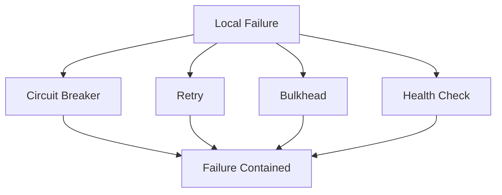

These patterns are often used together:

| Pattern | Main purpose |
|---|---|
| Circuit Breaker | Stop repeatedly calling a failing dependency |
| Retry | Recover from short-lived transient failures |
| Bulkhead | Isolate resources so one failure does not consume everything |
| Health Check | Remove unhealthy instances from traffic paths |

A resilient service should assume that dependencies fail, networks are unreliable, latency changes, and overload happens.

---

### 27. Circuit Breaker

#### What it is

A **Circuit Breaker** is a resilience pattern that prevents a service from repeatedly calling a dependency that is failing, overloaded, or too slow.

It works like an electrical circuit breaker. When failures exceed a threshold, the circuit opens and calls fail fast instead of continuing to hit the dependency.

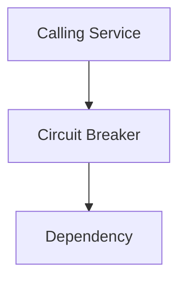

When the dependency is healthy, the circuit breaker allows calls through.

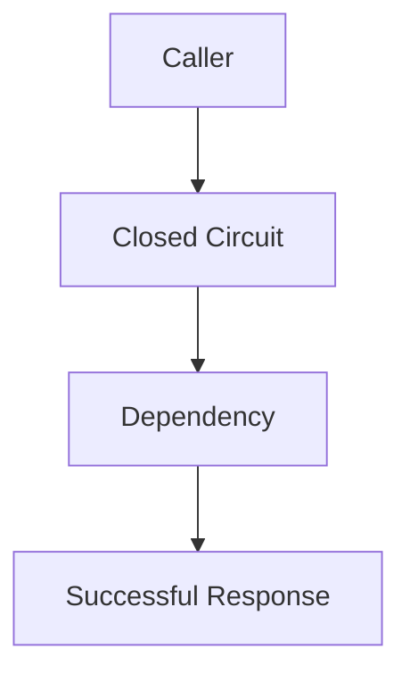

When the dependency keeps failing, the circuit opens.

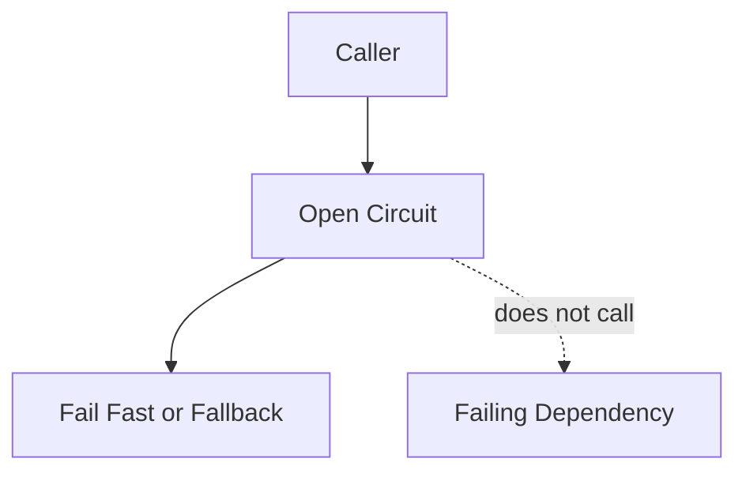

The central idea is:

> If a dependency is failing, stop making the situation worse.

Without a circuit breaker, callers may continue waiting for timeouts, consuming threads, sockets, memory, and connection pools. This can turn a dependency outage into a caller outage.

---

#### Why this pattern exists

In distributed systems, failures are often slow before they are obvious.

A dependency may not be fully down. It may be responding after 10 seconds instead of 100 milliseconds.

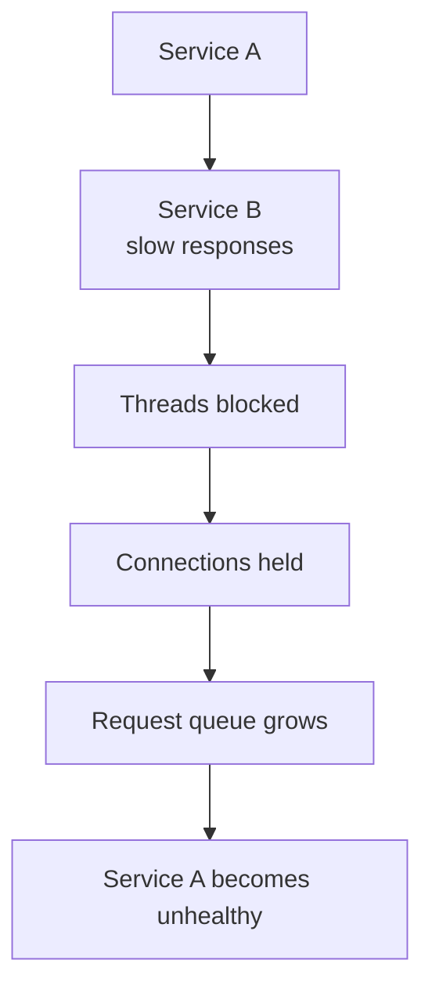

The original problem may be in Service B, but Service A eventually fails because its resources are exhausted.

Circuit Breaker exists to stop that cascade.

Instead of waiting for every request to time out, Service A detects that Service B is unhealthy and fails fast.

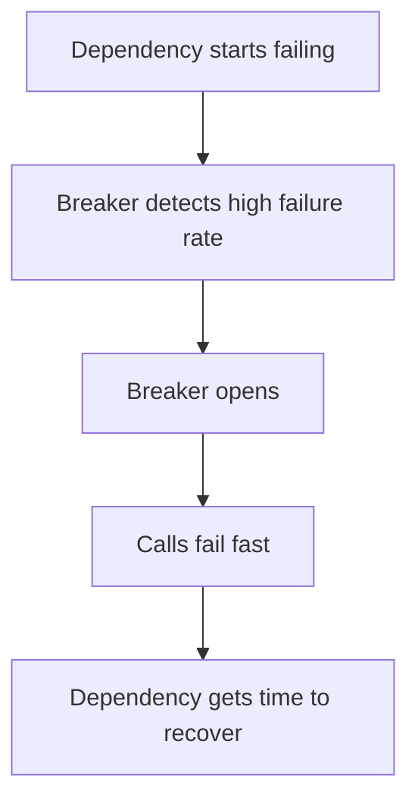

This protects both sides:

- the caller avoids resource exhaustion,
- the dependency receives less traffic while recovering,
- users receive faster failures or fallbacks instead of hanging requests.

---

#### What it solves

Circuit Breaker solves **cascading failure** and **resource exhaustion**.

A cascading failure happens when one unhealthy dependency causes upstream services to fail.

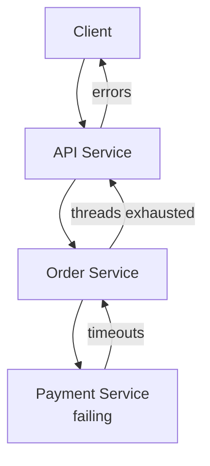

The dependency failure spreads upward.

A circuit breaker interrupts the cascade.

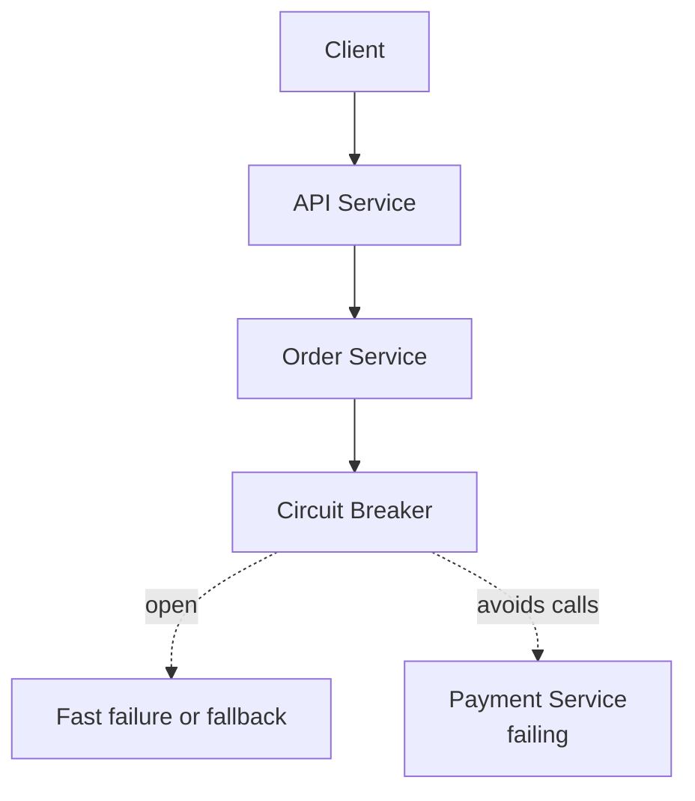

Instead of every request waiting for Payment Service to time out, the Order Service can quickly respond with a controlled error, fallback, or pending state.

---

#### Circuit breaker states

A circuit breaker usually has three states:

1. **Closed**
2. **Open**
3. **Half-open**

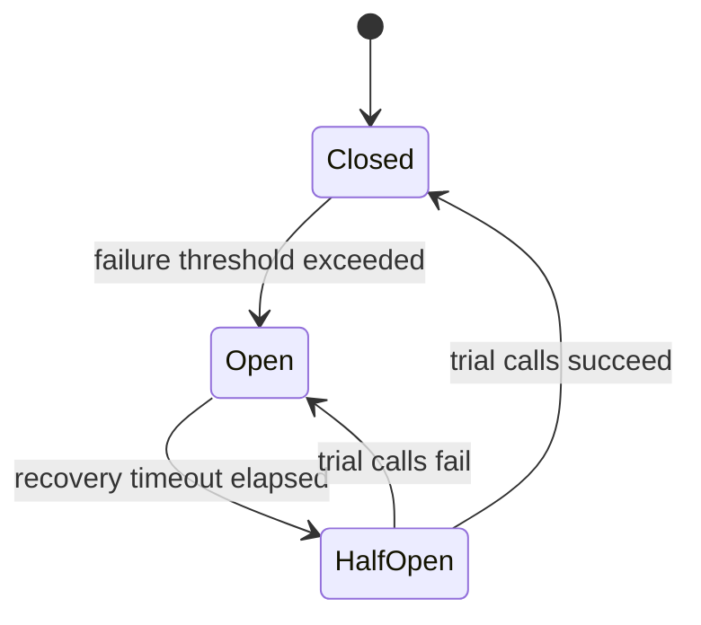

##### Closed

The dependency is considered healthy. Calls are allowed through.

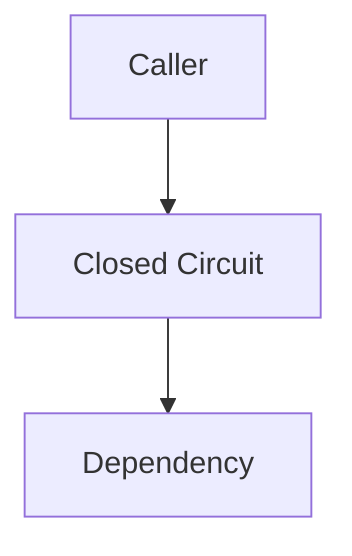

The breaker records successes, failures, timeouts, and latency.

##### Open

The dependency is considered unhealthy. Calls are blocked and fail fast.

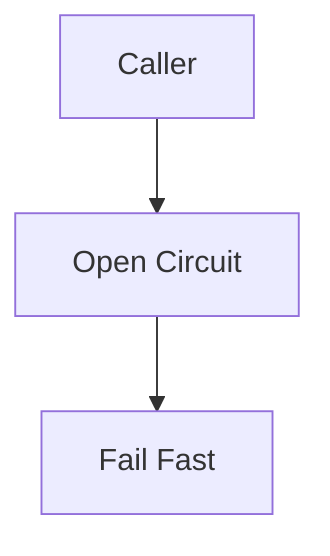

The caller does not waste resources waiting for a dependency that is likely to fail.

##### Half-open

After a cooldown period, the breaker allows a small number of trial calls.

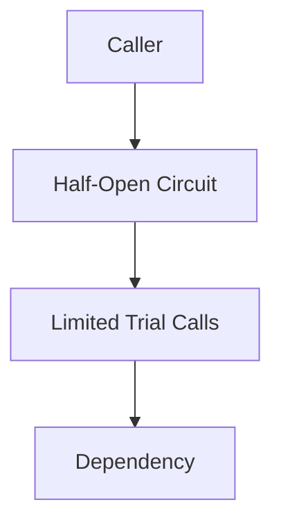

If the trial calls succeed, the circuit closes. If they fail, the circuit opens again.

---

#### Example: payment provider circuit breaker

Suppose Checkout Service calls a payment provider.

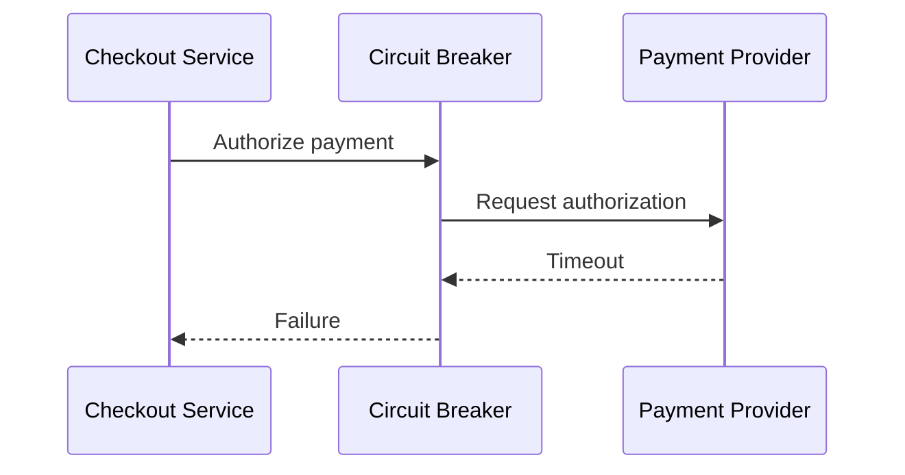

If enough payment calls fail, the breaker opens.

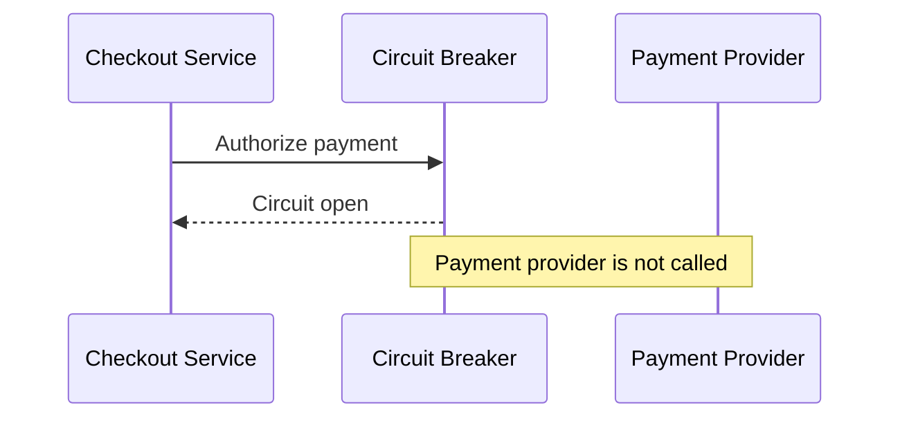

Checkout Service can then respond:

```json
{
  "error": "PAYMENT_TEMPORARILY_UNAVAILABLE",
  "message": "Payment processing is temporarily unavailable. Please try again shortly."
}
```

Or it might place the order in a pending state:

```json
{
  "orderId": "ord_123",
  "status": "PENDING_PAYMENT",
  "message": "Your order was received. Payment will be retried shortly."
}
```

The right behavior depends on the business process.

---

#### Simple TypeScript implementation

This is a simplified circuit breaker example.

```ts
type CircuitState = "CLOSED" | "OPEN" | "HALF_OPEN";

type CircuitBreakerOptions = {
  failureThreshold: number;
  recoveryTimeoutMs: number;
};

class CircuitBreaker {
  private state: CircuitState = "CLOSED";
  private failureCount = 0;
  private lastOpenedAt: number | null = null;

  constructor(private readonly options: CircuitBreakerOptions) {}

  async execute<T>(operation: () => Promise<T>): Promise<T> {
    if (this.state === "OPEN") {
      if (this.shouldTryHalfOpen()) {
        this.state = "HALF_OPEN";
      } else {
        throw new Error("CIRCUIT_OPEN");
      }
    }

    try {
      const result = await operation();
      this.recordSuccess();
      return result;
    } catch (error) {
      this.recordFailure();
      throw error;
    }
  }

  private shouldTryHalfOpen(): boolean {
    if (this.lastOpenedAt === null) {
      return false;
    }

    return Date.now() - this.lastOpenedAt >= this.options.recoveryTimeoutMs;
  }

  private recordSuccess(): void {
    this.failureCount = 0;
    this.state = "CLOSED";
    this.lastOpenedAt = null;
  }

  private recordFailure(): void {
    this.failureCount += 1;

    if (this.failureCount >= this.options.failureThreshold) {
      this.state = "OPEN";
      this.lastOpenedAt = Date.now();
    }
  }
}
```

Usage:

```ts
const paymentBreaker = new CircuitBreaker({
  failureThreshold: 5,
  recoveryTimeoutMs: 30_000
});

async function authorizePayment(command: AuthorizePaymentCommand) {
  return paymentBreaker.execute(() =>
    paymentProvider.authorize(command)
  );
}
```

This implementation is intentionally basic. Production-grade circuit breakers usually include rolling windows, failure percentages, concurrency limits, metrics, timeout integration, and half-open trial limits.

---

#### Failure thresholds

A circuit breaker needs rules for when to open.

Common thresholds include:

| Threshold type | Example |
|---|---|
| Consecutive failures | Open after 5 failures in a row |
| Failure percentage | Open if 50 percent of calls fail in a rolling window |
| Slow call percentage | Open if 60 percent of calls exceed 2 seconds |
| Timeout count | Open after 20 timeouts in 1 minute |
| Error rate plus volume | Open if failure rate is high and at least 100 calls occurred |

A failure-percentage breaker is often better than a simple consecutive-failure breaker.

Why? Because a dependency with high traffic may have occasional failures. Opening after 5 random failures may be too aggressive.

Example rolling-window logic:

```text
Last 100 calls:
- 70 successes
- 30 failures
Failure rate = 30 percent
```

If the threshold is 50 percent, the circuit stays closed.

If the failure rate rises:

```text
Last 100 calls:
- 40 successes
- 60 failures
Failure rate = 60 percent
```

The circuit opens.

---

#### What counts as failure?

A circuit breaker must define what failures count.

Usually counted:

- connection timeouts,
- request timeouts,
- connection refused,
- dependency unavailable,
- 5xx responses,
- throttling responses if they indicate overload,
- database connection failures,
- severe latency beyond timeout.

Usually not counted:

- 400 Bad Request caused by caller input,
- 401 Unauthorized caused by invalid credentials,
- 403 Forbidden caused by permission rules,
- 404 Not Found for a legitimate missing resource,
- business rule rejections.

Example:

```ts
function shouldCountAsCircuitFailure(error: HttpError): boolean {
  if (error.statusCode >= 500) {
    return true;
  }

  if (error.code === "ETIMEDOUT") {
    return true;
  }

  if (error.code === "ECONNREFUSED") {
    return true;
  }

  return false;
}
```

Do not open the circuit because users are sending invalid requests. Open the circuit because the dependency is unhealthy.

---

#### Circuit breaker with timeout

Circuit breakers should usually work with timeouts.

A call that never returns is just as dangerous as a call that fails.

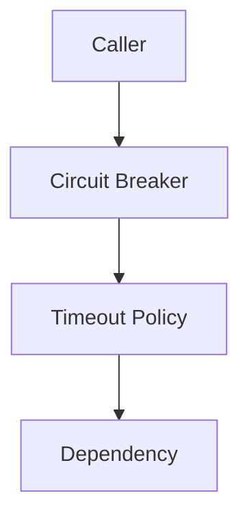

Example timeout wrapper:

```ts
async function withTimeout<T>(
  promise: Promise<T>,
  timeoutMs: number
): Promise<T> {
  return Promise.race([
    promise,
    new Promise<T>((_, reject) =>
      setTimeout(() => reject(new Error("TIMEOUT")), timeoutMs)
    )
  ]);
}
```

Usage with breaker:

```ts
async function callSearchService(query: SearchQuery) {
  return searchBreaker.execute(() =>
    withTimeout(searchClient.search(query), 500)
  );
}
```

Without timeouts, circuit breakers may not detect slow failures quickly enough.

---

#### Fallbacks

When a circuit is open, the caller can respond in several ways.

| Situation | Possible fallback |
|---|---|
| Recommendation service down | Return empty recommendations |
| Product review service down | Hide reviews temporarily |
| Search service down | Return cached search results |
| Payment provider down | Return payment unavailable or pending payment |
| Notification provider down | Queue notification for later |
| Inventory estimate down | Show “availability unavailable” |

Example fallback:

```ts
async function getRecommendations(userId: string): Promise<Product[]> {
  try {
    return await recommendationBreaker.execute(() =>
      recommendationClient.getRecommendations(userId)
    );
  } catch (error) {
    if (error instanceof Error && error.message === "CIRCUIT_OPEN") {
      return [];
    }

    throw error;
  }
}
```

Fallbacks must be business-safe.

Returning empty recommendations is usually safe. Pretending payment succeeded is not safe.

---

#### Circuit breakers and retries

Circuit Breaker and Retry are often used together, but they must be combined carefully.

Bad combination:

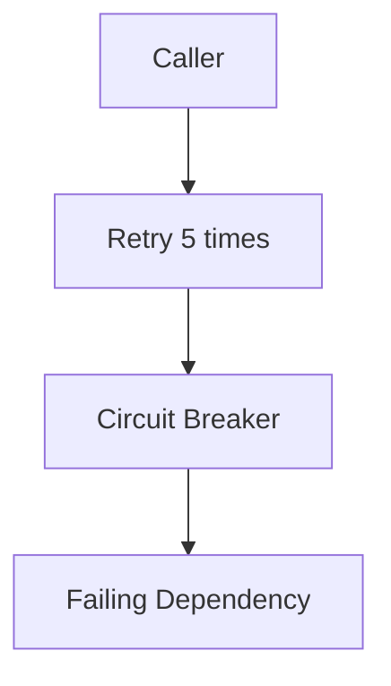

If many callers retry aggressively before the circuit opens, they can overload the dependency.

Better:

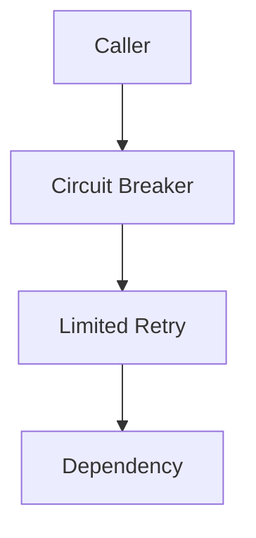

Design rules:

- use small retry counts,
- use timeouts,
- use exponential backoff and jitter,
- do not retry when the circuit is open,
- count final failures toward the breaker,
- avoid retrying non-idempotent operations.

A circuit breaker prevents retries from continuing during a known outage.

---

#### Circuit breakers and bulkheads

Circuit breakers stop calls to unhealthy dependencies. Bulkheads isolate resources used for dependencies.

They work well together.

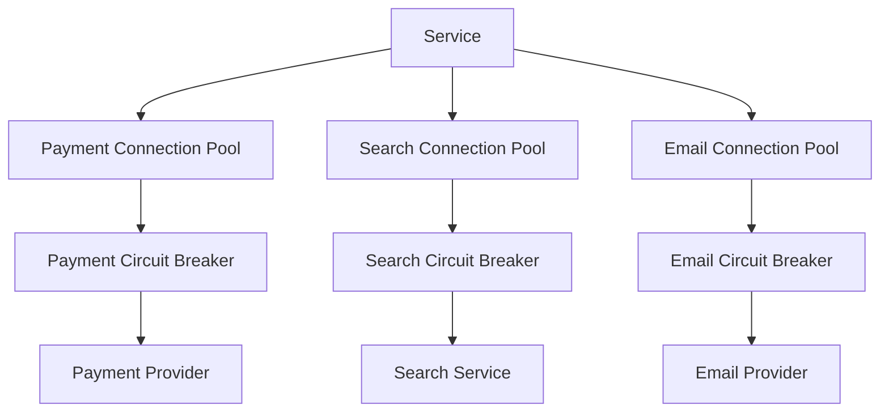

If Search Service fails, the search pool and breaker protect the rest of the service from being consumed by search calls.

---

#### Observability

Circuit breakers need clear metrics and logs.

Track:

- circuit state,
- state transitions,
- failure rate,
- timeout count,
- slow call count,
- rejected call count,
- fallback count,
- half-open trial count,
- dependency latency,
- dependency error rate.

Example log:

```json
{
  "service": "checkout-service",
  "dependency": "payment-provider",
  "circuit": "payment_authorization",
  "previousState": "CLOSED",
  "newState": "OPEN",
  "failureRate": 0.72,
  "windowSize": 100,
  "timestamp": "2026-04-29T12:00:00Z"
}
```

Useful dashboard:

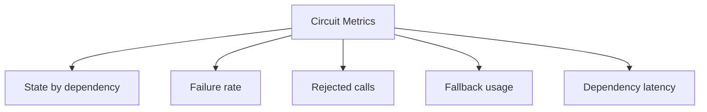

If a breaker opens, operators should know which dependency is unhealthy and which user-facing features are affected.

---

#### When to use it

Use Circuit Breaker around dependencies that can fail, slow down, or overload callers.

Common targets:

- service-to-service calls,
- third-party APIs,
- payment providers,
- databases,
- search services,
- notification providers,
- identity providers,
- file storage,
- recommendation services,
- fraud services,
- external partner systems.

Use it especially when:

- calls are synchronous,
- failures can be slow,
- dependency outages have caused incidents,
- timeouts consume caller resources,
- a dependency has rate limits,
- a fallback or fast failure is possible.

---

#### When not to use it

A circuit breaker may be unnecessary when:

- the operation is local and in-memory,
- failure is not expected or not recoverable,
- the caller cannot provide useful fallback or fast failure,
- the dependency is already protected by another layer,
- traffic volume is too low for meaningful failure thresholds,
- opening the circuit would be more harmful than waiting.

Do not add circuit breakers blindly. Use them where dependency failure can damage caller health.

---

#### Benefits

**1. Prevents cascading failure**

A failing dependency is less likely to take down callers.

**2. Reduces latency during outages**

Calls fail fast instead of waiting for repeated timeouts.

**3. Protects caller resources**

Threads, connections, memory, and request queues are preserved.

**4. Gives dependencies time to recover**

Open circuits reduce traffic to unhealthy dependencies.

**5. Enables graceful degradation**

Fallback behavior can keep part of the system useful.

**6. Improves operational visibility**

Circuit state changes reveal dependency health problems.

---

#### Trade-offs

**1. Thresholds require tuning**

Too sensitive causes false openings. Too insensitive allows cascading failure.

**2. Fallback behavior can hide problems**

If fallback is too quiet, teams may miss dependency failures.

**3. Open circuits can reject valid traffic**

The dependency may recover before the breaker allows enough traffic through.

**4. Half-open behavior is tricky**

Too many trial calls can overload a recovering dependency.

**5. It adds configuration complexity**

Each dependency may need different thresholds and timeouts.

**6. It does not fix the dependency**

It protects the caller. The underlying problem still needs to be resolved.

---

#### Common mistakes

**Mistake 1: No timeout**

A circuit breaker without timeouts may not detect slow failures quickly.

**Mistake 2: Same thresholds for every dependency**

A payment provider and a recommendation service may need different settings.

**Mistake 3: Counting business errors as dependency failures**

Do not open a circuit because users send invalid input.

**Mistake 4: No fallback strategy**

If every open circuit causes generic 500 errors, users get poor behavior.

**Mistake 5: No observability**

Circuit state changes should be visible.

**Mistake 6: Retrying aggressively before opening**

Retries can worsen dependency overload.

**Mistake 7: Ignoring half-open tuning**

Recovery checks should be controlled and limited.

---

#### Practical design checklist

Before adding a circuit breaker, ask:

- What dependency is protected?
- What failures should count?
- What failures should not count?
- What timeout applies?
- What failure threshold opens the circuit?
- Is the threshold based on count or percentage?
- What rolling window is used?
- How long does the circuit stay open?
- How many half-open trial calls are allowed?
- What fallback is safe?
- Should the caller return an error, cached data, empty data, or pending state?
- How does this interact with retries?
- How does this interact with bulkheads?
- What metrics will show circuit state?
- Who is alerted when the circuit opens?

A Circuit Breaker design is probably healthy if:

- it has explicit timeouts,
- thresholds match dependency behavior,
- only real dependency failures are counted,
- fallbacks are business-safe,
- open states are observable,
- half-open traffic is limited,
- retries are controlled.

A Circuit Breaker design is probably unhealthy if:

- it opens randomly during normal traffic,
- it never opens during dependency outages,
- it hides failures without alerts,
- it retries aggressively during outages,
- it treats all errors as dependency failures,
- no one knows what fallback users receive.

---

### 28. Retry

#### What it is

**Retry** is a resilience pattern where a failed operation is attempted again after a short delay.

It is useful when failures are temporary.

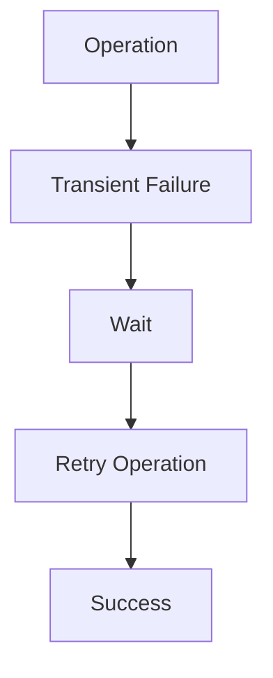

The central idea is:

> Some failures are brief. Retrying after a delay can turn a temporary failure into a successful operation.

For example, a database failover may cause a short connection error. A service deployment may cause a few requests to fail. A third-party API may temporarily return `503 Service Unavailable`.

Retry helps the caller survive these short interruptions.

---

#### Why this pattern exists

Distributed systems often fail briefly.

Examples:

- network packet loss,
- DNS refresh issues,
- database failover,
- service restart,
- temporary rate limiting,
- brief load balancer errors,
- leader election,
- connection pool exhaustion,
- third-party API hiccups.

A single failed request does not always mean the operation is impossible.

```mermaid
sequenceDiagram
    participant Service
    participant Dependency

    Service->>Dependency: Request attempt 1
    Dependency-->>Service: Temporary failure
    Service->>Service: Wait briefly
    Service->>Dependency: Request attempt 2
    Dependency-->>Service: Success
```

Retry exists because failing immediately on every transient error can reduce reliability unnecessarily.

However, retry is dangerous when used carelessly.

Bad retries can create more traffic exactly when a dependency is already struggling.

---

#### What it solves

Retry solves **transient failure**.

A transient failure is a failure that is likely to disappear if the operation is attempted again.

Examples:

| Failure | Retry likely useful? |
|---|---|
| Network timeout | Often yes |
| Database leader failover | Often yes |
| HTTP 503 | Often yes |
| HTTP 429 with retry-after | Yes, if delayed properly |
| Temporary DNS error | Often yes |
| Validation error | No |
| Unauthorized request | No |
| Business rule rejection | No |
| Insufficient funds | No |
| Duplicate unique key | Usually no |

Retry should be used for temporary technical failures, not permanent business failures.

---

#### Basic retry flow

A retry policy usually defines:

- maximum attempts,
- delay between attempts,
- backoff strategy,
- jitter,
- retryable errors,
- timeout per attempt,
- total retry deadline.

```mermaid
flowchart TD
    Start[Start Operation]
    Attempt[Attempt]
    Result{Success?}
    Retryable{Retryable Error?}
    AttemptsLeft{Attempts Left?}
    Delay[Wait Backoff Delay]
    Success[Return Success]
    Failure[Return Failure]

    Start --> Attempt
    Attempt --> Result

    Result -->|Yes| Success
    Result -->|No| Retryable

    Retryable -->|No| Failure
    Retryable -->|Yes| AttemptsLeft

    AttemptsLeft -->|No| Failure
    AttemptsLeft -->|Yes| Delay
    Delay --> Attempt
```

Retry must have limits. Infinite retries can overload systems and hide failures forever.

---

#### Simple TypeScript implementation

```ts
type RetryOptions = {
  maxAttempts: number;
  baseDelayMs: number;
  maxDelayMs: number;
  shouldRetry: (error: unknown) => boolean;
};

function sleep(ms: number): Promise<void> {
  return new Promise((resolve) => setTimeout(resolve, ms));
}

function calculateDelay(
  attempt: number,
  baseDelayMs: number,
  maxDelayMs: number
): number {
  const exponentialDelay = baseDelayMs * 2 ** (attempt - 1);
  return Math.min(exponentialDelay, maxDelayMs);
}

async function retry<T>(
  operation: () => Promise<T>,
  options: RetryOptions
): Promise<T> {
  let lastError: unknown;

  for (let attempt = 1; attempt <= options.maxAttempts; attempt += 1) {
    try {
      return await operation();
    } catch (error) {
      lastError = error;

      const isLastAttempt = attempt === options.maxAttempts;

      if (isLastAttempt || !options.shouldRetry(error)) {
        throw error;
      }

      const delayMs = calculateDelay(
        attempt,
        options.baseDelayMs,
        options.maxDelayMs
      );

      await sleep(delayMs);
    }
  }

  throw lastError;
}
```

Usage:

```ts
const result = await retry(
  () => inventoryClient.reserveInventory(command),
  {
    maxAttempts: 3,
    baseDelayMs: 100,
    maxDelayMs: 1000,
    shouldRetry: isTransientError
  }
);
```

---

#### Exponential backoff

**Exponential backoff** increases the delay after each failed attempt.

Example:

| Attempt | Delay |
|---|---:|
| 1 | 100 ms |
| 2 | 200 ms |
| 3 | 400 ms |
| 4 | 800 ms |
| 5 | 1600 ms |

```mermaid
flowchart LR
    A1[Attempt 1]
    D1[Wait 100 ms]
    A2[Attempt 2]
    D2[Wait 200 ms]
    A3[Attempt 3]
    D3[Wait 400 ms]
    A4[Attempt 4]

    A1 --> D1 --> A2 --> D2 --> A3 --> D3 --> A4
```

Backoff helps avoid hammering an unhealthy dependency.

Without backoff, retries can arrive immediately and amplify load.

---

#### Jitter

**Jitter** adds randomness to retry delays.

Without jitter, many clients may retry at the exact same time.

```mermaid
flowchart TD
    Failure[Dependency fails]
    Clients[Many clients fail together]
    SameDelay[All wait 1 second]
    Burst[All retry at same time]
    Overload[Dependency overloaded again]

    Failure --> Clients
    Clients --> SameDelay
    SameDelay --> Burst
    Burst --> Overload
```

With jitter, retries spread out.

```mermaid
flowchart TD
    Failure[Dependency fails]
    Clients[Many clients fail together]
    RandomDelay[Each waits different delay]
    Spread[Retries spread over time]
    Recovery[Dependency has better chance to recover]

    Failure --> Clients
    Clients --> RandomDelay
    RandomDelay --> Spread
    Spread --> Recovery
```

Example:

```ts
function addJitter(delayMs: number): number {
  const jitter = Math.random() * delayMs * 0.5;
  return Math.floor(delayMs + jitter);
}
```

Backoff plus jitter is usually safer than fixed retry delays.

---

#### Retryable vs non-retryable errors

Retries should only happen for retryable errors.

Example retry classification:

```ts
function isTransientError(error: unknown): boolean {
  if (!(error instanceof HttpError)) {
    return false;
  }

  if (error.statusCode === 408) {
    return true;
  }

  if (error.statusCode === 429) {
    return true;
  }

  if (error.statusCode >= 500) {
    return true;
  }

  return false;
}
```

Do not retry errors that are caused by invalid input.

Bad retry:

```text
POST /payments failed because card was declined.
Retry 5 times.
```

A declined card is not a transient technical failure. Retrying will not help.

Better:

```text
Return payment declined to the caller.
```

---

#### Idempotency

Retries are safest when the operation is **idempotent**.

An idempotent operation can be repeated without changing the result beyond the first successful application.

Examples:

| Operation | Usually safe to retry? | Notes |
|---|---|---|
| GET customer by ID | Yes | Read-only |
| PUT update profile to exact value | Usually yes | Same final state |
| DELETE resource | Usually yes | Deleting twice can return same final state |
| POST create order | No, unless idempotency key is used | Could create duplicates |
| POST charge card | No, unless provider supports idempotency | Could double charge |
| Send email | No, unless deduplicated | Could send duplicates |

For non-idempotent operations, use idempotency keys.

```http
POST /orders
Idempotency-Key: create-order-request-123
Content-Type: application/json

{
  "customerId": "cus_123",
  "items": [
    {
      "productId": "prod_456",
      "quantity": 1
    }
  ]
}
```

The server stores the result for that key and returns the same result for duplicate attempts.

```ts
async function createOrder(
  command: CreateOrderCommand,
  idempotencyKey: string
): Promise<Order> {
  const existing = await idempotencyStore.find(idempotencyKey);

  if (existing) {
    return existing.response as Order;
  }

  const order = await orderRepository.create(command);

  await idempotencyStore.save({
    key: idempotencyKey,
    response: order,
    createdAt: new Date()
  });

  return order;
}
```

Idempotency is essential for safe retries of writes.

---

#### Retry storms

A **retry storm** happens when many clients retry at the same time and overload a struggling service.

```mermaid
flowchart TD
    Dependency[Dependency slows down]
    Clients[Clients see failures]
    Retries[Clients retry aggressively]
    MoreLoad[Dependency receives more load]
    MoreFailures[More failures]
    Storm[Retry storm]

    Dependency --> Clients
    Clients --> Retries
    Retries --> MoreLoad
    MoreLoad --> MoreFailures
    MoreFailures --> Storm
    Storm --> Retries
```

Retry storms are common when:

- retries have no backoff,
- retries have no jitter,
- retries are too many,
- timeouts are too long,
- every layer retries,
- circuit breakers are missing,
- clients retry non-retryable failures.

To prevent retry storms:

- limit retry attempts,
- use exponential backoff,
- add jitter,
- use retry budgets,
- honor `Retry-After` headers,
- use circuit breakers,
- avoid retries at every layer,
- fail fast when dependencies are overloaded.

---

#### Retry budgets

A **retry budget** limits how many retries a system can generate.

For example:

```text
Retries may not exceed 10 percent of original request volume.
```

If a service receives 10,000 requests per minute, retries are capped at 1,000 per minute.

This prevents retry traffic from overwhelming normal traffic.

```mermaid
flowchart TD
    OriginalTraffic[Original Traffic]
    RetryBudget[Retry Budget]
    RetryAllowed[Allowed Retries]
    RetryRejected[Rejected or Skipped Retries]

    OriginalTraffic --> RetryBudget
    RetryBudget --> RetryAllowed
    RetryBudget --> RetryRejected
```

Retry budgets are especially useful in high-scale systems.

---

#### Layered retries

Retries can accidentally multiply when many layers retry.

```mermaid
flowchart TD
    Client[Client retries 3x]
    Gateway[Gateway retries 3x]
    Service[Service retries 3x]
    Dependency[Dependency]

    Client --> Gateway
    Gateway --> Service
    Service --> Dependency

    Amplification[Potential 27 attempts]
    Dependency --> Amplification
```

Three retries at three layers can become many attempts for one user request.

Design rule:

> Retry at the layer that has the best context, and avoid duplicate retry policies across layers.

For example:

- client may retry user-visible network failures,
- service may retry a database failover,
- message consumer may retry message processing,
- gateway should usually be conservative.

Do not let every layer retry blindly.

---

#### Retry with message queues

Retry is common in async message processing.

```mermaid
flowchart TD
    Queue[(Queue)]
    Consumer[Consumer]
    Success[Processed]
    RetryQueue[(Retry Queue)]
    DLQ[(Dead Letter Queue)]

    Queue --> Consumer
    Consumer -->|success| Success
    Consumer -->|temporary failure| RetryQueue
    RetryQueue --> Consumer
    Consumer -->|max attempts exceeded| DLQ
```

Example retry policy:

```yaml
messageConsumer:
  maxAttempts: 5
  backoff:
    type: exponential
    initialDelayMs: 1000
    maxDelayMs: 60000
    jitter: true
  deadLetterQueue: order-processing-dlq
```

Do not retry poison messages forever. Invalid messages should eventually go to a dead-letter queue.

---

#### Retry and timeouts

Every retry attempt should have its own timeout, and the overall operation should have a total deadline.

Bad:

```text
Attempt 1 waits 30 seconds
Attempt 2 waits 30 seconds
Attempt 3 waits 30 seconds
Total user wait = 90 seconds plus delays
```

Better:

```text
Overall deadline = 3 seconds
Each attempt timeout = 800 ms
Retries stop when deadline is almost reached
```

```ts
async function retryWithDeadline<T>(
  operation: () => Promise<T>,
  deadlineMs: number
): Promise<T> {
  const deadlineAt = Date.now() + deadlineMs;
  let attempt = 0;

  while (Date.now() < deadlineAt) {
    attempt += 1;

    try {
      const remainingMs = deadlineAt - Date.now();
      return await withTimeout(operation(), Math.min(remainingMs, 800));
    } catch (error) {
      if (!isTransientError(error) || attempt >= 3) {
        throw error;
      }

      await sleep(100 * attempt);
    }
  }

  throw new Error("DEADLINE_EXCEEDED");
}
```

Retries should not make user-facing requests hang too long.

---

#### Honor Retry-After

Some APIs return a `Retry-After` header, especially for throttling.

```http
HTTP/1.1 429 Too Many Requests
Retry-After: 30
```

The caller should wait before retrying.

```ts
function getRetryAfterMs(response: Response): number | null {
  const retryAfter = response.headers.get("Retry-After");

  if (!retryAfter) {
    return null;
  }

  const seconds = Number(retryAfter);

  if (Number.isFinite(seconds)) {
    return seconds * 1000;
  }

  const date = new Date(retryAfter);

  if (!Number.isNaN(date.getTime())) {
    return Math.max(0, date.getTime() - Date.now());
  }

  return null;
}
```

Ignoring throttling instructions can make rate limiting worse.

---

#### Observability

Retry behavior must be visible.

Track:

- retry count,
- retry attempts per operation,
- retry success rate,
- retry failure rate,
- retry delay,
- total operation latency,
- retryable vs non-retryable errors,
- retry budget usage,
- dead-letter count for message retries.

Example log:

```json
{
  "service": "order-service",
  "operation": "reserveInventory",
  "attempt": 2,
  "maxAttempts": 3,
  "error": "TIMEOUT",
  "nextDelayMs": 250,
  "correlationId": "corr_123"
}
```

Metrics should distinguish original traffic from retry traffic.

```text
requests_total
retries_total
retry_success_total
retry_exhausted_total
```

If retry volume spikes, the system may be hiding an outage.

---

#### When to use it

Use Retry when:

- failure is likely temporary,
- the operation is idempotent,
- the operation has a timeout,
- retry attempts are limited,
- retry delay uses backoff and jitter,
- retry volume is observable,
- the dependency can tolerate retry traffic.

Common use cases:

- reads,
- idempotent writes,
- database failovers,
- message processing,
- temporary service failures,
- third-party 503 responses,
- HTTP 429 with proper delay,
- transient network errors.

---

#### When not to use it

Do not retry when:

- the error is permanent,
- the request is invalid,
- the user is unauthorized,
- the operation is non-idempotent and has no idempotency key,
- the dependency is already overloaded and no backoff is used,
- the total deadline would be exceeded,
- retries would duplicate external side effects,
- a circuit breaker is open.

Examples of bad retries:

- retrying a declined payment,
- retrying invalid JSON,
- retrying a permission error,
- retrying `POST /orders` without idempotency,
- retrying indefinitely inside a message consumer.

---

#### Benefits

**1. Handles transient failures**

Short-lived failures can recover without user-visible errors.

**2. Improves reliability**

Systems become less sensitive to brief network or infrastructure glitches.

**3. Works well with message processing**

Temporary consumer failures can be retried later.

**4. Helps during failovers**

Database and service failovers often cause short failure windows.

**5. Can reduce manual intervention**

Temporary errors may resolve automatically.

---

#### Trade-offs

**1. Can amplify load**

Retries increase traffic during failure conditions.

**2. Can cause duplicate side effects**

Non-idempotent operations may run more than once.

**3. Can increase latency**

Multiple attempts take longer than one attempt.

**4. Can hide real problems**

Retries may mask dependency instability until it becomes severe.

**5. Requires careful classification**

Not all errors are retryable.

**6. Needs coordination with other resilience patterns**

Retries should work with timeouts, circuit breakers, and bulkheads.

---

#### Common mistakes

**Mistake 1: Retrying everything**

Permanent failures should fail quickly.

**Mistake 2: No backoff**

Immediate retries can overload dependencies.

**Mistake 3: No jitter**

Synchronized retries can create bursts.

**Mistake 4: Too many attempts**

Retry count should be limited.

**Mistake 5: Retrying non-idempotent writes**

This can create duplicate orders, payments, emails, or shipments.

**Mistake 6: Retrying at every layer**

Layered retries multiply attempts.

**Mistake 7: No observability**

High retry volume may be the first sign of an outage.

**Mistake 8: Ignoring Retry-After**

Throttled APIs often tell callers when to retry.

---

#### Practical design checklist

Before adding Retry, ask:

- What failures are retryable?
- What failures are not retryable?
- Is the operation idempotent?
- If it is a write, is there an idempotency key?
- What is the maximum number of attempts?
- What is the delay strategy?
- Is exponential backoff used?
- Is jitter used?
- What is the timeout per attempt?
- What is the total deadline?
- Could retries overload the dependency?
- Is a retry budget needed?
- Which layer owns retries?
- Does this interact with a circuit breaker?
- What metrics show retry volume?
- What happens after retries are exhausted?

A Retry design is probably healthy if:

- it targets transient failures,
- attempts are limited,
- backoff and jitter are used,
- writes are idempotent,
- total deadlines are respected,
- retry volume is monitored,
- exhausted retries fail clearly.

A Retry design is probably unhealthy if:

- every error is retried,
- non-idempotent writes are retried blindly,
- retries happen at many layers,
- there is no backoff,
- retry traffic is invisible,
- retries continue during known outages.

---

### 29. Bulkhead

#### What it is

A **Bulkhead** is a failure isolation pattern that separates resources so failure in one area cannot consume all capacity.

The name comes from ships. A ship is divided into watertight compartments. If one compartment floods, the entire ship does not sink.

In software, bulkheads divide resources such as:

- thread pools,
- connection pools,
- queues,
- worker pools,
- CPU limits,
- memory limits,
- tenants,
- dependency clients,
- critical and non-critical workloads.

```mermaid
flowchart TD
    Service[Service]

    PoolA[Resource Pool A]
    PoolB[Resource Pool B]
    PoolC[Resource Pool C]

    DependencyA[Dependency A]
    DependencyB[Dependency B]
    DependencyC[Dependency C]

    Service --> PoolA
    Service --> PoolB
    Service --> PoolC

    PoolA --> DependencyA
    PoolB --> DependencyB
    PoolC --> DependencyC
```

The central idea is:

> Do not let one failing workload or dependency consume resources needed by everything else.

---

#### Why this pattern exists

Without isolation, one slow dependency can consume shared resources.

Suppose one service has a single shared thread pool for all outgoing calls.

```mermaid
flowchart TD
    Service[Service]
    SharedPool[Shared Thread Pool]

    Payments[Payment Provider]
    Search[Search Service<br/>slow]
    Email[Email Provider]

    Service --> SharedPool

    SharedPool --> Payments
    SharedPool --> Search
    SharedPool --> Email

    Search --> Exhausted[Shared pool exhausted]
    Exhausted --> PaymentsBlocked[Payment calls blocked]
    Exhausted --> EmailBlocked[Email calls blocked]
```

If Search Service becomes slow, search calls may occupy all threads. Then payment and email calls cannot run, even though those dependencies are healthy.

Bulkheads prevent that by giving each workload its own capacity.

```mermaid
flowchart TD
    Service[Service]

    PaymentPool[Payment Pool]
    SearchPool[Search Pool]
    EmailPool[Email Pool]

    Payments[Payment Provider]
    Search[Search Service<br/>slow]
    Email[Email Provider]

    Service --> PaymentPool
    Service --> SearchPool
    Service --> EmailPool

    PaymentPool --> Payments
    SearchPool --> Search
    EmailPool --> Email

    Search --> SearchPoolFull[Only search pool fills]
```

Search may fail, but payment and email capacity remain available.

---

#### What it solves

Bulkhead solves **blast radius**.

Blast radius is the amount of the system affected by a failure.

Without bulkheads:

```mermaid
flowchart TD
    OneFailure[One dependency fails]
    SharedResources[Shared resources exhausted]
    AllFeatures[All features degrade]
    Outage[System-wide outage]

    OneFailure --> SharedResources
    SharedResources --> AllFeatures
    AllFeatures --> Outage
```

With bulkheads:

```mermaid
flowchart TD
    OneFailure[One dependency fails]
    IsolatedResources[Only its resource pool is exhausted]
    OtherFeatures[Other features continue]
    PartialFailure[Partial failure]

    OneFailure --> IsolatedResources
    IsolatedResources --> PartialFailure
    OtherFeatures --> PartialFailure
```

The goal is not to prevent the failing area from failing. The goal is to stop it from taking everything else down.

---

#### Types of bulkheads

Bulkheads can be applied at many levels.

| Bulkhead type | What it isolates |
|---|---|
| Thread pool bulkhead | Execution threads |
| Connection pool bulkhead | Database or HTTP connections |
| Queue bulkhead | Work backlog |
| Tenant bulkhead | Tenant resources and traffic |
| Dependency bulkhead | Calls to different dependencies |
| Workload bulkhead | Critical vs non-critical work |
| Process/container bulkhead | Runtime resources |
| Regional bulkhead | Region-level failures |

A resilient system often uses several of these.

---

#### Thread pool bulkhead

A thread pool bulkhead uses separate thread pools for different workloads.

```mermaid
flowchart TD
    Service[Service]

    CriticalPool[Critical Request Pool]
    BackgroundPool[Background Job Pool]
    ReportingPool[Reporting Pool]

    CriticalWork[Checkout and Login]
    BackgroundWork[Emails and Exports]
    ReportingWork[Reports]

    Service --> CriticalPool
    Service --> BackgroundPool
    Service --> ReportingPool

    CriticalPool --> CriticalWork
    BackgroundPool --> BackgroundWork
    ReportingPool --> ReportingWork
```

If reporting queries become slow, they should not consume threads needed for checkout.

Example:

```ts
class WorkerPool {
  private active = 0;
  private queue: Array<() => void> = [];

  constructor(private readonly maxConcurrent: number) {}

  async run<T>(operation: () => Promise<T>): Promise<T> {
    await this.acquire();

    try {
      return await operation();
    } finally {
      this.release();
    }
  }

  private acquire(): Promise<void> {
    if (this.active < this.maxConcurrent) {
      this.active += 1;
      return Promise.resolve();
    }

    return new Promise((resolve) => {
      this.queue.push(() => {
        this.active += 1;
        resolve();
      });
    });
  }

  private release(): void {
    this.active -= 1;
    const next = this.queue.shift();

    if (next) {
      next();
    }
  }
}
```

Usage:

```ts
const paymentPool = new WorkerPool(20);
const searchPool = new WorkerPool(10);

async function authorizePayment(command: PaymentCommand) {
  return paymentPool.run(() => paymentClient.authorize(command));
}

async function searchProducts(query: SearchQuery) {
  return searchPool.run(() => searchClient.search(query));
}
```

Payment and search now have separate concurrency limits.

---

#### Connection pool bulkhead

A connection pool bulkhead gives different dependencies separate connection pools.

```mermaid
flowchart TD
    Service[Service]

    OrderDBPool[Order DB Pool]
    AnalyticsDBPool[Analytics DB Pool]
    SearchPool[Search HTTP Pool]

    OrderDB[(Order DB)]
    AnalyticsDB[(Analytics DB)]
    SearchService[Search Service]

    Service --> OrderDBPool
    Service --> AnalyticsDBPool
    Service --> SearchPool

    OrderDBPool --> OrderDB
    AnalyticsDBPool --> AnalyticsDB
    SearchPool --> SearchService
```

If analytics queries use all analytics connections, order database connections remain available.

Bad configuration:

```text
One shared connection pool for all database workloads.
```

Better:

```text
checkout_db_pool: 50 connections
reporting_db_pool: 10 connections
background_job_db_pool: 5 connections
```

This prevents non-critical workloads from starving critical workloads.

---

#### Queue bulkhead

Queue bulkheads separate work queues.

```mermaid
flowchart TD
    Events[Incoming Work]

    CriticalQueue[(Critical Queue)]
    EmailQueue[(Email Queue)]
    ReportQueue[(Report Queue)]

    CriticalWorkers[Critical Workers]
    EmailWorkers[Email Workers]
    ReportWorkers[Report Workers]

    Events --> CriticalQueue
    Events --> EmailQueue
    Events --> ReportQueue

    CriticalQueue --> CriticalWorkers
    EmailQueue --> EmailWorkers
    ReportQueue --> ReportWorkers
```

If report generation backs up, it does not block critical order processing.

This is especially useful in async systems.

Example queues:

| Queue | Purpose | Priority |
|---|---|---|
| `payment-processing` | Payment workflow | High |
| `order-confirmation` | Order workflow | High |
| `email-notifications` | Email delivery | Medium |
| `analytics-events` | Analytics pipeline | Low |
| `report-generation` | Long-running reports | Low |

Separate queues allow different scaling, retry, and dead-letter policies.

---

#### Tenant bulkhead

Tenant bulkheads isolate tenants from each other.

```mermaid
flowchart TD
    TenantA[Tenant A]
    TenantB[Tenant B]
    TenantC[Tenant C]

    PoolA[Tenant A Quota]
    PoolB[Tenant B Quota]
    PoolC[Tenant C Quota]

    Service[Service]

    TenantA --> PoolA
    TenantB --> PoolB
    TenantC --> PoolC

    PoolA --> Service
    PoolB --> Service
    PoolC --> Service
```

If Tenant A sends too much traffic, Tenant B and Tenant C should still work.

Tenant bulkheads can include:

- rate limits,
- request quotas,
- dedicated queues,
- dedicated databases,
- dedicated shards,
- tenant-specific worker pools,
- tenant-specific concurrency limits.

Example:

```ts
async function handleTenantRequest(request: Request) {
  const tenantId = request.headers["x-tenant-id"];

  const allowed = await tenantLimiter.allow({
    tenantId,
    cost: 1
  });

  if (!allowed) {
    return {
      status: 429,
      body: {
        error: "TENANT_RATE_LIMIT_EXCEEDED"
      }
    };
  }

  return processRequest(request);
}
```

Tenant isolation is critical in multi-tenant platforms.

---

#### Critical vs non-critical workload bulkheads

Some workloads are more important than others.

For example, checkout is more critical than recommendation refresh.

```mermaid
flowchart TD
    Service[Service]

    Critical[Critical Capacity]
    NonCritical[Non-Critical Capacity]

    Checkout[Checkout]
    Login[Login]
    Recommendations[Recommendations]
    Reports[Reports]

    Service --> Critical
    Service --> NonCritical

    Critical --> Checkout
    Critical --> Login
    NonCritical --> Recommendations
    NonCritical --> Reports
```

During overload, non-critical work should degrade first.

Example degradation order:

1. Disable recommendations.
2. Delay analytics processing.
3. Queue emails for later.
4. Limit report generation.
5. Preserve login, checkout, and payment.

Bulkheads make this possible.

---

#### Bulkheads with circuit breakers

Bulkheads and circuit breakers solve different problems.

| Pattern | Protects against |
|---|---|
| Bulkhead | Resource exhaustion spreading across workloads |
| Circuit Breaker | Repeated calls to failing dependencies |

Together:

```mermaid
flowchart TD
    Service[Service]

    SearchPool[Search Bulkhead]
    SearchBreaker[Search Circuit Breaker]
    Search[Search Service]

    PaymentPool[Payment Bulkhead]
    PaymentBreaker[Payment Circuit Breaker]
    Payment[Payment Provider]

    Service --> SearchPool
    SearchPool --> SearchBreaker
    SearchBreaker --> Search

    Service --> PaymentPool
    PaymentPool --> PaymentBreaker
    PaymentBreaker --> Payment
```

The bulkhead limits how many calls can be in flight. The circuit breaker stops calls when the dependency is unhealthy.

---

#### Bulkheads and backpressure

Bulkheads should usually apply backpressure when capacity is full.

Options:

- reject requests,
- queue requests up to a limit,
- return `429 Too Many Requests`,
- return `503 Service Unavailable`,
- degrade optional features,
- shed low-priority work.

```mermaid
flowchart TD
    Request[Request]
    Bulkhead[Bulkhead Capacity]
    Capacity{Capacity Available?}
    Process[Process Request]
    Reject[Reject or Degrade]

    Request --> Bulkhead
    Bulkhead --> Capacity

    Capacity -->|Yes| Process
    Capacity -->|No| Reject
```

Do not let queues grow without limit. An unbounded queue is delayed failure.

---

#### Example: bounded queue

```ts
class BoundedQueue<T> {
  private items: T[] = [];

  constructor(private readonly maxSize: number) {}

  enqueue(item: T): boolean {
    if (this.items.length >= this.maxSize) {
      return false;
    }

    this.items.push(item);
    return true;
  }

  dequeue(): T | undefined {
    return this.items.shift();
  }

  size(): number {
    return this.items.length;
  }
}
```

Usage:

```ts
const reportQueue = new BoundedQueue<ReportJob>(1000);

function submitReport(job: ReportJob) {
  const accepted = reportQueue.enqueue(job);

  if (!accepted) {
    return {
      status: 503,
      body: {
        error: "REPORT_QUEUE_FULL"
      }
    };
  }

  return {
    status: 202,
    body: {
      status: "QUEUED"
    }
  };
}
```

Bounded queues prevent memory exhaustion.

---

#### Resource waste trade-off

Bulkheads can waste resources if configured too rigidly.

Example:

```text
Payment pool has idle capacity.
Search pool is overloaded.
Search cannot use payment capacity.
```

This is intentional isolation, but it can reduce utilization.

```mermaid
flowchart TD
    PaymentPool[Payment Pool<br/>idle capacity]
    SearchPool[Search Pool<br/>overloaded]

    Isolation[Isolation prevents sharing]

    PaymentPool --> Isolation
    SearchPool --> Isolation
```

The trade-off is:

| More isolation | More sharing |
|---|---|
| Better failure containment | Better resource utilization |
| Less blast radius | Higher risk of resource starvation |
| More predictable critical workloads | More efficient under normal load |

Tune bulkheads based on business criticality.

---

#### Observability

Bulkheads need resource-level metrics.

Track:

- pool utilization,
- active workers,
- queued work,
- rejected work,
- queue age,
- connection usage,
- wait time for capacity,
- per-tenant usage,
- workload priority usage,
- saturation by dependency.

Example log:

```json
{
  "service": "checkout-service",
  "bulkhead": "payment-provider-pool",
  "active": 20,
  "max": 20,
  "queued": 50,
  "rejected": 3,
  "timestamp": "2026-04-29T12:00:00Z"
}
```

Useful metrics:

```text
bulkhead_active_count{name="payment"}
bulkhead_queue_depth{name="search"}
bulkhead_rejected_total{name="reporting"}
bulkhead_wait_time_ms{name="inventory"}
```

If a bulkhead is constantly full, either the dependency is slow, the workload is too large, or capacity is too small.

---

#### When to use it

Use Bulkhead when:

- one dependency can become slow,
- workloads have different priority,
- tenants can affect each other,
- background work can starve user-facing work,
- one queue can grow without limit,
- external providers have different reliability,
- critical operations must survive partial failures,
- resource exhaustion has caused incidents.

Common use cases:

- separate connection pools by dependency,
- separate worker pools for critical and background jobs,
- separate queues by priority,
- tenant rate limits,
- dedicated shards for large tenants,
- reserved capacity for checkout or login,
- separate compute for report generation.

---

#### When not to use it

Bulkheads may be unnecessary or harmful when:

- the system is very small,
- workloads are uniform,
- resource usage is predictable,
- isolation would waste too much capacity,
- operational complexity is not justified,
- teams cannot monitor and tune the bulkheads.

Do not add many tiny pools without understanding traffic patterns. Too much fragmentation can reduce capacity and create confusing failures.

---

#### Benefits

**1. Limits blast radius**

One failing area cannot consume all resources.

**2. Protects critical work**

Important features can keep running during partial failure.

**3. Improves tenant isolation**

One noisy tenant is less likely to harm others.

**4. Prevents queue and pool exhaustion**

Bounded resources fail predictably instead of collapsing.

**5. Supports graceful degradation**

Non-critical workloads can be shed first.

**6. Improves operational clarity**

Resource saturation is easier to identify by pool, tenant, or dependency.

---

#### Trade-offs

**1. Resource inefficiency**

Reserved capacity may sit idle while another pool is overloaded.

**2. More configuration**

Pools, queues, and quotas must be sized and tuned.

**3. More monitoring required**

Each bulkhead needs metrics and alerts.

**4. Risk of too much fragmentation**

Too many small pools can create artificial bottlenecks.

**5. Harder capacity planning**

Capacity must be allocated across workloads.

**6. Rejections become normal under pressure**

The system must handle rejected work gracefully.

---

#### Common mistakes

**Mistake 1: One shared pool for everything**

A single slow dependency can consume all capacity.

**Mistake 2: Unbounded queues**

Queues without limits can exhaust memory and increase latency.

**Mistake 3: No priority separation**

Background jobs should not starve critical user requests.

**Mistake 4: No tenant isolation**

One large tenant can degrade the whole platform.

**Mistake 5: Too many tiny bulkheads**

Over-isolation wastes resources and causes unnecessary failures.

**Mistake 6: No metrics**

Teams cannot tune what they cannot see.

**Mistake 7: No rejection strategy**

When capacity is full, the system needs controlled behavior.

---

#### Practical design checklist

Before adding a bulkhead, ask:

- What resource is being isolated?
- What failure are we trying to contain?
- Which workloads are critical?
- Which workloads can degrade first?
- What is the capacity limit?
- What happens when the limit is reached?
- Is the queue bounded?
- Are tenants isolated?
- Are dependencies isolated?
- Are connection pools separate?
- Are thread or worker pools separate?
- What metrics show saturation?
- What alerts indicate resource exhaustion?
- How will capacity be tuned?
- Does this interact with retries and circuit breakers?

A Bulkhead design is probably healthy if:

- critical workloads have protected capacity,
- queues are bounded,
- dependencies have separate pools,
- tenant usage is limited,
- saturation is observable,
- rejected work is handled gracefully,
- capacity is tuned based on real traffic.

A Bulkhead design is probably unhealthy if:

- all work shares one resource pool,
- queues grow without limit,
- one tenant can consume everything,
- background jobs can block checkout or login,
- bulkhead limits are arbitrary and unmonitored,
- resource fragmentation causes frequent avoidable failures.

---

### 30. Health Check

#### What it is

A **Health Check** is an endpoint or mechanism that reports whether a service instance is alive, ready to receive traffic, or healthy enough to keep running.

Health checks are commonly used by:

- Kubernetes,
- load balancers,
- service discovery systems,
- deployment platforms,
- autoscalers,
- monitoring tools.

A service may expose endpoints like:

```http
GET /health/live
GET /health/ready
GET /health/startup
```

Basic architecture:

```mermaid
flowchart TD
    LoadBalancer[Load Balancer]
    InstanceA[Service Instance A<br/>healthy]
    InstanceB[Service Instance B<br/>unhealthy]
    InstanceC[Service Instance C<br/>healthy]

    LoadBalancer --> InstanceA
    LoadBalancer -. avoid .-> InstanceB
    LoadBalancer --> InstanceC
```

The central idea is:

> Traffic should only be sent to instances that are able to handle it.

---

#### Why this pattern exists

Service instances fail in many ways.

An instance may:

- crash,
- deadlock,
- run out of memory,
- lose database connectivity,
- fail startup,
- become overloaded,
- have a bad deployment,
- be unable to load configuration,
- be alive but not ready,
- be ready for some routes but not others.

Without health checks, load balancers may continue sending traffic to bad instances.

```mermaid
flowchart TD
    Client[Client]
    LoadBalancer[Load Balancer]
    Good[Good Instance]
    Bad[Bad Instance]

    Client --> LoadBalancer
    LoadBalancer --> Good
    LoadBalancer --> Bad

    Bad --> Errors[User errors]
```

Health checks allow infrastructure to detect bad instances and remove them from traffic.

```mermaid
flowchart TD
    HealthChecker[Health Checker]
    Instance[Service Instance]
    Routing[Routing System]

    HealthChecker --> Instance
    Instance -->|healthy or unhealthy| HealthChecker
    HealthChecker --> Routing
```

---

#### What it solves

Health Check solves the problem of **routing traffic to unhealthy instances**.

It supports:

- automatic restart,
- safe deployment,
- load balancer routing,
- service discovery registration,
- autoscaling signals,
- operational visibility.

For example, during deployment:

```mermaid
sequenceDiagram
    participant Platform as Deployment Platform
    participant Instance as New Instance
    participant LB as Load Balancer

    Platform->>Instance: Start instance
    Platform->>Instance: Check readiness
    Instance-->>Platform: Not ready
    Platform->>Instance: Check readiness again
    Instance-->>Platform: Ready
    Platform->>LB: Add instance to traffic
```

The new instance does not receive traffic until it is ready.

---

#### Liveness vs readiness vs startup

Health checks are often divided into three types.

| Check | Question | Typical action if failing |
|---|---|---|
| Liveness | Is the process alive? | Restart instance |
| Readiness | Can this instance receive traffic? | Remove from load balancer |
| Startup | Has the instance finished starting? | Delay liveness/readiness decisions |

These checks should not all do the same thing.

---

#### Liveness check

A liveness check answers:

> Is this process alive, or is it stuck beyond recovery?

Example endpoint:

```http
GET /health/live
```

Healthy response:

```json
{
  "status": "UP"
}
```

A liveness check should usually be simple.

It might verify:

- process is running,
- event loop is responsive,
- core runtime has not deadlocked,
- fatal initialization has not failed.

It should usually not fail because a downstream dependency is temporarily unavailable.

Why?

If every instance restarts because a shared dependency is down, the system can make the outage worse.

```mermaid
flowchart TD
    Dependency[Database temporarily down]
    LivenessFails[All liveness checks fail]
    Platform[Platform restarts all instances]
    RestartStorm[Restart storm]
    Worse[Outage becomes worse]

    Dependency --> LivenessFails
    LivenessFails --> Platform
    Platform --> RestartStorm
    RestartStorm --> Worse
```

Liveness should answer whether restarting this instance will help.

If a database is down for everyone, restarting every service instance usually does not help.

---

#### Readiness check

A readiness check answers:

> Should this instance receive traffic right now?

Example endpoint:

```http
GET /health/ready
```

Healthy response:

```json
{
  "status": "READY"
}
```

Unhealthy response:

```json
{
  "status": "NOT_READY",
  "reason": "database connection pool unavailable"
}
```

Readiness may check:

- required configuration loaded,
- database connection pool initialized,
- message consumer ready,
- cache warmed if required,
- migrations completed,
- instance not shutting down,
- required local resources available.

If readiness fails, the load balancer should stop sending new traffic to that instance.

```mermaid
flowchart TD
    LoadBalancer[Load Balancer]
    Instance[Instance readiness false]
    Traffic[New Traffic]

    LoadBalancer -. remove from rotation .-> Instance
    Traffic --> LoadBalancer
```

Readiness is about routing, not restarting.

---

#### Startup check

A startup check answers:

> Has this instance finished starting?

Some services need time to:

- load large models,
- warm caches,
- run migrations,
- connect to dependencies,
- load configuration,
- initialize background workers.

Startup checks prevent platforms from killing slow-starting services too early.

```mermaid
flowchart TD
    Start[Instance starts]
    Initialize[Initialization running]
    StartupCheck[Startup check]
    Ready[Ready]

    Start --> Initialize
    Initialize --> StartupCheck
    StartupCheck -->|not yet| Initialize
    StartupCheck -->|success| Ready
```

Without a startup check, a liveness check may restart a service repeatedly before it has enough time to finish starting.

---

#### Example health endpoints

Example Express service:

```ts
import express, { Request, Response } from "express";

const app = express();

let startupComplete = false;
let shuttingDown = false;

async function canReachDatabase(): Promise<boolean> {
  try {
    await database.query("SELECT 1");
    return true;
  } catch {
    return false;
  }
}

app.get("/health/live", (_req: Request, res: Response) => {
  res.status(200).json({
    status: "UP"
  });
});

app.get("/health/startup", (_req: Request, res: Response) => {
  if (!startupComplete) {
    res.status(503).json({
      status: "STARTING"
    });
    return;
  }

  res.status(200).json({
    status: "STARTED"
  });
});

app.get("/health/ready", async (_req: Request, res: Response) => {
  if (shuttingDown) {
    res.status(503).json({
      status: "NOT_READY",
      reason: "shutting down"
    });
    return;
  }

  const databaseReady = await canReachDatabase();

  if (!databaseReady) {
    res.status(503).json({
      status: "NOT_READY",
      reason: "database unavailable"
    });
    return;
  }

  res.status(200).json({
    status: "READY"
  });
});

async function start() {
  await initializeApplication();
  startupComplete = true;

  app.listen(3000);
}
```

This separates liveness, startup, and readiness.

---

#### Kubernetes-style health checks

A Kubernetes-style configuration might look like this:

```yaml
livenessProbe:
  httpGet:
    path: /health/live
    port: 3000
  initialDelaySeconds: 10
  periodSeconds: 10
  timeoutSeconds: 2
  failureThreshold: 3

readinessProbe:
  httpGet:
    path: /health/ready
    port: 3000
  initialDelaySeconds: 5
  periodSeconds: 5
  timeoutSeconds: 2
  failureThreshold: 2

startupProbe:
  httpGet:
    path: /health/startup
    port: 3000
  periodSeconds: 5
  failureThreshold: 30
```

The exact settings depend on startup time and failure behavior.

Do not copy values blindly. Tune them for the service.

---

#### Dependency checks

Health checks often include dependency status, but this must be designed carefully.

Dependencies can be:

- critical,
- degraded but optional,
- not required for startup,
- required only for certain routes.

Example health response:

```json
{
  "status": "DEGRADED",
  "checks": {
    "database": {
      "status": "UP",
      "latencyMs": 12
    },
    "search": {
      "status": "DOWN",
      "critical": false
    },
    "paymentProvider": {
      "status": "UP",
      "latencyMs": 85
    }
  }
}
```

A service can be degraded but still useful.

For example, product recommendations may be down while checkout still works.

Do not mark the whole service unready for optional dependency failures unless that dependency is required for all traffic.

---

#### Bad health check design

A dangerous health check checks too much.

Bad readiness example:

```text
Readiness fails if any downstream service is unavailable.
```

If Search Service fails, every API instance may become unready, even endpoints unrelated to search.

```mermaid
flowchart TD
    Search[Search dependency down]
    Readiness[All API readiness checks fail]
    LoadBalancer[Load balancer removes all API instances]
    Outage[Total API outage]

    Search --> Readiness
    Readiness --> LoadBalancer
    LoadBalancer --> Outage
```

Better:

- readiness checks only dependencies required for this instance to serve most traffic,
- optional dependency failures are reported as degraded,
- route-specific failures are handled by circuit breakers, fallbacks, or endpoint-level errors.

---

#### Health check response design

Health check responses should be useful but not leak sensitive information.

Internal detailed health response:

```json
{
  "status": "READY",
  "version": "1.42.0",
  "instanceId": "order-service-abc123",
  "checks": {
    "database": {
      "status": "UP",
      "latencyMs": 10
    },
    "eventBus": {
      "status": "UP",
      "latencyMs": 15
    }
  }
}
```

Public health response should be minimal:

```json
{
  "status": "UP"
}
```

Avoid exposing:

- internal hostnames,
- credentials,
- database names,
- dependency URLs,
- stack traces,
- sensitive configuration.

Health endpoints are often accessible to infrastructure. Treat them as operational interfaces.

---

#### Graceful shutdown

Health checks help with graceful shutdown.

When an instance is shutting down, it should become not ready before exiting.

```mermaid
sequenceDiagram
    participant Platform
    participant Instance
    participant LoadBalancer

    Platform->>Instance: Shutdown signal
    Instance->>Instance: Mark readiness false
    LoadBalancer->>Instance: Readiness check
    Instance-->>LoadBalancer: 503 Not Ready
    LoadBalancer->>LoadBalancer: Stop sending new traffic
    Instance->>Instance: Finish in-flight requests
    Instance->>Platform: Exit
```

Example:

```ts
process.on("SIGTERM", async () => {
  shuttingDown = true;

  await sleep(10_000);
  await server.close();
  await database.close();

  process.exit(0);
});
```

This prevents new requests from being sent to an instance that is about to exit.

---

#### Health checks and deployments

Health checks make deployments safer.

During rolling deployment:

```mermaid
flowchart TD
    OldInstances[Old Healthy Instances]
    NewInstance[New Instance]
    Readiness[Readiness Check]
    AddTraffic[Add to Traffic]
    RemoveOld[Remove Old Instance]

    OldInstances --> NewInstance
    NewInstance --> Readiness
    Readiness -->|ready| AddTraffic
    AddTraffic --> RemoveOld
```

If the new instance fails readiness, it should not receive traffic.

This helps catch:

- missing environment variables,
- failed database migrations,
- broken configuration,
- startup errors,
- dependency initialization failures.

Health checks are a core part of zero-downtime deployment.

---

#### Health checks and autoscaling

Autoscaling systems may use health and readiness signals indirectly.

For example:

- unhealthy instances are replaced,
- unready instances are not counted as serving capacity,
- overloaded services may scale based on CPU, memory, queue depth, or request latency.

Health checks should not be the only autoscaling signal.

A service can be healthy but overloaded.

```mermaid
flowchart TD
    Healthy[Health check UP]
    Overloaded[High latency and queue depth]
    Autoscaling[Autoscaling signal needed]

    Healthy --> Overloaded
    Overloaded --> Autoscaling
```

Use health checks for instance viability. Use metrics for scaling decisions.

---

#### Shallow vs deep checks

Health checks can be shallow or deep.

| Check type | Description | Use |
|---|---|---|
| Shallow | Checks process responsiveness | Liveness |
| Deep | Checks dependencies and readiness | Readiness or diagnostics |

Shallow liveness:

```json
{
  "status": "UP"
}
```

Deep diagnostic check:

```json
{
  "status": "DEGRADED",
  "checks": {
    "database": "UP",
    "search": "DOWN",
    "eventBus": "UP"
  }
}
```

Do not use deep dependency checks for liveness unless dependency failure means restarting the instance will help.

---

#### Health check frequency and cost

Health checks should be cheap.

If a health check runs every few seconds on every instance, expensive checks can create load.

Bad:

```text
Every readiness check runs a complex database query and calls three downstream services.
```

Better:

```text
Readiness checks local state and performs lightweight dependency checks with short timeouts.
```

Use caching for expensive diagnostic checks.

```ts
let lastDependencyCheck: {
  checkedAt: number;
  databaseReady: boolean;
} | null = null;

async function cachedDatabaseReadiness(): Promise<boolean> {
  const now = Date.now();

  if (lastDependencyCheck && now - lastDependencyCheck.checkedAt < 5000) {
    return lastDependencyCheck.databaseReady;
  }

  const databaseReady = await canReachDatabase();

  lastDependencyCheck = {
    checkedAt: now,
    databaseReady
  };

  return databaseReady;
}
```

Health checks should not become the cause of load.

---

#### Health check thresholds

Infrastructure should not remove an instance after one failed check unless the failure is severe.

Use thresholds:

```text
periodSeconds: 5
failureThreshold: 3
```

This means the instance is considered unhealthy after 3 failures, not 1.

Thresholds prevent brief blips from causing unnecessary restarts or traffic removal.

But thresholds that are too slow delay recovery.

Trade-off:

| Aggressive thresholds | Conservative thresholds |
|---|---|
| Faster failure detection | Fewer false positives |
| More restart risk | Slower recovery |
| Can cause flapping | More stable |

Tune based on service behavior.

---

#### Flapping

Flapping happens when an instance rapidly switches between healthy and unhealthy.

```mermaid
stateDiagram-v2
    [*] --> Ready
    Ready --> NotReady: temporary failure
    NotReady --> Ready: quick recovery
    Ready --> NotReady: failure again
    NotReady --> Ready: recovery again
```

Flapping can cause routing instability.

Causes:

- health check too sensitive,
- dependency latency near timeout threshold,
- resource pressure,
- startup not fully complete,
- garbage collection pauses,
- overloaded instance.

Mitigations:

- use failure thresholds,
- use success thresholds,
- add hysteresis,
- increase timeout slightly,
- reduce expensive checks,
- fix underlying resource pressure.

---

#### Observability

Health checks should be observable.

Track:

- liveness failures,
- readiness failures,
- startup duration,
- health check latency,
- health check timeout count,
- instance removal from load balancer,
- restart count,
- readiness transition count,
- dependency check status,
- flapping instances.

Example log:

```json
{
  "service": "order-service",
  "instanceId": "order-service-7f9c8",
  "healthCheck": "readiness",
  "status": "NOT_READY",
  "reason": "database connection pool unavailable",
  "timestamp": "2026-04-29T12:00:00Z"
}
```

Important dashboards:

- healthy instances by service,
- ready instances by service,
- restart count,
- readiness failures by reason,
- startup time distribution,
- dependency health summary.

---

#### When to use it

Use Health Checks with:

- Kubernetes,
- load balancers,
- service discovery,
- autoscaling systems,
- deployment systems,
- container orchestration,
- server pools,
- background workers,
- message consumers.

Every production service should usually have some form of health check.

At minimum:

- liveness for process health,
- readiness for traffic eligibility,
- startup check for slow-starting services.

---

#### When not to overuse it

Do not make health checks responsible for every kind of system health.

Health checks should not replace:

- metrics,
- alerts,
- tracing,
- logs,
- business monitoring,
- synthetic tests,
- circuit breakers,
- dependency dashboards.

A service can pass health checks while still having business errors.

Example:

```text
The service is alive and ready, but all payment attempts are being declined because of a bad configuration.
```

Health checks tell infrastructure whether to route traffic or restart instances. They do not prove the entire business workflow is correct.

---

#### Benefits

**1. Prevents traffic to bad instances**

Load balancers can avoid unhealthy instances.

**2. Supports automated recovery**

Platforms can restart stuck or dead instances.

**3. Enables safer deployments**

New instances receive traffic only after readiness succeeds.

**4. Supports graceful shutdown**

Instances can stop receiving traffic before exiting.

**5. Improves operational visibility**

Teams can see which instances are healthy, ready, or degraded.

**6. Helps service discovery**

Only ready instances should be registered as available.

---

#### Trade-offs

**1. Bad checks can cause outages**

Overly strict checks can remove too many instances.

**2. Dependency checks can be misleading**

A shared dependency outage may make every instance look unhealthy.

**3. Health checks add load**

Expensive checks can create unnecessary traffic.

**4. False positives cause flapping**

Instances may be removed and added repeatedly.

**5. False negatives hide problems**

A shallow check may pass even when the service cannot handle real traffic.

**6. Sensitive details can leak**

Health responses must avoid exposing secrets or internal topology.

---

#### Common mistakes

**Mistake 1: Same endpoint for liveness and readiness**

They answer different questions and should often behave differently.

**Mistake 2: Liveness depends on downstream services**

Restarting the instance will not fix a shared dependency outage.

**Mistake 3: Readiness checks too many optional dependencies**

Optional dependency failure should not always remove the instance from traffic.

**Mistake 4: Health checks are too expensive**

Frequent checks should be lightweight.

**Mistake 5: Thresholds are too aggressive**

One temporary failure can cause unnecessary restarts.

**Mistake 6: No graceful shutdown behavior**

Instances may receive traffic while shutting down.

**Mistake 7: Health endpoint leaks details**

Do not expose internal secrets or infrastructure names publicly.

**Mistake 8: Treating health checks as full business tests**

They are infrastructure signals, not complete end-to-end validation.

---

#### Practical design checklist

Before implementing health checks, ask:

- What endpoint is used for liveness?
- What endpoint is used for readiness?
- Is a startup check needed?
- What should cause liveness to fail?
- What should cause readiness to fail?
- Which dependencies are critical?
- Which dependencies are optional?
- Are checks cheap and fast?
- Are timeouts short?
- Are failure thresholds tuned?
- Can health checks flap?
- Does shutdown mark readiness false?
- Does the health response leak sensitive information?
- Are health transitions logged?
- Are restarts monitored?
- Are readiness failures visible by reason?
- What happens if a shared dependency fails?
- Could all instances become unready at once?

A Health Check design is probably healthy if:

- liveness is simple,
- readiness reflects traffic eligibility,
- startup handles slow initialization,
- optional dependency failures do not remove all capacity,
- checks are cheap,
- thresholds prevent flapping,
- graceful shutdown is supported,
- health status is observable.

A Health Check design is probably unhealthy if:

- liveness calls every downstream dependency,
- readiness fails for minor optional features,
- health checks are expensive,
- one dependency outage removes all instances,
- thresholds are copied without tuning,
- health endpoints expose sensitive details,
- no one monitors health transitions.

---

#### Related patterns

| Pattern | Relationship |
|---|---|
| Circuit Breaker | Handles dependency failure at call time instead of removing whole instances |
| Retry | Health check failures should not trigger uncontrolled retry behavior |
| Bulkhead | Health checks can reveal resource pool saturation, while bulkheads contain it |
| Service Discovery | Health checks determine which instances are discoverable |
| API Gateway | Gateways often route only to healthy upstream instances |
| Autoscaling | Health and readiness affect perceived serving capacity |
| Rolling Deployment | Readiness checks prevent traffic before startup completes |
| Observability | Health checks are one signal among logs, metrics, and traces |

---

#### Summary

Health Check exposes whether a service instance is alive, ready, or healthy enough to receive traffic.

The central idea is:

> Infrastructure should route traffic only to instances that can handle it, and restart only instances that are truly stuck or dead.

A good health check design separates:

- liveness,
- readiness,
- startup,
- dependency diagnostics.

Health checks support automated recovery, safe deployments, load balancer routing, graceful shutdown, and service discovery.

The main risk is bad health check design. If checks are too strict, a temporary dependency problem can remove too many instances. If checks are too shallow, broken instances may continue receiving traffic. Effective health checks are simple, intentional, cheap, observable, and tuned to the actual service behavior.
