# Table of Contents

- [7. Service Discovery, Configuration, and Runtime Infrastructure Patterns](#7-service-discovery-configuration-and-runtime-infrastructure-patterns)
  - [31. Service Discovery / Service Registry](#31-service-discovery-service-registry)
  - [32. External Configuration](#32-external-configuration)
  - [33. Sidecar](#33-sidecar)

---
## 7. Service Discovery, Configuration, and Runtime Infrastructure Patterns

These patterns manage dynamic runtime environments and shared infrastructure concerns.

In small systems, infrastructure can be simple. A service may know the fixed hostname of another service. Configuration may live in environment variables or a local file. Logging, metrics, certificates, and routing may be handled directly inside the application.

In larger microservice systems, that simplicity breaks down. Services are deployed dynamically, instances come and go, containers are rescheduled, secrets rotate, environments differ, traffic moves between regions, and shared infrastructure behavior must be applied consistently across many services.

These patterns help answer questions such as:

- How does one service find another service when instances are constantly changing?
- How do we change runtime behavior without rebuilding code?
- How do we manage service endpoints, credentials, feature flags, timeouts, and retry policies safely?
- How do we provide common infrastructure capabilities without duplicating the same code in every service?
- How do we keep application code focused on business logic while still supporting observability, security, and networking concerns?

The central idea is:

> Runtime infrastructure should be dynamic, observable, secure, and operationally manageable without forcing every service to reinvent the same infrastructure code.

---

### 31. Service Discovery / Service Registry

#### What it is

**Service Discovery** is the mechanism that allows services to find available instances of other services dynamically.

A **Service Registry** is the directory that stores information about available service instances.

In a static system, Service A might call Service B using a hardcoded address:

```text
http://payment-service-01.internal:8080
```

That works poorly when instances are constantly created, destroyed, rescheduled, or scaled.

In a dynamic system, Service A asks discovery infrastructure where Payment Service is currently available.

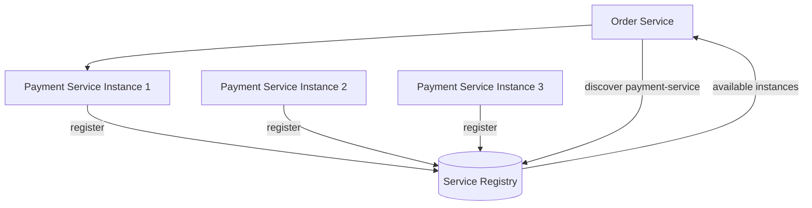

The central idea is:

> Services should not depend on fixed instance addresses. They should discover healthy service instances at runtime.

---

#### Why this pattern exists

Modern infrastructure is dynamic.

In containerized and cloud-native environments:

- service instances scale up and down,
- containers restart,
- nodes fail,
- deployments replace old instances with new ones,
- autoscaling adds capacity,
- service mesh proxies route traffic,
- instances move across hosts,
- IP addresses change,
- regions and availability zones may shift traffic.

A service instance that exists now may be gone a few seconds later.

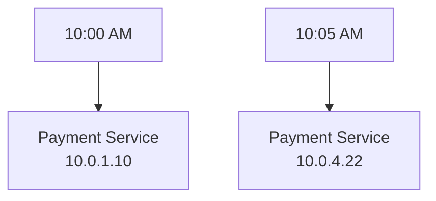

Hardcoded addresses do not work well in this environment.

Service Discovery exists because services need a reliable way to find each other without knowing physical deployment details.

---

#### What it solves

Service Discovery solves **location coupling**.

Location coupling happens when a service depends on the exact network address of another service.

Bad:

```ts
const paymentServiceUrl = "http://10.0.1.25:8080";
```

If that instance disappears, the caller fails.

Better:

```ts
const paymentServiceUrl = await serviceDiscovery.resolve("payment-service");
```

The caller depends on a logical service name, not a physical instance address.

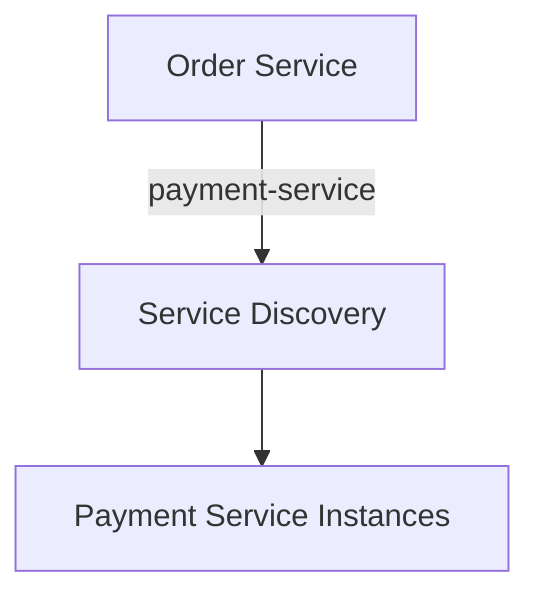

Service Discovery enables:

- dynamic routing,
- horizontal scaling,
- failover,
- rolling deployments,
- blue-green deployments,
- canary releases,
- service-to-service communication,
- infrastructure abstraction.

---

#### Basic concepts

Service Discovery usually involves the following concepts.

| Concept | Meaning |
|---|---|
| Service name | Logical name such as `payment-service` |
| Service instance | One running copy of a service |
| Registry | Directory of service instances |
| Registration | Instance announces itself to the registry |
| Deregistration | Instance is removed from the registry |
| Health check | Determines whether instance should receive traffic |
| Resolver | Client-side or infrastructure component that looks up instances |
| Load balancing | Choosing which instance receives a request |

Basic flow:

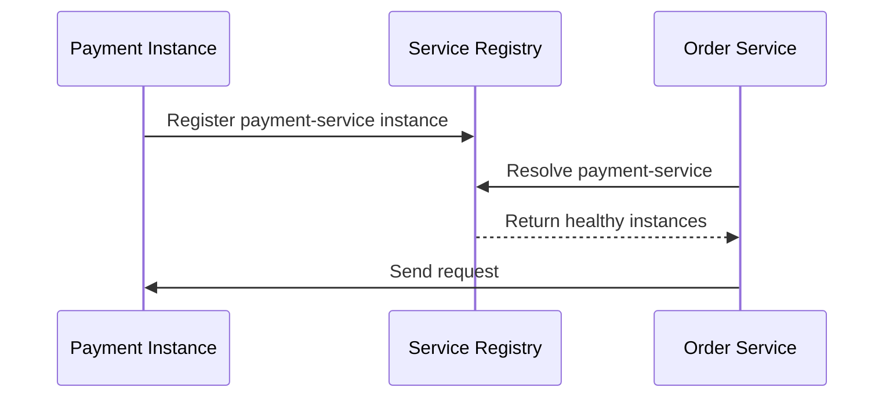

---

#### Service registration

Service registration is how an instance becomes discoverable.

There are two common approaches:

1. Self-registration
2. Platform-managed registration

---

#### Self-registration

In self-registration, the service instance registers itself.

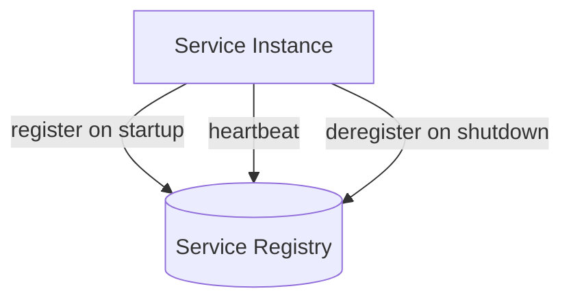

Example startup behavior:

```ts
async function startService() {
  await serviceRegistry.register({
    serviceName: "payment-service",
    instanceId: process.env.INSTANCE_ID,
    host: process.env.HOST_IP,
    port: Number(process.env.PORT),
    healthCheckUrl: `http://${process.env.HOST_IP}:${process.env.PORT}/health`
  });

  app.listen(process.env.PORT);
}
```

Self-registration gives the service direct control, but it adds registry logic to every service.

---

#### Platform-managed registration

In platform-managed registration, the runtime platform registers instances.

For example, in Kubernetes, services and endpoints are managed by the platform.

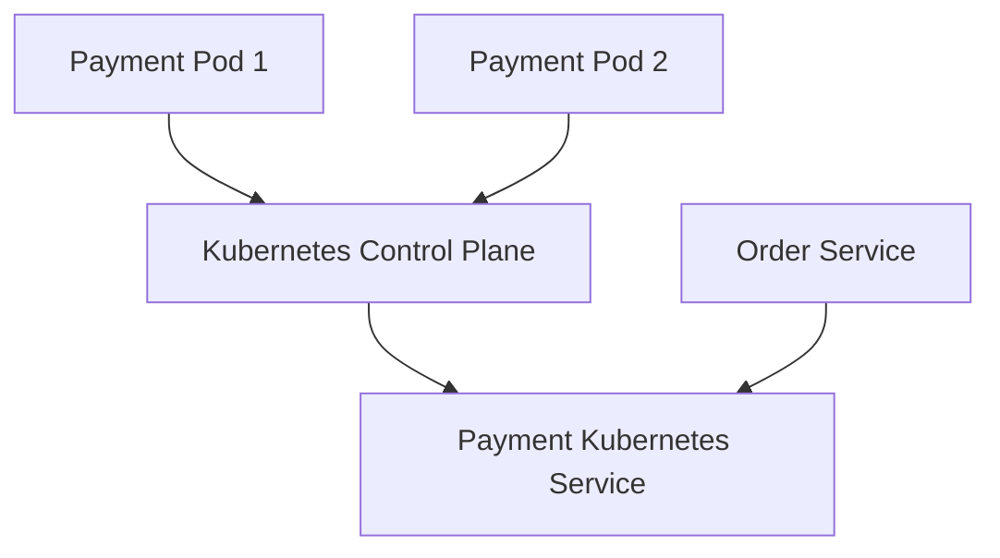

The application does not usually call the registry directly. It calls a stable service name, and the platform handles routing.

Example:

```text
http://payment-service.default.svc.cluster.local
```

This is often simpler for application teams.

---

#### Client-side discovery

In **client-side discovery**, the caller queries the registry and chooses an instance.

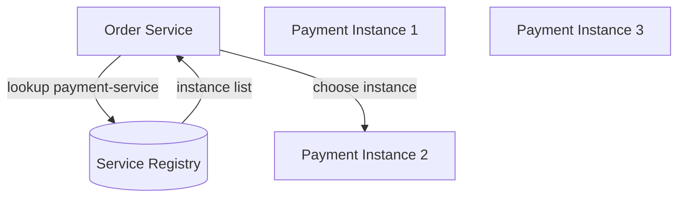

Example:

```ts
class ServiceClient {
  constructor(
    private readonly registry: ServiceRegistry,
    private readonly loadBalancer: LoadBalancer
  ) {}

  async postPaymentAuthorization(command: AuthorizePaymentCommand) {
    const instances = await this.registry.resolve("payment-service");

    const instance = this.loadBalancer.choose(instances);

    return fetch(`http://${instance.host}:${instance.port}/payment-authorizations`, {
      method: "POST",
      headers: {
        "Content-Type": "application/json"
      },
      body: JSON.stringify(command)
    });
  }
}
```

Benefits:

- caller has control,
- can use custom load balancing,
- can integrate with circuit breakers,
- can make routing decisions based on metadata.

Trade-offs:

- discovery logic is in client code,
- every language stack needs client support,
- stale cache handling is harder,
- caller complexity increases.

---

#### Server-side discovery

In **server-side discovery**, the caller sends requests to a stable endpoint such as a load balancer, gateway, proxy, or service mesh. The infrastructure chooses the backend instance.

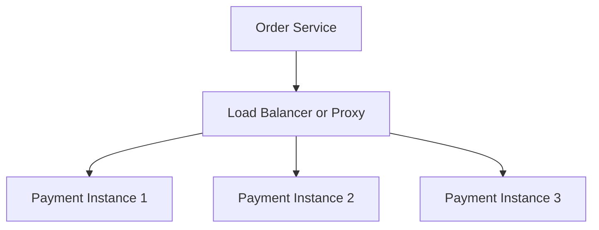

Benefits:

- simpler clients,
- language-independent,
- centralized routing,
- easier policy enforcement,
- common in Kubernetes and service mesh environments.

Trade-offs:

- routing infrastructure becomes critical,
- less client-specific control,
- misconfigured proxies can affect many services.

Most cloud-native systems use some form of server-side discovery through DNS, load balancers, Kubernetes Services, or service mesh proxies.

---

#### DNS-based discovery

DNS-based service discovery maps service names to IP addresses.

Example:

```text
payment-service.internal
```

A caller resolves the hostname and receives one or more IPs.

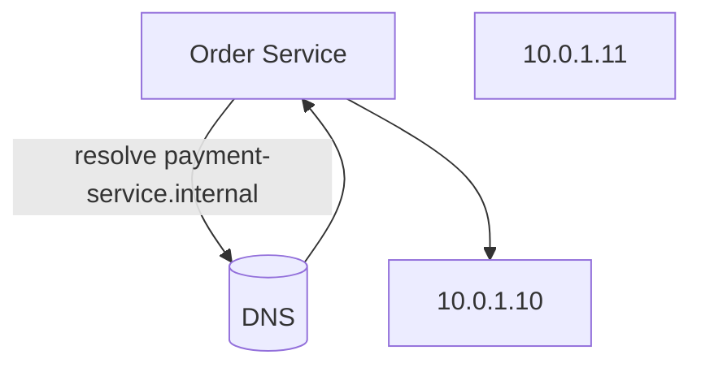

Benefits:

- simple,
- widely supported,
- language independent,
- works with standard networking libraries.

Trade-offs:

- DNS caching can cause stale routing,
- low TTLs increase DNS load,
- client libraries may cache DNS longer than expected,
- DNS does not express rich health or metadata well.

DNS discovery is common, but DNS caching behavior must be understood.

---

#### Service discovery with Kubernetes

In Kubernetes, a `Service` provides a stable name and virtual IP for a group of pods.

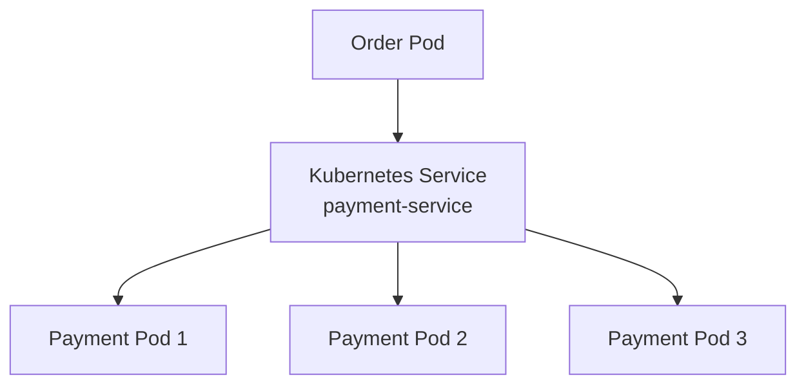

Application code calls:

```text
http://payment-service:8080
```

Kubernetes routes the request to one of the healthy payment pods.

This hides pod IP changes from the caller.

---

#### Service discovery with service mesh

A service mesh often uses sidecar proxies or node-level proxies to handle discovery, routing, retries, mTLS, and telemetry.

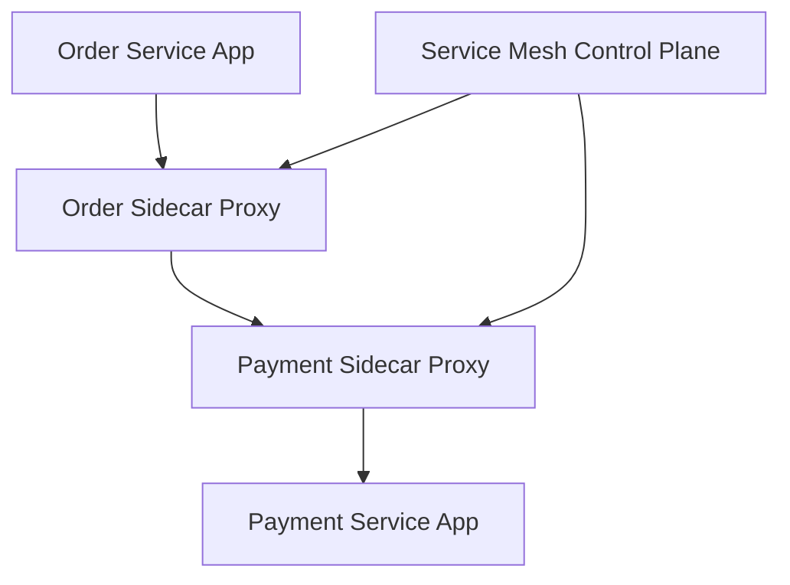

The application calls a logical service. The proxy handles discovery and routing.

Benefits:

- consistent service-to-service behavior,
- mTLS without application code,
- traffic policies outside application code,
- observability from proxies,
- retries and timeouts can be configured centrally.

Trade-offs:

- added infrastructure complexity,
- proxy overhead,
- more moving parts,
- mesh configuration becomes critical.

---

#### Metadata-based discovery

Service instances often include metadata.

Example metadata:

```json
{
  "serviceName": "payment-service",
  "instanceId": "payment-17",
  "host": "10.0.3.17",
  "port": 8080,
  "metadata": {
    "region": "us-east",
    "zone": "us-east-1a",
    "version": "2.4.1",
    "environment": "production",
    "supports": ["card", "wallet"]
  }
}
```

Metadata enables smarter routing:

- route to same region,
- avoid unhealthy zone,
- send canary traffic to version `2.5.0`,
- route tenant-specific traffic,
- select instances with specific capabilities.

Example:

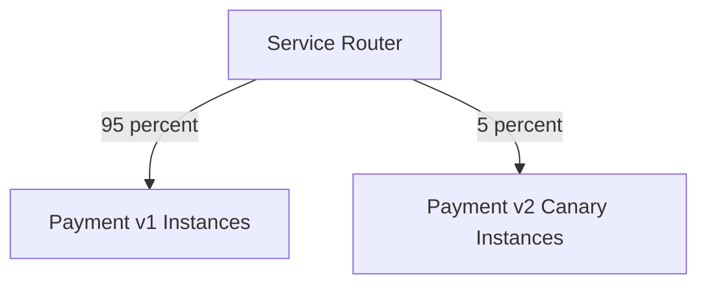

Metadata is powerful, but it must be accurate and governed.

---

#### Health and discovery

Discovery should consider health.

An instance should not receive traffic just because it exists. It should receive traffic only when it is ready and healthy enough.

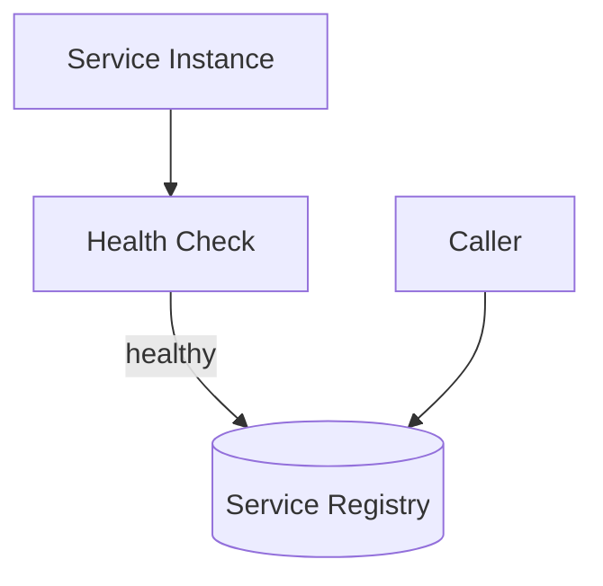

If an instance fails health checks, it should be removed from load balancing.

However, health checks must be designed carefully. Overly aggressive health checks can remove too many instances during a temporary dependency problem.

Health Check is covered in the resilience section, but it is closely related to Service Discovery.

---

#### Stale registry entries

A stale registry entry points to an instance that is no longer usable.

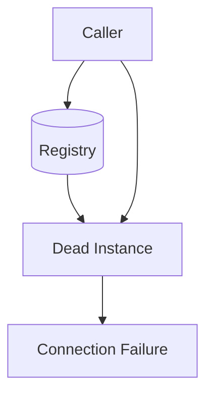

Stale entries can happen when:

- instance crashes without deregistering,
- network partition prevents heartbeat,
- registry replication lags,
- DNS records are cached,
- health check interval is too long,
- shutdown hooks do not run.

Mitigations:

- use heartbeat expiration,
- use readiness checks,
- use graceful shutdown,
- configure DNS TTL carefully,
- retry another instance on connection failure,
- use circuit breakers,
- drain instances before termination.

---

#### Graceful shutdown and deregistration

When a service instance shuts down, it should stop receiving new traffic before exiting.

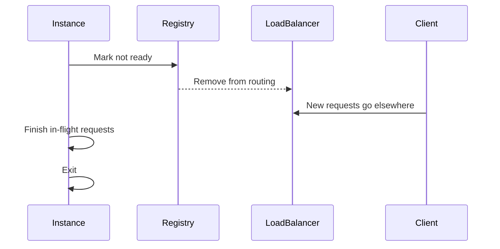

Example shutdown logic:

```ts
process.on("SIGTERM", async () => {
  logger.info("Received SIGTERM. Starting graceful shutdown.");

  await readinessState.markNotReady();

  await sleep(10_000);

  await server.close();

  await serviceRegistry.deregister({
    serviceName: "payment-service",
    instanceId: process.env.INSTANCE_ID
  });

  process.exit(0);
});
```

This helps prevent traffic from being sent to an instance that is in the middle of terminating.

---

#### Load balancing

Service Discovery is often paired with load balancing.

Common algorithms:

| Algorithm | Description |
|---|---|
| Round robin | Rotate across instances |
| Random | Pick random healthy instance |
| Least connections | Pick instance with fewer active connections |
| Weighted | Send more traffic to larger or preferred instances |
| Zone-aware | Prefer instances in same zone |
| Latency-aware | Prefer lower-latency instances |
| Consistent hashing | Route same key to same instance when useful |

Example weighted routing:

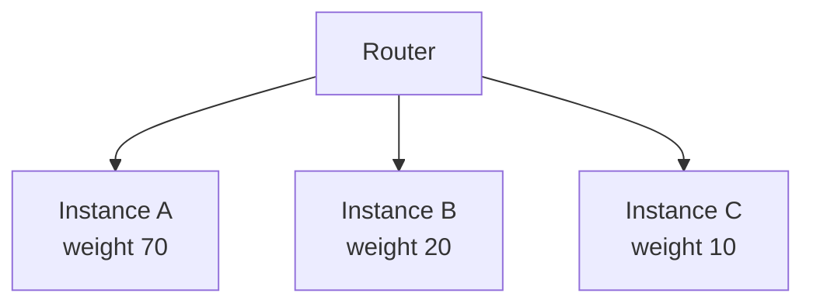

Load balancing should work with health checks, circuit breakers, retries, and timeouts.

---

#### Service Discovery and failover

When an instance fails, discovery should route traffic elsewhere.

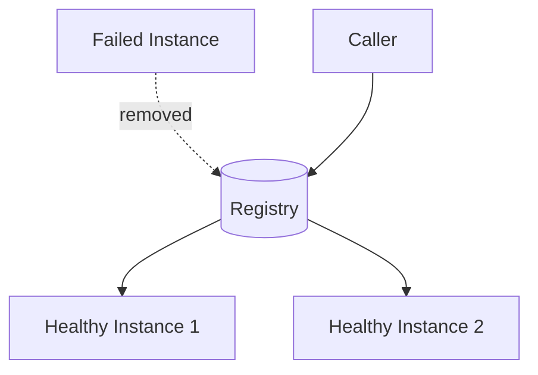

Failover requires:

- health detection,
- removal from routing,
- retry to another instance when safe,
- connection pool refresh,
- timeout configuration,
- observability.

Failover is not magic. If all instances are unhealthy, discovery cannot fix that.

---

#### Service Discovery and deployments

Service Discovery supports safer deployments.

For rolling deployment:

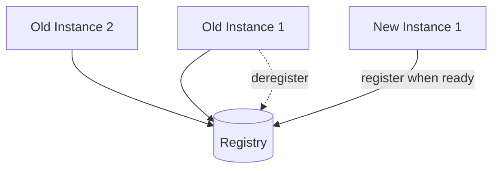

For canary deployment:

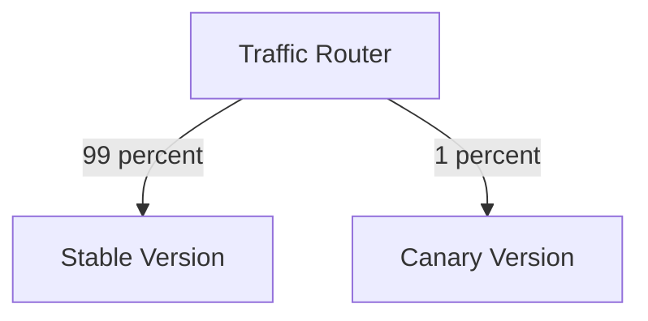

Service Discovery becomes the foundation for dynamic rollout patterns.

---

#### Security considerations

Service Discovery can expose sensitive topology information.

Protect:

- who can register services,
- who can query the registry,
- which metadata is visible,
- whether service identity is verified,
- whether discovery traffic is encrypted,
- whether fake instances can register,
- whether one tenant can discover another tenant’s services.

Bad:

```text
Any process can register itself as payment-service.
```

Better:

```text
Only workloads with payment-service identity can register payment-service instances.
```

In secure environments, discovery should integrate with workload identity, mTLS, and authorization.

---

#### Observability

Service Discovery should be observable.

Track:

- registered instances by service,
- healthy vs unhealthy instances,
- registration failures,
- deregistration failures,
- stale entries,
- registry latency,
- DNS resolution failures,
- service lookup failures,
- load balancing distribution,
- traffic by instance,
- failed connection attempts,
- instances by version and zone.

Example log:

```json
{
  "service": "order-service",
  "operation": "service_discovery",
  "targetService": "payment-service",
  "resolvedInstances": 3,
  "selectedInstance": "payment-17",
  "zone": "us-east-1a"
}
```

Example metric:

```text
service_discovery.instances_healthy{service="payment-service"} 12
```

During incidents, operators should be able to answer:

- Is the service registered?
- Are any instances healthy?
- Are callers resolving the correct instances?
- Is traffic going to the new version?
- Are stale instances still receiving traffic?

---

#### Testing Service Discovery

Useful tests include:

| Test type | Purpose |
|---|---|
| Registration test | Verify service registers correctly |
| Deregistration test | Verify service leaves registry on shutdown |
| Health integration test | Verify unhealthy instances are removed |
| Routing test | Verify callers resolve correct service |
| Failover test | Verify traffic moves away from failed instance |
| DNS cache test | Verify stale DNS does not cause long failures |
| Deployment test | Verify new instances receive traffic only when ready |
| Security test | Verify unauthorized services cannot register |

Example discovery test:

```ts
it("resolves only healthy payment-service instances", async () => {
  await registry.register({
    serviceName: "payment-service",
    instanceId: "payment-1",
    host: "10.0.0.1",
    port: 8080,
    healthy: true
  });

  await registry.register({
    serviceName: "payment-service",
    instanceId: "payment-2",
    host: "10.0.0.2",
    port: 8080,
    healthy: false
  });

  const instances = await registry.resolve("payment-service");

  expect(instances.map((instance) => instance.instanceId)).toEqual([
    "payment-1"
  ]);
});
```

---

#### When to use it

Use Service Discovery when:

- services run in dynamic infrastructure,
- instances scale up and down,
- IP addresses change,
- containers are rescheduled,
- deployments are frequent,
- services communicate with other services,
- failover is required,
- service mesh or Kubernetes is used,
- multiple versions or regions exist,
- hardcoded endpoints are becoming painful.

It is a basic requirement for most cloud-native microservice systems.

---

#### When not to use it

Service Discovery may be unnecessary when:

- the system has only a few static services,
- endpoints are stable,
- an external load balancer already provides stable routing,
- services do not call each other directly,
- infrastructure is simple and static.

Even then, logical names are usually better than hardcoded instance addresses.

---

#### Benefits

**1. Avoids hardcoded addresses**

Callers use logical service names instead of fixed IPs.

**2. Supports autoscaling**

New instances can be added dynamically.

**3. Supports failover**

Unhealthy instances can be removed from routing.

**4. Enables dynamic deployments**

Rolling, blue-green, and canary deployments become easier.

**5. Improves service-to-service communication**

Services can find each other reliably in dynamic environments.

**6. Supports metadata-based routing**

Routing can consider version, region, zone, or capability.

---

#### Trade-offs

**1. Discovery infrastructure must be reliable**

If the registry or discovery system fails, services may not find each other.

**2. Stale entries can cause failures**

Dead instances may remain discoverable for a time.

**3. DNS caching can be surprising**

Clients may keep old addresses longer than expected.

**4. More operational complexity**

Registry, health checks, routing, and load balancing need monitoring.

**5. Security must be enforced**

Fake or unauthorized service registration can be dangerous.

**6. Debugging can be harder**

Operators must inspect discovery state, routing, and instance health.

---

#### Common mistakes

**Mistake 1: Hardcoding instance addresses**

This breaks dynamic scaling and failover.

**Mistake 2: Registering before ready**

Instances should not receive traffic until they can handle requests.

**Mistake 3: Not deregistering during shutdown**

Traffic may be sent to terminating instances.

**Mistake 4: Ignoring DNS cache behavior**

Stale DNS can cause traffic failures even after registry updates.

**Mistake 5: Treating registration as health**

A registered instance is not necessarily a healthy instance.

**Mistake 6: No registry security**

Unauthorized workloads should not be able to register as critical services.

**Mistake 7: No observability**

Teams need visibility into instance health, routing, and discovery failures.

---

#### Practical design checklist

Before adopting or designing Service Discovery, ask:

- What logical service names exist?
- Who registers service instances?
- Is registration self-managed or platform-managed?
- How are unhealthy instances removed?
- How often are health checks performed?
- How does graceful shutdown work?
- How are stale entries handled?
- Is discovery client-side or server-side?
- Is DNS involved?
- What is the DNS TTL?
- Is there a service mesh?
- How is traffic load balanced?
- Is routing zone-aware or region-aware?
- How are canary versions discovered?
- Who can register a service?
- Who can query discovery data?
- How is discovery monitored?
- What happens if discovery infrastructure is unavailable?
- How do callers behave when no instances are available?

A Service Discovery design is probably healthy if:

- services use logical names,
- instances register only when ready,
- unhealthy instances are removed,
- graceful shutdown drains traffic,
- routing is observable,
- stale entries expire,
- security controls protect registration,
- callers have timeouts and circuit breakers.

A design is probably unhealthy if:

- callers hardcode IPs,
- dead instances remain in routing,
- services register before dependencies are ready,
- DNS caches stale addresses for too long,
- unauthorized services can register,
- no one can see current discovery state,
- discovery failures take down the whole system.

---

#### Related patterns

| Pattern | Relationship |
|---|---|
| API Gateway | Often routes to services discovered dynamically |
| Service Mesh | Provides discovery, routing, mTLS, retries, and telemetry |
| Health Check | Determines whether instances should receive traffic |
| Circuit Breaker | Protects callers when discovered dependencies fail |
| Retry | May retry against another discovered instance |
| External Configuration | Stores discovery endpoints, routing policies, and timeouts |
| Sidecar | Service mesh sidecars often implement discovery and routing |
| Load Balancing | Uses discovered instances to distribute traffic |

---

#### Summary

Service Discovery allows services to find available service instances dynamically. A Service Registry stores information about those instances.

The central idea is:

> Services should depend on logical service names, not fixed physical instance addresses.

This pattern is essential in containerized, autoscaling, cloud-native, and service mesh environments. It enables dynamic routing, scaling, failover, rolling deployments, canaries, and service-to-service communication.

A good Service Discovery design includes:

- reliable registration,
- readiness-aware routing,
- health-based removal,
- graceful shutdown,
- stale entry expiration,
- secure registration,
- load balancing,
- and observability.

The trade-off is operational complexity. Discovery infrastructure must be reliable, secure, and well monitored. Stale entries, DNS caching, and bad health checks can still cause traffic failures.

---

### 32. External Configuration

#### What it is

**External Configuration** stores application configuration outside the application code and outside immutable deployment artifacts.

Instead of hardcoding values into source code, services read configuration from the environment, files, a configuration service, secret manager, feature flag platform, or runtime control plane.

Bad:

```ts
const paymentServiceUrl = "https://payments-prod.example.com";
const timeoutMs = 5000;
const retryAttempts = 3;
```

Better:

```ts
const paymentServiceUrl = config.get("PAYMENT_SERVICE_URL");
const timeoutMs = config.getNumber("PAYMENT_TIMEOUT_MS");
const retryAttempts = config.getNumber("PAYMENT_RETRY_ATTEMPTS");
```

The central idea is:

> Code should define behavior. Configuration should control environment-specific and operational values.

Configuration commonly includes:

- service endpoints,
- timeouts,
- retry policies,
- feature flags,
- credentials,
- database connection strings,
- queue names,
- region settings,
- log levels,
- rate limits,
- circuit breaker thresholds,
- cache TTLs,
- tenant-specific settings.

---

#### Why this pattern exists

Applications usually run in multiple environments.

For example:

| Environment | Payment endpoint |
|---|---|
| Local | `http://localhost:8081` |
| Staging | `https://payments-staging.internal` |
| Production | `https://payments.internal` |

The code should not need to change for each environment.

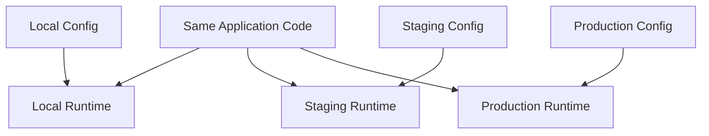

External Configuration exists so the same artifact can run in different environments with different settings.

This supports:

- immutable builds,
- environment promotion,
- faster operational changes,
- safer deployments,
- feature flagging,
- runtime tuning,
- secret rotation.

---

#### What it solves

External Configuration solves the problem of **rebuilding or redeploying code just to change runtime values**.

Without it, changing a timeout or endpoint requires a code change:

```mermaid
flowchart TD
    ConfigChange[Need to change timeout]
    CodeChange[Modify code]
    Build[Build artifact]
    Test[Test artifact]
    Deploy[Deploy artifact]

    ConfigChange --> CodeChange
    CodeChange --> Build
    Build --> Test
    Test --> Deploy
```

With External Configuration, many operational values can change without rebuilding the application:

```mermaid
flowchart TD
    ConfigChange[Change timeout config]
    ConfigStore[Config Store]
    Service[Service reloads or restarts with new config]

    ConfigChange --> ConfigStore
    ConfigStore --> Service
```

This is especially useful for:

- changing timeouts during incidents,
- disabling a risky feature,
- rotating credentials,
- changing rate limits,
- moving traffic between endpoints,
- tuning retries,
- enabling debug logging temporarily,
- switching providers.

---

#### What counts as configuration

Configuration is any value that changes between environments, deployments, tenants, or operational situations.

Examples:

```yaml
server:
  port: 8080

database:
  host: orders-db.internal
  maxPoolSize: 20

payments:
  baseUrl: https://payment-service.internal
  timeoutMs: 2000
  retryAttempts: 2

features:
  newCheckoutFlow: false

circuitBreakers:
  paymentService:
    failureThreshold: 0.5
    cooldownMs: 30000
```

However, not every value should be configuration.

Bad:

```yaml
orderStateMachine:
  allowShippedToPending: true
```

If this changes core business rules, it may belong in code and tests, not runtime configuration.

A useful distinction:

| Type | Example | Usually external config? |
|---|---|---|
| Environment value | Database host | Yes |
| Operational tuning | Timeout | Yes |
| Secret | API key | Yes, via secret manager |
| Feature rollout | Enable new UI | Yes |
| Business rule | Refund eligibility | Sometimes, with strong governance |
| Core invariant | Payment cannot be negative | No |
| Algorithm implementation | How to calculate tax | Usually code |

External Configuration should not become an untested programming language hidden outside code.

---

#### Common configuration sources

Configuration can come from several places.

| Source | Common use |
|---|---|
| Environment variables | Simple deployment-specific values |
| Config files | Structured application configuration |
| Secret manager | Passwords, tokens, certificates |
| Configuration service | Centralized dynamic config |
| Feature flag platform | Runtime feature rollout |
| Kubernetes ConfigMaps | Non-secret Kubernetes config |
| Kubernetes Secrets | Secret Kubernetes config |
| Command-line arguments | Startup parameters |
| Service mesh control plane | Routing, retries, mTLS policy |

A service may combine multiple sources.

```mermaid
flowchart TD
    Env[Environment Variables]
    ConfigFile[Config File]
    SecretManager[Secret Manager]
    FeatureFlags[Feature Flag Service]

    ConfigLoader[Configuration Loader]
    Service[Service]

    Env --> ConfigLoader
    ConfigFile --> ConfigLoader
    SecretManager --> ConfigLoader
    FeatureFlags --> ConfigLoader

    ConfigLoader --> Service
```

---

#### Environment variables

Environment variables are a simple external configuration mechanism.

Example:

```bash
ORDER_SERVICE_PORT=8080
PAYMENT_SERVICE_URL=https://payment-service.internal
PAYMENT_TIMEOUT_MS=2000
LOG_LEVEL=info
```

Application code:

```ts
type AppConfig = {
  port: number;
  paymentServiceUrl: string;
  paymentTimeoutMs: number;
  logLevel: string;
};

function loadConfig(): AppConfig {
  return {
    port: requireNumber("ORDER_SERVICE_PORT"),
    paymentServiceUrl: requireString("PAYMENT_SERVICE_URL"),
    paymentTimeoutMs: requireNumber("PAYMENT_TIMEOUT_MS"),
    logLevel: process.env.LOG_LEVEL ?? "info"
  };
}

function requireString(name: string): string {
  const value = process.env[name];

  if (!value) {
    throw new Error(`Missing required config: ${name}`);
  }

  return value;
}

function requireNumber(name: string): number {
  const value = requireString(name);
  const parsed = Number(value);

  if (!Number.isFinite(parsed)) {
    throw new Error(`Config ${name} must be a number`);
  }

  return parsed;
}
```

Environment variables are simple and widely supported, but they can become hard to manage when configuration is large or deeply nested.

---

#### Configuration files

Configuration files are useful for structured values.

Example:

```yaml
server:
  port: 8080

dependencies:
  paymentService:
    baseUrl: https://payment-service.internal
    timeoutMs: 2000
    retryAttempts: 2

logging:
  level: info
```

Benefits:

- structured,
- readable,
- versionable,
- good for local development,
- easy to validate.

Trade-offs:

- secrets should not be committed,
- changes may require restart,
- environment-specific files can drift,
- file mounting must be managed.

A common approach is to keep default config in the repository and override environment-specific values at deployment time.

---

#### Secret management

Secrets are a special kind of configuration.

Examples:

- database passwords,
- API tokens,
- private keys,
- certificates,
- OAuth client secrets,
- encryption keys.

Secrets should not be stored in source code or ordinary config files.

Bad:

```yaml
database:
  password: super-secret-password
```

Better:

```yaml
database:
  passwordRef: secret://prod/orders/database-password
```

Architecture:

```mermaid
flowchart TD
    Service[Service]
    SecretManager[(Secret Manager)]
    Database[(Database)]

    Service -->|fetch secret securely| SecretManager
    Service -->|connect using secret| Database
```

Secret management should include:

- encryption at rest,
- access control,
- audit logs,
- rotation,
- short-lived credentials when possible,
- least privilege,
- safe injection into runtime,
- no logging of secrets.

---

#### Feature flags

Feature flags are dynamic configuration used to enable or disable behavior.

Example:

```ts
if (await featureFlags.isEnabled("new-checkout-flow", userContext)) {
  return newCheckoutFlow(command);
}

return oldCheckoutFlow(command);
```

Feature flags support:

- gradual rollout,
- canary testing,
- A/B testing,
- emergency kill switches,
- tenant-specific features,
- dark launches,
- operational toggles.

```mermaid
flowchart TD
    Request[Request]
    FeatureFlag[Feature Flag Evaluation]

    OldFlow[Old Checkout Flow]
    NewFlow[New Checkout Flow]

    Request --> FeatureFlag

    FeatureFlag -->|disabled| OldFlow
    FeatureFlag -->|enabled| NewFlow
```

Feature flags are powerful, but they need lifecycle management.

Old flags should be removed after rollout. Otherwise, the codebase becomes full of permanent branches.

---

#### Configuration validation

Bad configuration can break good code.

For example:

```yaml
paymentTimeoutMs: -500
retryAttempts: 1000
```

This can cause failures or overload.

Validate configuration at startup.

```ts
type PaymentConfig = {
  baseUrl: string;
  timeoutMs: number;
  retryAttempts: number;
};

function validatePaymentConfig(config: PaymentConfig): void {
  if (!config.baseUrl.startsWith("https://")) {
    throw new Error("payments.baseUrl must use HTTPS");
  }

  if (config.timeoutMs < 100 || config.timeoutMs > 10000) {
    throw new Error("payments.timeoutMs must be between 100 and 10000");
  }

  if (config.retryAttempts < 0 || config.retryAttempts > 5) {
    throw new Error("payments.retryAttempts must be between 0 and 5");
  }
}
```

Failing fast is usually better than starting with invalid configuration.

```mermaid
flowchart TD
    Start[Service Startup]
    Load[Load Config]
    Validate[Validate Config]

    Valid{Valid?}

    Run[Start Service]
    Fail[Fail Startup]

    Start --> Load
    Load --> Validate
    Validate --> Valid

    Valid -->|yes| Run
    Valid -->|no| Fail
```

---

#### Configuration versioning

Configuration changes should be versioned or auditable.

A config change can be just as risky as a code change.

Example:

```yaml
paymentService:
  timeoutMs: 2000
  retryAttempts: 2
```

Changing retry attempts to `10` could overload the dependency during an outage.

Good configuration systems track:

- who changed the value,
- when it changed,
- what changed,
- why it changed,
- previous value,
- target environment,
- rollback option.

Example audit record:

```json
{
  "configKey": "paymentService.retryAttempts",
  "oldValue": 2,
  "newValue": 4,
  "changedBy": "operator@example.com",
  "changedAt": "2026-04-29T12:00:00Z",
  "reason": "Temporary mitigation during provider instability"
}
```

Operational configuration should have rollback.

---

#### Dynamic reload

Some configuration can be reloaded at runtime.

Examples:

- log level,
- feature flags,
- rate limits,
- circuit breaker thresholds,
- routing weights,
- cache TTLs.

Other configuration usually requires restart:

- server port,
- database connection string,
- fundamental dependency wiring,
- schema-related settings.

Dynamic reload architecture:

```mermaid
flowchart TD
    ConfigStore[(Config Store)]
    Watcher[Config Watcher]
    Service[Running Service]

    ConfigStore -->|change event| Watcher
    Watcher -->|reload safe values| Service
```

Example:

```ts
configWatcher.onChange("logging.level", (newLevel) => {
  logger.setLevel(newLevel);
});
```

Dynamic reload should be safe. Do not reload complex configuration halfway through a critical operation unless the service is designed for it.

---

#### Configuration precedence

Services often read configuration from multiple places.

Define precedence clearly.

Example precedence:

```text
1. Command-line arguments
2. Environment variables
3. Secret manager
4. Environment-specific config file
5. Default config file
```

Without clear precedence, debugging becomes painful.

Example problem:

```text
Why is payment timeout 5000ms in production?
```

The answer may be hidden in an environment variable overriding a config file.

A good service logs safe configuration sources at startup.

Do not log secret values.

---

#### Configuration and deployments

Configuration can make deployments safer.

For example, deploy code with a feature disabled:

```yaml
features:
  newCheckoutFlow: false
```

Then enable it gradually:

```yaml
features:
  newCheckoutFlow:
    enabled: true
    rolloutPercent: 5
```

```mermaid
flowchart TD
    Deploy[Deploy Code]
    Disabled[Feature Disabled]
    Enable5[Enable for 5 percent]
    Enable50[Enable for 50 percent]
    Enable100[Enable for 100 percent]

    Deploy --> Disabled
    Disabled --> Enable5
    Enable5 --> Enable50
    Enable50 --> Enable100
```

This separates deployment from release.

Deployment means the code is available.  
Release means users actually experience the feature.

---

#### Configuration and resilience policies

Timeouts, retries, and circuit breaker thresholds are often configured externally.

Example:

```yaml
dependencies:
  paymentService:
    timeoutMs: 1500
    retry:
      maxAttempts: 2
      backoffMs: 200
    circuitBreaker:
      failureThresholdPercent: 50
      minimumRequests: 20
      cooldownMs: 30000
```

This allows operators to tune behavior without code changes.

But these settings are dangerous if changed carelessly.

For example:

```yaml
retry:
  maxAttempts: 20
```

This can create a retry storm.

Resilience configuration should have guardrails.

---

#### Tenant-specific configuration

Multi-tenant systems may need tenant-specific settings.

Example:

```json
{
  "tenantId": "tenant_enterprise",
  "features": {
    "advancedReporting": true
  },
  "limits": {
    "maxUsers": 5000,
    "apiRequestsPerMinute": 10000
  }
}
```

Architecture:

```mermaid
flowchart TD
    Request[Request]
    TenantResolver[Tenant Resolver]
    TenantConfig[(Tenant Config Store)]
    Service[Service Behavior]

    Request --> TenantResolver
    TenantResolver --> TenantConfig
    TenantConfig --> Service
```

Tenant-specific config must be secured. A tenant should not be able to change its own limits unless explicitly allowed.

Tenant config should be auditable because it often affects entitlements, billing, and security.

---

#### Configuration drift

Configuration drift happens when environments differ unintentionally.

Example:

| Setting | Staging | Production |
|---|---:|---:|
| payment timeout | 2000ms | 10000ms |
| retries | 2 | 8 |
| feature enabled | false | true |

Some differences are intentional. Others are accidental.

Drift can cause:

- staging tests not matching production,
- production-only failures,
- confusing debugging,
- unsafe assumptions.

Mitigations:

- version config,
- compare environments,
- use templates,
- validate config,
- run config diff checks,
- document intentional differences.

---

#### Bad configuration failure modes

Bad configuration can cause severe outages.

Examples:

| Bad config | Possible result |
|---|---|
| Timeout too high | Thread exhaustion |
| Timeout too low | False failures |
| Retry count too high | Retry storm |
| Wrong database URL | Data corruption or outage |
| Wrong feature flag | Broken feature released |
| Bad rate limit | Legitimate traffic blocked |
| Wrong secret | Authentication failures |
| Disabled health check | Bad instances receive traffic |
| Over-strict health check | Good instances removed |

Configuration is production behavior. Treat it with the same seriousness as code.

---

#### Observability

Configuration should be observable.

Track:

- active config version,
- config load success,
- config validation failures,
- config reload events,
- feature flag evaluation errors,
- secret fetch failures,
- config source latency,
- last config update time,
- rollback events.

Example startup log:

```json
{
  "service": "order-service",
  "configVersion": "2026-04-29.7",
  "environment": "production",
  "region": "us-east",
  "loadedConfigSources": ["env", "secret-manager", "config-service"],
  "status": "config_validated"
}
```

Do not log secrets.

During an incident, operators should know whether a config change happened shortly before the failure.

---

#### Testing configuration

Useful tests include:

| Test type | Purpose |
|---|---|
| Schema validation tests | Verify required keys and types |
| Range tests | Verify values are safe |
| Environment config tests | Verify staging/prod config is valid |
| Secret reference tests | Verify secret paths exist |
| Feature flag tests | Verify both enabled and disabled paths |
| Rollback tests | Verify config can revert |
| Dynamic reload tests | Verify reload behavior is safe |
| Drift tests | Verify unexpected environment differences are caught |

Example config validation test:

```ts
it("rejects retry attempts above safe limit", () => {
  expect(() =>
    validateConfig({
      paymentService: {
        timeoutMs: 2000,
        retryAttempts: 100
      }
    })
  ).toThrow("retryAttempts must be between 0 and 5");
});
```

Test both feature flag states:

```ts
it("uses old checkout flow when new checkout flag is disabled", async () => {
  featureFlags.set("new-checkout-flow", false);

  const result = await checkoutService.checkout(command);

  expect(result.flowUsed).toBe("old");
});

it("uses new checkout flow when new checkout flag is enabled", async () => {
  featureFlags.set("new-checkout-flow", true);

  const result = await checkoutService.checkout(command);

  expect(result.flowUsed).toBe("new");
});
```

---

#### When to use it

Use External Configuration for:

- environment-specific values,
- service endpoints,
- timeouts,
- retry policies,
- circuit breaker thresholds,
- credentials and secrets,
- feature flags,
- rate limits,
- tenant settings,
- logging levels,
- queue names,
- cache TTLs,
- deployment-specific parameters.

It is especially important when the same artifact is promoted across environments.

---

#### When not to use it

Avoid externalizing:

- core business invariants,
- complex algorithms,
- untested business logic,
- values that should be compile-time constants,
- settings nobody understands,
- configuration that creates too many behavior combinations.

If a setting changes business behavior significantly, it needs tests, review, ownership, and rollout discipline.

---

#### Benefits

**1. Improves operational flexibility**

Settings can change without modifying code.

**2. Supports environment portability**

The same artifact can run in local, staging, and production.

**3. Enables safer rollout**

Feature flags separate deployment from release.

**4. Supports incident response**

Timeouts, limits, and flags can be adjusted during incidents.

**5. Improves secret handling**

Secrets can be managed outside code.

**6. Reduces rebuilds**

Code does not need to be rebuilt for every environment-specific value.

---

#### Trade-offs

**1. Bad config can break good code**

Configuration changes can cause outages.

**2. More runtime dependencies**

Config stores and secret managers must be available.

**3. Debugging can be harder**

Behavior depends on external state.

**4. Drift can occur**

Environments may differ unintentionally.

**5. Secrets require careful handling**

Leaks can be severe.

**6. Too many flags create complexity**

Feature flags and config branches must be cleaned up.

---

#### Common mistakes

**Mistake 1: Storing secrets in source code**

Secrets belong in secret managers, not repositories.

**Mistake 2: No validation**

Services should fail fast on invalid config.

**Mistake 3: Logging secrets**

Never log sensitive values.

**Mistake 4: Treating config changes as harmless**

Config changes can be production changes.

**Mistake 5: No rollback**

Every risky config change should be reversible.

**Mistake 6: Too many permanent feature flags**

Old flags should be removed.

**Mistake 7: No audit trail**

Operators need to know what changed and who changed it.

**Mistake 8: Dynamic reload of unsafe settings**

Not every setting can be changed safely at runtime.

---

#### Practical design checklist

Before implementing External Configuration, ask:

- What values should be externalized?
- What values should remain in code?
- Where is configuration stored?
- How are secrets stored?
- How is configuration loaded?
- What happens if config cannot be loaded?
- Is configuration validated at startup?
- Are safe ranges enforced?
- Can configuration be reloaded dynamically?
- Which settings require restart?
- Who can change production config?
- Is there an audit trail?
- Is rollback possible?
- Are feature flags cleaned up?
- Are secrets rotated?
- Are config changes monitored?
- Are environment differences intentional?
- Are secret values protected from logs and error messages?

A configuration design is probably healthy if:

- required values are validated,
- secrets are managed securely,
- changes are auditable,
- rollback is possible,
- feature flags have owners,
- unsafe values are rejected,
- config versions are observable,
- environments are consistent except where intentionally different.

A design is probably unhealthy if:

- secrets live in code,
- services start with invalid config,
- anyone can change production config without review,
- config changes are not tracked,
- old feature flags accumulate,
- behavior differs mysteriously between environments,
- dynamic reload changes unsafe values mid-flight.

---

#### Related patterns

| Pattern | Relationship |
|---|---|
| Service Discovery | Service endpoints may be configured or discovered dynamically |
| Circuit Breaker | Thresholds and cooldowns are often configured externally |
| Retry | Retry policies should be configurable with guardrails |
| API Gateway | Routing, rate limits, and auth policies often use external config |
| Sidecar | Sidecars often receive config from a control plane |
| Health Check | Health check thresholds may be configuration-driven |
| Feature Flags | A specialized form of external configuration |
| Secret Management | Secure handling of sensitive configuration |
| Service Mesh | Mesh policies are often external runtime configuration |

---

#### Summary

External Configuration stores application configuration outside code and deployment artifacts.

The central idea is:

> Build one artifact. Configure it for each environment and operational situation.

This pattern is useful for environment-specific values, service endpoints, timeouts, retry policies, credentials, feature flags, rate limits, tenant settings, and operational tuning.

A good External Configuration design includes:

- clear config ownership,
- validation,
- safe defaults,
- secret management,
- auditability,
- rollback,
- versioning,
- observability,
- and guardrails for dangerous settings.

The trade-off is that configuration becomes part of production behavior. Bad configuration can break good code, so it must be validated, reviewed, monitored, and reversible.

---

### 33. Sidecar

#### What it is

A **Sidecar** is a helper process or container that runs alongside a main service and provides supporting capabilities.

The sidecar is deployed as part of the same runtime unit as the application.

In Kubernetes, this often means two containers in the same pod:

```mermaid
flowchart TD
    Pod[Pod]

    App[Main Application Container]
    Sidecar[Sidecar Container]

    Pod --> App
    Pod --> Sidecar
```

The main application focuses on business logic. The sidecar handles infrastructure concerns.

Common sidecar responsibilities include:

- service mesh proxying,
- TLS and mTLS,
- metrics collection,
- log shipping,
- certificate rotation,
- configuration reloading,
- local caching,
- security monitoring,
- policy enforcement,
- request tracing,
- database proxying.

The central idea is:

> Put reusable infrastructure behavior beside the application instead of embedding it inside every application.

---

#### Why this pattern exists

Microservices often need the same infrastructure capabilities.

For example, every service may need:

- logging,
- metrics,
- tracing,
- service discovery,
- retries,
- mTLS,
- certificate rotation,
- access policy enforcement,
- configuration watching,
- traffic routing.

One approach is to implement these capabilities in every service.

```mermaid
flowchart TD
    ServiceA[Service A<br/>business logic + infra code]
    ServiceB[Service B<br/>business logic + infra code]
    ServiceC[Service C<br/>business logic + infra code]
```

This creates duplication.

Problems:

- every language needs its own implementation,
- behavior becomes inconsistent,
- upgrades are slow,
- security fixes require many code changes,
- teams duplicate infrastructure concerns,
- business code becomes cluttered.

A sidecar extracts common infrastructure into a colocated helper.

```mermaid
flowchart TD
    ServiceA[Service A]
    SidecarA[Sidecar]

    ServiceB[Service B]
    SidecarB[Sidecar]

    ServiceC[Service C]
    SidecarC[Sidecar]

    ServiceA --> SidecarA
    ServiceB --> SidecarB
    ServiceC --> SidecarC
```

The application can stay simpler.

---

#### What it solves

Sidecar solves the problem of **duplicated infrastructure logic inside every service**.

Without sidecars, each service may need to implement:

```text
business logic
logging
metrics
TLS
service discovery
retry logic
tracing
certificate rotation
policy checks
```

With sidecars, common infrastructure can be handled externally.

```mermaid
flowchart TD
    App[Application<br/>business logic]
    Sidecar[Sidecar<br/>infrastructure behavior]

    App --> Sidecar
```

This is especially valuable in polyglot systems where services are written in different languages.

A sidecar can provide the same infrastructure behavior for Java, Go, Node.js, Python, and Rust services.

---

#### Basic sidecar structure

A sidecar usually shares some runtime context with the main application.

It may share:

- network namespace,
- local filesystem volume,
- environment,
- lifecycle,
- pod or VM,
- localhost communication.

Example:

```mermaid
flowchart TD
    Pod[Runtime Unit]

    App[Application<br/>localhost:8080]
    Proxy[Sidecar Proxy<br/>localhost:15001]
    ConfigVolume[(Shared Config Volume)]
    Logs[(Shared Log Volume)]

    Pod --> App
    Pod --> Proxy
    Pod --> ConfigVolume
    Pod --> Logs

    App --> ConfigVolume
    App --> Logs
    Proxy --> ConfigVolume
```

The exact structure depends on the platform.

---

#### Service mesh sidecar

One of the most common sidecar uses is a service mesh proxy.

```mermaid
flowchart TD
    OrderApp[Order App]
    OrderProxy[Order Sidecar Proxy]

    PaymentProxy[Payment Sidecar Proxy]
    PaymentApp[Payment App]

    ControlPlane[Mesh Control Plane]

    OrderApp --> OrderProxy
    OrderProxy --> PaymentProxy
    PaymentProxy --> PaymentApp

    ControlPlane --> OrderProxy
    ControlPlane --> PaymentProxy
```

The sidecar proxy may handle:

- service discovery,
- load balancing,
- mTLS,
- retries,
- timeouts,
- circuit breaking,
- traffic splitting,
- telemetry,
- authorization policies.

The application sends traffic locally. The sidecar handles network behavior.

```text
Order App -> local sidecar -> remote sidecar -> Payment App
```

This keeps networking policy out of application code.

---

#### Logging sidecar

A logging sidecar collects and ships logs.

```mermaid
flowchart TD
    App[Application]
    LogFile[(Shared Log File)]
    LogSidecar[Log Shipping Sidecar]
    LogPlatform[(Log Platform)]

    App --> LogFile
    LogSidecar --> LogFile
    LogSidecar --> LogPlatform
```

The application writes logs locally. The sidecar forwards them to a central log system.

Benefits:

- consistent log shipping,
- application does not know log platform details,
- language-independent,
- log agent can be updated separately.

Trade-offs:

- extra container,
- shared volume complexity,
- log backpressure must be handled.

---

#### Metrics sidecar

A metrics sidecar can scrape, transform, or forward metrics.

```mermaid
flowchart TD
    App[Application<br/>/metrics]
    MetricsSidecar[Metrics Sidecar]
    MetricsBackend[(Metrics Backend)]

    MetricsSidecar -->|scrape| App
    MetricsSidecar -->|forward| MetricsBackend
```

This is useful when:

- applications expose metrics in different formats,
- metrics need local aggregation,
- metrics need authentication,
- metrics backend details should be hidden,
- common tags should be added.

Example sidecar-added tags:

```json
{
  "service": "order-service",
  "pod": "order-7f8d",
  "region": "us-east",
  "environment": "production"
}
```

---

#### Certificate rotation sidecar

A sidecar can fetch and rotate certificates for the application.

```mermaid
flowchart TD
    CertManager[(Certificate Authority or Secret Manager)]
    CertSidecar[Certificate Sidecar]
    SharedVolume[(Shared Certificate Volume)]
    App[Application]

    CertSidecar --> CertManager
    CertSidecar --> SharedVolume
    App --> SharedVolume
```

The sidecar handles:

- certificate renewal,
- private key storage,
- writing certs to a shared volume,
- notifying the app or proxy to reload,
- rotation before expiry.

This keeps certificate lifecycle logic out of application code.

---

#### Configuration reloader sidecar

A configuration sidecar can watch configuration changes and update local files.

```mermaid
flowchart TD
    ConfigStore[(Config Store)]
    ConfigSidecar[Config Sidecar]
    ConfigFile[(Local Config File)]
    App[Application]

    ConfigStore --> ConfigSidecar
    ConfigSidecar --> ConfigFile
    App --> ConfigFile
```

The sidecar may:

- poll a config service,
- watch for changes,
- validate downloaded config,
- write config to disk,
- signal the application to reload.

This pattern is useful when applications prefer file-based configuration but the platform uses a central config store.

---

#### Local cache sidecar

A sidecar can provide local caching.

```mermaid
flowchart TD
    App[Application]
    CacheSidecar[Local Cache Sidecar]
    RemoteService[Remote Dependency]

    App -->|localhost| CacheSidecar
    CacheSidecar -->|cache miss| RemoteService
```

Benefits:

- faster local reads,
- less load on remote service,
- shared cache logic,
- language-independent cache client.

Trade-offs:

- stale data,
- cache invalidation complexity,
- memory overhead per instance,
- sidecar failure can affect app behavior.

---

#### Security sidecar

A security sidecar can enforce or assist with security controls.

Examples:

- request authorization,
- token validation,
- mTLS,
- policy checks,
- secret retrieval,
- audit event forwarding,
- runtime threat detection.

```mermaid
flowchart TD
    Client[Client]
    SecuritySidecar[Security Sidecar]
    App[Application]

    Client --> SecuritySidecar
    SecuritySidecar -->|authorized| App
    SecuritySidecar -. denied .-> Client
```

Security sidecars can provide consistent policy enforcement, but they must be trusted and carefully configured.

Do not assume the application can ignore security entirely. Critical authorization rules may still belong in application code.

---

#### Sidecar vs shared library

A common alternative to sidecars is a shared library.

Shared library:

```mermaid
flowchart TD
    App[Application]
    Library[Infrastructure Library]

    App --> Library
```

Sidecar:

```mermaid
flowchart TD
    App[Application]
    Sidecar[Infrastructure Sidecar]

    App --> Sidecar
```

Comparison:

| Concern | Shared library | Sidecar |
|---|---|---|
| Language support | Requires library per language | Language-independent |
| Runtime overhead | Lower | Higher |
| Upgrade model | Requires app rebuild/redeploy | May be updated independently |
| Operational complexity | Lower | Higher |
| Network features | Harder to standardize | Strong fit |
| Business logic integration | Easier | Weaker |
| Observability | In-process detail | Proxy/process-level detail |

Use a shared library when the behavior needs deep application integration.

Use a sidecar when the behavior can be handled outside the app process and should be standardized across languages.

---

#### Sidecar vs daemon

A daemon runs once per host or node.

A sidecar runs beside each application instance.

```mermaid
flowchart TD
    Node[Node]

    App1[App Instance 1]
    Sidecar1[Sidecar 1]

    App2[App Instance 2]
    Sidecar2[Sidecar 2]

    Daemon[Node Daemon]

    Node --> App1
    Node --> Sidecar1
    Node --> App2
    Node --> Sidecar2
    Node --> Daemon
```

Sidecar benefits:

- per-service configuration,
- strong isolation,
- local communication,
- per-instance lifecycle.

Daemon benefits:

- lower resource overhead,
- one agent per node,
- simpler for host-level tasks.

Use sidecars for service-specific behavior. Use daemons for node-level behavior.

---

#### Sidecar lifecycle

Sidecar lifecycle must be coordinated with the application.

Questions:

- Should sidecar start before the app?
- What happens if the sidecar is not ready?
- What happens if the sidecar crashes?
- Should app exit when sidecar exits?
- Should sidecar drain after app stops?
- How are readiness checks coordinated?

```mermaid
sequenceDiagram
    participant Sidecar
    participant App
    participant Platform

    Platform->>Sidecar: Start sidecar
    Sidecar->>Sidecar: Become ready
    Platform->>App: Start app
    App->>Platform: Ready
    Platform->>App: Stop app
    App->>App: Drain requests
    Platform->>Sidecar: Stop sidecar
```

Bad lifecycle coordination can cause outages.

For example, if the app starts before the proxy is ready, outbound calls may fail.

---

#### Sidecar failure modes

Sidecars introduce new failure modes.

Examples:

| Failure | Impact |
|---|---|
| Proxy sidecar crashes | App loses network access |
| Log sidecar stalls | Disk fills with logs |
| Metrics sidecar fails | Observability gap |
| Config sidecar writes bad config | App misbehaves |
| Cert sidecar fails rotation | TLS certificates expire |
| Cache sidecar stale data | App returns old data |
| Security sidecar misconfigured | Legitimate traffic blocked |

A sidecar is not free. It becomes part of the service’s runtime dependency chain.

```mermaid
flowchart TD
    App[Application]
    Sidecar[Sidecar]
    Dependency[External Dependency]

    App --> Sidecar
    Sidecar --> Dependency

    SidecarFailure[Sidecar failure affects app]
    Sidecar --> SidecarFailure
```

Monitor sidecars like production components.

---

#### Resource overhead

Every sidecar consumes resources.

If each service instance has a sidecar, total overhead can be significant.

```mermaid
flowchart TD
    Pod1[App + Sidecar]
    Pod2[App + Sidecar]
    Pod3[App + Sidecar]
    Pod4[App + Sidecar]

    Overhead[CPU and memory overhead multiplied per instance]

    Pod1 --> Overhead
    Pod2 --> Overhead
    Pod3 --> Overhead
    Pod4 --> Overhead
```

Resource overhead includes:

- CPU,
- memory,
- network latency,
- disk usage,
- startup time,
- configuration complexity.

For high-density environments, this matters.

Sidecars should have resource requests and limits.

---

#### Sidecar configuration

Sidecars need configuration too.

Example service mesh sidecar config:

```yaml
outbound:
  payment-service:
    timeoutMs: 1500
    retries: 2
    circuitBreaker:
      maxFailures: 10
      cooldownMs: 30000

mTLS:
  enabled: true

telemetry:
  tracing:
    samplingPercent: 10
```

Sidecar configuration should be:

- versioned,
- validated,
- observable,
- auditable,
- rolled out safely.

A bad sidecar config can break many services.

---

#### Sidecar and application boundaries

The sidecar should not contain business logic.

Good sidecar responsibilities:

- network routing,
- TLS,
- logging,
- metrics,
- tracing,
- config reload,
- local cache,
- policy enforcement.

Bad sidecar responsibilities:

- deciding whether an order can be cancelled,
- calculating billing amounts,
- applying refund eligibility rules,
- choosing shipping options based on business policy,
- performing domain-specific workflow decisions.

Business logic belongs in services.

Sidecars should support infrastructure concerns.

---

#### Example Kubernetes-style sidecar

A simplified pod structure:

```yaml
apiVersion: v1
kind: Pod
metadata:
  name: order-service
spec:
  containers:
    - name: app
      image: order-service:1.4.2
      ports:
        - containerPort: 8080

    - name: log-sidecar
      image: log-shipper:2.1.0
      volumeMounts:
        - name: logs
          mountPath: /var/log/app

  volumes:
    - name: logs
      emptyDir: {}
```

The application writes logs to `/var/log/app`.

The sidecar ships logs from that shared directory.

---

#### Observability

Sidecars need their own observability.

Track:

- sidecar CPU and memory,
- sidecar restart count,
- proxy latency,
- proxy error rate,
- dropped requests,
- mTLS handshake failures,
- certificate expiry,
- log shipping lag,
- metrics forwarding errors,
- config reload failures,
- sidecar version,
- policy denial count.

Example sidecar log:

```json
{
  "component": "service-mesh-sidecar",
  "service": "order-service",
  "outboundService": "payment-service",
  "status": 200,
  "latencyMs": 47,
  "mTLS": true,
  "retryAttempt": 0
}
```

During incidents, operators should know whether the failure is in the application or the sidecar.

---

#### Testing sidecars

Useful tests include:

| Test type | Purpose |
|---|---|
| Startup test | Verify sidecar is ready before app traffic |
| Connectivity test | Verify app can reach dependencies through sidecar |
| Policy test | Verify allowed and denied requests |
| mTLS test | Verify certificates work |
| Config reload test | Verify sidecar applies new config safely |
| Failure test | Verify app behavior when sidecar crashes |
| Resource test | Verify sidecar overhead is acceptable |
| Upgrade test | Verify sidecar version changes are safe |

Example connectivity test:

```ts
it("routes payment requests through local sidecar", async () => {
  const response = await fetch("http://localhost:15001/payment-service/health");

  expect(response.status).toBe(200);
});
```

For service mesh sidecars, test both application behavior and mesh policy behavior.

---

#### When to use it

Use the Sidecar pattern when:

- many services need the same infrastructure capability,
- services are written in multiple languages,
- behavior can be handled outside application code,
- you need consistent service-to-service networking,
- you need mTLS or service mesh capabilities,
- you need log or metric collection beside the app,
- you need certificate rotation,
- you need local config reloaders,
- you need local caching or proxy behavior.

Common examples:

- service mesh proxies,
- logging agents,
- metrics agents,
- security agents,
- certificate agents,
- config reloaders,
- local proxy caches.

---

#### When not to use it

Avoid sidecars when:

- a shared library is simpler and sufficient,
- the behavior needs deep application integration,
- resource overhead is too high,
- operational maturity is low,
- the sidecar would contain business logic,
- the platform already provides the capability at node level,
- debugging would become too difficult,
- the team cannot monitor or support the sidecar.

Do not add sidecars casually. They become part of the runtime architecture.

---

#### Benefits

**1. Reduces duplicated infrastructure code**

Common capabilities do not need to be reimplemented in every service.

**2. Supports polyglot systems**

Sidecars work across application languages.

**3. Keeps application code focused**

Business logic stays separate from infrastructure concerns.

**4. Enables consistent networking**

Service mesh sidecars can standardize mTLS, retries, routing, and telemetry.

**5. Can be updated independently**

Some sidecars can be upgraded without changing application code.

**6. Improves operational consistency**

Logging, metrics, and security behavior can be standardized.

---

#### Trade-offs

**1. Resource overhead**

Each sidecar consumes CPU, memory, and sometimes disk.

**2. More moving parts**

Every service instance now includes another component.

**3. More failure modes**

Sidecar failure can break application behavior.

**4. More operational complexity**

Sidecar configuration, upgrades, and monitoring are required.

**5. Debugging can be harder**

Failures may occur in the app, sidecar, network, or control plane.

**6. Startup and shutdown coordination is needed**

Lifecycle problems can cause traffic failures.

---

#### Common mistakes

**Mistake 1: Putting business logic in the sidecar**

Sidecars should handle infrastructure concerns, not domain decisions.

**Mistake 2: Ignoring resource overhead**

Large sidecar fleets can consume significant capacity.

**Mistake 3: Not monitoring sidecars**

Sidecars are production components and need metrics and logs.

**Mistake 4: Bad startup coordination**

Apps may start sending traffic before sidecars are ready.

**Mistake 5: Bad shutdown coordination**

Sidecars may stop before apps finish draining.

**Mistake 6: Treating sidecars as invisible**

They affect latency, routing, security, and failure behavior.

**Mistake 7: Overusing sidecars**

A shared library or node daemon may be simpler.

---

#### Practical design checklist

Before using a sidecar, ask:

- What capability does the sidecar provide?
- Why not use a shared library?
- Why not use a node-level daemon?
- Does the sidecar contain only infrastructure logic?
- How does the app communicate with the sidecar?
- What happens if the sidecar is unavailable?
- Does the app depend on the sidecar for startup?
- How is readiness coordinated?
- How is shutdown coordinated?
- How much CPU and memory does it need?
- How is the sidecar configured?
- How is sidecar config validated?
- How is the sidecar upgraded?
- How are sidecar metrics collected?
- How are sidecar logs collected?
- How are security policies enforced?
- How do operators debug app versus sidecar failures?

A Sidecar design is probably healthy if:

- it provides reusable infrastructure behavior,
- it avoids duplicating code across services,
- it does not contain business logic,
- it has clear resource limits,
- it is observable,
- lifecycle is coordinated,
- failure behavior is understood,
- configuration is validated.

A design is probably unhealthy if:

- every service gets sidecars without clear need,
- sidecars are unmonitored,
- sidecars contain domain logic,
- resource overhead is ignored,
- app startup depends on an unready sidecar,
- proxy failures are hard to distinguish from app failures,
- configuration changes break many services at once.

---

#### Related patterns

| Pattern | Relationship |
|---|---|
| Service Discovery | Sidecars often implement discovery and routing |
| External Configuration | Sidecars often receive config from a control plane |
| Service Mesh | Usually implemented through sidecar proxies or equivalent proxies |
| API Gateway | Gateway handles edge traffic; sidecars handle service-to-service traffic |
| Circuit Breaker | Sidecar proxies may enforce circuit breaking |
| Retry | Sidecars may apply retry policies |
| Health Check | Sidecars and apps both need health checks |
| Observability Patterns | Sidecars commonly collect logs, metrics, and traces |
| Security Patterns | Sidecars often handle mTLS, certificates, and policy enforcement |

---

#### Summary

Sidecar runs a helper process or container beside the main service.

The central idea is:

> Put reusable infrastructure capabilities next to the application so the application can stay focused on business logic.

Sidecars are useful for service mesh proxies, logging agents, metrics collectors, certificate rotation, security agents, configuration reloaders, local caches, and other infrastructure concerns.

A good Sidecar design has:

- clear responsibility,
- no business logic,
- resource limits,
- lifecycle coordination,
- validated configuration,
- observability,
- upgrade strategy,
- and understood failure behavior.

The trade-off is operational complexity. Sidecars add resource overhead, moving parts, configuration, failure modes, and debugging complexity. Use them when shared infrastructure behavior is valuable enough to justify that cost.
