# Table of Contents

- [8. Observability Patterns](#8-observability-patterns)
  - [34. Log Aggregation](#34-log-aggregation)
  - [35. Performance Metrics](#35-performance-metrics)
  - [36. Distributed Tracing](#36-distributed-tracing)

---

## 8. Observability Patterns

These patterns make distributed systems understandable, debuggable, and operable.

In a monolith, a request often stays inside one process and one database. Debugging can still be difficult, but the execution path is usually easier to follow. In a microservice architecture, one user action may pass through an API gateway, several services, message brokers, databases, caches, queues, third-party APIs, and background workers.

That creates a new problem:

> The system may be running, but no single service can explain the whole behavior by itself.

Observability patterns help teams answer operational questions such as:

- Is the system healthy right now?
- Which service is failing?
- Which dependency is slow?
- Which request caused this error?
- Which tenant or customer is affected?
- What changed before the incident started?
- Is this a code bug, capacity problem, dependency outage, or configuration issue?
- Are we meeting our service-level objectives?

A useful way to think about observability is through three major signal types:

| Signal | Best at answering |
|---|---|
| Logs | What happened in detail? |
| Metrics | How much, how often, and how fast? |
| Traces | Where did this request go, and where was time spent? |

These signals work best together.

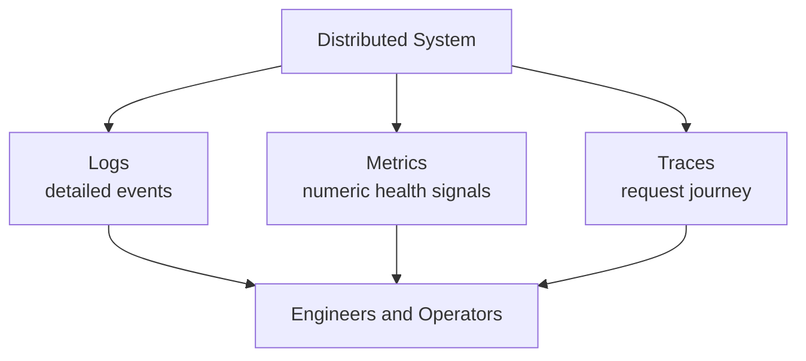

Metrics may tell you error rate increased. Traces may show the errors come from Payment Service calls. Logs may show the specific payment provider error message.

Together, they turn a distributed system from a black box into something teams can reason about.

---

### 34. Log Aggregation

#### What it is

**Log Aggregation** collects logs from many services, hosts, containers, jobs, and infrastructure components into a centralized searchable system.

Instead of manually connecting to individual machines or containers to inspect local log files, teams send logs to a shared log platform.

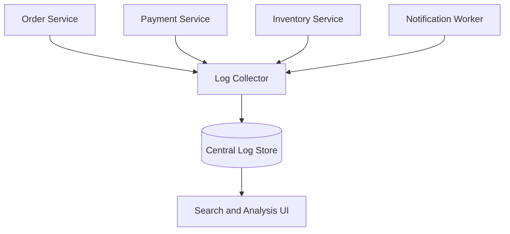

The central idea is:

> Logs from every runtime component should be collected, indexed, correlated, and searchable from one place.

A log entry might look like this:

```json
{
  "timestamp": "2026-04-29T12:00:00.123Z",
  "level": "error",
  "service": "payment-service",
  "environment": "production",
  "requestId": "req_123",
  "traceId": "trace_456",
  "orderId": "ord_789",
  "message": "Payment authorization failed",
  "errorCode": "PAYMENT_PROVIDER_TIMEOUT"
}
```

The value of log aggregation is not just storing logs. It is making them searchable and useful during incidents, debugging, audits, and operational reviews.

---

#### Why this pattern exists

In a distributed system, logs are scattered by default.

A single checkout request might produce logs in:

- API Gateway,
- Checkout Service,
- Order Service,
- Payment Service,
- Inventory Service,
- message broker consumers,
- databases,
- background workers,
- third-party integration adapters.

Without aggregation, debugging requires searching each place separately.

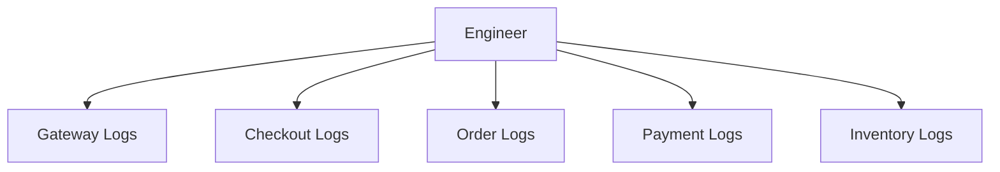

That is slow and error-prone.

In containerized environments, local logs may disappear when containers restart or nodes are replaced.

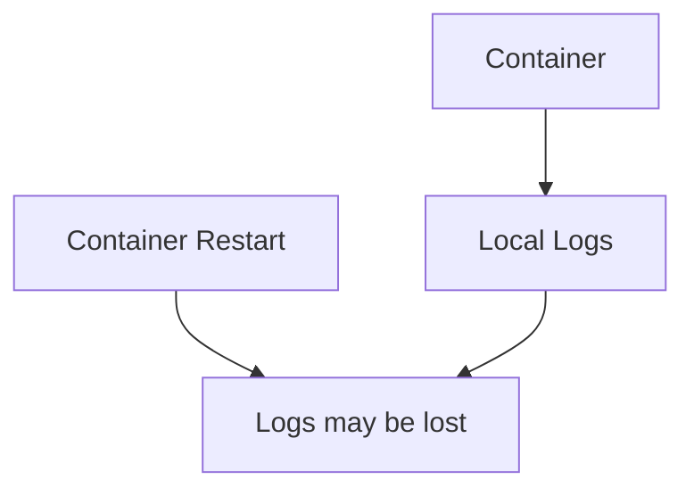

Log aggregation exists because distributed systems need a durable, searchable, centralized view of runtime behavior.

---

#### What it solves

Log Aggregation solves the problem of **scattered operational evidence**.

Without it, common incident questions are hard to answer:

- Did the request reach the service?
- Which service returned the error?
- Which tenant was affected?
- Was this a timeout, validation error, dependency failure, or code exception?
- Did retries happen?
- Did a background job process the event?
- Did the service publish the expected message?
- Did the same error happen before?

With log aggregation, teams can search across all services.

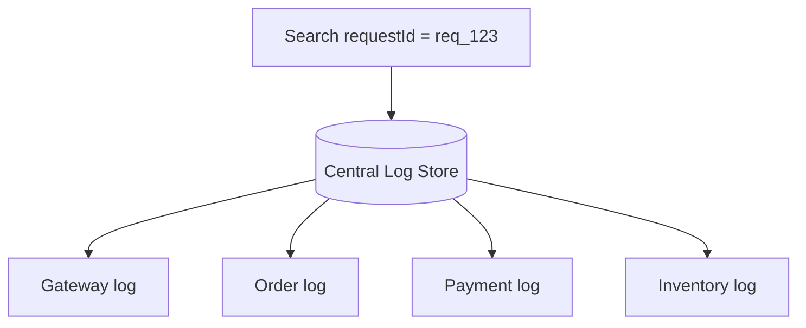

A centralized log system helps reconstruct what happened across service boundaries.

---

#### Basic architecture

A typical log aggregation pipeline has several components.

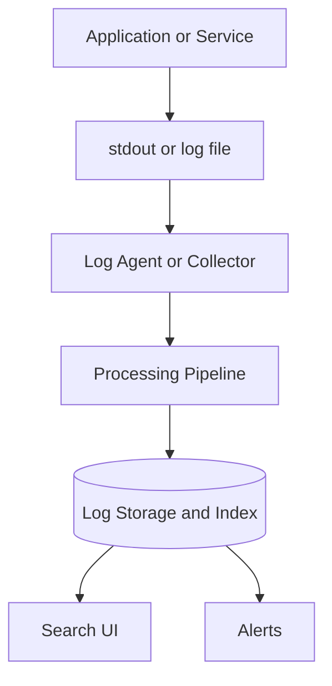

The pipeline may:

- parse logs,
- enrich logs with metadata,
- redact sensitive data,
- drop noisy logs,
- route logs to different stores,
- index important fields,
- apply retention policies.

Common metadata includes:

| Field | Purpose |
|---|---|
| `timestamp` | When the event happened |
| `level` | Severity such as debug, info, warn, error |
| `service` | Which service produced the log |
| `environment` | Production, staging, development |
| `version` | Application version or build SHA |
| `traceId` | Connects logs to a distributed trace |
| `requestId` | Connects logs for one request |
| `tenantId` | Identifies affected tenant when safe to log |
| `userId` | Identifies user when appropriate and allowed |
| `operation` | Business or technical operation |
| `errorCode` | Machine-readable error category |

Good metadata makes logs searchable and useful.

---

#### Structured logging

Structured logging means logs are emitted as machine-readable data, usually JSON.

Bad unstructured log:

```text
Payment failed for order ord_123 because provider timed out
```

Better structured log:

```json
{
  "timestamp": "2026-04-29T12:00:00.123Z",
  "level": "error",
  "service": "payment-service",
  "operation": "AuthorizePayment",
  "orderId": "ord_123",
  "paymentProvider": "provider_a",
  "errorCode": "PROVIDER_TIMEOUT",
  "message": "Payment provider timed out"
}
```

Structured logs are easier to query.

For example:

```text
service = payment-service AND errorCode = PROVIDER_TIMEOUT
```

or:

```text
tenantId = tenant_123 AND level = error
```

Structured logs turn logs into searchable operational data rather than plain text strings.

---

#### Example: structured logging in TypeScript

A small logging helper might standardize fields across a service.

```ts
type LogLevel = "debug" | "info" | "warn" | "error";

type LogContext = {
  requestId?: string;
  traceId?: string;
  tenantId?: string;
  userId?: string;
  operation?: string;
  [key: string]: unknown;
};

function log(level: LogLevel, message: string, context: LogContext = {}) {
  const entry = {
    timestamp: new Date().toISOString(),
    level,
    service: "order-service",
    environment: process.env.NODE_ENV ?? "development",
    message,
    ...context
  };

  console.log(JSON.stringify(entry));
}

async function confirmOrder(orderId: string, requestId: string) {
  log("info", "Confirming order", {
    requestId,
    operation: "ConfirmOrder",
    orderId
  });

  try {
    await orderRepository.confirm(orderId);

    log("info", "Order confirmed", {
      requestId,
      operation: "ConfirmOrder",
      orderId
    });
  } catch (error) {
    log("error", "Failed to confirm order", {
      requestId,
      operation: "ConfirmOrder",
      orderId,
      errorName: error instanceof Error ? error.name : "UnknownError",
      errorMessage: error instanceof Error ? error.message : "Unknown error"
    });

    throw error;
  }
}
```

This gives every log a consistent shape.

---

#### Correlation IDs

A **correlation ID** connects logs that belong to the same user action, workflow, or business process.

For synchronous HTTP requests, this is often called a request ID.

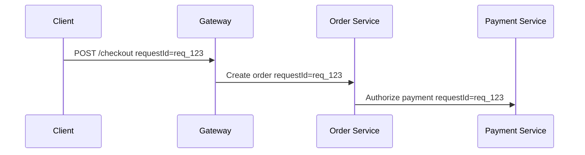

Each service logs the same `requestId`:

```json
{
  "service": "order-service",
  "requestId": "req_123",
  "message": "Order created"
}
```

```json
{
  "service": "payment-service",
  "requestId": "req_123",
  "message": "Payment authorized"
}
```

Then engineers can search:

```text
requestId = req_123
```

For asynchronous workflows, use a correlation ID across messages.

```json
{
  "eventType": "OrderCreated",
  "eventId": "evt_123",
  "correlationId": "corr_checkout_456",
  "data": {
    "orderId": "ord_789"
  }
}
```

Correlation IDs are one of the simplest and highest-value observability practices.

---

#### Logs and trace IDs

Logs should include trace IDs when distributed tracing is used.

```json
{
  "timestamp": "2026-04-29T12:00:00.123Z",
  "level": "error",
  "service": "inventory-service",
  "traceId": "4bf92f3577b34da6a3ce929d0e0e4736",
  "spanId": "00f067aa0ba902b7",
  "message": "Inventory reservation timed out"
}
```

This allows an engineer to move between logs and traces.

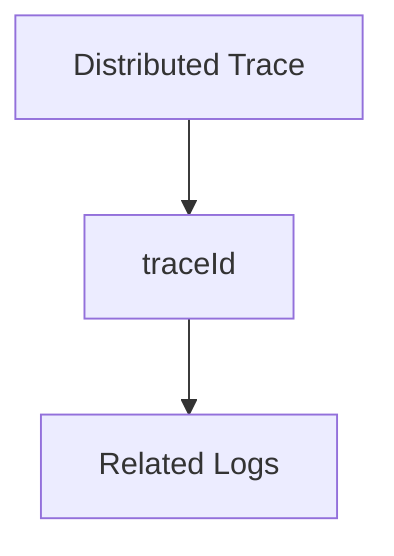

A trace shows the request path and timing. Logs provide detailed local context at each step.

---

#### Log levels

Log levels communicate severity.

| Level | Meaning | Example |
|---|---|---|
| `debug` | Detailed diagnostic information | SQL query plan or internal decision |
| `info` | Normal business or service event | Order created |
| `warn` | Unexpected but recoverable condition | Retry scheduled |
| `error` | Operation failed | Payment authorization failed |
| `fatal` | Service cannot continue | Startup failed due to missing required config |

A common mistake is logging too much at `error` level.

For example, a user entering an invalid coupon code may not be an error. It may be a normal business rejection.

Better:

```json
{
  "level": "info",
  "event": "CouponRejected",
  "reason": "EXPIRED"
}
```

Use error logs for conditions that need engineering attention.

---

#### What to log

Good logs capture important business and technical events.

Useful things to log:

- service startup and shutdown,
- configuration version loaded,
- incoming request summary,
- important business state transitions,
- command handling result,
- message consumed,
- message published,
- external dependency failure,
- retry attempts,
- circuit breaker state changes,
- authentication or authorization failures,
- validation failures when operationally useful,
- unexpected exceptions,
- background job start and completion.

Example business transition log:

```json
{
  "level": "info",
  "service": "order-service",
  "operation": "ConfirmOrder",
  "orderId": "ord_123",
  "previousStatus": "PENDING_PAYMENT",
  "newStatus": "CONFIRMED",
  "message": "Order status changed"
}
```

This is far more useful than:

```text
Updated order
```

---

#### What not to log

Logs can create security and privacy risk.

Avoid logging:

- passwords,
- access tokens,
- refresh tokens,
- API keys,
- full credit card numbers,
- CVV values,
- private keys,
- session cookies,
- unnecessary personal information,
- full request bodies by default,
- medical data unless specifically protected and required,
- sensitive headers,
- database connection strings.

Bad:

```json
{
  "message": "Login failed",
  "email": "alex@example.com",
  "password": "plaintext-password"
}
```

Better:

```json
{
  "message": "Login failed",
  "userHash": "user_hash_abc123",
  "reason": "INVALID_CREDENTIALS"
}
```

Log only what is useful and allowed.

---

#### Sensitive-data filtering

Log pipelines should filter or redact sensitive data before logs are stored.

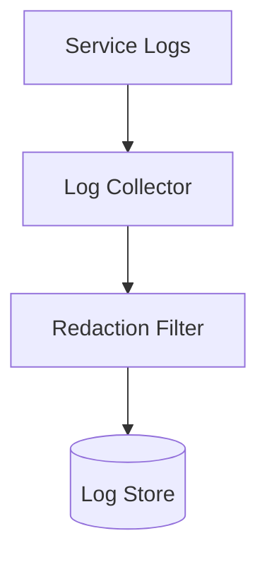

Example redaction:

```json
{
  "authorization": "Bearer [REDACTED]",
  "cardNumber": "[REDACTED]",
  "email": "a***@example.com"
}
```

Redaction should happen as early as possible.

Do not rely only on engineers remembering not to log sensitive values. Use automated protections.

---

#### Log retention

Logs can become expensive quickly.

A busy service may generate millions or billions of log lines per day.

Retention policies define how long logs are kept.

Example:

| Log type | Retention |
|---|---:|
| Debug logs | 1 to 3 days |
| Application info logs | 7 to 30 days |
| Error logs | 30 to 90 days |
| Security audit logs | 1 year or more depending on policy |
| Compliance logs | As required by regulation |

Retention should balance:

- debugging needs,
- audit requirements,
- legal requirements,
- privacy requirements,
- storage cost,
- search performance.

Not all logs need the same retention period.

---

#### Noise reduction

Too many logs can make the system harder to understand.

Common noise sources:

- logging every health check,
- logging every successful low-value request,
- repeated identical errors,
- stack traces for expected business failures,
- excessive debug logs in production,
- verbose third-party libraries,
- high-cardinality fields without need.

Noise creates problems:

- higher cost,
- slower searches,
- alert fatigue,
- important events are buried,
- engineers ignore logs.

Better logging is intentional.

For example, instead of logging every successful cache lookup, log aggregate cache metrics separately and only log unusual cache behavior.

---

#### Logs for async messaging

Async systems need logs for message processing.

A consumer should log:

- message received,
- message type,
- message ID,
- correlation ID,
- processing result,
- retry attempt,
- dead-letter movement,
- processing duration.

Example:

```json
{
  "level": "info",
  "service": "inventory-service",
  "consumer": "order-created-consumer",
  "eventId": "evt_123",
  "eventType": "OrderCreated",
  "correlationId": "corr_456",
  "attempt": 1,
  "status": "processed",
  "processingLatencyMs": 84
}
```

When processing fails:

```json
{
  "level": "error",
  "service": "inventory-service",
  "consumer": "order-created-consumer",
  "eventId": "evt_123",
  "eventType": "OrderCreated",
  "correlationId": "corr_456",
  "attempt": 5,
  "status": "dead_lettered",
  "errorCode": "INSUFFICIENT_SCHEMA_FIELDS",
  "message": "Message moved to dead-letter queue"
}
```

Without this, async workflows can fail invisibly.

---

#### Logs for audits

Operational logs and audit logs are related but not identical.

Operational logs help engineers debug systems.

Audit logs record important business or security actions.

Example audit event:

```json
{
  "timestamp": "2026-04-29T12:00:00Z",
  "eventType": "UserRoleChanged",
  "actorUserId": "admin_123",
  "targetUserId": "user_456",
  "role": "billing_admin",
  "action": "GRANTED",
  "sourceIp": "203.0.113.10"
}
```

Audit logs often require:

- stronger retention,
- immutability,
- access controls,
- tamper resistance,
- compliance review,
- separate storage.

Do not rely on noisy application logs as your only audit trail for sensitive business actions.

---

#### Log aggregation failure modes

Log aggregation can fail too.

Common failure modes:

- collector crashes,
- log pipeline falls behind,
- log store becomes unavailable,
- high-volume service overwhelms ingestion,
- malformed logs break parsing,
- sensitive-data redaction fails,
- index mappings explode due to unbounded fields,
- storage costs spike,
- retention policy misconfiguration deletes useful logs.

Design choices:

- buffer logs locally for a limited time,
- apply backpressure or sampling,
- drop low-value debug logs first,
- monitor ingestion lag,
- alert on collector failures,
- validate log format,
- restrict field cardinality,
- separate audit logs from general logs.

The logging system is part of production infrastructure and must be operated like one.

---

#### When to use it

Use Log Aggregation when:

- there is more than one service,
- services run in containers or dynamic infrastructure,
- incidents require cross-service investigation,
- logs need to survive instance restarts,
- teams need centralized search,
- compliance or audit review requires retained logs,
- background jobs and async consumers need visibility,
- production debugging depends on request correlation.

In practice, almost every production microservice system needs log aggregation.

---

#### When not to overuse it

Avoid treating log aggregation as the answer to every observability need.

Logs are not ideal for:

- high-level health dashboards,
- low-latency alerting on numeric trends,
- request path visualization,
- service dependency maps,
- high-volume metric-style analysis.

Use metrics for numeric health signals and traces for request flow.

Logs are best for detailed context.

---

#### Benefits

**1. Centralized debugging**

Teams can search logs from all services in one place.

**2. Faster incident investigation**

Correlation IDs make it easier to reconstruct what happened.

**3. Durable operational evidence**

Logs survive container restarts and instance replacement.

**4. Better async visibility**

Message processing, retries, and dead-letter events become visible.

**5. Supports auditing**

Important security and business actions can be retained and reviewed.

**6. Helps detect recurring errors**

Teams can search by error code, service, tenant, version, or operation.

---

#### Trade-offs

**1. Cost**

Log storage and indexing can become expensive.

**2. Noise**

Too many low-value logs make useful logs harder to find.

**3. Sensitive-data risk**

Logs can leak secrets or personal data if not controlled.

**4. Pipeline complexity**

Collectors, parsers, redactors, stores, and dashboards must be operated.

**5. Retention complexity**

Different log types may require different retention policies.

**6. Search performance**

Large log volumes and poor indexing can make searches slow.

---

#### Common mistakes

**Mistake 1: Unstructured logs everywhere**

Plain text logs are harder to search reliably.

**Mistake 2: No correlation IDs**

Without request or correlation IDs, cross-service debugging is painful.

**Mistake 3: Logging secrets**

Tokens, passwords, and sensitive data should not appear in logs.

**Mistake 4: Too much debug logging in production**

This increases cost and noise.

**Mistake 5: No retention policy**

Logs either disappear too soon or become too expensive.

**Mistake 6: Logs without ownership**

If no team owns noisy logs or broken parsers, the log system degrades.

**Mistake 7: Using logs instead of metrics**

Logs are detailed evidence, not the best tool for every dashboard or alert.

---

#### Practical design checklist

Before implementing Log Aggregation, ask:

- Are logs structured?
- Does every log include service name and environment?
- Are request IDs and trace IDs included?
- Are tenant IDs included where useful and safe?
- Are log levels used consistently?
- Are sensitive fields redacted?
- Are secrets blocked from logs?
- What logs are needed for incident response?
- What logs are needed for audits?
- What retention policy applies?
- What fields are indexed?
- How is high-cardinality data controlled?
- How are async message events logged?
- How are dead-letter events logged?
- What happens if log ingestion falls behind?
- Who owns logging standards?
- Who reviews log cost and noise?

A log aggregation design is probably healthy if:

- logs are structured,
- correlation IDs are consistent,
- sensitive data is filtered,
- retention is intentional,
- log volume is managed,
- important business and failure events are logged,
- engineers can quickly find logs for one request or workflow.

A design is probably unhealthy if:

- logs are scattered,
- logs are mostly unstructured strings,
- services log secrets,
- every service uses different field names,
- logs are too noisy to search,
- retention is accidental,
- no one can reconstruct a failed request.

---

#### Related patterns

| Pattern | Relationship |
|---|---|
| Distributed Tracing | Trace IDs should connect traces to logs |
| Performance Metrics | Metrics show trends; logs explain detailed events |
| Async Messaging | Consumers should log message handling, retries, and DLQ movement |
| Saga Pattern | Saga state changes should be logged with saga IDs |
| Circuit Breaker | State changes should be logged and measured |
| External Configuration | Configuration version should be logged at startup |
| API Gateway | Gateway logs help correlate client requests with backend services |
| Consumer-Driven Contracts | Contract failures and schema errors should be logged clearly |

---

#### Summary

Log Aggregation collects logs from all services into a centralized searchable system.

The central idea is:

> Distributed systems need centralized operational evidence.

A good log aggregation strategy has:

- structured logs,
- consistent metadata,
- request and trace correlation,
- sensitive-data filtering,
- retention policies,
- noise reduction,
- async workflow visibility,
- and searchable centralized storage.

The trade-off is cost and complexity. Logs can become expensive, noisy, and risky if they contain sensitive data. Used well, log aggregation gives teams the detailed evidence they need to debug incidents and understand production behavior.

---

### 35. Performance Metrics

#### What it is

**Performance Metrics** are numeric measurements collected from services, infrastructure, databases, queues, clients, and runtime platforms.

Metrics help teams understand whether a system is healthy, overloaded, degraded, improving, or failing.

Examples:

```text
http_requests_total = 120000
http_request_duration_p95 = 240ms
error_rate = 0.7 percent
cpu_usage = 68 percent
queue_depth = 430
payment_authorization_failures = 12
```

A typical metrics architecture looks like this:

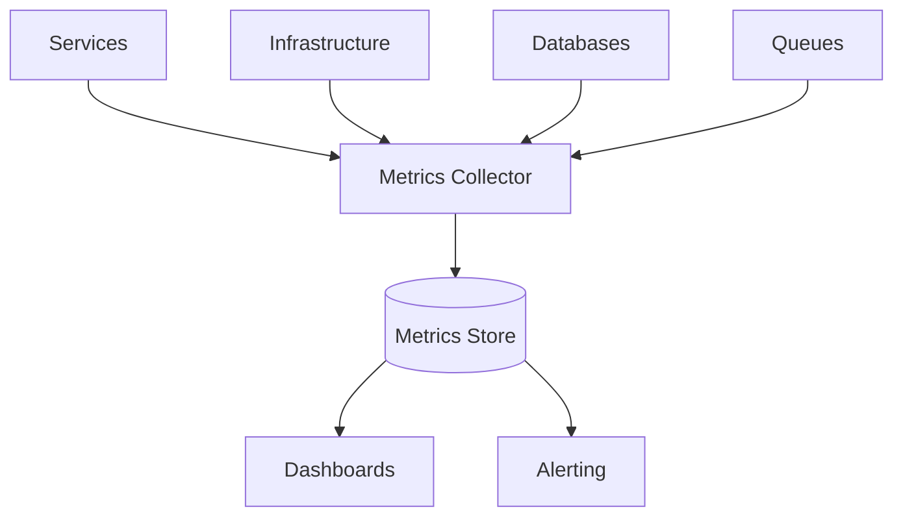

The central idea is:

> Metrics turn system behavior into measurable signals over time.

Metrics are especially useful for dashboards, alerting, SLO monitoring, autoscaling, regression detection, and capacity planning.

---

#### Why this pattern exists

Logs tell detailed stories. But they are not always the best way to answer high-level health questions.

For example:

- What is the current error rate?
- Is latency getting worse?
- How many requests per second are we serving?
- Is queue depth growing?
- Are we meeting our availability target?
- Did the new release increase CPU usage?
- Which service is saturated?
- Are database connections near the limit?

Metrics answer these questions quickly.

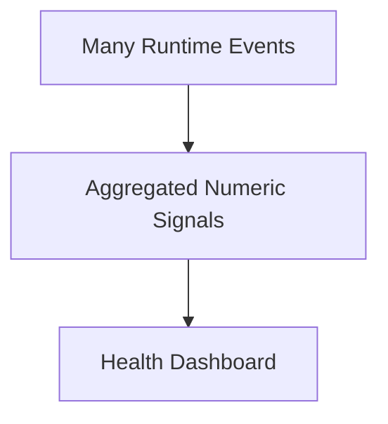

A distributed system may generate huge amounts of logs, but metrics compress behavior into useful time-series signals.

For example, instead of reading thousands of request logs, a metric can show:

```text
checkout_request_error_rate increased from 0.2 percent to 5.8 percent
```

That is the kind of signal needed for fast operational awareness.

---

#### What it solves

Performance Metrics solve the problem of **not knowing system health at a glance**.

Without metrics, teams often discover problems through:

- customer reports,
- support tickets,
- manual log searches,
- slow dashboards,
- intuition,
- production incidents after the damage is already visible.

With metrics, teams can detect changes early.

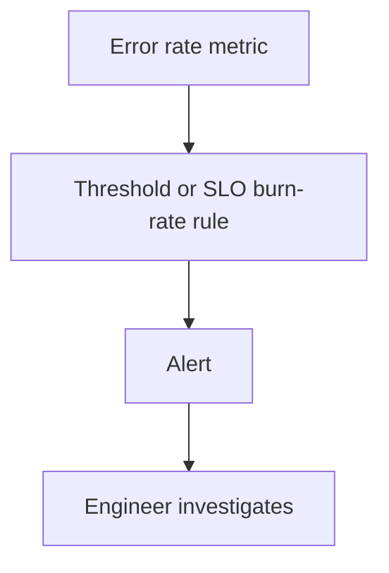

Metrics provide the high-level visibility needed to operate distributed systems.

---

#### Types of metrics

There are several common metric types.

| Type | Meaning | Example |
|---|---|---|
| Counter | A value that only increases | Total requests processed |
| Gauge | A value that can go up or down | Current queue depth |
| Histogram | Distribution of values | Request duration buckets |
| Summary | Precomputed distribution summary | Latency percentiles |

Examples:

```text
http_requests_total
```

A counter.

```text
queue_depth
```

A gauge.

```text
http_request_duration_seconds_bucket
```

A histogram.

Choosing the right metric type matters because it affects how the metric can be queried and alerted on.

---

#### The four golden signals

A common starting point for service metrics is the four golden signals:

| Signal | Meaning | Example |
|---|---|---|
| Latency | How long requests take | p95 request duration |
| Traffic | How much demand exists | requests per second |
| Errors | How many requests fail | 5xx error rate |
| Saturation | How full or overloaded resources are | CPU, memory, queue depth, connection pool usage |

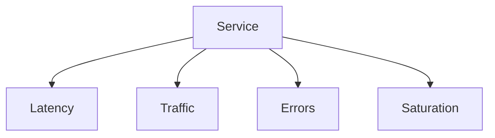

For a service, these metrics might include:

```text
http_request_duration_seconds
http_requests_total
http_request_errors_total
db_connection_pool_used
queue_depth
```

These signals give a strong baseline for operational visibility.

---

#### Business metrics vs technical metrics

Metrics should include both technical and business signals.

Technical metrics describe system health.

Examples:

- CPU usage,
- memory usage,
- request latency,
- database query latency,
- queue depth,
- error rate,
- thread pool saturation.

Business metrics describe business process health.

Examples:

- orders created,
- payments authorized,
- checkout conversion rate,
- refunds issued,
- subscriptions activated,
- claims approved,
- failed onboarding attempts.

A service may look technically healthy while the business flow is broken.

Example:

```text
HTTP 200 responses are normal, but payment_authorizations_total dropped to zero.
```

That could mean the service is returning successful responses but not actually authorizing payments.

Good observability includes both.

---

#### Example service metrics

For an Order Service, useful metrics might include:

| Metric | Type | Meaning |
|---|---|---|
| `orders_created_total` | Counter | Number of orders created |
| `orders_confirmed_total` | Counter | Number of orders confirmed |
| `orders_cancelled_total` | Counter | Number of orders cancelled |
| `order_command_duration_seconds` | Histogram | Command handling latency |
| `order_command_failures_total` | Counter | Failed command count |
| `order_saga_active` | Gauge | Number of active order sagas |
| `order_saga_duration_seconds` | Histogram | Saga completion time |
| `outbox_pending_messages` | Gauge | Unpublished outbox messages |

For a Payment Service:

| Metric | Type | Meaning |
|---|---|---|
| `payment_authorizations_total` | Counter | Authorization attempts |
| `payment_authorization_failures_total` | Counter | Failed authorizations |
| `payment_provider_latency_seconds` | Histogram | Provider response time |
| `payment_provider_timeouts_total` | Counter | Provider timeouts |
| `payment_refunds_total` | Counter | Refunds issued |
| `payment_gateway_circuit_open` | Gauge | Circuit breaker state |

Metrics should reflect the service’s actual responsibilities.

---

#### Instrumentation example

A service can record request metrics around an HTTP endpoint.

```ts
type Metrics = {
  increment(name: string, labels?: Record<string, string>): void;
  observe(name: string, value: number, labels?: Record<string, string>): void;
};

function nowSeconds(): number {
  return Date.now() / 1000;
}

async function createOrderHandler(req: Request, res: Response, metrics: Metrics) {
  const start = nowSeconds();

  try {
    const order = await orderService.createOrder(req.body);

    metrics.increment("http_requests_total", {
      route: "/orders",
      method: "POST",
      status: "201"
    });

    metrics.increment("orders_created_total");

    res.status(201).json(order);
  } catch (error) {
    metrics.increment("http_requests_total", {
      route: "/orders",
      method: "POST",
      status: "500"
    });

    metrics.increment("order_command_failures_total", {
      command: "CreateOrder"
    });

    res.status(500).json({
      error: "ORDER_CREATION_FAILED"
    });
  } finally {
    const duration = nowSeconds() - start;

    metrics.observe("http_request_duration_seconds", duration, {
      route: "/orders",
      method: "POST"
    });
  }
}
```

The exact metrics library does not matter. The discipline does.

---

#### Latency metrics

Latency measures how long operations take.

Common latency metrics:

- request latency,
- database query latency,
- message processing latency,
- external API latency,
- cache lookup latency,
- queue wait time,
- saga completion time,
- projection lag.

Latency should usually be measured as a distribution, not just an average.

Averages hide tail latency.

Example:

```text
Average latency: 100 ms
p95 latency: 900 ms
p99 latency: 2500 ms
```

The average looks fine, but some users are having a slow experience.

Use percentiles such as p50, p90, p95, and p99.

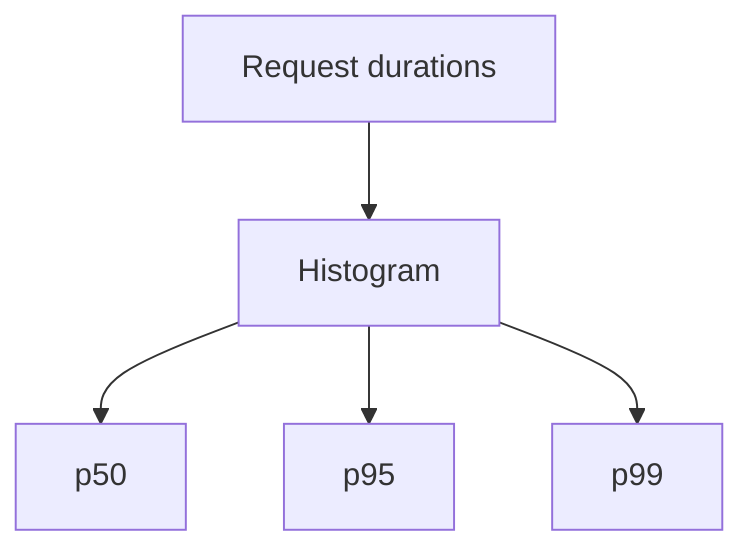

Tail latency matters in distributed systems because one slow dependency can slow the entire request.

---

#### Error metrics

Error metrics track failures.

Common error metrics:

- HTTP 5xx rate,
- HTTP 4xx rate,
- command failures,
- validation rejections,
- dependency failures,
- timeout count,
- retry count,
- dead-letter queue count,
- circuit breaker openings,
- failed login count,
- payment provider declines.

Not every failure is the same.

For example:

| Error type | Operational meaning |
|---|---|
| HTTP 500 | Service or dependency failure |
| HTTP 400 | Client or validation issue |
| Payment card declined | Business outcome, not infrastructure failure |
| Payment provider timeout | Dependency or network failure |
| Authentication failed | Could be normal or suspicious depending on rate |

Metrics should distinguish technical failures from expected business rejections.

Bad metric:

```text
errors_total
```

Better:

```text
payment_authorization_failures_total{reason="provider_timeout"}
payment_authorization_declines_total{reason="card_declined"}
```

The first may need engineering action. The second may be a normal business result.

---

#### Saturation metrics

Saturation measures how close a resource is to its limit.

Common saturation metrics:

- CPU usage,
- memory usage,
- disk usage,
- connection pool usage,
- thread pool usage,
- queue depth,
- broker consumer lag,
- database lock wait time,
- file descriptors,
- cache memory usage,
- request concurrency,
- worker utilization.

Example:

```text
db_connection_pool_used / db_connection_pool_max = 95 percent
```

This indicates the service may soon fail or slow down.

Saturation metrics are useful because they often show the cause of latency before errors happen.

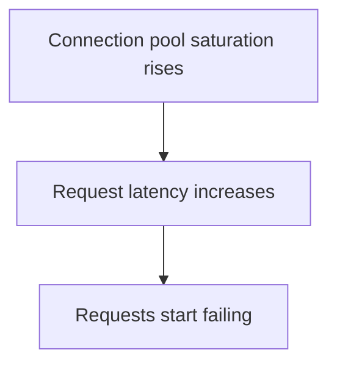

Good alerts often catch saturation before users see widespread errors.

---

#### Queue and async metrics

Async systems need special metrics.

Important queue metrics:

| Metric | Meaning |
|---|---|
| Queue depth | Number of messages waiting |
| Consumer lag | How far consumers are behind |
| Oldest message age | How long the oldest unprocessed message has waited |
| Processing rate | Messages processed per second |
| Failure rate | Message processing failures |
| Retry count | Number of retry attempts |
| DLQ count | Messages moved to dead-letter queue |

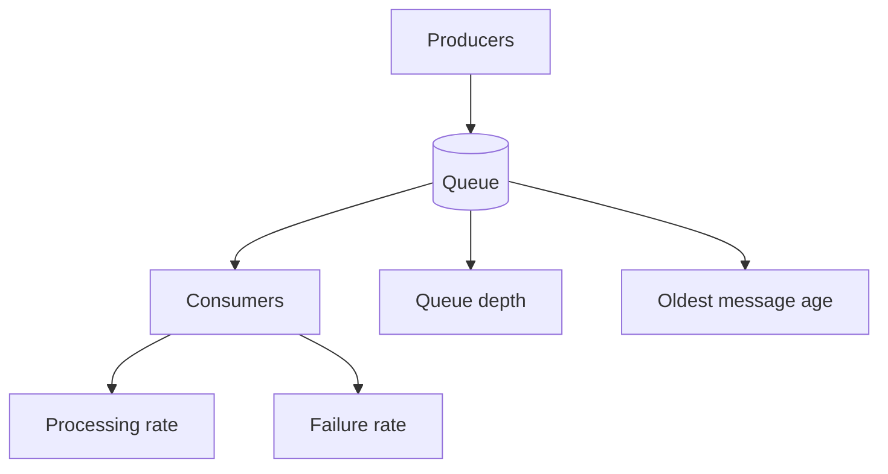

Queue depth alone is not enough.

A queue depth of 10,000 may be fine if consumers drain it quickly.

An oldest message age of 30 minutes may be bad even if queue depth is small.

---

#### SLO metrics

A **Service-Level Objective**, or SLO, is a measurable reliability target.

Example:

```text
99.9 percent of checkout requests should complete successfully within 2 seconds over 30 days.
```

This requires metrics for:

- request count,
- successful request count,
- request latency,
- time window.

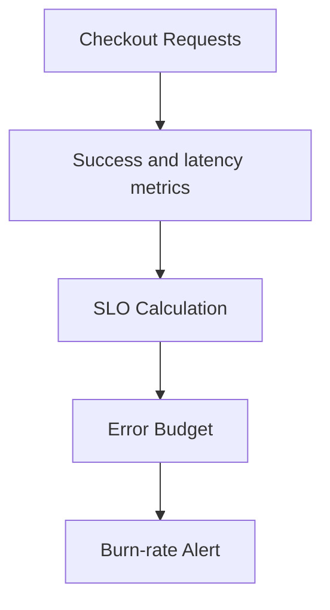

SLO metrics help teams avoid alerting on every small blip while still catching meaningful customer-impacting degradation.

---

#### Dashboards

Dashboards should answer operational questions quickly.

A service dashboard should usually show:

- request rate,
- error rate,
- latency percentiles,
- saturation,
- dependency health,
- queue depth and lag,
- deployment version,
- business throughput,
- SLO status.

Example dashboard layout:

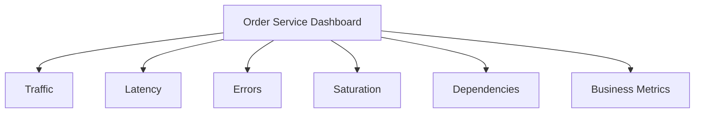

Good dashboards are organized around questions, not just graphs.

Bad dashboard question:

```text
How many charts can we show?
```

Better dashboard questions:

```text
Is the service healthy?
What changed?
What dependency is failing?
Are users affected?
Are we meeting our SLO?
```

---

#### Alerting

Metrics are commonly used for alerts.

A good alert should mean:

> A human needs to take action soon.

Bad alert:

```text
CPU is above 70 percent for 1 minute.
```

Maybe that is normal.

Better alert:

```text
Checkout success-rate SLO is burning too fast over 5 minutes and 1 hour.
```

Alert on user impact and actionable symptoms when possible.

Useful alert categories:

- high error rate,
- high latency,
- SLO burn rate,
- queue lag growing,
- DLQ messages increasing,
- database connection pool exhausted,
- disk space near critical limit,
- dependency unavailable,
- certificate expiring,
- no events processed when events are expected.

Avoid alerting on every low-level metric unless it is clearly actionable.

---

#### Label cardinality

Metrics often include labels.

Example:

```text
http_requests_total{service="order-service", route="/orders", method="POST", status="201"}
```

Labels make metrics more useful.

But labels with too many possible values create **high cardinality**.

Bad:

```text
http_requests_total{userId="user_123456789"}
```

If there are millions of users, this creates millions of time series.

High cardinality can make metrics systems expensive and slow.

Good labels:

- service,
- route template,
- method,
- status code class,
- region,
- environment,
- dependency name,
- operation name.

Risky labels:

- user ID,
- request ID,
- order ID,
- session ID,
- raw URL path with IDs,
- unbounded error message,
- high-cardinality tenant ID unless intentionally supported.

Use logs or traces for high-cardinality per-request details. Use metrics for aggregated signals.

---

#### Metric naming

Consistent names make metrics easier to use.

Poor names:

```text
latency
errors
count
service_time
foo_failures
```

Better names:

```text
http_requests_total
http_request_duration_seconds
payment_authorization_failures_total
order_saga_duration_seconds
outbox_pending_messages
```

A good metric name should communicate:

- what is measured,
- unit when relevant,
- whether it is a total counter,
- the operation or domain area.

Common suffixes:

| Suffix | Meaning |
|---|---|
| `_total` | Counter |
| `_seconds` | Duration in seconds |
| `_bytes` | Size in bytes |
| `_ratio` | Ratio |
| `_count` | Count where counter conventions differ |

Metric naming conventions should be shared across teams.

---

#### Metrics and autoscaling

Metrics can drive autoscaling.

Example:

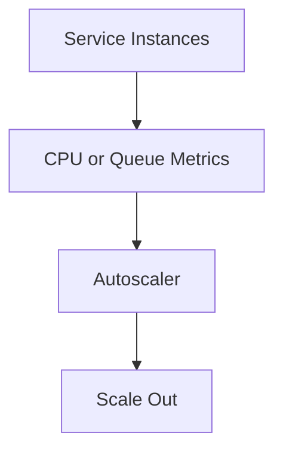

Common autoscaling metrics:

- CPU utilization,
- memory utilization,
- requests per second per instance,
- queue depth,
- consumer lag,
- active connections,
- custom business workload metrics.

Queue-based scaling example:

```text
If queue_depth / worker_count > 100, add workers.
```

Autoscaling needs careful tuning.

Scaling too slowly causes backlog. Scaling too aggressively can overload downstream systems.

---

#### Metrics and deployments

Metrics are essential during deployments.

A rollout should watch:

- error rate,
- latency,
- traffic,
- saturation,
- business metrics,
- dependency errors,
- resource usage,
- crash loops,
- queue lag.

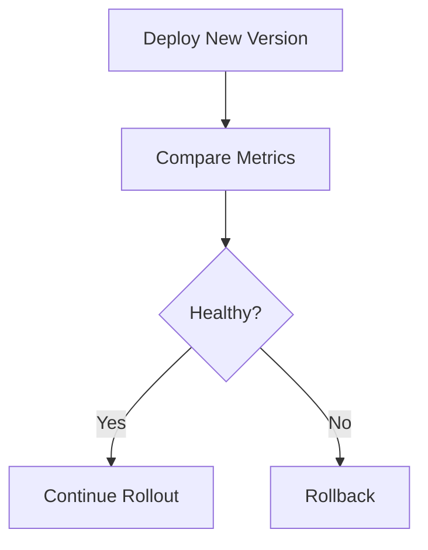

Metrics should include version labels when possible:

```text
http_request_errors_total{service="checkout-service", version="2026.04.29.1"}
```

This helps identify whether a new version introduced a regression.

---

#### When to use it

Use Performance Metrics when:

- services need health dashboards,
- teams need alerting,
- systems have SLOs,
- capacity planning matters,
- autoscaling is needed,
- deployments need regression detection,
- async pipelines need lag monitoring,
- performance and reliability need to be measured over time.

Every production service should expose at least basic metrics.

---

#### When metrics are not enough

Metrics show that something changed, but not always why.

For example:

```text
p95 latency increased from 200 ms to 2 seconds.
```

Metrics may not tell you which request path was slow or what exact error occurred.

Use traces and logs to investigate.

```mermaid
flowchart TD
    Metric[Metric shows latency spike]
    Trace[Trace shows slow dependency]
    Log[Logs show provider timeout]

    Metric --> Trace
    Trace --> Log
```

Metrics are the alarm and dashboard. Logs and traces provide detail.

---

#### Benefits

**1. Fast health visibility**

Metrics show system health at a glance.

**2. Alerting**

Metrics can trigger alerts before or during incidents.

**3. Capacity planning**

Trends show when resources need to scale.

**4. SLO monitoring**

Metrics measure reliability targets.

**5. Regression detection**

Metrics show whether a deployment made things worse.

**6. Autoscaling**

Metrics can drive scaling decisions.

**7. Operational comparison**

Teams can compare behavior by service, region, version, or dependency.

---

#### Trade-offs

**1. Metrics lack detail**

They show what changed but not always why.

**2. Cardinality can explode**

Too many label values can overload the metrics system.

**3. Bad metrics create false confidence**

Measuring the wrong thing can hide real user impact.

**4. Alert fatigue**

Too many low-value alerts cause teams to ignore alarms.

**5. Naming inconsistency**

Poor naming makes dashboards and queries hard to maintain.

**6. Instrumentation overhead**

Teams must add, maintain, and review metrics.

---

#### Common mistakes

**Mistake 1: Only tracking infrastructure metrics**

CPU and memory are useful, but business and service metrics are also needed.

**Mistake 2: Using averages only**

Averages hide tail latency.

**Mistake 3: High-cardinality labels**

User IDs, request IDs, and raw URLs can overwhelm metrics systems.

**Mistake 4: No SLO metrics**

Dashboards without reliability targets are less useful.

**Mistake 5: Alerting on symptoms nobody acts on**

Alerts should be actionable.

**Mistake 6: Inconsistent names**

Different teams using different names for the same concept makes metrics hard to query.

**Mistake 7: No deployment visibility**

Metrics should make it clear whether a new version changed behavior.

---

#### Practical design checklist

Before designing service metrics, ask:

- What are the service’s critical user journeys?
- What are the service’s SLOs?
- What is the request rate?
- What is the error rate?
- What latency percentiles matter?
- What resources can become saturated?
- What dependencies should be measured?
- What business outcomes should be measured?
- What async queues or consumers need lag metrics?
- What metrics should alert humans?
- Are alerts actionable?
- Are labels bounded and controlled?
- Are metric names consistent?
- Are metrics tagged by service, environment, region, and version?
- Are deployment regressions visible?
- Are dashboards organized around operational questions?

A metrics strategy is probably healthy if:

- every service has golden-signal metrics,
- critical business metrics are tracked,
- SLOs are measurable,
- alerts are actionable,
- label cardinality is controlled,
- deployment changes are visible,
- metrics are used with logs and traces.

A strategy is probably unhealthy if:

- dashboards are mostly CPU charts,
- latency is measured only by averages,
- alerts are noisy,
- labels include unbounded IDs,
- services use inconsistent metric names,
- teams cannot tell whether users are affected.

---

#### Related patterns

| Pattern | Relationship |
|---|---|
| Log Aggregation | Logs provide detailed context for metric changes |
| Distributed Tracing | Traces explain where latency happened |
| Circuit Breaker | Circuit state and dependency failures should be measured |
| Retry | Retry counts and retry latency should be measured |
| Bulkhead | Pool saturation and isolation metrics are important |
| Async Messaging | Queue depth, consumer lag, and DLQ counts are metrics |
| Saga Pattern | Saga duration, stuck sagas, and compensation counts should be measured |
| External Configuration | Config changes should be visible in metrics and dashboards |
| API Gateway | Gateway metrics show edge traffic, latency, and errors |

---

#### Summary

Performance Metrics are numeric signals collected from services and infrastructure.

The central idea is:

> Metrics show system health, trends, saturation, and reliability over time.

A good metrics strategy includes:

- latency,
- traffic,
- errors,
- saturation,
- business metrics,
- dependency metrics,
- async pipeline metrics,
- SLO measurements,
- actionable alerts,
- and controlled labels.

Metrics provide fast, high-level visibility. Their limitation is that they usually show what changed, not the full reason why. Use logs and traces alongside metrics to investigate incidents deeply.

---

### 36. Distributed Tracing

#### What it is

**Distributed Tracing** follows a single request, workflow, or transaction as it travels across multiple services and infrastructure components.

A trace is made of spans.

A **span** represents one operation, such as:

- an HTTP request,
- a database query,
- a message publish,
- a cache lookup,
- a service method,
- a third-party API call.

```mermaid
flowchart TD
    Trace[Trace]

    Span1[API Gateway Span]
    Span2[Checkout Service Span]
    Span3[Order Service Span]
    Span4[Payment Service Span]
    Span5[Inventory Service Span]

    Trace --> Span1
    Span1 --> Span2
    Span2 --> Span3
    Span2 --> Span4
    Span2 --> Span5
```

The central idea is:

> A trace shows the path and timing of work across service boundaries.

Example request flow:

```mermaid
sequenceDiagram
    participant Client
    participant Gateway
    participant Checkout as Checkout Service
    participant Orders as Order Service
    participant Payments as Payment Service
    participant Inventory as Inventory Service

    Client->>Gateway: POST /checkout
    Gateway->>Checkout: Forward request
    Checkout->>Orders: Create order
    Checkout->>Payments: Authorize payment
    Checkout->>Inventory: Reserve inventory
    Checkout-->>Gateway: Checkout result
    Gateway-->>Client: Response
```

Distributed tracing helps teams see this full journey instead of looking at each service separately.

---

#### Why this pattern exists

In a monolith, a request often stays within one process. A stack trace or local profiler can explain a lot.

In microservices, a request crosses many process and network boundaries.

```mermaid
flowchart TD
    Request[User Request]

    Gateway[Gateway]
    ServiceA[Service A]
    ServiceB[Service B]
    ServiceC[Service C]
    Database[(Database)]
    External[External API]

    Request --> Gateway
    Gateway --> ServiceA
    ServiceA --> ServiceB
    ServiceA --> ServiceC
    ServiceB --> Database
    ServiceC --> External
```

When the request is slow or fails, a single service may not know why.

For example:

- Gateway sees the request took 3 seconds.
- Checkout Service sees it waited on Payment Service.
- Payment Service sees a third-party provider timed out.
- Inventory Service succeeded quickly.

Without tracing, engineers must manually reconstruct this from logs.

Distributed Tracing exists because request behavior is distributed across many services.

---

#### What it solves

Distributed Tracing solves the problem of **invisible request paths**.

It helps answer:

- Which services handled this request?
- Which service was slow?
- Which dependency failed?
- Did services run sequentially or in parallel?
- How much time was spent in each step?
- Which database query was slow?
- Did retries happen?
- Did the request publish a message?
- Which downstream service returned the error?

A trace might show:

```text
POST /checkout: 2400 ms
  API Gateway: 20 ms
  Checkout Service: 2350 ms
    Order Service: 80 ms
    Payment Service: 2200 ms
      Payment Provider API: 2100 ms
    Inventory Service: 60 ms
```

This immediately points to the Payment Provider API.

---

#### Trace and span basics

A **trace** represents the whole request or workflow.

A **span** represents one operation inside the trace.

```mermaid
flowchart TD
    Trace[Trace ID: trace_123]

    Root[Root Span<br/>POST /checkout]
    Child1[Child Span<br/>Create Order]
    Child2[Child Span<br/>Authorize Payment]
    Child3[Child Span<br/>Reserve Inventory]

    Trace --> Root
    Root --> Child1
    Root --> Child2
    Root --> Child3
```

Each span usually has:

| Field | Meaning |
|---|---|
| Trace ID | Identifies the full trace |
| Span ID | Identifies this operation |
| Parent span ID | Identifies the parent operation |
| Service name | Service that produced the span |
| Operation name | What the span represents |
| Start time | When operation started |
| Duration | How long operation took |
| Status | Success, error, timeout, etc. |
| Attributes | Metadata such as route, method, dependency |
| Events | Timestamped details within the span |

This structure creates a tree or graph of request execution.

---

#### Context propagation

Distributed tracing depends on context propagation.

When one service calls another, it passes trace context in headers or message metadata.

```mermaid
sequenceDiagram
    participant A as Service A
    participant B as Service B

    A->>B: HTTP request with traceparent header
    B->>B: Create child span using trace context
```

Common trace context header:

```http
traceparent: 00-4bf92f3577b34da6a3ce929d0e0e4736-00f067aa0ba902b7-01
```

For messages:

```json
{
  "eventType": "OrderCreated",
  "traceContext": {
    "traceparent": "00-4bf92f3577b34da6a3ce929d0e0e4736-00f067aa0ba902b7-01"
  },
  "data": {
    "orderId": "ord_123"
  }
}
```

If trace context is not propagated, the trace is broken.

```mermaid
flowchart TD
    TraceA[Trace Part 1]
    Missing[Missing context propagation]
    TraceB[Separate trace starts]

    TraceA --> Missing
    Missing --> TraceB
```

Consistent propagation is essential.

---

#### Basic tracing architecture

A tracing system usually has:

- instrumentation in services,
- trace context propagation,
- collector or agent,
- trace storage,
- trace UI,
- sampling rules.

```mermaid
flowchart TD
    ServiceA[Service A]
    ServiceB[Service B]
    ServiceC[Service C]

    Collector[Trace Collector]
    TraceStore[(Trace Store)]
    TraceUI[Trace UI]

    ServiceA --> Collector
    ServiceB --> Collector
    ServiceC --> Collector

    Collector --> TraceStore
    TraceStore --> TraceUI
```

Instrumentation can be automatic, manual, or both.

Automatic instrumentation captures common operations such as HTTP calls, database queries, and messaging operations.

Manual instrumentation adds business-specific spans.

---

#### Example: manual span in TypeScript

A simplified tracing helper might look like this:

```ts
type Span = {
  setAttribute(name: string, value: string | number | boolean): void;
  recordException(error: unknown): void;
  setStatus(status: { code: "OK" | "ERROR"; message?: string }): void;
  end(): void;
};

type Tracer = {
  startSpan(name: string): Span;
};

async function authorizePayment(
  tracer: Tracer,
  command: AuthorizePaymentCommand
): Promise<PaymentAuthorization> {
  const span = tracer.startSpan("PaymentService.AuthorizePayment");

  span.setAttribute("order.id", command.orderId);
  span.setAttribute("payment.provider", "provider_a");

  try {
    const authorization = await paymentProvider.authorize({
      amount: command.amount,
      currency: command.currency,
      paymentMethodId: command.paymentMethodId
    });

    span.setAttribute("payment.status", "authorized");
    span.setStatus({ code: "OK" });

    return authorization;
  } catch (error) {
    span.recordException(error);
    span.setStatus({
      code: "ERROR",
      message: error instanceof Error ? error.message : "Unknown error"
    });

    throw error;
  } finally {
    span.end();
  }
}
```

Manual spans are useful for important business operations that automatic instrumentation cannot understand.

---

#### Trace attributes

Trace attributes add searchable metadata to spans.

Useful attributes include:

| Attribute | Example |
|---|---|
| `service.name` | `payment-service` |
| `http.method` | `POST` |
| `http.route` | `/payments/authorize` |
| `http.status_code` | `200` |
| `db.system` | `postgresql` |
| `db.operation` | `SELECT` |
| `messaging.system` | `kafka` |
| `messaging.destination` | `order-events` |
| `tenant.id` | `tenant_123` when safe and controlled |
| `order.id` | `ord_456` when appropriate |
| `error.code` | `PROVIDER_TIMEOUT` |

Avoid adding unbounded or sensitive data casually.

Trace attributes can create storage and privacy concerns just like logs.

---

#### Tracing synchronous calls

Synchronous service calls are a natural fit for tracing.

```mermaid
sequenceDiagram
    participant API
    participant Orders
    participant Payments
    participant Inventory

    API->>Orders: Create order
    Orders-->>API: Created

    API->>Payments: Authorize payment
    Payments-->>API: Authorized

    API->>Inventory: Reserve inventory
    Inventory-->>API: Reserved
```

A trace shows the timing of each call.

```text
API request: 520 ms
  Create order: 80 ms
  Authorize payment: 300 ms
  Reserve inventory: 90 ms
```

This helps identify bottlenecks and dependency failures.

---

#### Tracing parallel branches

Distributed tracing can show parallel work.

```mermaid
sequenceDiagram
    participant Dashboard
    participant Profile
    participant Orders
    participant Billing

    Dashboard->>Profile: Get profile
    Dashboard->>Orders: Get recent orders
    Dashboard->>Billing: Get billing status

    Profile-->>Dashboard: Profile
    Orders-->>Dashboard: Orders
    Billing-->>Dashboard: Billing
```

A trace can show that calls happened concurrently.

```text
GET /dashboard: 260 ms
  Get profile: 80 ms
  Get recent orders: 240 ms
  Get billing status: 110 ms
```

The total request time is close to the slowest branch, not the sum of all branches.

This helps distinguish parallel fan-out from chained latency.

---

#### Tracing async workflows

Async workflows are harder because work continues after the original request returns.

Example:

```mermaid
sequenceDiagram
    participant Client
    participant Orders
    participant Broker
    participant Payments
    participant Inventory

    Client->>Orders: Create order
    Orders->>Broker: Publish OrderCreated
    Orders-->>Client: 202 Accepted

    Broker-->>Payments: OrderCreated
    Payments->>Broker: PaymentAuthorized

    Broker-->>Inventory: OrderCreated
    Inventory->>Broker: InventoryReserved
```

Trace context should be propagated through messages.

The trace may include:

- original HTTP request,
- event publish,
- message broker span,
- consumer processing,
- follow-up event publish.

This helps answer:

- Did the event get published?
- Which consumer processed it?
- How long did it wait in the queue?
- Which consumer failed?
- Where did the workflow stop?

Without async tracing, event-driven systems can become difficult to debug.

---

#### Tracing database operations

Traces can include database spans.

Example:

```text
POST /orders: 180 ms
  Validate request: 5 ms
  INSERT orders: 25 ms
  INSERT outbox: 8 ms
  Commit transaction: 12 ms
  Publish response: 2 ms
```

Database spans help identify:

- slow queries,
- lock waits,
- connection pool delays,
- repeated queries,
- N+1 query patterns,
- transaction duration.

Be careful not to include sensitive query parameters in traces.

Bad:

```text
SELECT * FROM users WHERE email = 'alex@example.com'
```

Better:

```json
{
  "db.operation": "SELECT",
  "db.table": "users",
  "db.statement_type": "parameterized"
}
```

Trace enough to debug performance, but not enough to leak sensitive data.

---

#### Sampling

High-traffic systems cannot always store every trace.

**Sampling** decides which traces to keep.

```mermaid
flowchart TD
    AllRequests[All Requests]
    Sampler[Sampler]
    Kept[Stored Traces]
    Dropped[Dropped Traces]

    AllRequests --> Sampler
    Sampler --> Kept
    Sampler --> Dropped
```

Common sampling strategies:

| Strategy | Description |
|---|---|
| Head-based sampling | Decide at request start |
| Tail-based sampling | Decide after seeing the full trace |
| Error sampling | Keep traces with errors |
| Latency sampling | Keep slow traces |
| Rate-limited sampling | Keep up to a fixed rate |
| Priority sampling | Keep important tenants or operations |

Tail-based sampling is powerful because it can keep unusual traces, such as:

- errors,
- slow requests,
- rare routes,
- high-value workflows.

Sampling should be designed carefully. If you drop all error traces, tracing becomes much less useful.

---

#### Trace sampling and logs

Sampling creates an important interaction with logs.

If a trace is not stored, logs may still exist.

Including `traceId` in logs lets engineers search related logs even when the trace was sampled out.

```mermaid
flowchart TD
    Request[Request]
    Trace[Trace maybe sampled]
    Logs[Logs with traceId]

    Request --> Trace
    Request --> Logs
```

For critical errors, it is often useful to sample traces more aggressively or keep all traces with errors.

---

#### Distributed tracing and dependency maps

Tracing can reveal service dependencies.

```mermaid
flowchart TD
    Gateway[API Gateway]
    Checkout[Checkout Service]
    Orders[Order Service]
    Payments[Payment Service]
    Inventory[Inventory Service]
    Provider[Payment Provider]

    Gateway --> Checkout
    Checkout --> Orders
    Checkout --> Payments
    Checkout --> Inventory
    Payments --> Provider
```

Dependency maps help teams understand:

- which services call each other,
- hidden dependency chains,
- unexpected dependencies,
- circular dependencies,
- high-fan-out services,
- critical downstream services.

This is useful for architecture reviews and incident response.

---

#### Trace-driven debugging example

Suppose users report checkout is slow.

Metrics show:

```text
checkout p95 latency increased from 600 ms to 4500 ms
```

A trace shows:

```text
POST /checkout: 4600 ms
  Checkout Service: 4580 ms
    Create order: 90 ms
    Authorize payment: 4300 ms
      Payment Provider API: 4250 ms
    Reserve inventory: 100 ms
```

Logs for the same trace show:

```json
{
  "traceId": "trace_123",
  "service": "payment-service",
  "errorCode": "PROVIDER_SLOW_RESPONSE",
  "paymentProvider": "provider_a"
}
```

The combined signal points to the payment provider.

This is the normal observability workflow:

```mermaid
flowchart TD
    Metrics[Metrics detect latency spike]
    Traces[Trace locates slow span]
    Logs[Logs explain local error]
    Fix[Mitigation or fix]

    Metrics --> Traces
    Traces --> Logs
    Logs --> Fix
```

---

#### Tracing and retries

Retries should be visible in traces.

```mermaid
sequenceDiagram
    participant Orders
    participant Payments

    Orders->>Payments: Attempt 1
    Payments--xOrders: Timeout
    Orders->>Payments: Attempt 2
    Payments-->>Orders: Success
```

A trace should show:

```text
Authorize payment: 1200 ms
  attempt 1: 500 ms timeout
  backoff: 100 ms
  attempt 2: 600 ms success
```

This helps identify retry amplification and dependency instability.

Trace attributes might include:

```json
{
  "retry.attempt": 2,
  "retry.max_attempts": 3,
  "error.code": "TIMEOUT"
}
```

Retries that are invisible in traces make latency confusing.

---

#### Tracing and circuit breakers

Circuit breaker behavior should also be visible.

```mermaid
flowchart TD
    Service[Service]
    CircuitBreaker[Circuit Breaker]
    Dependency[Dependency]
    FastFail[Fast failure]

    Service --> CircuitBreaker
    CircuitBreaker -->|closed| Dependency
    CircuitBreaker -->|open| FastFail
```

Trace span attributes might show:

```json
{
  "dependency": "payment-provider",
  "circuit.state": "open",
  "error.code": "CIRCUIT_OPEN"
}
```

This helps distinguish:

- dependency timeout,
- circuit breaker fast failure,
- validation failure,
- local application error.

---

#### Tracing and service meshes

Service meshes often provide automatic tracing for network calls.

```mermaid
flowchart TD
    ServiceA[Service A]
    ProxyA[Sidecar Proxy A]
    ProxyB[Sidecar Proxy B]
    ServiceB[Service B]

    ServiceA --> ProxyA
    ProxyA --> ProxyB
    ProxyB --> ServiceB
```

Mesh-level tracing can show service-to-service calls even when application code has little instrumentation.

However, mesh tracing may not understand business operations.

Application-level spans are still useful for:

- command handling,
- saga steps,
- domain decisions,
- event processing,
- business identifiers,
- validation steps.

Best results often combine automatic infrastructure spans with manual business spans.

---

#### Tracing and privacy

Traces can contain sensitive metadata if teams are not careful.

Avoid putting these directly in span attributes:

- passwords,
- tokens,
- full email addresses unless policy allows,
- full names when not necessary,
- card numbers,
- medical data,
- raw request bodies,
- private documents,
- secrets,
- unrestricted tenant data.

Use safe identifiers where possible:

```json
{
  "tenant.id": "tenant_123",
  "order.id": "ord_456",
  "error.code": "PAYMENT_PROVIDER_TIMEOUT"
}
```

Privacy and retention policies should apply to traces just as they apply to logs.

---

#### Instrumentation standards

Distributed tracing works best when teams follow shared standards.

Standards should define:

- trace context propagation,
- required service attributes,
- naming conventions for spans,
- error status conventions,
- safe attributes,
- sampling rules,
- how to instrument message producers and consumers,
- how to connect traces to logs,
- how to handle background jobs,
- how to instrument database calls,
- how to avoid sensitive data.

Without standards, traces become inconsistent and difficult to use.

Bad span names:

```text
handle
process
call
run
```

Better span names:

```text
CheckoutService.SubmitCheckout
PaymentService.AuthorizePayment
InventoryService.ReserveInventory
OrderCreatedConsumer.ProcessMessage
```

Good names make traces readable.

---

#### When to use it

Use Distributed Tracing when:

- requests cross multiple services,
- latency is hard to explain,
- services call other services,
- async workflows are important,
- failures are partial or distributed,
- teams need dependency maps,
- incidents require request-level investigation,
- service chains, branches, sagas, or event-driven workflows exist.

In microservice systems, tracing becomes increasingly valuable as service count and call depth grow.

---

#### When tracing is not enough

Tracing does not replace logs or metrics.

Tracing is not ideal for:

- aggregate trend analysis,
- SLO calculations by itself,
- long-term business reporting,
- detailed local debug messages,
- complete audit logs,
- every event in extremely high-volume systems.

Use tracing to understand request paths and timing.

Use metrics for health and trends.

Use logs for detailed events.

---

#### Benefits

**1. End-to-end request visibility**

Teams can see the full request path across services.

**2. Faster latency debugging**

Traces show where time was spent.

**3. Dependency understanding**

Traces reveal service relationships and hidden chains.

**4. Better incident investigation**

Traces help identify the failing dependency or operation.

**5. Async workflow visibility**

With propagation, traces can follow messages and background work.

**6. Better collaboration**

Teams can discuss incidents using the same request timeline.

---

#### Trade-offs

**1. Instrumentation effort**

Services need tracing libraries, middleware, and manual spans for important operations.

**2. Context propagation complexity**

Every protocol boundary must carry trace context.

**3. Sampling decisions**

High-volume systems cannot always store every trace.

**4. Data volume and cost**

Traces can be expensive to store and query.

**5. Metadata consistency**

Traces are less useful if services use inconsistent names and attributes.

**6. Privacy risk**

Trace attributes can leak sensitive information if not controlled.

---

#### Common mistakes

**Mistake 1: Not propagating trace context**

Broken traces are much less useful.

**Mistake 2: Only relying on automatic instrumentation**

Automatic spans miss important business operations.

**Mistake 3: No trace IDs in logs**

Engineers cannot easily move between traces and logs.

**Mistake 4: Sampling out the interesting traces**

If errors and slow requests are dropped, tracing loses value.

**Mistake 5: Inconsistent span names**

Generic names like `handle` and `process` make traces hard to read.

**Mistake 6: Storing sensitive data in attributes**

Traces need privacy controls.

**Mistake 7: Not tracing async messaging**

Event-driven workflows become invisible after the first publish.

**Mistake 8: No ownership of instrumentation standards**

Without standards, traces become inconsistent across teams.

---

#### Practical design checklist

Before implementing Distributed Tracing, ask:

- How is trace context propagated over HTTP?
- How is trace context propagated over messages?
- Do logs include trace IDs?
- What automatic instrumentation is enabled?
- What business operations need manual spans?
- What span naming convention is used?
- What attributes are required?
- What attributes are forbidden?
- How are errors recorded on spans?
- What sampling strategy is used?
- Are slow and failed traces retained?
- Are background jobs traced?
- Are database calls traced safely?
- Are external API calls traced?
- Are retries visible?
- Are circuit breaker decisions visible?
- Can traces be searched by service, route, operation, and error code?
- Are trace costs monitored?
- Are privacy and retention policies defined?

A tracing design is probably healthy if:

- trace context is propagated consistently,
- traces connect to logs,
- key business operations have spans,
- async workflows are traceable,
- sampling keeps useful traces,
- span names are readable,
- sensitive data is controlled,
- teams use traces during incidents.

A tracing design is probably unhealthy if:

- traces break at service boundaries,
- traces show only infrastructure calls but no business context,
- logs cannot be correlated to traces,
- errors are sampled away,
- span names are inconsistent,
- teams do not trust or use the trace data.

---

#### Related patterns

| Pattern | Relationship |
|---|---|
| Log Aggregation | Logs should include trace IDs for correlation |
| Performance Metrics | Metrics reveal issues; traces locate where they happen |
| API Gateway | Often starts or propagates trace context at the edge |
| Service Mesh | Can provide automatic service-to-service tracing |
| Sidecar | Sidecar proxies may emit network-level spans |
| Chained Microservice Pattern | Tracing reveals latency and failure through chains |
| Branch Pattern | Tracing shows parallel branches and slow branches |
| Async Messaging | Trace context should propagate through messages |
| Saga Pattern | Tracing helps follow long-running workflows |
| Circuit Breaker | Circuit decisions should appear in traces and metrics |

---

#### Summary

Distributed Tracing follows a request or workflow as it travels across multiple services.

The central idea is:

> A trace shows where a request went, how long each step took, and where failures happened.

A good tracing strategy has:

- consistent context propagation,
- useful span names,
- automatic and manual instrumentation,
- trace IDs in logs,
- async message tracing,
- error and latency visibility,
- sampling that preserves useful traces,
- and safe metadata practices.

Tracing provides end-to-end visibility across service boundaries. The trade-off is instrumentation, context propagation, sampling, storage cost, and metadata governance. Used with logs and metrics, distributed tracing is one of the most powerful tools for debugging modern distributed systems.
