# Table of Contents

- [9. Deployment, Release, and Production Validation Patterns](#9-deployment-release-and-production-validation-patterns)
  - [37. Blue-Green Deployment](#37-blue-green-deployment)
  - [38. Shadow Deployment](#38-shadow-deployment)

---

## 9. Deployment, Release, and Production Validation Patterns

These patterns reduce release risk and allow safer production validation.

In a microservice system, deployment is not just the act of putting code on servers. A release can affect routing, databases, caches, queues, background workers, API contracts, event schemas, dependencies, and customer experience. The goal of deployment and production validation patterns is to make change safer by controlling how new versions are introduced, validated, observed, and rolled back.

A healthy release process answers questions such as:

- How do we deploy without downtime?
- How do we validate a new version before users depend on it?
- How do we roll back quickly if something goes wrong?
- How do we test new behavior with real production traffic safely?
- How do we avoid corrupting data during a bad release?
- How do we know whether the release is healthy?
- How do we separate deployment from exposure?

The central idea is:

> Production change should be gradual, observable, reversible, and safe for data.

---

### 37. Blue-Green Deployment

#### What it is

**Blue-Green Deployment** is a release pattern that uses two production-like environments:

- **Blue**: the currently active production environment.
- **Green**: the inactive environment where the new version is deployed and validated.

Once the green environment is ready, traffic is switched from blue to green.

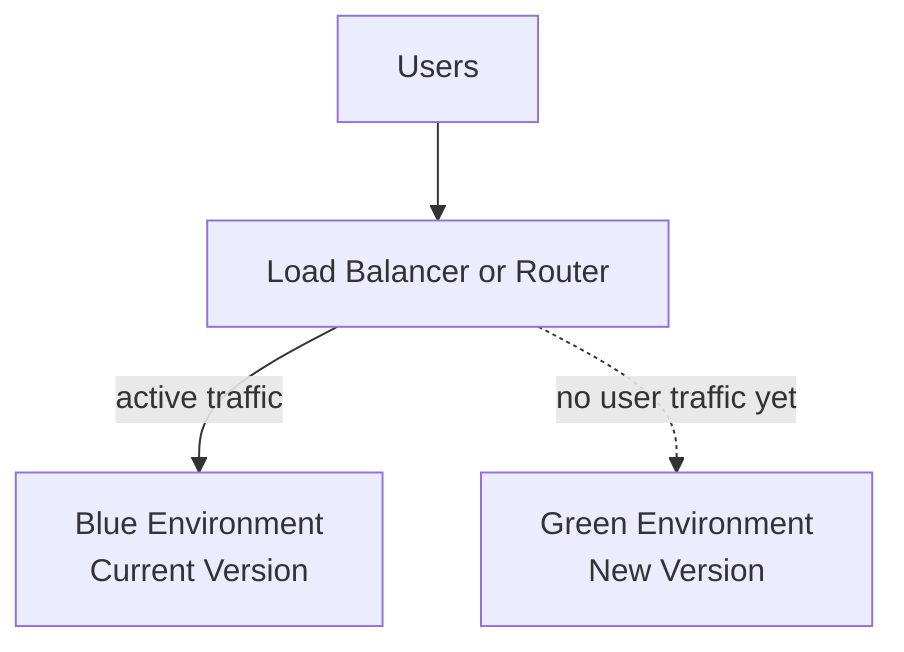

After validation, the route changes:

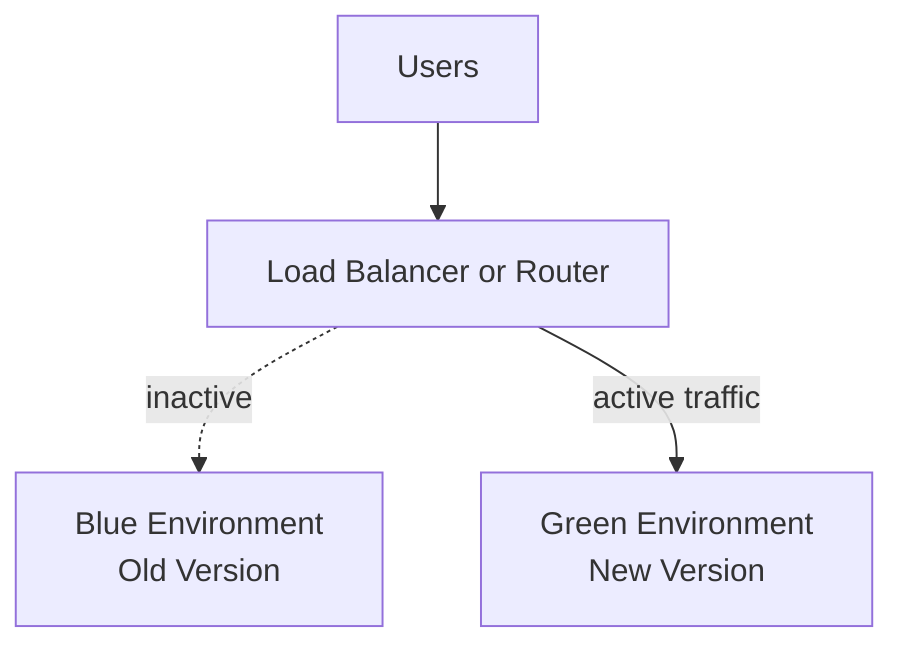

The central idea is:

> Deploy the new version somewhere safe first, validate it, then switch traffic when ready.

This separates **deployment** from **release**.

Deployment means the new version exists in production infrastructure.

Release means users actually receive traffic from that version.

---

#### Why this pattern exists

A traditional in-place deployment updates the active production environment directly.

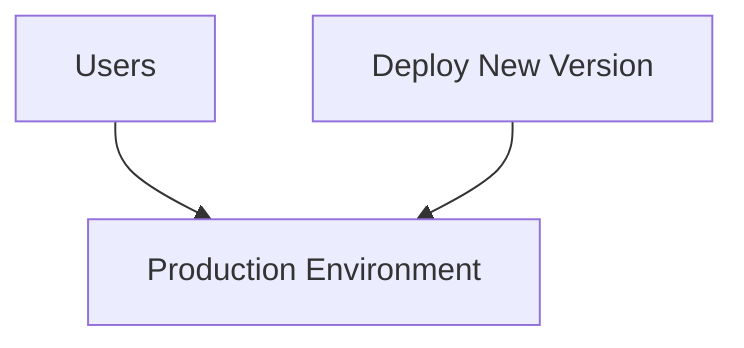

This is risky because users may experience the deployment while it is happening.

Problems can include:

- downtime during restart,
- partially updated instances,
- failed deployment leaving production in a mixed state,
- slow rollback,
- configuration mistakes,
- dependency mismatches,
- broken health checks,
- incompatible database migrations.

Blue-Green Deployment avoids many of these risks by preparing the new version in a separate environment before switching traffic.

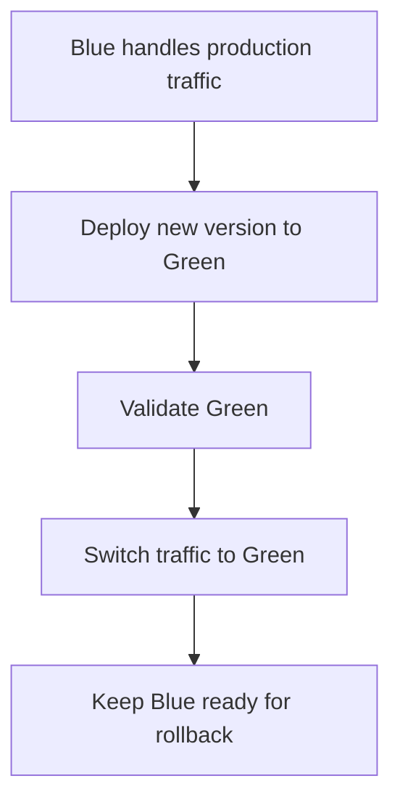

Instead of modifying the active environment in place, you create a ready-to-serve replacement.

---

#### What it solves

Blue-Green Deployment solves two major release problems.

First, it reduces **deployment downtime**.

The new version can start, warm up, connect to dependencies, pass health checks, and be validated before users are routed to it.

Second, it reduces **rollback risk**.

If green fails after the switch, traffic can often be routed back to blue quickly.

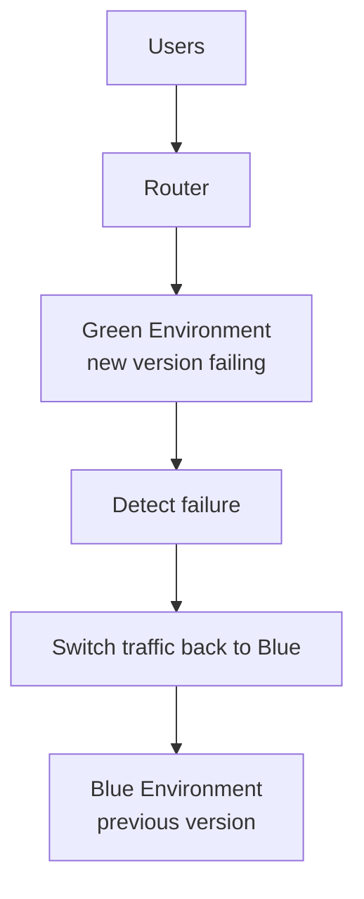

Rollback is fast because the previous version is still running.

This is very different from rebuilding and redeploying the old version during an incident.

---

#### Basic architecture

A basic Blue-Green setup has these parts:

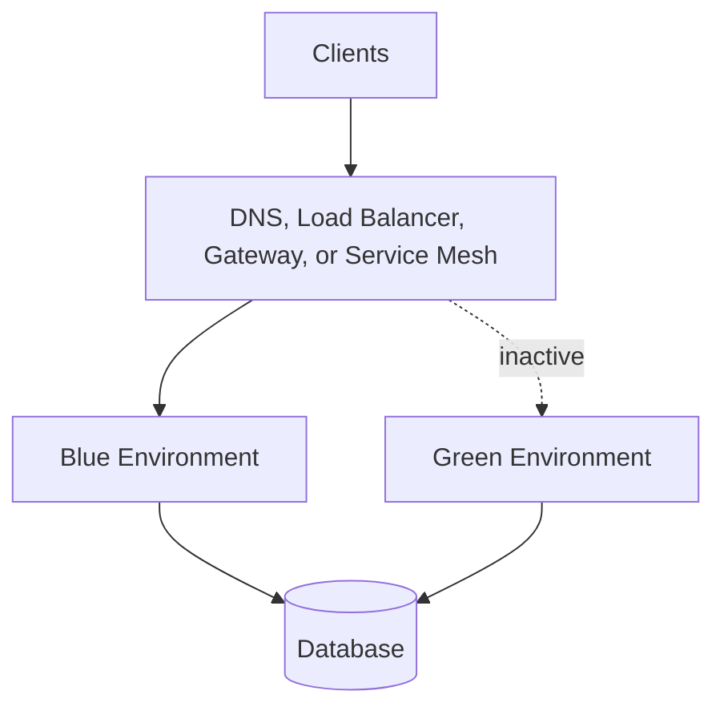

Common traffic switching mechanisms include:

| Mechanism | Example |
|---|---|
| Load balancer target switch | Change active target group |
| DNS switch | Point DNS to green endpoint |
| API gateway routing | Route traffic to green upstream |
| Kubernetes service selector | Change selector from blue pods to green pods |
| Service mesh routing | Change virtual service route |
| Feature flag or routing layer | Route users to active version |

The router is the control point.

It decides which environment receives production traffic.

---

#### Example: API service deployment

Suppose the current Order API is version `1.8.0` running in blue.

Green receives version `1.9.0`.

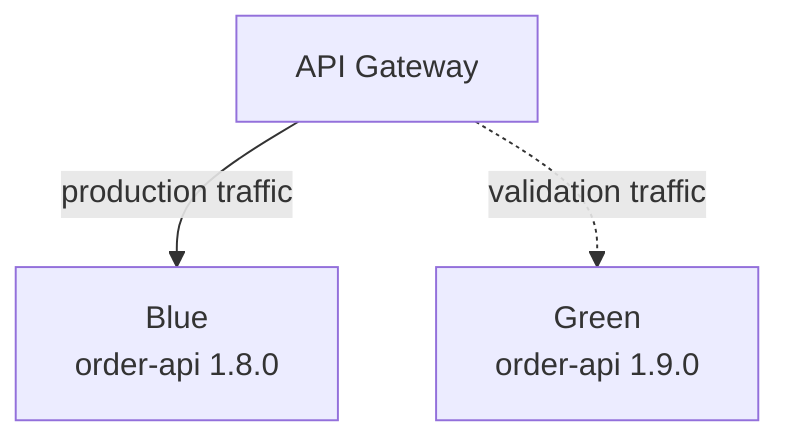

Validation checks may include:

- service starts successfully,
- health endpoint passes,
- dependency connections work,
- database migrations are compatible,
- smoke tests pass,
- authentication works,
- key API endpoints respond correctly,
- metrics are being emitted,
- logs are searchable,
- traces are generated,
- error rate is acceptable.

Example smoke test:

```bash
curl -f https://green.internal.example.com/health
curl -f https://green.internal.example.com/ready
curl -f https://green.internal.example.com/orders/test-order-id
```

If validation passes, traffic moves to green.

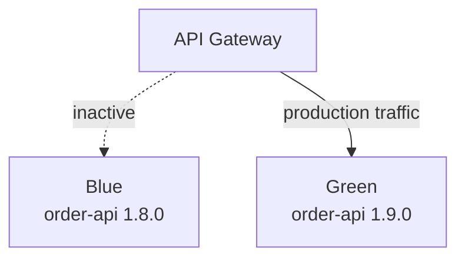

Blue stays available for rollback until the release is considered stable.

---

#### Deployment flow

A typical Blue-Green deployment flow looks like this:

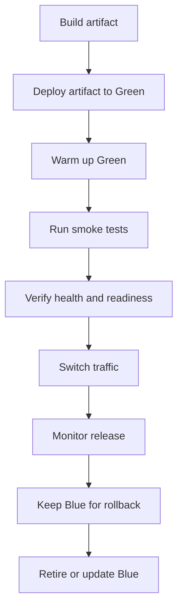

The important part is that the new version is validated before it becomes active.

---

#### Health checks and readiness checks

Blue-Green Deployment depends on good health checks.

A health check answers:

> Is the process alive?

A readiness check answers:

> Is this instance ready to receive production traffic?

Example health endpoint:

```http
GET /health
```

Response:

```json
{
  "status": "UP"
}
```

Example readiness endpoint:

```http
GET /ready
```

Response:

```json
{
  "status": "READY",
  "checks": {
    "database": "OK",
    "eventBus": "OK",
    "cache": "OK"
  }
}
```

Readiness should include dependencies that are required to serve traffic.

Do not switch traffic to green just because the process started.

A service can be alive but not ready.

---

#### Smoke tests

Smoke tests validate that the green environment works at a basic functional level.

Examples:

| Test | Purpose |
|---|---|
| `GET /health` | Process is running |
| `GET /ready` | Dependencies are reachable |
| Login test | Authentication works |
| Read endpoint test | Core read path works |
| Write endpoint test in safe mode | Core write path works without corrupting data |
| Event publish test | Messaging integration works |
| Observability test | Logs, metrics, and traces appear |

Example smoke test script:

```bash
set -e

BASE_URL="https://green.internal.example.com"

curl -f "$BASE_URL/health"
curl -f "$BASE_URL/ready"
curl -f "$BASE_URL/version"

curl -f \
  -H "Authorization: Bearer $SMOKE_TEST_TOKEN" \
  "$BASE_URL/orders/smoke-test-order"
```

Smoke tests should be fast and reliable.

They should catch obvious problems before traffic moves.

---

#### Traffic switching

Traffic switching should be explicit and observable.

For example, a gateway route might change from blue to green.

Before:

```yaml
route:
  service: order-api
  target: blue
  weight: 100
```

After:

```yaml
route:
  service: order-api
  target: green
  weight: 100
```

In Kubernetes, a service selector may switch labels.

```yaml
selector:
  app: order-api
  color: green
```

In a service mesh, routing can be controlled with weights.

```yaml
routes:
  - destination: order-api-blue
    weight: 0
  - destination: order-api-green
    weight: 100
```

Some teams switch all traffic at once. Others perform a short gradual transition, such as 10%, 50%, 100%.

A gradual transition starts to overlap with canary deployment, but it can still be useful in a Blue-Green release.

---

#### Rollback

Rollback is one of the biggest benefits of Blue-Green Deployment.

If green fails, route traffic back to blue.

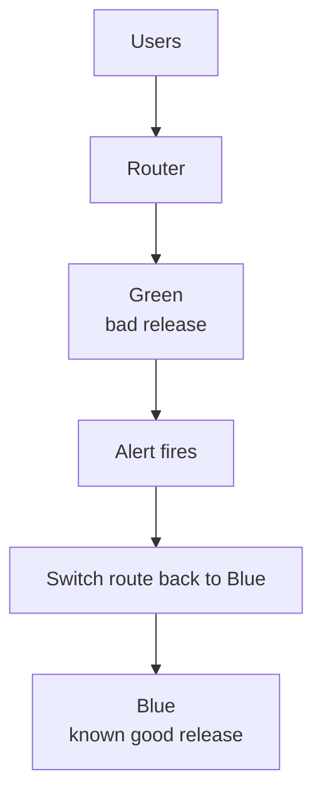

A rollback may be triggered by:

- high error rate,
- high latency,
- failed health checks,
- failed business metrics,
- elevated timeout rate,
- bad logs,
- failed synthetic checks,
- customer support reports,
- failed background jobs.

Example rollback command:

```bash
./switch-production --service order-api --target blue
```

Rollback must be practiced.

A rollback process that has never been tested is not reliable.

---

#### Database migration challenge

Database changes are the hardest part of Blue-Green Deployment.

The problem is that blue and green may run at the same time or need fast rollback.

That means the database must be compatible with both versions.

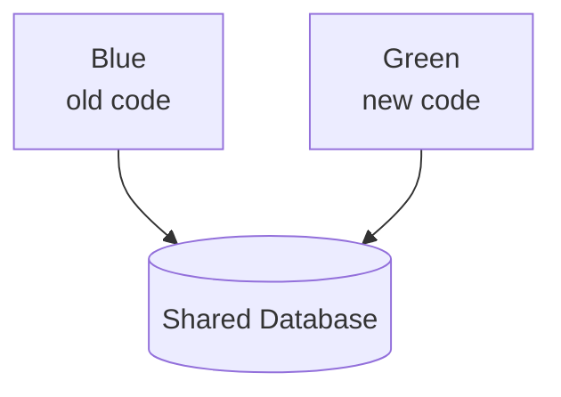

If green requires a schema that blue cannot use, rollback becomes difficult.

Bad migration:

```sql
ALTER TABLE orders DROP COLUMN total_amount;
```

If blue still reads `total_amount`, rollback will fail.

A safer approach is **expand and contract**.

---

#### Expand and contract migrations

Expand and contract is a safe schema migration approach.

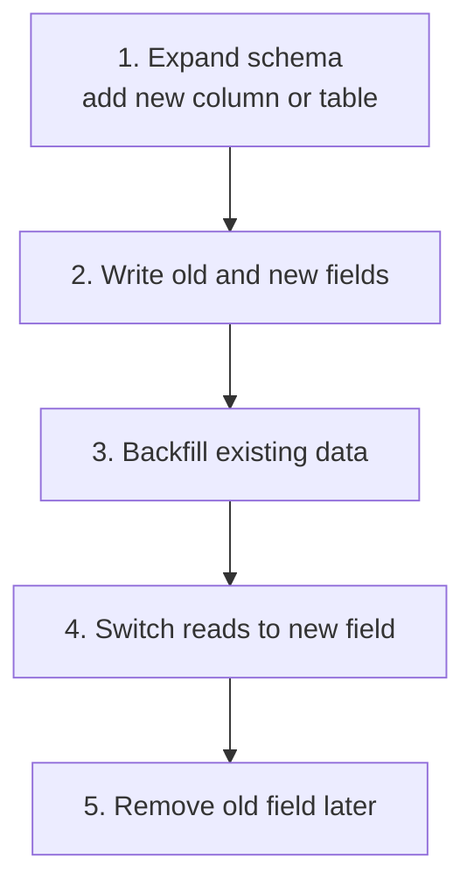

Example:

Step 1: Add new column.

```sql
ALTER TABLE orders ADD COLUMN total_amount_cents INTEGER;
```

Step 2: New code writes both fields.

```ts
await db.orders.update(orderId, {
  total_amount: totalAmountDecimal,
  total_amount_cents: totalAmountCents
});
```

Step 3: Backfill old rows.

```sql
UPDATE orders
SET total_amount_cents = total_amount * 100
WHERE total_amount_cents IS NULL;
```

Step 4: New code reads the new field.

Step 5: Remove the old field only after blue no longer needs it.

```sql
ALTER TABLE orders DROP COLUMN total_amount;
```

The final removal should happen in a later release, after rollback risk has passed.

---

#### Stateful services and background workers

Blue-Green Deployment is easiest for stateless services.

Stateful services and background workers need more care.

For example, a background worker may process messages from a queue.

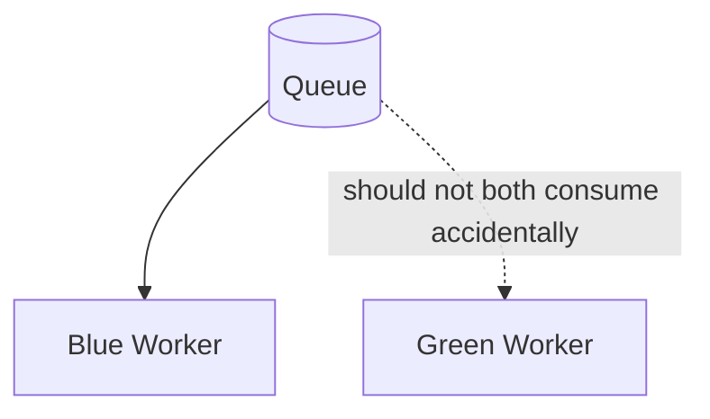

If both blue and green consume the same queue at the same time, messages may be processed by mixed versions.

That might be okay if the versions are compatible.

It can be dangerous if message handling changed.

Questions to answer:

- Should green workers start before the traffic switch?
- Should blue workers stop before green workers start?
- Can both versions process the same message schema?
- Are handlers idempotent?
- Are jobs safe to retry?
- Are poison messages handled?
- Is the database schema compatible with both worker versions?

For workers, deployment often needs a separate cutover plan.

---

#### Sessions and sticky state

Blue-Green Deployment works best when services are stateless.

If sessions are stored in memory, switching traffic can log users out or break requests.

Bad:

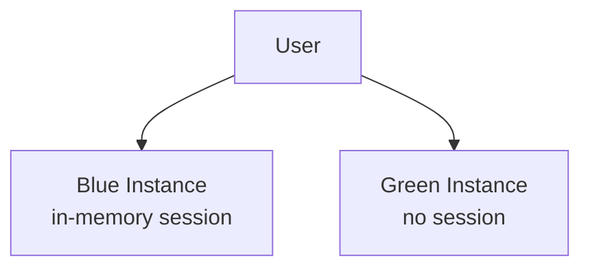

Better:

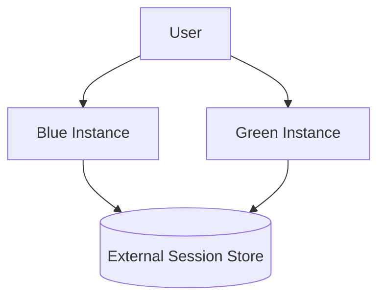

Externalizing session state makes traffic switching safer.

If sticky sessions are unavoidable, you need a strategy for draining blue traffic before switching fully.

---

#### Connection draining

When switching traffic away from blue, existing requests may still be in progress.

Connection draining lets existing requests finish while new requests go to green.

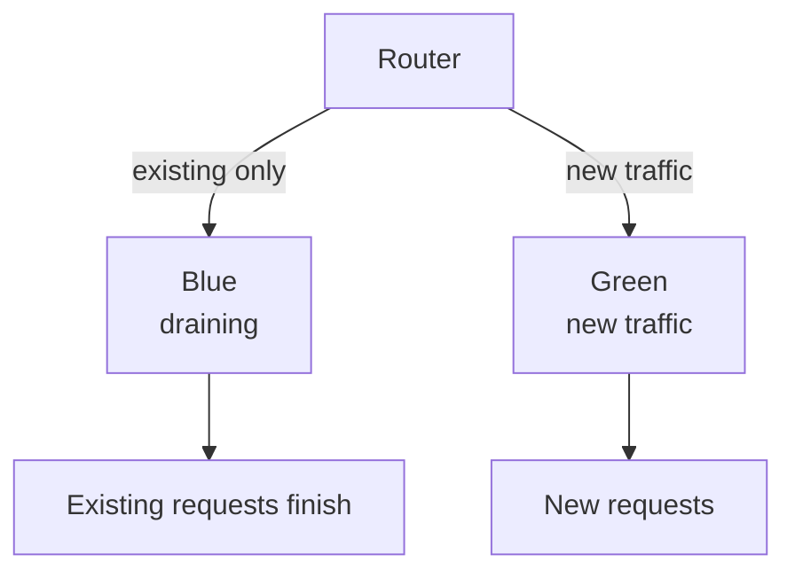

Without draining, users may see failed requests during the switch.

Good deployment systems support:

- readiness changes,
- graceful shutdown,
- request draining,
- termination grace periods,
- retry-safe clients.

Example graceful shutdown in Node.js:

```ts
const server = app.listen(3000);

process.on("SIGTERM", () => {
  server.close(() => {
    process.exit(0);
  });

  setTimeout(() => {
    process.exit(1);
  }, 30000);
});
```

This allows in-flight requests to complete.

---

#### Validation after switch

After traffic switches to green, monitoring should intensify.

Watch both technical and business signals.

Technical signals:

- error rate,
- latency,
- saturation,
- CPU and memory,
- restarts,
- dependency failures,
- database errors,
- queue lag,
- log anomalies.

Business signals:

- checkout success rate,
- payment authorization rate,
- sign-up completion rate,
- order creation rate,
- search conversion,
- notification delivery,
- fraud review volume,
- cancellation rate.

A release can be technically healthy but business-broken.

For example, error rate may be low, but checkout conversion may drop because the new UI flow rejects valid coupons.

---

#### Automated rollback gates

Some systems use automated rollback rules.

Example:

```yaml
rollbackPolicy:
  window: 10m
  conditions:
    - metric: http.error_rate
      threshold: 2%
    - metric: http.p95_latency_ms
      threshold: 800
    - metric: checkout.success_rate
      threshold: 95%
```

Flow:

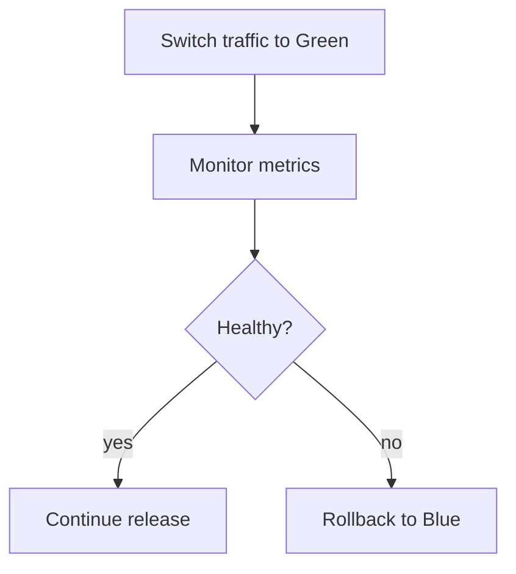

Automated rollback is powerful, but it requires high-quality metrics.

Bad alerts can cause unnecessary rollbacks.

Missing alerts can allow bad releases to continue.

---

#### Blue-Green vs rolling deployment

A rolling deployment gradually replaces instances in the same environment.

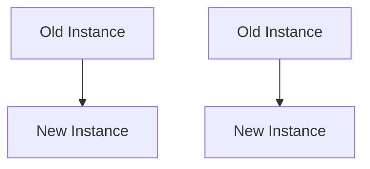

Blue-Green uses two separate environments.

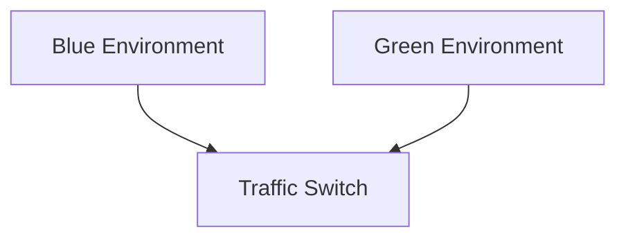

Comparison:

| Concern | Blue-Green | Rolling Deployment |
|---|---|---|
| Rollback speed | Usually fast | May require rolling back instances |
| Infrastructure cost | Higher temporarily | Lower |
| Mixed versions | Usually avoidable | Common during rollout |
| Validation before traffic | Strong | Limited |
| Database compatibility | Still important | Very important |
| Operational simplicity | Simple concept, more infra | Common in orchestrators |

Blue-Green is useful when rollback speed and environment-level validation matter.

Rolling deployment is often cheaper and simpler for routine releases.

---

#### Blue-Green vs canary deployment

Canary deployment releases the new version to a small percentage of users first.

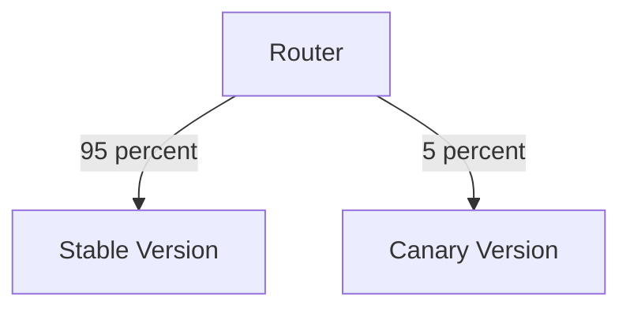

Blue-Green usually switches all traffic between two environments.

```mermaid
flowchart TD
    Router[Router]
    Blue[Blue]
    Green[Green]

    Router -->|100 percent after switch| Green
    Router -. 0 percent .-> Blue
```

Comparison:

| Concern | Blue-Green | Canary |
|---|---|---|
| Main idea | Switch environments | Gradually expose users |
| User exposure | Often all at once after validation | Small then increasing |
| Rollback | Switch back | Reduce canary traffic |
| Best for | Fast rollback, zero downtime | Risky behavioral changes |
| Cost | Duplicate environment | Usually less duplicate infra |

You can combine them: deploy green, then route 5%, 25%, 50%, and finally 100% to green.

---

#### Infrastructure cost

Blue-Green can require duplicate infrastructure.

```mermaid
flowchart TD
    Blue[Blue Environment<br/>full capacity]
    Green[Green Environment<br/>full or partial capacity]

    Cost[Temporary extra cost]

    Blue --> Cost
    Green --> Cost
```

The green environment may need:

- compute capacity,
- load balancer targets,
- service instances,
- caches,
- configuration,
- secrets,
- autoscaling policies,
- monitoring,
- logs,
- network rules.

Some teams reduce cost by running green at partial capacity before switch and scaling it up just before release.

That can work, but be careful: a green environment that has not been tested at production capacity may still fail under real load.

---

#### Configuration and secrets

Blue and green must have correct configuration.

Common mistakes:

- green points to the wrong database,
- green uses stale secrets,
- green lacks required environment variables,
- green has different feature flags,
- green cannot reach dependencies,
- green uses test credentials in production,
- green has different resource limits.

A validation check should compare environment configuration.

Example:

```bash
./validate-config --service order-api --environment green
```

Configuration drift between blue and green can make validation misleading.

The environments should be as similar as possible except for the application version and controlled release settings.

---

#### Observability requirements

Blue-Green Deployment needs release-aware observability.

Logs, metrics, and traces should include:

- service name,
- version,
- environment color,
- deployment ID,
- build SHA,
- region,
- route target.

Example log:

```json
{
  "service": "order-api",
  "version": "1.9.0",
  "environmentColor": "green",
  "deploymentId": "deploy_2026_04_29_001",
  "requestId": "req_123",
  "status": "success",
  "latencyMs": 42
}
```

This lets teams compare blue and green behavior.

Useful dashboards:

- error rate by color,
- latency by color,
- traffic by color,
- dependency errors by color,
- business metrics by color,
- health check status by color.

Without release-aware observability, you may not know whether errors are coming from blue or green.

---

#### Testing strategy

Blue-Green Deployment should be supported by multiple test layers.

| Test type | Purpose |
|---|---|
| Unit tests | Verify code behavior before deployment |
| Integration tests | Verify dependencies in test environments |
| Contract tests | Verify API and event compatibility |
| Smoke tests | Verify green works in production-like environment |
| Synthetic tests | Simulate user journeys against green |
| Load checks | Confirm green can handle expected traffic |
| Post-switch checks | Validate real production behavior |
| Rollback tests | Verify blue can be restored quickly |

Example synthetic test:

```bash
./synthetic-checkout \
  --base-url https://green.internal.example.com \
  --test-user synthetic-user@example.com \
  --dry-run
```

Production validation should avoid irreversible side effects unless the test data and cleanup process are safe.

---

#### When to use it

Use Blue-Green Deployment when:

- near-zero downtime matters,
- fast rollback matters,
- the service can run in two environments temporarily,
- the new version can be validated before exposure,
- releases are high risk,
- infrastructure changes need safe cutover,
- the system has good routing control,
- database migrations are backward compatible,
- production smoke testing is valuable.

Common use cases:

- APIs,
- backend services,
- web applications,
- major platform upgrades,
- infrastructure upgrades,
- service rewrites,
- high-traffic user-facing systems,
- releases where rollback speed matters.

---

#### When not to use it

Avoid or reconsider Blue-Green Deployment when:

- duplicate infrastructure is too expensive,
- the service cannot run two versions safely,
- database changes are not backward compatible,
- stateful workloads make cutover complex,
- traffic cannot be switched cleanly,
- validation in green would not be meaningful,
- canary deployment would provide safer gradual exposure,
- rolling deployment is sufficient.

Blue-Green is not a substitute for good migration discipline.

If green changes the database in a way that breaks blue, rollback may be impossible even if blue is still running.

---

#### Benefits

**1. Near-zero downtime**

Traffic can move from blue to green after green is already running.

**2. Fast rollback**

The previous environment remains available.

**3. Production-like validation**

The new version can be tested in real infrastructure before user traffic.

**4. Cleaner cutover**

The release is a routing change rather than an in-place mutation.

**5. Reduced deployment risk**

Failed deployments can be caught before traffic switches.

**6. Separation of deployment and release**

Code can be deployed before it is exposed.

---

#### Trade-offs

**1. Duplicate infrastructure cost**

Two environments may need to run at the same time.

**2. Database migrations are difficult**

Both blue and green may need to work with the same schema.

**3. Stateful workloads need special handling**

Sessions, queues, long-running jobs, and local state complicate cutover.

**4. Environment drift is possible**

Blue and green must remain equivalent enough for validation to matter.

**5. Traffic switch can still fail**

Routing, DNS, cache, and load balancer behavior can introduce problems.

**6. Rollback may not undo data changes**

If green writes bad data, switching back to blue may not fix the database.

---

#### Common mistakes

**Mistake 1: Ignoring database compatibility**

Rollback is unsafe if blue cannot run after green’s migration.

**Mistake 2: Treating health checks as enough**

A process can be healthy but functionally broken.

**Mistake 3: No rollback practice**

Rollback should be tested before it is needed during an incident.

**Mistake 4: Letting blue and green drift**

Different configuration makes validation unreliable.

**Mistake 5: Forgetting background workers**

Workers can process messages with mixed versions or duplicate behavior.

**Mistake 6: No connection draining**

In-flight requests may fail during traffic switch.

**Mistake 7: No release-aware metrics**

Teams cannot compare blue and green behavior.

**Mistake 8: Assuming rollback fixes data corruption**

Bad writes may require data repair, not just traffic rollback.

---

#### Practical design checklist

Before using Blue-Green Deployment, ask:

- What is blue?
- What is green?
- How is traffic switched?
- How fast can traffic be switched back?
- Are blue and green configured consistently?
- Is green validated before traffic?
- What smoke tests run against green?
- Are health and readiness checks meaningful?
- Does green have production-like capacity?
- Are database migrations backward compatible?
- Can blue still run after green is deployed?
- Are background workers handled safely?
- Are queues consumed by one version or both?
- Are sessions externalized?
- Is connection draining configured?
- What metrics decide release health?
- What business metrics are monitored?
- Are logs, metrics, and traces tagged by version and color?
- Who can trigger rollback?
- Has rollback been tested?
- How long is blue kept after switch?
- What data repair plan exists if green writes bad data?

A Blue-Green design is probably healthy if:

- traffic switching is reliable,
- rollback is fast and tested,
- database migrations are backward compatible,
- green is validated before release,
- observability is version-aware,
- background workers are handled explicitly,
- configuration drift is controlled,
- post-switch monitoring is strong.

A Blue-Green design is probably unhealthy if:

- the database breaks rollback,
- green is not tested before traffic,
- blue and green differ in unknown ways,
- rollback is manual and untested,
- workers run both versions accidentally,
- no metrics distinguish blue from green,
- bad data writes have no repair plan.

---

#### Related patterns

| Pattern | Relationship |
|---|---|
| Canary Deployment | Gradually exposes traffic instead of switching environments all at once |
| Rolling Deployment | Updates instances gradually in the same environment |
| Feature Flags | Separates code deployment from feature exposure |
| Shadow Deployment | Tests new version with copied traffic before release |
| Health Checks | Required to validate green readiness |
| Performance Metrics | Used to decide whether the release is healthy |
| Distributed Tracing | Helps compare behavior across versions |
| Consumer-Driven Contracts | Protects API compatibility before deployment |
| Database Migration Patterns | Critical for rollback-safe blue-green releases |
| Circuit Breaker | Can reduce blast radius if green calls failing dependencies |

---

#### Summary

Blue-Green Deployment uses two production-like environments: one active and one inactive. The new version is deployed to the inactive environment, validated, and then traffic is switched.

The central idea is:

> Prepare the new version before exposing users to it, and keep the old version ready for fast rollback.

Blue-Green Deployment is useful for APIs, backend services, web applications, infrastructure upgrades, and major releases where near-zero downtime and rollback speed matter.

A good Blue-Green release has:

- production-like blue and green environments,
- reliable traffic switching,
- meaningful smoke tests,
- health and readiness checks,
- backward-compatible database migrations,
- graceful connection draining,
- version-aware observability,
- tested rollback,
- and a data repair plan if needed.

The biggest trade-offs are duplicate infrastructure and database migration complexity. Blue-Green makes traffic rollback easier, but it does not automatically undo bad data changes.

---

### 38. Shadow Deployment

#### What it is

**Shadow Deployment** is a production validation pattern where real production traffic is copied to a new version of a service, but the new version’s responses are not returned to users.

The existing production version still handles the real user request.

The shadow version receives a copy of the request for testing, comparison, performance measurement, or migration validation.

```mermaid
flowchart TD
    Client[Client]
    Router[Router or Traffic Mirroring Layer]

    Current[Current Production Service]
    Shadow[Shadow Service<br/>New Version]

    Client --> Router

    Router -->|real request| Current
    Router -. copied request .-> Shadow

    Current -->|real response| Client
    Shadow -. response discarded or compared .-> Sink[Comparison or Metrics]
```

The central idea is:

> Let the new version experience real production traffic without letting it affect users.

Shadow Deployment is sometimes called:

- traffic mirroring,
- dark launch,
- shadow traffic,
- mirrored production testing,
- parallel run.

---

#### Why this pattern exists

Test environments rarely behave exactly like production.

Production traffic has:

- real request shapes,
- real user behavior,
- real data distribution,
- real traffic spikes,
- real headers,
- real tenant patterns,
- real slow clients,
- real malformed requests,
- real edge cases.

A service may pass all staging tests and still fail in production.

Shadow Deployment exists because it lets teams answer:

> How would the new version behave under real production traffic?

without sending users its responses.

This is especially valuable for rewritten services, new algorithms, new databases, and performance-sensitive changes.

---

#### What it solves

Shadow Deployment solves the problem of **insufficient production confidence**.

A normal release exposes users to the new version.

```mermaid
flowchart TD
    Users[Users]
    NewService[New Service Version]

    Users --> NewService
```

If the new version is wrong, users are affected.

Shadow Deployment validates the new version without user impact.

```mermaid
flowchart TD
    Users[Users]
    Current[Current Version]
    Shadow[Shadow Version]

    Users --> Current
    Users -. copied traffic .-> Shadow
```

It helps validate:

- correctness,
- performance,
- capacity,
- dependency behavior,
- schema compatibility,
- algorithm outputs,
- data migration accuracy,
- service rewrite parity,
- model predictions,
- database query patterns.

The key safety rule is:

> Shadow traffic must not create real side effects.

---

#### Basic architecture

A shadow deployment usually has these components:

```mermaid
flowchart TD
    Client[Client]
    Mirror[Traffic Mirror]

    Primary[Primary Service]
    Shadow[Shadow Service]

    Comparator[Comparator]
    Metrics[Metrics and Logs]

    Client --> Mirror

    Mirror -->|real traffic| Primary
    Mirror -. mirrored traffic .-> Shadow

    Primary -->|response to user| Client

    Primary --> Comparator
    Shadow --> Comparator
    Comparator --> Metrics
```

The primary service is authoritative.

The shadow service is observational.

Its response may be:

- discarded,
- logged,
- compared to the primary response,
- used for metrics,
- used to validate data migrations,
- used to train or evaluate models.

---

#### Example: rewritten service validation

Suppose a legacy Pricing Service is being rewritten.

The old service is trusted. The new service needs validation.

```mermaid
flowchart TD
    Checkout[Checkout Service]
    Mirror[Traffic Mirror]

    OldPricing[Old Pricing Service<br/>authoritative]
    NewPricing[New Pricing Service<br/>shadow]

    Diff[Response Comparator]

    Checkout --> Mirror

    Mirror --> OldPricing
    Mirror -. copied request .-> NewPricing

    OldPricing --> Checkout

    OldPricing --> Diff
    NewPricing --> Diff
```

The comparator checks whether both services produce the same price.

Example comparison result:

```json
{
  "requestId": "req_123",
  "match": false,
  "primary": {
    "total": 12999,
    "currency": "USD"
  },
  "shadow": {
    "total": 11999,
    "currency": "USD"
  },
  "difference": {
    "field": "total",
    "delta": -1000
  }
}
```

This lets teams find differences before the new service becomes authoritative.

---

#### Shadow traffic flow

A typical shadow request flow looks like this:

```mermaid
sequenceDiagram
    participant Client
    participant Gateway
    participant Current as Current Service
    participant Shadow as Shadow Service
    participant Compare as Comparator

    Client->>Gateway: Real request
    Gateway->>Current: Forward real request
    Gateway-->>Shadow: Mirror copied request

    Current-->>Gateway: Real response
    Gateway-->>Client: Real response

    Shadow-->>Compare: Shadow response
    Current-->>Compare: Primary response metadata
    Compare->>Compare: Compare or record metrics
```

The user only receives the current service response.

The shadow response does not affect the user.

---

#### Shadow Deployment vs Canary Deployment

Shadow and canary deployments are both production validation techniques, but they expose users differently.

Canary:

```mermaid
flowchart TD
    Router[Router]
    Stable[Stable Version]
    Canary[Canary Version]

    Router -->|95 percent users| Stable
    Router -->|5 percent users| Canary
```

Shadow:

```mermaid
flowchart TD
    Router[Router]
    Stable[Stable Version]
    Shadow[Shadow Version]

    Router -->|100 percent real responses| Stable
    Router -. copied traffic .-> Shadow
```

Comparison:

| Concern | Shadow Deployment | Canary Deployment |
|---|---|---|
| User receives new response? | No | Yes, for some users |
| User impact if broken? | Usually none | Possible for canary users |
| Good for correctness comparison? | Yes | Sometimes |
| Good for user behavior validation? | Limited | Yes |
| Side effects allowed? | Usually no | Yes, if real release |
| Measures real production load? | Yes | Yes |
| Validates full user journey? | Not fully | More fully |

Shadow Deployment is safer for validation.

Canary Deployment is better for measuring actual user impact.

---

#### Shadow Deployment vs Blue-Green Deployment

Blue-Green prepares a new environment and switches traffic to it.

Shadow Deployment sends copied traffic to a new version without switching user responses.

```mermaid
flowchart TD
    BlueGreen[Blue-Green<br/>traffic switch]
    Shadow[Shadow<br/>traffic copy]

    BlueGreen --> Release[New version handles users]
    Shadow --> Validate[New version observes traffic]
```

Comparison:

| Concern | Blue-Green | Shadow |
|---|---|---|
| Main purpose | Safe cutover and rollback | Production validation before exposure |
| User traffic handled by new version? | Yes after switch | No |
| Rollback mechanism | Switch back | Stop mirroring |
| Side-effect risk | Real side effects after switch | Must suppress side effects |
| Best for | Release cutover | Rewrites, algorithms, migrations |

These patterns can be combined.

For example, shadow a new service for a week, then deploy it using Blue-Green.

---

#### Avoiding side effects

The most important rule of Shadow Deployment is preventing side effects.

Shadow traffic should not:

- write real business data,
- send emails,
- charge payments,
- reserve inventory,
- create shipments,
- publish external events,
- call irreversible third-party APIs,
- mutate shared caches incorrectly,
- update customer-visible state.

Bad shadow design:

```mermaid
flowchart TD
    Shadow[Shadow Service]
    PaymentGateway[Payment Gateway]
    EmailProvider[Email Provider]
    Database[(Production Database)]

    Shadow --> PaymentGateway
    Shadow --> EmailProvider
    Shadow --> Database
```

Better:

```mermaid
flowchart TD
    Shadow[Shadow Service]

    StubPayment[Stubbed Payment Gateway]
    SuppressedEmail[Suppressed Email Sink]
    ReadOnlyDB[(Read-only DB or Safe Copy)]
    Metrics[Metrics]

    Shadow --> StubPayment
    Shadow --> SuppressedEmail
    Shadow --> ReadOnlyDB
    Shadow --> Metrics
```

Shadow systems should run in a mode where side effects are disabled, redirected, or safely simulated.

---

#### Shadow mode controls

A service can include explicit shadow-mode controls.

Example environment variable:

```bash
SHADOW_MODE=true
```

Example code:

```ts
type RuntimeMode = "LIVE" | "SHADOW";

class NotificationClient {
  constructor(private readonly mode: RuntimeMode) {}

  async sendEmail(message: EmailMessage): Promise<void> {
    if (this.mode === "SHADOW") {
      logger.info("Shadow mode: suppressing email", {
        template: message.template,
        recipientHash: hashEmail(message.to)
      });
      return;
    }

    await emailProvider.send(message);
  }
}
```

Payment example:

```ts
class PaymentGatewayClient {
  constructor(private readonly mode: RuntimeMode) {}

  async authorize(request: AuthorizePaymentRequest): Promise<PaymentResult> {
    if (this.mode === "SHADOW") {
      return {
        status: "SIMULATED",
        authorizationId: `shadow_${request.orderId}`
      };
    }

    return realGateway.authorize(request);
  }
}
```

Shadow mode should be difficult to accidentally disable.

Use explicit configuration, safeguards, and tests.

---

#### Read-only data access

Shadow services often need realistic reads.

They may read from:

- production read replicas,
- sanitized production snapshots,
- replicated databases,
- event streams,
- derived read models,
- safe test copies.

```mermaid
flowchart TD
    Shadow[Shadow Service]
    ReadReplica[(Production Read Replica)]
    PrimaryDB[(Primary Production DB)]

    PrimaryDB --> ReadReplica
    Shadow --> ReadReplica
```

Avoid letting shadow services write to source-of-truth databases.

If the shadow service must test write logic, write to an isolated shadow database.

```mermaid
flowchart TD
    Shadow[Shadow Service]
    ShadowDB[(Shadow Database)]
    RealDB[(Real Production Database)]

    Shadow --> ShadowDB
    Shadow -. no writes .-> RealDB
```

This allows performance and correctness testing without corrupting production state.

---

#### Response comparison

One common use of Shadow Deployment is response comparison.

The old service and new service process the same request.

Their responses are compared.

```mermaid
flowchart TD
    Request[Request]
    Old[Old Service]
    New[New Service]
    Comparator[Comparator]

    Request --> Old
    Request --> New

    Old --> Comparator
    New --> Comparator
```

The comparator may check:

- exact equality,
- allowed tolerance,
- field-level differences,
- missing fields,
- schema compatibility,
- response time differences,
- error differences,
- ranking differences.

Exact equality is not always appropriate.

For example, recommendation results may differ slightly but still be acceptable.

Example tolerance-based comparison:

```ts
type PriceResponse = {
  subtotalCents: number;
  taxCents: number;
  totalCents: number;
  currency: string;
};

function comparePriceResponses(
  primary: PriceResponse,
  shadow: PriceResponse
): ComparisonResult {
  const totalDelta = Math.abs(primary.totalCents - shadow.totalCents);

  return {
    match: totalDelta <= 1 && primary.currency === shadow.currency,
    differences: {
      totalDelta,
      currencyMatches: primary.currency === shadow.currency
    }
  };
}
```

For financial systems, tolerance may need to be zero.

For ranking systems, comparison may be statistical.

---

#### Handling nondeterminism

Some services are nondeterministic.

Examples:

- recommendation algorithms,
- fraud models,
- ML inference,
- randomized ranking,
- time-based pricing,
- services using live external data,
- services with race-sensitive results.

For these systems, exact response matching may be misleading.

Instead, compare metrics:

- distribution of scores,
- top-N overlap,
- false positive rate,
- latency distribution,
- error rate,
- percentage of requests with large output differences,
- business rule violations.

Example recommendation comparison:

```json
{
  "requestId": "req_123",
  "primaryTop10": ["p1", "p2", "p3", "p4"],
  "shadowTop10": ["p1", "p3", "p5", "p6"],
  "top10Overlap": 0.5
}
```

The goal is not always identical output.

The goal is understanding whether differences are acceptable.

---

#### Performance validation

Shadow Deployment is useful for performance testing under real traffic.

The shadow service experiences production request volume, shape, and timing.

Track:

- p50 latency,
- p95 latency,
- p99 latency,
- error rate,
- timeout rate,
- CPU usage,
- memory usage,
- database query latency,
- cache hit rate,
- dependency latency,
- queue lag,
- saturation.

Example log:

```json
{
  "service": "pricing-service-shadow",
  "requestId": "req_123",
  "mode": "shadow",
  "latencyMs": 87,
  "status": "success",
  "primaryLatencyMs": 63,
  "latencyDeltaMs": 24
}
```

Performance validation should compare the shadow version to the primary version under similar traffic.

Be careful: shadow traffic doubles some load unless isolated.

---

#### Load impact

Shadow traffic increases load.

If every production request is mirrored, downstream systems may see nearly double traffic.

```mermaid
flowchart TD
    Traffic[Production Traffic]
    Primary[Primary Service]
    Shadow[Shadow Service]
    Dependency[Shared Dependency]

    Traffic --> Primary
    Traffic -. mirrored .-> Shadow

    Primary --> Dependency
    Shadow --> Dependency

    Dependency --> ExtraLoad[Extra load]
```

This can overload:

- databases,
- caches,
- search indexes,
- downstream services,
- message brokers,
- third-party APIs,
- logging systems,
- metrics systems.

Mitigations:

- mirror only a percentage of traffic,
- sample requests,
- use read replicas,
- stub external dependencies,
- isolate shadow dependencies,
- rate limit shadow service,
- drop shadow requests under load,
- disable expensive paths.

Example sampling configuration:

```yaml
shadowTraffic:
  enabled: true
  sampleRate: 0.05
  target: pricing-service-v2-shadow
```

Start small. Increase gradually.

---

#### Sampling shadow traffic

Not all traffic must be mirrored.

Sampling strategies include:

| Strategy | Description |
|---|---|
| Fixed percentage | Mirror 1%, 5%, 10%, etc. |
| Tenant-based | Mirror selected tenants |
| Endpoint-based | Mirror only specific routes |
| Header-based | Mirror internal or test traffic |
| Region-based | Mirror one region first |
| Error-focused | Mirror unusual or edge-case requests |
| High-value flow | Mirror checkout, search, or pricing only |

Example route-specific mirroring:

```yaml
routes:
  - path: /price-quotes
    shadow:
      target: pricing-v2-shadow
      sampleRate: 0.10
  - path: /health
    shadow:
      enabled: false
```

Sampling reduces risk and cost.

It also lets teams focus on the traffic that matters most.

---

#### Shadowing writes safely

Shadowing read requests is usually easier.

Shadowing write requests is dangerous.

For example:

```http
POST /orders
```

If shadow service handles this normally, it may create duplicate orders.

Bad:

```mermaid
flowchart TD
    RealRequest[Create Order Request]
    Primary[Primary Order Service]
    Shadow[Shadow Order Service]
    OrderDB[(Order DB)]

    RealRequest --> Primary
    RealRequest -. copy .-> Shadow

    Primary --> OrderDB
    Shadow --> OrderDB
```

Better:

```mermaid
flowchart TD
    RealRequest[Create Order Request]
    Primary[Primary Order Service]
    Shadow[Shadow Order Service]

    OrderDB[(Real Order DB)]
    ShadowDB[(Shadow DB)]

    RealRequest --> Primary
    RealRequest -. copy .-> Shadow

    Primary --> OrderDB
    Shadow --> ShadowDB
```

For write shadowing, use:

- dry-run mode,
- isolated shadow database,
- transaction rollback,
- side-effect stubs,
- simulated writes,
- write suppression,
- explicit shadow headers,
- idempotency safeguards.

Example dry-run request header:

```http
X-Shadow-Mode: true
X-Dry-Run: true
```

The service should treat these as safety-critical controls.

---

#### Shadow databases

A shadow database can be used to test new write behavior safely.

```mermaid
flowchart TD
    ShadowService[Shadow Service]
    ShadowDB[(Shadow Database)]

    Replication[Production Data Snapshot or Replication]
    ProductionDB[(Production DB)]

    ProductionDB --> Replication
    Replication --> ShadowDB

    ShadowService --> ShadowDB
```

The shadow DB may be:

- restored from production backup,
- replicated from production read stream,
- populated from events,
- sanitized for privacy,
- reset periodically.

This lets teams validate:

- new schema,
- new query patterns,
- migration correctness,
- write performance,
- index design,
- data transformation logic.

Do not let the shadow DB become confused with production source of truth.

---

#### Migration validation

Shadow Deployment is especially useful for migrations.

Example: moving from old database to new database.

```mermaid
flowchart TD
    ServiceV1[Current Service]
    OldDB[(Old Database)]

    ServiceV2Shadow[New Service Shadow]
    NewDB[(New Database)]

    Traffic[Production Traffic]
    Mirror[Traffic Mirror]
    Comparator[Comparator]

    Traffic --> Mirror
    Mirror --> ServiceV1
    Mirror -. copied .-> ServiceV2Shadow

    ServiceV1 --> OldDB
    ServiceV2Shadow --> NewDB

    ServiceV1 --> Comparator
    ServiceV2Shadow --> Comparator
```

This helps answer:

- Does the new database contain equivalent data?
- Are queries faster or slower?
- Are results different?
- Are indexes sufficient?
- Does the new schema support real traffic?
- Are edge cases handled?

Shadow validation can catch migration issues before cutover.

---

#### Model and algorithm validation

Shadow Deployment is common for ML models, fraud systems, recommendations, ranking, pricing, and risk scoring.

```mermaid
flowchart TD
    Request[Production Request]
    CurrentModel[Current Model]
    ShadowModel[New Model]
    Evaluation[Offline Evaluation Store]

    Request --> CurrentModel
    Request -. copy .-> ShadowModel

    CurrentModel --> Evaluation
    ShadowModel --> Evaluation
```

The new model produces predictions, but those predictions do not affect users yet.

Example fraud comparison:

```json
{
  "transactionId": "txn_123",
  "currentModel": {
    "riskScore": 0.42,
    "decision": "ALLOW"
  },
  "shadowModel": {
    "riskScore": 0.91,
    "decision": "REVIEW"
  }
}
```

This lets risk teams analyze:

- how many decisions would change,
- false positive risk,
- false negative risk,
- latency impact,
- model drift,
- tenant-specific effects.

For models, shadow mode is often essential before real rollout.

---

#### Privacy and security

Shadow traffic is still production traffic.

It may contain:

- personal data,
- authentication tokens,
- payment-related data,
- tenant data,
- confidential business data,
- regulated information.

Security requirements still apply.

Important practices:

- redact sensitive headers,
- avoid storing raw request bodies unnecessarily,
- hash or tokenize identifiers in logs,
- limit who can access shadow data,
- use encryption in transit and at rest,
- enforce tenant isolation,
- avoid sending shadow traffic to unapproved environments,
- sanitize production snapshots,
- apply retention limits.

Bad logging:

```json
{
  "email": "customer@example.com",
  "cardNumber": "4111111111111111"
}
```

Better logging:

```json
{
  "emailHash": "hash_abc123",
  "paymentMethodId": "pm_456"
}
```

Shadow systems must meet production-grade security standards.

---

#### Observability requirements

Shadow deployments need clear observability.

Every shadow request should be identifiable.

Include metadata such as:

- request ID,
- trace ID,
- shadow mode flag,
- primary version,
- shadow version,
- route,
- tenant ID or tenant hash,
- comparison result,
- latency delta,
- error classification.

Example log:

```json
{
  "requestId": "req_123",
  "mode": "shadow",
  "primaryService": "pricing-v1",
  "shadowService": "pricing-v2",
  "primaryStatus": 200,
  "shadowStatus": 200,
  "responsesMatch": false,
  "differenceType": "TOTAL_AMOUNT_MISMATCH",
  "primaryLatencyMs": 45,
  "shadowLatencyMs": 71
}
```

Useful dashboards:

- shadow request rate,
- shadow error rate,
- primary vs shadow latency,
- response mismatch rate,
- mismatch categories,
- shadow dependency errors,
- shadow resource usage,
- dropped shadow requests,
- side-effect suppression count.

---

#### Trace propagation

Shadow requests should preserve trace context but be clearly marked as shadow traffic.

Example headers:

```http
traceparent: 00-4bf92f3577b34da6a3ce929d0e0e4736-00f067aa0ba902b7-00
X-Request-Id: req_123
X-Shadow-Traffic: true
```

This helps teams compare primary and shadow behavior across dependencies.

```mermaid
flowchart TD
    Gateway[Gateway]
    Primary[Primary Service]
    Shadow[Shadow Service]
    Trace[Distributed Trace]

    Gateway --> Primary
    Gateway -. shadow copy .-> Shadow

    Trace -. includes .-> Gateway
    Trace -. includes .-> Primary
    Trace -. includes .-> Shadow
```

Shadow spans should not be confused with user-visible production behavior.

Dashboards should separate shadow traffic from real traffic.

---

#### Dealing with timeouts

The primary response should not wait for the shadow response.

Bad:

```mermaid
flowchart TD
    Gateway[Gateway]
    Primary[Primary]
    Shadow[Shadow]
    Client[Client]

    Gateway --> Primary
    Gateway --> Shadow
    Shadow --> Gateway
    Primary --> Gateway
    Gateway --> Client
```

If the gateway waits for shadow, users may be slowed down by a test system.

Better:

```mermaid
flowchart TD
    Gateway[Gateway]
    Primary[Primary]
    Shadow[Shadow]
    Client[Client]

    Gateway --> Primary
    Gateway -. async mirror .-> Shadow
    Primary --> Gateway
    Gateway --> Client
```

Shadow processing should be asynchronous or fire-and-forget from the user’s perspective.

If the shadow service is slow or failing, drop or limit shadow traffic.

---

#### Backpressure and safety limits

Shadow systems should not harm production.

Use safety limits such as:

- maximum shadow request rate,
- queue size limits,
- timeout limits,
- circuit breakers,
- dependency isolation,
- automatic shadow disablement,
- sampling reduction under load.

Example:

```yaml
shadowSafety:
  maxRequestsPerSecond: 500
  timeoutMs: 250
  dropWhenQueueDepthAbove: 10000
  disableOnErrorRateAbove: 10%
```

Flow:

```mermaid
flowchart TD
    Mirror[Traffic Mirror]
    Safety{Within safety limits?}
    Shadow[Shadow Service]
    Drop[Drop shadow copy]

    Mirror --> Safety
    Safety -->|yes| Shadow
    Safety -->|no| Drop
```

Shadow traffic is optional.

Production user traffic is not.

---

#### Test data and synthetic markers

Sometimes shadow validation needs special synthetic requests.

These should be clearly marked.

Example:

```http
X-Synthetic-Test: true
X-Shadow-Validation: pricing-migration
```

Synthetic markers help services:

- suppress side effects,
- route to safe dependencies,
- avoid analytics pollution,
- identify test results,
- clean up test data.

However, real production traffic is still the main value of shadow deployment.

Synthetic tests are a supplement, not a replacement.

---

#### Data pollution

Shadow traffic can pollute analytics and monitoring if not labeled.

For example, if shadow requests are counted as real requests, dashboards may double traffic volume.

Bad metric:

```text
http.requests.total = primary + shadow
```

Better:

```text
http.requests.total{mode="live"}
http.requests.total{mode="shadow"}
```

Logs, metrics, traces, analytics, and audit streams should distinguish live from shadow traffic.

Shadow requests should usually not affect business analytics such as conversions, purchases, or user activity.

---

#### Comparing side-effect intent

Even if side effects are suppressed, the shadow service can record what it would have done.

Example:

```json
{
  "requestId": "req_123",
  "mode": "shadow",
  "wouldSendEmail": true,
  "emailTemplate": "order-confirmation",
  "wouldChargePayment": false,
  "wouldPublishEvents": ["OrderConfirmed"]
}
```

This is useful for validating behavior without doing the irreversible action.

For example, a new order service might report:

- would create order,
- would reserve inventory,
- would publish `OrderCreated`,
- would send confirmation email.

The comparator can check whether this matches expected behavior.

---

#### Failure handling

A shadow service failure should not fail the user request.

If the shadow service is down:

```mermaid
flowchart TD
    Client[Client]
    Gateway[Gateway]
    Primary[Primary Service]
    Shadow[Shadow Service Down]

    Client --> Gateway
    Gateway --> Primary
    Gateway -. shadow copy fails .-> Shadow
    Primary --> Gateway
    Gateway --> Client
```

The gateway should continue returning primary responses.

Shadow failures should be logged and monitored, but not surfaced to users.

Possible actions:

- stop mirroring,
- reduce sample rate,
- restart shadow service,
- alert owning team,
- inspect errors,
- continue primary traffic normally.

---

#### Validation windows

Shadow deployments should run long enough to see meaningful traffic.

Validation may need to cover:

- peak traffic,
- quiet periods,
- different regions,
- different tenants,
- different user types,
- batch jobs,
- rare endpoints,
- edge cases,
- weekend behavior,
- billing cycles.

For example, a billing service shadow test may need to run through an invoice generation cycle.

A search service shadow test may need to capture peak shopping hours.

A fraud model shadow test may need enough transaction diversity.

Do not declare success after only a few happy-path requests.

---

#### Promotion after shadow validation

Shadow Deployment is usually a step before real release.

A typical path:

```mermaid
flowchart TD
    Build[Build new version]
    Shadow[Run shadow deployment]
    Analyze[Analyze differences and performance]
    Fix[Fix issues]
    Canary[Canary release]
    Full[Full production release]

    Build --> Shadow
    Shadow --> Analyze
    Analyze --> Fix
    Fix --> Shadow
    Analyze --> Canary
    Canary --> Full
```

Shadow validation does not prove everything.

It shows how the new version behaves when observing production traffic.

Before full release, you may still need:

- canary deployment,
- Blue-Green cutover,
- feature flag rollout,
- manual approval,
- business metric monitoring.

Shadow is often a confidence-building step, not the final release mechanism.

---

#### When to use it

Use Shadow Deployment when:

- you are rewriting a service,
- you are changing a critical algorithm,
- you are migrating databases,
- you are replacing a dependency,
- you need production traffic validation,
- you need to compare old and new behavior,
- user impact must be avoided,
- performance under real traffic is uncertain,
- edge cases are hard to reproduce in staging,
- side effects can be safely suppressed.

Common use cases:

- pricing engine rewrite,
- fraud model replacement,
- recommendation algorithm update,
- search ranking change,
- new database migration,
- legacy service replacement,
- new API implementation,
- payment risk scoring,
- performance optimization,
- schema migration validation.

---

#### When not to use it

Avoid or reconsider Shadow Deployment when:

- requests cannot be safely duplicated,
- side effects cannot be suppressed,
- shadow traffic would overload dependencies,
- production data cannot be sent to the shadow environment,
- comparison results would not be meaningful,
- the service depends on real-time external state that cannot be mirrored,
- the validation requires real user responses,
- a canary release would be more appropriate,
- observability is not strong enough to analyze results.

Shadow Deployment is safest when the shadow system can process requests without changing the real world.

If that cannot be guaranteed, do not shadow the traffic until safety controls exist.

---

#### Benefits

**1. Production validation without user impact**

The new version sees real traffic, but users still receive responses from the current version.

**2. Better confidence than staging alone**

Real traffic exposes edge cases that test environments often miss.

**3. Useful for rewrites and migrations**

Old and new systems can be compared before cutover.

**4. Performance insight**

The new version can be measured under real request patterns.

**5. Algorithm comparison**

New models, rankings, and pricing logic can be evaluated safely.

**6. Safer release preparation**

Issues can be found before canary or full rollout.

---

#### Trade-offs

**1. Increased load**

Mirroring traffic can significantly increase system load.

**2. Side-effect risk**

Shadow services must not perform real irreversible actions.

**3. More infrastructure**

A shadow environment, comparison pipeline, and observability may be needed.

**4. Response comparison can be difficult**

Nondeterministic systems may not produce identical outputs.

**5. Production data risk**

Shadow systems must protect sensitive data.

**6. Not a complete release test**

Users do not interact with the shadow response, so UX and behavior impact are not fully validated.

**7. Analytics pollution risk**

Shadow traffic must be labeled and excluded from business metrics.

---

#### Common mistakes

**Mistake 1: Allowing shadow side effects**

Shadow traffic must not send emails, charge cards, create shipments, or mutate real state.

**Mistake 2: Mirroring too much traffic too soon**

Start with a small percentage and watch load.

**Mistake 3: Waiting for shadow response**

User requests should not be slowed down by the shadow path.

**Mistake 4: No comparison strategy**

Capturing shadow responses is not useful unless differences are analyzed.

**Mistake 5: Expecting exact matches for nondeterministic systems**

Some systems need statistical or tolerance-based comparisons.

**Mistake 6: Polluting metrics and analytics**

Shadow traffic must be tagged separately.

**Mistake 7: Sending sensitive data to unsafe environments**

Shadow environments must meet production-grade security requirements.

**Mistake 8: Assuming shadow success means release success**

Shadow validation does not replace canary, monitoring, or rollback planning.

---

#### Practical design checklist

Before using Shadow Deployment, ask:

- What service or behavior are we validating?
- What traffic will be mirrored?
- What percentage of traffic will be mirrored?
- Which endpoints are included?
- Which tenants or regions are included?
- How is shadow traffic routed?
- Does the primary response avoid waiting for shadow?
- What side effects must be disabled?
- How are writes handled safely?
- Does the shadow service use a shadow database?
- Are external calls stubbed, suppressed, or redirected?
- How are primary and shadow responses compared?
- What differences are acceptable?
- How are nondeterministic outputs evaluated?
- How are logs, metrics, and traces tagged?
- How is sensitive data protected?
- How is shadow traffic prevented from polluting analytics?
- What load increase is expected?
- What safety limits exist?
- What happens if the shadow service fails?
- How long will shadow validation run?
- What criteria determine readiness for canary or release?

A Shadow Deployment is probably healthy if:

- shadow traffic cannot affect users,
- side effects are suppressed or isolated,
- traffic volume is controlled,
- comparison logic is defined,
- observability is strong,
- sensitive data is protected,
- shadow failures do not affect live requests,
- promotion criteria are clear.

A Shadow Deployment is probably unhealthy if:

- shadow services write to production state,
- external side effects can happen,
- mirrored traffic overloads dependencies,
- results are collected but never analyzed,
- shadow traffic is mixed into business metrics,
- sensitive production data is exposed unsafely,
- teams assume shadow success guarantees release success.

---

#### Related patterns

| Pattern | Relationship |
|---|---|
| Blue-Green Deployment | Can release a shadow-validated version with fast rollback |
| Canary Deployment | Often follows shadow validation to expose real users gradually |
| Feature Flags | Can disable side effects or control exposure |
| Gateway Routing | Often used to mirror traffic to shadow services |
| Consumer-Driven Contracts | Validates API compatibility before shadowing |
| Distributed Tracing | Helps compare primary and shadow request paths |
| Performance Metrics | Measures latency, errors, and resource impact under shadow traffic |
| Log Aggregation | Captures differences and shadow errors |
| Anti-Corruption Layer | Useful when shadowing a replacement for a legacy system |
| Strangler Fig Pattern | Shadowing can validate a new service before redirecting traffic |

---

#### Summary

Shadow Deployment sends a copy of real production traffic to a new version without affecting users.

The central idea is:

> Let the new version observe production traffic before it becomes responsible for production responses.

This pattern is useful for rewritten services, new algorithms, new databases, fraud models, recommendation systems, performance optimizations, and migration validation.

A good Shadow Deployment has:

- controlled traffic mirroring,
- no user-visible shadow responses,
- strict side-effect suppression,
- isolated or read-only data access,
- response comparison,
- shadow-specific metrics and logs,
- security controls for production data,
- load safety limits,
- and clear promotion criteria.

The main trade-off is complexity and extra load. Shadow traffic must be carefully isolated so it does not write data, trigger irreversible actions, overload dependencies, or pollute analytics. Done well, it gives high-confidence production validation before users are exposed to a new version.
