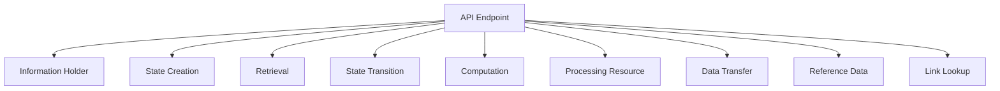
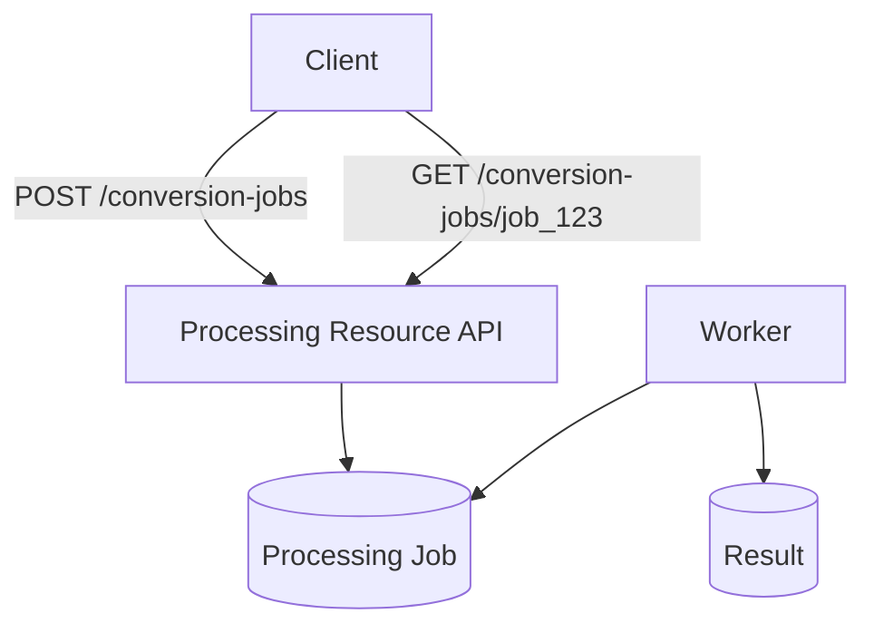
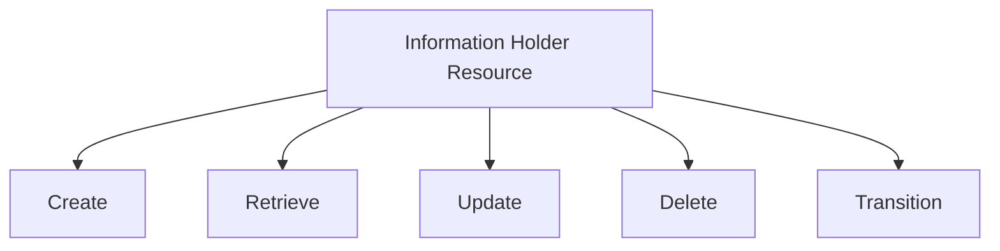
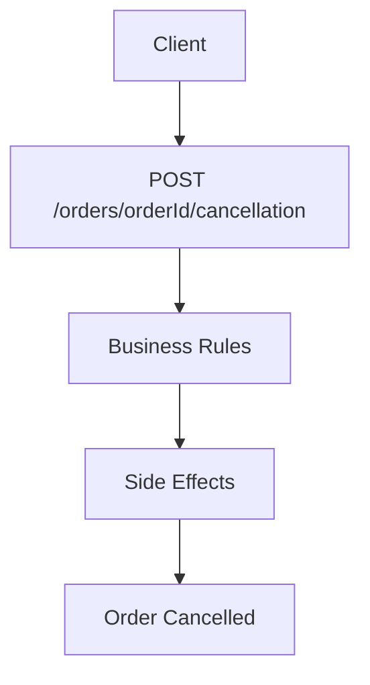
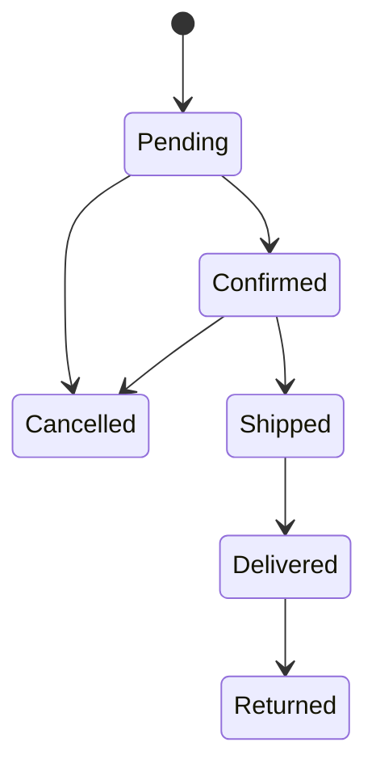
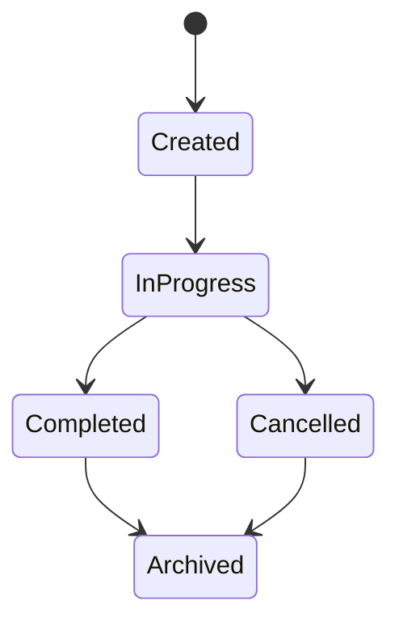
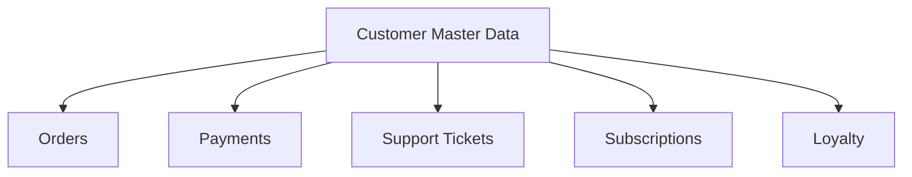
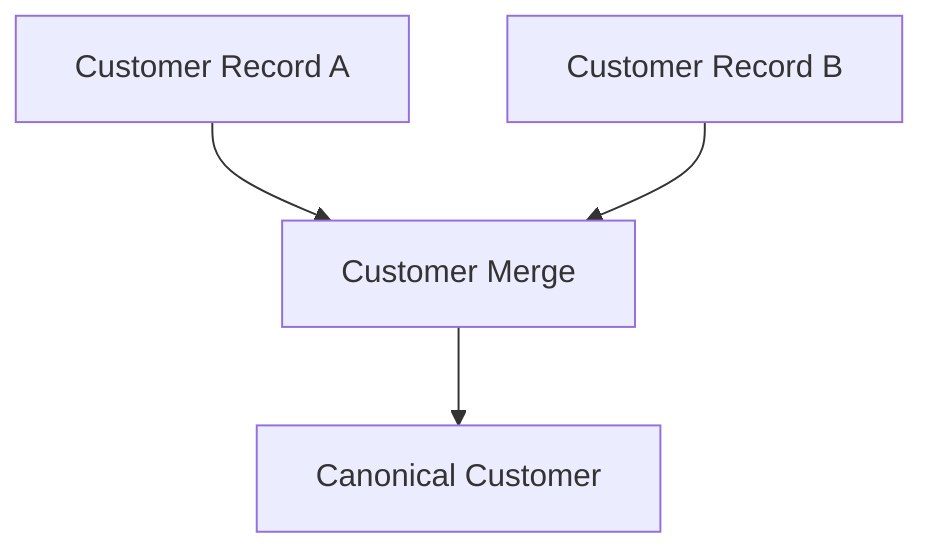
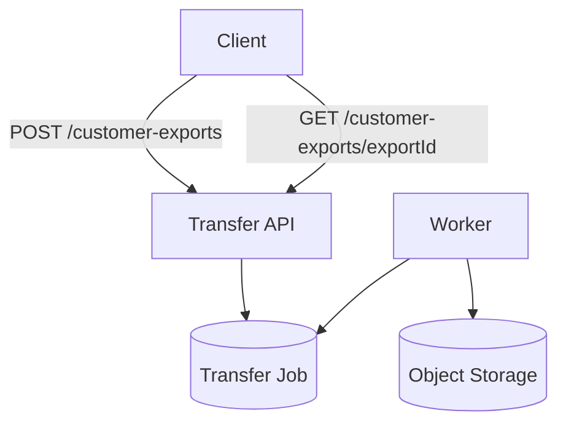

# API Design Patterns - Responsibility

# Table of Contents

- [Responsibility](#responsibility)
  - [Processing Resource](#processing-resource)
  - [Information Holder Resource](#information-holder-resource)
  - [Computation Function](#computation-function)
  - [State Creation Operation](#state-creation-operation)
  - [Retrieval Operation](#retrieval-operation)
  - [State Transition Operation](#state-transition-operation)
  - [Operational Data Holder](#operational-data-holder)
  - [Master Data Holder](#master-data-holder)
  - [Reference Data Holder](#reference-data-holder)
  - [Data Transfer Resource](#data-transfer-resource)
  - [Link Lookup Resource](#link-lookup-resource)

---

### Responsibility

These patterns describe what an API endpoint or resource is responsible for.

Responsibility is one of the most important parts of API design because it determines what a resource means, what clients can safely expect from it, and where business behavior belongs.

A well-designed API should make it clear whether an endpoint is responsible for:

- holding business information,
- creating new state,
- retrieving existing state,
- moving a resource through a lifecycle,
- performing a computation,
- starting background processing,
- transferring large amounts of data,
- exposing reference data,
- or helping clients discover related resources.

When responsibility is unclear, APIs tend to become inconsistent. Teams may create endpoints such as `/doPayment`, `/processThing`, `/updateStatus`, or `/getData`, which expose implementation thinking instead of business meaning.

A useful API design question is:

> What responsibility does this endpoint represent from the client’s point of view?

The answer should guide the resource name, HTTP method, request body, response shape, error model, idempotency behavior, and lifecycle semantics.

For example, these endpoints all perform work, but they represent different responsibilities:

```http
POST /orders
GET /orders/ord_123
POST /orders/ord_123/cancellation
POST /shipping-estimates
POST /document-conversion-jobs
GET /countries
POST /customer-exports
```

They should not all be modeled the same way. An order is an information holder and operational record. A cancellation is a state transition. A shipping estimate is a computation. A document conversion job is a processing resource. Countries are reference data. A customer export is a data transfer resource.



The sections below describe common API responsibilities and how to model them cleanly.

---

#### Processing Resource

##### What it is

A **Processing Resource** is an API resource that represents processing activity rather than a simple data object.

It is used when the client wants the system to perform work such as:

- conversion,
- validation,
- enrichment,
- authorization,
- analysis,
- generation,
- import,
- export,
- workflow execution,
- background processing.

The resource is usually named as a noun that represents the processing request or job.

Examples:

```http
POST /conversion-jobs
POST /report-generation-jobs
POST /payment-authorizations
POST /fraud-screening-jobs
POST /document-validations
POST /image-processing-jobs
POST /data-import-jobs
```

The important idea is:

> The API resource represents the processing request, not a generic action verb.

Instead of this:

```http
POST /convertDocument
POST /runReport
POST /doPayment
```

Prefer this:

```http
POST /conversion-jobs
POST /report-generation-jobs
POST /payment-authorizations
```

The second form gives the operation a resource identity. That resource can have status, results, timestamps, errors, links, ownership, and audit history.



##### What it solves

Processing Resource solves the problem of forcing every API into CRUD-style resource modeling.

Some operations are not simple create/read/update/delete operations on an existing business object.

For example, document conversion is not exactly “create a document” or “update a document.” It is a processing request:

```http
POST /conversion-jobs
Content-Type: application/json

{
  "sourceDocumentId": "doc_123",
  "targetFormat": "pdf"
}
```

Response:

```http
HTTP/1.1 202 Accepted
Content-Type: application/json

{
  "jobId": "job_456",
  "status": "QUEUED",
  "links": {
    "self": "/conversion-jobs/job_456"
  }
}
```

This is clearer than:

```http
POST /documents/doc_123/convertToPdf
```

The resource-based version gives the processing request its own lifecycle.

##### Common shapes

Processing resources commonly have one of two shapes.

###### Synchronous processing

Use this when processing is fast and the result can be returned immediately.

```http
POST /document-validations
Content-Type: application/json

{
  "documentId": "doc_123"
}
```

Response:

```json
{
  "valid": false,
  "errors": [
    {
      "field": "dateOfBirth",
      "code": "MISSING_REQUIRED_FIELD"
    }
  ]
}
```

###### Asynchronous processing

Use this when processing may take a long time.

```http
POST /report-generation-jobs
Content-Type: application/json

{
  "reportType": "monthly-revenue",
  "month": "2026-04"
}
```

Response:

```json
{
  "jobId": "job_123",
  "status": "QUEUED",
  "createdAt": "2026-04-29T12:00:00Z",
  "links": {
    "self": "/report-generation-jobs/job_123"
  }
}
```

Then clients poll or subscribe for completion:

```http
GET /report-generation-jobs/job_123
```

Response:

```json
{
  "jobId": "job_123",
  "status": "COMPLETED",
  "result": {
    "downloadUrl": "/reports/rpt_789/download"
  }
}
```

##### Example implementation

```ts
import express, { Request, Response } from "express";
import crypto from "crypto";

const app = express();
app.use(express.json());

type ConversionJobStatus = "QUEUED" | "RUNNING" | "COMPLETED" | "FAILED";

type ConversionJob = {
  jobId: string;
  sourceDocumentId: string;
  targetFormat: string;
  status: ConversionJobStatus;
  resultDocumentId?: string;
  errorCode?: string;
  createdAt: string;
  updatedAt: string;
};

const jobs = new Map<string, ConversionJob>();

app.post("/conversion-jobs", async (req: Request, res: Response) => {
  const { sourceDocumentId, targetFormat } = req.body;

  if (!sourceDocumentId || !targetFormat) {
    res.status(400).json({
      error: "INVALID_REQUEST",
      message: "sourceDocumentId and targetFormat are required"
    });
    return;
  }

  const now = new Date().toISOString();
  const job: ConversionJob = {
    jobId: `job_${crypto.randomUUID()}`,
    sourceDocumentId,
    targetFormat,
    status: "QUEUED",
    createdAt: now,
    updatedAt: now
  };

  jobs.set(job.jobId, job);

  // In a real system, enqueue a background job here.

  res.status(202).json({
    jobId: job.jobId,
    status: job.status,
    links: {
      self: `/conversion-jobs/${job.jobId}`
    }
  });
});

app.get("/conversion-jobs/:jobId", (req: Request, res: Response) => {
  const job = jobs.get(req.params.jobId);

  if (!job) {
    res.status(404).json({
      error: "JOB_NOT_FOUND"
    });
    return;
  }

  res.json(job);
});
```

##### Design guidance

Use a Processing Resource when the operation has enough identity or lifecycle to be worth modeling as a resource.

A good Processing Resource usually has:

- a stable ID,
- a status,
- creation time,
- completion time,
- progress or current stage,
- result location,
- failure reason,
- ownership or requester information,
- audit trail.

Common statuses:

```text
QUEUED
RUNNING
COMPLETED
FAILED
CANCELLED
EXPIRED
```

##### Trade-offs

Processing resources should be named carefully.

If overused, an API can become a collection of action-like resources that feel inconsistent:

```http
POST /payment-processes
POST /order-handlers
POST /customer-updaters
POST /thing-runners
```

Use business nouns, not vague technical names.

Better:

```http
POST /payment-authorizations
POST /order-fulfillment-jobs
POST /customer-imports
```

Avoid turning every action into a processing job. If the operation is really a state transition on an existing resource, model it as a transition operation instead.

---

#### Information Holder Resource

##### What it is

An **Information Holder Resource** represents a business object or data-holding entity.

Examples:

```http
/customers
/orders
/products
/accounts
/invoices
/payments
/shipments
/support-tickets
/documents
```

These resources are usually nouns. They represent things the business understands.

An Information Holder Resource may support operations such as:

```http
GET /orders/ord_123
POST /orders
PATCH /orders/ord_123
DELETE /documents/doc_123
```

The central idea is:

> Model durable business information as stable resources with clear identity.

For example, an order is not just the result of a checkout action. It is a durable business record.

```json
{
  "orderId": "ord_123",
  "customerId": "cus_456",
  "status": "CONFIRMED",
  "totalAmount": {
    "amount": 129.99,
    "currency": "USD"
  },
  "createdAt": "2026-04-29T12:00:00Z"
}
```

##### What it solves

Information Holder Resources give clients stable ways to interact with business data.

Without them, APIs may become action-oriented:

```http
POST /getCustomer
POST /createOrder
POST /updateProduct
POST /deleteDocument
```

A resource-oriented API is clearer:

```http
GET /customers/cus_123
POST /orders
PATCH /products/prod_123
DELETE /documents/doc_123
```

This gives the API a predictable structure.



##### Examples

###### Customer resource

```http
GET /customers/cus_123
```

```json
{
  "customerId": "cus_123",
  "displayName": "Alex Morgan",
  "email": "alex@example.com",
  "status": "ACTIVE"
}
```

###### Order resource

```http
GET /orders/ord_456
```

```json
{
  "orderId": "ord_456",
  "customerId": "cus_123",
  "status": "CONFIRMED",
  "items": [
    {
      "productId": "prod_789",
      "quantity": 1,
      "unitPrice": 129.99
    }
  ]
}
```

###### Product resource

```http
GET /products/prod_789
```

```json
{
  "productId": "prod_789",
  "name": "Trail Running Shoe",
  "category": "Footwear",
  "status": "ACTIVE"
}
```

##### Resource identity

Information Holder Resources should usually have stable identifiers.

Good:

```http
GET /customers/cus_123
GET /orders/ord_456
GET /products/prod_789
```

Weak:

```http
GET /customer?email=alex@example.com
GET /order?number=100001
```

Query-based lookup can be useful, but canonical resources should have stable IDs.

##### Resource representation vs database row

An API resource does not need to match a database table.

The internal database may store:

```sql
CREATE TABLE orders (
    order_id TEXT PRIMARY KEY,
    customer_id TEXT NOT NULL,
    status TEXT NOT NULL,
    total_amount_cents INTEGER NOT NULL,
    currency TEXT NOT NULL
);
```

The API may expose:

```json
{
  "orderId": "ord_123",
  "customerId": "cus_456",
  "status": "CONFIRMED",
  "totalAmount": {
    "amount": 129.99,
    "currency": "USD"
  }
}
```

This decouples the public API contract from internal persistence.

##### Trade-offs

Not every endpoint should be modeled as an Information Holder Resource.

For example:

```http
POST /tax-calculations
POST /shipping-estimates
POST /orders/ord_123/cancellation
POST /report-generation-jobs
```

These are not simple business entities. They represent computation, state transition, or processing.

Overusing Information Holder Resources can lead to awkward APIs such as:

```http
PATCH /orders/ord_123

{
  "status": "CANCELLED"
}
```

This may bypass important business rules. For important lifecycle changes, use State Transition Operations.

---

#### Computation Function

##### What it is

A **Computation Function** calculates or derives a result from input data without necessarily creating durable state.

Examples:

```http
POST /shipping-estimates
POST /tax-calculations
POST /price-quotes
POST /eligibility-checks
POST /risk-scores
POST /currency-conversions
POST /recommendation-scores
```

The central idea is:

> The endpoint computes an answer; it does not primarily manage a durable resource.

For example:

```http
POST /shipping-estimates
Content-Type: application/json

{
  "destination": {
    "country": "US",
    "postalCode": "94105"
  },
  "items": [
    {
      "productId": "prod_123",
      "quantity": 2
    }
  ]
}
```

Response:

```json
{
  "options": [
    {
      "method": "STANDARD",
      "estimatedDays": 5,
      "cost": {
        "amount": 7.99,
        "currency": "USD"
      }
    },
    {
      "method": "EXPRESS",
      "estimatedDays": 2,
      "cost": {
        "amount": 19.99,
        "currency": "USD"
      }
    }
  ]
}
```

##### What it solves

Computation Function avoids awkward resource modeling when the result is derived from inputs.

Bad:

```http
GET /shippingCost?postalCode=94105&weight=10
```

This can become messy as inputs grow.

Better:

```http
POST /shipping-estimates
```

with a structured request body.

Although `POST` is often associated with creation, it is also commonly used for complex computations where request inputs are too large or sensitive for a query string.

##### Idempotency

Computation functions should usually be idempotent when possible.

That means the same input should produce the same result, assuming the underlying reference data has not changed.

For example:

```http
POST /tax-calculations
Content-Type: application/json

{
  "sellerRegion": "CA",
  "buyerRegion": "NY",
  "amount": 100.00,
  "currency": "USD"
}
```

This should not create a new tax record every time. It should calculate a result.

Response:

```json
{
  "taxAmount": 8.75,
  "currency": "USD",
  "rulesVersion": "2026-04-01"
}
```

##### Computation vs creation

A computation may produce a result without storing it.

A creation operation creates durable state.

Compare:

```http
POST /price-quotes
```

If the quote is temporary and not stored, it is a computation.

But if the quote becomes durable, has an ID, can be accepted later, and has expiration, it may be better modeled as a resource:

```http
POST /quotes
GET /quotes/quote_123
POST /quotes/quote_123/acceptance
```

A good rule:

> If clients need to retrieve, reference, expire, accept, audit, or manage the result later, model it as a resource.

##### Example implementation

```ts
import express, { Request, Response } from "express";

const app = express();
app.use(express.json());

type ShippingEstimateRequest = {
  destination: {
    country: string;
    postalCode: string;
  };
  items: Array<{
    productId: string;
    quantity: number;
    weightGrams: number;
  }>;
};

function calculateShipping(request: ShippingEstimateRequest) {
  const totalWeight = request.items.reduce(
    (sum, item) => sum + item.quantity * item.weightGrams,
    0
  );

  return [
    {
      method: "STANDARD",
      estimatedDays: 5,
      cost: {
        amount: 5 + totalWeight / 1000,
        currency: "USD"
      }
    },
    {
      method: "EXPRESS",
      estimatedDays: 2,
      cost: {
        amount: 15 + totalWeight / 500,
        currency: "USD"
      }
    }
  ];
}

app.post("/shipping-estimates", (req: Request, res: Response) => {
  const estimateRequest = req.body as ShippingEstimateRequest;

  if (!estimateRequest.destination || !estimateRequest.items?.length) {
    res.status(400).json({
      error: "INVALID_REQUEST"
    });
    return;
  }

  res.json({
    options: calculateShipping(estimateRequest)
  });
});
```

##### Trade-offs

Computation functions can become hidden business processes if they grow too much.

For example, this may start as a simple calculation:

```http
POST /eligibility-checks
```

But later it may need:

- audit history,
- human review,
- persisted decisions,
- appeals,
- expiration,
- policy version tracking.

At that point, it may need to become a durable resource:

```http
POST /eligibility-decisions
GET /eligibility-decisions/dec_123
POST /eligibility-decisions/dec_123/appeal
```

Use Computation Function for calculations. Use resources when the result has lifecycle and identity.

---

#### State Creation Operation

##### What it is

A **State Creation Operation** creates a new resource or new durable system state.

It is usually represented with `POST` to a collection resource.

Examples:

```http
POST /orders
POST /customers
POST /accounts
POST /support-tickets
POST /payment-authorizations
POST /documents
POST /applications
```

The central idea is:

> The client asks the system to create something that did not exist before.

Example:

```http
POST /orders
Content-Type: application/json

{
  "customerId": "cus_123",
  "items": [
    {
      "productId": "prod_456",
      "quantity": 1
    }
  ]
}
```

Response:

```http
HTTP/1.1 201 Created
Location: /orders/ord_789
Content-Type: application/json

{
  "orderId": "ord_789",
  "status": "PENDING_PAYMENT"
}
```

##### What it solves

State Creation Operation distinguishes creating new state from retrieving, updating, or transitioning existing state.

Without a clear creation operation, APIs often become vague:

```http
POST /submitOrder
POST /newCustomer
POST /createSupportTicket
```

Resource-based creation is clearer:

```http
POST /orders
POST /customers
POST /support-tickets
```

##### Response codes

Common response codes:

| Code | Meaning |
|---|---|
| `201 Created` | Resource was created immediately |
| `202 Accepted` | Request was accepted, creation is processing asynchronously |
| `400 Bad Request` | Request body is invalid |
| `401 Unauthorized` | Client is not authenticated |
| `403 Forbidden` | Client cannot create this resource |
| `409 Conflict` | Creation conflicts with existing state |
| `422 Unprocessable Entity` | Request is structurally valid but violates business rules |

Example asynchronous creation:

```http
POST /account-opening-applications
```

Response:

```http
HTTP/1.1 202 Accepted

{
  "applicationId": "app_123",
  "status": "UNDER_REVIEW",
  "links": {
    "self": "/account-opening-applications/app_123"
  }
}
```

##### Idempotency keys

Creation operations must handle duplicate submissions carefully.

Duplicate submissions can happen because:

- clients retry after timeouts,
- users double-click buttons,
- network responses are lost,
- mobile apps retry requests,
- gateways retry transient failures.

Use idempotency keys for important creation operations.

```http
POST /orders
Idempotency-Key: create-order-req-123
Content-Type: application/json

{
  "customerId": "cus_123",
  "items": [
    {
      "productId": "prod_456",
      "quantity": 1
    }
  ]
}
```

If the same key is received again, return the original result instead of creating a duplicate order.

```ts
async function createOrder(
  command: CreateOrderCommand,
  idempotencyKey: string
): Promise<Order> {
  const existing = await idempotencyStore.find(idempotencyKey);

  if (existing) {
    return existing.response as Order;
  }

  const order = await orderRepository.create(command);

  await idempotencyStore.save({
    key: idempotencyKey,
    response: order,
    createdAt: new Date()
  });

  return order;
}
```

##### Client-generated IDs vs server-generated IDs

Creation can use server-generated IDs:

```http
POST /orders
```

Response:

```json
{
  "orderId": "ord_789"
}
```

Or client-provided IDs:

```http
PUT /orders/ord_789
```

Client-provided IDs can be useful for idempotent creation, offline clients, imports, and synchronization.

But they require careful validation to prevent ID collisions, guessing, or security problems.

##### Trade-offs

Creation operations often look simple, but they may hide important complexity:

- validation,
- authorization,
- duplicate prevention,
- business rule enforcement,
- asynchronous workflow start,
- event publishing,
- audit logging,
- fraud screening,
- payment authorization,
- inventory reservation.

Do not treat `POST /orders` as just “insert a row.” It is usually a business command.

---

#### Retrieval Operation

##### What it is

A **Retrieval Operation** returns existing information without intentionally changing server-side state.

It is usually represented with `GET`.

Examples:

```http
GET /orders/ord_123
GET /customers/cus_456
GET /products?category=shoes
GET /invoices/inv_789/download
GET /countries
GET /orders/ord_123/status
```

The central idea is:

> Retrieval endpoints should be safe and predictable. They return information without changing business state.

##### What it solves

Retrieval Operation gives clients a reliable way to fetch state.

Because `GET` is safe, clients, browsers, gateways, caches, proxies, and monitoring tools can treat it differently from state-changing operations.

Good retrieval:

```http
GET /orders/ord_123
```

Bad retrieval:

```http
POST /getOrder
```

Using `POST` for simple retrieval loses useful HTTP semantics.

##### Safe does not mean no side effects at all

A `GET` request should not change business state.

However, it may still produce technical side effects such as:

- access logs,
- metrics,
- cache refreshes,
- tracing spans,
- last-accessed telemetry.

The key rule is:

> A retrieval request should not create, modify, approve, cancel, charge, send, or delete business resources.

Bad:

```http
GET /orders/ord_123/cancel
```

This is dangerous because crawlers, retries, prefetchers, or users opening a link could change state.

Better:

```http
POST /orders/ord_123/cancellation
```

##### Collections, filters, and pagination

Retrieval operations often return collections.

Example:

```http
GET /orders?customerId=cus_123&status=CONFIRMED&pageSize=50&pageToken=abc
```

Response:

```json
{
  "items": [
    {
      "orderId": "ord_123",
      "status": "CONFIRMED"
    }
  ],
  "nextPageToken": "def"
}
```

For large collections, use pagination.

Avoid endpoints that return unbounded result sets:

```http
GET /orders
```

if the result may include millions of rows.

##### Field selection

Some APIs allow clients to choose fields:

```http
GET /orders/ord_123?fields=orderId,status,totalAmount
```

This can reduce payload size, but it increases API complexity.

Use field selection when payloads are large or clients have very different needs.

##### Caching

Retrieval operations are often cacheable.

Useful headers include:

```http
Cache-Control: max-age=60
ETag: "order-ord_123-v7"
```

Conditional request:

```http
GET /orders/ord_123
If-None-Match: "order-ord_123-v7"
```

Response:

```http
HTTP/1.1 304 Not Modified
```

Caching is especially useful for:

- reference data,
- product details,
- public content,
- configuration,
- static metadata,
- read-heavy resources.

Be careful caching user-specific or sensitive data.

##### Trade-offs

Retrieval endpoints can become expensive if they support overly flexible querying.

For example:

```http
GET /orders?anyField=anything&sortBy=anyColumn&includeEverything=true
```

This can create performance and security problems.

Control retrieval complexity with:

- pagination,
- filtering limits,
- allowed sort fields,
- indexes,
- rate limits,
- field selection,
- query-specific read models,
- caching,
- timeout limits.

A retrieval API is part of the system’s performance contract.

---

#### State Transition Operation

##### What it is

A **State Transition Operation** moves a resource from one meaningful lifecycle state to another.

Examples:

```http
POST /orders/ord_123/cancellation
POST /orders/ord_123/confirmation
POST /invoices/inv_123/approval
POST /payments/pay_123/refund
POST /subscriptions/sub_123/activation
POST /accounts/acc_123/suspension
POST /articles/art_123/publication
```

The central idea is:

> Important business state changes should be modeled as explicit operations, not arbitrary field updates.

For example, this is weak:

```http
PATCH /orders/ord_123
Content-Type: application/json

{
  "status": "CANCELLED"
}
```

This is better:

```http
POST /orders/ord_123/cancellation
Content-Type: application/json

{
  "reason": "CUSTOMER_REQUESTED"
}
```

The transition endpoint expresses business intent.

##### What it solves

State Transition Operations prevent clients from directly manipulating lifecycle fields.

A lifecycle field such as `status` is usually not just data. It represents business rules.

For example, cancelling an order may require:

- checking whether the order has shipped,
- releasing inventory,
- voiding payment authorization,
- notifying fulfillment,
- recording cancellation reason,
- publishing `OrderCancelled`,
- updating audit history,
- preventing duplicate cancellation.

A raw patch to `status` does not express any of that.



##### Example

```http
POST /orders/ord_123/cancellation
Content-Type: application/json

{
  "reason": "CUSTOMER_REQUESTED",
  "requestedBy": "cus_456"
}
```

Response:

```json
{
  "orderId": "ord_123",
  "status": "CANCELLED",
  "cancelledAt": "2026-04-29T12:00:00Z",
  "reason": "CUSTOMER_REQUESTED"
}
```

If cancellation is not allowed:

```http
HTTP/1.1 409 Conflict
Content-Type: application/json

{
  "error": "ORDER_CANNOT_BE_CANCELLED",
  "message": "Orders that have already shipped cannot be cancelled."
}
```

##### Transition resource naming

Common naming options:

```http
POST /orders/ord_123/cancellation
POST /orders/ord_123/cancellations
POST /orders/ord_123:cancel
```

The first two are resource-oriented. The third is action-style but can be acceptable in some API styles.

For a REST-like resource model, prefer nouns:

```http
POST /orders/ord_123/cancellation
POST /invoices/inv_123/approval
POST /subscriptions/sub_123/activation
```

This creates a transition resource representing the business event or request.

##### State machine thinking

State transitions should usually follow a state machine.



Each transition endpoint should enforce valid transitions.

Example:

```ts
function cancelOrder(order: Order, reason: string): Order {
  if (order.status === "SHIPPED" || order.status === "DELIVERED") {
    throw new Error("ORDER_CANNOT_BE_CANCELLED");
  }

  if (order.status === "CANCELLED") {
    return order;
  }

  return {
    ...order,
    status: "CANCELLED",
    cancellationReason: reason,
    cancelledAt: new Date().toISOString()
  };
}
```

##### Trade-offs

Too many transition endpoints can make the API large.

For simple fields, `PATCH` is fine:

```http
PATCH /customers/cus_123

{
  "displayName": "Alex M."
}
```

But for meaningful business workflows, explicit transitions are safer.

Use State Transition Operations when:

- the transition has business meaning,
- the transition has rules,
- the transition triggers side effects,
- the transition needs audit history,
- clients should not set the target state arbitrarily.

---

#### Operational Data Holder

##### What it is

An **Operational Data Holder** stores data generated or used by day-to-day business operations.

Examples:

```http
/orders
/payments
/shipments
/support-tickets
/appointments
/claims
/bookings
/work-orders
/payment-attempts
/delivery-records
```

Operational data represents business activity.

It is usually created, updated, transitioned, queried, audited, and eventually archived.

For example, an order is operational data:

```json
{
  "orderId": "ord_123",
  "customerId": "cus_456",
  "status": "CONFIRMED",
  "createdAt": "2026-04-29T12:00:00Z"
}
```

##### What it solves

Operational Data Holder distinguishes active business records from master data and reference data.

This matters because operational data usually has:

- lifecycle states,
- high write activity,
- audit requirements,
- workflow transitions,
- ownership rules,
- retention policies,
- reporting needs,
- consistency requirements.

For example, an order is different from a country code.

An order changes over time:

```text
PENDING -> CONFIRMED -> SHIPPED -> DELIVERED
```

A country code is stable reference data:

```text
US, CA, GB, FR
```

They should not be designed the same way.

##### Lifecycle design

Operational resources often need explicit lifecycle modeling.



Example support ticket:

```http
POST /support-tickets
GET /support-tickets/tic_123
POST /support-tickets/tic_123/assignment
POST /support-tickets/tic_123/resolution
POST /support-tickets/tic_123/reopening
```

The ticket is an operational data holder. Assignment, resolution, and reopening are state transitions.

##### Operational record example

```json
{
  "ticketId": "tic_123",
  "customerId": "cus_456",
  "status": "OPEN",
  "priority": "HIGH",
  "subject": "Unable to access account",
  "createdAt": "2026-04-29T12:00:00Z",
  "updatedAt": "2026-04-29T12:30:00Z"
}
```

##### Design concerns

Operational Data Holders often need:

- pagination for large collections,
- filtering by status and date,
- audit trails,
- event publishing,
- access control,
- state transition validation,
- optimistic concurrency,
- idempotent creation,
- retention and archival.

Example list endpoint:

```http
GET /support-tickets?status=OPEN&priority=HIGH&pageSize=50&pageToken=abc
```

##### Trade-offs

Operational data can become complex because it changes frequently and drives workflows.

A common mistake is exposing too much generic update capability:

```http
PATCH /claims/clm_123

{
  "status": "APPROVED"
}
```

A safer design:

```http
POST /claims/clm_123/approval
```

Operational data often benefits from explicit state transition operations rather than arbitrary updates.

---

#### Master Data Holder

##### What it is

A **Master Data Holder** represents core business entities reused across many processes and systems.

Examples:

```http
/customers
/products
/suppliers
/employees
/accounts
/merchants
/organizations
/locations
```

Master data is usually relatively stable compared with operational data, but it is widely reused.

For example, a customer profile may be referenced by:

- orders,
- payments,
- support tickets,
- subscriptions,
- marketing preferences,
- loyalty records.



##### What it solves

Master Data Holder provides canonical data across systems and processes.

Without master data ownership, different systems may maintain inconsistent versions of the same entity.

Example problem:

| System | Customer email |
|---|---|
| Orders | `alex.old@example.com` |
| Support | `alex@example.com` |
| Billing | `alex.billing@example.com` |

A Customer API can define the canonical customer profile.

```http
GET /customers/cus_123
```

```json
{
  "customerId": "cus_123",
  "displayName": "Alex Morgan",
  "email": "alex@example.com",
  "status": "ACTIVE"
}
```

##### Identity and duplicate management

Master data often requires identity resolution.

For example, two customer records may actually represent the same person.



APIs may need operations such as:

```http
POST /customer-merge-requests
GET /customers/cus_123/duplicates
POST /customers/cus_123/verification
```

Master data is rarely just CRUD. It often needs governance.

##### Versioning

Master data changes can affect many systems.

Example product:

```json
{
  "productId": "prod_123",
  "name": "Trail Running Shoe",
  "status": "ACTIVE",
  "version": 12
}
```

Consumers may need to know which version they used.

For example, an order may store a product snapshot rather than always referencing current product data.

```json
{
  "orderId": "ord_456",
  "productSnapshot": {
    "productId": "prod_123",
    "name": "Trail Running Shoe",
    "version": 12
  }
}
```

This preserves historical accuracy.

##### Access control

Master data is often sensitive.

Examples:

- customer profile,
- employee profile,
- supplier banking information,
- merchant risk information.

Different clients may need different views.

Public customer view:

```json
{
  "customerId": "cus_123",
  "displayName": "Alex Morgan"
}
```

Internal support view:

```json
{
  "customerId": "cus_123",
  "displayName": "Alex Morgan",
  "email": "alex@example.com",
  "accountStatus": "ACTIVE",
  "riskFlags": []
}
```

Do not expose the same representation to every client by default.

##### Trade-offs

Master data requires stronger governance than ordinary operational records.

Important concerns include:

- duplicate detection,
- identity resolution,
- validation,
- lifecycle state,
- ownership,
- versioning,
- access control,
- audit logging,
- data quality,
- data privacy,
- synchronization with other systems.

A Master Data Holder can become a bottleneck if every system must synchronously call it for every operation. Use snapshots, events, and read models when appropriate.

---

#### Reference Data Holder

##### What it is

A **Reference Data Holder** represents stable lookup data used to classify, constrain, or validate other data.

Examples:

```http
/countries
/currencies
/languages
/tax-categories
/shipping-methods
/order-cancellation-reasons
/product-categories
/payment-decline-codes
```

Reference data is usually smaller and more stable than operational or master data.

Example:

```http
GET /currencies
```

```json
{
  "items": [
    {
      "code": "USD",
      "name": "US Dollar",
      "minorUnit": 2
    },
    {
      "code": "EUR",
      "name": "Euro",
      "minorUnit": 2
    }
  ]
}
```

##### What it solves

Reference Data Holders prevent clients from hardcoding valid values.

Bad:

```ts
const validCountries = ["US", "CA", "GB"];
```

Better:

```http
GET /countries
```

This allows the server to govern valid values and update them over time.

##### Cacheability

Reference data is often highly cacheable.

Example:

```http
GET /countries
```

Response headers:

```http
Cache-Control: max-age=86400
ETag: "countries-v42"
```

Clients can use conditional requests:

```http
GET /countries
If-None-Match: "countries-v42"
```

If unchanged:

```http
HTTP/1.1 304 Not Modified
```

##### Versioning

Reference data can change, even if slowly.

For example:

- a new shipping method is added,
- a tax category changes,
- a country changes allowed address formats,
- a cancellation reason is deprecated.

Include version or update metadata:

```json
{
  "version": "2026-04-29",
  "items": [
    {
      "code": "CUSTOMER_REQUESTED",
      "label": "Customer requested cancellation",
      "active": true
    },
    {
      "code": "DUPLICATE_ORDER",
      "label": "Duplicate order",
      "active": true
    }
  ]
}
```

Prefer deprecating values before removing them.

```json
{
  "code": "OLD_REASON",
  "label": "Old reason",
  "active": false,
  "deprecatedAt": "2026-04-01"
}
```

##### Validation

Reference data often backs validation rules.

Example:

```http
POST /orders/ord_123/cancellation

{
  "reasonCode": "CUSTOMER_REQUESTED"
}
```

The server should validate the reason code. The client should not be the only enforcement point.

##### Trade-offs

Reference data is often cacheable, but clients need a way to detect changes.

Common mistakes:

- clients hardcode reference values forever,
- server removes codes without migration,
- codes are reused with new meanings,
- reference data has no version,
- clients cannot distinguish active and deprecated values,
- sensitive reference data is exposed too broadly.

Reference data looks simple, but it often becomes a shared contract.

---

#### Data Transfer Resource

##### What it is

A **Data Transfer Resource** represents resources designed mainly to move data across systems or API boundaries.

Examples:

```http
/customer-exports
/catalog-imports
/bulk-user-uploads
/report-files
/data-snapshots
/synchronization-jobs
/invoice-exports
```

These resources are usually used for bulk movement, imports, exports, reporting, synchronization, or batch transfer.

The central idea is:

> The resource represents a managed data movement operation or artifact.

Example:

```http
POST /customer-exports
Content-Type: application/json

{
  "format": "csv",
  "filters": {
    "createdAfter": "2026-01-01"
  }
}
```

Response:

```http
HTTP/1.1 202 Accepted

{
  "exportId": "exp_123",
  "status": "QUEUED",
  "links": {
    "self": "/customer-exports/exp_123"
  }
}
```

##### What it solves

Data Transfer Resource supports operations that are too large, slow, or security-sensitive for normal request-response APIs.

For example, this is usually a bad idea:

```http
GET /customers?includeAll=true
```

if it returns millions of records.

Better:

```http
POST /customer-exports
```

Then:

```http
GET /customer-exports/exp_123
```

Response:

```json
{
  "exportId": "exp_123",
  "status": "COMPLETED",
  "recordCount": 2500000,
  "downloadUrl": "/customer-exports/exp_123/file",
  "expiresAt": "2026-05-06T12:00:00Z"
}
```

##### Import example

```http
POST /catalog-imports
Content-Type: application/json

{
  "sourceFileId": "file_123",
  "mode": "VALIDATE_ONLY"
}
```

Response:

```json
{
  "importId": "imp_456",
  "status": "VALIDATING"
}
```

Later:

```http
GET /catalog-imports/imp_456
```

```json
{
  "importId": "imp_456",
  "status": "VALIDATION_FAILED",
  "summary": {
    "totalRows": 1000,
    "validRows": 970,
    "errorRows": 30
  },
  "errorsUrl": "/catalog-imports/imp_456/errors"
}
```

##### Security concerns

Data transfer resources are often security-sensitive because they may contain large amounts of data.

They need:

- authentication,
- authorization,
- audit logging,
- expiration,
- encryption,
- download limits,
- scoped URLs,
- tenant isolation,
- PII controls,
- approval workflows for sensitive exports.

For example, an export response should not expose a permanent public URL.

Better:

```json
{
  "downloadUrl": "/customer-exports/exp_123/file",
  "expiresAt": "2026-04-30T12:00:00Z"
}
```

The API should enforce permissions when downloading.

##### Asynchronous processing

Data transfer operations are usually asynchronous.



Use statuses such as:

```text
QUEUED
RUNNING
VALIDATING
COMPLETED
FAILED
EXPIRED
CANCELLED
```

##### Trade-offs

Data transfer resources can be large, slow, and expensive.

Design concerns include:

- file size limits,
- job duration,
- retries,
- partial failures,
- validation errors,
- resumable downloads,
- retention period,
- auditing,
- rate limiting,
- background worker capacity.

A data transfer endpoint is not just a bigger version of a normal list endpoint. It is a workflow.

---

#### Link Lookup Resource

##### What it is

A **Link Lookup Resource** helps clients discover or retrieve links to related resources.

It is useful when links depend on:

- permissions,
- current state,
- tenant configuration,
- resource type,
- feature flags,
- dynamic relationships,
- regional availability,
- workflow stage.

Example:

```http
GET /orders/ord_123/links
```

Response:

```json
{
  "orderId": "ord_123",
  "links": {
    "self": "/orders/ord_123",
    "payment": "/payments/pay_456",
    "shipment": "/shipments/shp_789",
    "cancellation": "/orders/ord_123/cancellation"
  }
}
```

The central idea is:

> Clients should not always have to hardcode every related URL or action.

##### What it solves

Link Lookup Resource improves discoverability and navigation.

For example, not every order can be cancelled.

Instead of forcing the client to duplicate cancellation rules, the API can expose available links:

```json
{
  "orderId": "ord_123",
  "status": "CONFIRMED",
  "links": {
    "self": "/orders/ord_123",
    "cancellation": "/orders/ord_123/cancellation",
    "payment": "/payments/pay_456"
  }
}
```

If the order has shipped, the cancellation link may disappear:

```json
{
  "orderId": "ord_123",
  "status": "SHIPPED",
  "links": {
    "self": "/orders/ord_123",
    "shipment": "/shipments/shp_789"
  }
}
```

This helps clients understand what actions are currently available.

##### Embedded links vs lookup resource

Links can be embedded directly in resource responses:

```json
{
  "orderId": "ord_123",
  "status": "CONFIRMED",
  "links": {
    "self": "/orders/ord_123",
    "cancellation": "/orders/ord_123/cancellation"
  }
}
```

Or exposed through a separate lookup resource:

```http
GET /orders/ord_123/links
```

Use embedded links when they are small and commonly needed.

Use a separate Link Lookup Resource when:

- link calculation is expensive,
- links are numerous,
- clients need links on demand,
- link sets depend on complex permissions,
- you want to keep primary resource payloads smaller.

##### Permission-aware links

Link lookup can be permission-aware.

Admin user:

```json
{
  "links": {
    "self": "/orders/ord_123",
    "refund": "/payments/pay_456/refund",
    "cancel": "/orders/ord_123/cancellation",
    "internalNotes": "/orders/ord_123/internal-notes"
  }
}
```

Customer user:

```json
{
  "links": {
    "self": "/orders/ord_123",
    "cancel": "/orders/ord_123/cancellation"
  }
}
```

Do not expose links to actions the caller is not allowed to perform.

However, remember:

> Links improve discoverability. They do not replace authorization checks.

The server must still authorize the action when the client follows the link.

##### Dynamic workflow navigation

Link Lookup Resources are useful in workflows.

Example loan application:

```http
GET /loan-applications/app_123/links
```

Response:

```json
{
  "applicationId": "app_123",
  "status": "DOCUMENTS_REQUIRED",
  "links": {
    "self": "/loan-applications/app_123",
    "uploadDocuments": "/loan-applications/app_123/documents",
    "withdraw": "/loan-applications/app_123/withdrawal"
  }
}
```

After documents are uploaded:

```json
{
  "applicationId": "app_123",
  "status": "UNDER_REVIEW",
  "links": {
    "self": "/loan-applications/app_123",
    "withdraw": "/loan-applications/app_123/withdrawal"
  }
}
```

The client can adapt to workflow state.

##### Trade-offs

Link Lookup Resources add metadata and design complexity.

They are most valuable when relationships or actions are dynamic.

They may be unnecessary for simple APIs where clients can easily construct URLs.

Common mistakes:

- exposing links without enforcing authorization,
- making clients fully dependent on link lookup for simple static routes,
- returning too many links,
- exposing internal URLs,
- failing to version relationship names,
- using links as a substitute for clear API documentation.

Use links to improve navigation, not to hide poor resource design.

---

### Summary

Responsibility patterns help clarify what each API endpoint or resource is meant to do.

The key idea is:

> API endpoints should be designed around clear responsibilities, not vague actions or database tables.

Use:

- **Information Holder Resources** for durable business objects,
- **Processing Resources** for jobs and processing workflows,
- **Computation Functions** for derived results,
- **State Creation Operations** for creating new resources,
- **Retrieval Operations** for safe reads,
- **State Transition Operations** for meaningful lifecycle changes,
- **Operational Data Holders** for active business records,
- **Master Data Holders** for canonical shared entities,
- **Reference Data Holders** for stable lookup data,
- **Data Transfer Resources** for imports, exports, and bulk movement,
- **Link Lookup Resources** for dynamic relationship discovery.

A strong API design makes responsibility obvious from the endpoint name, HTTP method, request body, response, and lifecycle behavior.
