# API Design Patterns - Quality

# Table of Contents

- [Quality](#quality)
  - [API Key](#api-key)
  - [Rate Limit](#rate-limit)
  - [Rate Plan](#rate-plan)
  - [Service Level Agreement](#service-level-agreement)
  - [Error Report](#error-report)
  - [Conditional Request](#conditional-request)
  - [Request Bundle](#request-bundle)
  - [Wish List](#wish-list)
  - [Wish Template](#wish-template)
  - [Embedded Entity](#embedded-entity)
  - [Linked Information Holder](#linked-information-holder)

---

### Quality

These patterns improve API reliability, efficiency, governance, security, and usability.

API quality is not only about whether an endpoint returns the right data. A high-quality API also needs to behave predictably under load, protect itself from abuse, expose useful errors, support efficient data transfer, and give consumers a clear understanding of what they can depend on.

Quality patterns answer questions such as:

- Who is calling the API?
- How much traffic is allowed?
- What happens when a limit is exceeded?
- What level of reliability can consumers expect?
- How should errors be represented?
- How can clients avoid downloading unchanged data?
- How can clients avoid making too many small requests?
- How can clients request only the data they need?
- Should related resources be embedded or linked?

The central idea is:

> API quality patterns make an API safer, more predictable, more efficient, and easier to operate at scale.

These patterns are especially important for public APIs, partner APIs, mobile APIs, multi-team internal platforms, and APIs that are consumed by many independent clients.

---

#### API Key

**What it is**

An **API Key** is a token used to identify an API consumer. It is usually sent with each request so the API provider can determine which application, partner, tenant, environment, or developer is making the call.

An API key may be sent in a header:

```http
GET /v1/orders/ord_123 HTTP/1.1
Host: api.example.com
X-API-Key: ak_live_abc123
```

or as an authorization credential:

```http
GET /v1/orders/ord_123 HTTP/1.1
Host: api.example.com
Authorization: ApiKey ak_live_abc123
```

The central idea is:

> An API key identifies the caller so the API can apply access control, quotas, monitoring, billing, and abuse prevention.

An API key is often associated with a consumer record:

```json
{
  "apiKeyId": "key_123",
  "consumerId": "partner_456",
  "environment": "production",
  "ratePlan": "enterprise",
  "status": "active",
  "createdAt": "2026-04-29T12:00:00Z"
}
```

The API key itself should usually be treated as a secret.

---

**What it solves**

API keys solve the basic problem of knowing who is using the API.

Without an API key, all traffic can look anonymous:

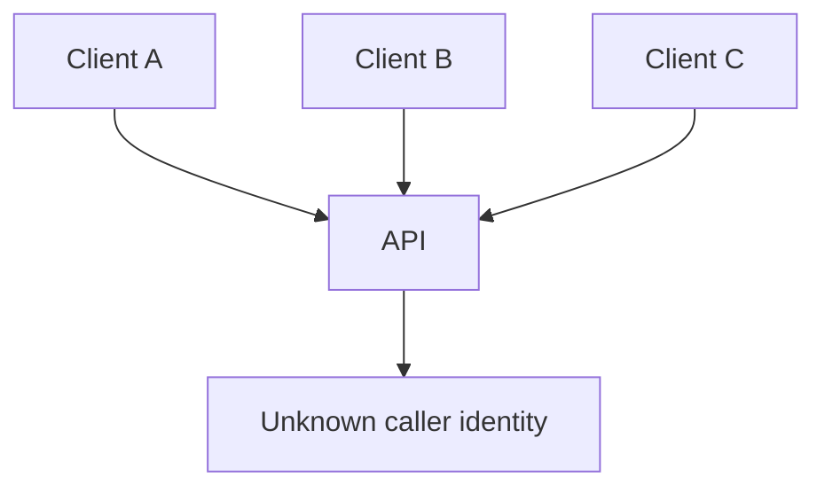

With API keys, the provider can distinguish consumers:

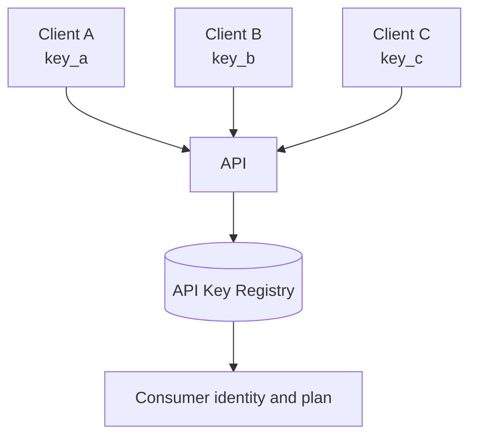

This enables:

- usage tracking,
- per-consumer rate limits,
- access control,
- billing,
- abuse detection,
- environment separation,
- key rotation,
- partner management,
- audit logging.

For example, an API gateway can log each request with the consumer identity:

```json
{
  "requestId": "req_123",
  "apiKeyId": "key_456",
  "consumerId": "partner_acme",
  "endpoint": "GET /v1/orders/{orderId}",
  "statusCode": 200,
  "latencyMs": 43
}
```

This makes API usage observable and governable.

---

**Use cases**

Use API keys for:

- developer access,
- partner integrations,
- public API platforms,
- usage tracking,
- rate limiting,
- quota enforcement,
- simple application identification,
- environment-specific access,
- billing attribution,
- abuse prevention,
- sandbox versus production separation.

Common examples:

```http
GET /v1/products?query=shoes
X-API-Key: ak_test_123
```

```http
POST /v1/webhooks/test-delivery
X-API-Key: ak_partner_789
```

```http
GET /v1/usage/current-month
Authorization: ApiKey ak_live_456
```

API keys are especially useful when the API is consumed by applications rather than directly by individual human users.

---

**API keys are not always enough**

API keys can identify a client application, but they are often not enough for strong user-level security.

For example, an API key can answer:

> Which application is calling?

But it may not answer:

> Which user is making this request, and what are they allowed to access?

For user-specific access, API keys are often combined with OAuth, JWTs, session tokens, or signed requests.

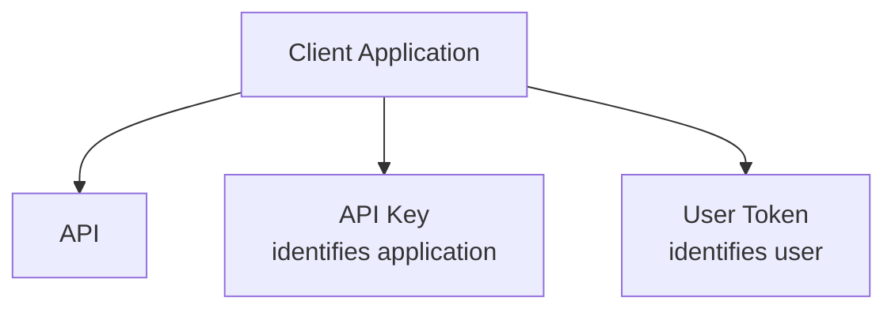

Example:

```http
GET /v1/me/orders HTTP/1.1
Host: api.example.com
X-API-Key: ak_live_partner_123
Authorization: Bearer user_token_abc
```

Here:

- `X-API-Key` identifies the partner application.
- `Authorization` identifies the end user.

This is stronger than using only an API key.

---

**Key lifecycle**

API keys need lifecycle management.

A typical lifecycle:

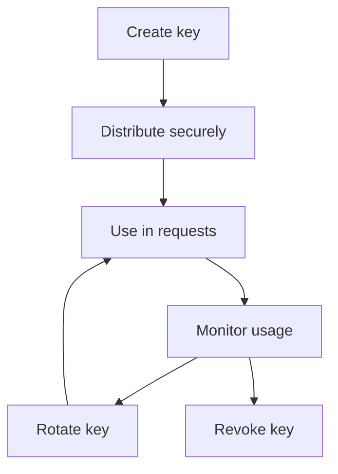

Important operations:

| Operation | Purpose |
|---|---|
| Create key | Provision access for a consumer |
| Disable key | Temporarily stop access |
| Revoke key | Permanently remove access |
| Rotate key | Replace old key with a new one |
| Scope key | Restrict what the key can do |
| Audit key | Inspect usage and changes |

Example key status model:

```json
{
  "apiKeyId": "key_123",
  "status": "active",
  "createdAt": "2026-04-29T12:00:00Z",
  "lastUsedAt": "2026-04-30T09:15:00Z",
  "expiresAt": "2026-10-29T12:00:00Z"
}
```

Keys should be rotated periodically and immediately after suspected leakage.

---

**Implementation example**

A simple API key validation middleware:

```ts
type ApiKeyRecord = {
  keyId: string;
  consumerId: string;
  status: "active" | "disabled" | "revoked";
  scopes: string[];
  ratePlan: string;
};

async function authenticateApiKey(req: Request, res: Response, next: NextFunction) {
  const apiKey = req.header("X-API-Key");

  if (!apiKey) {
    res.status(401).json({
      error: "API_KEY_REQUIRED",
      message: "An API key is required."
    });
    return;
  }

  const keyRecord = await apiKeyRepository.findBySecret(apiKey);

  if (!keyRecord || keyRecord.status !== "active") {
    res.status(401).json({
      error: "INVALID_API_KEY",
      message: "The provided API key is invalid or inactive."
    });
    return;
  }

  req.apiConsumer = {
    keyId: keyRecord.keyId,
    consumerId: keyRecord.consumerId,
    scopes: keyRecord.scopes,
    ratePlan: keyRecord.ratePlan
  };

  next();
}
```

In production, store only hashed API keys, not plaintext keys.

```ts
async function storeApiKey(rawKey: string, consumerId: string) {
  const keyHash = await hashSecret(rawKey);

  await apiKeyRepository.insert({
    keyHash,
    consumerId,
    status: "active"
  });
}
```

If the key database is leaked, hashed keys reduce exposure.

---

**Trade-offs**

API keys are useful, but they have limitations.

**1. Keys can leak**

Keys may be accidentally committed to source control, copied into logs, exposed in browser code, or shared insecurely.

**2. Keys identify applications better than users**

An API key usually identifies a client or partner, not necessarily the end user.

**3. Keys can be reused by attackers**

If someone obtains a key, they may be able to call the API until the key is revoked.

**4. Keys need lifecycle management**

Creation, revocation, rotation, scoping, and monitoring must be implemented.

**5. Keys can create false security**

An API key is not a complete authorization model.

Use API keys for identification, metering, and basic access control. Use stronger authentication and authorization when user identity or sensitive operations are involved.

---

#### Rate Limit

**What it is**

A **Rate Limit** restricts how many requests a client can make within a time window.

Examples:

```text
100 requests per minute
10,000 requests per day
5 payment attempts per minute
20 login attempts per hour per IP address
```

The central idea is:

> A client should not be allowed to consume unlimited API capacity.

A rate limit can be applied by:

- API key,
- user ID,
- tenant ID,
- IP address,
- endpoint,
- region,
- organization,
- access plan,
- authentication method.

Example response headers:

```http
HTTP/1.1 200 OK
X-RateLimit-Limit: 1000
X-RateLimit-Remaining: 742
X-RateLimit-Reset: 1714396800
```

When the client exceeds the limit:

```http
HTTP/1.1 429 Too Many Requests
Retry-After: 60
Content-Type: application/json
```

```json
{
  "error": "RATE_LIMIT_EXCEEDED",
  "message": "Too many requests. Try again in 60 seconds."
}
```

---

**What it solves**

Rate limits protect APIs from overload and abuse.

Without rate limits, one client can consume too much capacity:

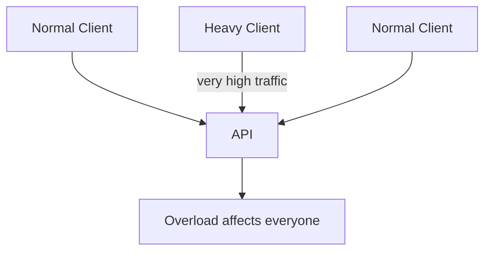

With rate limits, heavy clients are constrained:

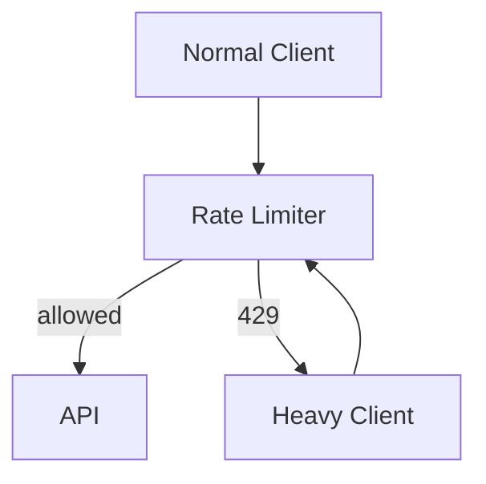

Rate limits help with:

- abuse prevention,
- fair usage,
- capacity protection,
- cost control,
- partner governance,
- login protection,
- expensive endpoint protection,
- resilience during traffic spikes.

A rate limit is a protective boundary.

---

**Use cases**

Use rate limits for:

- public APIs,
- partner APIs,
- developer APIs,
- login endpoints,
- password reset endpoints,
- search APIs,
- payment APIs,
- expensive reporting endpoints,
- bulk export endpoints,
- write-heavy operations,
- AI or computation-heavy endpoints,
- webhook testing endpoints,
- third-party integrations.

Example endpoint-specific limits:

| Endpoint | Example limit |
|---|---:|
| `GET /products/search` | 300 requests per minute |
| `POST /login` | 5 attempts per minute per IP/user |
| `POST /payment-authorizations` | 60 requests per minute per merchant |
| `POST /reports` | 10 requests per hour |
| `POST /bulk-imports` | 5 active jobs per tenant |

Different endpoints have different cost and risk profiles.

---

**Rate limiting algorithms**

Common algorithms include fixed window, sliding window, token bucket, and leaky bucket.

##### Fixed window

Fixed window counts requests in a fixed interval.

```text
100 requests per minute
```

At the start of the next minute, the counter resets.

Benefits:

- simple,
- easy to understand,
- cheap to implement.

Trade-off:

- clients can burst at window boundaries.

##### Sliding window

Sliding window counts requests over the most recent time period.

```text
100 requests in the last 60 seconds
```

Benefits:

- smoother than fixed windows,
- reduces boundary bursts.

Trade-off:

- more expensive to implement.

##### Token bucket

A token bucket refills at a steady rate. Each request consumes a token.

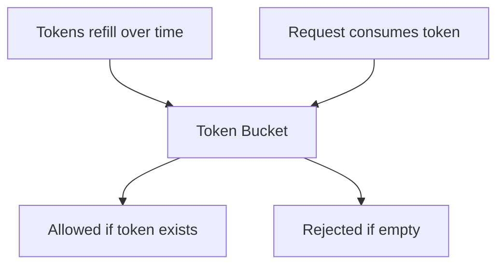

Benefits:

- allows controlled bursts,
- good for APIs with bursty traffic,
- widely used.

##### Leaky bucket

A leaky bucket processes requests at a steady rate.

Benefits:

- smooths traffic,
- protects downstream systems.

Trade-off:

- may add queueing or reject bursts.

---

**Implementation example**

A simple token bucket model:

```ts
type RateLimitDecision = {
  allowed: boolean;
  remaining: number;
  retryAfterSeconds?: number;
};

class TokenBucketRateLimiter {
  constructor(
    private readonly store: RateLimitStore,
    private readonly capacity: number,
    private readonly refillPerSecond: number
  ) {}

  async allow(key: string): Promise<RateLimitDecision> {
    const now = Date.now();
    const bucket = await this.store.getBucket(key);

    const elapsedSeconds = (now - bucket.updatedAtMs) / 1000;
    const refilled = elapsedSeconds * this.refillPerSecond;
    const tokens = Math.min(this.capacity, bucket.tokens + refilled);

    if (tokens < 1) {
      return {
        allowed: false,
        remaining: 0,
        retryAfterSeconds: Math.ceil((1 - tokens) / this.refillPerSecond)
      };
    }

    const remaining = tokens - 1;

    await this.store.saveBucket(key, {
      tokens: remaining,
      updatedAtMs: now
    });

    return {
      allowed: true,
      remaining: Math.floor(remaining)
    };
  }
}
```

In real systems, this must be atomic, usually with Redis, a gateway, or a distributed rate-limiting service.

---

**Rate limit response design**

Clients need clear feedback.

Include useful headers:

```http
X-RateLimit-Limit: 1000
X-RateLimit-Remaining: 0
X-RateLimit-Reset: 1714396800
Retry-After: 60
```

Include a structured error body:

```json
{
  "error": "RATE_LIMIT_EXCEEDED",
  "message": "The request limit for this API key has been exceeded.",
  "limit": 1000,
  "windowSeconds": 3600,
  "retryAfterSeconds": 60
}
```

Avoid vague errors like:

```json
{
  "error": "Too many"
}
```

Clients need to know whether to retry, when to retry, and whether they need a higher plan.

---

**Trade-offs**

**1. Limits can frustrate legitimate users**

If limits are too strict, good clients may fail during normal usage.

**2. Limits can be bypassed if scoped poorly**

IP-based limits may be bypassed with many IPs. API-key limits may be bypassed with many keys.

**3. Distributed enforcement is hard**

In multi-region systems, rate counters must be coordinated or approximated.

**4. Bursts need careful handling**

Some APIs should allow short bursts. Others should not.

**5. Different endpoints need different limits**

One global limit may be too simple.

Rate limits should be observable, documented, and tuned based on real traffic.

---

#### Rate Plan

**What it is**

A **Rate Plan** defines different usage tiers for different API consumers.

Instead of giving every consumer the same limit, the provider assigns limits based on plan, contract, customer type, or environment.

Example plans:

| Plan | Requests per minute | Requests per day | Features |
|---|---:|---:|---|
| Free | 60 | 10,000 | Basic endpoints |
| Startup | 300 | 100,000 | Higher throughput |
| Business | 1,000 | 1,000,000 | Bulk operations |
| Enterprise | Custom | Custom | Dedicated support |

The central idea is:

> Different consumers can have different usage rights.

A rate plan may include:

- request limits,
- burst limits,
- monthly quotas,
- concurrent job limits,
- endpoint access,
- data retention,
- support level,
- SLA level,
- billing terms.

---

**What it solves**

Rate plans solve the problem of treating all consumers the same when their needs, contracts, and costs differ.

Without plans:

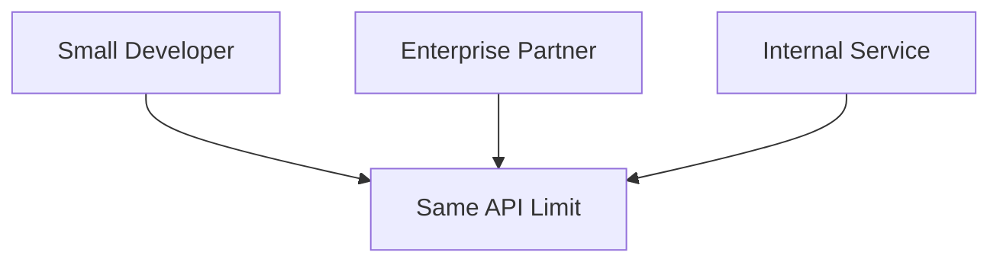

With plans:

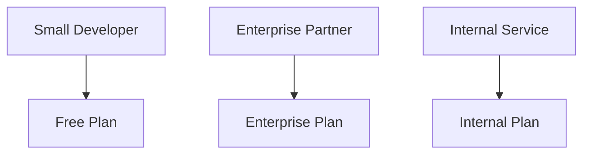

This supports:

- monetization,
- differentiated access,
- capacity planning,
- partner agreements,
- internal priority,
- usage-based billing,
- contractual limits,
- controlled upgrades.

---

**Use cases**

Use rate plans for:

- SaaS APIs,
- developer platforms,
- partner ecosystems,
- paid API products,
- usage-based billing,
- customer-specific quotas,
- internal versus external tiers,
- sandbox versus production environments,
- premium support levels,
- enterprise contracts.

Example API key record with plan:

```json
{
  "apiKeyId": "key_123",
  "consumerId": "partner_acme",
  "ratePlan": "business",
  "monthlyQuota": 1000000,
  "burstLimitPerMinute": 1000,
  "features": ["bulk-imports", "webhooks", "reports"]
}
```

The rate limiter can enforce plan-specific limits.

---

**Plan enforcement architecture**

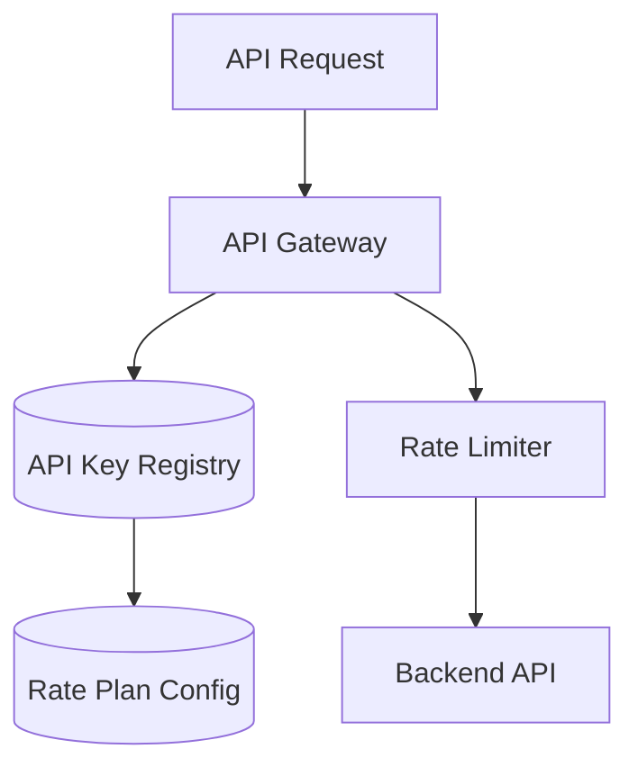

The gateway identifies the consumer, looks up the plan, applies the correct limits, then forwards allowed requests.

Example plan configuration:

```yaml
plans:
  free:
    requestsPerMinute: 60
    requestsPerDay: 10000
    maxConcurrentJobs: 1

  business:
    requestsPerMinute: 1000
    requestsPerDay: 1000000
    maxConcurrentJobs: 20

  enterprise:
    requestsPerMinute: 5000
    requestsPerDay: 10000000
    maxConcurrentJobs: 100
```

---

**Upgrade and downgrade behavior**

Rate plans need lifecycle rules.

Questions:

- When does a plan change take effect?
- What happens to active jobs during downgrade?
- Are quotas prorated?
- Can a consumer temporarily exceed quota?
- Who approves custom enterprise limits?
- How are plan changes audited?

Example plan change event:

```json
{
  "eventType": "ApiRatePlanChanged",
  "consumerId": "partner_acme",
  "oldPlan": "startup",
  "newPlan": "business",
  "effectiveAt": "2026-05-01T00:00:00Z"
}
```

Plan changes should be auditable because they affect billing and access.

---

**Trade-offs**

**1. Plan management adds complexity**

You need configuration, account management, billing, and support workflows.

**2. Enforcement must be fair and consistent**

Consumers expect plan limits to be applied correctly.

**3. Custom plans can become messy**

Too many exceptions make operations difficult.

**4. Plans require monitoring**

Providers need to know which consumers approach or exceed limits.

**5. Upgrade paths must be clear**

A consumer hitting limits should know how to increase capacity.

Rate plans are useful when API consumption is a product, a contract, or a capacity-management concern.

---

#### Service Level Agreement

**What it is**

A **Service Level Agreement**, or **SLA**, defines expected service levels between an API provider and API consumers.

An SLA may describe expectations for:

- availability,
- latency,
- error rate,
- throughput,
- support response time,
- incident communication,
- data freshness,
- recovery time,
- recovery point,
- maintenance windows.

Example:

```text
The Orders API will provide 99.9 percent monthly availability for production traffic, excluding scheduled maintenance.
```

The central idea is:

> An SLA turns reliability expectations into an explicit agreement.

SLAs often appear in enterprise APIs, paid API products, internal platform APIs, and mission-critical integrations.

---

**What it solves**

SLAs solve the problem of unclear expectations.

Without an SLA, consumers may assume the API is always available, always fast, and always fresh.

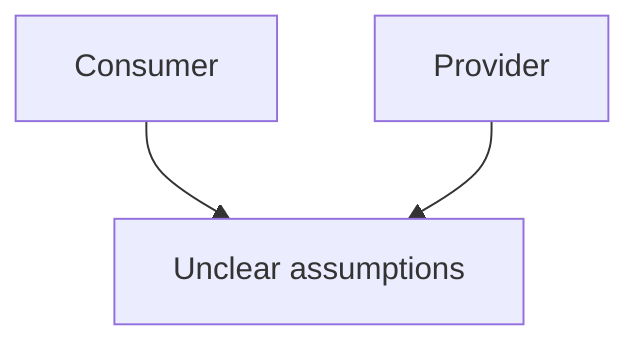

With an SLA, both sides understand the target:

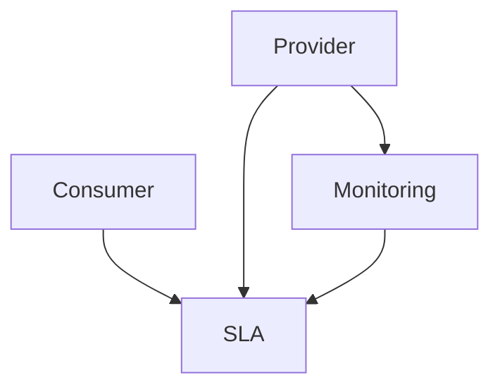

This improves:

- accountability,
- capacity planning,
- incident response,
- consumer architecture,
- escalation paths,
- business trust,
- prioritization.

For example, if an API promises 99.99 percent availability, it needs a different architecture than one promising best-effort access.

---

**Use cases**

Use SLAs for:

- enterprise APIs,
- partner integrations,
- paid API products,
- internal platform APIs,
- mission-critical services,
- regulated workflows,
- financial integrations,
- healthcare integrations,
- identity and authentication services,
- payment APIs,
- production dependency contracts.

An internal platform team might define:

```text
Identity API SLO:
- 99.95 percent monthly availability
- p95 latency below 150 ms
- p99 latency below 500 ms
- error rate below 0.1 percent
```

The SLA may then define what happens if the SLO is missed.

---

**SLA vs SLO vs SLI**

These terms are related but different.

| Term | Meaning | Example |
|---|---|---|
| SLI | Service Level Indicator | Actual measured availability |
| SLO | Service Level Objective | Target availability, such as 99.9 percent |
| SLA | Service Level Agreement | Contractual agreement, possibly with penalties |

Example:

```text
SLI: measured p95 latency for GET /orders
SLO: p95 latency should be below 250 ms for 99 percent of requests
SLA: if monthly availability falls below 99.9 percent, customer receives service credit
```

SLIs are measurements. SLOs are targets. SLAs are agreements.

---

**Example SLA document structure**

```yaml
service: Orders API
availability:
  target: 99.9 percent monthly
  excludes:
    - scheduled maintenance
    - customer network failures
latency:
  p95: 300 ms
  p99: 1000 ms
errorRate:
  target: less than 0.1 percent 5xx responses
support:
  criticalIncidentResponse: 1 hour
recovery:
  rto: 1 hour
  rpo: 5 minutes
reporting:
  frequency: monthly
```

A good SLA should be measurable.

Avoid vague language like:

```text
The API will be fast and reliable.
```

Use measurable expectations instead.

---

**Trade-offs**

**1. SLAs require measurement**

You cannot commit to what you cannot measure.

**2. SLAs influence architecture**

Higher guarantees require redundancy, failover, monitoring, and incident response.

**3. SLAs may create financial exposure**

External SLAs may include service credits or penalties.

**4. SLAs require operational discipline**

Teams need on-call, incident management, change management, and reporting.

**5. Overpromising is dangerous**

A provider should not commit to reliability levels it cannot sustain.

SLAs should be realistic, measurable, and backed by operational capability.

---

#### Error Report

**What it is**

An **Error Report** is a structured error response that explains what went wrong and gives clients enough information to respond correctly.

Bad error:

```json
{
  "error": "Something went wrong"
}
```

Better error:

```json
{
  "error": "VALIDATION_FAILED",
  "message": "The request contains invalid fields.",
  "details": [
    {
      "field": "email",
      "code": "INVALID_FORMAT",
      "message": "Email must be a valid email address."
    }
  ],
  "requestId": "req_123"
}
```

The central idea is:

> Errors should be understandable by humans and useful to programs.

An error report should help the client decide:

- Should I retry?
- Should I change the request?
- Should I ask the user to take action?
- Should I authenticate again?
- Should I wait because of rate limiting?
- Should I contact support with a request ID?

---

**What it solves**

Error reports solve the problem of vague or inconsistent failure behavior.

Without structured errors, clients may parse strings or guess what happened.

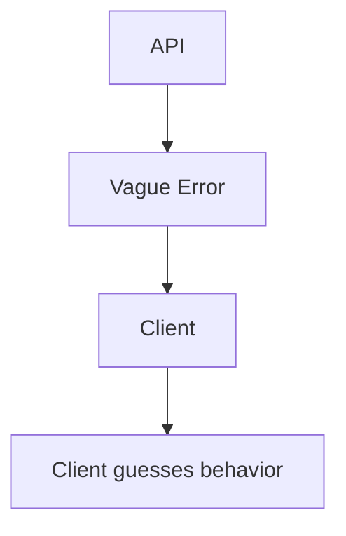

With structured errors:

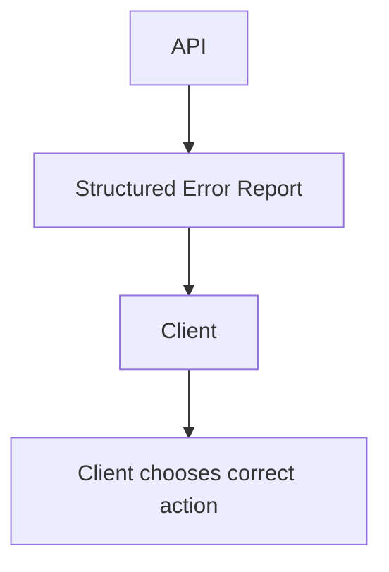

This improves:

- client usability,
- debugging,
- support,
- automation,
- validation handling,
- retry behavior,
- observability.

---

**Use cases**

Use structured error reports for:

- validation errors,
- authentication failures,
- authorization failures,
- missing resources,
- rate limit errors,
- business rule violations,
- dependency failures,
- partial failures,
- conflict errors,
- idempotency conflicts,
- unsupported media types,
- malformed JSON,
- service unavailable errors.

Example validation error:

```http
HTTP/1.1 400 Bad Request
Content-Type: application/json
```

```json
{
  "error": "VALIDATION_FAILED",
  "message": "The request is invalid.",
  "details": [
    {
      "field": "items[0].quantity",
      "code": "MIN_VALUE",
      "message": "Quantity must be at least 1."
    }
  ],
  "requestId": "req_abc123"
}
```

Example business rule error:

```http
HTTP/1.1 409 Conflict
Content-Type: application/json
```

```json
{
  "error": "ORDER_CANNOT_BE_CANCELLED",
  "message": "The order cannot be cancelled because it has already shipped.",
  "requestId": "req_456"
}
```

---

**Common error response fields**

| Field | Purpose |
|---|---|
| `error` | Stable machine-readable error code |
| `message` | Human-readable explanation |
| `details` | Field-level or sub-error details |
| `requestId` | Correlates client error with server logs |
| `retryAfterSeconds` | Tells client when retry may be safe |
| `documentationUrl` | Link to error documentation |
| `status` | HTTP status code, if included in body |
| `type` | Error category or URI-style problem type |

Example:

```json
{
  "error": "RATE_LIMIT_EXCEEDED",
  "message": "You have exceeded your rate limit.",
  "retryAfterSeconds": 60,
  "requestId": "req_789",
  "documentationUrl": "https://docs.example.com/errors/rate-limit-exceeded"
}
```

The `error` code should be stable. Do not make clients parse the `message` field.

---

**HTTP status codes and error reports**

Use HTTP status codes consistently.

| Status | Typical meaning |
|---|---|
| 400 | Invalid request |
| 401 | Authentication required or invalid |
| 403 | Authenticated but not allowed |
| 404 | Resource not found |
| 409 | Conflict with current state |
| 412 | Conditional request failed |
| 422 | Semantically invalid request |
| 429 | Rate limit exceeded |
| 500 | Unexpected server error |
| 502 | Bad gateway or upstream failure |
| 503 | Service unavailable |
| 504 | Gateway timeout |

Example:

```json
{
  "error": "RESOURCE_NOT_FOUND",
  "message": "Order ord_123 was not found.",
  "requestId": "req_123"
}
```

Use the status code for broad category and the error code for specific behavior.

---

**Security considerations**

Error reports should be useful without leaking sensitive details.

Bad:

```json
{
  "error": "DATABASE_ERROR",
  "message": "password authentication failed for user admin at db-prod-17.internal"
}
```

Better:

```json
{
  "error": "SERVICE_UNAVAILABLE",
  "message": "The service is temporarily unavailable.",
  "requestId": "req_123"
}
```

Do not expose:

- stack traces,
- database hostnames,
- internal IP addresses,
- secrets,
- tokens,
- SQL queries,
- filesystem paths,
- internal class names,
- infrastructure details.

Keep detailed error information in internal logs, connected by `requestId`.

---

**Trade-offs**

**1. Error formats must be governed**

If every endpoint invents its own error shape, clients suffer.

**2. Too much detail can leak information**

Errors must not reveal sensitive internals.

**3. Error codes become contracts**

Once clients depend on an error code, changing it can break them.

**4. Localization can complicate messages**

Machine-readable codes should remain stable even if human messages vary.

A good error report is stable, safe, and actionable.

---

#### Conditional Request

**What it is**

A **Conditional Request** lets clients ask the server to return or modify data only if a condition is true.

The most common use is cache validation:

```http
GET /v1/products/prod_123 HTTP/1.1
If-None-Match: "product-v12"
```

If the resource has not changed:

```http
HTTP/1.1 304 Not Modified
ETag: "product-v12"
```

If it has changed, the server returns the new representation:

```http
HTTP/1.1 200 OK
ETag: "product-v13"
Content-Type: application/json
```

The central idea is:

> Clients should not download or overwrite data unnecessarily when they can ask whether it has changed.

Conditional requests can also prevent lost updates:

```http
PATCH /v1/products/prod_123 HTTP/1.1
If-Match: "product-v12"
Content-Type: application/json
```

This means:

> Apply this update only if the product is still at version `product-v12`.

---

**What it solves**

Conditional requests solve two major problems.

First, they reduce unnecessary data transfer.

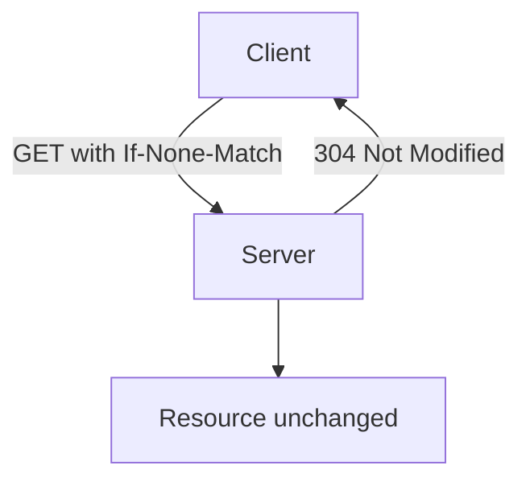

Second, they help avoid lost updates.

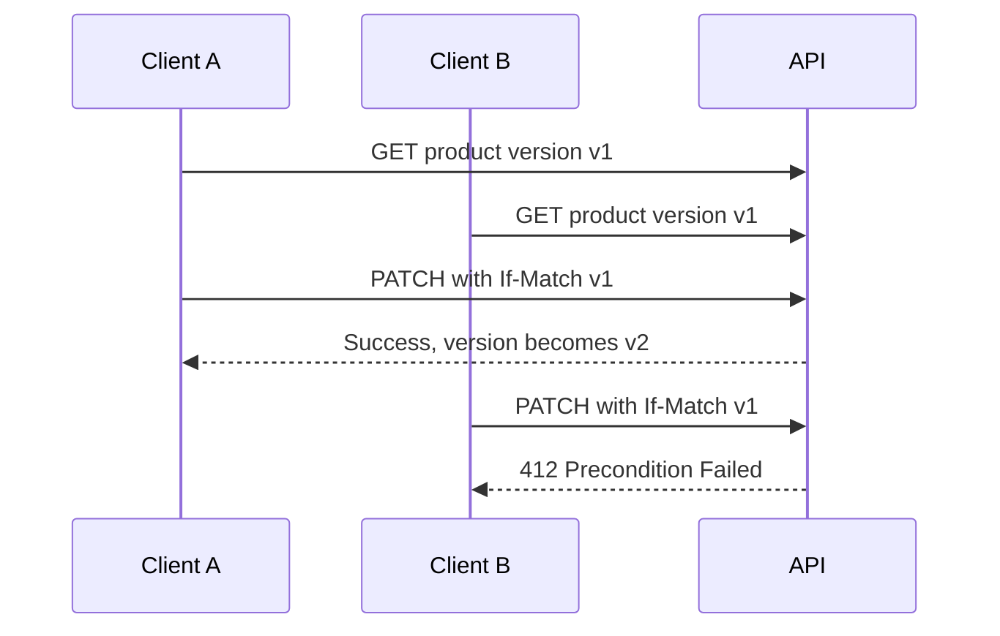

Without conditional updates, Client B might accidentally overwrite Client A’s change.

---

**Use cases**

Use conditional requests for:

- cached resources,
- static or semi-static data,
- product catalogs,
- reference data,
- user profiles,
- documents,
- large responses,
- mobile sync,
- optimistic concurrency,
- update conflict prevention,
- expensive resource retrieval.

Examples:

```http
GET /v1/reference/currencies
If-None-Match: "currencies-v3"
```

```http
GET /v1/documents/doc_123
If-Modified-Since: Tue, 29 Apr 2026 12:00:00 GMT
```

```http
PUT /v1/profile
If-Match: "profile-v7"
```

---

**ETags**

An **ETag** is a server-provided validator for a resource representation.

Example response:

```http
HTTP/1.1 200 OK
ETag: "order-summary-v42"
Content-Type: application/json
```

Client stores the ETag and later sends:

```http
GET /v1/orders/ord_123
If-None-Match: "order-summary-v42"
```

If unchanged:

```http
HTTP/1.1 304 Not Modified
```

ETags are useful because clients do not need to know how the server computes versions.

ETags should be treated as opaque strings.

---

**Last-Modified**

`Last-Modified` uses timestamps instead of opaque validators.

Response:

```http
HTTP/1.1 200 OK
Last-Modified: Tue, 29 Apr 2026 12:00:00 GMT
```

Request:

```http
GET /v1/products/prod_123
If-Modified-Since: Tue, 29 Apr 2026 12:00:00 GMT
```

`Last-Modified` is simple, but it can be less precise than ETags.

For high-concurrency updates, ETags are usually safer.

---

**Implementation example**

```ts
app.get("/products/:productId", async (req, res) => {
  const product = await productRepository.findById(req.params.productId);

  if (!product) {
    res.status(404).json({
      error: "PRODUCT_NOT_FOUND"
    });
    return;
  }

  const etag = `"product-${product.version}"`;

  if (req.header("If-None-Match") === etag) {
    res.status(304).setHeader("ETag", etag).end();
    return;
  }

  res
    .status(200)
    .setHeader("ETag", etag)
    .json({
      productId: product.productId,
      title: product.title,
      price: product.price
    });
});
```

Conditional update:

```ts
app.patch("/products/:productId", async (req, res) => {
  const expectedEtag = req.header("If-Match");

  if (!expectedEtag) {
    res.status(428).json({
      error: "PRECONDITION_REQUIRED",
      message: "If-Match header is required for updates."
    });
    return;
  }

  const product = await productRepository.findById(req.params.productId);
  const currentEtag = `"product-${product.version}"`;

  if (expectedEtag !== currentEtag) {
    res.status(412).json({
      error: "PRECONDITION_FAILED",
      message: "The resource has changed. Fetch the latest version and retry."
    });
    return;
  }

  const updated = await productRepository.update(req.params.productId, req.body);

  res.setHeader("ETag", `"product-${updated.version}"`).json(updated);
});
```

---

**Trade-offs**

**1. Validators must be correct**

Incorrect ETags can cause stale data or unnecessary downloads.

**2. Clients must participate**

Conditional requests only help if clients store and send validators.

**3. Distributed systems complicate versioning**

Multiple replicas must agree on validators.

**4. Partial representations need careful handling**

Different field selections may need different ETags.

**5. Weak validators may not be safe for updates**

Use strong validators for optimistic concurrency.

Conditional requests are powerful for caching and concurrency, but they require careful validator design.

---

#### Request Bundle

**What it is**

A **Request Bundle** combines multiple requests into one API call.

Instead of sending many separate HTTP requests:

```http
GET /products/prod_1
GET /products/prod_2
GET /products/prod_3
```

A client sends one bundled request:

```http
POST /batch
Content-Type: application/json
```

```json
{
  "requests": [
    {
      "method": "GET",
      "path": "/products/prod_1"
    },
    {
      "method": "GET",
      "path": "/products/prod_2"
    },
    {
      "method": "GET",
      "path": "/products/prod_3"
    }
  ]
}
```

The central idea is:

> Combine related operations to reduce network round trips and client chattiness.

---

**What it solves**

Request bundles solve the problem of excessive round trips.

This is especially important for mobile clients or high-latency networks.

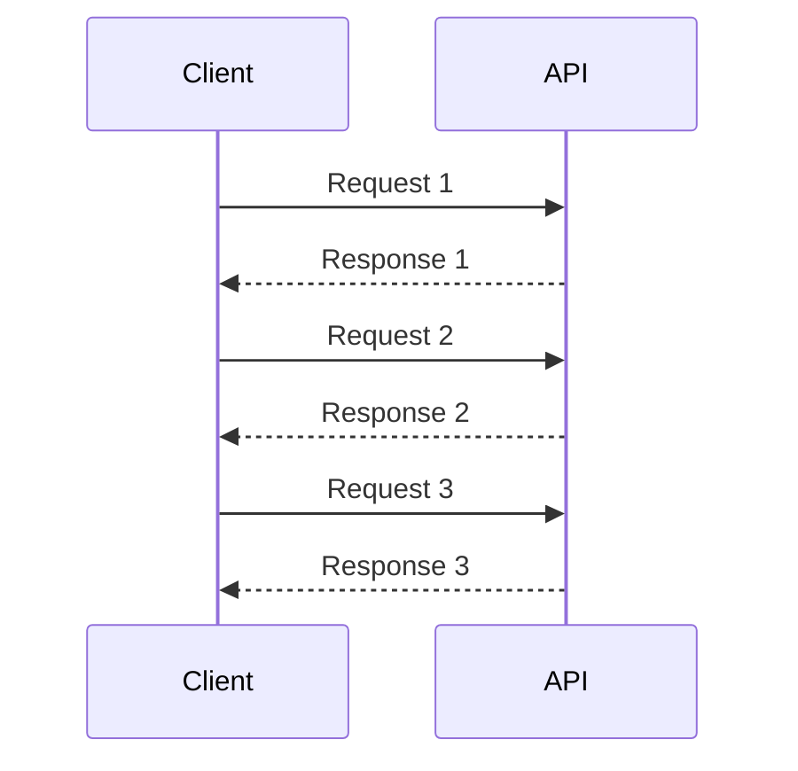

Bundling reduces the request count:

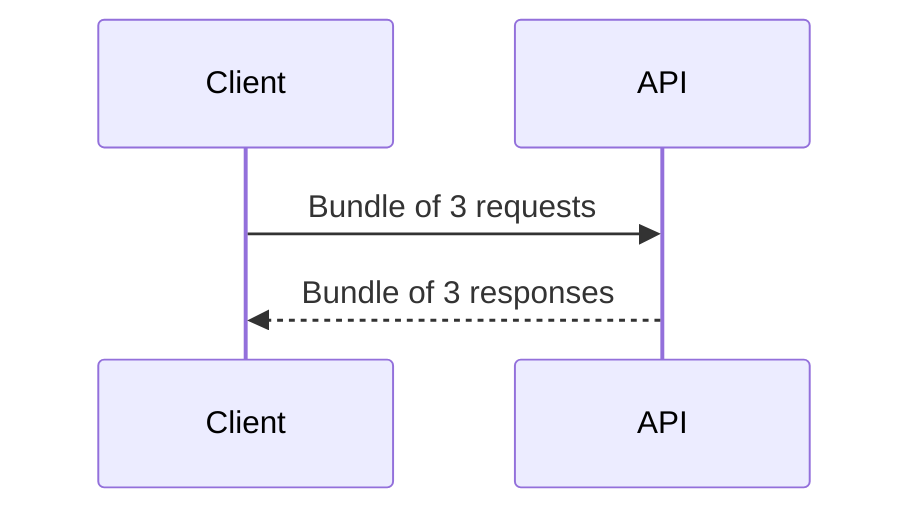

This can reduce:

- latency,
- connection overhead,
- mobile battery usage,
- gateway overhead,
- TLS overhead,
- client complexity.

---

**Use cases**

Use request bundles for:

- batch reads,
- batch updates,
- mobile APIs,
- offline sync,
- bulk operations,
- reducing client chattiness,
- fetching many known resources,
- multi-step client initialization,
- dashboard loading,
- importing or validating multiple records.

Example batch read:

```http
POST /products/batch-get
Content-Type: application/json
```

```json
{
  "productIds": ["prod_1", "prod_2", "prod_3"]
}
```

Response:

```json
{
  "products": [
    {
      "productId": "prod_1",
      "title": "Trail Shoe"
    },
    {
      "productId": "prod_2",
      "title": "Running Jacket"
    }
  ],
  "notFound": ["prod_3"]
}
```

A domain-specific batch endpoint is often better than a generic `/batch` endpoint.

---

**Generic bundle vs domain-specific batch**

There are two common styles.

##### Generic request bundle

```json
{
  "requests": [
    {
      "id": "r1",
      "method": "GET",
      "path": "/customers/cus_123"
    },
    {
      "id": "r2",
      "method": "GET",
      "path": "/orders/ord_456"
    }
  ]
}
```

Benefits:

- flexible,
- can combine unrelated requests,
- useful for API clients that need general batching.

Trade-offs:

- harder to authorize,
- harder to validate,
- harder to document,
- can bypass normal API design,
- may become an API tunneling mechanism.

##### Domain-specific batch endpoint

```http
POST /orders/batch-status
```

```json
{
  "orderIds": ["ord_1", "ord_2", "ord_3"]
}
```

Benefits:

- easier to validate,
- easier to secure,
- easier to optimize,
- clearer contract.

Trade-off:

- less general.

Prefer domain-specific batch endpoints unless there is a strong reason for generic bundling.

---

**Partial failure**

Bundles often partially succeed.

Example:

```json
{
  "results": [
    {
      "id": "r1",
      "status": 200,
      "body": {
        "productId": "prod_1"
      }
    },
    {
      "id": "r2",
      "status": 404,
      "body": {
        "error": "PRODUCT_NOT_FOUND"
      }
    }
  ]
}
```

Design questions:

- Does one failed item fail the whole bundle?
- Are operations independent?
- Are writes transactional as a group?
- Can some items be retried safely?
- How are validation errors reported?
- How are authorization errors handled per item?

For writes, partial success can be dangerous.

Example:

```json
{
  "results": [
    {
      "orderId": "ord_1",
      "status": "cancelled"
    },
    {
      "orderId": "ord_2",
      "error": "ORDER_ALREADY_SHIPPED"
    }
  ]
}
```

Clients must understand what succeeded and what did not.

---

**Trade-offs**

**1. Validation is harder**

A bundle may contain many operations with different schemas.

**2. Authorization is harder**

Each item may need separate permission checks.

**3. Partial failure is harder**

The response must clearly explain item-level success and failure.

**4. Large bundles can overload the server**

Set maximum request counts and payload sizes.

**5. Generic bundles can hide poor API design**

If everything goes through `/batch`, the API becomes harder to understand.

Request bundles are useful, but they need strict limits and clear semantics.

---

#### Wish List

**What it is**

A **Wish List** lets clients specify which fields or related data they want included in a response.

Example:

```http
GET /orders/ord_123?fields=orderId,status,totalAmount
```

or:

```http
GET /orders/ord_123?include=items,payment,shipment
```

The central idea is:

> Let clients ask for the data they need instead of forcing every client to receive the same full representation.

A mobile client may want a small response:

```json
{
  "orderId": "ord_123",
  "status": "CONFIRMED"
}
```

An admin client may want more:

```json
{
  "orderId": "ord_123",
  "status": "CONFIRMED",
  "items": [],
  "payment": {},
  "shipment": {},
  "audit": {}
}
```

---

**What it solves**

Wish Lists solve over-fetching.

Without field selection, every client may receive a large response:

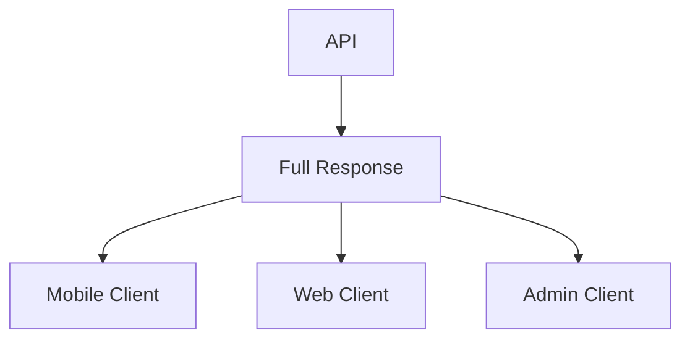

This wastes bandwidth and processing, especially for mobile clients.

With Wish Lists:

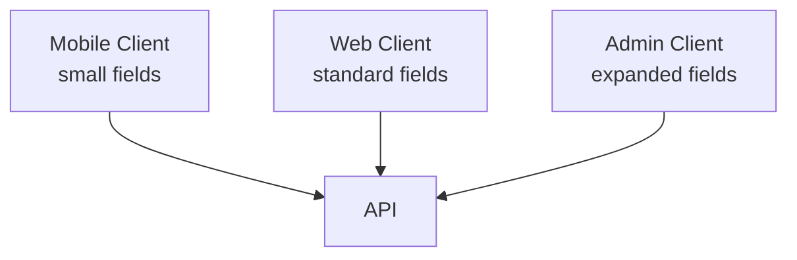

The API can tailor responses to client needs.

---

**Use cases**

Use Wish Lists when:

- resources are large,
- different clients need different fields,
- mobile clients need smaller payloads,
- related data is optional,
- embedded data is expensive,
- clients need summary and detail views,
- responses include optional relationships,
- API consumers are diverse.

Examples:

```http
GET /customers/cus_123?fields=id,name,email
```

```http
GET /products/prod_123?include=category,reviews,recommendations
```

```http
GET /orders/ord_123?fields=orderId,status,totalAmount&include=shipment
```

---

**Field selection**

Field selection controls which fields are returned.

Example:

```http
GET /products/prod_123?fields=productId,title,price
```

Response:

```json
{
  "productId": "prod_123",
  "title": "Trail Running Shoe",
  "price": {
    "amount": 129.99,
    "currency": "USD"
  }
}
```

Avoid letting clients request arbitrary internal fields.

Use a public field allowlist:

```ts
const allowedProductFields = new Set([
  "productId",
  "title",
  "description",
  "price",
  "category",
  "images",
  "availability"
]);
```

Reject unknown fields:

```json
{
  "error": "INVALID_FIELD_SELECTION",
  "message": "Field internalCost is not selectable."
}
```

---

**Include relationships**

`include` controls related data.

Example:

```http
GET /orders/ord_123?include=items,payment,shipment
```

Response:

```json
{
  "orderId": "ord_123",
  "status": "CONFIRMED",
  "items": [
    {
      "productId": "prod_123",
      "quantity": 1
    }
  ],
  "payment": {
    "status": "AUTHORIZED"
  },
  "shipment": {
    "status": "PENDING"
  }
}
```

Use clear rules:

- Which includes are supported?
- Can includes be nested?
- What is the maximum depth?
- What happens if an included resource is unavailable?
- Are included resources subject to different permissions?

Avoid unlimited nested includes such as:

```text
include=orders.items.product.reviews.author.profile.company
```

This can become expensive and unpredictable.

---

**Trade-offs**

**1. Server implementation becomes more complex**

The server must shape responses dynamically.

**2. Query generation can become inefficient**

Naive field selection can produce many database queries.

**3. Caching becomes harder**

Different field selections produce different representations.

**4. Authorization must be field-aware**

Some fields may be visible only to certain clients.

**5. API documentation becomes more complex**

Clients need to know which fields and includes are supported.

Wish Lists are useful, but they need limits and governance.

---

#### Wish Template

**What it is**

A **Wish Template** is a reusable named response shape.

Instead of clients listing fields every time, they request a named view.

Example:

```http
GET /orders/ord_123?view=summary
```

Response:

```json
{
  "orderId": "ord_123",
  "status": "CONFIRMED",
  "totalAmount": {
    "amount": 129.99,
    "currency": "USD"
  }
}
```

A detail view may include more:

```http
GET /orders/ord_123?view=detail
```

The central idea is:

> Standardize common response shapes so clients do not repeatedly construct complex field selections.

---

**What it solves**

Wish Templates solve repeated response-shape configuration.

Without templates:

```http
GET /orders/ord_123?fields=orderId,status,totalAmount,createdAt&include=items,shipment
```

Clients may repeat long field lists everywhere.

With templates:

```http
GET /orders/ord_123?view=order-detail
```

The server maps `order-detail` to a known shape.

```mermaid
flowchart TD
    Client[Client]
    View[view=summary]
    API[API]
    Template[Wish Template]
    Response[Standard Response Shape]

    Client --> View
    View --> API
    API --> Template
    Template --> Response
```

This improves consistency and maintainability.

---

**Use cases**

Use Wish Templates for:

- summary views,
- detail views,
- mobile views,
- admin views,
- export views,
- partner-specific views,
- dashboard cards,
- list item representations,
- print or invoice representations.

Example templates:

| Template | Purpose |
|---|---|
| `summary` | Small list representation |
| `detail` | Full detail page |
| `mobile` | Smaller mobile payload |
| `admin` | Internal support view |
| `export` | Batch export format |
| `partner-basic` | Partner-safe shape |

Example:

```http
GET /products/prod_123?view=mobile
```

```json
{
  "productId": "prod_123",
  "title": "Trail Running Shoe",
  "price": {
    "amount": 129.99,
    "currency": "USD"
  },
  "thumbnailUrl": "https://cdn.example.com/prod_123-thumb.jpg"
}
```

---

**Template configuration**

A template can be documented as configuration:

```yaml
orderViews:
  summary:
    fields:
      - orderId
      - status
      - totalAmount
      - createdAt

  detail:
    fields:
      - orderId
      - status
      - totalAmount
      - createdAt
      - items
      - shipment
      - payment

  admin:
    fields:
      - orderId
      - status
      - totalAmount
      - fraudReviewStatus
      - internalNotes
      - auditTrail
```

Templates should be versioned when they are public contracts.

Example:

```http
GET /orders/ord_123?view=summary-v2
```

This avoids breaking clients when a template changes.

---

**Trade-offs**

**1. Too many templates become hard to maintain**

If every client gets a custom template, the API becomes fragmented.

**2. Templates are contracts**

Changing a template can break clients.

**3. Versioning may be needed**

Especially for external APIs or mobile clients.

**4. Templates can hide important details**

Clients must know what each template includes.

Use templates for common, stable response shapes. Avoid creating one-off templates for every small client preference.

---

#### Embedded Entity

**What it is**

An **Embedded Entity** includes a related resource directly inside the response.

Example:

```json
{
  "orderId": "ord_123",
  "status": "CONFIRMED",
  "customer": {
    "customerId": "cus_456",
    "displayName": "Alex Morgan"
  }
}
```

The `customer` is embedded inside the order response.

The central idea is:

> Include related data inline when clients commonly need it with the primary resource.

---

**What it solves**

Embedded entities solve the problem of extra follow-up requests.

Without embedding:

```mermaid
sequenceDiagram
    participant Client
    participant API

    Client->>API: GET /orders/ord_123
    API-->>Client: order with customerId
    Client->>API: GET /customers/cus_456
    API-->>Client: customer
```

With embedding:

```mermaid
sequenceDiagram
    participant Client
    participant API

    Client->>API: GET /orders/ord_123?include=customer
    API-->>Client: order with embedded customer
```

This reduces latency and client complexity.

---

**Use cases**

Use embedded entities for:

- order with customer summary,
- product with category,
- invoice with billing address,
- shipment with carrier summary,
- comment with author,
- support ticket with requester,
- payment with payment method summary,
- document with owner summary.

Example:

```json
{
  "commentId": "comment_123",
  "body": "Looks good to me.",
  "author": {
    "userId": "user_456",
    "displayName": "Priya Shah",
    "avatarUrl": "https://cdn.example.com/avatars/user_456.png"
  }
}
```

The embedded author is a summary, not necessarily the full user profile.

---

**Embedded summaries vs full entities**

Embedding usually works best with summaries.

Good:

```json
{
  "customer": {
    "customerId": "cus_456",
    "displayName": "Alex Morgan"
  }
}
```

Riskier:

```json
{
  "customer": {
    "customerId": "cus_456",
    "displayName": "Alex Morgan",
    "email": "alex@example.com",
    "phone": "+1-555-0100",
    "addresses": [],
    "paymentMethods": [],
    "supportTickets": []
  }
}
```

Full embedding can create large responses, privacy issues, and ownership ambiguity.

A common pattern is:

- embed a small summary,
- include a link to the full resource.

```json
{
  "customer": {
    "customerId": "cus_456",
    "displayName": "Alex Morgan",
    "links": {
      "self": "/customers/cus_456"
    }
  }
}
```

---

**Ownership and staleness**

Embedded data may be owned by another service.

For example:

- Order Service owns the order.
- Customer Service owns customer profile.

If Order Service embeds customer data, it must decide whether the embedded data is:

- fetched live,
- copied as a snapshot,
- derived from an event,
- cached,
- eventually consistent.

```mermaid
flowchart TD
    OrderAPI[Order API]
    OrderDB[(Order DB)]
    CustomerService[Customer Service]

    OrderAPI --> OrderDB
    OrderAPI --> CustomerService
```

Live fetching can increase latency and dependency risk.

Copied snapshots can become stale but may preserve historical facts.

Example historical snapshot:

```json
{
  "orderId": "ord_123",
  "customerSnapshot": {
    "displayName": "Alex Morgan",
    "emailAtPurchase": "alex@example.com"
  }
}
```

This may be correct because the order should show what was known at purchase time.

---

**Trade-offs**

**1. Larger responses**

Embedded data increases payload size.

**2. Staleness risk**

Embedded copies may not reflect the latest authoritative resource.

**3. Ownership ambiguity**

Clients may not know which service owns the embedded data.

**4. Authorization complexity**

The client may be allowed to see the primary resource but not the embedded resource.

**5. Dependency risk**

Live embedding may require calls to other services.

Embedding is best when related data is small, commonly needed, and safe to include.

---

#### Linked Information Holder

**What it is**

A **Linked Information Holder** references related data through a link or identifier instead of embedding the full entity.

Example:

```json
{
  "orderId": "ord_123",
  "customerId": "cus_456",
  "links": {
    "customer": "/customers/cus_456"
  }
}
```

The central idea is:

> Link to related resources when clients may not always need the full related data.

This keeps the primary response smaller and preserves clear ownership.

---

**What it solves**

Linked Information Holders solve over-fetching and ownership ambiguity.

Instead of embedding full related data:

```json
{
  "orderId": "ord_123",
  "customer": {
    "customerId": "cus_456",
    "displayName": "Alex Morgan",
    "email": "alex@example.com",
    "addresses": []
  }
}
```

return a reference:

```json
{
  "orderId": "ord_123",
  "customerId": "cus_456",
  "links": {
    "customer": "/customers/cus_456"
  }
}
```

This lets clients fetch the customer only when needed.

```mermaid
flowchart TD
    Client[Client]
    OrderAPI[Order API]
    CustomerAPI[Customer API]

    Client -->|GET order| OrderAPI
    OrderAPI -->|order with customer link| Client
    Client -->|optional GET customer| CustomerAPI
```

---

**Use cases**

Use linked information holders when related data:

- is large,
- changes frequently,
- is not always needed,
- has different access control,
- belongs to another service,
- is expensive to fetch,
- has its own lifecycle,
- should remain clearly authoritative elsewhere.

Examples:

```json
{
  "invoiceId": "inv_123",
  "billingAccountId": "acct_456",
  "links": {
    "billingAccount": "/billing-accounts/acct_456"
  }
}
```

```json
{
  "shipmentId": "shp_123",
  "carrierId": "carrier_ups",
  "links": {
    "carrier": "/carriers/carrier_ups",
    "tracking": "/shipments/shp_123/tracking"
  }
}
```

---

**Embedding vs linking**

| Concern | Embed | Link |
|---|---|---|
| Client needs related data immediately | Good fit | Extra request |
| Related data is large | Risky | Better |
| Related data changes often | Can become stale | Better |
| Related data has separate permissions | Complex | Better |
| Response size matters | Risky | Better |
| Offline/mobile needs one payload | Better | Risky |
| Ownership clarity | Can blur | Clearer |

A good API may support both:

```http
GET /orders/ord_123
```

returns links.

```http
GET /orders/ord_123?include=customer
```

returns an embedded customer summary.

This gives clients control while preserving a simple default.

---

**Link shape**

Links should be consistent.

Simple:

```json
{
  "links": {
    "self": "/orders/ord_123",
    "customer": "/customers/cus_456"
  }
}
```

Richer:

```json
{
  "links": {
    "self": {
      "href": "/orders/ord_123",
      "method": "GET"
    },
    "cancel": {
      "href": "/orders/ord_123/cancellation",
      "method": "POST"
    }
  }
}
```

Richer links are useful when available actions depend on resource state.

Example:

```json
{
  "orderId": "ord_123",
  "status": "SHIPPED",
  "links": {
    "self": {
      "href": "/orders/ord_123",
      "method": "GET"
    },
    "tracking": {
      "href": "/shipments/shp_789/tracking",
      "method": "GET"
    }
  }
}
```

No cancellation link appears because the order has already shipped.

---

**Trade-offs**

**1. Clients may need extra requests**

Linking can increase round trips.

**2. Client logic becomes more navigational**

Clients must follow links or know when to fetch related resources.

**3. Poor link design can be noisy**

Too many links can clutter responses.

**4. Links must respect permissions**

Do not expose action links the caller cannot use.

**5. Links can become stale if resource locations change**

Stable URI design matters.

Linking is best when related data has its own identity, lifecycle, ownership, or access control.

---

#### Practical design checklist

Use this checklist when applying API quality patterns.

**Identity and access**

- Does the API need to identify the caller?
- Is an API key enough, or is user authentication required?
- Are keys scoped by environment, tenant, or permissions?
- Can keys be rotated and revoked?
- Are keys stored securely?

**Traffic management**

- What limits protect the API?
- Are limits per key, user, tenant, IP, or endpoint?
- Are expensive endpoints limited separately?
- Are rate limit headers returned?
- Are rate plans needed?
- Is there an upgrade path?

**Reliability expectations**

- Are SLIs, SLOs, or SLAs defined?
- Are they measurable?
- Are dashboards and alerts in place?
- What happens when the SLA is missed?
- Are consumers informed about incidents?

**Error behavior**

- Is there one standard error shape?
- Are error codes stable?
- Are validation errors field-specific?
- Is `requestId` included?
- Are sensitive details hidden?
- Are retryable errors clearly marked?

**Efficiency**

- Can clients use conditional requests?
- Are ETags or last-modified timestamps available?
- Are bundles needed for chatty clients?
- Are bundle sizes limited?
- Are field selection and includes supported?
- Are common response shapes available as templates?

**Resource relationships**

- Should related data be embedded or linked?
- Is embedded data authoritative or a snapshot?
- Are related resources subject to different permissions?
- Is the response size controlled?
- Are links state-aware and permission-aware?

A high-quality API is likely if:

- callers are identifiable,
- traffic limits are clear,
- errors are structured,
- reliability targets are measurable,
- clients can avoid unnecessary data transfer,
- bulk and field-selection features are controlled,
- embedded and linked data choices are intentional.

An API quality design is probably unhealthy if:

- API keys never rotate,
- rate limits are undocumented,
- error responses are inconsistent,
- SLAs are promised but not measured,
- clients must over-fetch large responses,
- bundle endpoints allow unlimited work,
- embedded data leaks sensitive information,
- links expose actions the caller cannot perform.

---

#### Related patterns

| Pattern | Relationship |
|---|---|
| API Gateway | Often enforces API keys, rate limits, plans, and error normalization |
| Gateway Offloading | Moves technical concerns such as authentication and rate limiting to the gateway |
| Backends for Frontends | Often use Wish Lists, Wish Templates, embedding, and bundling for client-specific responses |
| Consumer-Driven Contracts | Protects error formats, response shapes, and field expectations |
| Conditional Request | Works with caching and concurrency control |
| CQRS | Read models often support Wish Lists, templates, and embedded views |
| Async Messaging | Request Bundles may become async jobs for large bulk operations |
| Observability | SLAs, rate limits, errors, and API key usage require metrics and logs |
| Security Patterns | API keys, access control, and safe error reporting are security-related |
| Pagination | Often combined with Wish Lists and metadata for efficient list APIs |

---

#### Summary

API Quality patterns make APIs reliable, efficient, secure, observable, and pleasant to consume.

The central idea is:

> A good API does more than expose data. It protects capacity, communicates failures clearly, supports efficient usage, and defines what consumers can expect.

API keys identify consumers. Rate limits and rate plans control usage. SLAs define reliability expectations. Error reports make failures actionable. Conditional requests reduce unnecessary transfer and prevent lost updates. Request bundles reduce round trips. Wish Lists and Wish Templates reduce over-fetching. Embedded entities and linked information holders control how related data is represented.

A strong API quality design has:

- secure consumer identification,
- clear rate enforcement,
- measurable service levels,
- structured error responses,
- cache and concurrency validators,
- controlled batching,
- response-shaping options,
- intentional embedding and linking,
- and strong observability.

The trade-off is added design and operational complexity. These features become part of the API contract. They should be documented, tested, monitored, and governed carefully.
