# API Design Patterns - Evolution

# Table of Contents

- [Evolution](#evolution)
  - [Version Identifier](#version-identifier)
  - [Semantic Versioning](#semantic-versioning)
  - [Two In Production](#two-in-production)
  - [Aggressive Obsolescence](#aggressive-obsolescence)
  - [Experimental Preview](#experimental-preview)
  - [Limited Lifetime Guarantee](#limited-lifetime-guarantee)
  - [Eternal Lifetime Guarantee](#eternal-lifetime-guarantee)
  - [Practical design checklist](#practical-design-checklist)
  - [Related patterns](#related-patterns)
  - [Summary](#summary)

---

### Evolution

These patterns help APIs change over time without breaking consumers unnecessarily.

API evolution is not only about adding a new endpoint or publishing a new version number. A high-quality API must be able to change while preserving trust with its consumers. Consumers build applications, workflows, reports, integrations, mobile clients, SDKs, and business processes on top of an API. If the API changes unexpectedly, those consumers may fail in production.

Evolution patterns answer questions such as:

- How does a client know which version of an API it is using?
- What kinds of changes are safe without a new version?
- How should breaking changes be communicated?
- How many versions should be supported at once?
- How long should old versions remain available?
- How can providers collect feedback before committing to a stable contract?
- When is it acceptable to remove old behavior quickly?
- When should compatibility be guaranteed for a long time?

The central idea is:

> API evolution patterns make change explicit, predictable, observable, and manageable for both providers and consumers.

These patterns are especially important for public APIs, partner APIs, mobile APIs, SDK-backed APIs, event-driven APIs, enterprise integrations, and internal platforms with many independently deployed consumers.

---

#### Version Identifier

**What it is**

A **Version Identifier** marks which version of an API, resource, endpoint, schema, event, or representation a client is using.

A version identifier may appear in the URL path:

```http
GET /v1/orders/ord_123 HTTP/1.1
Host: api.example.com
```

It may appear in a request header:

```http
GET /orders/ord_123 HTTP/1.1
Host: api.example.com
API-Version: 2026-04-30
```

It may appear in media type negotiation:

```http
GET /orders/ord_123 HTTP/1.1
Accept: application/vnd.example.orders.v2+json
```

It may also appear in a GraphQL schema, event schema, SDK package, OpenAPI document, webhook payload, or message contract.

The central idea is:

> A version identifier tells the provider which contract the client expects.

A version identifier is not only a label. It is a compatibility boundary. When a client calls `v1`, the client expects `v1` behavior. When it calls `v2`, it expects `v2` behavior.

Example versioned resource response:

```json
{
  "apiVersion": "2026-04-30",
  "orderId": "ord_123",
  "status": "CONFIRMED",
  "totalAmount": {
    "amount": 129.99,
    "currency": "USD"
  }
}
```

Including the version in the response can help debugging, support, logging, and client diagnostics.

---

**What it solves**

Version identifiers solve the problem of ambiguous change.

Without a version identifier, all clients use the same evolving contract:

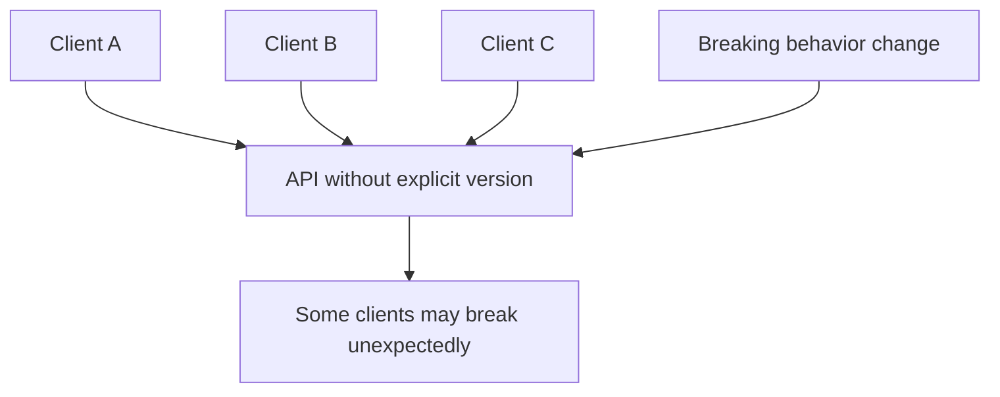

With version identifiers, clients can remain on the contract they understand while newer clients adopt newer behavior:

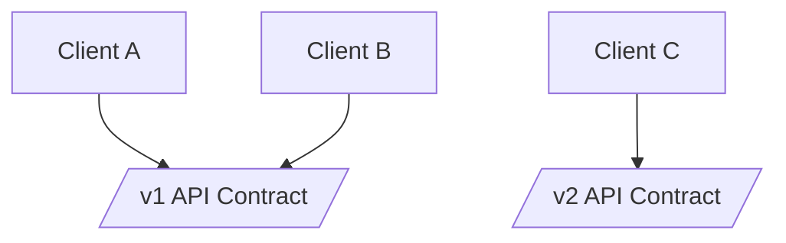

Version identifiers help with:

- breaking change isolation,
- gradual migration,
- client compatibility,
- support debugging,
- documentation clarity,
- contract testing,
- SDK generation,
- API gateway routing,
- observability by version,
- deprecation planning.

For example, an API gateway can log version usage per request:

```json
{
  "requestId": "req_123",
  "consumerId": "partner_acme",
  "apiVersion": "v1",
  "endpoint": "GET /orders/{orderId}",
  "statusCode": 200,
  "latencyMs": 48
}
```

This makes it possible to answer operational questions such as:

- Which consumers are still using `v1`?
- Which endpoints are blocking migration?
- Which partners need upgrade support?
- Is it safe to retire an old version?

---

**Use cases**

Use a version identifier when making breaking changes such as:

- removing a field,
- renaming a field,
- changing a field type,
- changing response structure,
- changing error codes,
- changing pagination behavior,
- changing authentication requirements,
- changing validation rules,
- changing business semantics,
- replacing endpoint behavior,
- changing default sorting or filtering behavior,
- changing webhook payload shape,
- changing event schema compatibility.

Example breaking response change:

Version 1:

```json
{
  "orderId": "ord_123",
  "total": 129.99
}
```

Version 2:

```json
{
  "orderId": "ord_123",
  "totalAmount": {
    "amount": 129.99,
    "currency": "USD"
  }
}
```

This is a breaking change because clients reading `total` as a number will fail or behave incorrectly.

Use version identifiers for:

- public REST APIs,
- partner APIs,
- GraphQL schemas,
- API specifications,
- generated SDKs,
- webhook contracts,
- event schemas,
- mobile backend APIs,
- internal platform APIs with many consumers,
- data export contracts,
- long-lived enterprise integrations.

---

**Version identifier styles**

There are several common styles.

##### Path versioning

```http
GET /v1/orders/ord_123
GET /v2/orders/ord_123
```

Benefits:

- easy to see,
- easy to route,
- easy to document,
- friendly to simple clients,
- common in public APIs.

Trade-off:

- the version becomes part of every URL,
- it may suggest the entire API changes at once,
- it can be awkward for resource links that should remain stable.

##### Header versioning

```http
GET /orders/ord_123
API-Version: 2026-04-30
```

Benefits:

- keeps URLs stable,
- can support date-based API versions,
- can allow different clients to use different versions of the same endpoint.

Trade-off:

- version is less visible,
- harder to test manually in a browser,
- caches and proxies must vary correctly by header.

##### Media type versioning

```http
Accept: application/vnd.example.orders.v2+json
```

Benefits:

- ties version to representation format,
- aligns with HTTP content negotiation,
- useful when the same resource can have multiple representations.

Trade-off:

- more complex for many client developers,
- harder to communicate in simple documentation,
- can be overkill for many APIs.

##### Date-based versioning

```http
API-Version: 2026-04-30
```

Benefits:

- clearly identifies the contract date,
- avoids endless `v1`, `v2`, `v3` debates,
- works well when providers release many small compatibility boundaries.

Trade-off:

- consumers need clear documentation for what changed on each date,
- providers must keep many date-based behaviors understandable.

---

**Implementation example**

A simple API version selection middleware:

```ts
type ApiVersion = "2026-01-01" | "2026-04-30";

type VersionedRequest = Request & {
  apiVersion?: ApiVersion;
};

const supportedVersions: ApiVersion[] = ["2026-01-01", "2026-04-30"];
const defaultVersion: ApiVersion = "2026-04-30";

function selectApiVersion(req: VersionedRequest, res: Response, next: NextFunction) {
  const requestedVersion = req.header("API-Version") as ApiVersion | undefined;
  const version = requestedVersion ?? defaultVersion;

  if (!supportedVersions.includes(version)) {
    res.status(400).json({
      error: "UNSUPPORTED_API_VERSION",
      message: `API version ${version} is not supported.`,
      supportedVersions
    });
    return;
  }

  req.apiVersion = version;
  res.setHeader("API-Version", version);
  next();
}
```

A route can then shape behavior based on the selected version:

```ts
app.get("/orders/:orderId", selectApiVersion, async (req: VersionedRequest, res) => {
  const order = await orderRepository.findById(req.params.orderId);

  if (!order) {
    res.status(404).json({
      error: "ORDER_NOT_FOUND",
      message: "The requested order was not found."
    });
    return;
  }

  if (req.apiVersion === "2026-01-01") {
    res.json({
      orderId: order.id,
      total: order.totalAmount.amount
    });
    return;
  }

  res.json({
    orderId: order.id,
    totalAmount: {
      amount: order.totalAmount.amount,
      currency: order.totalAmount.currency
    }
  });
});
```

This approach should be used carefully. Too many inline version branches can make the codebase difficult to maintain. For larger changes, separate controllers, adapters, schema serializers, or route modules may be better.

---

**Trade-offs**

Version identifiers are useful, but they have costs.

**1. Versioning creates maintenance overhead**

Every supported version may need documentation, tests, monitoring, SDK support, and bug fixes.

**2. Too many versions fragment the API**

If every small change creates a new version, consumers may become confused and providers may be forced to support many nearly identical contracts.

**3. Version placement affects usability**

Path versions are visible but can clutter URLs. Header versions keep URLs clean but are easier to miss.

**4. Versioning does not replace compatibility discipline**

A provider should still make backward-compatible changes when possible instead of creating unnecessary versions.

**5. Version identifiers become operational contracts**

Once clients depend on a version, removing it requires communication, migration support, and usage tracking.

Use version identifiers for meaningful compatibility boundaries. Do not use them as a substitute for careful API design.

---

#### Semantic Versioning

**What it is**

**Semantic Versioning** uses structured version numbers to communicate the type of change being released.

The common format is:

```text
MAJOR.MINOR.PATCH
```

Example:

```text
2.4.1
```

The usual meaning is:

| Part | Meaning | Example change |
|---|---|---|
| Major | Breaking change | Rename `total` to `totalAmount` |
| Minor | Backward-compatible feature | Add optional `discountCode` field |
| Patch | Backward-compatible fix | Correct documentation or fix incorrect rounding |

The central idea is:

> A version number should communicate upgrade risk.

Semantic versioning is common for SDKs, libraries, schemas, and specifications. It can also be useful for APIs, but it must be adapted carefully because APIs are long-lived contracts used over a network.

Example OpenAPI artifact version:

```yaml
openapi: 3.1.0
info:
  title: Orders API
  version: 2.3.0
```

Example event schema version:

```json
{
  "schemaName": "OrderCreated",
  "schemaVersion": "1.2.0",
  "eventId": "evt_123",
  "occurredAt": "2026-04-30T10:15:00Z"
}
```

---

**What it solves**

Semantic versioning solves the problem of unclear upgrade risk.

Without semantic meaning, version numbers are just labels:

```text
orders-api version 8
orders-api version 9
```

A consumer cannot easily tell whether upgrading from `8` to `9` is safe.

With semantic versioning:

```text
1.4.2 -> 1.4.3  likely low risk patch
1.4.2 -> 1.5.0  new backward-compatible capability
1.4.2 -> 2.0.0  breaking change
```

This helps consumers decide:

- whether they can upgrade automatically,
- whether they need regression testing,
- whether code changes are required,
- whether generated clients need regeneration,
- whether a migration project is necessary.

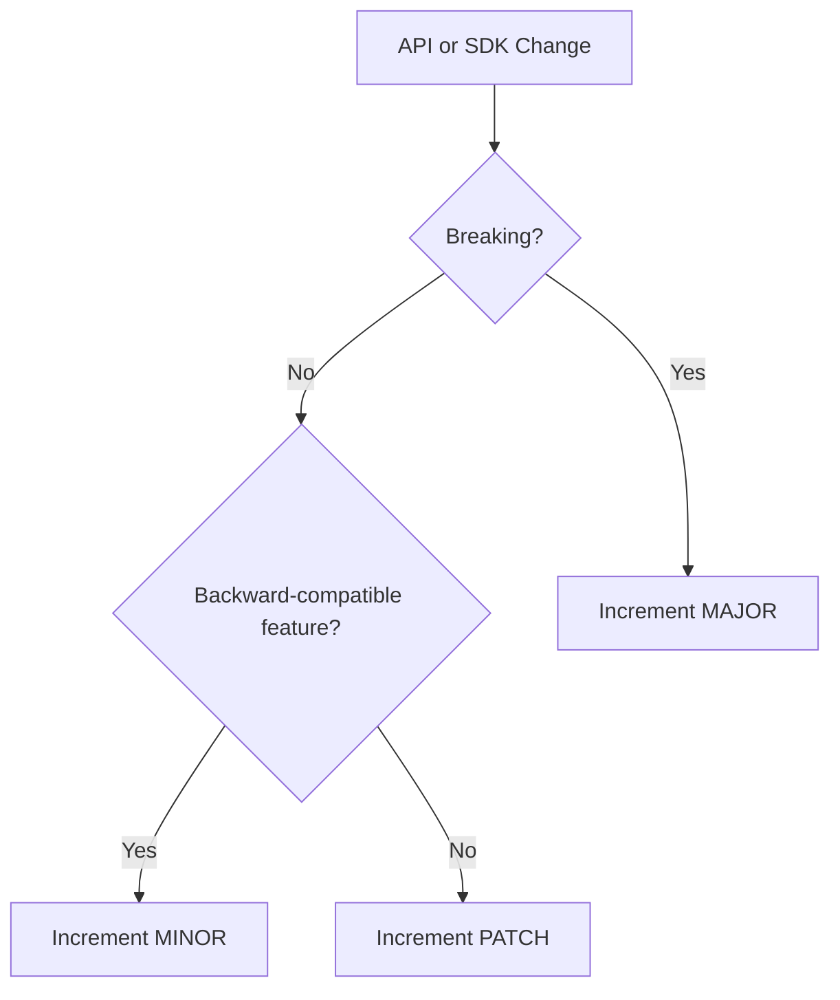

Semantic versioning is most valuable when providers and consumers share a clear definition of compatibility.

---

**Use cases**

Use semantic versioning for:

- SDKs,
- client libraries,
- API schemas,
- OpenAPI documents,
- AsyncAPI documents,
- event contracts,
- webhook payload schemas,
- generated clients,
- API gateway plugins,
- infrastructure modules,
- public developer platforms,
- internal platform packages,
- schema registries.

Example SDK package:

```json
{
  "name": "@example/orders-sdk",
  "version": "3.1.0",
  "peerApiVersion": "2026-04-30"
}
```

Example schema registry entry:

```json
{
  "schemaName": "PaymentAuthorized",
  "version": "1.3.0",
  "compatibility": "BACKWARD",
  "status": "active"
}
```

Semantic versioning is especially useful when clients install a versioned artifact and choose when to upgrade.

---

**What counts as breaking**

A shared definition of breaking change is essential.

Common breaking changes include:

- removing a field,
- renaming a field,
- changing a field type,
- making an optional field required,
- changing enum values in a way clients cannot tolerate,
- changing error codes,
- changing authentication requirements,
- changing pagination format,
- changing idempotency behavior,
- changing webhook delivery semantics,
- changing validation rules,
- changing default sort order if clients rely on ordering,
- changing response meaning without changing shape.

Example breaking change:

```diff
{
  "orderId": "ord_123",
- "status": "paid"
+ "paymentStatus": "PAID"
}
```

Example backward-compatible additive change:

```diff
{
  "orderId": "ord_123",
  "status": "PAID",
+ "authorizedAt": "2026-04-30T10:15:00Z"
}
```

Adding optional fields is usually backward-compatible for robust JSON clients. However, it can still break fragile clients that reject unknown fields. API providers should document that clients must ignore unknown fields unless a strict schema contract says otherwise.

---

**Compatibility policy**

A semantic versioning policy should be written down.

Example policy:

```text
The Orders API schema uses semantic versioning.

- Major versions contain breaking changes.
- Minor versions add backward-compatible fields, endpoints, enum values, or capabilities.
- Patch versions fix documentation, examples, validation bugs, or behavior that was inconsistent with the published contract.
- Clients must ignore unknown response fields.
- Clients must not rely on undocumented fields.
```

Example schema compatibility rules:

```yaml
compatibilityRules:
  responseFields:
    addOptionalField: minor
    removeField: major
    renameField: major
    changeFieldType: major
  requestFields:
    addOptionalRequestField: minor
    makeOptionalFieldRequired: major
  errors:
    addNewErrorCode: minor
    removeErrorCode: major
    changeErrorMeaning: major
```

The important part is not the exact policy. The important part is that the policy is explicit and consistently enforced.

---

**Implementation example**

A release checker can compare schema changes and recommend a version bump.

```ts
type ChangeType = "breaking" | "feature" | "fix";

type Version = {
  major: number;
  minor: number;
  patch: number;
};

function nextVersion(current: Version, changeType: ChangeType): Version {
  if (changeType === "breaking") {
    return {
      major: current.major + 1,
      minor: 0,
      patch: 0
    };
  }

  if (changeType === "feature") {
    return {
      major: current.major,
      minor: current.minor + 1,
      patch: 0
    };
  }

  return {
    major: current.major,
    minor: current.minor,
    patch: current.patch + 1
  };
}
```

For real APIs, this should be combined with automated contract checks.

Example CI gate:

```yaml
steps:
  - name: Compare OpenAPI contracts
    run: npm run api:diff

  - name: Enforce version policy
    run: npm run api:version-check
```

The goal is to prevent accidental breaking changes from being released as minor or patch updates.

---

**Trade-offs**

**1. Semantic versioning requires discipline**

The version number is only useful if the provider consistently classifies changes.

**2. Compatibility can be subjective**

A change that is technically additive may still break clients that made assumptions about field ordering, enum completeness, or undocumented behavior.

**3. Network APIs are different from libraries**

A library consumer installs a version. An API consumer may call a server that changes independently. Semantic versioning must be paired with deployment and support policies.

**4. Version numbers can create false confidence**

A minor version does not guarantee zero risk. It only signals that the provider intends the change to be backward-compatible.

**5. Too much precision can distract from migration support**

Consumers usually care less about the number itself and more about what changed, whether they are affected, and how to upgrade.

Semantic versioning is strongest when paired with changelogs, compatibility tests, contract testing, and clear deprecation policies.

---

#### Two In Production

**What it is**

**Two In Production** means running two API versions in production at the same time.

For example:

```http
GET /v1/orders/ord_123
GET /v2/orders/ord_123
```

Both versions are live, monitored, documented, and supported during a migration window.

The central idea is:

> Keep the old version available while clients migrate to the new version.

This pattern does not literally have to mean exactly two versions in every situation. The principle is that the provider intentionally supports the current stable version and the next version during transition. However, limiting active versions to two is a common way to control operational complexity.

---

**What it solves**

Two In Production solves the problem of coordinated upgrade failure.

Many API consumers cannot upgrade at the same time. Mobile apps wait for app store release cycles. Enterprise partners may have quarterly deployment windows. Internal teams may have their own backlogs and dependencies.

Without overlap:

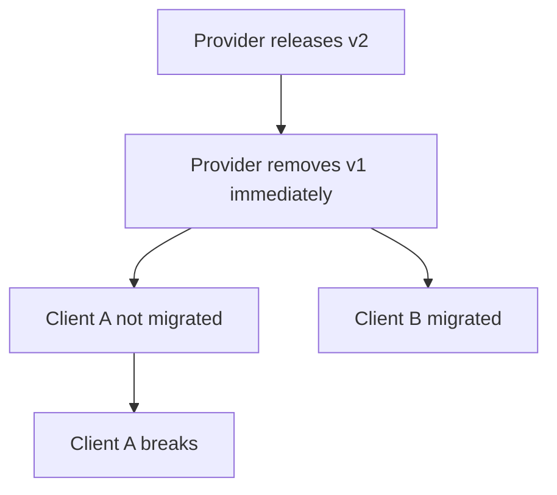

With Two In Production:

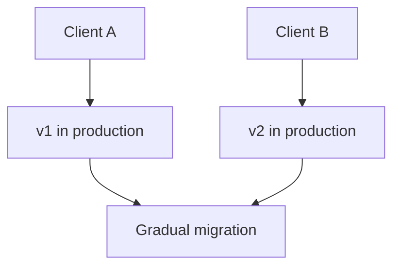

This enables:

- gradual migration,
- lower release risk,
- consumer-by-consumer rollout,
- rollback options,
- comparison testing,
- canary adoption,
- better support planning,
- usage-based deprecation decisions.

---

**Use cases**

Use Two In Production for:

- breaking API changes,
- public APIs,
- partner APIs,
- enterprise integrations,
- mobile APIs,
- SDK-backed APIs,
- APIs with unknown or unmanaged consumers,
- high-value integrations,
- migrations that require client code changes,
- major schema upgrades,
- authentication model changes,
- event contract migrations.

Example migration from `v1` to `v2`:

```text
2026-04-30: v2 released
2026-05-15: new consumers default to v2
2026-06-30: v1 enters deprecation period
2026-09-30: v1 removed for standard plans
2026-12-31: v1 removed for enterprise exceptions
```

This gives consumers a clear window to plan and execute migration.

---

**Operating two versions**

Two versions can be implemented in several ways.

##### Separate route handlers

```ts
app.get("/v1/orders/:orderId", getOrderV1);
app.get("/v2/orders/:orderId", getOrderV2);
```

Benefits:

- clear separation,
- easy to reason about,
- version-specific tests are straightforward.

Trade-off:

- duplicated logic if not factored carefully.

##### Shared domain logic with versioned serializers

```ts
const order = await orderService.getOrder(orderId);

if (apiVersion === "v1") {
  return serializeOrderV1(order);
}

return serializeOrderV2(order);
```

Benefits:

- shared business logic,
- version-specific representation mapping,
- reduced duplication.

Trade-off:

- branching can become messy if many versions are supported.

##### Gateway routing

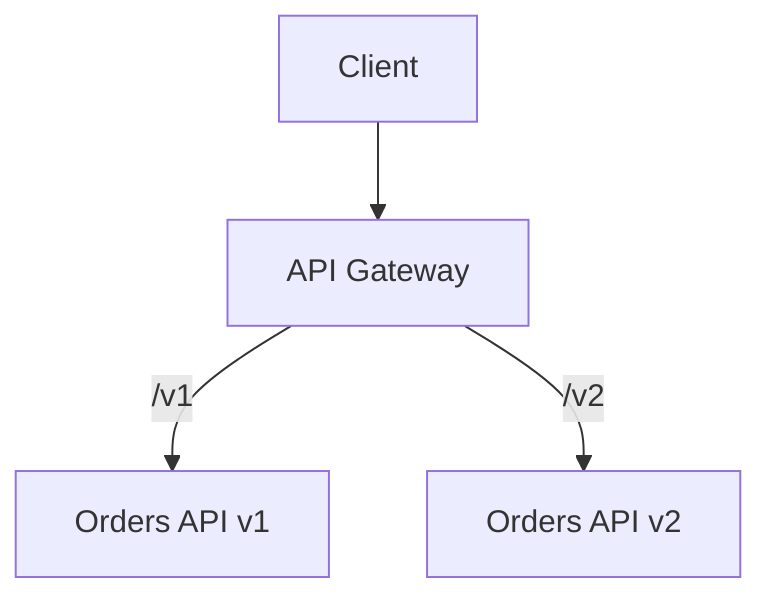

Benefits:

- strong isolation,
- safer for major rewrites,
- independent deployment possible.

Trade-off:

- more infrastructure and operational overhead.

---

**Migration management**

Running two versions is not enough. The provider also needs migration management.

Important practices:

- publish a migration guide,
- provide examples before and after,
- expose usage dashboards by consumer and version,
- send deprecation notices,
- support test environments,
- provide SDKs or code samples,
- monitor error rates after migration,
- offer temporary exceptions for critical consumers,
- define a final removal date.

Example usage report:

```json
{
  "apiVersion": "v1",
  "activeConsumers": 42,
  "requestsLast30Days": 12893412,
  "topEndpoints": [
    "GET /v1/orders/{orderId}",
    "POST /v1/orders",
    "GET /v1/customers/{customerId}"
  ],
  "plannedRetirementDate": "2026-09-30"
}
```

This helps the provider avoid retiring a version while important consumers still depend on it.

---

**Trade-offs**

**1. Running multiple versions increases cost**

Each version may require infrastructure, tests, documentation, bug fixes, security patches, monitoring, and support.

**2. Bug fixes may need to be applied twice**

A defect in shared behavior may need to be fixed in both versions.

**3. Operational dashboards become more complex**

Providers need to know which version is failing, not just whether the API is failing.

**4. Data model changes can be hard**

If `v2` requires a new internal model, `v1` may need compatibility adapters.

**5. Versions can live too long**

Without a clear retirement policy, temporary coexistence can become permanent support burden.

Two In Production is valuable for safe migration, but it should be paired with a clear deprecation and retirement plan.

---

#### Aggressive Obsolescence

**What it is**

**Aggressive Obsolescence** retires old API versions or behaviors quickly after a replacement is available.

For example:

```text
v1 deprecated on 2026-04-30
v1 retired on 2026-05-31
```

The central idea is:

> Remove old contracts quickly when the cost or risk of keeping them is greater than the cost of forcing migration.

This pattern is intentionally different from long-lived compatibility. It favors provider agility, reduced maintenance, and faster removal of risky or expensive behavior.

---

**What it solves**

Aggressive obsolescence solves the problem of version accumulation.

Without retirement discipline, an API provider can end up supporting too many versions:

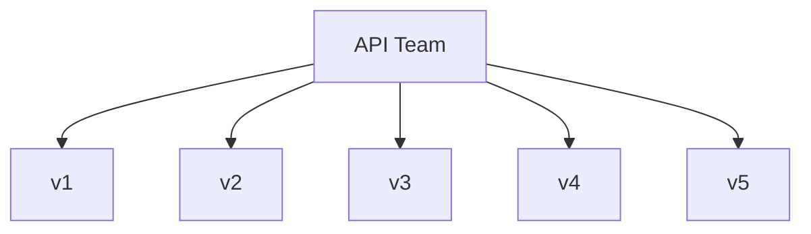

This can create:

- slow delivery,
- duplicated bug fixes,
- security exposure,
- confusing documentation,
- inconsistent behavior,
- high support cost,
- fragile legacy code,
- inability to modernize architecture.

With aggressive obsolescence, old versions are intentionally removed:

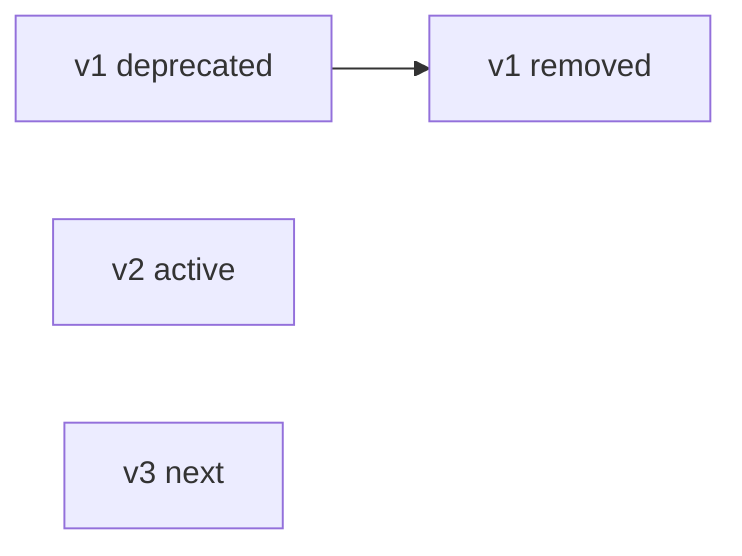

This keeps the API surface smaller and easier to operate.

---

**Use cases**

Use aggressive obsolescence for:

- internal APIs with coordinated consumers,
- APIs used by a small number of known teams,
- security-driven deprecations,
- privacy-driven deprecations,
- compliance-driven changes,
- expensive legacy endpoints,
- endpoints with high operational risk,
- beta or preview APIs,
- low-usage features,
- APIs behind a single controlled client,
- systems where provider speed matters more than long compatibility.

Example security-driven retirement:

```text
The /v1/tokens endpoint accepts legacy credentials that no longer meet security requirements.
It will be disabled on 2026-05-15.
All consumers must migrate to /v2/tokens before that date.
```

In this case, keeping the old endpoint may be more dangerous than forcing migration.

---

**Obsolescence process**

Aggressive does not mean careless. A good obsolescence process still has structure.

Typical steps:

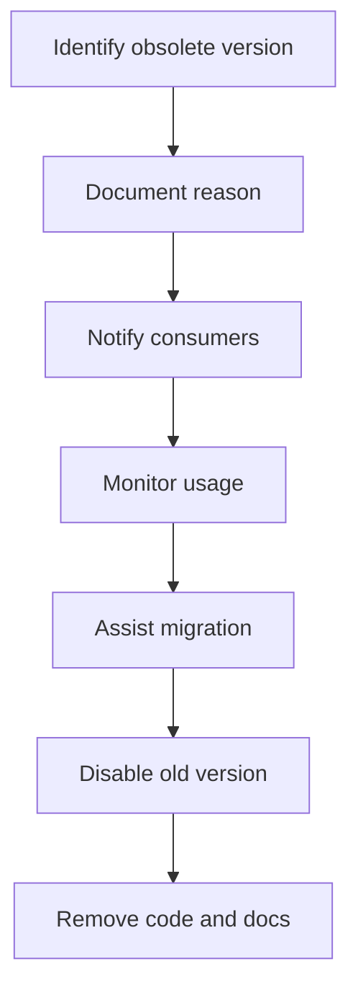

Important communication details:

- what is being retired,
- why it is being retired,
- who is affected,
- replacement endpoint or version,
- migration steps,
- deadline,
- support contact,
- what will happen after the deadline.

Example response header during deprecation:

```http
HTTP/1.1 200 OK
Deprecation: true
Sunset: Wed, 31 May 2026 23:59:59 GMT
Link: <https://docs.example.com/migrations/orders-v2>; rel="deprecation"
```

Example warning body field:

```json
{
  "orderId": "ord_123",
  "status": "CONFIRMED",
  "warnings": [
    {
      "code": "API_VERSION_DEPRECATED",
      "message": "v1 will be retired on 2026-05-31. Please migrate to v2."
    }
  ]
}
```

Headers are often better than body warnings because they do not change the response schema unexpectedly.

---

**Implementation example**

A middleware can emit deprecation and sunset headers for obsolete versions:

```ts
type DeprecatedVersionConfig = {
  version: string;
  sunsetAt: string;
  migrationUrl: string;
};

const deprecatedVersions: Record<string, DeprecatedVersionConfig> = {
  v1: {
    version: "v1",
    sunsetAt: "Wed, 31 May 2026 23:59:59 GMT",
    migrationUrl: "https://docs.example.com/migrations/orders-v2"
  }
};

function deprecationHeaders(req: Request, res: Response, next: NextFunction) {
  const version = req.params.version;
  const config = deprecatedVersions[version];

  if (config) {
    res.setHeader("Deprecation", "true");
    res.setHeader("Sunset", config.sunsetAt);
    res.setHeader("Link", `<${config.migrationUrl}>; rel="deprecation"`);
  }

  next();
}
```

After the sunset date, the provider can reject calls:

```json
{
  "error": "API_VERSION_RETIRED",
  "message": "API version v1 has been retired. Use v2 instead.",
  "migrationUrl": "https://docs.example.com/migrations/orders-v2"
}
```

---

**Trade-offs**

**1. Short migration windows can break consumers**

If consumers cannot move quickly enough, their integrations may fail.

**2. Communication must be strong**

Aggressive retirement requires repeated notices, direct outreach, and usage monitoring.

**3. It may reduce consumer trust**

Public API consumers may avoid a platform that changes too quickly.

**4. Exceptions can undermine the policy**

If many consumers receive extensions, the provider may still end up supporting the obsolete version.

**5. It is not appropriate for every API**

Mission-critical external APIs often require longer support windows.

Aggressive obsolescence is best when the provider controls the consumers, the old version is risky, or the migration cost is lower than the cost of continued support.

---

#### Experimental Preview

**What it is**

An **Experimental Preview** exposes an API feature early with the understanding that it may change before becoming stable.

Example request:

```http
POST /v1/recommendations HTTP/1.1
Host: api.example.com
X-Experimental-Features: recommendation-ranking-v2
Content-Type: application/json
```

Example response:

```json
{
  "recommendations": [
    {
      "productId": "prod_123",
      "score": 0.94,
      "reason": "similar_purchase_history"
    }
  ],
  "preview": {
    "feature": "recommendation-ranking-v2",
    "stability": "experimental"
  }
}
```

The central idea is:

> Let consumers try new capabilities before the provider commits to a permanent contract.

Experimental preview is useful because some API designs cannot be validated fully in isolation. Real consumers reveal missing fields, confusing semantics, performance limits, security concerns, and workflow mismatches.

---

**What it solves**

Experimental preview solves the problem of committing too early.

Without preview, a provider may publish a stable API and later discover that the contract is wrong:

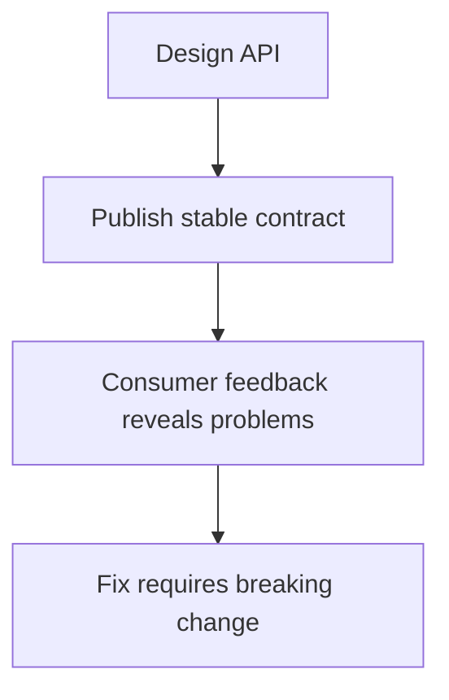

With preview:

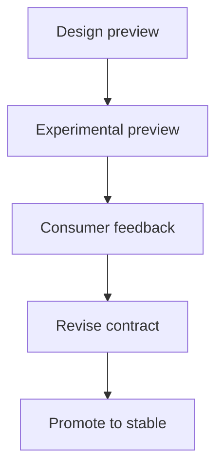

This enables:

- early feedback,
- partner validation,
- performance testing,
- usability testing,
- schema refinement,
- safer innovation,
- staged rollout,
- reduced risk before stable release.

---

**Use cases**

Use experimental preview for:

- beta features,
- new endpoints,
- new response formats,
- new algorithms,
- AI-backed features,
- ranking or recommendation systems,
- early partner testing,
- research-backed workflows,
- new bulk operations,
- new event types,
- new SDK capabilities,
- new authentication models,
- features with uncertain product-market fit.

Example preview endpoint:

```http
POST /preview/invoices/extract
Content-Type: application/json
```

Example preview feature flag:

```http
GET /orders/ord_123
X-Preview: order-risk-signals
```

Example preview field:

```json
{
  "orderId": "ord_123",
  "status": "CONFIRMED",
  "experimentalRiskSignals": {
    "riskLevel": "LOW",
    "modelVersion": "risk-preview-2026-04"
  }
}
```

Preview fields should be clearly labeled to avoid accidental reliance.

---

**Preview contracts**

A preview API should still have a contract, but the contract should state its stability level.

Example documentation notice:

```text
This endpoint is in Experimental Preview.

- The request and response schema may change.
- The endpoint may be unavailable in some regions.
- Availability and latency are not covered by the production SLA.
- Consumers should not use this endpoint for critical production workflows without written approval.
- Breaking changes may be announced with shorter notice than stable APIs.
```

Example stability metadata:

```yaml
endpoint: POST /preview/invoices/extract
stability: experimental
introducedAt: 2026-04-30
expectedReviewDate: 2026-06-30
slaCovered: false
breakingChangeNotice: best-effort
```

Clear labeling prevents consumers from confusing preview behavior with stable behavior.

---

**Promotion to stable**

A preview should have a path to stability or removal.

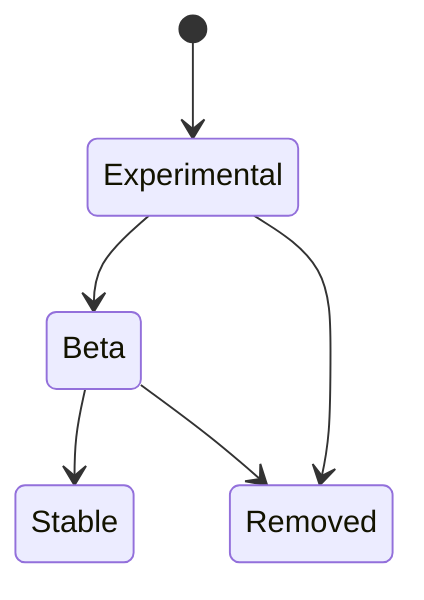

Example promotion criteria:

| Criterion | Example requirement |
|---|---|
| Consumer feedback | At least 5 design partners validate workflow |
| Reliability | Error rate below 0.5 percent for 30 days |
| Performance | p95 latency below 500 ms |
| Security | Security review completed |
| Documentation | Stable docs and examples published |
| Observability | Dashboards and alerts in place |
| Support | Support runbook completed |

Once promoted to stable, the API should follow the normal compatibility and deprecation policy.

---

**Implementation example**

Preview features can be gated by explicit opt-in.

```ts
const previewFeatures = new Set([
  "order-risk-signals",
  "recommendation-ranking-v2"
]);

function requirePreviewFeature(featureName: string) {
  return function previewMiddleware(req: Request, res: Response, next: NextFunction) {
    const requested = req.header("X-Preview")?.split(",").map(value => value.trim()) ?? [];

    if (!requested.includes(featureName)) {
      res.status(400).json({
        error: "PREVIEW_FEATURE_REQUIRED",
        message: `This endpoint requires preview feature ${featureName}.`,
        feature: featureName
      });
      return;
    }

    if (!previewFeatures.has(featureName)) {
      res.status(404).json({
        error: "PREVIEW_FEATURE_NOT_FOUND",
        message: `Preview feature ${featureName} is not available.`
      });
      return;
    }

    res.setHeader("X-API-Stability", "experimental");
    next();
  };
}
```

This makes preview usage explicit and observable.

---

**Trade-offs**

**1. Preview APIs can create accidental dependencies**

Consumers may build production workflows on unstable behavior despite warnings.

**2. Labels must be clear**

If preview status is hidden or vague, consumers may assume stability.

**3. Support expectations can become confusing**

Teams need to know whether preview features are supported by normal support channels and SLAs.

**4. Too many previews create clutter**

A platform with many unfinished APIs can feel unstable.

**5. Preview must not become permanent limbo**

Every preview should eventually become stable, be replaced, or be removed.

Experimental preview is best when the provider needs real-world feedback but is not ready to make a long-term compatibility promise.

---

#### Limited Lifetime Guarantee

**What it is**

A **Limited Lifetime Guarantee** promises support for an API version, endpoint, schema, or contract for a defined time period.

Example:

```text
API versions are supported for at least 24 months after their release date.
Deprecated versions receive at least 6 months of notice before retirement.
```

The central idea is:

> Give consumers a predictable support window while still allowing the provider to retire old contracts.

A limited lifetime guarantee is a middle ground between aggressive obsolescence and eternal support.

---

**What it solves**

Limited lifetime guarantees solve the tension between consumer stability and provider maintainability.

Consumers need time to migrate. Providers need the ability to remove old code.

Without a guarantee, consumers do not know how long a version will last:

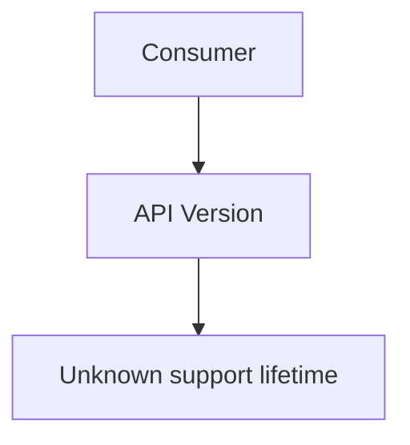

With a limited lifetime guarantee:

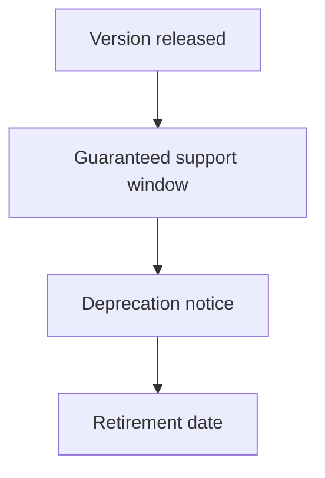

This improves:

- migration planning,
- enterprise trust,
- roadmap clarity,
- support operations,
- contract governance,
- version lifecycle management.

---

**Use cases**

Use limited lifetime guarantees for:

- public APIs,
- partner APIs,
- enterprise integrations,
- versioned APIs,
- mobile APIs,
- SDK-backed APIs,
- webhook contracts,
- event schemas,
- contract migrations,
- paid API products,
- internal platforms with many independent teams.

Example policy:

```text
Each major API version is supported for at least 24 months.
After a replacement version is released, the previous version will receive at least 6 months of deprecation notice before removal.
Security fixes may require faster migration in exceptional cases.
```

This policy gives consumers enough predictability to plan upgrades.

---

**Lifecycle model**

A limited lifetime guarantee usually has clear lifecycle states.

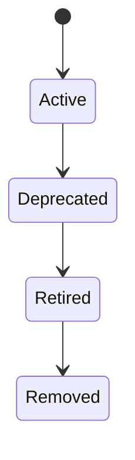

Example lifecycle definitions:

| State | Meaning |
|---|---|
| Active | Fully supported and recommended for use |
| Deprecated | Still available, but migration is recommended or required |
| Retired | No longer available to most consumers |
| Removed | Code, docs, and support references have been removed |

Example version lifecycle record:

```json
{
  "version": "v1",
  "releasedAt": "2024-04-30T00:00:00Z",
  "deprecatedAt": "2026-04-30T00:00:00Z",
  "retiredAt": "2026-10-31T00:00:00Z",
  "replacementVersion": "v2",
  "status": "deprecated"
}
```

This record can drive documentation, headers, dashboards, and customer notifications.

---

**Deprecation notices**

Limited lifetime guarantees depend on clear notices.

Good notices include:

- affected API version or endpoint,
- current status,
- replacement version,
- migration guide,
- deadline,
- support contact,
- consequences after retirement.

Example response headers:

```http
Deprecation: true
Sunset: Sat, 31 Oct 2026 23:59:59 GMT
Link: <https://docs.example.com/migrations/v1-to-v2>; rel="deprecation"
```

Example developer portal notice:

```text
Orders API v1 is deprecated.

- Replacement: Orders API v2
- Deprecated: 2026-04-30
- Retirement: 2026-10-31
- Migration guide: v1 to v2 Orders API migration
```

Repeated communication is usually necessary. A single announcement is rarely enough.

---

**Implementation example**

A version registry can centralize lifecycle metadata.

```ts
type ApiVersionStatus = "active" | "deprecated" | "retired";

type ApiVersionLifecycle = {
  version: string;
  status: ApiVersionStatus;
  releasedAt: string;
  deprecatedAt?: string;
  retiredAt?: string;
  replacementVersion?: string;
  migrationUrl?: string;
};

const versionLifecycles: Record<string, ApiVersionLifecycle> = {
  v1: {
    version: "v1",
    status: "deprecated",
    releasedAt: "2024-04-30T00:00:00Z",
    deprecatedAt: "2026-04-30T00:00:00Z",
    retiredAt: "2026-10-31T00:00:00Z",
    replacementVersion: "v2",
    migrationUrl: "https://docs.example.com/migrations/v1-to-v2"
  },
  v2: {
    version: "v2",
    status: "active",
    releasedAt: "2026-04-30T00:00:00Z"
  }
};
```

Middleware can use this registry to warn or reject requests:

```ts
function enforceVersionLifecycle(req: Request, res: Response, next: NextFunction) {
  const version = req.params.version;
  const lifecycle = versionLifecycles[version];

  if (!lifecycle) {
    res.status(404).json({
      error: "API_VERSION_NOT_FOUND",
      message: `API version ${version} does not exist.`
    });
    return;
  }

  if (lifecycle.status === "retired") {
    res.status(410).json({
      error: "API_VERSION_RETIRED",
      message: `API version ${version} has been retired.`,
      replacementVersion: lifecycle.replacementVersion,
      migrationUrl: lifecycle.migrationUrl
    });
    return;
  }

  if (lifecycle.status === "deprecated") {
    res.setHeader("Deprecation", "true");

    if (lifecycle.retiredAt) {
      res.setHeader("Sunset", new Date(lifecycle.retiredAt).toUTCString());
    }
  }

  next();
}
```

---

**Trade-offs**

**1. Providers must track lifecycle dates**

Release, deprecation, and retirement dates must be accurate and visible.

**2. Consumers may wait until the deadline**

A long support window can reduce urgency.

**3. Exceptions create complexity**

Enterprise customers may negotiate extensions, which can weaken the standard policy.

**4. Security emergencies may require policy overrides**

A provider may need to retire behavior faster than promised if it creates serious risk.

**5. Documentation must stay synchronized**

Docs, SDKs, examples, changelogs, and support systems must all reflect lifecycle state.

Limited lifetime guarantees are useful when consumers need predictability but the provider cannot support every version forever.

---

#### Eternal Lifetime Guarantee

**What it is**

An **Eternal Lifetime Guarantee** promises that an API version, endpoint, schema, behavior, or contract will remain supported indefinitely or for a very long time.

Example:

```text
The /v1/license/verify endpoint will remain backward compatible indefinitely for existing embedded clients.
```

The central idea is:

> Some contracts are so widely deployed or difficult to update that the provider chooses long-term compatibility over design freedom.

The word “eternal” should be treated carefully. In practice, it usually means “indefinite support unless extraordinary circumstances occur,” not literally forever under every possible condition.

---

**What it solves**

Eternal lifetime guarantees solve the problem of consumers that are extremely difficult or impossible to update.

Examples include:

- embedded devices,
- installed enterprise software,
- long-lived mobile applications,
- standards-based integrations,
- government or regulated systems,
- industrial systems,
- critical infrastructure,
- large public ecosystems,
- libraries or SDKs that cannot be forced to upgrade.

Without a long-lived guarantee, these consumers may be unable to safely depend on the API.

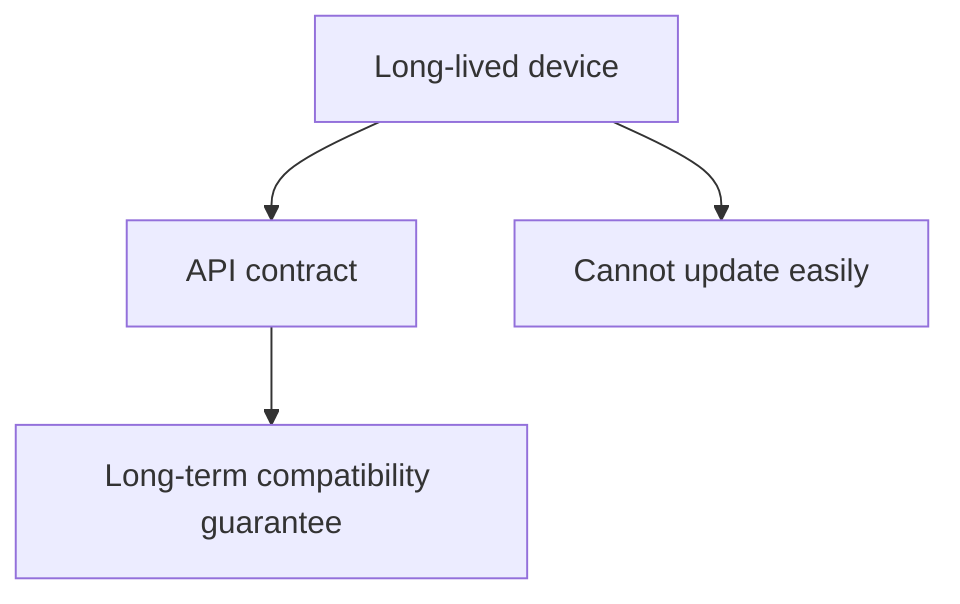

An eternal guarantee can provide maximum stability and adoption confidence.

---

**Use cases**

Use eternal lifetime guarantees rarely, usually for:

- public APIs with massive adoption,
- critical infrastructure APIs,
- standards-based APIs,
- embedded clients,
- hardware-integrated APIs,
- long-lived enterprise integrations,
- identity or license verification endpoints,
- regulatory reporting endpoints,
- foundational platform contracts,
- APIs where consumer update cycles are measured in years.

Example:

```http
POST /v1/license/verify
Content-Type: application/json
```

```json
{
  "licenseKey": "lic_123",
  "deviceId": "device_456"
}
```

If this endpoint is embedded in millions of devices, removing it may be impossible without harming customers.

---

**Designing for eternal support**

An API that may need eternal support should be designed conservatively.

Important design choices:

- keep the contract small,
- avoid exposing internal implementation details,
- avoid unstable business concepts,
- use extensible response shapes,
- allow unknown fields,
- use stable identifiers,
- avoid provider-specific quirks,
- support strong security upgrade paths,
- include clear error codes,
- design for operational isolation,
- document behavior precisely.

Example extensible response:

```json
{
  "licenseId": "lic_123",
  "status": "VALID",
  "expiresAt": "2027-04-30T00:00:00Z",
  "features": ["basic", "offline-sync"],
  "links": {
    "self": "/v1/licenses/lic_123"
  }
}
```

Avoid brittle behavior such as undocumented status strings, hidden field dependencies, or responses that mirror internal database tables.

---

**Compatibility adapter**

Long-lived APIs often survive by using adapters.

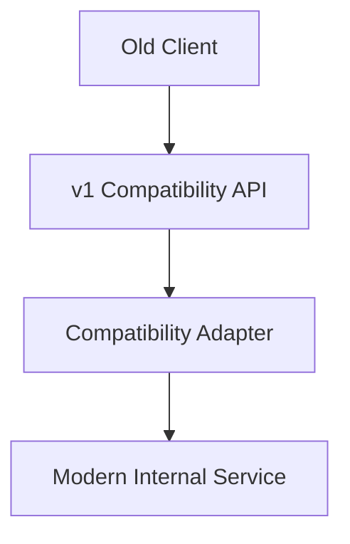

The old external contract remains stable while internal systems evolve.

Example adapter:

```ts
type ModernLicense = {
  id: string;
  state: "active" | "expired" | "revoked";
  validUntil?: string;
  enabledFeatures: string[];
};

function serializeLicenseV1(license: ModernLicense) {
  return {
    licenseId: license.id,
    status: license.state === "active" ? "VALID" : "INVALID",
    expiresAt: license.validUntil ?? null,
    features: license.enabledFeatures
  };
}
```

This isolates old response semantics from the modern internal model.

---

**Limits to eternal promises**

Even long-lived guarantees need boundaries.

A provider should define exceptions such as:

- severe security vulnerability,
- legal or regulatory requirement,
- abuse or fraud risk,
- third-party dependency shutdown,
- infrastructure impossibility,
- customer-specific contract termination.

Example policy language:

```text
This endpoint is intended for indefinite backward compatibility. We may make changes only when necessary for security, legal compliance, abuse prevention, or continued service operation.
```

This protects the provider from impossible obligations while still giving consumers strong stability expectations.

---

**Trade-offs**

**1. Eternal support is expensive**

The provider may need to maintain old code, adapters, tests, documentation, and monitoring indefinitely.

**2. Bad design decisions can become permanent**

If the original API shape is awkward, the provider may have to support that awkwardness for years.

**3. Security modernization is harder**

Old clients may not support modern authentication, encryption, or protocol requirements.

**4. Innovation can slow down**

Teams may avoid improvements because compatibility risk is too high.

**5. Operational complexity accumulates**

Long-lived endpoints need special runbooks, alerts, dashboards, and incident handling.

Use eternal lifetime guarantees only when the value of extreme stability is greater than the long-term maintenance cost.

---

#### Practical design checklist

Use this checklist when applying API evolution patterns.

**Version identity**

- Does the API need an explicit version identifier?
- Is the version in the path, header, media type, schema, or SDK artifact?
- Can support teams see which version a request used?
- Is version usage logged and measurable?
- Is the default version clear?
- Are unsupported versions rejected with useful errors?

**Change classification**

- Is the change breaking, additive, or patch-level?
- Is there a shared definition of breaking change?
- Do clients ignore unknown response fields?
- Are enum changes safe for existing consumers?
- Are error code changes considered contract changes?
- Are semantic changes reviewed even when the schema does not change?

**Migration strategy**

- Do old and new versions need to run in production at the same time?
- How long will overlap last?
- Is there a migration guide?
- Are before-and-after examples available?
- Are SDKs, schemas, and docs updated?
- Can consumers test the new version before migrating?

**Deprecation and retirement**

- Is the old version active, deprecated, retired, or removed?
- Is the retirement date published?
- Are deprecation headers or warnings returned?
- Are affected consumers identified?
- Are high-usage consumers contacted directly?
- Is there a policy for exceptions?

**Preview management**

- Is the feature stable, beta, or experimental?
- Is preview usage opt-in?
- Are compatibility guarantees clearly stated?
- Is preview usage excluded from normal SLA if appropriate?
- Is there a path to stable release or removal?
- Is feedback being collected?

**Lifetime guarantees**

- How long is each version guaranteed to be supported?
- Is the support window realistic?
- Are lifecycle dates tracked centrally?
- Are eternal guarantees avoided unless truly necessary?
- Are exceptions for security, compliance, or abuse documented?
- Are old contracts isolated behind adapters where possible?

A healthy API evolution design is likely if:

- versions are explicit,
- breaking changes are intentional,
- compatibility rules are documented,
- migration windows are planned,
- version usage is observable,
- deprecation notices are clear,
- preview features are clearly labeled,
- lifetime guarantees are realistic,
- and old contracts are retired or isolated deliberately.

An API evolution design is probably unhealthy if:

- clients discover breaking changes only after production failures,
- version numbers do not communicate anything useful,
- old versions never retire,
- previews silently become permanent contracts,
- deprecation dates are not tracked,
- consumers cannot tell which version they are using,
- support teams cannot identify affected clients,
- or eternal compatibility is promised casually.

---

#### Related patterns

| Pattern | Relationship |
|---|---|
| API Gateway | Often routes requests by version and can emit deprecation or sunset headers |
| Gateway Offloading | Can centralize version selection, compatibility routing, and lifecycle enforcement |
| Consumer-Driven Contracts | Helps detect breaking changes before release |
| Error Report | Version retirement and unsupported version errors should use structured error responses |
| Service Level Agreement | Lifetime guarantees and preview APIs may have different SLA coverage |
| API Key | Usage by key helps identify which consumers still use old versions |
| Rate Plan | Enterprise or premium plans may receive longer migration windows |
| Conditional Request | Versioned representations may need version-aware ETags and cache validators |
| Wish Template | Named response templates may need versioning when their shapes change |
| Embedded Entity | Embedded representations can create compatibility risk when related resources evolve |
| Linked Information Holder | Links can help evolve related resources independently |
| Observability | Version usage, deprecated endpoint calls, and migration progress require metrics and logs |
| Documentation | Versioning, changelogs, deprecations, and migration guides must be visible to consumers |

---

#### Summary

API Evolution patterns make API change safer, clearer, and more manageable.

The central idea is:

> A good API can evolve without surprising its consumers or trapping its provider in unnecessary legacy support.

Version Identifiers make the active contract explicit. Semantic Versioning communicates the risk of change. Two In Production allows gradual migration. Aggressive Obsolescence prevents old contracts from accumulating forever. Experimental Preview allows feedback before stability commitments. Limited Lifetime Guarantees balance consumer stability with provider maintainability. Eternal Lifetime Guarantees provide maximum compatibility for rare cases where consumers are extremely difficult to update.

A strong API evolution design has:

- explicit version identifiers,
- clear compatibility rules,
- disciplined semantic versioning,
- planned coexistence of old and new versions,
- documented deprecation and retirement policies,
- observable version usage,
- carefully labeled preview features,
- realistic support windows,
- and conservative use of eternal guarantees.

The trade-off is operational complexity. Every version, preview, migration path, and compatibility promise becomes part of the API provider’s responsibility. These responsibilities should be documented, tested, monitored, and governed carefully.
